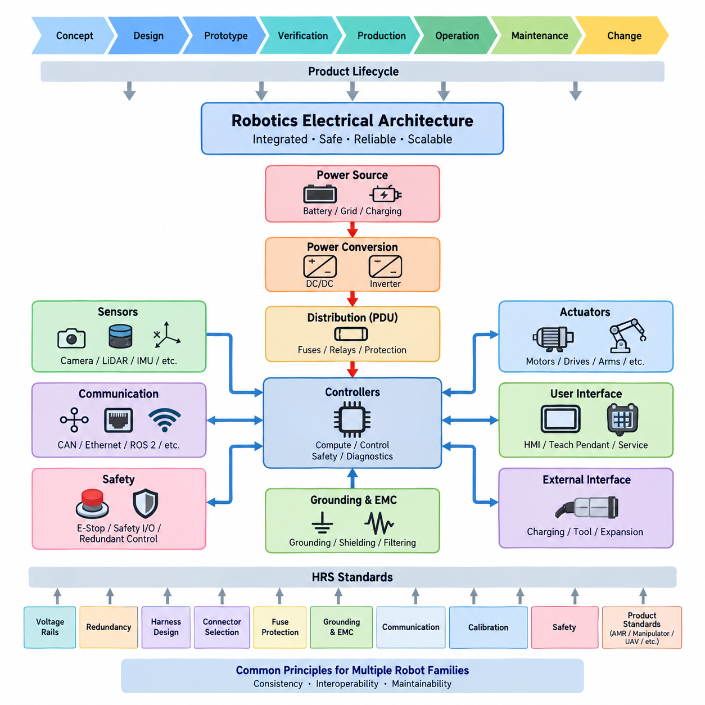
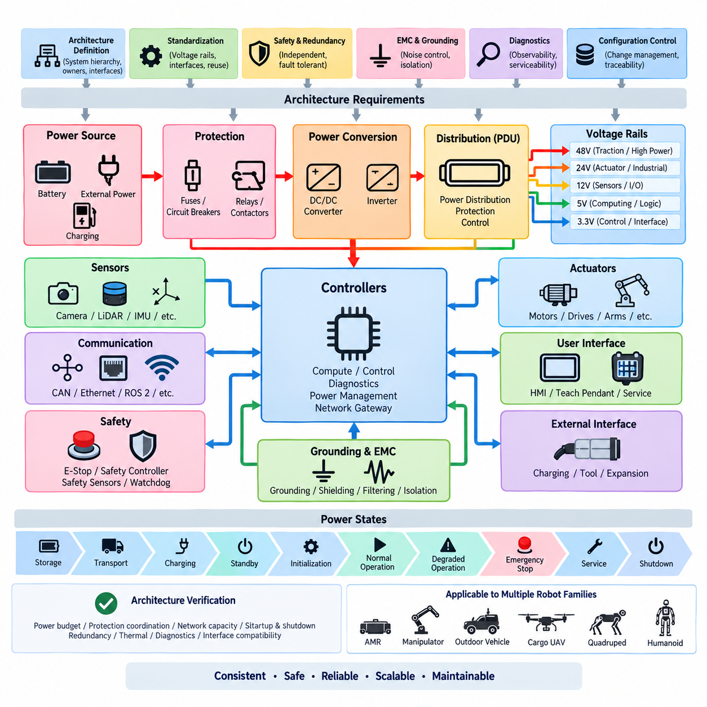
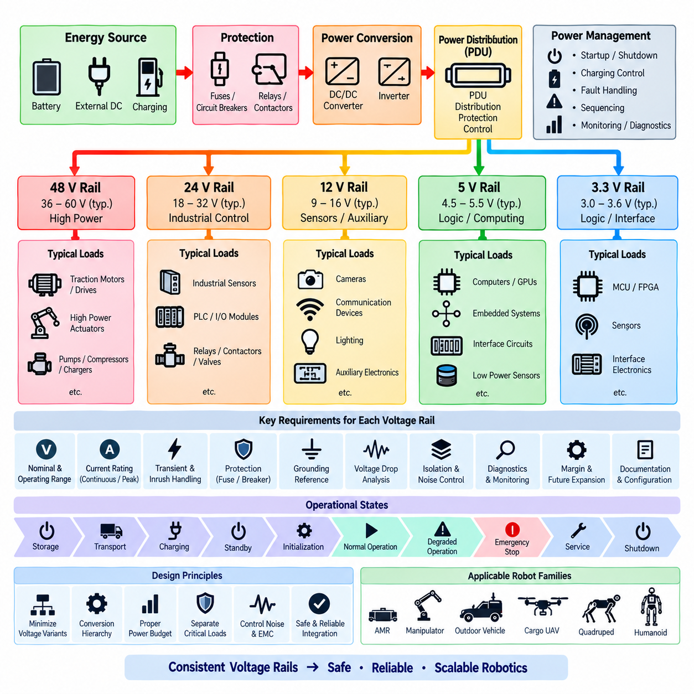
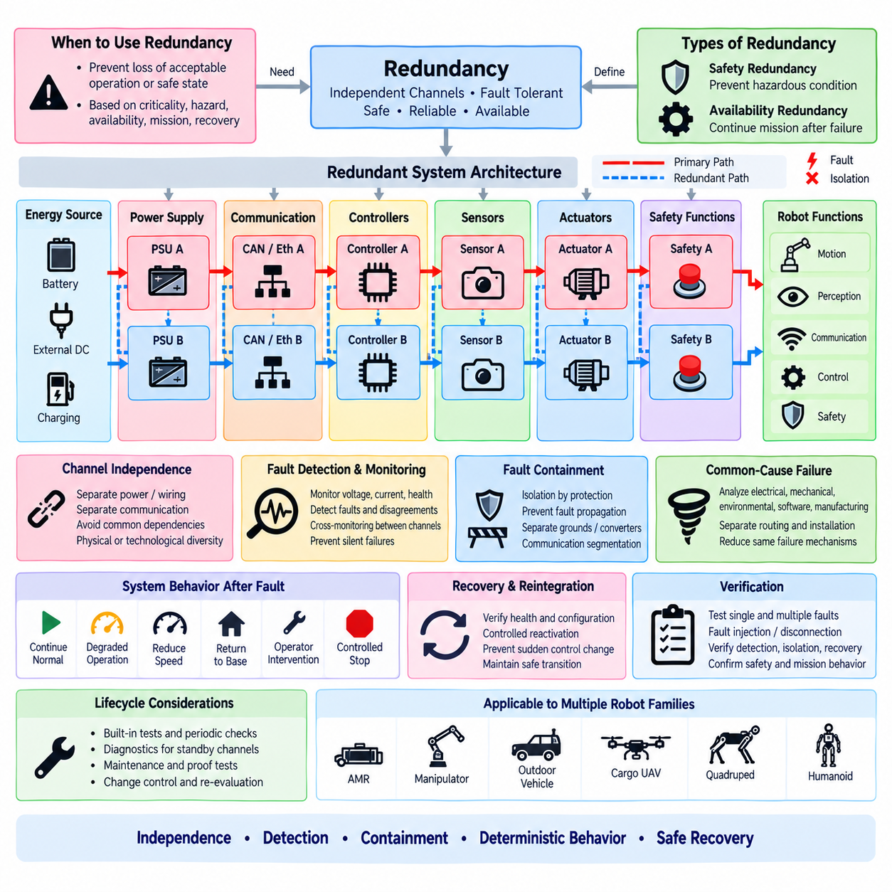
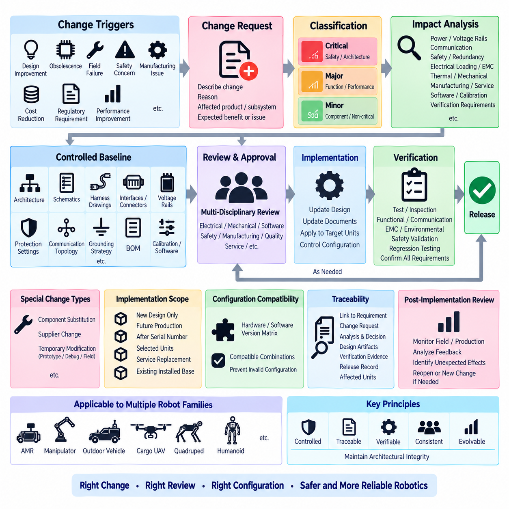

**Volume 22. Hills Robotics Engineering Standards**

# Chapter 01. HRS-001 Electrical Architecture

## 01.01. Scope and Purpose

{width="7.268055555555556in" height="7.268055555555556in"}

The scope of this standard is to establish a common electrical and electronic architecture framework for robotics products developed under the Hills Robotics Engineering Standards. It defines the system-level principles that shall guide power distribution, electrical interfaces, computing nodes, sensors, actuators, communication networks, safety circuits, grounding, protection, diagnostics, and service interfaces throughout the product lifecycle.

The purpose of HRS_001 is to provide a stable architectural foundation from which detailed product and subsystem standards can be derived. Rather than prescribing every circuit implementation, it defines the boundaries, responsibilities, interfaces, and engineering rules required to maintain consistency across different robot platforms. This enables electrical designs to evolve without losing interoperability, traceability, safety, or maintainability.

This standard applies to electrical architecture activities from early concept development through detailed design, prototype construction, verification, production release, field operation, maintenance, and controlled modification. It is intended to support engineering decisions before individual wire gauges, connectors, fuses, communication protocols, calibration procedures, or component-level implementation details are finalized.

The architecture shall treat a robot as an integrated electrical system rather than as a collection of independently designed electronic devices. Energy sources, power conversion stages, distribution units, controllers, sensors, actuators, network equipment, safety devices, and external interfaces shall therefore be considered together. Their electrical dependencies and failure interactions shall be identified at the architecture level before detailed implementation.

HRS_001 provides the parent architectural context for subsequent standards covering voltage rails, redundancy, harness design, connector selection, fuse protection, grounding, communication, calibration, and safety. Product-specific standards for AMRs, manipulators, outdoor vehicles, cargo UAVs, quadrupeds, and humanoids shall apply these common principles while introducing requirements appropriate to their operating environments and system characteristics.

The standard is intended to promote reuse across multiple robot families without forcing every product into an identical hardware configuration. A small indoor AMR, an outdoor autonomous vehicle, a mobile manipulator, a quadruped, and a humanoid may require substantially different voltage levels, actuator capacities, sensor configurations, and computing resources. Their architectures should nevertheless follow a common engineering logic for decomposition and interface definition.

Electrical architecture shall define clear boundaries between energy generation or storage, primary distribution, secondary conversion, computational loads, sensing loads, actuator loads, safety-related circuits, and auxiliary equipment. These boundaries shall support independent analysis of current demand, fault propagation, isolation, startup behavior, shutdown behavior, and degraded operation while maintaining an understandable system-level architecture.

Particular attention shall be given to the separation of high-power and low-power domains. Motor drives, traction systems, high-current actuators, charging equipment, and other significant energy consumers can introduce voltage disturbances, conducted noise, thermal stress, and fault energy that affect sensitive electronics. Architecture decisions shall therefore establish suitable domain separation, protection, grounding, filtering, and controlled interconnection.

The standard also establishes the principle that communication architecture is part of electrical architecture. CAN, Ethernet, industrial networks, ROS 2 interfaces, serial communication, wireless links, and other data paths depend on physical power, grounding, shielding, connectors, timing, and network topology. Their requirements shall consequently be coordinated with electrical packaging and system architecture rather than designed as isolated software interfaces.

Safety-related electrical functions shall be identified early enough to influence the fundamental architecture. Emergency stopping, power isolation, actuator disablement, safety sensing, safety communication, watchdog functions, redundant control paths, and fault containment may require dedicated circuits or independent resources. Such requirements shall not be added only after the functional architecture and power distribution have already been fixed.

The architecture shall support deterministic and diagnosable startup, normal operation, degraded operation, emergency response, controlled shutdown, charging, maintenance, and recovery. Electrical states and transitions should be defined so that unintended energization, uncontrolled actuator activation, ambiguous controller states, and unsafe recovery behavior can be prevented or detected through deliberate architectural mechanisms.

Reliability and availability requirements shall be translated into architectural decisions according to the intended product mission. Redundant supplies, duplicated communication paths, backup computing resources, independent safety channels, or fault-tolerant sensing may be appropriate where loss of a single component would cause unacceptable system consequences. Redundancy shall be introduced through documented requirements rather than by uncontrolled duplication of hardware.

The architecture shall also enable effective diagnostics and serviceability. Major power branches, controllers, communication segments, sensors, actuators, and safety devices should provide sufficient observability to determine system state and isolate faults. Diagnostic interfaces, measurement points, logs, fault codes, and service procedures shall be considered during architecture definition so that field troubleshooting does not depend on invasive disassembly or undocumented measurements.

Configuration management is within the purpose of this standard because electrical architecture changes can propagate across many engineering domains. Changes to voltage rails, connectors, fuse ratings, network topology, controller allocation, sensor interfaces, or grounding strategy may affect hardware, harnesses, firmware, software, manufacturing, calibration, testing, and service documentation. Architectural changes shall therefore be traceable and subject to controlled engineering review.

Compliance with HRS_001 does not replace detailed calculations, component qualification, safety analysis, EMC verification, environmental validation, or product-specific certification activities. Instead, it establishes the framework within which those activities are performed consistently. Detailed requirements shall be allocated to the relevant HRS standards and product engineering specifications while maintaining traceability to the approved system architecture.

The intended outcome is an electrical architecture that can be understood, reviewed, implemented, tested, manufactured, maintained, and extended by different engineering teams over the complete product lifecycle. By establishing common architectural principles before detailed implementation, HRS_001 provides the foundation for scalable robotics platforms whose power, communication, safety, sensing, actuation, and computing systems remain coherent as product complexity increases.

## 01.02. Architecture Requirements

{width="7.268055555555556in" height="7.268055555555556in"}

The electrical architecture shall define a clear system hierarchy from the primary energy source to every electrical load, control node, sensor, actuator, communication interface, and safety function. Each element shall have an identified architectural owner, functional purpose, power source, interface boundary, and failure relationship so that the complete robot can be analyzed as one integrated electrical and electronic system rather than as independent assemblies.

Every product architecture shall maintain an approved system-level electrical architecture diagram that represents power domains, voltage rails, distribution paths, conversion stages, controllers, communication networks, safety circuits, sensors, actuators, grounding boundaries, and external interfaces. The diagram shall remain consistent with detailed schematics, harness drawings, interface specifications, software configuration, bills of materials, and released product documentation.

Power architecture shall be organized into explicitly defined domains according to voltage level, current demand, functional criticality, electrical noise characteristics, and fault consequences. Primary battery or external power shall pass through controlled protection and distribution before reaching downstream loads. Conversion stages such as DC/DC converters and inverters shall have defined input ranges, output requirements, protection behavior, startup characteristics, and shutdown dependencies.

Voltage rails shall be standardized wherever practical to reduce unnecessary converter variants, connector diversity, spare-part complexity, and integration errors. Each rail shall define nominal voltage, permitted operating range, maximum expected load, transient requirements, protection method, grounding reference, and supported equipment. New voltage rails shall not be introduced solely for local convenience when an approved rail can satisfy the electrical and functional requirements.

Electrical loads shall be classified according to their function and criticality. Computing platforms, perception sensors, communication devices, safety controllers, motor drives, actuators, lighting, auxiliary equipment, and service loads shall be allocated to suitable power branches. Architecture reviews shall evaluate whether a fault, overload, short circuit, or unstable load on one branch can unintentionally disable equipment required for control, perception, communication, or safe shutdown.

High-current and noise-generating loads shall be architecturally separated from sensitive low-voltage electronics where necessary. Traction motors, servo drives, pumps, compressors, chargers, inverters, and switching power converters may generate conducted and radiated disturbances. Their power paths, return paths, switching interfaces, grounding, shielding, filtering, and physical routing shall therefore be coordinated with sensor, communication, and computing architecture.

Protection devices shall be located and rated according to the conductors, loads, energy sources, and fault conditions they protect. Fuses, circuit breakers, relays, contactors, electronic switches, and power distribution units shall not be selected only from nominal operating current. Inrush current, transient loading, wire capacity, short-circuit energy, interruption capability, thermal conditions, fault isolation, and protection coordination shall be considered at the architecture level.

The architecture shall define controlled power states for storage, transportation, charging, standby, initialization, normal operation, degraded operation, emergency stopping, service, and shutdown where applicable. Power sequencing shall prevent uncontrolled actuator activation and undefined controller states. Dependencies between computing nodes, sensors, communication devices, motor drives, and safety controllers shall be documented when startup or shutdown order affects system behavior.

Communication networks shall be allocated according to bandwidth, latency, determinism, safety relevance, environmental robustness, diagnostic requirements, and subsystem compatibility. CAN, Ethernet, industrial networks, serial links, ROS 2 interfaces, and wireless communication shall be treated as coordinated parts of the architecture. Network segmentation and gateway functions shall prevent unnecessary coupling while allowing required information to move between functional domains.

Safety-related functions shall remain effective under the fault assumptions defined for the product. Emergency-stop circuits, actuator enable paths, safety controllers, safety sensors, power isolation devices, watchdogs, and independent shutdown mechanisms shall be allocated so that ordinary application software is not the only means of achieving a required safe state. Safety dependencies shall be visible in the system architecture and traceable to product safety requirements.

Where redundancy is required, redundant elements shall be sufficiently independent to provide the intended fault tolerance. Two devices connected to the same unprotected power branch, communication switch, connector, grounding failure point, or software dependency may not constitute effective redundancy. Common-cause failures shall therefore be evaluated when defining duplicated power supplies, controllers, communication paths, sensors, safety channels, or computing resources.

Grounding and electromagnetic compatibility shall be defined as architectural properties rather than corrected only during EMC testing. Chassis references, signal references, power returns, shield termination concepts, high-current return paths, and isolation boundaries shall be established before harness routing is finalized. The architecture shall minimize uncontrolled ground loops and prevent high-energy switching currents from sharing inappropriate return paths with sensitive electronics.

Interfaces between subsystems shall be explicitly controlled. Each electrical interface should define power pins, signal pins, communication protocol, grounding reference, shielding requirements, connector family, current capability, voltage tolerance, startup behavior, diagnostic behavior, and safe disconnected state where applicable. Interface definitions shall allow independently developed modules to be integrated without relying on undocumented assumptions between engineering teams.

The architecture shall provide sufficient diagnostic observability to identify failures at an appropriate replaceable-unit or subsystem level. Important voltage rails, protection states, communication links, controller health, sensor availability, actuator faults, temperature conditions, and safety states should be observable through diagnostics or service measurements. Diagnostic capability shall be designed into the architecture rather than added only after field failures occur.

Serviceability shall influence electrical partitioning and physical interface decisions. Components expected to require replacement, calibration, inspection, or troubleshooting shall be accessible without unnecessary disturbance of unrelated safety-critical or high-current circuits. Connectors, service disconnects, measurement points, labels, harness branches, and replaceable modules shall support controlled maintenance while reducing the possibility of incorrect reconnection or configuration.

The electrical architecture shall support configuration identification and controlled evolution throughout the product lifecycle. Hardware revisions, voltage changes, network modifications, controller replacements, sensor additions, connector changes, and protection updates shall be assessed for their system-level impact. No architectural modification shall be considered isolated when it can affect power capacity, communication loading, safety behavior, EMC performance, diagnostics, manufacturing, or service procedures.

Architecture verification shall confirm consistency between requirements and implementation before product release. Reviews shall examine power budgets, voltage-drop assumptions, protection coordination, network capacity, startup and shutdown behavior, grounding strategy, redundancy, safety paths, thermal loading, diagnostic coverage, and interface compatibility. Deviations from approved architecture requirements shall be documented, technically justified, reviewed, and incorporated into configuration control.

These requirements form the common electrical architecture baseline for subsequent HRS standards covering harnesses, connectors, protection, grounding, communication, calibration, safety, and product-specific robot architectures. AMRs, manipulators, outdoor vehicles, cargo UAVs, quadrupeds, and humanoids may introduce additional constraints, but their detailed electrical designs shall remain traceable to this common architecture framework unless an approved engineering deviation explicitly defines otherwise.

## 01.03. Voltage Rail Standard

{width="7.268055555555556in" height="7.268055555555556in"}

The voltage rail standard defines the approved electrical supply domains used throughout robotics products and establishes a consistent method for assigning loads to each domain. Voltage rails shall be selected according to energy level, load characteristics, conversion efficiency, safety requirements, component compatibility, and system architecture. Unnecessary voltage variants should be avoided because they increase converters, connectors, spare parts, verification effort, and integration risk.

Each voltage rail shall have a documented nominal voltage, normal operating range, transient range, maximum continuous current, allowable peak current, protection method, grounding reference, source converter, and intended load category. The electrical architecture shall also identify the expected behavior of each rail during startup, shutdown, charging, emergency stopping, undervoltage, overvoltage, overload, short circuit, and loss of the primary energy source.

The primary power rail shall normally originate from the battery system, external DC source, or another controlled energy source appropriate to the robot platform. Battery voltage may vary significantly with state of charge, load, temperature, and chemistry, so equipment connected directly to the primary rail shall tolerate the complete specified operating range. Direct connection shall not be assumed merely because nominal equipment and battery voltages appear identical.

A 48 V class rail should be used where practical for traction drives, high-power actuators, large servo systems, pumps, compressors, and other loads requiring substantial electrical power. Higher distribution voltage reduces current for a given power level and can reduce conductor mass and voltage drop. The exact allowable range shall be defined by the selected battery, drive system, charging architecture, protection devices, and product-specific safety requirements.

A 24 V class rail should serve industrial control equipment and medium-power devices where 24 V compatibility provides practical integration advantages. Typical applications may include industrial sensors, relays, contactors, programmable controllers, I/O modules, brakes, valves, auxiliary actuators, and selected communication equipment. The architecture shall prevent uncontrolled interaction between 24 V industrial loads and sensitive electronic loads sharing the same source.

A 12 V class rail may be allocated to sensors, cameras, communication devices, lighting, automotive-derived equipment, and auxiliary electronics designed for this supply class. Designers shall verify actual device tolerance rather than assuming that every product described as 12 V supports the same range. Startup surge, cable voltage drop, transient disturbances, reverse polarity exposure, and converter regulation shall be considered when defining the rail limits.

Lower-voltage rails such as 5 V and 3.3 V are primarily intended for computing logic, embedded electronics, interface circuits, low-power sensors, and board-level functions. These rails should normally be generated locally or near their loads rather than distributed over long harnesses at high current. Low-voltage distribution is particularly sensitive to conductor resistance, connector resistance, transient load changes, grounding offsets, and electromagnetic interference.

Voltage conversion shall follow a controlled hierarchy from the primary energy source toward lower-voltage domains. Cascaded conversion stages should be minimized where practical because every additional converter introduces efficiency loss, thermal load, startup dependency, fault modes, and component complexity. When cascading is necessary, the architecture shall document upstream and downstream dependencies and confirm that converter sequencing cannot create unintended electrical states.

Every rail shall include an appropriate power budget with continuous, peak, startup, and transient load conditions considered separately. The sum of nominal equipment ratings alone is insufficient for architecture approval. Motor controllers, computers, GPUs, LiDARs, cameras, communication devices, heaters, fans, pumps, and other loads may exhibit simultaneous peaks or significant inrush behavior that shall be represented in the system-level power analysis.

Design margin shall be included between predicted demand and available rail capacity. The required margin may differ according to load uncertainty, product maturity, environmental conditions, converter characteristics, and planned expansion. Capacity reserved for future equipment shall be explicitly identified rather than hidden inside undocumented oversizing. The architecture review shall distinguish usable engineering margin from capacity unavailable because of thermal or protection limitations.

Voltage drop shall be evaluated from the source to the electrical load under relevant current conditions. The analysis shall include harness conductor resistance, connector contact resistance, fuse and relay resistance, PDU paths, switches, contactors, service disconnects, and other series elements. The voltage available at the load shall remain within the equipment operating range during normal operation and specified peak conditions, not merely at the source terminal.

Protection shall be coordinated with each voltage rail and its downstream branches. A protective device shall protect the conductor and electrical path as well as the connected equipment. Fuse or circuit-breaker ratings shall therefore consider wire capacity, continuous load, inrush current, short-circuit current, ambient temperature, interruption capability, and upstream-downstream selectivity. A downstream fault should be isolated without unnecessarily disabling unrelated critical functions.

Critical and noncritical loads should be separated when a common power failure could create an unacceptable system condition. Safety controllers, emergency-stop monitoring, braking functions, essential communication, localization sensors, or computing resources required to reach a safe state may require dedicated or independently protected rails. The required independence shall be determined from the safety and availability analysis rather than from convenience in harness routing.

High-power rails and sensitive electronic rails shall be separated to control conducted noise, switching disturbances, ground offsets, and fault propagation. Motor drives and inverters can produce rapid current changes that disturb sensors and computers even when nominal voltages remain acceptable. Converter placement, return-current paths, filtering, grounding, shielding, cable routing, and physical separation shall therefore be coordinated as part of the voltage rail architecture.

Ground reference requirements shall be explicitly defined for every rail. A rail may use a common power return, chassis-referenced return, isolated return, or another approved grounding arrangement depending on system requirements. Connections between reference domains shall be intentional and documented. Uncontrolled multiple connections can create ground loops, while inappropriate isolation can prevent required fault-current paths or cause communication reference problems.

Startup and shutdown sequencing shall define when each rail becomes energized and de-energized relative to other rails. Controllers may need to initialize before actuator power is enabled, sensors may require stabilization before autonomous operation begins, and communication equipment may need to remain active during controlled shutdown. Emergency-stop behavior shall separately define which rails are removed immediately and which remain energized for safety, diagnostics, or recovery.

Rail status shall be observable where the information is important for diagnostics, safety, or service. Voltage, current, converter status, fuse condition, contactor state, undervoltage, overvoltage, overload, and temperature information should be monitored according to system criticality. Diagnostic software shall be able to distinguish loss of a power rail from failure of an individual downstream device whenever practical, reducing unnecessary component replacement during troubleshooting.

Connectors, wire identification, drawings, and service documentation shall preserve voltage-domain identity throughout the product. Different voltage classes should be distinguishable through controlled pin allocation, connector selection, labeling, harness documentation, and interface definitions. Service personnel shall not be required to infer voltage from wire position or equipment appearance, particularly where incorrect connection could damage electronics or create a hazardous condition.

Introduction of a new voltage rail or modification of an existing rail shall be treated as an architecture-level change. The engineering review shall evaluate power capacity, conversion efficiency, protection, wiring, connectors, grounding, EMC, thermal behavior, diagnostics, safety, manufacturing, serviceability, and compatibility with existing modules. Approved changes shall be reflected consistently in architecture diagrams, schematics, harness drawings, interface specifications, and bills of materials.

This voltage rail standard provides the common power-domain foundation for AMRs, manipulators, outdoor vehicles, cargo UAVs, quadrupeds, humanoids, and future robotics platforms defined within the HRS structure. Product-specific standards may establish additional or higher-voltage domains where technically necessary, but each deviation shall preserve the principles of controlled distribution, defined operating limits, protection coordination, diagnosability, traceability, and safe system integration.

## 01.04. Redundancy Requirements

{width="7.268055555555556in" height="7.268055555555556in"}

Redundancy shall be introduced when the loss, degradation, or malfunction of a single electrical or electronic element could prevent the robot from reaching or maintaining an acceptable operating or safe state. Redundancy is not a universal requirement for every component. Its application shall be based on functional criticality, hazard analysis, availability targets, mission requirements, recovery capability, and the consequences of a single-point failure.

The redundancy architecture shall distinguish between safety-related redundancy and availability-oriented redundancy. Safety redundancy exists to prevent a fault from creating an unacceptable hazardous condition, while availability redundancy allows the system to continue performing some or all of its mission after a failure. The required behavior after a fault shall therefore be defined as safe shutdown, controlled degradation, fail-operational operation, or another approved system response.

A redundant architecture shall provide sufficient independence between channels to achieve the intended fault tolerance. Installing two identical components does not provide effective redundancy if both depend on the same unprotected power source, fuse, connector, communication switch, ground path, clock source, software process, or environmental condition. Shared dependencies shall be identified explicitly and evaluated as potential common failure points.

Power redundancy shall be considered for electrical functions required to maintain control, communication, perception, braking, safety supervision, or controlled shutdown. Where independent power channels are required, each channel shall include appropriate source capacity, conversion, distribution, wiring, protection, and monitoring. A common upstream component shall not invalidate the intended redundancy unless its failure is demonstrated to be acceptable by the system safety analysis.

Redundant power supplies shall be sized according to the required post-failure operating state. A secondary supply intended only to support emergency stopping may have different capacity requirements from a supply required to maintain autonomous operation. Load sharing, automatic transfer, isolation, reverse-current protection, startup sequencing, and fault detection shall be defined so that one failed supply cannot unintentionally disable or overload the remaining healthy channel.

Communication redundancy shall be applied where loss of a single network path would create an unacceptable system condition. Redundant CAN channels, Ethernet paths, switches, gateways, or other communication links shall be physically and logically separated where required. Routing two communication channels through the same connector, cable bundle, switch, gateway, or power source shall be evaluated for common-cause failure before the architecture is considered redundant.

Controller redundancy may use duplicated controllers, supervisory controllers, safety controllers, distributed control, or another approved architecture. The design shall define which controller has authority during normal operation, how disagreement is detected, how control is transferred, and what occurs when both channels produce conflicting results. Redundant controllers shall not create uncontrolled simultaneous commands to actuators during initialization, failure, recovery, or communication loss.

Sensor redundancy shall be based on the information required to maintain the intended system state rather than on simple duplication of sensor quantity. Two identical sensors with the same field of view, mounting structure, power source, environmental susceptibility, and processing algorithm may remain vulnerable to the same failure mechanism. Diversity in sensing principle, location, processing path, or diagnostic method should be considered when common-mode failure is significant.

Actuator redundancy shall be evaluated according to mechanical architecture and required safe behavior. Some robots may achieve safety by removing actuator torque, while others may require controlled braking, holding force, steering authority, or continued stabilization after a fault. Electrical redundancy requirements for motor drives, brakes, steering systems, joint actuators, and enable circuits shall therefore be derived from the required physical response of the robot.

Safety functions requiring independent channels shall be designed so that ordinary control software cannot defeat the intended protective action. Emergency-stop circuits, safety controllers, actuator enable paths, contactors, brakes, watchdogs, and safety sensors may require independent electrical paths. Safety-related redundancy shall remain effective during failures of the main computing platform, application software, primary communication network, or non-safety power domain where required.

Redundant channels shall include mechanisms for fault detection and channel health monitoring. Voltage status, communication availability, controller heartbeat, sensor plausibility, actuator feedback, protection status, and other relevant indicators should be monitored according to system criticality. A redundant element that can fail silently without detection may leave the system operating without the assumed fault tolerance and shall therefore be treated as a latent-fault concern.

Cross-monitoring shall be used where independent channels must verify each other\'s behavior. The monitoring mechanism shall detect disagreement without creating excessive coupling between redundant channels. Where one channel supervises another, the architecture shall consider whether failure of the supervising channel can incorrectly disable a healthy channel or mask a dangerous fault. Diagnostic independence shall be evaluated together with functional independence.

Common-cause failure analysis shall consider electrical, mechanical, environmental, software, manufacturing, and installation dependencies. Redundant channels routed through the same harness section may both be damaged by abrasion, heat, water ingress, or mechanical impact. Likewise, identical devices may share firmware defects or susceptibility to electromagnetic interference. Physical separation or technological diversity shall be introduced where justified by the required integrity.

Fault containment boundaries shall prevent a failure in one redundant channel from propagating into another. Short circuits, overvoltage, reverse current, ground faults, communication bus failures, thermal events, and erroneous control outputs shall be considered. Appropriate isolation may be provided through separate protection, independent converters, galvanic isolation, communication segmentation, controlled gateways, or other mechanisms appropriate to the electrical architecture.

The system shall define deterministic behavior when redundancy is lost. Depending on the product requirement, the robot may continue normally for a limited period, enter degraded operation, reduce speed, restrict motion, disable selected functions, return to a designated location, request operator intervention, or perform a controlled stop. Continued operation after loss of redundancy shall not occur merely because the remaining channel appears functional unless such operation has been explicitly approved.

Recovery and reintegration of a failed redundant channel shall be controlled. A repaired, restarted, or temporarily unavailable channel shall not automatically regain control authority until its health, configuration, communication state, synchronization, and diagnostic status have been confirmed. Where automatic reintegration is permitted, the conditions and transition logic shall prevent sudden changes in actuator commands, network ownership, power loading, or safety state.

Redundancy requirements shall include maintenance and diagnostic considerations because dormant backup channels can remain untested for long periods. Built-in tests, periodic checks, startup diagnostics, proof tests, or scheduled maintenance shall verify that standby resources remain functional. Diagnostic coverage and test intervals shall reflect the probability and consequence of latent failures, particularly where multiple faults could defeat a safety-related architecture.

Verification shall demonstrate that each required redundant function remains effective under the defined single-fault and applicable multiple-fault conditions. Testing should include loss of power channels, communication links, controllers, sensors, actuators, protection devices, and monitoring functions as appropriate. Fault injection, interface disconnection, simulated communication loss, undervoltage, and controlled component failures may be used to verify detection, isolation, transition, and recovery behavior.

Any change affecting redundant architecture shall be treated as a system-level change. Replacement of a power converter, network switch, connector, controller, sensor, harness route, grounding arrangement, firmware component, or diagnostic mechanism may introduce a previously absent common dependency. Change review shall therefore reassess independence, fault containment, diagnostic coverage, degraded behavior, and compliance with the original redundancy requirements.

These redundancy requirements provide the common framework for AMRs, manipulators, outdoor vehicles, cargo UAVs, quadrupeds, humanoids, and other robotics platforms within the HRS structure. Product-specific standards shall determine the required redundancy level according to mission and safety needs, while maintaining the principles of independence, fault detection, fault containment, deterministic degradation, controlled recovery, verification, and traceability.

## 01.05. Change Control

{width="7.268055555555556in" height="7.268055555555556in"}

Change control shall ensure that modifications to the electrical architecture are evaluated, approved, documented, implemented, and verified in a controlled manner throughout the product lifecycle. A change shall not be treated as a local engineering action when it can affect power distribution, interfaces, communication, safety, diagnostics, manufacturing, calibration, software configuration, service procedures, or compatibility with released products.

The controlled baseline shall include the approved electrical architecture, schematics, harness drawings, interface specifications, connector definitions, voltage rails, protection settings, communication topology, grounding strategy, bills of materials, calibration information, and relevant software or firmware configurations. Each released baseline shall have an identifiable revision so that the exact configuration of a prototype, test unit, production robot, or field unit can be reconstructed.

A change request shall clearly describe the proposed modification, the reason for the change, the affected product or subsystem, and the expected technical benefit or problem being corrected. The request should identify whether the change originates from design improvement, component obsolescence, supplier substitution, field failure, safety concern, manufacturing issue, cost reduction, regulatory requirement, performance improvement, or another documented engineering need.

Changes shall be classified according to their potential system impact rather than only according to the physical size or cost of the modified component. Replacing a small connector, fuse, sensor, converter, resistor, network device, or software parameter can have significant architectural consequences. Classification shall consider safety, function, interface compatibility, electrical loading, EMC, reliability, manufacturing, serviceability, and installed-base impact.

An engineering impact analysis shall be completed before approval of any architecture-relevant change. The analysis shall identify affected voltage rails, current demand, power budgets, protection coordination, voltage drop, grounding, thermal loading, communication bandwidth, timing, diagnostics, startup and shutdown behavior, safety functions, redundancy, mechanical packaging, harness routing, connectors, calibration, software, and verification requirements as applicable.

Changes to voltage rails or power distribution shall be reviewed for source capacity, converter rating, conductor capacity, connector current capability, fuse coordination, inrush current, transient behavior, thermal performance, and downstream compatibility. A modification that appears acceptable at nominal load shall not be approved until peak, startup, fault, and degraded operating conditions have been considered together with the required engineering margin.

Changes affecting redundancy shall be reviewed for independence and common-cause failures. Replacing a power supply, controller, switch, connector, sensor, harness path, or grounding arrangement may introduce a shared dependency between channels that were previously independent. The review shall confirm that fault detection, fault containment, degraded operation, safe-state transition, recovery behavior, and diagnostic coverage remain consistent with the approved redundancy concept.

Communication changes shall evaluate both physical and logical architecture. Modification of CAN, Ethernet, serial links, gateways, switches, wireless interfaces, ROS 2 communication, addressing, message definitions, network loading, or timing may affect multiple subsystems simultaneously. Compatibility with existing nodes and diagnostic tools shall be verified, and changes to communication interfaces shall be reflected in the corresponding controlled interface documentation.

Safety-related changes shall receive a level of review appropriate to their potential hazard impact. Modifications involving emergency-stop functions, safety controllers, actuator enable circuits, brakes, contactors, safety sensors, watchdogs, isolation devices, or safety communication shall be traced to the applicable safety requirements. Existing hazard analyses and verification evidence shall be reviewed to determine whether they remain valid or require revision.

Component substitution shall not be approved solely because the replacement has similar nominal specifications. Differences in operating range, transient tolerance, connector interface, pin assignment, thermal behavior, EMC characteristics, startup behavior, firmware, communication timing, diagnostics, environmental rating, lifetime, and failure modes shall be evaluated. Form, fit, and nominal function alone do not demonstrate complete electrical or system compatibility.

Supplier-driven changes shall be subject to the same engineering control as internally initiated changes. Manufacturer part revisions, process changes, material substitutions, firmware updates, end-of-life notifications, and alternate-source proposals may alter product behavior even when the supplier retains the same commercial part number. Critical components should therefore have defined notification, qualification, and approval requirements appropriate to their system impact.

Temporary modifications used for prototypes, experiments, troubleshooting, or field investigation shall be identified separately from released production changes. Temporary wiring, bypasses, alternate components, modified fuse ratings, diagnostic adapters, or software overrides shall not migrate into production by informal repetition. Their purpose, duration, affected units, risks, and restoration conditions shall be documented, and temporary deviations shall be closed or formally converted into approved changes.

Every approved change shall have defined implementation applicability. The change record shall identify whether it applies to new designs only, future production units, units after a specified serial number, selected prototypes, service replacements, or the existing installed base. Where retrofit is required, the affected population, retrofit method, required parts, software compatibility, verification procedure, and completion records shall be controlled.

Configuration compatibility shall be evaluated whenever multiple hardware or software revisions may coexist. The organization shall determine which controller, sensor, harness, PDU, firmware, software, calibration, and communication versions are permitted to operate together. Compatibility matrices or equivalent configuration rules should be maintained when necessary to prevent technically valid individual components from being assembled into an invalid system configuration.

Documentation updates shall be part of the change itself rather than a separate activity performed after implementation. Architecture diagrams, schematics, harness drawings, connector tables, interface control documents, bills of materials, software configuration records, calibration data, test procedures, manufacturing instructions, service manuals, and diagnostic information shall be revised as applicable before the changed configuration is considered fully released.

Verification requirements shall be determined from the impact analysis. A change may require inspection, electrical measurement, functional testing, communication testing, fault injection, EMC testing, environmental testing, safety validation, regression testing, or field evaluation. Verification shall demonstrate not only that the modified function operates correctly but also that previously approved functions affected by the change continue to satisfy their requirements.

Regression testing shall focus on interfaces and functions that may be indirectly affected. A new converter may alter EMC behavior, a connector change may influence voltage drop, a firmware update may modify startup timing, and a sensor replacement may change network loading or calibration. The verification plan shall therefore address credible secondary effects rather than testing only the component or function explicitly named in the change request.

Change approval authority shall reflect the significance of the modification. Minor changes with no architectural or safety impact may follow a simplified approval path, while changes affecting safety, primary power, redundancy, communication architecture, critical interfaces, or released field units shall require multidisciplinary review. Relevant electrical, mechanical, software, safety, manufacturing, quality, test, and service functions should participate according to the identified impact.

Traceability shall connect the original issue or requirement to the change request, engineering analysis, approval decision, modified design artifacts, verification evidence, release record, and affected product configuration. This traceability shall allow future engineers to determine not only what changed but why it changed, which alternatives were considered, what risks were identified, and what evidence supported the final engineering decision.

After implementation, significant changes should be reviewed for unexpected field, production, or service effects. Early production results, diagnostic logs, failure reports, manufacturing feedback, and service information can reveal interactions not identified during analysis. Where new evidence indicates that assumptions were incorrect, the change shall be reopened or a new controlled change initiated rather than relying on undocumented corrective action.

The HRS change-control process shall apply across AMRs, manipulators, outdoor vehicles, cargo UAVs, quadrupeds, humanoids, and other robotics platforms defined within the engineering standards structure. Its objective is to preserve architectural integrity while allowing products to evolve, ensuring that every significant modification remains technically justified, configuration-controlled, verifiable, traceable, and compatible with the safety and lifecycle requirements of the affected system.
