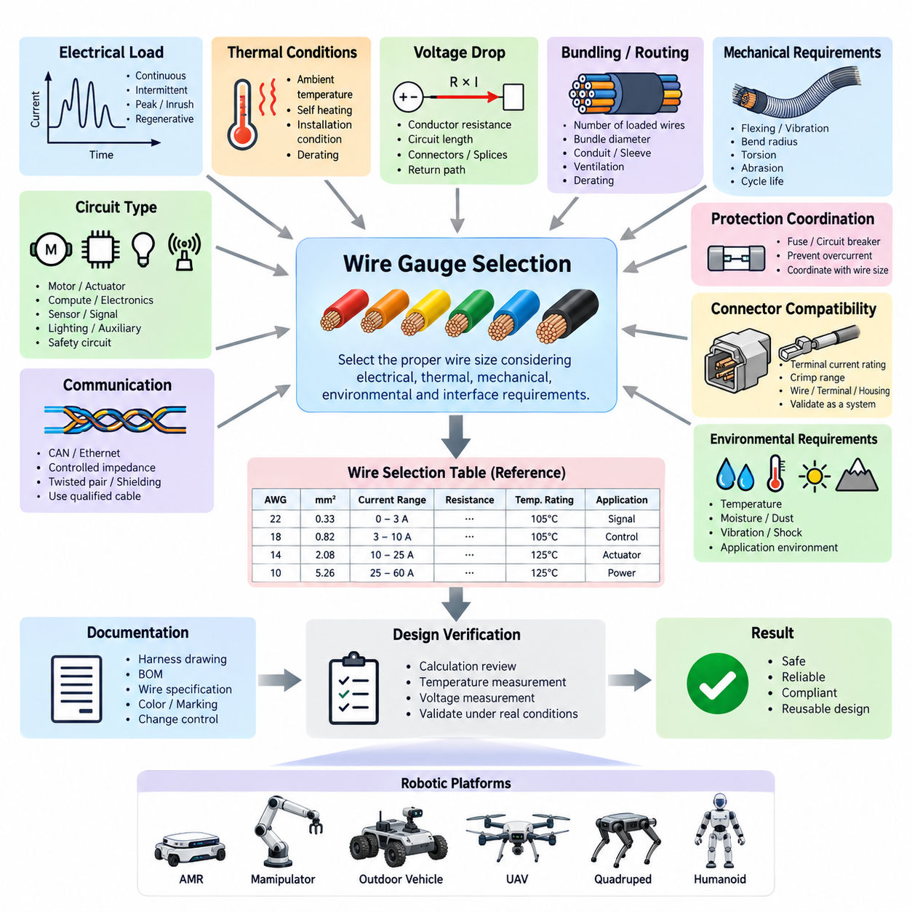
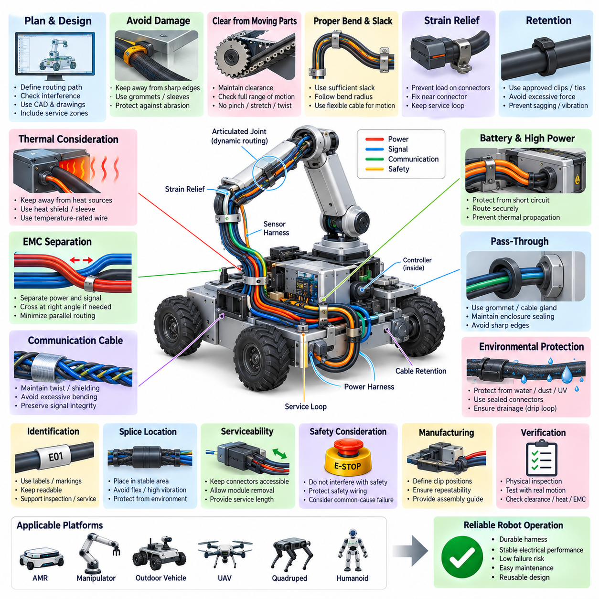
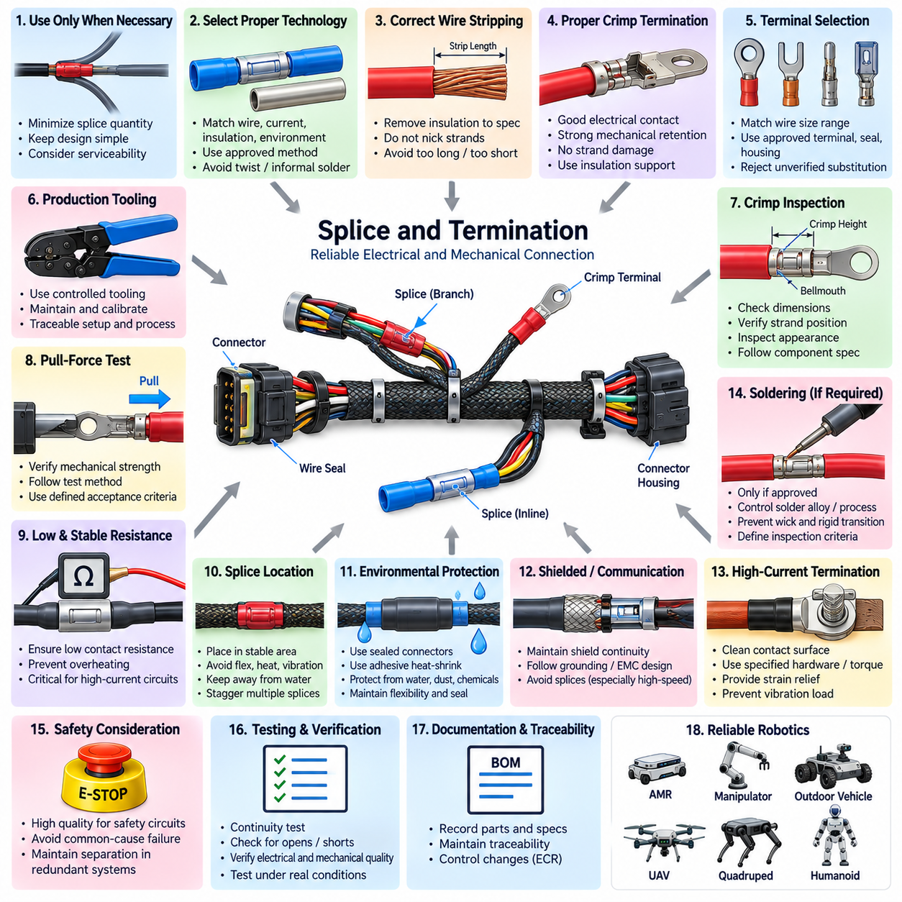
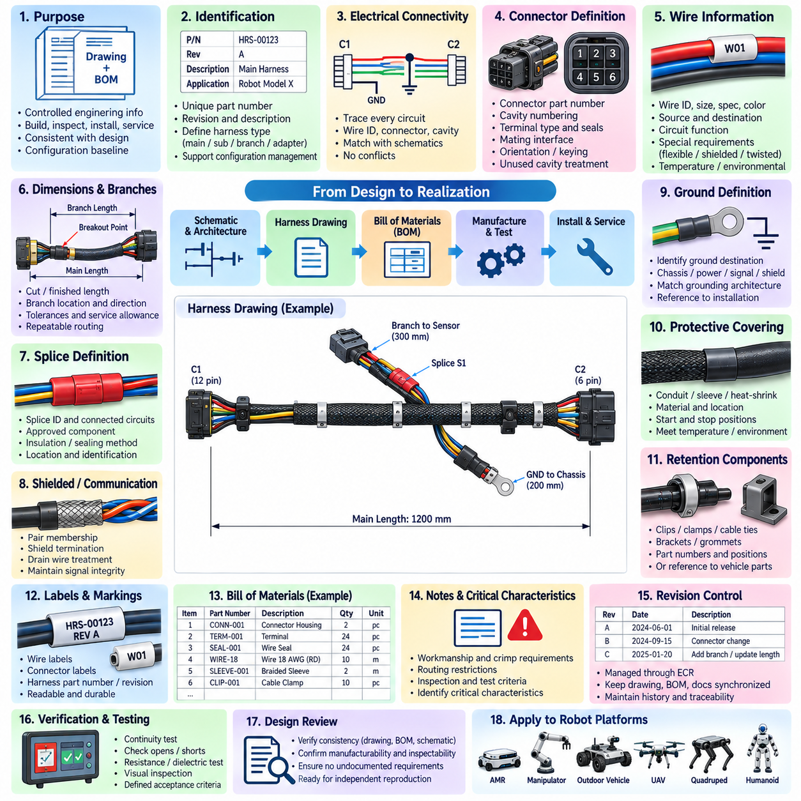
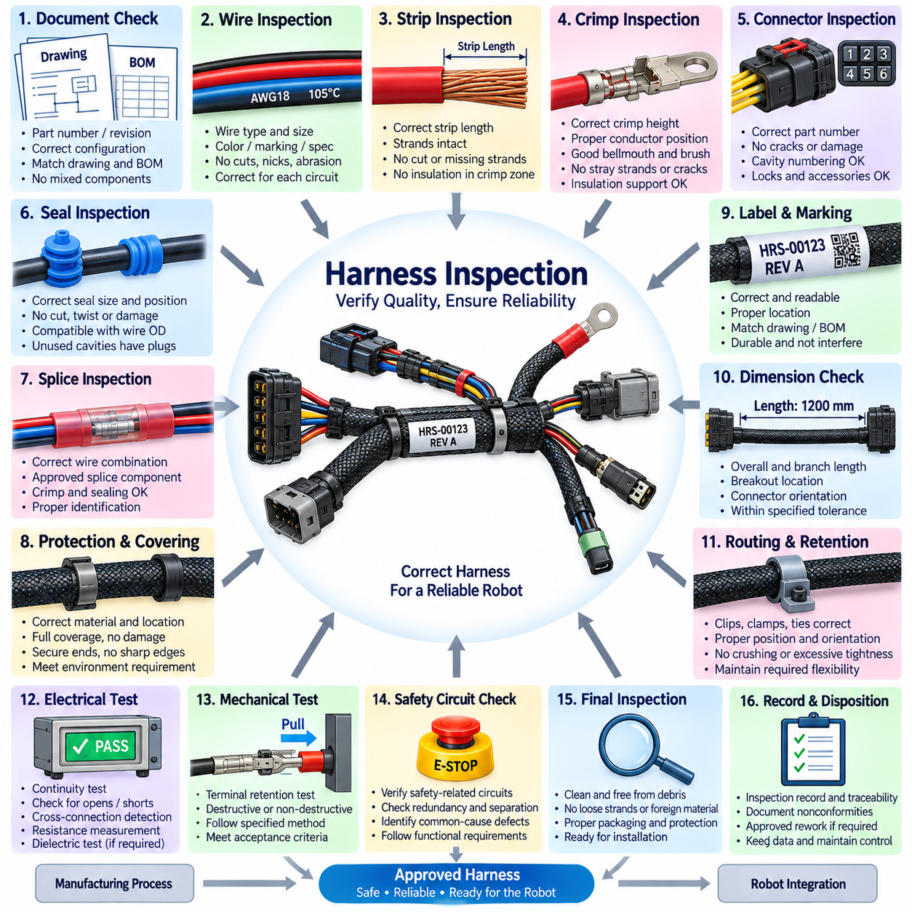

**Volume 22. Hills Robotics Engineering Standards**

# Chapter 02. HRS-002 Harness Design

## 02.01. Wire Gauge Selection Table

{width="7.268055555555556in" height="7.268055555555556in"}

Wire gauge selection establishes the minimum conductor size required to carry electrical current safely and reliably through a robotic platform. The selected conductor shall satisfy current-carrying capacity, allowable voltage drop, thermal limits, mechanical robustness, connector compatibility, and environmental requirements simultaneously. Gauge selection shall therefore be treated as an electrical-system design decision rather than a simple lookup based only on nominal load current.

The engineering wire selection table shall identify each approved conductor size using AWG, metric cross-sectional area in mm², or both where practical. For every size, the table should associate a reference current range, conductor resistance, applicable temperature rating, insulation family, and typical application class. These values provide a common starting point for harness design while allowing project-specific derating to be applied before final release.

Nominal operating current shall not be used directly as the sole sizing criterion. The designer shall determine continuous current, intermittent current, peak current, startup or inrush current, regenerative current where applicable, and credible abnormal operating conditions. Motors, actuators, pumps, heaters, compute modules, sensors, lighting systems, and auxiliary loads can exhibit significantly different current profiles even when their average power consumption appears similar.

Continuous-current capacity shall be evaluated against the thermal capability of the conductor and insulation under the actual installation condition. A wire routed individually in free air may dissipate heat more effectively than the same wire installed inside a densely packed bundle, conduit, sleeve, or sealed enclosure. The approved gauge table therefore represents a baseline, and additional derating shall be applied when routing conditions restrict heat transfer or increase local ambient temperature.

Voltage drop shall be checked independently from ampacity. The conductor resistance, circuit length, operating current, connector resistance, splice resistance, and return-path resistance collectively determine the voltage available at the load. Long harness branches may therefore require a larger conductor even when thermal current capacity is adequate. Sensitive electronics and high-current actuators shall receive particular attention because undervoltage can produce resets, torque reduction, communication faults, or unstable behavior.

For a two-conductor supply and return circuit, voltage-drop analysis shall include the complete electrical loop rather than only the physical distance from the power distribution unit to the load. Where chassis or structural grounding is intentionally used, the resistance and integrity of that return path shall also be considered. The calculated worst-case load voltage shall remain within the operating range specified for the connected device under expected battery and converter conditions.

Temperature is a primary derating variable. Harness segments located near motors, inverters, DC/DC converters, batteries, braking components, power resistors, or enclosed compute compartments may experience ambient temperatures substantially above the general robot environment. Selection shall account for conductor temperature rise combined with external ambient temperature, and the resulting temperature shall remain below the qualified rating of the wire insulation, terminals, seals, and adjacent materials.

Bundle derating shall be considered whenever multiple current-carrying conductors are routed together. Heat generated by neighboring circuits can raise the equilibrium temperature of the complete harness, particularly when several motor or actuator power lines operate simultaneously. The design review shall consider the number of loaded conductors, bundle diameter, duty cycle, protective covering, ventilation, and routing environment rather than applying an isolated-wire current rating without modification.

Typical low-current signal circuits such as digital inputs, low-power sensors, control signals, and diagnostic lines may use smaller conductor sizes when electrical and mechanical requirements permit. However, the smallest electrically acceptable wire is not automatically suitable for a moving robot. Repeated bending, vibration, installation handling, connector terminal limitations, abrasion, and maintenance activities can establish a practical minimum conductor size greater than that required by current capacity alone.

Communication wiring shall be selected primarily according to the physical-layer specification rather than ordinary power-wire rules. CAN, CAN FD, Ethernet, differential encoder interfaces, serial communication, and other high-speed networks may require controlled impedance, twisted pairs, shielding, defined capacitance, or specific conductor geometry. Increasing conductor size arbitrarily can alter cable characteristics and shall not substitute for use of a qualified communication cable.

Motor and actuator circuits require special consideration because their electrical loading is highly dynamic. The conductor shall tolerate continuous operating current while also supporting acceleration peaks, stall-related transients, braking energy, and repetitive duty cycles without excessive temperature rise or voltage loss. Where PWM-controlled drives are used, cable construction, electromagnetic compatibility, shielding, grounding, and routing separation shall be evaluated together with conductor cross-sectional area.

Battery, main power distribution, inverter, and high-current DC circuits shall be sized using worst-case system current and fault-protection coordination. The selected conductor must remain protected by the associated fuse, circuit breaker, or electronic protection device over the intended operating range. A protective device shall not permit sustained current that exceeds the safe thermal capability of the downstream conductor, terminals, splices, connectors, or distribution interfaces.

Wire gauge and fuse selection shall therefore be coordinated as a single design activity. The conductor shall safely carry normal and temporary operating currents, while the protective device shall interrupt abnormal current before conductor damage becomes credible. Increasing fuse rating to prevent nuisance opening without reassessing conductor capacity is prohibited because it can convert an operational issue into a harness overheating or fire hazard.

Connector terminal capability can impose another limit on wire selection. A conductor may satisfy system current and voltage-drop requirements but remain unsuitable if its cross-sectional area falls outside the approved crimp range of the terminal. Conversely, a connector contact may have a current rating below the capability of the selected wire. Wire, terminal, connector housing, seal, crimp tooling, and circuit protection shall therefore be validated as one electrical interconnection system.

Mechanical routing requirements shall also influence conductor selection. Harnesses crossing articulated joints, suspension elements, steering mechanisms, manipulators, humanoid limbs, or other continuously moving interfaces require conductors designed for repeated flexing. Fine-stranded flexible cable may be preferable to conventional construction, but bend radius, torsional loading, strain relief, abrasion protection, and expected cycle life shall be verified for the actual robotic motion profile.

For circuits supplying safety-related devices, wire sizing shall include appropriate engineering margin and shall be consistent with the safety architecture. Emergency-stop circuits, safety controllers, braking interfaces, safety sensors, contactor controls, and redundant power paths shall not depend on conductors operating near their thermal or mechanical limits. Failure modes involving open circuits, shorts to power, shorts to ground, and shorts between conductors shall be considered during design review.

Robotic platforms using multiple voltage rails shall maintain separate gauge-selection calculations for each distribution domain. A 48 V propulsion circuit, 24 V actuator circuit, 12 V auxiliary circuit, and 5 V electronics circuit can carry very different currents for comparable power levels. Lower-voltage rails are particularly sensitive to voltage drop because a given conductor drop represents a larger percentage of the available supply voltage and can reduce downstream operating margin.

The released wire selection table should classify applications by practical circuit groups such as sensor and signal, low-power control, compute and communication equipment, auxiliary power, actuator power, propulsion power, battery distribution, and safety circuits. These categories are engineering guidance rather than unconditional current limits. Final gauge selection shall always be confirmed using the actual load profile, route length, temperature, bundling, protection, and interface requirements.

Any conductor size selected outside the approved table or outside its defined application range shall require documented engineering justification. The justification should identify electrical load, voltage-drop calculation, thermal assumptions, installation environment, connector compatibility, protection strategy, and applicable validation evidence. This prevents undocumented substitutions during prototype construction, production release, service repair, or supplier-driven harness redesign.

Harness drawings and bills of materials shall record the released conductor specification sufficiently to prevent ambiguity during manufacturing. Required information should include conductor size, insulation or cable specification, circuit identification, applicable color or marking, terminal compatibility, and special environmental or flex requirements where relevant. Production substitutions shall be controlled through the engineering change process rather than accepted solely because two wires have approximately equivalent nominal dimensions.

Verification shall include design calculation and, where necessary, physical measurement under representative operating conditions. High-current or thermally constrained circuits should be evaluated at realistic ambient temperature and duty cycle, with conductor, terminal, splice, and connector temperatures monitored at critical locations. Voltage at the load should also be measured during peak operating conditions to confirm that analytical assumptions remain valid in the assembled robot.

The wire gauge selection table ultimately functions as a controlled engineering baseline connecting electrical architecture, harness design, connector selection, circuit protection, manufacturing, inspection, and service. Consistent application reduces overheating, excessive voltage drop, intermittent faults, premature flex failure, and uncontrolled part variation while supporting reusable harness design across AMRs, manipulators, outdoor vehicles, quadrupeds, humanoids, and other robotic platforms.

## 02.02. Routing and Packaging Rules

{width="7.268055555555556in" height="7.268055555555556in"}

Routing and packaging rules define how electrical harnesses shall be physically installed so that electrical performance, mechanical durability, thermal behavior, electromagnetic compatibility, manufacturability, and serviceability are maintained throughout the robot lifecycle. A correctly sized wire can still fail when routed improperly; therefore harness routing shall be treated as an engineered subsystem rather than an installation activity performed after mechanical design is completed.

Harness routing shall be established during the mechanical and electrical architecture phases using defined corridors, branch points, attachment locations, connector interfaces, and service zones. Routing paths should be represented in applicable CAD models and harness drawings so that interference with structures, actuators, sensors, covers, batteries, compute modules, and moving mechanisms can be evaluated before production. Uncontrolled routing changes during assembly shall not be permitted without engineering review.

Harnesses shall be kept away from sharp edges, exposed threads, burrs, stamping edges, machining features, and other surfaces capable of damaging insulation. Where unavoidable proximity exists, protective measures such as edge guards, grommets, sleeves, conduits, or abrasion-resistant coverings shall be provided. Protection shall remain effective under vibration and movement rather than relying solely on nominal static clearance observed during initial assembly.

Adequate clearance shall be maintained from moving components including wheels, steering mechanisms, suspension members, gears, belts, chains, fans, linkages, linear actuators, manipulators, and articulated joints. Routing shall be evaluated across the complete mechanical range of motion rather than at only one reference position. The harness shall not become stretched, pinched, twisted beyond its rating, trapped between structures, or exposed to contact with moving hardware.

Dynamic harness sections require controlled slack and defined bend geometry. Sufficient additional length shall be provided to accommodate movement without transmitting excessive tensile force to wires, terminals, or connectors, but excessive slack that can form loops or contact surrounding components shall also be avoided. Bend radius shall comply with the applicable cable specification, and repeated-flex applications shall use cable construction qualified for the expected motion and cycle life.

Harnesses crossing rotating or articulated interfaces shall be designed for the actual combination of bending, twisting, extension, and compression produced by robot motion. Humanoid joints, quadruped legs, manipulators, steering systems, and suspension mechanisms can generate complex cable loading that is not represented by a simple static bend radius. Routing validation should therefore include representative motion cycles and observation of cable behavior throughout the operating envelope.

Strain relief shall prevent external mechanical loads from being transferred directly into connector contacts, crimp joints, splices, sensor pigtails, or electronic assemblies. Harness attachment points should be located sufficiently close to connectors to control cable movement while preserving the service loop required for connection and disconnection. Connector bodies shall not be used as structural supports for unsupported harness mass unless specifically designed and qualified for that purpose.

Harness retention shall use approved clips, clamps, ties, channels, brackets, or equivalent devices appropriate to the installation environment. Retention spacing shall prevent sagging, vibration amplification, uncontrolled movement, and contact with adjacent components. Fastening devices shall secure the harness without crushing insulation, deforming communication cables, restricting required movement, or creating concentrated stress that could produce conductor fatigue during long-term operation.

Cable ties shall be applied with controlled tension and shall not cut, indent, or significantly compress the cable jacket or insulation. High-speed communication cables, shielded cables, optical cables, and flexible robotic cables can be particularly sensitive to excessive compression. Where repeated maintenance is expected, reusable clamps or dedicated harness retainers should be considered instead of disposable ties to improve routing repeatability after service operations.

Power and signal circuits shall be physically separated where practical to reduce electromagnetic coupling. High-current battery cables, inverter outputs, motor phase conductors, PWM-driven actuator lines, switching power circuits, and other significant noise sources should not be routed in the same uncontrolled bundle as sensitive analog sensors, encoder signals, communication lines, or low-level measurement circuits. Required separation shall reflect the electrical characteristics and EMC risk of each circuit.

When power and sensitive signal harnesses must cross, crossing should generally occur with minimum parallel exposure, preferably near a right angle where packaging permits. Long parallel routing between noisy power conductors and sensitive circuits should be avoided or mitigated through spacing, shielding, twisted-pair construction, filtering, grounded barriers, or other validated EMC measures. Routing decisions shall be consistent with the system grounding and shielding architecture.

CAN, CAN FD, Ethernet, time-synchronization links, camera interfaces, encoder cables, and other communication networks shall preserve the physical characteristics required by their respective interfaces. Routing and retention shall not introduce excessive untwisting, deformation, sharp bending, shield discontinuity, or uncontrolled branch geometry. Communication cables shall be packaged so that mechanical protection does not compromise impedance, shielding effectiveness, or signal integrity.

Thermal routing shall maintain appropriate separation from motors, inverters, DC/DC converters, braking components, heaters, power resistors, batteries, exhaust or combustion components where applicable, and other concentrated heat sources. Harnesses shall not be routed through high-temperature zones solely because sufficient geometric space exists. Where exposure cannot be avoided, temperature-rated wire, thermal barriers, reflective sleeves, shields, or increased clearance shall be incorporated and validated.

Routing near batteries and high-energy electrical distribution shall consider both normal operation and fault conditions. Harnesses shall be protected from possible short circuits caused by abrasion, structural deformation, loose conductive hardware, or service activity. Positive and negative high-current conductors should be packaged in a controlled manner, and branch circuits shall be protected so that a local harness fault cannot propagate uncontrolled thermal damage through the robot.

Harnesses routed through panels, bulkheads, structural members, or enclosure walls shall use suitable pass-through protection. Grommets, cable glands, sealed feedthroughs, or equivalent interfaces shall prevent insulation damage and preserve the environmental integrity of the enclosure. Pass-through features shall accommodate manufacturing tolerances and cable movement without creating sharp contact points, excessive compression, or water paths into protected electronic compartments.

Environmental packaging shall reflect the robot\'s intended operating conditions. Outdoor AMRs, inspection vehicles, agricultural robots, cargo platforms, and other exposed systems may require protection against water, dust, mud, chemicals, salt, ultraviolet radiation, stone impact, vegetation, and pressure washing. Harness coverings, connectors, seals, attachment hardware, and routing orientation shall be selected as a coordinated environmental protection system rather than independently specified components.

Low points and cable loops capable of collecting water should be avoided, particularly near connectors and enclosure entries. Where water exposure is credible, routing should promote drainage and prevent water from migrating along the harness into connectors or electronic housings. Drip loops may be intentionally incorporated where appropriate, while connector orientation, backshell design, seals, and cable glands shall collectively prevent moisture accumulation at electrical interfaces.

Harness routing shall support assembly and manufacturing repeatability. Branch locations, breakout directions, clip positions, connector orientations, and identification points should be defined so that different operators can install the harness consistently without relying on personal judgment. Mechanical features that naturally locate the harness are preferred because repeatable packaging reduces variation in clearance, vibration behavior, service access, and EMC performance between production units.

Serviceability shall be considered when defining routing paths and retention methods. Technicians should be able to disconnect major modules, replace sensors, remove batteries, service actuators, or exchange compute equipment without unnecessarily dismantling unrelated harness sections. Connectors and identification labels should remain accessible where practical, and sufficient service length shall be provided without creating uncontrolled excess cable during normal operation.

Harness branches shall be identified so that installation, inspection, diagnostics, and repair can be performed without ambiguity. Labels, wire identifiers, connector designations, branch markings, and drawing references should remain readable after installation. Identification shall be positioned where it is not destroyed by clamps, abrasion, heat, fluids, or repeated flexing, and the identification method shall remain compatible with the expected environmental and service life.

Splices shall be located in mechanically stable and environmentally protected areas whenever possible. They should not be placed directly at severe bend points, continuously flexing joints, high-vibration interfaces, drainage zones, or locations where maintenance access is impossible. Multiple splices concentrated within a small harness region can create excessive stiffness and package diameter, so splice distribution shall consider both electrical topology and mechanical packaging behavior.

Harnesses installed near safety-critical mechanisms shall not interfere with emergency-stop devices, brakes, steering systems, safety sensors, guards, or mechanical release functions. A single harness displacement or retention failure should not create an unacceptable hazard by obstructing a safety mechanism. Safety-related wiring should receive routing protection appropriate to its function, including consideration of mechanical damage, common-cause failures, and separation from hazardous energy circuits.

Minimum clearances and protection requirements shall be verified under worst-case dimensional tolerances, vibration, payload, suspension movement, steering angle, manipulator position, and expected structural deflection. A clearance that appears sufficient on a nominal CAD model may disappear in production or during operation. Packaging review shall therefore consider tolerance accumulation and dynamic movement rather than accepting nominal geometric separation as proof of adequate design.

Harness design shall account for module removal and installation paths. Electrical cables shall not unintentionally block access to fasteners, cooling filters, diagnostic ports, fuse panels, battery disconnects, or replaceable components. Where harness removal is necessary for service, attachment methods should allow controlled disassembly and restoration to the approved routing configuration without requiring destructive removal of unrelated components or undocumented rerouting.

Routing requirements shall be documented in harness drawings, installation drawings, CAD data, assembly instructions, or other controlled engineering records. Critical information should include attachment points, branch positions, protective coverings, minimum bend radius, separation zones, moving-interface requirements, environmental protection, and special installation constraints. Visual inspection criteria should be sufficiently explicit to distinguish an acceptable production installation from an uncontrolled routing condition.

Prototype routing shall be physically inspected before production release because three-dimensional CAD cannot fully represent cable flexibility, assembly variation, gravity, vibration, or technician handling. Representative robots should be operated through expected motion, load, temperature, and environmental conditions while critical harness regions are observed. Evidence of rubbing, tension, excessive movement, heat exposure, connector loading, or retention instability shall trigger corrective design action.

Routing and packaging ultimately establish the mechanical environment in which every electrical connection operates. Consistent application of these rules reduces abrasion failures, conductor fatigue, connector damage, thermal degradation, electromagnetic interference, water ingress, assembly variation, and maintenance errors. A controlled routing architecture therefore enables reliable and reusable harness designs across AMRs, manipulators, outdoor vehicles, cargo UAVs, quadrupeds, humanoids, and other robotic platforms.

## 02.03. Splice and Termination Standard

{width="7.268055555555556in" height="7.268055555555556in"}

Splice and termination engineering defines how conductors are electrically and mechanically joined within a robotic wiring harness. Every splice, crimp, terminal, and termination shall provide stable electrical resistance, sufficient mechanical strength, environmental protection, and manufacturing repeatability throughout the intended service life. These interfaces shall be treated as engineered connection points because failures frequently originate at conductor transitions rather than along intact wire sections.

Splices shall be used only where required by the electrical architecture, harness topology, power distribution strategy, or packaging constraints. Unnecessary splices increase resistance, mass, manufacturing complexity, inspection effort, and potential failure points. Branching circuits should therefore be designed to minimize splice quantity while maintaining practical harness construction, module separation, serviceability, and controlled distribution of power, ground, signal, and communication circuits.

The selected splice technology shall be compatible with conductor material, cross-sectional area, insulation type, current level, environmental exposure, and expected mechanical loading. Crimped splice sleeves are generally preferred for production harnesses where validated tooling and process control are available. Other technologies may be used when specifically qualified, but informal twisting, uncontrolled solder joints, or field-style connections shall not be accepted as substitutes for an approved production process.

Crimp terminations shall create both reliable electrical contact and mechanical retention without damaging the conductor. The conductor crimp shall compress the strands sufficiently to establish a stable low-resistance interface while avoiding strand cutting, excessive deformation, or cracking of the terminal. Where an insulation support crimp is provided, it shall retain the insulation and reduce mechanical loading on the conductor crimp without piercing or excessively crushing the insulation.

Wire stripping shall remove insulation to the specified length without nicking, cutting, scraping, or excessively separating conductor strands. Strip length shall match the terminal or splice specification so that the conductor is fully positioned within the intended crimp zone. Excessive exposed conductor can reduce environmental protection and electrical spacing, while insufficient stripping can place insulation inside the conductor crimp and produce increased resistance or inadequate mechanical strength.

All conductor strands shall enter the terminal barrel or splice sleeve as intended by the approved termination specification. Folded strands, missing strands, stray strands, or strands positioned outside the crimp area shall not be accepted when they can affect electrical capacity, mechanical strength, sealing, or spacing. Fine-stranded flexible robotic cables require particular attention because their strand construction may demand terminals and tooling specifically qualified for high strand-count conductors.

Terminal selection shall remain compatible with the approved wire-size range. A terminal designed for a particular conductor cross-section shall not be used with substantially smaller or larger wire merely because the conductor can physically enter the barrel. The combination of wire, terminal, seal, connector housing, crimp geometry, and tooling shall be considered a qualified termination system, and substitutions shall require engineering review rather than operator judgment.

Production crimping shall use controlled tooling appropriate to the specified terminal family. Applicators, hand tools, semi-automatic machines, or automatic processing equipment shall be maintained and calibrated according to the manufacturing quality system. Tool identification and applicable setup parameters should be traceable where required so that a defective termination can be investigated against the equipment, tooling condition, material lot, operator, and production process.

Crimp height, crimp width where applicable, conductor position, insulation support, bellmouth formation, brush length, terminal deformation, and other terminal-specific characteristics shall comply with the approved component and process specification. Visual appearance alone shall not replace dimensional process control for critical crimps. Measured crimp parameters provide objective evidence that compression remains within the validated operating window established for the wire and terminal combination.

Pull-force testing shall be used where appropriate to verify mechanical integrity of representative crimped terminations. The test method, sample frequency, wire size, terminal family, and minimum acceptance force shall follow the approved manufacturing or qualification requirement. Pull testing verifies retention strength but does not by itself prove electrical quality, so it shall be combined with visual inspection, dimensional control, and electrical verification as appropriate.

Electrical resistance across splices and terminations shall remain sufficiently low and stable for the associated circuit. High-current battery, motor, actuator, heater, and power-distribution connections are particularly sensitive because small increases in contact resistance can generate significant localized heating. Resistance limits and verification methods should reflect circuit current, connector design, conductor size, measurement capability, and the consequences of progressive contact degradation.

Splices carrying multiple branch conductors shall be evaluated for total current rather than only the current of each individual branch. The common conductor and splice element must safely carry the combined upstream current under worst-case simultaneous loading. Conductor area, splice capacity, fuse coordination, temperature rise, and voltage drop shall therefore be assessed together so that the branching interface does not become the thermal or electrical bottleneck of the distribution circuit.

Splice locations shall be selected with mechanical packaging in mind. Splices should be positioned in stable harness sections and kept away from repeated-flex regions, articulated joints, severe bend points, high-vibration interfaces, water collection areas, and concentrated heat sources whenever practical. A splice increases local stiffness and diameter, and poor placement can create stress concentrations that accelerate conductor fatigue or damage adjacent insulation during robot motion.

Multiple splices shall not be unnecessarily concentrated at the same longitudinal position within a harness bundle. Staggering splice locations can reduce abrupt increases in bundle diameter, excessive stiffness, assembly difficulty, and interference with protective coverings. The resulting arrangement shall still remain identifiable, manufacturable, inspectable, and compatible with the electrical topology rather than allowing mechanical staggering to create uncontrolled circuit routing.

Environmental protection shall correspond to the intended robot application. Splices and terminations exposed to moisture, dust, chemicals, mud, salt, cleaning fluids, or outdoor conditions may require sealed connectors, adhesive-lined heat-shrink tubing, qualified splice seals, boots, or equivalent protection. Environmental sealing shall prevent contamination from reaching conductive interfaces while remaining compatible with cable flexibility, temperature range, and expected mechanical movement.

Heat-shrink tubing used for splice or termination protection shall have the correct diameter, shrink ratio, material, and temperature rating for the application. Heating shall be controlled so that complete recovery and sealing are achieved without damaging conductor insulation, connector seals, nearby components, or the splice itself. Heat-shrink material shall not be relied upon to compensate for a mechanically defective crimp or an otherwise unacceptable termination.

Soldering shall not be introduced into production harness terminations unless specifically required and qualified by the applicable design. Solder can wick into stranded conductors and create a rigid transition that concentrates bending stress near the joint. Where soldered connections are technically necessary, solder alloy, flux, temperature profile, cleanliness, strain relief, insulation restoration, workmanship criteria, and inspection requirements shall be explicitly defined and controlled.

Shielded cable termination requires dedicated treatment because both electrical continuity and electromagnetic performance must be preserved. Shield braid or foil shall be terminated according to the grounding and EMC architecture using approved backshells, shield crimps, drain-wire methods, or equivalent interfaces. Excessive shield pigtail length, uncontrolled shield removal, or inconsistent termination geometry can increase impedance and reduce shielding effectiveness at higher frequencies.

Communication cable splices should be avoided wherever practical, especially for Ethernet and other impedance-sensitive high-speed interfaces. When a splice is unavoidable and permitted by the interface design, conductor pairing, twist rate, impedance, shielding, branch geometry, and termination length shall be controlled. A mechanically acceptable connection can still degrade communication performance if the physical-layer characteristics of the original cable are not preserved through the splice.

High-current ring terminals, lugs, busbar interfaces, and bolted terminations shall use approved conductor preparation and crimping processes. Contact surfaces shall be clean and assembled using specified hardware, torque, washers, locking features, and environmental protection. Cable mass and vibration shall be supported independently so that bolted electrical interfaces are not subjected to continuous bending moments or tensile loads from unsupported high-current cables.

Terminal insertion into connector housings shall be verified after crimping. Each contact shall be fully seated and retained by the intended primary locking feature, and secondary locks or terminal position assurance devices shall be engaged where provided. A terminal that appears electrically connected but is not completely retained can back out during mating, vibration, or service and produce intermittent faults that are difficult to diagnose.

Connector cavity seals and individual wire seals shall be installed without cuts, twisting, displacement, or incompatible wire diameters. The insulation outer diameter shall remain within the qualified sealing range for the selected seal. Unused cavities in environmentally sealed connectors shall receive approved cavity plugs where required, because an open cavity can compromise the environmental performance of the complete connector even when every populated terminal is correctly crimped.

Safety-related circuits require enhanced control of splice and termination quality because connection degradation can directly affect emergency stopping, braking, safety sensing, contactor control, or redundant power distribution. Common splice points in redundant circuits shall be reviewed for common-cause failure potential. Where independence is required by the safety architecture, physical and electrical separation shall be preserved through the termination and harness topology.

Every production splice and termination shall be inspectable using defined acceptance criteria. Inspection may include conductor position, insulation position, strand condition, crimp geometry, terminal damage, seal installation, locking status, splice protection, identification, and workmanship. Critical characteristics shall be defined in controlled manufacturing documentation so that acceptance does not depend solely on subjective judgment or individual operator experience.

Electrical continuity testing shall confirm that completed harness circuits correspond to the released wiring definition. Where appropriate, testing should also detect open circuits, unintended shorts, cross-connections, and excessive resistance. Harnesses containing safety, high-current, or communication circuits may require additional verification beyond simple continuity so that assembly defects affecting functional performance can be identified before integration into the robot.

Splices, terminals, connector cavities, wire identifiers, and applicable part numbers shall be represented consistently in harness drawings and bills of materials. Manufacturing records should permit traceability to approved wire, terminal, seal, connector, splice component, and tooling specifications. Changes to any element of the qualified termination system shall pass through engineering change control because apparently minor substitutions can alter crimp behavior, sealing, resistance, or reliability.

Prototype and qualification testing shall reproduce relevant vibration, flexing, temperature, humidity, contamination, current loading, and environmental conditions where connection reliability is significant. Post-test inspection and electrical measurement should determine whether resistance, mechanical retention, sealing, or physical condition has degraded. Results shall be used to confirm that the selected termination process remains suitable for the actual robotic operating environment.

A controlled splice and termination standard provides the manufacturing foundation for a reliable robotic wiring harness. Consistent selection of components, qualified tooling, dimensional crimp control, mechanical and electrical verification, environmental protection, documentation, and traceability reduce intermittent faults, overheating, corrosion, conductor fatigue, and service failures. These principles support repeatable harness quality across AMRs, manipulators, outdoor vehicles, cargo UAVs, quadrupeds, humanoids, and other robotic platforms.

## 02.04. Drawing and BOM Standard

{width="7.268055555555556in" height="7.268055555555556in"}

The drawing and bill of materials standard defines the controlled engineering information required to manufacture, inspect, install, service, and reproduce a robotic wiring harness. Harness drawings and BOMs shall represent the released electrical design consistently and without ambiguity. They form part of the engineering configuration baseline and shall remain synchronized with electrical architecture, connector definitions, circuit protection, mechanical packaging, and production requirements.

Each harness assembly shall have a unique part number, revision identifier, description, and applicable product or subsystem reference. The drawing shall clearly identify whether it represents a complete vehicle harness, subsystem harness, branch assembly, adapter, jumper, or other defined electrical assembly. Identification conventions shall support configuration management across prototypes, production units, service parts, and product variants without relying on informal file names or local manufacturing knowledge.

Harness drawings shall define the electrical connectivity between connectors, terminals, splices, grounds, distribution points, and other interfaces. Every circuit shall be traceable from source to destination using consistent wire identifiers, connector designations, cavity numbers, and circuit names. Electrical connectivity shown on the released harness drawing shall agree with applicable schematics and interface definitions so that conflicting representations do not enter manufacturing.

Connector designations shall be unique within the applicable product configuration and shall correspond to physical interfaces used during assembly and service. Each connector definition should identify connector part number, mating interface where applicable, cavity numbering, terminal type, seal requirements, secondary locking devices, and unused cavity treatment. Orientation or keying information shall be provided where confusion between mechanically similar interfaces could result in incorrect assembly.

Wire information shall be specified sufficiently to reproduce each circuit without interpretation. Required attributes normally include wire identifier, conductor size, wire or cable specification, insulation type where controlled, color or marking, source connector and cavity, destination connector and cavity, and circuit function. Special requirements such as flexible construction, shielded cable, twisted pair, temperature rating, or environmental qualification shall be explicitly identified rather than assumed from application context.

Wire length shall be controlled using a defined dimensional convention. The drawing shall distinguish between cut length, finished harness dimension, connector-to-connector dimension, branch length, and other measurement references where applicable. Tolerances shall reflect manufacturing capability and installation requirements. Length dimensions shall provide adequate routing and service allowance without creating excessive slack, connector loading, interference, or uncontrolled variation between production harnesses.

Branch points and breakout locations shall be dimensioned from defined reference features so that the physical harness topology is repeatable. The drawing should identify branch direction, branch length, breakout protection, and relevant attachment relationships where these characteristics affect installation. Harness branches shall correspond to the intended mechanical routing architecture and shall not be positioned solely for manufacturing convenience when doing so would compromise packaging, motion, serviceability, or EMC performance.

Splices shall be represented using unique identifiers and shall define all connected circuits. The drawing or associated manufacturing data shall specify the approved splice component, conductor combination, sealing or insulation method, and location requirements where relevant. Multiple splices shall remain distinguishable for inspection and traceability. Splice information shall be consistent with the approved splice and termination process rather than allowing manufacturing personnel to select connection methods independently.

Shielded and twisted communication cables require additional drawing information. The document shall indicate pair membership, shield continuity, drain-wire treatment where applicable, shield termination points, and any restrictions on untwisting or exposed conductor length. For CAN, CAN FD, Ethernet, encoder, camera, or other sensitive interfaces, drawing details shall preserve the physical-layer characteristics required by the communication architecture and EMC design.

Ground circuits shall identify their intended electrical destination rather than using a generic ground symbol where ambiguity is possible. Chassis ground, power return, signal reference, shield termination, protective bonding, and other ground functions may have different architectural requirements. Ground-point identifiers and associated hardware should therefore be traceable between the harness drawing, grounding architecture, mechanical installation information, and BOM.

Protective coverings shall be identified by type and applicable location. Conduit, braided sleeve, corrugated tube, heat-shrink tubing, abrasion protection, thermal sleeve, shielding material, tape, boots, and other coverings shall be specified where required. Start and stop locations or dimensional coverage should be defined when they influence protection or assembly. Material selection shall remain consistent with temperature, flexibility, environmental, and flammability requirements.

Harness retention components that are supplied as part of the assembly shall appear in the drawing and BOM. Clips, clamps, cable ties, brackets, edge protection, grommets, fir-tree retainers, and similar components shall be identified with approved part numbers and installation positions where necessary. If retention hardware belongs to the vehicle or robot mechanical assembly instead, the harness documentation shall provide sufficient interface information to maintain consistent routing.

Labels and identification markings shall be defined as controlled harness features. The drawing shall specify required wire labels, connector labels, branch identification, harness part-number labels, revision marking, and other traceability information. Label position should remain readable after installation and should not interfere with seals, bends, clamps, or moving interfaces. Marking materials shall be compatible with the expected temperature, fluids, abrasion, and service environment.

The BOM shall contain only approved components required to manufacture the released harness configuration. Each item shall include a controlled part number, description, quantity or quantity basis, and other procurement information required by the organization. Wire, terminals, connectors, seals, cavity plugs, splice components, protective materials, labels, clips, fasteners, and other assembly materials shall be represented so that manufacturing does not depend on undocumented substitutions.

BOM quantities shall reflect the nature of the material. Discrete components such as connectors, terminals, seals, clips, and boots may be specified by piece count, while wire, tubing, tape, or sleeving may require length-based quantities with defined manufacturing allowance. Quantity conventions shall be consistent across projects so that procurement, costing, inventory management, and production planning can interpret the released BOM without manual correction or local assumptions.

Approved manufacturer part numbers and internal part numbers shall be managed consistently. Where multiple equivalent sources are permitted, approved alternatives shall be formally defined through the component control system rather than entered informally on shop-floor documents. Electrical equivalence alone is insufficient for substitution because differences in material, plating, sealing, crimp geometry, temperature capability, dimensions, or tooling compatibility can affect harness performance.

Terminal, seal, and connector compatibility shall be visible through controlled engineering data. The BOM shall not specify a connector housing without ensuring that the associated terminals, wire seals, cavity plugs, secondary locks, backshells, and accessories are compatible with the selected wire range and environmental requirement. The complete interconnection system shall be released as an engineered combination rather than as independently selected catalog parts.

Reference designators used in the BOM shall correspond to those shown on drawings and other controlled electrical documentation. A connector, splice, ground point, fuse interface, or harness branch should retain the same identifier across applicable engineering records whenever practical. Consistent reference designation improves design review, assembly, inspection, diagnostics, service, change management, and automated comparison between electrical engineering databases.

Drawing notes shall be used for requirements that cannot be communicated efficiently through geometry or tabulated circuit information. Notes may define workmanship standards, crimp requirements, allowable substitutions, routing restrictions, inspection criteria, test requirements, labeling conventions, or environmental constraints. Notes shall be concise, testable, and applicable to clearly defined features rather than containing vague statements that depend on individual interpretation.

Critical characteristics shall be explicitly identified where manufacturing variation could affect safety, electrical performance, sealing, communication integrity, or mechanical durability. Examples may include specific crimp requirements, shield termination geometry, high-current conductor construction, branch dimensions, safety-circuit identification, or environmental sealing features. The drawing shall provide a clear basis for production control and inspection of these characteristics.

Harness drawings should distinguish requirements that are intrinsic to harness manufacturing from requirements that apply during robot installation. This distinction prevents suppliers from being held responsible for vehicle-level hardware outside their scope while ensuring that installation-critical information is not lost. Harness manufacturing drawings, installation drawings, and mechanical CAD may therefore contain complementary information while remaining controlled against the same released configuration.

A drawing shall define appropriate dimensional tolerances and general workmanship requirements without imposing unnecessary precision. Excessively tight tolerances increase cost and manufacturing difficulty without necessarily improving robot performance, while excessively loose tolerances can cause routing interference, connector loading, or inconsistent service loops. Tolerance selection shall therefore reflect functional need, process capability, and the mechanical packaging environment.

Every released harness shall have an associated verification definition. Depending on application, production testing may include continuity, short-circuit detection, cross-connection detection, resistance measurement, dielectric testing, connector retention checks, or visual inspection. Test points and acceptance criteria should be linked to the released electrical definition so that a harness cannot pass production inspection while differing electrically from the approved design.

Drawing and BOM revisions shall be controlled through the engineering change process. A change to wire size, connector, terminal, seal, splice, branch length, protection material, routing-related feature, label, or other controlled characteristic shall be evaluated for downstream impact before release. Drawing revision, BOM revision, manufacturing instructions, procurement data, inspection criteria, and applicable product configuration shall remain synchronized.

Revision history shall provide sufficient information to understand what changed and why without requiring reconstruction from informal communication. Significant changes should reference the applicable engineering change record and affected product configuration. Obsolete drawings and BOMs shall be prevented from unintended production use, while historical configurations shall remain retrievable where required for service, field support, failure analysis, or legacy products.

Digital harness data should use controlled file naming, directory structure, revision status, and release permissions. Native CAD or electrical design data, generated drawings, BOM exports, manufacturing files, and released PDF or equivalent records shall be associated with the same configuration baseline. Automatically generated information should be preferred where practical because duplicate manual entry between drawings and BOMs creates opportunities for inconsistency.

Design review shall verify consistency among harness drawings, BOMs, schematics, connector definitions, routing information, and applicable engineering standards before release. Reviewers should confirm that every circuit can be manufactured and inspected using the documented information and that no essential requirement exists only in personal knowledge, prototype markings, emails, or verbal instructions. The released documentation shall be sufficient to reproduce the intended harness independently.

The drawing and BOM standard ultimately provides the configuration-control framework for robotic harness engineering. Accurate circuit definition, controlled component selection, dimensional information, traceability, revision management, manufacturing requirements, and verification criteria enable repeatable production and reliable service. Consistent documentation supports reusable electrical designs across AMRs, manipulators, outdoor vehicles, cargo UAVs, quadrupeds, humanoids, and other robotic platforms.

## 02.05. Inspection Criteria

{width="7.268055555555556in" height="7.268055555555556in"}

Harness inspection criteria define the acceptance conditions used to verify that a completed robotic wiring harness conforms to the released electrical design, manufacturing requirements, and intended installation environment. Inspection shall evaluate workmanship, component correctness, electrical integrity, mechanical protection, identification, and configuration status. Acceptance shall be based on controlled criteria rather than individual operator judgment or comparison with an uncontrolled prototype.

Inspection shall be performed at appropriate stages of manufacturing rather than relying only on a final visual check. Incoming components, stripped wires, crimped terminals, splices, connector assembly, protective coverings, completed harness dimensions, and electrical test results may require separate verification. Process-stage inspection allows defects to be detected before they become hidden by connector housings, heat-shrink tubing, sleeves, conduit, tape, or final packaging.

The inspector shall verify that the harness part number, revision, product applicability, and configuration correspond to the released drawing and bill of materials. Manufacturing shall not mix components or instructions from different revisions unless explicitly authorized by engineering change control. Configuration verification is especially important where several visually similar harness variants support different robot models, voltage architectures, sensor packages, or regional configurations.

Wire type and conductor size shall agree with the released design for every circuit where verification is required. Insulation specification, color, marking, flexible construction, shielding, twisted-pair configuration, and temperature or environmental rating shall also match controlled documentation. An electrically continuous wire shall not be accepted merely because it connects the correct points if its conductor or insulation specification differs from the approved configuration.

Wire insulation shall be inspected for cuts, nicks, abrasion, crushing, overheating, contamination, excessive deformation, or other visible damage. Damage that exposes conductor strands or significantly reduces insulation integrity shall be rejected. Minor surface marks shall be evaluated according to defined workmanship limits rather than subjective appearance. Insulation near stripped ends, splices, clamps, and pass-through areas deserves particular attention because these locations are vulnerable during processing.

Stripped conductors shall be inspected before termination when practical. The strip length shall comply with the applicable terminal or splice specification, and conductor strands shall remain intact and properly grouped. Cut, nicked, missing, folded, or excessively separated strands shall not be accepted when they can reduce current capacity, mechanical strength, or crimp quality. Residual insulation within the intended conductor crimp zone shall also be considered unacceptable.

Crimped terminals shall be inspected for correct conductor position, insulation position, bellmouth, conductor brush, terminal shape, and insulation support where applicable. The crimp shall not contain stray strands, folded strands, insulation trapped in the conductor crimp, cracked terminal material, or excessive deformation. Critical crimp characteristics shall be evaluated using dimensional measurements such as crimp height where required by the qualified termination process.

Terminal retention shall be confirmed after insertion into the connector housing. Each terminal shall be fully seated and engaged with the intended primary locking feature, while secondary locks or terminal position assurance devices shall be completely installed where specified. Light retention verification or an approved inspection method may be used to detect partially seated contacts that could back out during connector mating, vibration, or robot operation.

Connector housings shall be inspected for cracks, deformation, contamination, damaged latches, broken polarization features, or incorrect part selection. Cavity numbering and contact population shall correspond to the released connector definition. Where connectors use seals, backshells, covers, strain-relief components, or other accessories, these components shall be correctly installed and shall not interfere with mating, locking, or electrical contact engagement.

Individual wire seals and cavity seals shall be inspected for correct size, position, orientation, and physical condition. Seals shall not be cut, twisted, folded, displaced, or excessively compressed. The wire insulation diameter shall be compatible with the seal range, and unused cavities shall contain approved cavity plugs where required. A single missing or damaged sealing element can compromise the environmental performance of an otherwise correctly assembled connector.

Splices shall be verified against the released circuit definition and approved splice process. Inspection shall confirm correct wire combination, conductor size, splice component, crimp condition, insulation restoration, sealing, and identification where applicable. Splices shall not contain exposed conductor beyond permitted limits or show evidence of incomplete sealing, overheating, excessive stiffness, or mechanical damage introduced during assembly.

Heat-shrink tubing and other splice protection shall be fully recovered and positioned over the intended protected area. Adhesive-lined material, when specified, shall show evidence of adequate sealing without excessive adhesive migration that interferes with surrounding features. Burned insulation, incomplete shrinkage, trapped contamination, sharp transitions, or damaged tubing shall be rejected when they reduce environmental protection or mechanical durability.

Shielded cable terminations shall be inspected for continuity and geometry consistent with the grounding and EMC design. Shield braid, foil, drain wire, backshell, or shield-crimp features shall be terminated at the specified location without excessive removal or uncontrolled pigtail length. Inspection shall also verify that shield termination does not create unintended contact with signal conductors, connector cavities, or unrelated grounding structures.

Twisted-pair and communication wiring shall retain the required pair relationship through branches and terminations. Excessive untwisting near connectors or splices, incorrect pairing, uncontrolled branch length, damaged shielding, or deformation caused by clamps shall be considered against the interface requirements. CAN, CAN FD, Ethernet, encoder, camera, and other communication circuits may require additional inspection because visual continuity alone cannot demonstrate signal integrity.

Harness dimensions shall be verified against the released dimensional definition. Overall length, branch length, breakout location, connector orientation, protective-covering boundaries, and other controlled dimensions shall remain within specified tolerances. Measurement methods should use defined reference points so that inspectors and suppliers obtain repeatable results. Excessive dimensional variation can cause installation tension, interference, poor service loops, or uncontrolled movement.

Harness routing features incorporated into the assembly shall be inspected for correct clip, clamp, tie, bracket, grommet, and retention-component installation. Retainers shall be located and oriented as specified and shall not crush insulation or communication cables. Cable ties shall not be excessively tightened, and sharp cut ends shall not create injury or abrasion hazards. Retention hardware shall remain secure without restricting required harness flexibility.

Protective coverings shall be checked for correct material, location, coverage, and condition. Braided sleeve, corrugated conduit, abrasion protection, thermal sleeve, tape, boots, and edge protection shall cover the specified regions without exposing vulnerable cable sections. Coverings shall not create sharp edges, excessive compression, blocked drainage, or restricted movement. Termination of sleeves and conduits shall remain secure under expected vibration and service handling.

Labels and identification markings shall be checked for correctness, readability, location, and durability. Harness part number, revision, connector identifiers, wire labels, branch labels, and other required markings shall correspond to released documentation. Labels shall not cover sealing surfaces, obstruct connector locks, interfere with clamps, or be positioned in severe flex zones. Missing, unreadable, or incorrect identification shall be treated as a configuration-control defect.

Electrical continuity testing shall verify every required circuit from its defined source to destination. The test shall detect open circuits and, where the test system supports it, unintended shorts and cross-connections between circuits. Continuity acceptance shall be based on the released wiring definition rather than an operator-created reference. Test fixtures and programs shall themselves remain under configuration control so that outdated test data cannot incorrectly approve a changed harness.

Resistance measurement shall be applied where circuit performance requires greater assurance than simple continuity. High-current power circuits, ground paths, safety circuits, long conductors, and critical splice networks may require maximum resistance criteria. Measurement methods shall account for fixture and lead resistance where necessary. Unexpectedly high resistance can indicate poor crimps, damaged strands, incorrect wire size, contaminated contacts, or defective splices.

Insulation and dielectric verification may be required for harnesses containing higher voltage, safety-critical separation, or closely packaged power circuits. Testing shall confirm that unintended conductive paths do not exist between isolated circuits or between circuits and exposed conductive structures. Test voltage, duration, leakage limits, and applicable exclusions shall be defined by the relevant electrical test requirement rather than selected informally during production.

Mechanical pull or retention testing shall be performed according to the approved process where required. Representative crimp samples may be destructively tested to verify conductor retention, while connector contacts may use non-destructive retention checks. Test frequency and acceptance limits shall reflect wire size, terminal family, production process, and risk. Passing a pull test does not eliminate the need for correct crimp dimensions and visual workmanship.

High-current terminations require focused inspection because small defects can produce significant localized heating. Ring terminals, lugs, busbar connections, battery interfaces, and power-distribution terminations shall be checked for correct conductor preparation, crimp condition, contact-surface cleanliness, hardware, and strain relief. Where assembly torque belongs to the harness manufacturing scope, specified torque and any required witness marking shall be verified and recorded.

Safety-related harness circuits shall receive inspection rigor consistent with their functional importance. Emergency-stop, braking, safety sensor, contactor, redundant power, and other safety functions shall be checked for correct circuit identity, separation, termination, and routing-related features. Inspection shall identify potential common-cause defects such as shared damaged protection, unintended common splices, or incorrect connector population that could defeat redundancy.

Final harness inspection shall confirm that the assembly is clean and free from loose wire strands, metal debris, processing residue, foreign material, temporary labels, or unapproved repair. Connectors should be protected against contamination during storage and transport. The completed harness shall be packaged so that terminals, seals, branches, labels, and protective coverings cannot be damaged before installation into the robot.

Nonconforming conditions shall be documented using the applicable quality process. Rework or repair shall follow an approved method and shall not be performed solely because an operator believes the defect can be corrected. Repaired areas shall be reinspected and retested as necessary. Repeated defects should trigger process investigation because recurring crimp, sealing, dimensional, or identification problems can indicate tooling, training, material, or documentation deficiencies.

Inspection records shall provide traceability appropriate to the product and manufacturing process. Records may identify harness part number, revision, serial or lot information, inspection date, inspector, test equipment, test program revision, measured characteristics, and disposition of nonconformities. Critical robotic or safety applications may require more extensive records so that field failures can be traced back to production materials, tooling, processes, and verification results.

Inspection equipment shall be suitable for the characteristic being evaluated and maintained under the applicable quality system. Crimp micrometers, pull testers, continuity testers, resistance meters, dielectric testers, torque tools, dimensional gauges, and test fixtures shall be calibrated or verified at defined intervals where required. Inspection data obtained from unsuitable or uncontrolled equipment shall not be considered reliable evidence of product conformity.

The inspection plan shall distinguish between characteristics verified on every harness and those controlled through sampling or process qualification. Circuit continuity, configuration identity, and major workmanship features may require complete inspection, while destructive pull tests are normally performed on representative samples. Sampling decisions shall consider production volume, process stability, defect consequences, safety relevance, and the ability of subsequent testing to detect failures.

Inspection criteria shall remain synchronized with harness drawings, BOMs, splice and termination requirements, routing rules, connector standards, and applicable electrical test requirements. A design change that affects wire size, terminal type, seal, branch dimension, connector population, or protection method shall trigger review of the associated inspection criteria. Manufacturing shall not continue using obsolete acceptance limits after the engineering configuration has changed.

A controlled harness inspection system provides objective evidence that the manufactured assembly conforms to the intended engineering design before integration into the robot. Combining configuration verification, workmanship inspection, dimensional checks, electrical testing, mechanical verification, traceability, and controlled disposition of defects reduces intermittent faults, overheating, water ingress, assembly errors, and field failures across robotic platforms.
