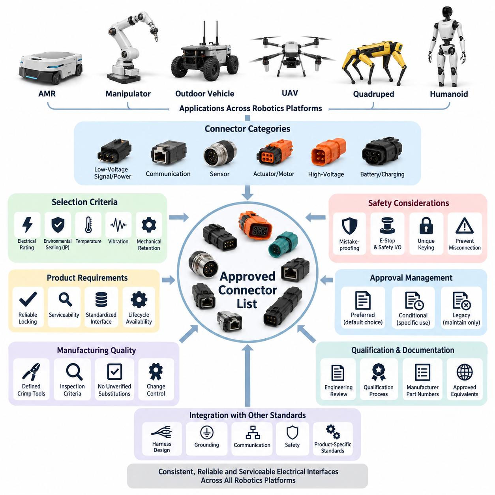
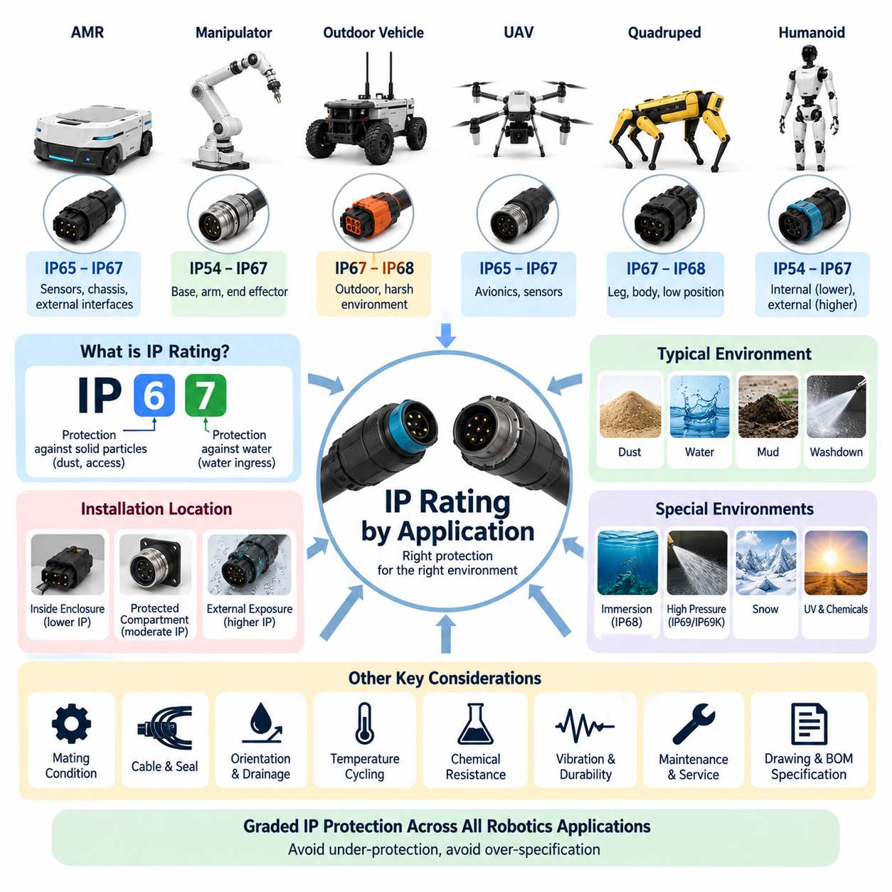
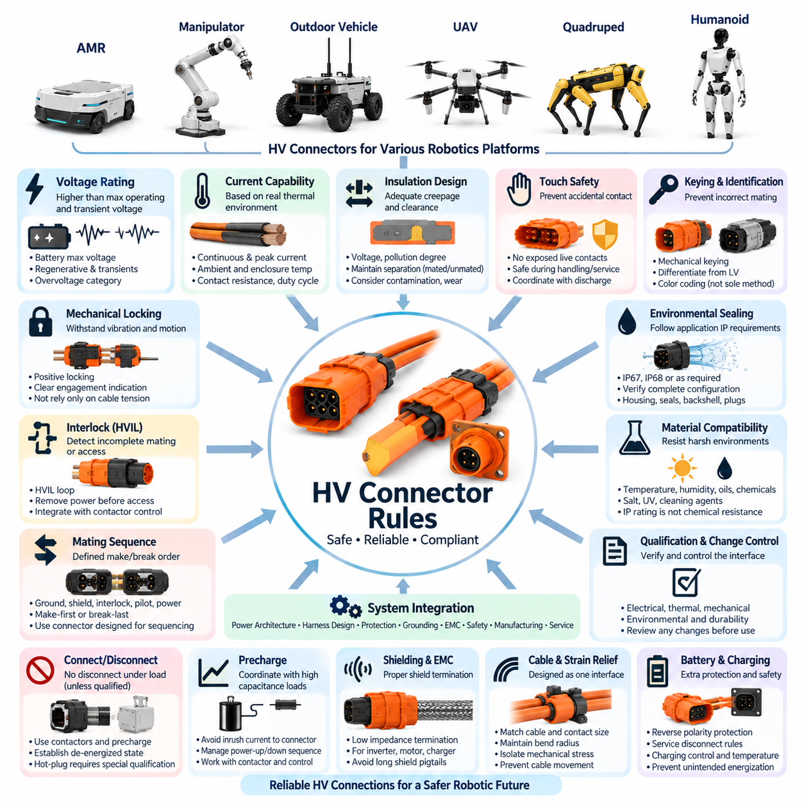
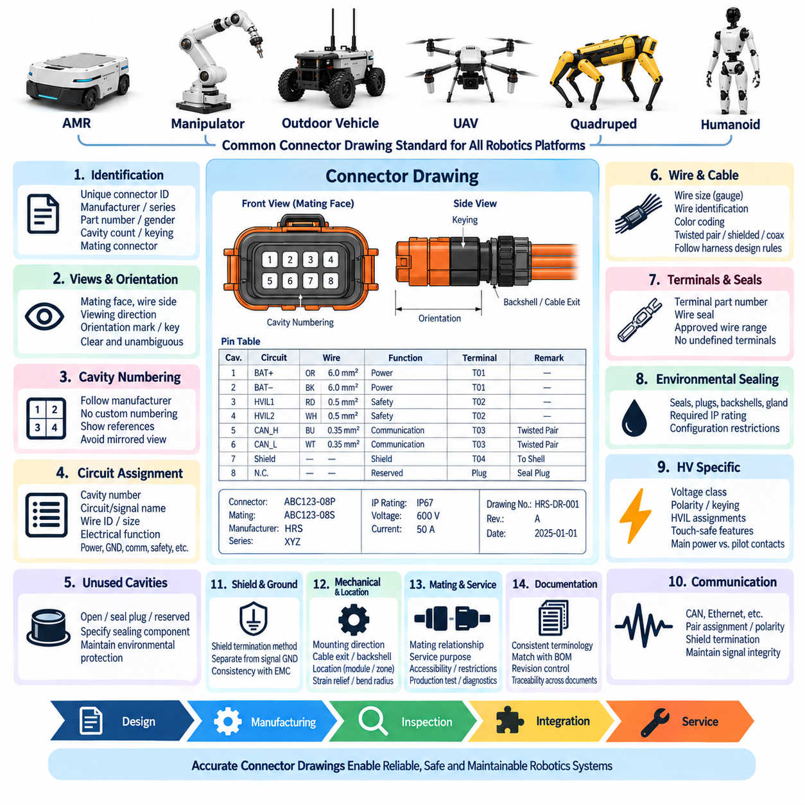
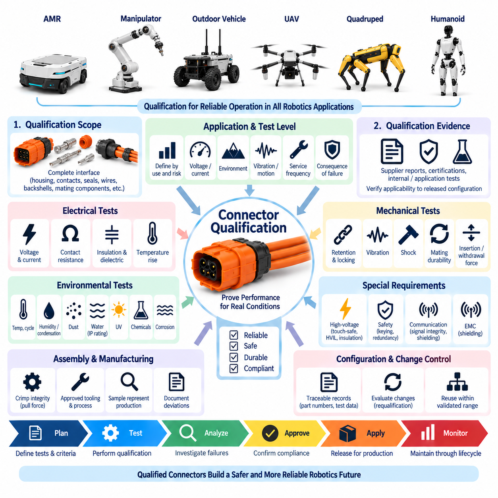

**Volume 22. Hills Robotics Engineering Standards**

# Chapter 03. HRS-003 Connector Selection

## 03.01. Approved Connector List

{width="7.268055555555556in" height="7.268055555555556in"}

The approved connector list establishes a controlled set of connector families that may be used in Hills Robotics electrical and electronic designs. Its purpose is to reduce unnecessary connector variation, improve harness interchangeability, simplify procurement, and ensure that connectors used across AMRs, manipulators, outdoor vehicles, UAVs, quadrupeds, and humanoids satisfy consistent engineering expectations.

Approval applies to a connector family and its defined configuration rather than merely to a manufacturer name. The engineering record should identify the series, housing type, contact system, pin-count range, allowable wire sizes, current and voltage limits, sealing capability, keying method, and applicable accessories. Terminals, seals, backshells, wedges, plugs, and mating components shall therefore be treated as part of the approved connection system.

Connector selection shall begin with the electrical function of the interface. Low-current sensor and signal circuits, communication networks, auxiliary power circuits, actuator power, battery distribution, and high-voltage interfaces impose different requirements on contact resistance, spacing, shielding, sealing, and mechanical retention. A connector approved for one circuit class shall not automatically be considered suitable for another solely because its pin count is sufficient.

For internal low-voltage electronics located inside protected enclosures, compact board-to-wire or wire-to-wire connector families may be approved when their voltage, current, temperature, vibration, and retention characteristics match the application. Connectors used for serviceable modules should include positive polarization and a reliable locking feature. Friction-only retention should be restricted to locations where environmental and mechanical loads are demonstrably controlled.

External robot interfaces require connector families designed for repeated vibration, contamination, and service exposure. Sealed automotive or industrial connectors are preferred where cables pass between chassis modules, sensors, actuators, power distribution units, and externally mounted equipment. The required environmental protection shall be selected according to the application-specific IP rating rules defined separately within the connector selection standard.

For automotive-style low-voltage power and control interfaces, approved families should provide robust secondary locking, terminal position assurance where appropriate, polarization, replaceable contacts, and sealed variants. Contact systems shall support the specified conductor cross-section without modifying terminals or seals. Designers shall not mix terminals, housings, seals, or secondary locks from nominally similar but unqualified connector families.

Industrial connectors may be approved for fixed or semi-fixed equipment interfaces where standardized field wiring, serviceability, and mechanical robustness are important. Circular connectors, M-series sensor connectors, industrial Ethernet connectors, and locking power connectors may be used when appropriate to the installation environment. Their use on moving robot structures additionally requires evaluation of vibration, cable bending, strain relief, and mating retention.

Communication connectors shall be selected together with the physical-layer requirements of the network. CAN, CAN FD, RS-485, Ethernet, EtherCAT, camera links, and time-synchronization interfaces may require controlled impedance, twisted pairs, shielding, or dedicated contact arrangements. An electrically compatible connector is not necessarily communication-qualified if its geometry, shield termination, or contact discontinuity degrades signal integrity at the required data rate.

Sensor connectors should favor standardized interfaces when this improves replacement and field service. LiDAR, cameras, radar, IMUs, GNSS receivers, safety sensors, encoders, and environmental sensors may use different approved families depending on bandwidth and power requirements. Where power and high-speed data share one connector, pin allocation shall maintain adequate separation and grounding so that switching noise does not compromise sensitive signal paths.

Actuator and motor interfaces require special attention to continuous current, peak current, contact heating, vibration, and disconnect behavior. Connector current ratings shall not be accepted directly from nominal catalog values without considering ambient temperature, number of simultaneously loaded contacts, enclosure temperature, conductor size, and duty cycle. High-current motor connectors should also provide mechanical keying that prevents accidental interchange with low-power interfaces.

High-voltage connector systems shall be maintained as a distinct approved category and shall comply with the dedicated HV connector rules defined elsewhere in HRS_003. Approved HV families should provide appropriate creepage and clearance, touch-safe construction, polarization, secure locking, and environmental sealing. Where required by system architecture, high-voltage interlock capability, shielding, and controlled connection sequencing shall be incorporated into the connector system.

Battery and charging connectors require separate consideration because they may experience high continuous current, repeated mating cycles, transient loads, and operator interaction. Approved families shall have clearly defined current derating, contact temperature limits, mating-cycle capability, and protection against reverse connection. Service-disconnect connectors shall additionally support safe handling procedures and prevent unintended exposure to energized conductive parts.

Safety-related interfaces should use connector configurations that minimize foreseeable assembly errors. Emergency-stop circuits, safety LiDAR, safety PLC I/O, brake control, and other safety functions should not depend solely on wire color or labels for correct connection. Unique keying, dedicated connector families, separated pin assignments, or other mistake-proofing measures should be applied according to the consequence of an incorrect connection.

Approved connector families shall be evaluated as complete harness interfaces, including cable exit direction and strain relief. A connector that satisfies electrical requirements may still be unacceptable when its backshell forces an excessive bend radius, interferes with neighboring components, or transfers cable motion directly into contacts. Straight and right-angle variants should therefore be approved independently when their mechanical installation characteristics differ significantly.

Serviceability is an essential approval criterion for robotics platforms expected to operate over long field lifetimes. Preferred connector families should permit visual verification of locking, controlled disconnection using normal service tools, replacement of damaged terminals where practical, and procurement of mating components throughout the expected product lifecycle. Connectors requiring destructive removal should be limited to interfaces intentionally designated as non-serviceable.

The approved list shall distinguish preferred, conditional, and legacy connector status where configuration management requires such differentiation. Preferred families are the default choice for new designs. Conditional families may be used only for defined environmental, packaging, supplier, or equipment constraints. Legacy connectors may remain on released products for compatibility but should not normally be introduced into new platforms without an engineering justification and formal approval.

Each released connector shall have controlled manufacturer and supplier information associated with the engineering BOM. Manufacturer part numbers should identify the exact housing, terminal, seal, accessory, and mating component rather than relying on descriptive names. Approved equivalent parts may be listed only after dimensional, electrical, material, environmental, tooling, and manufacturing compatibility have been verified through the applicable qualification process.

No connector shall be added to the approved list solely because it is commercially available or has been used successfully in an unrelated product. New connector families require engineering review against electrical load, environmental exposure, vibration, mating durability, sealing, assembly process, inspection capability, supplier stability, and service requirements. Qualification expectations shall follow the dedicated HRS_003 qualification requirement rather than being embedded informally in individual projects.

Connector standardization should also support manufacturing quality. Approved contacts should have defined crimp tools, applicators, strip lengths, pull-force expectations, and inspection criteria. Hand-crimp substitutions, generic terminals, or unverified tooling shall not be introduced merely to resolve short-term production shortages. Any temporary deviation should be documented through the engineering change process and assessed for both electrical and mechanical reliability.

Robotic platforms frequently combine low-voltage power, high-current actuators, high-speed data, safety circuits, and sensitive perception electronics within a compact structure. The approved connector strategy should therefore encourage functional differentiation through connector size, keying, color coding where appropriate, and physical placement. Maintenance personnel should be able to reconnect modules without creating credible cross-mating between incompatible electrical domains.

Connector selection shall remain consistent with harness design, grounding, communication, safety, and product-specific standards across the wider robotics engineering framework. The connector list is therefore not an isolated purchasing catalog but a controlled architectural resource linking electrical interfaces to manufacturing and lifecycle requirements. This supports consistent implementation across the broader electrical, communication, safety, AMR, manipulator, outdoor vehicle, UAV, quadruped, and humanoid engineering structure.

## 03.02. IP Rating by Application

{width="7.268055555555556in" height="7.268055555555556in"}

The IP rating assigned to a connector shall reflect the actual environmental exposure of its installation rather than the general classification of the robot. A connector located inside a sealed electronics enclosure may require substantially less protection than an externally mounted connector on the same platform. Selection shall consider dust, water, condensation, cleaning procedures, mounting orientation, operating motion, and foreseeable service conditions.

IP ratings shall be interpreted according to the applicable ingress protection standard and shall not be treated as a general measure of connector quality. The first characteristic numeral represents protection against access and solid-particle ingress, while the second represents protection against water ingress under defined test conditions. Designers shall verify the precise qualification represented by the specified rating rather than relying only on labels such as waterproof or dustproof.

Connectors installed entirely inside dry, environmentally controlled electrical cabinets may generally use lower ingress protection when the enclosure itself provides the required environmental barrier. In such applications, connector selection should emphasize electrical rating, polarization, retention, serviceability, and contact reliability. The enclosure IP rating does not automatically transfer to exposed connectors installed through its walls or service openings.

Protected internal robot compartments that can experience dust, occasional condensation, or maintenance exposure should normally use connectors providing a moderate level of ingress resistance. IP4X or higher solid-object protection may be appropriate depending on enclosure design, while water protection should reflect realistic internal exposure. Where condensation is credible, material compatibility and contact corrosion resistance remain necessary even when direct water spray is unlikely.

For general industrial robot interfaces exposed to dust and occasional water splash, IP54 should be regarded as a practical minimum reference where the installation environment requires basic dust and splash protection. The final requirement shall nevertheless be determined from the actual hazard analysis. IP54 does not provide the same protection as sealed connector systems intended for washdown, outdoor weather, temporary immersion, or high-pressure cleaning.

External AMR connectors located near sensors, bumpers, chassis panels, or exposed harness routes should normally target at least IP65 when direct dust and water-jet exposure is credible. Connectors mounted close to wheels, floor level, suspension elements, or cleaning zones may require IP67 or higher because splash, accumulated water, mud, and temporary immersion can occur during normal operation or maintenance.

Indoor AMRs operating exclusively in clean warehouses may permit lower ratings for connectors protected by body panels, but floor-level interfaces require additional caution. Cleaning machines, wet floors, spilled liquids, and maintenance washing can create exposure conditions beyond the nominal indoor environment. The connector rating shall therefore be based on installation location and operating scenario rather than the indoor classification alone.

Outdoor AMRs and autonomous vehicles should generally use sealed external connectors rated at least IP67 where dust, rain, splash, mud, and temporary water accumulation are foreseeable. IP66 may be suitable where powerful water jets represent the governing condition without immersion requirements. Interfaces positioned underneath the chassis or near wheels should be assessed for combined water, contamination, vibration, and mechanical impact.

Where repeated or prolonged immersion is a credible operating condition, IP68 may be required. The manufacturer-defined immersion depth and duration associated with IP68 shall be documented because IP68 does not represent one universal immersion condition. Engineering approval shall confirm that the qualified depth, exposure time, cable configuration, and connector mating state correspond to the intended robot application.

IP69 or IP69K-class protection may be considered for connectors subjected to high-pressure and high-temperature washdown, particularly in sanitation, food-processing, agricultural, construction, or specialized industrial environments. Such ratings shall not be specified automatically for ordinary outdoor robots. High-pressure cleaning capability should be required only where the defined cleaning process creates the corresponding exposure and qualification need.

Manipulator connectors located inside fixed bases, electrical cabinets, or protected joint covers may use lower IP ratings when the surrounding structure provides adequate protection. Interfaces on exposed arms, wrists, tool changers, or end effectors require higher protection according to dust, coolant, lubricant, process debris, and cleaning exposure. Motion shall also be considered because repeated cable flexing can degrade sealing around cable exits.

Tool changer and end-effector interfaces deserve specific evaluation because frequent mating can progressively affect sealing surfaces. A connector initially qualified to IP67 may not retain equivalent protection after contamination, mechanical wear, damaged seals, or improper mating. Where ingress protection is safety- or reliability-critical, inspection intervals, allowable mating cycles, seal condition, and replacement criteria shall be included in maintenance requirements.

Sensor interfaces for LiDAR, cameras, radar, GNSS, ultrasonic sensors, and external perception modules should typically use sealed connectors when installed outside protected housings. IP65 may be sufficient for sheltered positions, while IP67 is preferred for direct outdoor exposure. Sensors mounted low on the chassis or in splash zones may require IP67, IP68, or application-specific higher protection based on the defined operating environment.

Quadruped robots require particular attention because connectors can operate close to the ground while experiencing dust, rain, mud, vegetation, impact, and rapid body motion. External leg and body interfaces should normally use robust sealed connector systems, with IP67 serving as a practical baseline for demanding field operation. Higher protection may be necessary for robots expected to traverse standing water or undergo intensive cleaning.

Humanoid robots may contain numerous internal connectors protected by structural covers, allowing differentiated IP requirements rather than applying one high rating throughout the platform. Exposed connectors around feet, lower legs, hands, service ports, and externally mounted sensors require greater protection. Interfaces near joints shall additionally account for movement, seal deformation, cable strain, and contamination introduced during maintenance.

Cargo UAV connector requirements shall consider rain, airborne dust, humidity, condensation, altitude-related environmental changes, and ground handling. Externally exposed avionics, propulsion, lighting, sensor, and cargo interfaces should use appropriately sealed connector systems. Selection shall also consider weight and vibration because unnecessarily high sealing requirements can increase connector mass, size, mating force, and harness complexity.

Battery and charging interfaces shall be evaluated separately from ordinary signal connectors. These interfaces may be exposed during battery replacement, charging, maintenance, or outdoor operation and may encounter moisture while significant electrical energy is available. Required IP protection shall be defined for both mated and unmated conditions, because many connector systems achieve their specified sealing performance only when completely mated.

The specified IP rating applies only to the connector configuration represented by the qualification test. Housing, terminal, seal, backshell, cable diameter, blanking plug, assembly method, and mating condition can all influence sealing performance. Substituting a wire outside the approved seal range, omitting a cavity plug, damaging a seal, or incorrectly assembling a backshell can invalidate the intended ingress protection even when the housing part number is unchanged.

Unused connector cavities shall be sealed using approved cavity plugs when required by the connector system. Unmated service connectors shall use qualified protective caps where environmental exposure can occur. Temporary tape, generic rubber covers, grease, or field-applied sealant shall not be considered equivalent to a qualified sealing component unless specifically validated through the applicable engineering qualification and change-control process.

Ingress protection shall be evaluated together with connector orientation and harness routing. Downward-facing interfaces, drip loops, drainage paths, and protected mounting positions can reduce direct exposure, whereas upward-facing connectors may collect water around sealing interfaces. Mechanical packaging should prevent standing water from remaining at connector boundaries and should avoid routing that transfers water along the harness directly toward the connector.

Environmental sealing shall not compromise pressure equalization or create hidden condensation problems within enclosed modules. Temperature cycling can produce internal pressure changes that draw moisture through marginal seals or cable interfaces. Where sealed electronic compartments experience substantial thermal cycling, the complete enclosure architecture, vents, glands, connectors, and drainage strategy shall be considered together rather than treating each connector independently.

An IP rating alone does not demonstrate resistance to salt, oils, fuels, hydraulic fluids, cleaning chemicals, ultraviolet radiation, or other environmental agents. Applications exposed to such substances require separate material compatibility evaluation. Similarly, IP qualification does not replace vibration, temperature, mating durability, corrosion, EMC, electrical load, or mechanical retention testing required by the connector qualification process.

The engineering drawing and BOM shall identify the required IP rating where it is a controlled interface characteristic. The requirement should also specify whether the rating applies when mated, unmated, capped, or under another defined configuration. Supplier documentation and qualification evidence shall be retained so that production, quality, service, and engineering teams can verify that the released connector configuration satisfies the intended application.

IP requirements shall be reviewed whenever connector location, enclosure design, robot operating environment, cleaning procedure, cable routing, or service concept changes. Moving an approved connector from a protected internal position to an external location can create a new environmental requirement even when its electrical function remains unchanged. Such changes shall therefore trigger engineering review rather than automatic reuse of the previous connector approval.

Application-based IP selection ultimately provides a graded protection strategy across the robotics platform. Protected electronics may use moderate ingress protection, while exposed sensors, actuators, chassis interfaces, batteries, and outdoor equipment receive progressively stronger sealing according to their actual exposure. This approach avoids both under-protection that reduces reliability and unnecessary over-specification that increases cost, size, weight, and service complexity.

## 03.03. HV Connector Rules

{width="7.268055555555556in" height="7.268055555555556in"}

High-voltage connectors shall be treated as safety-critical electrical interfaces rather than as scaled versions of low-voltage connectors. Their selection and integration shall address operating voltage, transient voltage, continuous and peak current, insulation coordination, environmental exposure, mechanical loads, service conditions, and foreseeable misuse. HV interfaces shall remain clearly distinguishable from LV signal and power connections throughout the robot architecture.

The HV connector voltage rating shall exceed the maximum voltage that can occur at the interface under normal operation and defined abnormal conditions. Selection shall consider battery maximum charge voltage, regenerative conditions, switching transients, converter behavior, and applicable overvoltage categories. Nominal battery voltage alone shall not be used as the basis for connector voltage qualification or insulation design.

Continuous current capability shall be determined from the actual thermal environment rather than directly adopting the connector catalog rating. Conductor size, contact resistance, ambient temperature, enclosure temperature, simultaneously loaded contacts, duty cycle, cooling conditions, and allowable temperature rise shall be considered. Peak current capability shall also be verified for acceleration, actuator startup, charging, and transient power demands.

Creepage and clearance distances shall be appropriate for the maximum working voltage, transient conditions, pollution degree, insulation material, and environmental exposure of the application. Connector geometry shall preserve the required insulation separation both while fully mated and during defined service conditions. Contamination, condensation, conductive dust, and mechanical wear shall be considered where they can reduce effective insulation performance.

HV connector systems shall provide touch-safe protection against accidental contact with hazardous energized conductors. Exposed conductive HV contacts shall not become accessible during normal handling, intended servicing, or foreseeable partial disconnection. Where stored electrical energy remains after system shutdown, the connector design shall be coordinated with discharge circuits and service procedures so that safe voltage is achieved before hazardous contacts become accessible.

Mechanical polarization and keying shall prevent incorrect mating between HV circuits of different voltage classes, polarity, or functions. HV connectors shall also be physically differentiated from low-voltage connectors where credible cross-mating could create a hazard. Color coding may support identification but shall not serve as the only means of preventing an electrically incompatible connection.

Positive mechanical locking shall be provided for HV connectors subjected to vibration, vehicle motion, manipulator movement, UAV operation, or repeated handling. The locking mechanism shall resist unintended separation under the defined mechanical environment and should provide clear indication of complete engagement. Connector retention shall not depend solely on cable tension, friction, or operator judgment.

Where required by the system safety architecture, a high-voltage interlock loop, or HVIL, shall detect incomplete mating, unintended disconnection, opened service covers, or other defined HV access conditions. The interlock shall be coordinated with the contactor and power control strategy so that hazardous power is removed before the main HV contacts become accessible or separate under load.

The connector mating sequence shall be controlled when electrical safety depends on contact timing. Protective ground, shield, interlock, pilot, and main power contacts may require defined make-first or break-last behavior depending on the architecture. Designers shall use connector systems specifically engineered for the required sequencing rather than assuming that mechanical connector travel inherently provides safe electrical timing.

HV connectors shall not normally be connected or disconnected while carrying load unless the connector system is specifically designed and qualified for that operation. Contactors, precharge circuits, discharge circuits, and system control logic should establish a de-energized condition before manual separation. Any interface intentionally designed for hot-plug or load-break operation requires dedicated qualification and explicit engineering approval.

Precharge architecture shall be coordinated with HV connectors where large DC-link capacitance or power electronic loads are present. The connector shall not be expected to absorb uncontrolled inrush current caused by charging downstream capacitors during mating. Precharge completion, main contactor closure, and connector interlock status should be managed as part of a defined power-up and power-down state sequence.

Environmental sealing requirements shall follow the installation environment and the application-specific IP rules. External HV connectors on outdoor robots, exposed battery systems, propulsion equipment, or charging interfaces may require IP67, IP68, or other qualified protection. The specified ingress rating shall be verified for the actual housing, seal, cable diameter, backshell, cavity plugs, and mating condition used in production.

HV connector materials shall be compatible with expected temperature, humidity, vibration, oils, cleaning agents, salt exposure, ultraviolet radiation, and other relevant environmental conditions. An IP rating alone does not demonstrate resistance to chemical degradation or corrosion. Material compatibility and environmental durability shall therefore be evaluated separately where the operating environment creates such exposure.

Cable shielding and connector shield termination shall be designed according to EMC requirements for inverter, motor, DC/DC converter, charger, and other high-frequency power electronic circuits. Where shield continuity is required, the connector should provide a low-impedance termination suitable for the frequency range of concern. Long shield pigtails should be avoided where they significantly degrade high-frequency shielding effectiveness.

HV cable conductor size and connector contact size shall be engineered as one electrical and thermal interface. A large conductor shall not be reduced locally merely to fit an undersized connector terminal without documented analysis and approval. Likewise, a high-current connector does not compensate for an undersized cable. Cable ampacity, terminal heating, voltage drop, mechanical strain, and fault current shall be evaluated together.

Strain relief shall prevent cable weight, bending, vibration, and external forces from being transferred directly to HV contacts or seals. Minimum bend radius shall be maintained near the connector, particularly for large shielded power cables. Connector mounting and harness routing shall provide sufficient service clearance while preventing repeated cable motion from loosening the connector or degrading environmental sealing.

Battery connectors and service disconnects require additional protection because they may remain energized independently of the main vehicle or robot contactors. Their design shall prevent reverse polarity, unintended reconnection, and accidental access to hazardous voltage. Where manual service disconnects are provided, their removal sequence, touch protection, stored-energy discharge, and lockout procedure shall be explicitly defined.

Charging connectors shall be selected according to charging voltage, maximum continuous current, communication or pilot requirements, mating frequency, environmental exposure, and operator interaction. Temperature monitoring should be considered where high-current charging can produce significant contact heating. Charging interfaces shall prevent unintended energization before correct mating and shall coordinate disconnection with charger power control.

HV interfaces used on mobile manipulators, quadrupeds, humanoids, and other articulated robots shall account for repeated motion and dynamic loading. Connectors should preferably be located away from high-flex zones unless specifically designed for such service. Where HV wiring crosses joints, cable routing, flex life, strain relief, abrasion protection, and fault containment shall be evaluated as part of the complete moving harness system.

Outdoor autonomous vehicles and heavy AMRs may contain multiple HV domains for traction, auxiliary power, high-power actuators, and charging. Connector keying and architecture shall prevent accidental interchange among these domains. Interfaces located underneath the chassis or near wheels require additional consideration of impact, stone exposure, water, mud, conductive contamination, and maintenance accessibility.

Cargo UAV HV connectors shall account for vibration, mass, packaging volume, altitude, temperature variation, propulsion current, and maintenance requirements. Connector mass reduction shall not compromise insulation, locking, current capability, or touch protection. Propulsion and battery interfaces should be arranged to minimize the probability that a single connector fault can disable multiple redundant power channels when redundancy is required.

HV connectors shall be positioned so that routine maintenance on unrelated LV electronics does not unnecessarily expose personnel to hazardous-voltage interfaces. Physical segregation, covers, barriers, labeling, and controlled service access should support the electrical architecture. Service procedures shall define isolation, verification of de-energization, discharge waiting time where applicable, and conditions for reconnecting HV components.

Connector housings, cables, and associated HV components shall use consistent identification where required by the product architecture and applicable regulations or standards. Identification should remain visible during assembly and service. Labels shall indicate relevant hazards or circuit information when necessary, but markings shall supplement rather than replace physical protection, polarization, interlocking, and safe system design.

Each released HV connector configuration shall be controlled through the engineering drawing and BOM. The record shall identify the exact housing, contacts, seals, backshell, shielding components, HVIL components, cavity plugs, mating connector, cable range, and approved tooling where applicable. Substituting apparently compatible components shall not be permitted without engineering review and qualification.

Crimping and termination processes for HV contacts shall use approved tooling and controlled process parameters. Conductor preparation, strip length, shield preparation, crimp geometry, pull force, seal installation, and visual inspection criteria shall be defined. Poor termination can create localized resistance and thermal runaway even when the connector housing itself satisfies the required voltage and current ratings.

HV connector qualification shall address the conditions relevant to the intended product, including electrical withstand, insulation resistance, contact resistance, temperature rise, vibration, mechanical shock, mating durability, environmental sealing, corrosion, and thermal cycling as applicable. Safety-related functions such as HVIL operation, touch protection, keying, and controlled disconnection shall also be verified where incorporated.

Any change to connector family, contact material, terminal size, cable cross-section, seal, backshell, supplier, manufacturing process, mounting location, or operating environment shall be evaluated for its effect on the released HV interface. Changes that can affect electrical, thermal, mechanical, environmental, EMC, or safety performance require documented engineering review before implementation.

The HV connector rules ultimately establish a coordinated interface between power architecture, harness design, protection, grounding, EMC, safety, manufacturing, and service. A compliant HV connection is therefore not defined by connector voltage and current ratings alone. It is a qualified system in which electrical insulation, thermal capability, touch protection, interlocking, mechanical retention, environmental sealing, and lifecycle control work together.

## 03.04. Connector Drawing Standard

{width="7.268055555555556in" height="7.268055555555556in"}

Connector drawings shall provide a controlled engineering definition of every electrical interface used within the robotics platform. The drawing shall communicate not only connector identity but also orientation, cavity numbering, circuit allocation, mating information, terminals, seals, wire requirements, and applicable assembly constraints. It shall serve as a common reference for electrical design, harness manufacturing, inspection, integration, and service.

Each connector used in a released design shall have a unique connector reference identifier consistent with the project electrical architecture and harness documentation. The identifier shall remain stable throughout the product lifecycle unless formal configuration control requires reassignment. The same identifier shall be used consistently in schematics, harness drawings, wiring tables, BOM records, diagnostic documentation, and service information.

The drawing shall identify the connector manufacturer, connector family or series, exact housing part number, gender where applicable, number of cavities, keying or polarization option, and mating connector. Generic descriptions such as "8-pin connector" are insufficient for released documentation. Manufacturer part numbers shall correspond to the exact approved configuration rather than to a visually similar connector within the same family.

Connector views shall clearly state the viewing direction used for cavity numbering. The drawing shall distinguish mating-face view, wire-side view, and any other orientation that could affect interpretation. Ambiguous cavity diagrams are prohibited because mirrored interpretation can reverse pin assignments during manufacturing or service. Orientation marks, locking features, keys, and reference geometry should be shown where necessary.

Cavity numbering shall follow the connector manufacturer's defined numbering whenever such numbering exists. Engineering documentation shall not create an alternative numbering system merely for drawing convenience. If manufacturer markings are difficult to observe after installation, the drawing may provide additional graphical references, but the official cavity identification shall remain traceable to the connector supplier documentation.

Every populated cavity shall identify the associated circuit or signal. The pin table should include cavity number, circuit name, signal name where applicable, wire identification, conductor size, and relevant electrical function. Power, ground, communication, safety, sensor, actuator, shield, interlock, and reserved circuits shall be distinguishable so that the connector definition can be understood without relying on undocumented engineering knowledge.

Unused cavities shall be explicitly identified rather than left ambiguous. The drawing shall distinguish unused cavities that remain open, cavities requiring sealing plugs, reserved cavities intended for future expansion, and positions intentionally blocked by connector configuration. For sealed connector systems, the required cavity plug or sealing component shall be specified whenever an unused position must remain environmentally protected.

Wire information associated with each cavity shall use the controlled harness design conventions. Conductor cross-section or approved gauge, wire identification, insulation requirements where relevant, and color coding shall be consistent with the harness drawing and BOM. Where twisted pairs, shielded cables, coaxial cables, or other special cable constructions are required, the connector drawing shall identify the relationship between those conductors and their assigned contacts.

Terminal information shall be controlled at the same level as the connector housing. Each contact position or applicable wire range shall reference the approved terminal part number and, where necessary, the associated wire seal. A housing shall not be considered fully defined without its compatible terminals and sealing components. Alternative terminals may be listed only when their approved application range and qualification status are clearly documented.

For sealed connectors, the drawing shall define all components required to achieve the specified ingress protection. This may include individual wire seals, interface seals, rear seals, cavity plugs, backshells, grommets, cable glands, and protective caps. The required IP rating shall be referenced when it is a controlled characteristic, together with any configuration restrictions necessary to preserve the qualified sealing performance.

High-voltage connector drawings shall include additional information required by the HV connector rules. Voltage class, polarity, high-voltage interlock loop assignments, shielding provisions, touch-safe features, keying, and relevant service constraints shall be documented where applicable. Main power contacts and HVIL or pilot contacts shall be clearly differentiated so that manufacturing and service personnel cannot confuse their functions.

Communication connector drawings shall preserve physical-layer requirements of the associated network. CAN, CAN FD, RS-485, Ethernet, EtherCAT, camera, and other high-speed interfaces may require defined twisted-pair assignments, pair polarity, shield termination, or controlled cable construction. Pin tables shall make these relationships explicit and shall avoid arbitrary reassignment that could degrade signal integrity or network interoperability.

Shield termination shall be represented separately from ordinary signal ground when the architecture requires chassis or connector-shell termination. The drawing shall identify whether the cable shield connects through a dedicated contact, connector shell, backshell, drain wire, or another defined method. Shielding instructions shall remain consistent with the grounding and EMC standards so that harness manufacturing does not unintentionally alter the intended EMC architecture.

Safety-related circuits shall be clearly identifiable within connector documentation. Emergency-stop, brake, safety sensor, interlock, redundant control, and other safety functions should include sufficient identification to prevent accidental reassignment or substitution. Where redundant channels pass through the same connector, channel allocation and separation shall be shown clearly and coordinated with the applicable safety architecture requirements.

Connector drawings shall indicate the mating relationship between harness-side and equipment-side interfaces. Both connector identifiers and exact mating part numbers should be traceable where the mating half is controlled by Hills Robotics. For purchased sensors, actuators, controllers, or other equipment with supplier-defined connectors, the drawing shall reference the equipment interface and supplier documentation necessary to establish compatibility.

Mechanical orientation shall be documented when connector rotation or mounting direction affects harness routing, accessibility, drainage, sealing, or mating. Right-angle backshell orientation, cable exit direction, panel mounting position, and key location should be shown when relevant. A connector drawing shall not imply that mechanically different orientations are interchangeable when packaging or environmental performance depends on their installed direction.

Connector location information should provide sufficient context to associate the interface with the corresponding robot module or harness branch. The drawing may reference a zone, module, subsystem, or harness segment rather than reproducing complete vehicle packaging. Location terminology shall remain consistent with the electrical architecture so that design, manufacturing, and service teams refer to the same physical interface using the same designation.

Service connectors and diagnostic interfaces shall be identified according to their intended accessibility and usage. The documentation should indicate when a connector is intended for production test, calibration, diagnostics, software update, maintenance, or emergency service. Interfaces that shall not be disconnected during normal service should include an appropriate restriction or reference to the applicable service procedure.

The connector drawing shall reference required strain-relief and backshell arrangements where these components affect interface reliability. Cable clamps, boots, grommets, backshells, or other support components shall be identified when necessary to prevent cable loads from reaching terminals or seals. Minimum bend-radius or cable-exit constraints should be stated when violation could damage the connector, cable, or environmental sealing.

Crimp and termination requirements shall be traceable from the connector documentation to the applicable manufacturing specification. Approved tooling, applicators, strip dimensions, crimp parameters, pull-force requirements, or inspection criteria need not all be reproduced on every drawing when controlled elsewhere, but the drawing shall provide sufficient references to ensure that the correct manufacturing standard can be unambiguously identified.

Connector tables shall use standardized terminology, units, abbreviations, and field order across robotics projects wherever practical. Consistent drawing structure reduces interpretation errors and allows engineers, technicians, suppliers, and automated engineering tools to process connector information more reliably. Project-specific additions may be introduced when necessary, but they shall not redefine established fields without configuration approval.

The engineering BOM shall remain synchronized with the connector drawing. Housing, terminal, seal, plug, backshell, protective cap, and other controlled connector components shown on the drawing shall correspond to released BOM items. Components shall not exist only in graphical notes or informal assembly instructions when they are required for production, sealing, electrical performance, safety, or serviceability.

Drawing revision status shall be controlled through the engineering change process. Any modification to pin assignment, connector family, terminal, wire size, sealing component, keying, mating interface, or safety-related function shall be evaluated for downstream impact. Changes shall be coordinated with schematics, harness drawings, BOMs, software interface definitions, manufacturing instructions, test procedures, and service documentation where affected.

Pin-assignment changes require particular care because physical compatibility can conceal electrical incompatibility. A connector housing may remain unchanged while a revised pinout creates risk to existing harnesses, modules, test equipment, or field-service parts. When backward compatibility cannot be maintained, the drawing and change record shall clearly identify the incompatibility and define appropriate keying, revision, or replacement controls.

Released connector drawings shall be sufficiently complete for independent verification by manufacturing and quality personnel. Inspectors should be able to confirm connector identity, cavity population, terminal selection, seals, plugs, wire assignments, orientation, and mating configuration without relying on verbal instructions. Any information necessary to determine whether the interface has been assembled correctly shall be controlled and traceable.

Digital connector data used by electrical CAD, harness design, PLM, or manufacturing systems shall remain consistent with the released engineering drawing. Library symbols, cavity definitions, manufacturer part numbers, terminal mappings, and mating relationships should be managed as controlled engineering data. Automated data exchange shall reduce duplicate entry but shall not bypass engineering review or configuration management.

The connector drawing standard ultimately creates a single authoritative definition of each physical electrical interface. By integrating connector identity, cavity allocation, wiring, terminals, sealing, mating, orientation, manufacturing references, and revision control, the drawing connects electrical architecture with production reality. Consistent documentation reduces wiring errors, improves traceability, supports serviceability, and enables reliable reuse across robotics platforms.

## 03.05. Qualification Requirement

{width="7.268055555555556in" height="7.268055555555556in"}

Connector qualification shall demonstrate that each released connector system can maintain its required electrical, mechanical, environmental, and safety performance throughout the intended product lifecycle. Qualification applies to the complete interface configuration rather than only to the connector housing. Contacts, seals, wires, backshells, cavity plugs, mating components, assembly processes, and installation conditions shall be included where they influence performance.

The qualification level shall be derived from the connector application and its associated risk. Internal signal connectors inside protected electronics, external sensor interfaces, actuator power connectors, safety circuits, battery connections, and high-voltage interfaces do not require identical test severity. Engineering shall define qualification conditions from actual voltage, current, environment, vibration, motion, service frequency, and consequence of failure.

Qualification evidence may include supplier test reports, recognized component certifications, previous internal qualification, application-specific testing, or a combination of these sources. Supplier data shall be reviewed for applicability to the released configuration. A connector shall not be considered qualified merely because its family has passed tests using different contacts, wire sizes, seals, cable construction, environmental conditions, or mating arrangements.

Electrical qualification shall verify that the connector supports the required operating voltage and current with adequate margin. Contact resistance, insulation resistance, dielectric withstand capability, voltage drop, leakage, and temperature rise shall be evaluated as applicable. Measurements should be performed before and after environmental or mechanical durability testing when degradation of contacts or insulation could affect long-term electrical performance.

Contact resistance shall remain sufficiently low and stable to prevent excessive voltage drop and localized heating. Qualification should evaluate initial resistance as well as resistance change after vibration, thermal cycling, mating durability, corrosion exposure, or other relevant stresses. High-current connectors require particular attention because small increases in contact resistance can generate substantial heat and accelerate further interface degradation.

Temperature-rise testing shall represent realistic electrical loading and thermal installation conditions. Current, conductor size, simultaneously energized contacts, ambient temperature, enclosure conditions, and duty cycle should correspond to the intended application or an appropriately conservative test condition. Acceptance criteria shall ensure that contact, terminal, insulation, seal, and housing temperatures remain within their allowable limits.

Insulation resistance and dielectric withstand testing shall confirm adequate electrical isolation between adjacent contacts and between energized conductors and accessible conductive structures. Test voltage and acceptance limits shall reflect the application voltage and insulation requirements. High-voltage interfaces require additional consideration of creepage, clearance, pollution, condensation, contamination, and transient voltage conditions.

Mechanical qualification shall verify connector retention, locking integrity, terminal retention, cable strain resistance, and robustness against handling loads. The connector shall remain correctly mated under the expected robot vibration, acceleration, shock, and cable forces. Mechanical testing shall include mounting arrangements representative of production because connector behavior can differ significantly when unsupported or installed differently from the actual product.

Vibration testing shall reflect the location and platform on which the connector is installed. Interfaces near motors, wheels, suspension systems, manipulators, propulsion equipment, or articulated joints may experience substantially different vibration spectra. Testing should verify electrical continuity during vibration where intermittent contact is critical and should inspect locking mechanisms, terminals, seals, housings, and cable supports afterward.

Mechanical shock testing shall be applied where impacts, drops, abrupt vehicle motion, manipulator collisions, landing loads, or transportation events are credible. Qualification shall confirm that the connector does not crack, unlock, deform, lose terminal retention, or create intermittent electrical connections. Safety-related and high-power interfaces require particular attention when mechanical damage could produce hazardous system behavior.

Mating durability shall be evaluated according to the expected number of connection cycles during manufacturing, testing, maintenance, battery replacement, tool changing, or normal operation. Qualification shall verify contact resistance, retention force, locking function, polarization, seal condition, and physical damage after the required cycle count. Frequently serviced interfaces may require substantially higher mating durability than permanent internal connections.

Insertion and withdrawal forces shall remain compatible with intended assembly and service procedures. Excessive mating force can lead to incomplete engagement, damaged terminals, or unsafe service practices, while insufficient retention can allow unintended separation. Qualification should evaluate force characteristics over the expected tolerance range and after durability testing when wear can change mechanical behavior.

Terminal retention and crimp integrity shall be verified as part of connector qualification. Approved wire sizes, conductor constructions, terminals, seals, and tooling shall be used for representative samples. Pull-force testing, crimp dimensional inspection, conductor and insulation crimp evaluation, and visual examination should confirm that the termination process provides repeatable mechanical and electrical performance.

Environmental qualification shall reproduce the conditions relevant to the installation. Temperature extremes, thermal cycling, humidity, condensation, dust, water, salt, chemicals, ultraviolet exposure, and corrosion shall be considered according to the product environment. Not every connector requires every test; however, exclusion of an environmental test shall be justified by the actual installation and protection provided by the surrounding system.

Thermal cycling shall evaluate differential expansion and contraction among contacts, housings, seals, cables, and mounting structures. Repeated temperature changes can alter contact pressure, damage seals, loosen components, or draw moisture into the connector. Electrical continuity, contact resistance, insulation condition, locking integrity, and sealing performance should be reassessed after cycling when these characteristics are relevant.

Ingress protection qualification shall verify the required IP rating using the production-representative connector configuration. Housing, seals, wire diameters, cavity plugs, backshells, cable glands, protective caps, and mating state shall match the intended application. A previously tested housing does not establish IP compliance when the released assembly uses different sealing components or cable dimensions outside the qualified range.

Chemical compatibility shall be evaluated where connectors can contact lubricants, hydraulic fluids, cleaning agents, fuels, battery materials, salt, or other process substances. Qualification should examine swelling, cracking, softening, corrosion, seal degradation, marking loss, and electrical deterioration. Material compatibility requirements shall be based on credible exposure rather than assumed from the connector's IP classification.

Corrosion resistance shall be considered for outdoor robots, UAVs, agricultural equipment, coastal operation, wet industrial environments, and other applications where moisture or contaminants can attack conductive surfaces. Testing shall verify that contacts, terminals, shielding components, locking hardware, and exposed metallic structures maintain acceptable electrical and mechanical performance after the defined exposure.

EMC-related connector qualification shall address shield continuity and termination performance where connectors form part of the electromagnetic compatibility architecture. Shielded motor, inverter, Ethernet, camera, sensor, and high-voltage interfaces may require low-impedance shell or backshell connections. Qualification shall verify that assembly tolerances and environmental aging do not compromise the intended shielding path.

Communication connectors shall be evaluated against the physical-layer requirements of the intended network. CAN, CAN FD, RS-485, Ethernet, EtherCAT, camera, and other high-speed links may require verification of continuity, pair integrity, impedance behavior, shielding, and error-free communication. Mechanical compatibility alone does not establish suitability for a communication interface operating at the required data rate.

Safety-related connector qualification shall consider failure modes that could defeat the associated safety function. Keying, polarization, locking, terminal retention, redundant channel allocation, interlock behavior, and resistance to incorrect assembly should be evaluated where relevant. Qualification evidence shall demonstrate that foreseeable connector faults are adequately prevented, detected, tolerated, or controlled by the system architecture.

High-voltage connector qualification shall additionally verify touch protection, insulation coordination, HVIL operation where used, controlled mating or disconnection behavior, temperature rise, sealing, shielding, and resistance to incorrect mating. Tests shall be coordinated with the HV connector rules and actual power architecture. Qualification of the connector shall not replace validation of contactors, precharge, discharge, or system-level HV safety functions.

Qualification samples shall represent production-intent components and manufacturing processes. Prototype connectors assembled with laboratory tools, non-production seals, substitute wires, or manually modified housings may be useful for development but shall not automatically establish production qualification. Deviations between test samples and released production configuration shall be documented and assessed before approval.

The qualification plan shall define test samples, configurations, sequence, environmental conditions, electrical loads, measurement methods, acceptance criteria, and required inspections before testing begins. Test sequencing should consider cumulative degradation when appropriate. For example, environmental and mechanical stresses may be followed by electrical measurements so that qualification demonstrates retained performance rather than only initial capability.

Failures observed during qualification shall be documented and investigated rather than removed from the data set without justification. The failure analysis should identify whether the cause is connector design, terminal selection, sealing, cable preparation, crimping, tooling, assembly, mounting, or test configuration. Corrective actions shall be verified before the connector configuration is released as qualified.

Qualification results shall be traceable to the exact connector configuration. Records should identify manufacturer part numbers, terminals, seals, wires, cable sizes, backshells, mating components, tooling, sample quantities, test conditions, results, deviations, and approval status. This traceability allows engineering to determine whether qualification remains valid when a component or application changes later in the product lifecycle.

A qualified connector shall not be assumed suitable for every robotics platform. Reuse is permitted when the new application remains within the validated electrical, mechanical, environmental, and service envelope. Moving a connector from a protected indoor AMR compartment to an outdoor chassis, high-vibration joint, high-current circuit, or UAV propulsion interface may require supplemental qualification even if the connector part number remains unchanged.

Changes to connector housing, terminal material, plating, wire size, seal, backshell, cable supplier, crimp tooling, manufacturing process, mounting orientation, environmental exposure, electrical loading, or mating frequency shall trigger qualification review. Engineering shall determine whether existing evidence remains applicable, supplemental testing is sufficient, or complete requalification is required before implementing the change.

The qualification requirement ultimately provides objective evidence that the approved connector list represents proven engineering interfaces rather than purchasing preferences. By combining electrical, mechanical, environmental, EMC, communication, safety, manufacturing, and lifecycle verification, connector qualification establishes confidence that released interfaces will remain reliable and serviceable across the intended robotics application.
