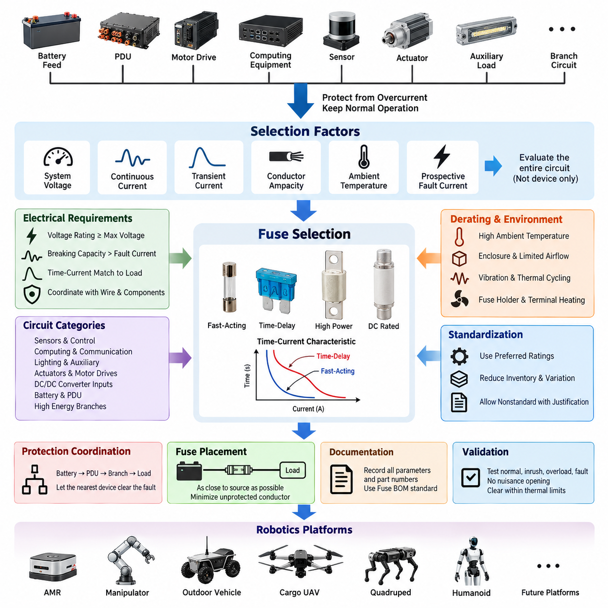
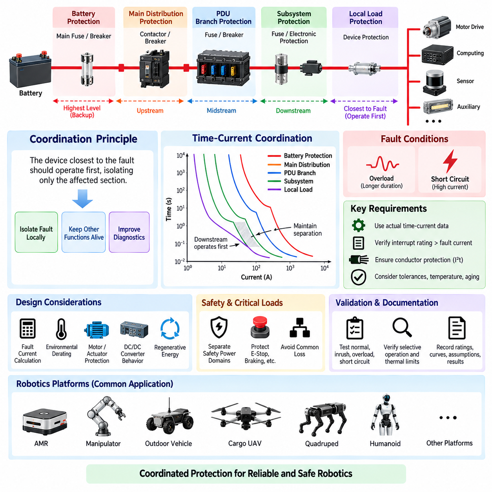
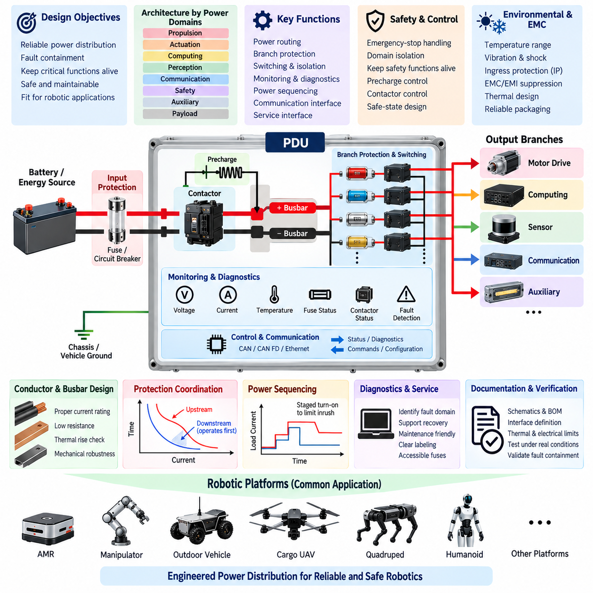
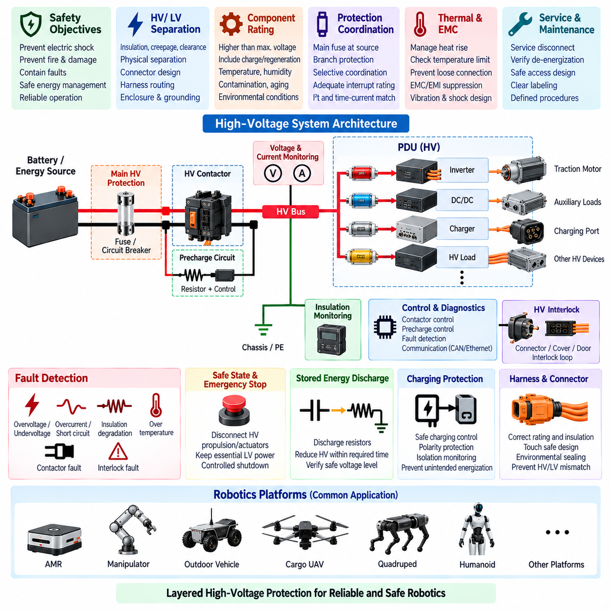
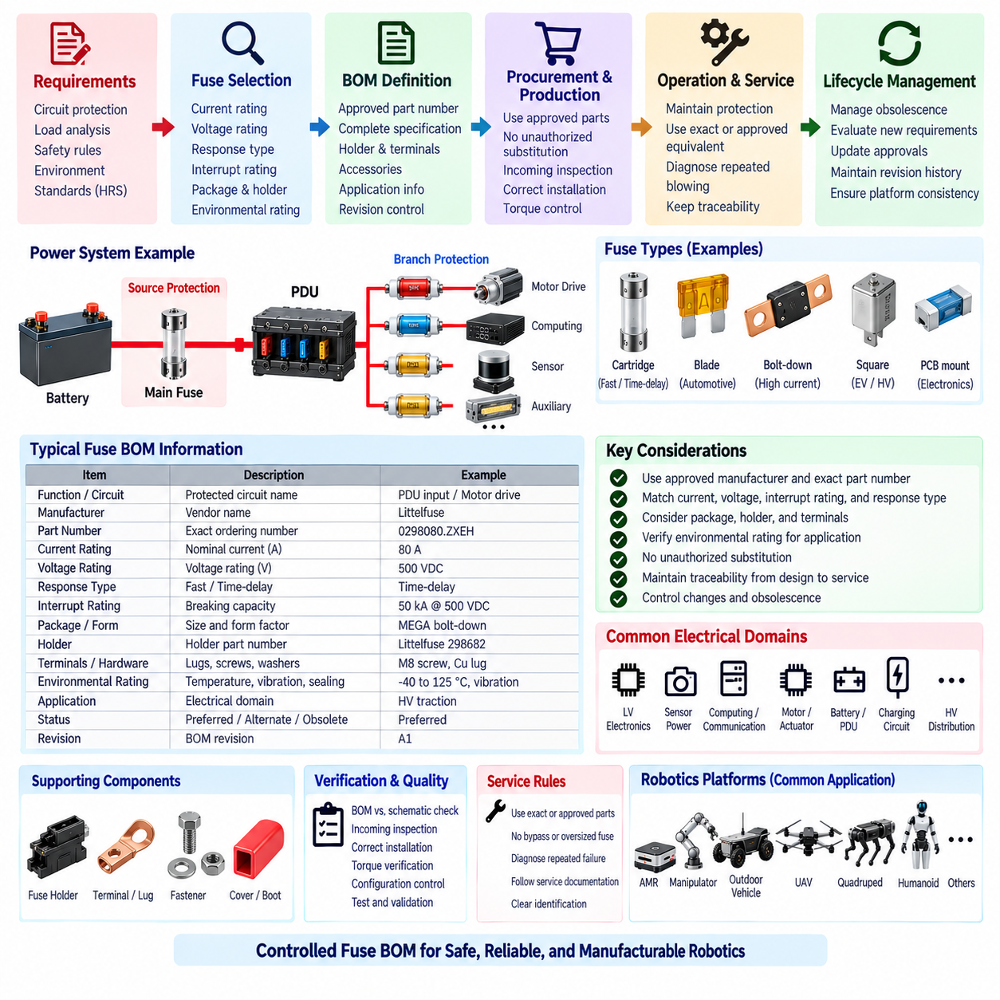

**Volume 22. Hills Robotics Engineering Standards**

# Chapter 04. HRS-004 Fuse Protection

## 04.01. Fuse Selection Table

{width="7.268055555555556in" height="7.268055555555556in"}

The fuse selection table defines the standardized method for selecting overcurrent protection devices for robotics electrical systems. It applies to battery feeds, power distribution units, motor drives, computing equipment, sensors, actuators, auxiliary loads, and downstream branch circuits. Fuse selection shall protect wiring and connected equipment while permitting normal operating current, transient startup current, and expected short-duration overloads.

Each protected circuit shall be evaluated using nominal system voltage, maximum continuous load current, expected transient current, conductor ampacity, environmental temperature, and prospective fault current. A fuse shall never be selected only from the nominal current of the connected device. The electrical characteristics of the complete circuit, including connectors, terminals, splices, harness segments, and downstream electronics, shall determine the permissible protection level.

The continuous current rating of a fuse shall provide sufficient operating margin so that normal load variations do not cause nuisance opening. As a general engineering starting point, continuous operation should remain below the effective fuse current capability after all applicable derating factors are considered. The final margin shall reflect the fuse technology, ambient temperature, enclosure conditions, manufacturer characteristics, and the load profile rather than relying on a single universal percentage.

Fuse voltage rating shall be equal to or greater than the maximum voltage that can occur across the protected circuit under normal and credible abnormal conditions. DC systems require particular attention because interrupting a DC fault is more demanding than interrupting an equivalent AC current. Devices approved only for lower-voltage or AC applications shall not be substituted into higher-voltage DC battery, propulsion, actuator, or energy-storage circuits without documented qualification.

The selected fuse breaking capacity shall exceed the maximum prospective short-circuit current available at its installation point. Battery-connected circuits can produce fault currents far above normal operating current because of low source impedance and high stored energy. The design assessment shall therefore consider battery internal resistance, cable impedance, contact resistance, parallel energy sources, DC-link capacitance, and other contributors that can increase the initial fault current.

Time-current characteristics shall be matched to the behavior of the protected load. Fast-acting protection is generally appropriate for circuits with limited allowable overload energy, while time-delay characteristics may be required for motors, capacitive inputs, DC/DC converters, computing systems, and other loads that exhibit temporary inrush. The selected characteristic shall tolerate legitimate transients while clearing damaging faults before conductors or components exceed their thermal limits.

Wire protection is a primary selection constraint. The fuse rating and its time-current response shall be coordinated with the allowable current and thermal withstand of the smallest conductor in the protected path. Connector contacts, terminals, PCB traces, distribution bars, and splices shall also be reviewed where their current capability is lower than that of the wire. Increasing fuse size solely to eliminate nuisance opening is prohibited unless the entire protected circuit is revalidated.

The standard selection table should classify circuits according to function and electrical behavior rather than treating all loads identically. Typical categories include low-power sensors and control electronics, computing and communication equipment, lighting and auxiliaries, electromechanical actuators, motor controllers, propulsion branches, DC/DC converter inputs, battery distribution circuits, and high-energy power branches. Each category requires an appropriate fuse family, rating range, and response characteristic.

Low-power electronic circuits generally require protection sized close enough to the branch capability to isolate local faults without unnecessarily disconnecting upstream systems. Sensor, communication, MCU, ECU, and interface circuits may contain small-gauge conductors and sensitive electronics, making conductor and connector limitations particularly important. Where internal electronic protection already exists, the external fuse shall still provide harness-level protection and fault isolation for the supply branch.

Motor drives and actuator circuits require explicit consideration of acceleration current, stall behavior, regenerative conditions, and repetitive transient loading. The fuse shall tolerate expected operating peaks without compromising protection against sustained overcurrent or short circuit. Selection shall use measured or validated current profiles whenever practical. Peak current capability published for a motor controller shall not automatically be interpreted as an acceptable continuous fuse rating.

Computing platforms, GPUs, industrial PCs, Jetson-class controllers, network switches, LiDAR units, cameras, and similar electronic loads may exhibit significant input inrush caused by internal capacitance. Fuse selection shall distinguish this startup event from an actual overload. Where repeated power cycling is expected, cumulative thermal effects shall be considered because a fuse subjected to frequent high-current pulses can age even when each individual pulse remains below its nominal opening threshold.

For battery and PDU applications, protection shall be arranged hierarchically so that downstream faults are cleared by the nearest appropriate protective device whenever practical. Main battery protection, PDU input protection, branch fuses, and local equipment protection shall therefore be coordinated rather than independently selected. This structure supports fault containment and preserves unaffected robot functions, consistent with the broader protection-coordination and PDU standards defined within HRS_004.

Environmental derating shall be applied when the fuse operates outside the reference conditions used for its published rating. Elevated ambient temperature, enclosed PDU packaging, neighboring heat-generating components, restricted airflow, vibration, and repeated thermal cycling can alter practical current capability and service life. Fuse holders and terminals shall receive equivalent attention because excessive contact resistance can create localized heating even when the fuse element itself remains within its nominal rating.

For each approved fuse selection, engineering documentation should identify circuit name, system voltage, normal current, maximum continuous current, transient or inrush current, wire gauge, conductor ampacity, fuse technology, nominal fuse rating, voltage rating, interrupt rating, response characteristic, and applicable derating assumptions. Manufacturer part number and approved alternatives should be controlled through the corresponding HRS fuse BOM standard rather than through informal substitution.

Standardized preferred ratings should be used wherever technically practical to reduce inventory complexity, manufacturing variation, and service errors. A nonstandard rating may be introduced when analysis demonstrates that preferred devices cannot provide adequate protection or transient tolerance. Such exceptions shall be documented with the circuit analysis and validation evidence so that later design revisions do not unintentionally replace a deliberately selected protection characteristic.

Fuse placement shall minimize the length of unprotected conductor between the energy source and the protective device. Battery-fed branches should therefore locate primary protection as close to the source or distribution point as packaging and safety constraints permit. Any conductor segment upstream of the fuse shall be treated as an unprotected high-energy path and shall receive appropriate routing, insulation, mechanical protection, separation, and short-circuit risk controls.

Validation shall include normal operation, maximum sustained load, startup or inrush conditions, representative overloads, and applicable fault cases. Testing should confirm that nuisance opening does not occur during valid robot operation and that the fuse clears unacceptable faults within the required thermal limits of the protected circuit. Where physical fault testing is impractical or hazardous, validated time-current analysis and component data may support the engineering assessment.

The HRS fuse selection table is intended to establish repeatable engineering decisions across AMRs, manipulators, outdoor autonomous vehicles, cargo UAVs, quadrupeds, humanoids, and future robotic platforms represented in the robotics engineering framework. Product-specific electrical architecture may impose stricter requirements, but it shall not weaken the fundamental principles of conductor protection, adequate interrupt capability, voltage compatibility, environmental derating, and coordinated fault isolation.

## 04.02. Protection Coordination Rules

{width="7.268055555555556in" height="7.268055555555556in"}

Protection coordination establishes how multiple protective devices operate together so that an electrical fault is isolated at the lowest practical level without unnecessarily removing power from healthy robot functions. The coordination strategy shall cover battery protection, PDU protection, branch fuses, circuit breakers, electronic protection devices, contactors, motor controllers, and local load protection as applicable to the product architecture.

The fundamental rule is that the protective device closest to the fault should normally operate before upstream protection. A short circuit in a sensor branch, for example, should disconnect that branch rather than opening the main battery fuse. This selective behavior limits the affected electrical zone, preserves unrelated functions, simplifies diagnostics, and reduces the probability that a single localized failure will disable the complete robotic platform.

Protection shall be designed as a hierarchy from the energy source toward individual loads. A typical structure consists of battery-level protection, main distribution protection, PDU branch protection, subsystem protection, and local equipment protection. Each level shall have a defined protection responsibility, and adjacent levels shall be coordinated using current ratings, time-current characteristics, fault-current capability, and the thermal withstand of the associated conductors and components.

Coordination shall consider both overload and short-circuit conditions because the required behavior can differ significantly. Moderate overloads may persist long enough for a downstream fuse or electronic limiter to operate selectively, whereas severe short circuits can drive several protective devices toward their instantaneous operating region. The engineering analysis shall demonstrate acceptable discrimination across the credible range of fault currents rather than at only one assumed fault point.

Time-current characteristic curves shall be used to evaluate coordination between series-connected protective devices. The downstream device should clear the applicable fault before the upstream device reaches its opening condition, with sufficient separation to account for manufacturing tolerance, ambient temperature, aging, and transient operating conditions. Curve overlap shall be reviewed carefully because nominal current-rating differences alone do not guarantee selective operation.

Current-rating ratios may provide an initial coordination guideline, but they shall not replace analysis of actual device characteristics. Two fuses with different nominal ratings can still overlap substantially in their high-current operating regions. Likewise, a fuse and circuit breaker may respond differently to thermal overload and magnetic or instantaneous faults. Coordination decisions shall therefore be based on manufacturer time-current data and validated system fault conditions.

The available fault current shall be calculated or conservatively estimated at each significant distribution node. Battery impedance, cable resistance, connector resistance, busbars, contactors, DC/DC converters, parallel power sources, and energy-storage capacitors can influence fault magnitude. Because impedance increases along the distribution path, the fault current available at a remote branch may differ considerably from the current available directly at the battery or main PDU input.

Every protective device shall have an interrupt rating greater than the prospective fault current at its installation point. Coordination does not compensate for inadequate breaking capacity. A downstream device that is expected to clear first must still be capable of safely interrupting the fault, while the upstream device shall remain capable of providing backup protection if the downstream device fails to open or if the fault occurs upstream of that downstream protection point.

Conductor protection shall remain valid throughout the coordination hierarchy. The clearing time of each applicable protective device shall prevent wires, terminals, connectors, splices, PCB conductors, and busbars from exceeding their allowable thermal stress. Where necessary, an energy-based assessment using current-squared time, commonly expressed as I²t, should be used to compare fault energy with the withstand capability of conductors and protected components.

Motor and actuator branches require coordination with motor-controller protection functions. Electronic overcurrent limiting, phase-current protection, DC-bus protection, thermal shutdown, and software-controlled torque limits may operate before a physical fuse during some abnormal conditions. These functions can improve system protection, but they shall not be treated as substitutes for required branch fault protection unless their independence, failure behavior, and protective capability have been explicitly validated.

DC/DC converters and electronic power modules can introduce additional coordination boundaries. Their input protection, internal current limiting, output short-circuit behavior, and restart logic shall be considered when selecting upstream and downstream protection. A converter that limits its output current may prevent a downstream fuse from opening, while an input capacitor can produce a high transient current that challenges an upstream fuse during startup or repeated power cycling.

Critical and safety-related loads shall be coordinated with system-level fault containment objectives. Emergency-stop circuits, safety controllers, braking functions, steering functions, essential communication equipment, and other safety-relevant loads should not be unintentionally removed because of an unrelated auxiliary fault. Where architecture permits, safety-critical power domains shall use appropriate separation, independent branches, redundancy, or dedicated protection to prevent common loss of required functions.

The main battery protective device shall provide final protection against high-energy faults that cannot be safely isolated by downstream devices. Its rating shall protect the main conductors and distribution hardware while tolerating legitimate system-level peak currents. Because opening the main protection can remove nearly all robot power, its coordination with PDU and branch devices is especially important and shall be verified for both maximum and minimum credible fault-current conditions.

PDU protection shall divide the electrical architecture into manageable fault-containment zones. Propulsion, computing, perception, communication, manipulation, auxiliary equipment, and safety systems may be assigned separate protected branches according to product requirements. Branch organization should reflect electrical risk and functional dependence so that a fault in one domain does not propagate through shared conductors or cause unnecessary shutdown of unrelated domains.

Protection coordination shall also account for startup sequences and simultaneous transient loads. Robot initialization can energize computers, motor controllers, sensors, pumps, fans, actuators, and communication equipment within a short interval, producing aggregate current significantly above steady-state consumption. Fuse and breaker coordination shall tolerate validated startup profiles without weakening protection against genuine overloads or faults that occur during the same operating period.

Regenerative energy shall be considered in systems containing traction drives, servo drives, or other bidirectional power converters. During braking or deceleration, energy can flow from the load toward the DC bus and battery, changing current direction and bus voltage. Protective devices, contactors, and distribution components shall therefore be evaluated for credible bidirectional operating conditions rather than assuming that electrical energy always flows from the battery toward the load.

Environmental conditions can change coordination margins. Elevated temperature may reduce practical fuse current capability, while low temperature can alter battery fault-current capability and load startup characteristics. Vibration, terminal resistance, enclosure heating, component aging, and repeated current pulses can further affect device behavior. Coordination studies shall apply appropriate derating and tolerance so that selective protection remains effective throughout the intended operating environment and service life.

Fault isolation shall be coordinated with contactor and shutdown control where active disconnection is available. A controller may detect abnormal current and command a contactor to open before a fuse operates, but the fuse shall continue to provide appropriate passive protection against faults that exceed control response capability or occur when control electronics are unavailable. Active and passive protection shall therefore be designed as complementary layers.

Protection behavior shall support diagnostics and serviceability. When a branch protective device operates, the system should identify the affected power domain whenever practical through PDU monitoring, current sensing, voltage feedback, diagnostic trouble codes, or supervisory software. Service documentation shall allow technicians to distinguish a genuine downstream fault from an incorrectly sized fuse, damaged connector, degraded harness, or repeated transient condition before replacing protection components.

Coordination verification shall include normal load, maximum continuous load, startup and inrush events, representative overloads, downstream short circuits, distribution faults, and credible high-energy faults. Analysis and testing shall verify which protective device operates, its clearing time, the resulting conductor thermal stress, and the remaining powered functions. Any unexpected upstream opening or simultaneous operation of multiple protection levels shall be investigated before design release.

The final coordination record shall document the protection hierarchy, device ratings, time-current characteristics, prospective fault currents, conductor limits, interrupt ratings, environmental assumptions, and validation results. Changes to battery capacity, wiring gauge, PDU architecture, motor controller, converter, fuse family, or major load characteristics shall trigger review because any of these modifications can invalidate previously demonstrated coordination.

HRS protection coordination rules provide a common framework for AMRs, manipulators, outdoor autonomous vehicles, cargo UAVs, quadrupeds, humanoids, and other robotic platforms within the engineering standards structure. The objective is not merely to prevent electrical damage, but to create predictable fault containment in which protection devices, distribution architecture, conductors, electronics, and safety functions behave as one coordinated system.

## 04.03. PDU Design Standard

{width="7.268055555555556in" height="7.268055555555556in"}

The Power Distribution Unit shall provide a controlled electrical interface between the primary energy source and the distributed loads of the robotic platform. Its design shall integrate power routing, branch protection, switching, isolation, monitoring, diagnostics, and service interfaces within a defined architecture. The PDU shall support predictable fault containment while maintaining power to unaffected functions whenever the system safety concept permits.

The PDU architecture shall be derived from the product power-domain structure rather than from connector count or packaging convenience alone. Propulsion, actuation, computing, perception, communication, safety, auxiliary equipment, and payload systems should be assigned to appropriate distribution branches according to current demand, criticality, fault behavior, startup characteristics, and functional dependencies. Unrelated high-energy and sensitive electronic loads should be separated where practical.

The PDU input stage shall be rated for the maximum continuous current and credible transient current supplied by the battery or upstream converter. Input conductors, terminals, busbars, contactors, connectors, and protective devices shall remain within their electrical and thermal limits under the maximum validated operating condition. Design margins shall include manufacturing tolerance, environmental derating, aging, connection resistance, and foreseeable product configuration changes.

Primary protection shall be located as close as practical to the incoming energy interface so that the length of unprotected high-energy conductor is minimized. The input fuse or circuit breaker shall have adequate voltage rating, current capability, and interrupt rating for the maximum prospective fault current. Where the battery incorporates separate protection, coordination between battery-level and PDU-level protective devices shall be verified rather than assuming that either device alone provides complete protection.

Internal power distribution shall use conductors or busbars sized for continuous current, peak current, thermal rise, voltage drop, and fault withstand. Current density shall not be selected solely from nominal operating current. High-current paths shall minimize unnecessary resistance and connection points, while mechanical design shall prevent loosening, deformation, abrasion, or unintended contact caused by vibration, shock, assembly variation, and service activity.

Each major output branch shall incorporate protection appropriate to the connected harness and load. Fuse or breaker ratings shall protect the smallest current-carrying element in the downstream path while tolerating legitimate startup and operating transients. Branch protection shall follow the HRS fuse-selection and protection-coordination principles so that a downstream fault is isolated locally before upstream PDU or battery protection operates whenever selective coordination is achievable.

Switching devices may include relays, contactors, solid-state switches, or intelligent electronic power switches according to current level and functional requirements. Their continuous current, making current, breaking current, contact resistance, switching life, and fault behavior shall be evaluated. Devices controlling inductive loads shall include appropriate suppression, and semiconductor switching elements shall be protected against thermal overload and transient electrical stress.

The PDU shall distinguish permanently powered, switched, wake-up, safety-related, and shutdown-controlled branches where required by the system architecture. Power sequencing shall prevent uncontrolled simultaneous energization of high-inrush loads. Computing systems, motor controllers, sensors, communication equipment, and auxiliary devices may require staged activation so that aggregate startup current does not cause excessive voltage sag, nuisance fuse operation, or unintended battery protection activation.

Safety-related power paths shall be designed according to the required safe-state concept. Emergency-stop actions may require selected actuator or propulsion branches to be disconnected while maintaining power to safety controllers, braking circuits, diagnostics, communication, or other functions necessary to achieve or maintain a safe state. The PDU shall therefore support controlled domain isolation rather than assuming that every safety event requires complete removal of electrical power.

Contactors used for high-current isolation shall be evaluated for coil voltage, continuous current, fault-current capability, contact welding risk, electrical endurance, and mechanical endurance. Where required, auxiliary contacts or voltage sensing shall confirm commanded state. Systems with significant DC-link capacitance may require precharge circuits to limit connection inrush and prevent contactor damage when high-power motor drives, inverters, or converters are connected to the battery bus.

A precharge function shall control the charging of downstream capacitive buses before the main contactor closes. Precharge resistance, power rating, timing, target voltage, and fault-detection thresholds shall be based on the actual downstream capacitance and system voltage. The control logic shall detect abnormal conditions such as incomplete precharge, welded contactors, unexpected bus voltage, or excessive precharge duration before enabling the main power path.

Voltage and current monitoring should be incorporated at points that provide meaningful system-level diagnostics. Depending on platform requirements, the PDU may monitor input voltage, total current, branch currents, switched-output voltage, contactor state, fuse status, internal temperature, and insulation-related information. Measurement accuracy and sampling rate shall be appropriate for protection, energy management, diagnostics, and predictive maintenance functions assigned to the PDU.

PDU diagnostics shall distinguish electrical faults sufficiently to support system recovery and service. Typical detectable conditions may include input undervoltage or overvoltage, branch overcurrent, short circuit, open load, fuse opening, contactor mismatch, abnormal temperature, and communication loss. Diagnostic information should identify the affected power domain rather than reporting only a generic PDU fault, enabling supervisory software to apply an appropriate degraded or shutdown strategy.

Communication interfaces shall be selected according to the platform network architecture and criticality of PDU functions. CAN, CAN FD, Ethernet, or other approved interfaces may be used for commands, status, diagnostics, and energy information. Loss of communication shall result in a defined behavior, and essential passive protection shall remain effective independently of network availability. Safety-critical disconnection shall not depend solely on non-safety communication unless explicitly justified.

Grounding and return-current architecture shall be defined as part of the PDU design rather than treated as a packaging detail. High-current motor and actuator returns should be managed so that switching currents do not create unacceptable ground offsets for sensors, computing equipment, or communication interfaces. Chassis bonding, signal reference, shield termination, power return, and protective grounding shall follow the applicable HRS grounding and EMC requirements.

Electromagnetic compatibility shall be addressed at both the PDU boundary and internal switching nodes. Contactors, relays, DC/DC converters, solid-state switches, and rapidly changing load currents can generate conducted and radiated disturbances. Appropriate suppression, filtering, shielding, grounding, cable separation, and layout shall prevent these disturbances from degrading cameras, LiDAR, GNSS, IMUs, communication networks, safety electronics, or other sensitive robotic subsystems.

Thermal design shall consider conductor losses, fuse heating, contact resistance, relay or contactor losses, semiconductor dissipation, and neighboring heat sources. Temperature rise shall be evaluated at maximum continuous loading and representative transient operation. Enclosure temperature, airflow, mounting orientation, contamination, and ambient operating range shall be included so that protective devices and switching components remain within their qualified operating limits.

Mechanical packaging shall protect the PDU against the environmental conditions of its intended platform. Enclosure material, sealing, connector orientation, strain relief, mounting points, service access, drainage, and contamination control shall be selected according to indoor, outdoor, mobile, airborne, or legged-robot applications. The required ingress protection level shall be consistent with exposure to dust, water, cleaning processes, condensation, and other product-specific hazards.

The PDU shall be designed for safe manufacturing and service. Input and output connections shall be clearly identified, polarity errors should be prevented by connector keying or equivalent means, and service personnel shall be able to identify protective devices without ambiguity. Replaceable fuses shall be accessible according to the maintenance concept while preventing accidental contact with hazardous energized conductors or incorrect substitution of fuse ratings.

Design documentation shall define the PDU block architecture, circuit interfaces, connector pin assignments, wire and busbar ratings, protection devices, switching devices, monitoring channels, communication interfaces, grounding strategy, thermal limits, and diagnostic behavior. The bill of materials shall identify approved components and qualified alternatives. Electrical drawings shall clearly distinguish source-side, protected, switched, unswitched, safety-related, and service power paths.

PDU verification shall include maximum continuous load, combined branch loading, startup and inrush sequences, voltage drop, thermal rise, overload, downstream short circuit, protection coordination, switching endurance, abnormal contactor behavior, communication loss, and relevant environmental conditions. Validation shall confirm that faults remain contained within the intended domain and that conductors, connectors, switching devices, and protection components remain within acceptable limits.

Any change to battery voltage, battery capacity, maximum fault current, branch load, wire gauge, connector family, fuse rating, contactor, switching device, PDU enclosure, thermal environment, or power-domain architecture shall trigger an impact review. Changes that affect fault current, thermal performance, protection selectivity, or safety behavior shall require appropriate reanalysis and revalidation before release to production or field deployment.

The HRS PDU design standard establishes a common power-distribution framework for AMRs, manipulators, outdoor autonomous vehicles, cargo UAVs, quadrupeds, humanoids, and related robotic systems represented within the engineering standards structure. Its objective is to make the PDU an engineered power-management and fault-containment subsystem rather than a passive collection of fuses, relays, connectors, and wiring.

## 04.04. HV Protection Rules

{width="7.268055555555556in" height="7.268055555555556in"}

High-voltage protection shall prevent electrical shock, fire, thermal damage, uncontrolled energy release, and propagation of electrical faults within robotic platforms using hazardous DC or AC power domains. The protection concept shall cover the complete energy path from battery or generator through contactors, PDU, converters, inverters, harnesses, connectors, actuators, chargers, and service interfaces rather than treating individual high-voltage components independently.

The high-voltage domain shall be physically and electrically separated from low-voltage control, communication, sensing, and user-accessible circuits according to the product safety concept. Separation shall consider insulation, creepage, clearance, connector design, harness routing, enclosure construction, grounding, and failure conditions. A single insulation or packaging failure should not create an uncontrolled hazardous voltage on accessible conductive parts or sensitive low-voltage electronics.

All high-voltage components shall have voltage ratings greater than the maximum credible operating voltage, including charging voltage, regenerative overvoltage, converter transients, and abnormal battery conditions. Nominal battery voltage alone shall not be used as the design voltage. Components shall also be evaluated for temperature, altitude, contamination, humidity, aging, switching transients, and other environmental factors that can reduce insulation performance or electrical withstand.

Primary overcurrent protection shall be installed close to the high-energy source to minimize the length of unprotected high-voltage conductor. The main HV fuse or equivalent protective device shall safely interrupt the maximum prospective fault current without rupture, sustained arcing, or hazardous material release. Its voltage rating, breaking capacity, time-current characteristic, and I²t performance shall be coordinated with the battery, conductors, contactors, busbars, and downstream protection.

High-voltage branch protection shall isolate localized faults without unnecessarily disconnecting unrelated power domains whenever the architecture permits selective protection. Traction, high-power actuation, payload, charging, auxiliary conversion, and other major HV branches may require independent protective devices. Protection coordination shall ensure that downstream faults are normally cleared by the nearest suitable device while main source protection remains available as backup for severe or upstream faults.

HV contactors shall provide controlled electrical connection and isolation between the energy source and downstream high-voltage bus. Contactors shall be selected for continuous current, making and breaking capability, fault-current exposure, coil characteristics, electrical endurance, mechanical endurance, and contact-welding risk. The design shall consider the consequences of a contactor failing open, failing closed, welding, or reporting a state inconsistent with its commanded condition.

A precharge circuit shall be provided where downstream inverters, motor drives, converters, or other equipment contain significant DC-link capacitance. Precharge shall limit connection current before the main positive or negative contactor establishes the full-current path. Resistance, power rating, timing, and target bus voltage shall be calculated from actual system capacitance and operating voltage so that contactors and capacitive loads remain within their permitted electrical stress.

Precharge control shall verify that the downstream HV bus rises according to the expected voltage profile before enabling normal operation. Failure to reach the required voltage within the permitted time shall prevent main contactor closure or trigger an appropriate safe response. Abnormally rapid charging, persistent bus voltage after isolation, or unexpected voltage before contactor closure should be treated as potential indications of welded contacts, wiring faults, or unintended energy paths.

The HV system shall provide a defined method for detecting whether isolation has actually occurred. Voltage sensing across the source, bus, and relevant contactor boundaries may be used to confirm energized and de-energized states. Where required by the safety concept, contactor auxiliary feedback shall be compared with measured voltage so that commanded isolation is not assumed solely from software state or coil command.

Insulation monitoring shall be applied where loss of isolation between the HV domain and chassis or accessible conductive structures can create unacceptable risk. The monitoring concept shall detect insulation degradation at a level appropriate to the system voltage and safety requirements. Detected degradation shall generate diagnostics and, when necessary, controlled shutdown or isolation before insulation deterioration develops into hazardous touch voltage, arcing, or a secondary fault.

The high-voltage interlock concept shall detect unintended opening, disconnection, or service access to designated HV connectors and enclosures where required. An HV interlock loop may be integrated through connectors, covers, service disconnects, or access panels so that loss of continuity initiates a defined response. The interlock shall complement physical touch protection and shall not be considered a substitute for adequate insulation, enclosure design, or safe service procedures.

Stored electrical energy shall be reduced to an acceptable level after HV shutdown within the time required by the applicable product safety concept. DC-link capacitors and other energy-storage elements may retain hazardous voltage after contactors open, so controlled discharge paths shall be provided where necessary. Discharge resistors and circuits shall be rated for the stored energy, repetitive duty, thermal conditions, and credible failure modes associated with shutdown and service operations.

Emergency-stop behavior shall distinguish between removing hazardous propulsion or actuator energy and preserving electrical power needed to reach or maintain a safe state. Depending on the platform, braking, steering, flight-control, safety-controller, communication, or diagnostic functions may require continued low-voltage power after HV isolation. The shutdown architecture shall therefore define which domains are disconnected immediately, which are discharged, and which remain powered.

High-voltage harnesses and connectors shall prevent accidental interchange with low-voltage circuits and shall provide appropriate insulation, touch protection, mechanical retention, environmental sealing, and strain relief. Routing shall minimize exposure to abrasion, crushing, sharp edges, heat sources, moving mechanisms, and impact zones. Where practicable, HV conductors should be clearly identifiable and physically separated from communication and sensitive sensor wiring.

Connector selection shall consider rated voltage, continuous and transient current, creepage, clearance, environmental sealing, mating-cycle durability, touch-safe construction, terminal retention, and behavior under vibration. Connections carrying significant HV current shall also be evaluated for contact resistance and thermal rise. Connector disconnection under load shall be prevented unless the connector and system architecture are specifically designed and validated for such operation.

Grounding and bonding shall control accessible conductive-part voltage without creating unintended high-current paths or electromagnetic compatibility problems. Chassis bonding, protective grounding, shield termination, and HV isolation strategy shall be defined together. The design shall consider single-point and multiple-fault conditions so that a first insulation fault can be detected and a subsequent fault does not create uncontrolled current through the chassis or structural members.

Regenerative systems require protection against energy returning from motors or actuators toward the DC bus. Battery acceptance limits, inverter control, DC-bus voltage, contactor state, and braking strategy shall be coordinated so that regeneration does not create excessive bus voltage. Where the energy source cannot accept regenerative power, the architecture shall provide an appropriate control or energy-management response before electrical ratings are exceeded.

Charging interfaces shall be coordinated with the onboard HV protection architecture. Charger output voltage and current, battery contactors, charging contactors, precharge behavior, polarity protection, isolation monitoring, communication, and fault shutdown shall form a controlled charging state. The system shall prevent unintended energization of exposed interfaces and shall detect incompatible voltage, abnormal connection, isolation failure, or other conditions that could make charging unsafe.

Thermal protection shall address heat generated by HV fuses, busbars, contactors, connectors, cables, converters, and other high-current components. Temperature rise shall be evaluated under maximum continuous load, transient operation, charging, regeneration, and relevant fault conditions. Localized heating caused by loose terminals or increasing contact resistance shall be considered because these conditions can create fire risk without producing current high enough to operate an overcurrent device.

HV diagnostics shall identify faults at a level sufficient for safe control and service. Relevant conditions can include overvoltage, undervoltage, overcurrent, insulation degradation, precharge failure, welded contactor, contactor state mismatch, unexpected bus voltage, discharge failure, interlock opening, abnormal temperature, and communication loss. Diagnostic information shall support an appropriate response ranging from warning and degraded operation to controlled isolation and immediate shutdown.

Service design shall provide a defined method for disabling, isolating, verifying, and restoring the HV system. A service disconnect or equivalent isolation mechanism should be provided where appropriate to the platform. Maintenance procedures shall require confirmation of de-energization rather than assuming that opening a contactor removes all hazardous voltage. Access to HV conductors and terminals shall require deliberate actions consistent with the product maintenance and safety strategy.

Verification shall include normal operation, maximum load, startup, precharge, contactor switching, regeneration, charging, overload, short circuit, insulation degradation, interlock operation, emergency shutdown, stored-energy discharge, and representative component failures. Testing and analysis shall confirm protection coordination, interrupt capability, insulation performance, thermal limits, isolation behavior, and the transition to defined safe states under credible fault conditions.

Any modification to system voltage, battery configuration, fault-current capability, HV harness, connector, fuse, contactor, inverter, converter, charger, grounding strategy, insulation system, or power-domain architecture shall trigger an HV protection impact review. Changes affecting electrical stress, isolation, fault energy, thermal behavior, or shutdown sequencing shall be reanalyzed and appropriately revalidated before production release or field implementation.

The HRS high-voltage protection rules establish a common safety framework for robotic platforms that incorporate high-energy electrical systems, including AMRs, manipulators, outdoor autonomous vehicles, cargo UAVs, quadrupeds, humanoids, and future platforms within the engineering standards structure. The objective is controlled energy management in which prevention, detection, isolation, discharge, diagnostics, and safe-state control operate as coordinated protection layers.

## 04.05. Fuse BOM Standard

{width="7.268055555555556in" height="7.268055555555556in"}

The Fuse BOM Standard defines how approved fuse components, fuse holders, terminals, accessories, and related protection hardware shall be specified and controlled within robotics electrical designs. The standard converts circuit-level protection requirements into manufacturing-ready component definitions so that the protection characteristics validated during engineering are preserved through purchasing, production, service, and future product revisions.

Each fuse BOM entry shall identify the electrical function and protected circuit in addition to the component itself. Required engineering attributes should include nominal fuse current, voltage rating, fuse technology, response characteristic, interrupt rating, package or form factor, mounting method, applicable environmental rating, and manufacturer identification. The BOM shall provide enough information to prevent selection based only on physical appearance or nominal ampere rating.

The manufacturer part number shall represent the primary approved component and shall correspond exactly to the device used for electrical analysis and validation. Manufacturer series names alone are insufficient when multiple ratings or response characteristics exist within the same family. The purchasing description shall therefore retain the complete ordering information needed to distinguish current rating, voltage class, speed characteristic, package configuration, terminal option, and other safety-relevant variations.

Fuse current rating shall be recorded as a controlled engineering parameter rather than as a purchasing convenience. The value shall correspond to the rating established through load-current analysis, conductor protection, transient-current evaluation, environmental derating, and protection coordination. Production personnel shall not increase fuse rating to address nuisance opening, and lower ratings shall not be substituted without confirming that normal startup and operating transients remain acceptable.

Voltage rating shall be explicitly included in the BOM because two physically compatible fuses may have substantially different interruption capabilities at different voltages. The approved device shall have a voltage rating equal to or greater than the maximum credible circuit voltage. AC and DC ratings shall not be treated as interchangeable, particularly in battery-powered robots where sustained DC arcing can make interruption more demanding than equivalent low-voltage AC applications.

Interrupt rating or breaking capacity shall be documented for circuits where prospective short-circuit energy can be significant. Battery-connected, high-current PDU, propulsion, actuator, and high-voltage branches require particular attention. An alternate fuse shall not be approved merely because its current and voltage ratings match the original component; its ability to safely interrupt the maximum fault current at the installation point shall also be demonstrated.

Fuse response type shall be clearly controlled using the manufacturer-defined characteristic, such as fast-acting, time-delay, or another qualified time-current classification. This parameter is essential because devices with identical current ratings can respond very differently to motor startup, converter inrush, capacitive charging, overload, and short circuit. The BOM shall preserve the time-current behavior used in the original protection-coordination analysis.

Package size and mechanical interface shall be specified independently from electrical rating. Cartridge, blade, bolt-down, PCB-mounted, high-current, or other fuse constructions may require different holders, terminals, clearances, installation torque, and service procedures. A mechanically compatible substitute shall not automatically be considered electrically equivalent, and an electrically similar fuse shall not be used if its mechanical integration compromises retention, insulation, cooling, or touch protection.

Fuse holders shall be treated as controlled electrical components rather than generic accessories. Their rated voltage, continuous current, contact resistance, terminal configuration, environmental capability, temperature rating, and compatibility with the approved fuse shall be documented. Holder heating can become a limiting factor in high-current circuits, particularly when contact resistance increases through contamination, vibration, incorrect assembly torque, or repeated fuse replacement.

Terminals, busbar interfaces, fasteners, covers, insulating boots, and other fuse-related hardware shall be included in the BOM where they influence protection integrity. High-current bolt-down fuses may depend on specified fastener size, material, washer arrangement, tightening torque, and surface condition to maintain acceptable resistance. Omitting these supporting components from configuration control can result in a technically correct fuse being installed in an electrically unsafe assembly.

Approved manufacturer lists shall be intentionally limited. Standardization around a controlled set of fuse families reduces purchasing complexity, assembly errors, spare-part inventory, validation effort, and service confusion. Preferred fuse families should cover the recurring current and voltage ranges used across robotics platforms while allowing special components where high fault current, high voltage, environmental exposure, mass, packaging, or certification requirements justify an exception.

Alternate parts shall be classified according to equivalence rather than price or availability alone. A qualified alternate should match or exceed the required voltage rating, interrupt capability, environmental performance, and mechanical compatibility while providing a time-current characteristic that preserves circuit protection and coordination. Differences in I²t, derating behavior, temperature response, dimensions, or terminal design shall be reviewed before an alternate manufacturer part number is released.

Substitution control is especially important during component shortages. Procurement shall not independently replace a fuse with a device having the same nominal current rating unless the alternate is already approved in the controlled BOM. Emergency substitutions shall require engineering review and documented authorization. Where protection coordination or high-energy interruption is affected, analysis or testing shall be completed before the substitute is accepted for production use.

The BOM should distinguish preferred, approved alternate, restricted, and obsolete components where configuration-management systems support these classifications. Preferred parts are the normal production choice, while approved alternates provide validated sourcing flexibility. Restricted components may be limited to specific products or voltage domains. Obsolete or superseded parts shall remain traceable to historical configurations without being unintentionally released into new production.

Application information shall link each fuse to its intended electrical domain. Typical classifications can include low-voltage electronics, sensor power, computing, communication, auxiliary equipment, motor and actuator branches, PDU inputs, battery outputs, charging circuits, and high-voltage distribution. This association helps prevent a component qualified for one electrical environment from being reused in another circuit whose fault current, voltage, or transient behavior is substantially different.

Environmental qualification shall be captured where relevant to component selection. Temperature range, vibration resistance, humidity, sealing, contamination exposure, altitude, and thermal cycling can influence both fuse behavior and holder reliability. Components used in outdoor vehicles, cargo UAVs, quadrupeds, or other severe environments may therefore require different qualification from parts used in protected indoor electronic enclosures even when nominal electrical ratings are similar.

Fuse identification shall support manufacturing inspection and field service. Where practical, the installed rating and component type should remain visible after assembly or be identifiable through labels, drawings, service documentation, or digital configuration records. Color alone shall not be the only identification method. Service technicians shall be able to determine the correct replacement component without relying on memory or comparing the failed fuse only by physical dimensions.

The BOM shall maintain traceability between circuit design, schematic reference designation, protection analysis, physical installation, and service replacement. Each protected branch should be associated with a unique reference or controlled identifier that can be followed across electrical drawings, harness documentation, PDU drawings, BOM records, diagnostic information, and maintenance instructions. This traceability reduces ambiguity when multiple fuse ratings are installed within one platform.

Engineering release shall verify that the BOM data matches the electrical schematic and protection design. Fuse rating, voltage class, response characteristic, holder type, and approved manufacturer part number shall be checked against the latest released circuit analysis. Discrepancies between schematic notes, BOM descriptions, purchasing databases, assembly drawings, and service documents shall be resolved before production release because any inconsistency can undermine validated protection behavior.

Production change control shall require review when a fuse, holder, terminal, mounting arrangement, or associated conductor is modified. Even apparently minor changes can alter contact resistance, thermal performance, interrupt capability, or protection coordination. A change to battery capacity, system voltage, wire gauge, PDU architecture, motor controller, converter, or load profile shall also trigger review of affected fuse BOM entries because the original protection assumptions may no longer remain valid.

Incoming inspection and manufacturing quality controls should verify critical fuse characteristics where practical. Part number, current rating, voltage rating, package, manufacturer, and physical condition shall correspond to the released BOM. Installation controls shall verify correct location, holder engagement, terminal assembly, and specified fastener torque. High-current connections should receive particular attention because poor assembly can generate localized heating without exceeding the nominal fuse current.

Service replacement rules shall require use of the exact approved part or a formally approved equivalent. Temporary bypassing, bridging, installing oversized fuses, or replacing a fuse with an unqualified circuit-protection device shall not be permitted. Repeated fuse opening shall be treated as evidence requiring fault diagnosis rather than justification for installing a higher-rated component, since doing so can transfer thermal or fault energy into the harness or protected equipment.

The controlled Fuse BOM shall be maintained throughout the product lifecycle. Manufacturer discontinuation, specification revision, supplier change, field failure data, and new regulatory or environmental requirements may require reevaluation of approved components. Revision history shall preserve which fuse configuration was used in each product release so that production units and fielded robots can be serviced using protection hardware consistent with their validated electrical architecture.

The HRS Fuse BOM Standard provides a common component-control framework for AMRs, manipulators, outdoor autonomous vehicles, cargo UAVs, quadrupeds, humanoids, and other robotic platforms represented within the engineering standards structure. Its purpose is to ensure that fuse selection, protection coordination, PDU design, and high-voltage protection requirements remain physically embodied in controlled, traceable, manufacturable, and serviceable protection hardware.
