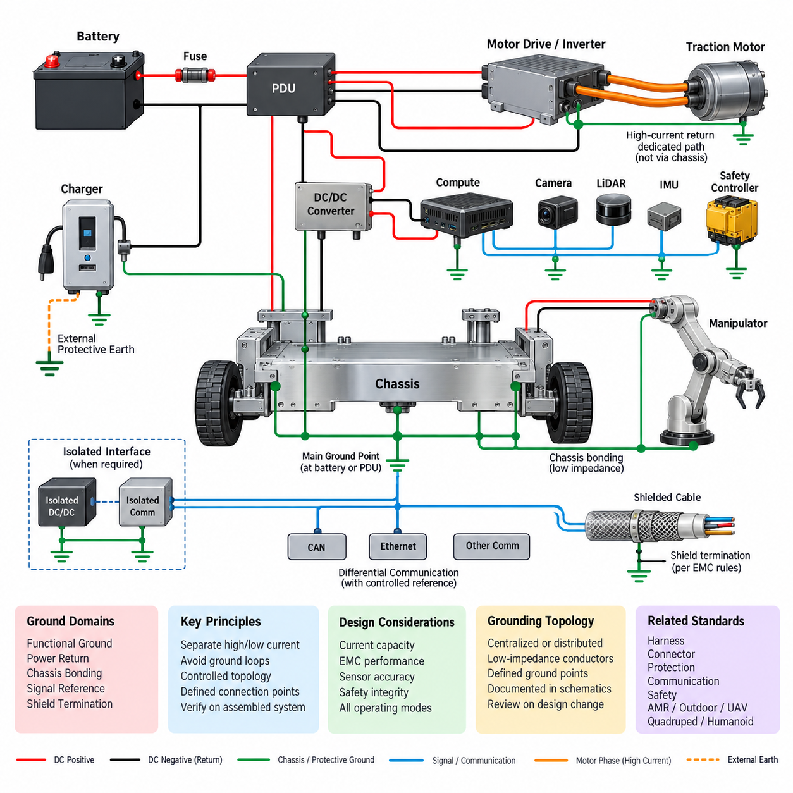
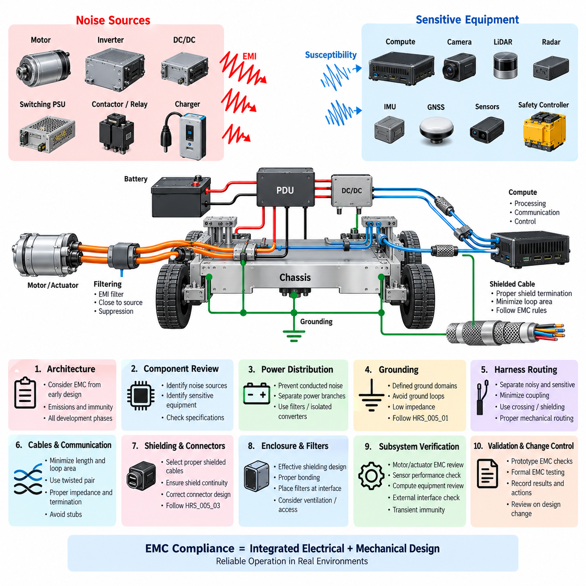
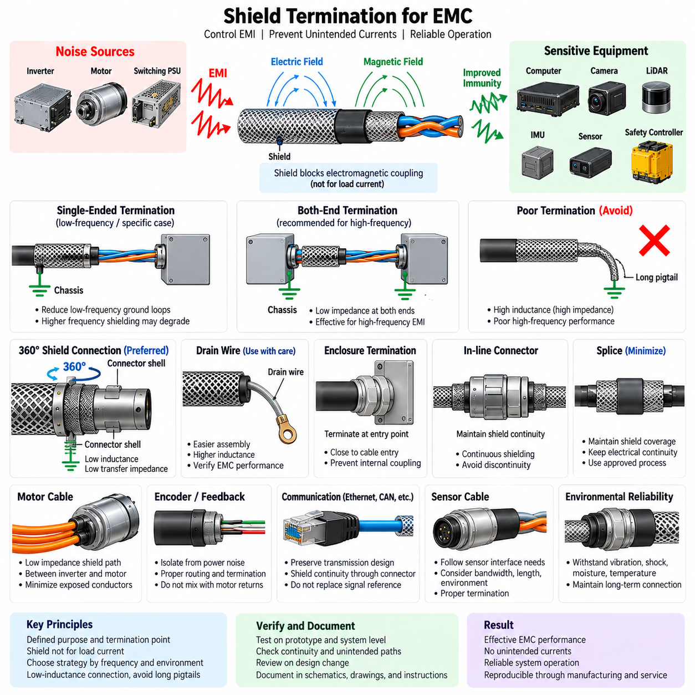
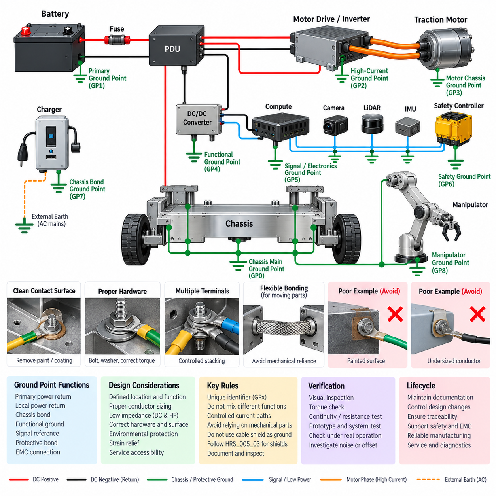
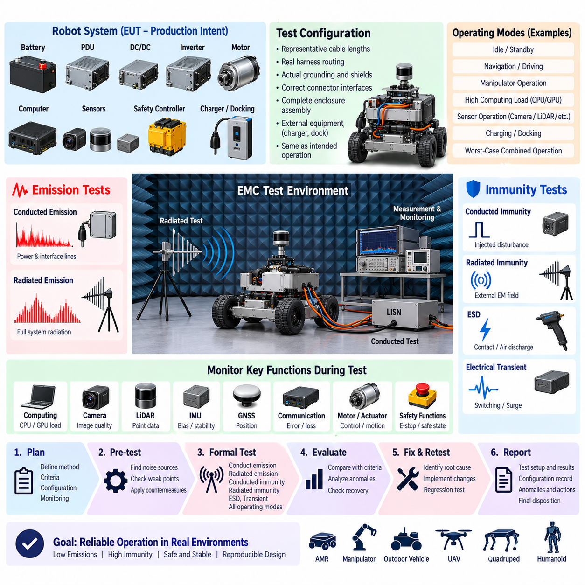

**Volume 22. Hills Robotics Engineering Standards**

# Chapter 05. HRS-005 Grounding

## 05.01. Grounding Architecture Rules

{width="7.268055555555556in" height="7.268055555555556in"}

접지 아키텍처(Grounding Architecture)는 로봇에 사용되는 모든 전력(Power), 제어(Control), 통신(Communication), 센싱(Sensing), 컴퓨팅(Computing) 서브시스템에 대해 제어된 전기적 기준(Electrical Reference)을 확립해야 한다. 접지는 부수적인 배선 세부사항으로 취급해서는 안 된다. 접지는 전압 레일(Voltage Rail), 전력 분배(Power Distribution), 하네스 라우팅(Harness Routing), 차폐(Shielding), 통신 인터페이스(Communication Interface), 기능 안전(Functional Safety) 경계와 함께 시스템 아키텍처 수준에서 정의해야 한다.

로봇 전기 시스템은 각각의 전기적 목적에 따라 기능 접지(Functional Ground), 전력 리턴(Power Return), 보호용 섀시 본딩(Protective Chassis Bonding), 신호 기준(Signal Reference), 실드 종단(Shield Termination)을 구분해야 한다. 이러한 기능들이 동일한 공칭 전위(Nominal Potential) 부근에서 동작한다는 이유만으로 임의로 결합해서는 안 된다. 서로 다른 접지 도메인(Ground Domain) 사이의 의도적인 연결은 전기 아키텍처에 명확하게 표현하고 설계 검토(Design Review) 과정에서 검증해야 한다.

전력 리턴 경로(Power Return Path)는 상호 연결된 장치 사이에 허용할 수 없는 전압 차이가 발생하지 않도록 최대 예상 연속 전류(Continuous Current)와 과도 전류(Transient Current)를 전달할 수 있게 설계해야 한다. 주행 모터(Traction Motor), 조향 액추에이터(Steering Actuator), 매니퓰레이터(Manipulator), 펌프(Pump), 히터(Heater), 인버터(Inverter), 모터 드라이버(Motor Driver)와 같은 대전류 부하는 기계적 섀시를 정상적인 전류 리턴 경로로 사용하지 않고 운전 전류와 고장 전류에 따라 설계된 전용 리턴 경로를 사용해야 한다.

민감한 전자장치는 대전류 스위칭 부하(High-Current Switching Load)에서 발생하는 전압 교란(Voltage Disturbance)으로부터 보호해야 한다. 컴퓨팅 플랫폼(Computing Platform), 카메라(Camera), 라이다(LiDAR), 레이더(Radar), 관성 측정 장치(IMU), 위성항법시스템 수신기(GNSS Receiver), 통신 게이트웨이(Communication Gateway), 안전 제어기(Safety Controller), 정밀 아날로그 회로(Precision Analog Circuit)는 모터 또는 전력 변환기(Power Converter)와 제어되지 않은 공통 리턴 임피던스(Common Return Impedance)를 공유해서는 안 된다. 따라서 접지 토폴로지(Ground Topology)는 노이즈가 큰 전력 장치와 저레벨 전자회로 사이의 공통 임피던스 결합(Common-Impedance Coupling)을 최소화해야 한다.

중앙 집중형 접지 토폴로지(Centralized Grounding Topology) 또는 제어된 분산형 접지 토폴로지(Controlled Distributed Grounding Topology)는 로봇의 크기와 전기 아키텍처에 따라 선택해야 한다. 소형 플랫폼은 배터리 또는 전력 분배 장치(PDU) 근처에 주 접지점(Principal Grounding Point)을 사용할 수 있으며, 대형 분산 로봇은 설계된 저임피던스 도체(Low-Impedance Conductor)로 연결된 여러 개의 로컬 접지 노드(Local Ground Node)가 필요할 수 있다. 분산 접지점은 전류 흐름(Current Flow), 전위차(Potential Difference), 접지 루프(Ground Loop) 형성 가능성을 분석하지 않고 추가해서는 안 된다.

주 직류 전원(Primary DC Power Source)은 명확하게 정의된 양극(Positive) 및 음극(Negative) 분배 경로를 가져야 한다. 배터리 음극(Battery Negative) 연결, PDU 리턴 구조(PDU Return Structure), DC/DC 컨버터 리턴(DC/DC Converter Return), 충전기 인터페이스(Charger Interface), 주요 부하 리턴(Major Load Return)을 문서화하여 고장 전류 경로(Fault Current Path)를 예측할 수 있어야 한다. 직류 음극과 섀시 사이의 연결 위치는 의도적으로 선정해야 하며, 장착 하드웨어 또는 의도하지 않은 전도성 접촉에 의해 형성되어서는 안 된다.

섀시 본딩(Chassis Bonding)은 전자파 적합성(EMC) 또는 전기 안전(Electrical Safety)을 위해 공통 기준(Common Reference)이 필요한 전도성 구조물 사이에 신뢰성 있는 저임피던스 연결(Low-Impedance Connection)을 제공해야 한다. 도장, 양극산화(Anodizing), 코팅, 산화 또는 기계적으로 부유된 표면(Mechanically Floating Surface)이 신뢰성 있는 전기적 연속성(Electrical Continuity)을 제공한다고 가정해서는 안 된다. 본딩이 필요한 경우 전용 본딩 도체(Bonding Conductor), 승인된 본딩 하드웨어(Bonding Hardware) 또는 전도성을 확보하도록 특별히 처리된 인터페이스를 사용해야 한다.

순환 전류(Circulating Current)가 센서 정확도, 통신 무결성(Communication Integrity), EMC 성능 또는 시스템 신뢰성을 저하시킬 가능성이 있는 경우 접지 루프(Ground Loop)를 방지해야 한다. 두 접지 도메인 사이의 다중 전도 경로(Multiple Conductive Path)는 잠재적인 루프 경로로 검토해야 하며, 여기에는 하네스 리턴(Harness Return), 케이블 실드(Cable Shield), 이더넷 장비(Ethernet Equipment), 장착 구조물, 외부 충전기, 진단 장비 및 접지된 인프라에 연결되는 통신 케이블이 포함된다.

신호 기준 설계(Signal Reference Design)는 각 인터페이스의 특성을 고려해야 한다. CAN, RS-485, 이더넷(Ethernet) 및 기타 평형 인터페이스(Balanced Interface)와 같은 차동 통신 네트워크(Differential Communication Network)는 설계된 공통 모드 동작 범위(Common-Mode Operating Range)를 유지해야 하며, 제어되지 않은 섀시 전류 경로에 의존해서는 안 된다. 인터페이스 설계상 기준 도체(Reference Conductor)가 필요한 경우 그 라우팅과 연결은 신호 쌍(Signal Pair) 및 커넥터 핀 할당(Connector Pin Assignment)과 함께 정의해야 한다.

아날로그 센서(Analog Sensor)와 저레벨 측정 회로(Low-Level Measurement Circuit)는 부하 전류로 인해 발생하는 오프셋(Offset)을 최소화하는 기준 경로를 사용해야 한다. 센서 접지(Sensor Ground)는 대전류 전력 리턴의 임의 지점에 연결해서는 안 된다. 로드셀(Load Cell), 전류 센서(Current Sensor), 힘·토크 센서(Force/Torque Sensor), 아날로그 위치 센서(Analog Position Sensor), 배터리 측정 회로(Battery Measurement Circuit) 및 유사 장치는 접지 오프셋(Ground Offset), 공통 모드 전압(Common-Mode Voltage), 차폐(Shielding), 스위칭 노이즈(Switching Noise)에 대한 민감도를 평가해야 한다.

케이블 실드(Cable Shield)는 일반적인 신호 리턴 도체(Signal-Return Conductor)로 취급해서는 안 된다. 실드 종단(Shield Termination)은 케이블의 EMC 기능과 예상되는 간섭의 주파수 범위에 따라 설계해야 한다. 실드 전류(Shield Current)가 제어된 저임피던스 경로를 통해 흐르도록 하면서 의도하지 않은 신호 접지 또는 섀시 접지 연결을 만들지 않도록 연결 전략을 HRS_005_03 실드 종단 규칙(Shield Termination Rules)과 연계해야 한다.

고주파 접지 특성(High-Frequency Grounding Behavior)은 저주파 직류 연속성(Low-Frequency DC Continuity)과 별도로 고려해야 한다. 허용 가능한 직류 저항(DC Resistance)을 갖는 도체라도 인덕턴스(Inductance)와 형상(Geometry) 때문에 스위칭 주파수에서 상당한 임피던스를 나타낼 수 있다. 따라서 EMC에 중요한 본딩 연결은 필요한 주파수 범위에서 짧고 물리적으로 적절하게 구성해야 하며, 도체 단면적뿐 아니라 접속 면적(Connection Area)과 라우팅도 함께 고려해야 한다.

모터 드라이브(Motor Drive), 인버터(Inverter), DC/DC 컨버터(DC/DC Converter), 스위칭 전원 공급 장치(Switching Power Supply) 및 기타 높은 전압 변화율(High-dV/dt) 또는 높은 전류 변화율(High-dI/dt)을 발생시키는 장치는 주요 노이즈원(Primary Noise Source)으로 취급해야 한다. 이들의 전력 리턴과 섀시 연결은 가능한 한 스위칭 전류를 국부적으로 제한하도록 구성해야 한다. 노이즈 전류가 센서 기준 네트워크, 컴퓨팅 접지, 통신 인터페이스 또는 기계적으로 멀리 떨어진 섀시 경로를 통해 전파되도록 해서는 안 된다.

접지 아키텍처는 정상 주행, 충전(Charging), 도킹(Docking), 유지보수(Maintenance), 진단 연결(Diagnostic Connection), 비상 정지(Emergency Stop), 회생 제동(Regenerative Braking), 외부 장비 연결을 포함한 모든 운전 모드에서 유효해야 한다. 특히 충전 스테이션과 서비스 장비는 외부 보호 접지(Protective Earth) 또는 접지된 계측 장비(Grounded Instrument)를 통해 추가적인 전기적 기준이 형성되어 자율 운전 중에는 존재하지 않는 새로운 접지 경로를 만들 수 있으므로 특별히 고려해야 한다.

절연형 DC/DC 컨버터(Isolated DC/DC Converter), 절연형 통신 인터페이스(Isolated Communication Interface), 갈바닉 절연(Galvanic Isolation)은 서로 호환되지 않는 접지 도메인을 분리하거나 문제가 되는 공통 모드 전류 경로(Common-Mode Current Path)를 차단해야 할 때 적용할 수 있다. 절연은 목적, 정격 전압(Voltage Rating), 과도 조건(Transient Requirement), 절연 경계(Isolation Boundary), 고장 조건에서의 동작을 정의하지 않은 상태에서 도입해서는 안 된다. 절연 경계를 가로지르는 의도적인 브리징 부품(Bridging Component) 역시 문서화해야 한다.

안전 기능(Safety Function)과 관련된 접지 연결은 단일 체결부 풀림, 단자 부식, 하네스 손상 또는 고저항 본딩(High-Resistance Bond)이 요구되는 안전 동작을 인지되지 않은 상태에서 무력화하지 않도록 설계해야 한다. 안전 제어기(Safety Controller), 비상 정지 회로(Emergency-Stop Circuit), 접촉기 제어 회로(Contactor Control Circuit), 제동 시스템(Braking System), 안전 센서(Safety Sensor)는 시스템 안전 아키텍처 및 해당 고장 검출 요구사항(Fault-Detection Requirement)에 부합하는 접지 구성을 사용해야 한다.

지정된 모든 접지점(Ground Point)과 본딩점(Bonding Point)은 회로도(Schematic), 하네스 도면(Harness Drawing), 설치 도면(Installation Drawing), 해당 자재 명세서(BOM)에서 식별할 수 있어야 한다. 접지점 식별자(Ground-Point Identifier)는 제조 및 서비스 담당자가 의도된 전기적 경로를 추적할 수 있도록 엔지니어링 문서 전반에서 일관성을 유지해야 한다. 브래킷, 인클로저 나사, 케이블 글랜드(Cable Gland) 또는 장착 볼트를 통한 문서화되지 않은 접지는 설계된 연결로 인정해서는 안 된다.

접지 성능(Grounding Performance)은 부품 사양만으로 판단하지 않고 조립이 완료된 로봇에서 검증해야 한다. 검증에는 요구되는 본딩의 연속성 및 저항 검사, 접지점 구조 검사, 리턴 경로 라우팅 확인, 의도하지 않은 전도 경로 평가가 포함되어야 한다. 또한 전자파 적합성 시험(EMC Test)을 통해 실제 운전 조건을 대표하는 상태에서 구현된 접지 아키텍처가 전도성 및 방사성 방해(Conducted and Radiated Disturbances)를 적절하게 제어하는지 확인해야 한다.

배터리, 전력 분배 장치(PDU), 컨버터(Converter), 모터 드라이브, 컴퓨팅 유닛(Computing Unit), 센서, 통신 장비, 하네스 라우팅, 섀시 구조 또는 충전 인터페이스에 영향을 주는 설계 변경은 접지 아키텍처 재검토를 유발해야 한다. 기계적으로 사소한 변경이라도 리턴 임피던스(Return Impedance)를 변화시키거나 새로운 전도성 루프(Conductive Loop)를 만들 수 있다. 따라서 전기적 연결성 또는 물리적인 전류 경로에 영향을 줄 수 있는 변경에는 엔지니어링 변경 관리(Engineering Change Control)의 일부로 접지 검토가 포함되어야 한다.

최종 접지 아키텍처는 시스템 수준의 전기 요구사항(System-Level Electrical Requirement)에서 물리적 구현(Physical Implementation)과 검증(Validation)에 이르는 추적성(Traceability)을 제공해야 한다. 각각의 의도적인 접지 도메인 연결, 섀시 본딩, 절연 경계, 실드 인터페이스 및 주요 리턴 경로에는 명확한 엔지니어링 목적이 정의되어야 한다. 이 아키텍처는 접지 요구사항을 하네스(Harness), 커넥터(Connector), 보호(Protection), 통신(Communication), 안전(Safety), 자율이동로봇(AMR), 야외 차량(Outdoor Vehicle), 사족보행 로봇(Quadruped), 휴머노이드(Humanoid), 무인항공기(UAV) 요구사항과 연계함으로써 전체 Hills Robotics 엔지니어링 표준 체계를 지원해야 한다.

## 05.02. EMC Design Checklist

{width="7.268055555555556in" height="7.268055555555556in"}

전자파 적합성(EMC)은 최종 단계의 규격 적합성 활동으로 취급하는 것이 아니라 로봇 전기 아키텍처(Robot Electrical Architecture)의 필수적인 구성 요소로 평가해야 한다. EMC 설계 체크리스트(EMC Design Checklist)는 아키텍처 정의, 회로도 설계, 하네스 개발, 기계적 패키징, 프로토타입 통합 및 설계 검증 단계에서 적용해야 한다. 각 검토에서는 로봇 자체에서 발생하는 전자파 방출(Electromagnetic Emissions)과 외부 또는 내부에서 발생하는 전자기적 교란(Electromagnetic Disturbances)에 대한 전자 시스템의 내성(Susceptibility)을 모두 고려해야 한다.

모든 주요 전기 부품은 예상되는 노이즈 발생 특성과 노이즈 민감도(Susceptibility)에 따라 분류해야 한다. 모터(Motor), 인버터(Inverter), 모터 드라이버(Motor Driver), 스위칭 전원 공급 장치(Switching Power Supply), DC/DC 컨버터(DC/DC Converter), 접촉기(Contactor), 릴레이(Relay), 충전기(Charger), 대전류 스위칭 회로(High-Current Switching Circuit)는 잠재적인 노이즈원(Noise Source)으로 취급해야 한다. 카메라(Camera), 라이다(LiDAR), 레이더(Radar), 관성 측정 장치(IMU), 위성항법시스템 수신기(GNSS Receiver), 아날로그 센서(Analog Sensor), 안전 제어기(Safety Controller), 통신 인터페이스(Communication Interface), 컴퓨팅 시스템(Computing System)은 잠재적으로 민감한 장비로 평가해야 한다.

전력 분배(Power Distribution)는 서브시스템 사이에서 전도성 노이즈(Conducted Noise)가 전파되는지를 검토해야 한다. 대전류 부하와 빠르게 스위칭되는 부하는 민감한 전자 장비와 제어되지 않은 전원 또는 리턴 임피던스(Return Impedance)를 공유해서는 안 된다. 필요한 경우 스위칭 교란(Switching Disturbance)이 전력 분배 장치(PDU), 하네스(Harness) 또는 공통 전원 레일(Common Power Rail)을 통해 전파되는 것을 방지하기 위해 별도의 전력 분기, 로컬 필터링(Local Filtering), 전용 리턴 경로(Dedicated Return Path), 절연형 컨버터(Isolated Converter) 또는 기타 억제 기법을 적용해야 한다.

세부적인 EMC 대책을 승인하기 전에 접지 아키텍처(Grounding Architecture)를 검토해야 한다. 기능 접지(Functional Ground), 전력 리턴(Power Return), 신호 기준(Signal Reference), 섀시 본딩(Chassis Bonding), 실드 종단(Shield Termination)은 명확하게 정의된 목적과 연결 지점을 가져야 한다. 설계에서는 고장 전류(Fault Current)와 고주파 노이즈(High-Frequency Noise)에 대해 충분히 낮은 임피던스를 유지하면서 의도하지 않은 병렬 리턴 경로(Parallel Return Path)와 접지 루프(Ground Loop)를 방지해야 한다. 접지 구현은 HRS_005_01 접지 아키텍처 규칙(Grounding Architecture Rules)과 일관성을 유지해야 한다.

하네스 라우팅(Harness Routing)은 노이즈가 큰 회로와 민감한 회로 사이에 적절한 물리적 이격(Physical Separation)을 유지해야 한다. 모터 상 케이블(Motor Phase Cable), 인버터 전력선(Inverter Power Line), 대전류 배터리 도체(High-Current Battery Conductor), 스위칭 전력 배선(Switching Power Wiring), 접촉기 회로(Contactor Circuit)는 가능한 경우 센서, 아날로그, 통신 및 저레벨 신호 배선과 분리하여 라우팅해야 한다. 충분한 이격을 확보할 수 없는 경우 결합(Coupling)을 최소화하기 위해 교차 형상(Crossing Geometry), 차폐(Shielding), 꼬임(Twisting), 필터링(Filtering), 기계적 라우팅을 검토해야 한다.

고주파 또는 빠르게 변화하는 전류를 전달하는 회로에서는 케이블 길이와 루프 면적(Loop Area)을 최소화해야 한다. 전력 도체와 리턴 도체는 한 도체에서 발생하는 자기장(Magnetic Field)이 대응되는 리턴 전류에 의해 상당 부분 상쇄될 수 있도록 함께 라우팅해야 한다. 큰 전류 루프(Current Loop)는 방사성 방출(Radiated Emissions)과 외부 자기장에 대한 민감도를 모두 증가시키므로 특히 모터 드라이브와 전력 변환기 주변에서는 방지해야 한다.

차동 통신 네트워크(Differential Communication Network)는 하네스 전체에서 본래 설계된 전송선 특성(Transmission-Line Characteristics)을 유지해야 한다. CAN, CAN FD, RS-485, 이더넷(Ethernet) 및 유사한 인터페이스는 요구되는 연선 구조(Twisted-Pair Geometry), 특성 임피던스(Characteristic Impedance), 종단(Termination), 커넥터 구성을 사용해야 한다. 신호 쌍의 분리, 커넥터 근처에서의 과도한 꼬임 해제(Untwisting), 부적절한 스텁(Stub), 일관되지 않은 기준 연결은 신호 무결성(Signal Integrity)과 EMC 성능을 모두 저하시킬 수 있으므로 검토해야 한다.

차폐 케이블(Shielded Cable)은 모든 회로에 일률적으로 적용하는 것이 아니라 전자기 환경과 인터페이스 요구사항에 따라 선택해야 한다. 차폐 효과(Shield Effectiveness)는 실드 구조, 전달 임피던스(Transfer Impedance), 커넥터 설계, 종단 형상(Termination Geometry), 주파수에 따라 달라진다. 실드 연결은 HRS_005_03 실드 종단 규칙(Shield Termination Rules)에 따라 구현해야 하며, 높은 고주파 임피던스를 발생시키는 긴 피그테일 종단(Long Pigtail Termination)은 피해야 한다.

커넥터 설계(Connector Design)는 하네스 인터페이스를 통과해서도 EMC 성능이 유지되도록 해야 한다. 실드 연속성(Shield Continuity), 섀시 연결, 신호 핀 할당(Signal Pin Assignment), 전력 리턴 배치, 미사용 핀 처리, 노이즈 회로와 민감 회로 사이의 분리를 검토해야 한다. 모터 전력 또는 대전류 스위칭 신호를 전달하는 커넥터는 특히 하나의 커넥터 하우징(Connector Housing)에 여러 전기 도메인이 함께 구성되는 경우 인접한 센서 또는 통신 접점으로 불필요한 결합이 발생하지 않도록 해야 한다.

전자 장치 인클로저(Electronic Enclosure)는 차폐 아키텍처(Shielding Architecture)의 일부로 평가해야 한다. 전도성 하우징(Conductive Housing), 이음부(Seam), 커버(Cover), 케이블 인입부(Cable Entry), 환기구(Ventilation Opening), 디스플레이 인터페이스(Display Interface), 서비스 접근부(Service Access Point)는 차폐 효과에 상당한 영향을 줄 수 있다. 인클로저가 전자기 차폐를 제공하도록 설계된 경우 인클로저 각 부분 사이의 본딩과 케이블 실드 종단은 우발적인 기계적 접촉에만 의존하지 않고 제어된 고주파 경로(Controlled High-Frequency Path)를 제공해야 한다.

필터(Filter)는 원하지 않는 전자기 에너지(Electromagnetic Energy)가 회로에 유입되거나 회로에서 방출되는 인터페이스 가까이에 배치해야 한다. 커넥터에서 멀리 떨어진 입력 필터(Input Filter)는 노이즈 전류가 억제되기 전에 내부 배선을 통해 전파되도록 만들 수 있다. 필터 부품은 단순히 공칭 커패시턴스 또는 인덕턴스만을 기준으로 선택하지 않고 소스 임피던스(Source Impedance), 부하 임피던스(Load Impedance), 동작 전류, 과도 조건(Transient Condition), 주파수 범위, 부품 기생 성분(Component Parasitics), 잠재적인 공진(Resonance)을 고려하여 선정해야 한다.

디커플링 커패시터(Decoupling Capacitor)는 프로세서(Processor), 통신 트랜시버(Communication Transceiver), 센서, 메모리 장치 및 기타 고속 전자장치의 전원 핀 가까이에 배치해야 한다. 커패시터, 장치 및 기준 평면(Reference Plane) 사이의 연결은 기생 인덕턴스(Parasitic Inductance)를 최소화해야 한다. 전력 분배 네트워크(Power Distribution Network)가 관련 동작 주파수 범위에서 허용 가능한 임피던스를 유지할 수 있도록 벌크 커패시턴스(Bulk Capacitance)와 고주파 디커플링(High-Frequency Decoupling)을 상호 조정해야 한다.

모터 및 액추에이터 시스템(Actuator System)은 대전류, 빠른 스위칭 에지(Fast Switching Edge), 긴 케이블 및 기계적으로 분산된 부하를 동시에 포함하므로 별도의 EMC 검토를 수행해야 한다. 펄스 폭 변조 주파수(PWM Frequency), 인버터 스위칭 특성, 모터 케이블 라우팅, 상 도체 형상(Phase Conductor Geometry), 섀시 본딩, 엔코더 배선(Encoder Wiring), 브레이크 배선(Brake Wiring), 피드백 인터페이스(Feedback Interface)를 통합적으로 평가해야 한다. 억제 대책은 공통 모드 노이즈(Common-Mode Noise)와 차동 모드 노이즈(Differential-Mode Noise)를 모두 고려해야 한다.

센서 인터페이스(Sensor Interface)는 전력 시스템이 정지된 상태에서만 평가하지 않고 실제 로봇 운전 조건에서 확인해야 한다. 카메라 영상 손상, 라이다 통신 오류, IMU 바이어스 교란(Bias Disturbance), GNSS 성능 저하, 아날로그 센서 오프셋, 엔코더 오류 및 간헐적인 통신 장애는 모터, 액추에이터, 충전기 또는 고출력 컨버터가 동작할 때만 나타날 수 있다. 따라서 EMC 검증은 대표적인 노이즈 발생 서브시스템과 민감 서브시스템이 동시에 동작하는 조건을 포함해야 한다.

고속 컴퓨팅 장비(High-Speed Computing Equipment)는 전자파 방출과 내성(Immunity)을 모두 검토해야 한다. CPU, GPU, 메모리 인터페이스, 고속 이더넷, USB, PCIe 관련 하드웨어 및 스위칭 레귤레이터(Switching Regulator)는 광대역 전자기 에너지(Broadband Electromagnetic Energy)를 발생시킬 수 있다. 컴퓨팅 인클로저 본딩, 커넥터 차폐, 케이블 라우팅, 로컬 필터링, 열 배출구(Thermal Opening), 전원 인입부 설계를 상호 조정하여 컴퓨팅 성능이 주변 인지 또는 제어 전자장치의 성능을 저하시키지 않도록 해야 한다.

외부 인터페이스(External Interface)는 전자기 에너지 및 접지 교란이 전달될 수 있는 잠재적인 경로로 취급해야 한다. 충전 커넥터, 서비스 포트(Service Port), 진단 인터페이스(Diagnostic Interface), 외부 이더넷, USB, 안테나(Antenna), 도킹 접점(Docking Contact), 보조 전원 연결(Auxiliary Power Connection)은 과도 전압 보호(Transient Protection), 필터링, 차폐 및 접지 측면에서 검토해야 한다. 로봇의 EMC 특성은 접지된 외부 장비, 충전 인프라 또는 실험실 계측 장비와 연결될 때 크게 변화할 수 있다.

과도 내성(Transient Immunity)은 지속적인 EMC 특성과 함께 고려해야 한다. 릴레이와 접촉기 스위칭, 유도성 부하 차단(Inductive Load Interruption), 모터 회생(Regeneration), 비상 정지 동작, 배터리 연결, 충전기 연결 및 정전기 방전(ESD)은 제어기를 리셋하거나 통신 데이터를 손상시킬 수 있는 단시간의 교란을 발생시킬 수 있다. 보호 대책은 회로의 정격 전압, 기능 안전(Functional Safety) 요구사항 및 예상 운전 환경과 연계하여 설계해야 한다.

기계적 변경(Mechanical Change)은 사소한 패키징 변경이라도 전자기적 특성을 변화시킬 수 있으므로 EMC 설계 관리(EMC Design Control)에 포함해야 한다. 케이블 이동, 전도성 브래킷 교체, 인클로저 재질 변경, 환기구 수정, 센서 추가 또는 접지점 이동은 결합 경로와 차폐 효과를 변화시킬 수 있다. 따라서 전기적 패키징, 하네스 라우팅, 접지 또는 인클로저 구조가 변경될 때마다 EMC 영향을 검토해야 한다.

가능한 경우 공식 인증 시험(Formal Qualification Testing)을 수행하기 전에 프로토타입 EMC 점검(Prototype EMC Check)을 실시해야 한다. 근접장 프로빙(Near-Field Probing), 전도성 노이즈 측정, 통신 오류 모니터링, 센서 안정성 확인, 서브시스템 활성화 시험을 통해 주요 결합 메커니즘을 조기에 식별할 수 있다. 디버깅(Debugging)은 근본적인 전자기 메커니즘을 이해하지 않은 상태에서 억제 부품을 추가하기보다 노이즈원(Source), 결합 경로(Coupling Path), 영향을 받는 수신부(Receiver)를 식별하는 데 중점을 두어야 한다.

공식 EMC 검증(Formal EMC Validation)은 해당되는 경우 최대 컴퓨팅 부하, 모터 가속, 제동, 액추에이터 동작, 충전, 통신 트래픽, 센서 동작 및 여러 서브시스템의 동시 동작을 포함하여 대표적인 최악 조건(Worst-Case Operating Configuration)을 시험해야 한다. 시험 결과, 이상 현상(Anomaly), 시정 조치(Corrective Action), 구성 정보(Configuration Information)를 기록하여 EMC 성능을 특정 하드웨어, 하네스, 소프트웨어 및 기계적 구성과 추적할 수 있도록 해야 한다.

완료된 EMC 설계 체크리스트(EMC Design Checklist)는 노이즈원, 결합 경로, 민감 회로, 접지, 차폐, 필터링, 하네스 라우팅, 커넥터, 인클로저, 외부 인터페이스 및 검증 요구사항이 체계적으로 검토되었음을 입증해야 한다. EMC 적합성(EMC Compliance)은 전기 및 기계 설계가 상호 조정되어 달성되는 시스템 특성(System Property)으로 취급해야 하며, 보다 광범위한 HRS 접지, 통신, 안전, 자율이동로봇(AMR), 야외 차량(Outdoor Vehicle), 무인항공기(UAV), 사족보행 로봇(Quadruped), 휴머노이드(Humanoid) 엔지니어링 표준을 지원해야 한다.

## 05.03. Shield Termination Rules

{width="7.268055555555556in" height="7.268055555555556in"}

실드 종단 아키텍처(Shield Termination Architecture)는 케이블 실드가 의도하지 않은 신호 리턴(Signal Return) 또는 전력 리턴(Power Return) 도체가 되는 것을 방지하면서 전자기 간섭(EMI) 전류가 흐를 수 있는 제어된 경로를 제공해야 한다. 차폐(Shielding)는 독립적인 케이블 기능이 아니라 전체 EMC 및 접지 아키텍처(Grounding Architecture)의 일부로 취급해야 한다. 따라서 모든 실드 연결은 명확한 목적, 종단 위치, 주파수 요구사항 및 섀시(Chassis)와 신호 기준(Signal Reference)의 관계를 정의해야 한다.

케이블 실드(Cable Shield)는 주로 보호 대상 도체와 주변 환경 사이의 전기장(Electric Field) 및 고주파 전자기 결합(High-Frequency Electromagnetic Coupling)을 제어해야 한다. 실드는 일반적으로 기능 부하 전류(Functional Load Current)를 전달해서는 안 된다. 특정 인터페이스 아키텍처에서 문서화되고 검증된 의도적인 연결을 요구하지 않는 한 신호 리턴, 전력 리턴, 보호 본딩(Protective Bonding), 실드 전류 경로(Shield Current Path)는 전기적으로 구분된 상태를 유지해야 한다.

실드 종단 전략(Shield Termination Strategy)은 신호 유형, 주파수 범위, 케이블 길이, 장비 접지 구성 및 예상되는 전자기 환경에 따라 선택해야 한다. 접지 전위차(Ground-Potential Difference)가 주요 문제가 되는 일부 저주파 아날로그 애플리케이션에서는 단일 종단(Single-Ended Termination)이 적합할 수 있다. 고주파 및 광대역 인터페이스(Broadband Interface)는 일반적으로 해당 주파수 범위에서 효과적인 차폐를 유지하기 위해 양단 저임피던스 종단(Low-Impedance Termination at Both Ends)이 필요하다.

양단 실드 종단(Both-End Shield Termination)은 케이블이 섀시 기준 장비(Chassis-Referenced Equipment)를 연결하고 고주파 내성(High-Frequency Immunity) 또는 방출 제어(Emission Control)가 요구되는 경우 고려해야 한다. 실드와 섀시를 통해 형성되는 전류 경로를 평가하여 저주파 순환 전류(Low-Frequency Circulating Current)가 허용할 수 없는 간섭을 발생시키지 않는지 확인해야 한다. 상당한 접지 전위차가 예상되는 경우 절연(Isolation), 제어된 본딩(Controlled Bonding) 또는 대체 종단 기법을 고려해야 한다.

단일 종단 실드 종단(Single-Ended Shield Termination)을 접지 루프(Ground Loop)를 방지하기 위한 보편적인 방법으로 적용해서는 안 된다. 단일 종단 방식은 저주파 실드 전류를 차단할 수 있지만 종단되지 않은 쪽에서는 고주파 차폐 효과가 크게 감소할 수 있다. 따라서 엔지니어링 판단은 직류 연속성(DC Continuity) 또는 전통적인 계측 방식만을 기준으로 고정된 규칙을 적용하는 것이 아니라 지배적인 간섭 메커니즘(Dominant Interference Mechanism)을 고려해야 한다.

고주파 실드 연결(High-Frequency Shield Connection)은 저인덕턴스 종단 형상(Low-Inductance Termination Geometry)을 사용해야 한다. 인터페이스가 지원하는 경우 케이블 실드와 전도성 커넥터 셸(Conductive Connector Shell) 또는 인클로저(Enclosure) 사이에 360도 원주형 연결(360-Degree Circumferential Connection)을 적용하는 것이 바람직하다. 이 구성은 전달 임피던스(Transfer Impedance)를 최소화하고 전자기 에너지가 커넥터 인입부 근처의 노출된 내부 도체를 통해 실드 종단을 우회하는 것을 방지한다.

긴 실드 피그테일(Shield Pigtail)은 인덕턴스로 인해 종단 임피던스(Termination Impedance)가 크게 증가할 수 있으므로 고주파 인터페이스에서는 피해야 한다. 직류 연속성 시험에서 전기적으로 적절해 보이는 피그테일도 무선 주파수(Radio Frequency) 영역에서는 성능이 크게 저하될 수 있다. 피그테일 사용을 피할 수 없는 경우 길이를 최소화하고 실제 운전 및 시험 조건을 대표하는 환경에서 EMC 적합성을 검증해야 한다.

실드 종단에 사용되는 커넥터 셸(Connector Shell)은 의도된 섀시 또는 인클로저 기준과 신뢰성 있는 전기적 연속성(Electrical Continuity)을 제공해야 한다. 전도성 백셸(Conductive Backshell), 케이블 글랜드(Cable Gland), 클램프(Clamp), 장착 인터페이스는 충분한 접촉 면적과 기계적 유지력을 확보해야 한다. 도장, 양극산화 코팅(Anodized Coating), 부식, 오염, 느슨한 하드웨어 또는 절연성 장착 구조가 설계된 실드 전류 경로를 의도하지 않게 차단해서는 안 된다.

전도성 인클로저(Conductive Enclosure)에 대한 실드 종단은 가능한 한 케이블 인입 지점 가까이에서 이루어져야 한다. 차폐 케이블이 인클로저 내부로 들어온 후 일정 거리를 진행한 뒤 종단되면 공통 모드 전류(Common-Mode Current)가 내부 회로로 방사되거나 결합될 수 있다. 기계적 아키텍처가 허용하는 경우 보호 대상 도체가 민감한 전자장치에 노출되기 전에 실드 전류가 인클로저로 전달되도록 해야 한다.

실드 드레인 와이어(Shield Drain Wire)는 완전한 원주형 실드 종단(Full Circumferential Shield Termination)과 구분해야 한다. 드레인 와이어는 조립을 단순화하고 포일 실드(Foil Shield)에 편리한 전기적 접촉을 제공할 수 있지만 추가적인 인덕턴스를 발생시키며 충분한 고주파 성능을 제공하지 못할 수 있다. 드레인 와이어 사용 여부는 케이블 구조, 주파수 요구사항, 환경 조건, 제조 제약 및 검증된 EMC 성능을 기준으로 결정해야 한다.

모터 상 케이블(Motor Phase Cable)과 인버터 출력 케이블(Inverter Output Cable)은 빠른 스위칭 천이(Rapid Switching Transition)에 의해 발생하는 고주파 공통 모드 전류(High-Frequency Common-Mode Current)를 전달할 수 있으므로 특별히 주의해야 한다. 차폐 모터 케이블을 사용하는 경우 실드는 인버터 인클로저와 모터 하우징 사이에 저임피던스 경로를 제공해야 한다. 종단 형상은 노출되는 상 도체를 최소화하고 스위칭 전류가 인접한 센서 또는 통신 하네스로 결합되는 것을 방지해야 한다.

엔코더(Encoder), 리졸버(Resolver), 브레이크(Brake), 모터 피드백 케이블(Motor Feedback Cable)은 전력단 노이즈(Power-Stage Noise)가 저레벨 피드백 회로(Low-Level Feedback Circuit)에 유입되지 않도록 라우팅하고 종단해야 한다. 이들의 실드를 모터 상 리턴 또는 신호 기준과 임의로 연결해서는 안 된다. 커넥터 설계, 실드 연속성, 이격, 접지 및 종단 위치는 각 도체별로 독립적으로 설계하는 것이 아니라 하나의 통합된 인터페이스로 조정해야 한다.

통신 케이블 실드(Communication Cable Shield)는 네트워크의 의도된 물리 계층 아키텍처(Physical-Layer Architecture)를 유지해야 한다. 이더넷(Ethernet), 산업용 이더넷(Industrial Ethernet), 고속 직렬 링크(High-Speed Serial Link) 및 기타 차폐 차동 인터페이스(Shielded Differential Interface)는 커넥터와 장비 하우징을 통한 섀시 기준 실드 연속성(Chassis-Referenced Shield Continuity)이 필요할 수 있다. 실드 연결이 차동 종단(Differential Termination), 공통 모드 기준(Common-Mode Reference) 또는 통신 트랜시버(Communication Transceiver)가 제공하는 갈바닉 절연(Galvanic Isolation)을 의도하지 않게 변경해서는 안 된다.

CAN, CAN FD, RS-485 및 유사한 네트워크에서는 케이블 차폐와 통신 기준 도체(Communication Reference Conductor)를 구분해야 한다. 실드는 필요한 네트워크 기준 또는 신호 리턴을 대체해서는 안 된다. 심각한 전자기 환경 때문에 차폐 연선(Shielded Twisted Pair)을 선택한 경우 실드 종단은 네트워크 토폴로지(Network Topology), 노드 접지(Node Grounding), 절연 전략(Isolation Strategy), 커넥터 설계 및 각 트랜시버의 공통 모드 처리 능력(Common-Mode Capability)과 연계해야 한다.

센서 케이블 차폐(Sensor Cable Shielding)는 센서 인터페이스의 특성을 반영해야 한다. 저레벨 아날로그 센서, 로드셀(Load Cell), 힘·토크 센서(Force/Torque Sensor), 엔코더, 카메라(Camera), 라이다(LiDAR), 레이더(Radar), 위성항법시스템 장비(GNSS Equipment), 관성 측정 장치(IMU)는 서로 다른 종단 전략이 필요할 수 있다. 차폐 방식은 신호 대역폭(Signal Bandwidth), 소스 임피던스(Source Impedance), 케이블 길이, 인클로저 구조, 센서 장착 방식 및 관련 신호 조절 전자장치(Signal-Conditioning Electronics)의 위치를 고려하여 결정해야 한다.

인터페이스 설계에서 연속적인 차폐가 요구되는 경우 케이블 실드는 중간 커넥터(Intermediate Connector)를 통과하는 구간에서도 연속성을 유지해야 한다. 벌크헤드 커넥터(Bulkhead Connector), 정션 박스(Junction Box), 서비스 커넥터(Service Connector) 또는 하네스 전환부(Harness Transition)의 실드 불연속(Shield Discontinuity)은 국부적인 결합 지점을 만들 수 있다. 연속적인 차폐를 유지할 수 없는 경우 해당 불연속 구간을 의도적으로 설계하고 전자파 방출 및 내성에 미치는 영향을 평가해야 한다.

차폐 케이블의 스플라이스(Splice)는 최소화해야 한다. 스플라이스를 피할 수 없는 경우 케이블의 EMC 기능에서 요구하는 수준까지 실드 커버리지(Shield Coverage)와 전기적 연속성을 유지해야 한다. 내부 신호 도체만 다시 연결하고 실드에 큰 개방부를 남기는 스플라이스는 성능을 크게 저하시킬 수 있다. 따라서 실드 수리 및 스플라이스 방법은 승인된 하네스 제조 절차(Harness Manufacturing Procedure)를 통해 관리해야 한다.

실드 종단 하드웨어(Shield Termination Hardware)는 로봇의 전체 사용 수명 동안 기계적 및 환경적 조건을 견딜 수 있어야 한다. 진동, 충격, 반복 굽힘, 온도 사이클링(Temperature Cycling), 습기, 먼지, 부식 및 유지보수 작업으로 인해 전기적 연결 성능이 허용 수준 이하로 저하되어서는 안 된다. 이동 로봇(Mobile Robot)과 매니퓰레이터(Manipulator)는 클램프, 글랜드, 백셸 및 유연 차폐(Flexible Shielding)를 선정할 때 종단 지점 근처에서 반복되는 케이블 움직임과 변형(Strain)도 고려해야 한다.

실드 연결이 제어되지 않은 고장 전류 경로(Fault-Current Path)를 형성해서는 안 된다. 실드, 커넥터 셸 및 종단 하드웨어의 전류 용량은 일반적으로 전력 고장 전류가 아니라 EMC 요구사항을 기준으로 결정된다. 따라서 전기 보호(Electrical Protection) 및 접지 아키텍처는 배터리, 모터 또는 기타 고에너지 고장 전류(High-Energy Fault Current)가 케이블 실드에 의존하지 않고 지정된 보호 경로(Designated Protective Path)를 통해 흐르도록 해야 한다.

구현된 실드 아키텍처(Shield Architecture)는 프로토타입 및 시스템 수준 EMC 시험(System-Level EMC Testing) 과정에서 검증해야 한다. 검증에는 종단 형상 검사, 연속성 검사, 의도하지 않은 실드 연결 식별, 대표적인 노이즈 발생 서브시스템과 민감 서브시스템의 동시 운전이 포함되어야 한다. EMC 문제가 발생한 경우 접지, 필터링, 하네스 라우팅 및 인클로저 본딩과 함께 실드 전류 경로와 종단 임피던스를 조사해야 한다.

케이블 유형, 커넥터 제품군(Connector Family), 백셸, 인클로저 재질, 케이블 글랜드, 하네스 라우팅, 접지점, 모터 드라이브, 센서 인터페이스 또는 통신 장비에 영향을 주는 모든 설계 변경은 관련 실드 종단에 대한 재검토를 유발해야 한다. 차폐 성능은 물리적 구현에 크게 의존하므로 기계적으로 사소한 변경이라도 고주파 전자기 특성(High-Frequency Electromagnetic Behavior)에 상당한 변화를 일으킬 수 있다.

최종 실드 종단 설계(Shield Termination Design)는 해당되는 경우 회로도(Schematic), 하네스 도면(Harness Drawing), 커넥터 사양(Connector Specification), 설치 도면(Installation Drawing), 제조 지침(Manufacturing Instruction)에 문서화해야 한다. 문서에는 실드 유형, 종단되는 한쪽 또는 양쪽 끝, 연결 방식, 섀시 기준, 특수 하드웨어 및 의도적인 예외 사항을 명시해야 한다. 이를 통해 HRS_005에서 정의한 EMC 아키텍처가 제조, 서비스, 변경 및 향후 제품 개발 과정에서도 일관되게 재현될 수 있도록 해야 한다.

## 05.04. Ground Point Standard

{width="7.268055555555556in" height="7.268055555555556in"}

접지점(Ground Point)은 전력 리턴(Power Return), 기능 접지(Functional Ground), 섀시 구조(Chassis Structure), 보호 본딩 도체(Protective Bonding Conductor), 지정된 EMC 경로 사이에 정의되고 반복 가능하며 전기적으로 신뢰할 수 있는 연결을 제공해야 한다. 모든 접지점은 우발적인 기계적 접촉이 아니라 설계된 전기적 인터페이스(Engineered Electrical Interface)로 취급해야 한다. 접지점의 전기적 기능, 위치, 도체 용량, 하드웨어, 표면 처리 및 검사 요구사항은 시스템 설계 단계에서 정의해야 한다.

각 접지점에는 전기 회로도(Electrical Schematic), 하네스 도면(Harness Drawing), 기계 도면(Mechanical Drawing), 설치 지침(Installation Instruction), 제조 기록(Manufacturing Record), 서비스 문서(Service Documentation) 전반에서 일관되게 유지되는 고유 식별자(Unique Identifier)를 부여해야 한다. 이 식별자를 통해 엔지니어와 기술자는 해당 접지점에 연결된 회로와 의도된 기능을 확인할 수 있어야 한다. 식별되지 않거나 문서화되지 않은 접지 연결은 양산 하드웨어(Production Hardware)에 허용해서는 안 된다.

접지점은 주 전력 리턴(Primary Power Return), 로컬 전력 리턴(Local Power Return), 섀시 본드(Chassis Bond), 기능 접지(Functional Ground), 신호 기준(Signal Reference), 보호 본드(Protective Bond), EMC 연결 등의 기능에 따라 분류해야 한다. 아키텍처에서 의도적으로 연결을 요구하지 않는 한 서로 다른 기능을 하나의 물리적 위치에서 결합해서는 안 된다. 기능이 결합된 접지점은 전류 경로와 잠재적인 공통 임피던스 결합(Common-Impedance Coupling)을 평가할 수 있도록 명확하게 문서화해야 한다.

주 시스템 접지점(Primary System Ground Point)은 배터리, 전력 분배 장치(PDU), 전력 분배 아키텍처(Power Distribution Architecture)에 따라 위치를 선정해야 한다. 대전류 배터리 리턴과 주요 부하 리턴은 임의의 섀시 구조가 아니라 제어된 도체(Controlled Conductor)를 통해 집결해야 한다. 직류 음극(DC Negative)과 섀시 사이에 주요 연결이 필요한 경우 정상 전류, 과도 전류 및 고장 전류 경로를 예측할 수 있도록 정의된 위치에 구성해야 한다.

접지 도체(Ground Conductor)는 해당 연결에서 예상되는 최대 연속 전류(Maximum Continuous Current), 과도 전류(Transient Current), 해당 고장 전류(Fault Current)를 기준으로 크기를 선정해야 한다. 도체 크기를 결정할 때 전압 강하(Voltage Drop), 온도 상승(Temperature Rise), 설치 길이, 번들링(Bundling), 주변 온도, 단자 용량 및 보호 협조(Protection Coordination)도 고려해야 한다. 정상적으로 작은 전류만 흐르더라도 상당한 고장 전류를 안전하게 전달해야 하는 접지 도체의 크기를 단순히 축소해서는 안 된다.

접지점 임피던스(Ground-Point Impedance)는 의도된 전기적 기능과 EMC 기능을 수행할 수 있을 만큼 충분히 낮아야 한다. 고주파 전류를 전달해야 하는 연결은 도체 길이, 형상, 접촉 면적 및 인덕턴스가 높은 주파수에서 임피던스를 지배할 수 있으므로 직류 저항(DC Resistance)만으로 특성을 판단해서는 안 된다. 따라서 EMC 본딩 경로(EMC Bonding Path)는 가능한 경우 불필요하게 길고 좁은 형태보다 짧고 직접적이며 물리적으로 넓은 형태로 구성하는 것이 바람직하다.

도장, 코팅, 양극산화(Anodizing), 산화 또는 오염된 전도성 구조물에 설치되는 접지점은 제어된 표면 처리(Controlled Surface Preparation)를 수행해야 한다. 설계에서 요구되는 경우 전기적 접촉 영역에는 적절한 전도성 재료가 노출되어야 한다. 표면 처리가 부식 방지 기능(Corrosion Protection)을 불필요하게 저하시켜서는 안 되며, 필요한 경우 조립 후 승인된 보호 처리를 적용하면서도 의도된 금속 간 전기적 접촉(Metal-to-Metal Electrical Contact)을 유지해야 한다.

전기적 접지에 사용되는 체결부(Fastener)는 예상되는 전체 사용 수명 동안 안정적인 기계적 체결력(Mechanical Clamping Force)을 제공해야 한다. 필요한 경우 볼트 또는 스터드(Stud) 직경, 와셔 배열(Washer Arrangement), 단자 방향, 잠금 방식(Locking Method), 체결 토크(Tightening Torque), 재료 호환성을 규정해야 한다. 신뢰성 있는 저저항 전기 본딩(Low-Resistance Electrical Bonding)을 위해 정의된 접촉면이 필요한 경우 연결이 제어되지 않은 나사산 접촉에만 의존해서는 안 된다.

링 단자(Ring Terminal), 러그(Lug), 본딩 스트랩(Bonding Strap), 버스바(Busbar) 또는 이에 상응하는 접지 하드웨어는 도체 크기, 전류 요구사항, 기계적 하중, 진동 환경, 온도 및 부식 노출 조건에 따라 선정해야 한다. 단자는 승인된 압착(Crimping) 또는 부착 공정을 사용하여 설치해야 한다. 하나의 스터드에 지나치게 많은 단자를 적층하면 체결 일관성, 정비성(Serviceability), 연결 신뢰성이 저하될 수 있으므로 피해야 한다.

여러 단자가 하나의 접지점을 공유해야 하는 경우 허용되는 단자 수와 적층 순서(Stacking Order)를 정의해야 한다. 대전류 리턴, 민감한 신호 접지(Sensitive Signal Ground), 안전 관련 연결(Safety-Related Connection), EMC 본드를 임의로 적층해서는 안 된다. 단자 배열은 하나의 회로를 제거하거나 정비하는 과정에서 다른 중요한 접지 연결이 의도하지 않게 느슨해지거나 분리되지 않도록 설계해야 한다.

섀시 본딩점(Chassis Bonding Point)은 전류가 베어링(Bearing), 힌지(Hinge), 슬라이딩 조인트(Sliding Joint), 도장된 기계적 인터페이스 또는 기타 신뢰할 수 없는 전도 경로에 의존하지 않도록 배치해야 한다. 전기적 본딩이 필요한 가동 어셈블리(Moving Assembly)는 필요한 경우 전용 유연 본딩 도체(Flexible Bonding Conductor)를 사용해야 한다. 도어, 커버, 센서 마스트(Sensor Mast), 매니퓰레이터(Manipulator), 관절 구조(Articulated Structure), 탈착식 모듈(Removable Module)은 기계적 인터페이스를 통한 전기적 연속성을 검토해야 한다.

모터, 인버터 및 대전류 액추에이터와 관련된 접지점은 공통 임피던스로 인해 노이즈가 유입될 가능성이 있는 경우 민감한 신호 기준 연결과 분리해야 한다. 모터 및 인버터 리턴 전류는 지정된 대전류 경로를 따라야 한다. 카메라(Camera), 라이다(LiDAR), 레이더(Radar), 관성 측정 장치(IMU), 위성항법시스템(GNSS), 엔코더(Encoder), 아날로그 센서, 통신 및 컴퓨팅 접지는 시스템 아키텍처에서 정의된 제어된 접지 토폴로지(Controlled Grounding Topology)에 따라 연결해야 한다.

안전 관련 접지점(Safety-Related Ground Point)은 예측 가능한 기계적 또는 전기적 고장이 요구되는 안전 기능(Safety Function)을 인지되지 않은 상태에서 무력화하지 않도록 설계해야 한다. 비상 정지 회로(Emergency-Stop Circuit), 안전 제어기(Safety Controller), 제동 시스템(Braking System), 접촉기 제어(Contactor Control), 안전 센서 및 보호 본딩과 관련된 접지는 해당되는 경우 안전 관련 항목으로 식별해야 한다. 접근성, 체결 유지력, 검사 및 진단 범위(Diagnostic Coverage)는 해당 연결의 안전 중요도에 부합해야 한다.

접지점은 관련 없는 장비를 과도하게 분해하지 않고도 조립, 검사, 측정 및 정비할 수 있는 위치에 배치해야 한다. 서비스 접근성(Service Access)은 체결부 상태, 부식, 단자 손상 및 도체 건전성(Conductor Integrity)을 확인할 수 있어야 한다. 구조 부품 뒤에 영구적으로 숨겨지는 중요 접지점은 그 신뢰성이 입증되고 대체 검증 방법이 제공되지 않는 한 피해야 한다.

접지 배선(Ground Wiring)은 진동, 하네스 움직임, 유지보수 작업 또는 커넥터 움직임으로 인해 과도한 기계적 힘이 단자로 전달되지 않도록 충분한 변형 방지(Strain Relief)를 제공해야 한다. 도체를 지속적인 장력 상태로 설치해서는 안 된다. 굽힘 반경(Bend Radius), 단자 방향, 하네스 지지 및 국부적인 유연성을 적절하게 설계하여 특히 이동형 및 관절형 로봇 구조에서 압착 배럴(Crimp Barrel) 또는 러그 인터페이스 근처의 피로(Fatigue)를 방지해야 한다.

환경 보호(Environmental Protection)는 접지점이 설치되는 위치에 적합해야 한다. 물, 응축수, 염분, 세정 화학물질, 먼지, 실외 오염물질 또는 온도 사이클링에 노출되는 접지 연결은 호환 가능한 재료와 보호 대책을 사용해야 한다. 섀시 재료, 단자, 와셔, 체결부, 코팅 및 본딩 하드웨어를 선정할 때 서로 다른 금속 사이에서 발생할 수 있는 갈바닉 부식(Galvanic Corrosion)을 고려해야 한다.

접지점은 케이블 실드(Cable Shield)를 지정된 전력 또는 보호 접지 도체의 대체 수단으로 사용해서는 안 된다. 실드 종단(Shield Termination)은 EMC 기능이며 HRS_005_03 실드 종단 규칙(Shield Termination Rules)을 따라야 한다. 마찬가지로 신호 기준 도체(Signal-Reference Conductor)를 자동으로 섀시 본드 또는 고장 전류 도체로 취급해서는 안 된다. 각각의 전기적 경로는 접지 아키텍처에서 지정된 기능을 유지해야 한다.

제조 검사(Manufacturing Inspection)는 요구되는 각 접지점이 지정된 위치에 규정된 도체, 단자, 하드웨어, 표면 처리 및 체결 상태로 설치되었는지 확인해야 한다. 육안 검사(Visual Inspection)를 통해 누락된 하드웨어, 잘못된 적층, 손상된 단자, 오염, 도료 침투(Paint Intrusion), 부식 또는 불충분한 변형 방지를 식별해야 한다. 규정된 경우 토크 검증(Torque Verification) 또는 공정 관리된 체결(Process-Controlled Tightening)을 적용해야 한다.

전기적 검증(Electrical Verification)은 접지점의 기능에 적합한 연속성 및 저항 측정을 포함해야 한다. 저저항 본드(Low-Resistance Bond)를 평가할 때 측정 방법은 시험 리드 저항(Test-Lead Resistance)과 접촉 효과(Contact Effect)를 고려해야 한다. 수치적인 저항 요구사항이 정의된 경우 반복 가능한 결과를 얻을 수 있도록 측정 장비, 프로브 위치, 허용 한계(Acceptance Limit), 환경 조건을 충분히 관리해야 한다.

프로토타입 및 시스템 검증(Prototype and System Validation)은 대표적인 로봇 운전 조건에서 전체 접지 네트워크(Grounding Network)가 올바르게 동작하는지 확인해야 한다. 모터, 인버터, 컴퓨팅 장비, 센서, 통신 네트워크, 충전기 및 액추에이터가 실제 운전 조건에 적합한 조합으로 동작하는 동안 측정과 기능 검사를 수행하는 것이 바람직하다. 예상하지 못한 접지 오프셋(Ground Offset), 노이즈 결합(Noise Coupling), 통신 오류, 센서 교란 또는 과도한 본드 전압(Bond Voltage)이 발생하면 관련 전류 경로를 조사해야 한다.

섀시 구조, 배터리 위치, 전력 분배 장치(PDU), 전력 변환기(Power Converter), 모터 드라이브, 하네스 라우팅, 센서 설치, 인클로저(Enclosure), 커넥터 또는 기계 모듈에 대한 모든 변경은 영향을 받는 접지점에 대한 재검토를 유발해야 한다. 물리적으로 짧은 거리의 이동이라도 전류 루프 형상(Current-Loop Geometry), 고주파 임피던스, 접근성 또는 부식 노출 조건을 변화시킬 수 있다. 따라서 접지점 변경은 엔지니어링 변경 프로세스(Engineering Change Process)를 통해 관리해야 한다.

접지점 문서(Ground-Point Documentation)는 해당되는 경우 식별자, 위치, 기능, 연결 회로, 도체 사양, 단자 유형, 하드웨어, 표면 처리, 조립 요구사항 및 검사 기준을 정의해야 한다. 중요 접지점은 서비스 정보(Service Information)에도 표시하여 유지보수 담당자가 수리, 교체 또는 변경 이후 문서화되지 않은 대체 접지 경로를 생성하지 않고 원래의 전기 아키텍처를 복원할 수 있도록 해야 한다.

완성된 접지점 구현(Ground-Point Implementation)은 HRS_005_01 접지 아키텍처 규칙(Grounding Architecture Rules)에서 물리적 설치 및 검증에 이르는 추적성(Traceability)을 유지해야 한다. 이 표준은 EMC 설계 체크리스트(EMC Design Checklist) 및 실드 종단 요구사항(Shield Termination Requirements)과 함께 자율이동로봇(AMR), 매니퓰레이터(Manipulator), 야외 차량(Outdoor Vehicle), 무인항공기(UAV), 사족보행 로봇(Quadruped), 휴머노이드(Humanoid) 플랫폼에서 재현 가능한 접지 체계를 확립하고 전기 안전, EMC 성능, 제조 일관성, 진단(Diagnostics) 및 장기 신뢰성을 지원해야 한다.

## 05.05. EMC Test Requirement

{width="7.268055555555556in" height="7.268055555555556in"}

EMC 시험(EMC Testing)은 로봇이 의도된 전자기 환경(Electromagnetic Environment)에서 허용할 수 없는 전자기 교란(Electromagnetic Disturbance)을 발생시키지 않으면서 신뢰성 있게 동작함을 입증해야 한다. 검증은 필요에 따라 부품(Component), 서브시스템(Subsystem), 완성 시스템(Complete System) 수준에서 전자파 방출(Emissions)과 내성(Immunity)을 모두 다루어야 한다. 시험은 단순화된 실험실 조건에서 전자장치만 평가하는 것이 아니라 실제적인 전기 구성과 운전 모드를 대표해야 한다.

EMC 검증 계획(EMC Validation Plan)은 공식 적격성 시험(Formal Qualification)이 시작되기 전에 수립해야 하며, 적용되는 제품 구성, 인터페이스, 운전 상태, 시험 방법, 합격 기준(Acceptance Criteria), 모니터링 파라미터 및 필요한 문서를 식별해야 한다. 시험 계획은 접지 아키텍처(Grounding Architecture), 실드 종단 규칙(Shield Termination Rules), 하네스 설계(Harness Design), 전력 분배(Power Distribution), 통신 인터페이스, 안전 기능(Safety Function), 의도된 운용 환경과 연계해야 한다.

시험 대상 장비(Equipment Under Test)는 양산 의도 구성(Production-Intent Configuration)을 대표해야 한다. 배터리, 전력 분배 장치(PDU), DC/DC 컨버터(DC/DC Converter), 모터 드라이브(Motor Drive), 모터, 컴퓨팅 유닛(Computing Unit), 센서, 통신 장비, 하네스, 커넥터, 인클로저(Enclosure), 접지점(Ground Point), 실드(Shield), 필터(Filter), 소프트웨어는 가능한 경우 출시 예정 구성과 일치해야 한다. 모든 차이는 기록하고 EMC 성능에 미칠 수 있는 잠재적 영향을 평가해야 한다.

시험 구성(Test Configuration)은 대표적인 케이블 길이, 하네스 라우팅(Harness Routing), 접지, 실드 종단, 커넥터 인터페이스, 인클로저 조립 상태 및 주변 장치 연결을 재현해야 한다. 케이블을 인위적으로 짧게 하거나 단순화된 벤치 배선(Bench Wiring)을 사용하는 것이 전자기 결합(Electromagnetic Coupling)을 실질적으로 변화시키는 경우에는 이를 사용해서는 안 된다. 외부 충전기, 도킹 장비, 서비스 케이블, 안테나 및 통신 링크가 의도된 운전 구성의 일부인 경우 시험에 포함해야 한다.

전도성 방출 시험(Conducted Emission Testing)은 전력 및 외부 인터페이스 도체를 통해 전달되는 전자기 교란을 평가해야 한다. 측정에서는 스위칭 전원 공급 장치(Switching Power Supply), DC/DC 컨버터, 모터 드라이브, 컴퓨팅 장비, 충전기 및 기타 주요 노이즈원(Noise Source)을 고려해야 한다. 시험을 통해 전도성 에너지가 배터리, 충전, 보조 전원, 통신 또는 서비스 인터페이스를 통해 적용 가능한 허용 한계를 초과하여 전파될 수 있는지 확인해야 한다.

방사성 방출 시험(Radiated Emission Testing)은 전체 전기 시스템과 하네스에서 발생하는 전자기 에너지를 평가해야 한다. 대표적인 최악 조건 운전(Worst-Case Operation)에는 높은 프로세서 및 GPU 부하, 통신 트래픽, 센서 동작, 모터 제어, 액추에이터 스위칭 및 기타 관련 기능이 포함되어야 한다. 측정 중에는 케이블 방향, 인클로저 구성, 접지 및 실드 종단을 정의된 시험 구성과 일관되게 유지해야 한다.

전도성 내성 시험(Conducted Immunity Testing)은 전력 및 신호 도체에 결합된 교란으로 인해 허용할 수 없는 성능 저하, 리셋, 통신 장애, 위험한 동작 또는 요구 기능 상실이 발생하지 않음을 입증해야 한다. 전원 입력, 통신 인터페이스, 센서 라인 및 외부에서 접근 가능한 도체는 예상되는 노출 수준과 적용 가능한 시험 방법에 따라 평가해야 한다. 중요 기능은 교란이 인가되는 전체 기간 동안 지속적으로 모니터링해야 한다.

방사성 내성 시험(Radiated Immunity Testing)은 외부 전자기장(External Electromagnetic Field)이 제어 상실, 인지 데이터 손상(Corrupted Perception), 통신 불안정, 의도하지 않은 액추에이터 동작 또는 안전 기능 저하를 유발하지 않음을 입증해야 한다. 로봇은 컴퓨팅 플랫폼, 카메라(Camera), 라이다(LiDAR), 레이더(Radar), 관성 측정 장치(IMU), 위성항법시스템 수신기(GNSS Receiver), 안전 제어기(Safety Controller), 통신 네트워크 등 대표적인 민감 전자장치가 활성화되는 운전 상태에서 시험해야 한다.

정전기 방전 시험(Electrostatic Discharge Testing)은 사람이 접촉하거나 환경적으로 노출될 수 있는 전도성 및 절연성 표면, 커넥터, 서비스 인터페이스, 제어 장치, 디스플레이, 충전 인터페이스 및 기타 위치를 평가해야 한다. 해당되는 경우 직접 방전(Direct Discharge)과 간접 방전(Indirect Discharge) 메커니즘을 모두 고려해야 한다. 시스템은 노출 후 위험한 움직임, 영구 손상, 제어되지 않은 리셋 또는 요구 기능의 허용할 수 없는 상실을 나타내서는 안 된다.

전기적 과도현상 시험(Electrical Transient Testing)은 릴레이 스위칭, 접촉기(Contactor) 동작, 유도성 부하 차단(Inductive Load Interruption), 모터 회생(Regeneration), 배터리 연결, 충전기 연결, 비상 정지(Emergency Stop) 동작 및 기타 급격한 전기적 이벤트에서 발생하는 교란을 고려해야 한다. 외부 전원이나 긴 도체가 존재하는 경우 적절한 과도 내성 시험 방법(Transient Immunity Method)을 적용해야 한다. 보호 성능은 기능 복구(Functional Recovery) 및 진단 동작(Diagnostic Behavior)과 함께 평가해야 한다.

모터 및 인버터 동작은 펄스 폭 변조(PWM) 스위칭, 높은 상 전류(Phase Current), 급격한 전류 변화 및 긴 모터 케이블로 인해 상당한 공통 모드 노이즈(Common-Mode Noise)와 차동 모드 노이즈(Differential-Mode Noise)를 발생시킬 수 있으므로 주요 EMC 스트레스 조건으로 포함해야 한다. 시험은 해당되는 경우 대표적인 가속, 감속, 회생 제동(Regenerative Braking), 방향 전환 및 액추에이터 부하 조건을 포함하면서 센서, 통신 네트워크, 컴퓨팅 시스템 및 안전 기능을 모니터링해야 한다.

충전 및 도킹 모드(Charging and Docking Mode)는 외부 접지, 보호 접지(Protective Earth), 전력 변환 장비 또는 통신 연결이 추가되는 경우 별도로 평가해야 한다. 배터리로 구동되는 로봇의 EMC 특성은 접지된 인프라에 연결된 이후 크게 달라질 수 있다. 따라서 충전, 도킹 및 자율 운전 상태와 외부 연결 상태 사이의 전환이 허용할 수 없는 간섭이나 접지 관련 오동작을 발생시키지 않는지 검증해야 한다.

통신 성능(Communication Performance)은 로봇의 동작을 육안으로 관찰하는 것만으로 평가하지 않고 EMC 노출 중 지속적으로 모니터링해야 한다. CAN, CAN FD, RS-485, 이더넷(Ethernet), 산업용 이더넷(Industrial Ethernet), USB, 무선 링크(Wireless Link) 및 기타 관련 인터페이스는 시스템 아키텍처에 따라 프레임 오류(Frame Error), 패킷 손실(Packet Loss), 링크 중단, 과도한 재시도, 버스 오프(Bus-Off) 상태, 지연 시간 변화 또는 예상하지 못한 재연결 동작을 확인해야 한다.

센서 성능(Sensor Performance)은 가능한 경우 정량적으로 모니터링해야 한다. EMC 노출은 시스템 동작을 즉시 중단시키지는 않지만 인지 정확도(Perception Accuracy)를 저하시킬 수 있는 교란을 발생시킬 수 있다. 카메라 영상 이상, 라이다 포인트 손상(LiDAR Point Corruption), 레이더 이상, IMU 바이어스 변화(Bias Shift), GNSS 위치 성능 저하, 엔코더 오류, 아날로그 센서 오프셋, 힘 또는 하중 측정 불안정성을 정의된 기능적 합격 기준(Functional Acceptance Criteria)에 따라 평가해야 한다.

컴퓨팅 장비(Computing Equipment)는 관련 EMC 시험 중 대표적이거나 최악 조건의 처리 부하에서 동작해야 한다. CPU, GPU, 메모리, 저장장치, 고속 인터페이스 및 스위칭 레귤레이터(Switching Regulator)는 유휴 상태와 최대 활동 상태에서 서로 다른 특성을 나타낼 수 있다. 따라서 시험 워크로드(Test Workload)는 출시되는 로봇 구성에 포함되는 경우 실제적인 인지, 계획, 제어, 인공지능 추론(AI Inference), 로깅 및 통신 기능을 수행해야 한다.

안전 관련 기능(Safety-Related Function)은 EMC 시험 전체 과정에서 명시적으로 모니터링해야 한다. 비상 정지, 안전 제어기 상태, 제동 명령, 접촉기 제어, 보호 정지(Protective Stop), 속도 제한(Speed Limitation), 안전 센서 및 기타 해당 기능은 정의된 안전 동작 범위 내에서 유지되어야 한다. 비중요 기능의 일시적인 성능 저하가 허용되는 경우에도 EMC 교란으로 인해 제어되지 않은 움직임이 발생하거나 요구되는 안전 메커니즘이 무력화되어서는 안 된다.

기능 성능 기준(Functional Performance Criteria)은 시험 전에 정의해야 한다. 합격 기준은 성능 저하 없이 정상 동작하는 상태, 교란 종료 후 자동으로 복구되는 일시적인 성능 저하 상태, 작업자 개입 또는 하드웨어 리셋이 필요한 허용 불가 상태를 구분할 수 있다. 허용되는 기준은 전체 로봇에 하나의 일반적인 응답 요구사항을 적용하는 것이 아니라 각 기능의 안전 중요도와 운용 중요도를 반영해야 한다.

사전 적합성 시험(Pre-Compliance Testing)은 공식 적격성 시험 전에 주요 방출원과 민감도 경로(Susceptibility Path)를 식별할 수 있도록 프로토타입 개발 과정에서 수행하는 것이 바람직하다. 근접장 프로빙(Near-Field Probing), 전류 프로브 측정(Current-Probe Measurement), 전도성 노이즈 측정, 임시 차폐, 서브시스템 활성화 및 제어된 케이블 라우팅 실험을 진단 목적으로 사용할 수 있다. 이러한 활동은 필요한 최종 시스템 시험을 대체하는 것이 아니라 근본 원인 식별(Root-Cause Identification)을 지원해야 한다.

공식 적격성 시험(Formal Qualification)은 문서화된 하드웨어, 소프트웨어, 펌웨어(Firmware), 캘리브레이션(Calibration), 하네스, 접지, 실드 및 기계적 리비전(Revision)을 갖는 제어된 시험 구성을 사용해야 한다. 사진 또는 이에 상응하는 구성 기록을 통해 케이블 배치, 인클로저 상태, 접지 연결, 주변 장비 및 시험 계측 장비를 기록하는 것이 바람직하다. 이러한 정보는 실패한 시험을 재현하고 성공한 구성을 양산 과정에서 유지할 수 있도록 해야 한다.

모든 주요 기능은 각 EMC 노출 전, 노출 중 및 노출 후에 모니터링해야 한다. 모니터링은 리셋, 워치독 이벤트(Watchdog Event), 진단 고장 코드(Diagnostic Trouble Code), 통신 오류, 손상된 센서 데이터, 타이밍 오류(Timing Fault), 저장장치 오류, 위치추정 성능 저하(Degraded Localization), 비정상적인 액추에이터 명령 등 명확한 고장과 잠재적인 성능 저하(Latent Degradation)를 모두 검출해야 한다. 가능한 경우 로그는 인가된 전자기 교란과 시간적으로 상관관계를 확인할 수 있어야 한다.

시험 실패가 발생한 경우 시정 조치(Corrective Action)를 통해 교란원 또는 노출 메커니즘, 결합 경로(Coupling Path), 영향을 받은 수신부(Receiver), 시스템 수준의 결과를 식별해야 한다. 필터, 접지, 실드 종단, 하네스 라우팅, 커넥터 본딩, 인클로저 설계, 소프트웨어 복구 또는 부품 선정에 대한 변경 사항을 문서화해야 한다. 이후 시험을 반복하여 시정 조치가 새로운 EMC 문제를 발생시키지 않으면서 기존 실패를 해결했음을 입증해야 한다.

설계 변경이 전자기적 특성을 변화시킬 가능성이 있는 경우 회귀 시험(Regression Testing)을 고려해야 한다. 모터 드라이브, 컨버터, 프로세서, 센서, 통신 하드웨어, 케이블, 커넥터, 인클로저, 접지점, 실드, 필터 또는 하네스 라우팅 변경은 부분적 또는 전체적인 EMC 재시험을 요구할 수 있다. 회귀 시험 범위는 엔지니어링 분석을 통해 결정하고 설계 변경 관리(Design Change Control)의 일부로 문서화해야 한다.

EMC 시험 보고서(EMC Test Report)는 시험 대상 장비, 구성, 적용 요구사항, 시험 설정, 계측 장비, 운전 모드, 성능 기준, 측정 결과, 이상 현상(Anomaly), 시정 조치 및 최종 판정을 식별해야 한다. 시험 기록은 출시 제품 구성과의 추적성(Traceability)을 제공하고 향후 조사, 인증 지원, 제조 변경 및 현장 문제 분석(Field Issue Analysis)에 필요한 충분한 정보를 보존해야 한다.

EMC 검증 완료는 접지 아키텍처, 접지점, 실드 종단, 필터링, 하네스 라우팅, 커넥터, 인클로저, 전력 분배, 통신, 센서, 컴퓨팅 시스템 및 안전 기능이 하나의 통합된 전자기 시스템(Integrated Electromagnetic System)으로 올바르게 동작함을 입증해야 한다. 이를 통해 확보된 검증 근거는 자율이동로봇(AMR), 매니퓰레이터(Manipulator), 야외 차량(Outdoor Vehicle), 무인항공기(UAV), 사족보행 로봇(Quadruped), 휴머노이드(Humanoid) 애플리케이션 전반에서 HRS 플랫폼의 신뢰성 있는 운용을 지원해야 한다.
