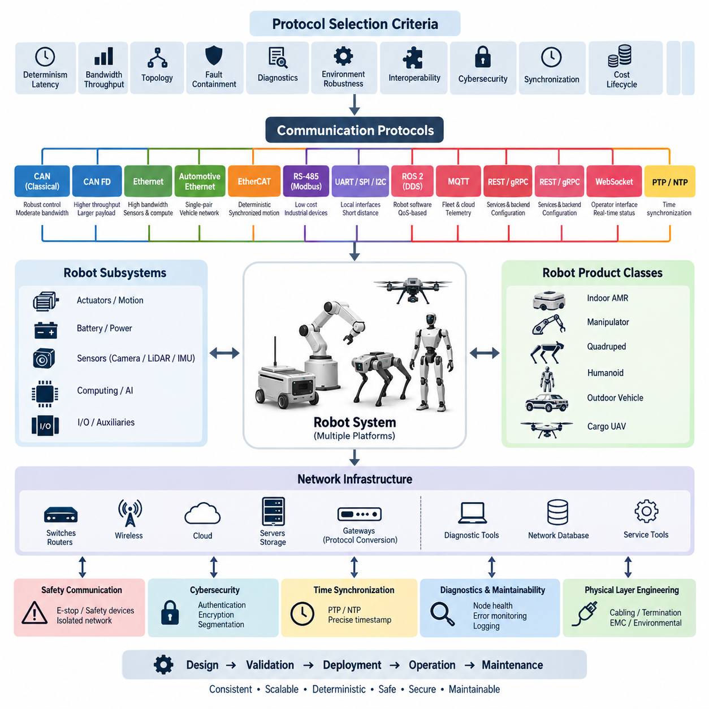
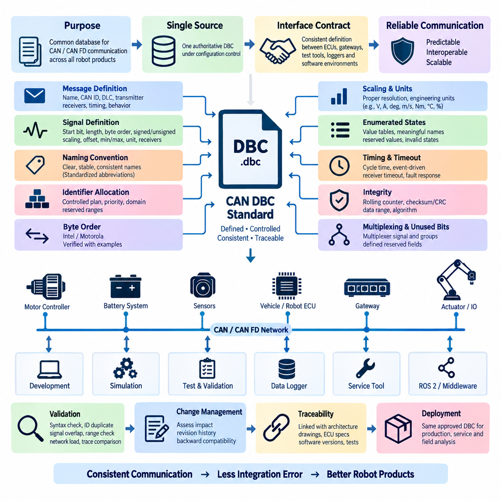
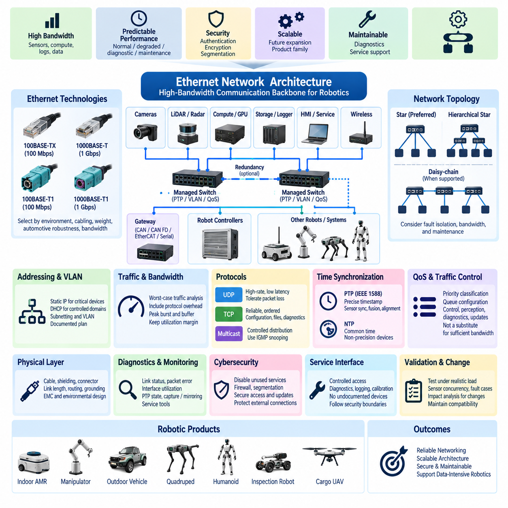
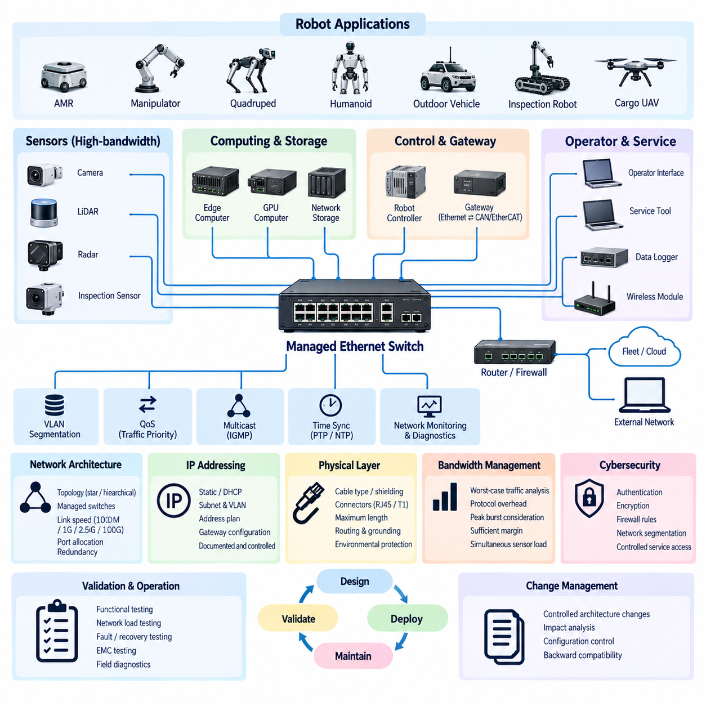
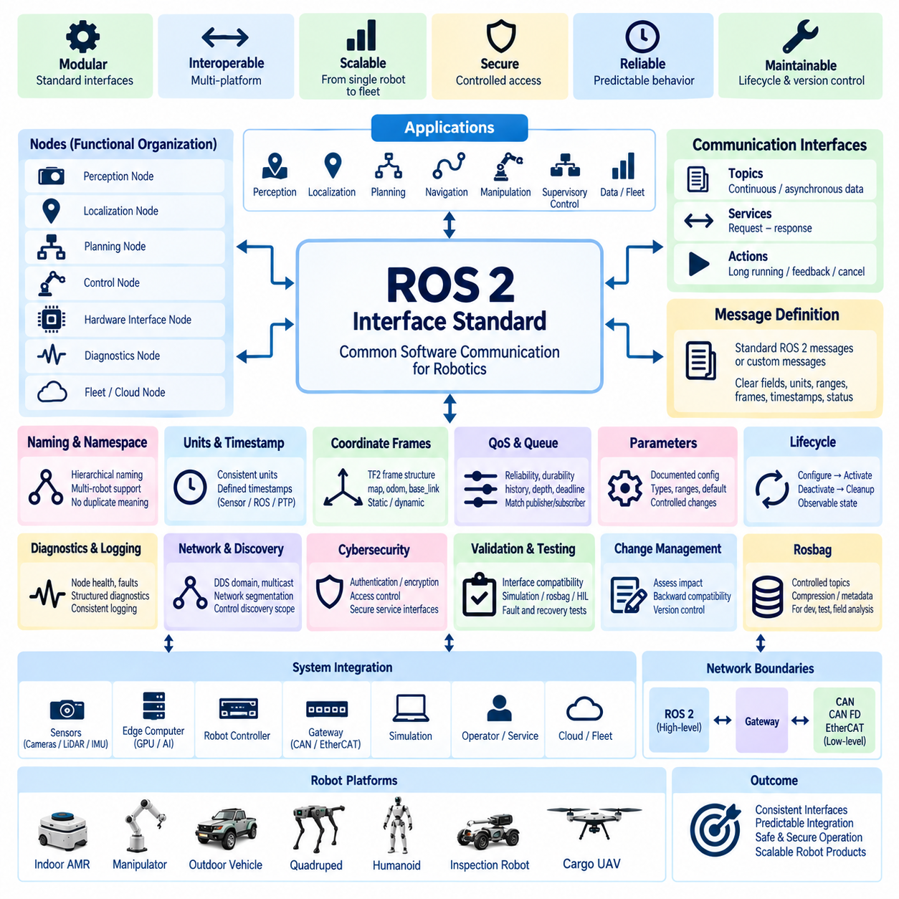
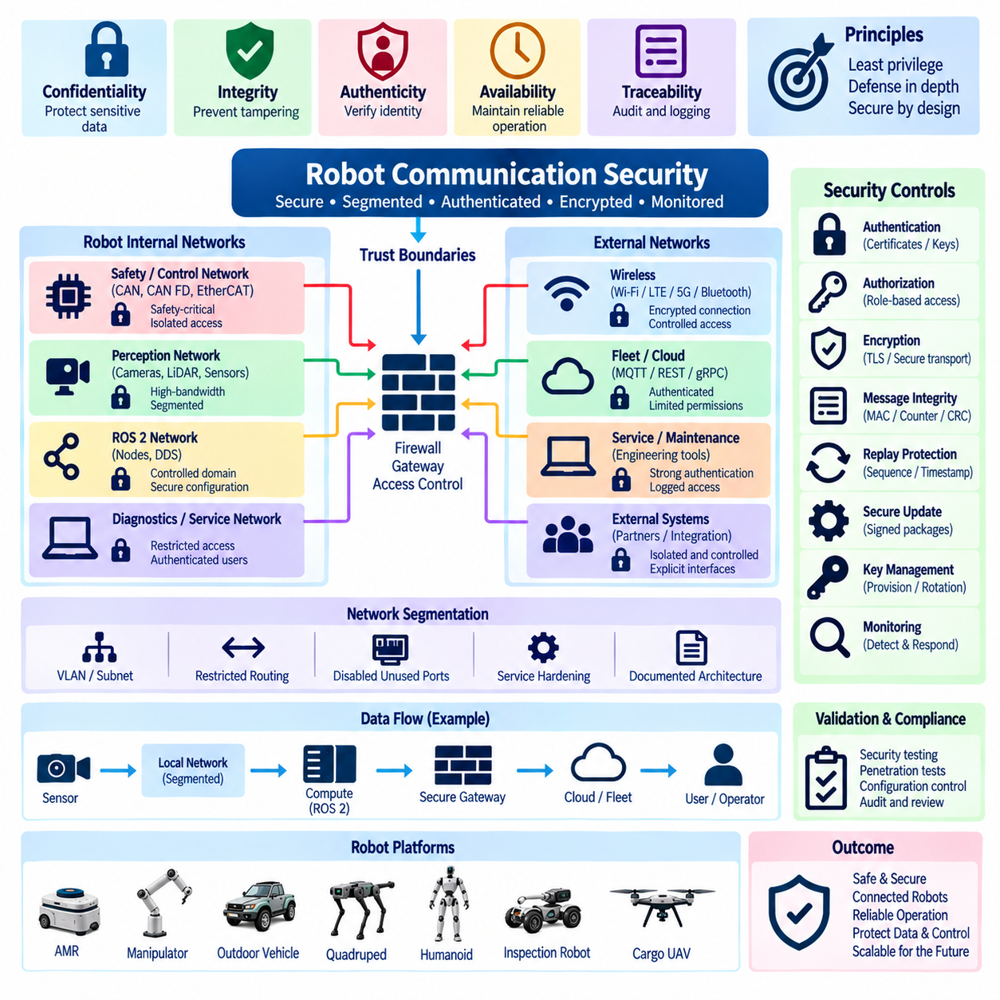

**Volume 22. Hills Robotics Engineering Standards**

# Chapter 06. HRS-006 Communication

## 06.01. Protocol Selection Matrix

{width="7.268055555555556in" height="7.268055555555556in"}

프로토콜 선택 매트릭스(Protocol Selection Matrix)는 승인된 통신 기술(Communication Technology)과 이를 로봇 하위 시스템(Robot Subsystem)에 할당하기 위한 엔지니어링 기준(Engineering Criteria)을 정의한다. 프로토콜 선택(Protocol Selection)은 대역폭(Bandwidth)이나 부품 가용성(Component Availability)만을 기준으로 결정해서는 안 된다. 설계자는 대상 제품에 대해 결정성(Determinism), 지연시간(Latency), 토폴로지(Topology), 고장 격리(Fault Containment), 진단 기능(Diagnostic Capability), 환경 강건성(Environmental Robustness), 상호운용성(Interoperability), 사이버보안(Cybersecurity), 동기화(Synchronization), 구현 비용(Implementation Cost), 수명주기 지원(Lifecycle Support)을 종합적으로 평가해야 한다.

CAN은 중간 수준의 대역폭(Moderate Bandwidth)으로 강건한 통신(Robust Communication)이 필요한 분산 임베디드 장치(Distributed Embedded Device)의 우선 제어 네트워크(Control Network)로 사용해야 한다. 일반적인 적용 대상에는 모터 제어기(Motor Controller), 배터리 관리 시스템(Battery Management System), 전력 분배 장치(Power Distribution Unit), 조향 제어기(Steering Controller), 제동 인터페이스(Braking Interface), 액추에이터 제어기(Actuator Controller), 지능형 입출력 모듈(Intelligent I/O Module)이 포함된다. 클래식 CAN(Classical CAN)은 페이로드(Payload)와 데이터 전송률(Data Rate)의 한계가 시스템 성능을 제한하지 않는 소형 명령, 상태 및 진단 트래픽에 적합하다.

CAN FD는 기존 CAN 기반 아키텍처(CAN-based Architecture)의 중재 및 물리 계층 특성(Arbitration and Physical-layer Characteristics)을 유지하면서 더 큰 페이로드와 높은 유효 데이터 처리량(Effective Data Throughput)이 필요한 경우 선택해야 한다. 보다 풍부한 진단, 구성 데이터(Configuration Data), 상태 정보(State Information), 중간 크기의 제어 메시지를 교환하는 차세대 제어기에 적합하다. 클래식 CAN에서 CAN FD로 전환할 경우 모든 노드(Node), 트랜시버(Transceiver), 게이트웨이(Gateway), 종단 요소(Termination Element), 진단 도구(Diagnostic Tool), 네트워크 데이터베이스(Network Database)의 호환성을 검토해야 한다.

이더넷(Ethernet)은 컴퓨팅 플랫폼(Computing Platform), 인지 센서(Perception Sensor), 게이트웨이, 저장 장치(Storage Device), 네트워크 인프라(Network Infrastructure) 사이의 고대역폭 통신(High-bandwidth Communication)에 사용해야 한다. 카메라(Camera), 3D 라이다(3D LiDAR), 엣지 컴퓨터(Edge Computer), GPU 시스템(GPU System), 고속 로깅 장비(High-rate Logging Equipment)가 대표적인 이더넷 종단점(Ethernet Endpoint)이다. 선택된 이더넷 방식은 프로토콜 오버헤드(Protocol Overhead), 트래픽 버스트(Traffic Burst), 향후 확장, 진단, 동기화 트래픽 및 센서 동시 운용을 고려한 충분한 지속 처리량(Sustained Throughput)과 엔지니어링 여유(Engineering Margin)를 제공해야 한다.

자동차 이더넷(Automotive Ethernet)은 단일 쌍 배선(Single-pair Cabling), 하네스 중량 감소(Harness Mass Reduction), 자동차 환경 강건성(Automotive Environmental Robustness), 표준화된 차량 네트워킹(Standardized Vehicle Networking)이 중요한 경우 고려해야 한다. 대역폭 요구사항과 부품 가용성에 따라 100BASE-T1 또는 1000BASE-T1을 적용할 수 있다. 상용 또는 산업용 네트워크 장비가 수명주기, 정비성(Serviceability), 비용 측면에서 장점을 제공하는 보호된 컴퓨팅 구획(Protected Computing Compartment)에서는 기존 100BASE-TX, 1000BASE-T 또는 더 높은 속도의 이더넷을 사용할 수 있다.

EtherCAT은 결정론적 주기 통신(Deterministic Cyclic Communication)과 낮은 지터(Low Jitter)가 요구되는 정밀 동기화 분산 모션 시스템(Distributed Motion System)에 우선 적용해야 한다. 일반적인 적용 대상에는 매니퓰레이터(Manipulator), 휴머노이드 관절(Humanoid Joint), 사족보행 로봇 액추에이터(Quadruped Actuator), 서보 드라이브(Servo Drive), 다축 협조 메커니즘(Coordinated Multi-axis Mechanism)이 포함된다. EtherCAT 적용은 대역폭만이 아니라 제어 주기 요구사항(Control-cycle Requirement)을 근거로 결정해야 하며, 네트워크 토폴로지, 분산 클록 성능(Distributed Clock Performance), 주기 시간(Cycle Time), 노드 수, 고장 동작(Fault Behavior), 복구 특성(Recovery Characteristics)을 전체 장비 수준에서 검증해야 한다.

RS-485와 Modbus RTU는 높은 대역폭이나 하드 실시간 동작(Hard Real-time Behavior)이 필요하지 않은 저비용 산업 장치(Low-cost Industrial Device), 레거시 장비(Legacy Equipment), 계측 장비(Instrumentation), 충전기(Charger), 환경 센서(Environmental Sensor), 보조 모듈(Auxiliary Module)에 사용할 수 있다. 단순한 구조로 인해 천천히 변화하는 공정 값(Process Value)과 설정 파라미터(Configuration Parameter)에 적합하다. 설계자는 주소 지정(Addressing), 전송 속도(Baud Rate), 종단(Termination), 바이어싱(Biasing), 케이블 길이, 접지, 타임아웃 동작(Timeout Behavior), 재시도 정책(Retry Policy), 게이트웨이 소유권(Gateway Ownership)을 시스템 사양에서 관리해야 한다.

UART, SPI, I2C는 원칙적으로 로봇 전체 네트워크가 아니라 로컬 보드 수준(Board-level) 또는 단거리 인터페이스(Short-distance Interface)로 사용해야 한다. UART는 디버그 포트(Debug Port)와 단순 주변장치 인터페이스에 사용할 수 있으며, SPI는 서로 밀접하게 연결된 전자장치 사이의 고속 통신에 적합하다. I2C는 제어된 전기적 경계(Controlled Electrical Boundary) 내부의 저속 센서와 설정 장치에 적합하다. 외부 배선을 적용할 경우 노이즈 내성(Noise Immunity), 거리, 접지, 고장 전파(Failure Propagation)를 명시적으로 검토해야 한다.

ROS 2 통신(ROS 2 Communication)은 일반적으로 기반 IP 네트워크(Underlying IP Network) 상위에서 동작하며, 물리 계층 및 데이터 링크 아키텍처(Physical and Data-link Architecture)에 대한 엔지니어링 정의를 대체해서는 안 된다. DDS 기반 통신(DDS-based Communication)은 로봇 컴퓨터 사이의 인지, 위치추정(Localization), 계획(Planning), 제어 협조(Control Coordination), 분산 소프트웨어 서비스(Distributed Software Service)에 사용할 수 있다. 서비스 품질(Quality of Service, QoS) 설정은 기본값에 의존하지 않고 신뢰성(Reliability), 내구성(Durability), 이력 깊이(History Depth), 데드라인(Deadline), 생존성(Liveliness), 자원 동작(Resource Behavior)을 메시지 중요도에 따라 정의해야 한다.

DDS는 확장 가능한 발행-구독 통신(Publish-subscribe Communication), 분산 탐색(Distributed Discovery), 설정 가능한 서비스 품질(Quality of Service), 다중 컴퓨터 소프트웨어 통합(Multi-computer Software Integration)이 필요한 경우 고려해야 한다. 생산자(Producer)와 소비자(Consumer)가 독립적으로 발전하는 모듈형 로봇 시스템(Modular Robotic System)에 특히 적합하다. ROS 2가 DDS를 사용한다는 이유만으로 안전 중요 기능(Safety-critical Function)이나 하드 실시간 기능에 자동 적용해서는 안 되며, 결정적 동작, 자원 한계(Resource Bound), 고장 처리(Failure Handling), 미들웨어 구현(Middleware Implementation), 플랫폼 적격성(Platform Qualification)을 별도로 평가해야 한다.

MQTT는 비동기 발행-구독 메시징(Asynchronous Publish-subscribe Messaging)이 유리한 플릿(Fleet), 클라우드(Cloud), 텔레메트리(Telemetry), 유지보수(Maintenance), 감독 통신(Supervisory Communication)에 선택할 수 있다. 시간 중요 액추에이터 제어(Time-critical Actuator Control)의 주 통신 방식으로 사용해서는 안 된다. 토픽 계층구조(Topic Hierarchy), 보존 메시지 정책(Retained-message Policy), 서비스 품질 수준(QoS Level), 인증(Authentication), 암호화(Encryption), 브로커 이중화(Broker Redundancy), 재연결 동작(Reconnect Behavior), 오프라인 버퍼링(Offline Buffering), 메시지 만료(Message Expiration)를 정의하여 클라우드 연결의 손실이나 복구가 로봇의 불안전한 동작을 발생시키지 않도록 해야 한다.

REST API와 gRPC는 구성(Configuration), 플릿 서비스(Fleet Service), 백엔드 통합(Backend Integration), 데이터 접근(Data Access), 소프트웨어 관리(Software Management), 비하드실시간 서비스 인터페이스(Non-hard-real-time Service Interface)에 적용할 수 있다. REST는 광범위한 상호운용성과 단순한 자원 지향 통합(Resource-oriented Integration)을 제공하며, gRPC는 관리되는 소프트웨어 구성요소 사이에서 효율적인 형식 지정 인터페이스(Typed Interface)와 스트리밍(Streaming)을 제공할 수 있다. 별도의 타이밍 분석(Timing Analysis), 제한된 실행 동작(Bounded Execution Behavior), 적절한 실시간 전송 아키텍처가 없는 경우 어느 기술도 결정론적 모션 제어(Deterministic Motion Control)에 적합하다고 간주해서는 안 된다.

WebSocket은 로봇 서비스, 운용자 인터페이스(Operator Interface), 대시보드(Dashboard), 원격 감독 애플리케이션(Remote Supervisory Application) 사이에 지속적인 양방향 통신(Persistent Bidirectional Communication)이 필요한 경우 사용할 수 있다. 반복적인 HTTP 트랜잭션보다 높은 효율이 필요한 대화형 상태 업데이트와 명령에 적합하지만 결정론적 필드버스(Deterministic Fieldbus) 동작을 요구하는 기능에는 적합하지 않다. 운용 배치를 위해 명령 권한(Command Authorization), 하트비트(Heartbeat), 재연결 처리, 시퀀스 관리(Sequence Management), 오래된 데이터 거부(Stale-data Rejection), 속도 제한(Rate Limiting), 보안 전송(Secure Transport)을 명확하게 정의해야 한다.

시간 동기화 요구사항(Time Synchronization Requirement)은 애플리케이션 프로토콜 선택과 독립적으로 평가해야 한다. 센서 융합(Sensor Fusion), 다중 카메라 처리(Multi-camera Processing), 라이다-카메라 정렬(LiDAR-camera Alignment), 분산 제어(Distributed Control), 이벤트 재구성(Event Reconstruction), 고품질 데이터 로깅을 수행하는 시스템은 PTP 또는 이에 준하는 정밀 동기화가 필요할 수 있다. 정밀도가 중요하지 않은 감독 컴퓨터에는 NTP가 충분할 수 있으며, 요구 타임스탬프 정확도(Timestamp Accuracy), 클록 계층(Clock Hierarchy), 그랜드마스터 동작(Grandmaster Behavior), 하드웨어 타임스탬프 지원(Hardware Timestamp Support), 홀드오버(Holdover), 고장 검출(Failure Detection)을 아키텍처 수준에서 문서화해야 한다.

안전 통신(Safety Communication)은 안전 개념(Safety Concept)에서 독립성, 결정론적 응답 또는 인증된 통신 메커니즘을 요구하는 경우 일반 애플리케이션 트래픽과 논리적 또는 물리적으로 분리해야 한다. 비상 정지(Emergency Stop), 보호 정지(Protective Stop), 안전 라이다(Safety LiDAR), 구동 차단(Drive Disable) 및 관련 기능은 요구되는 안전 무결성(Safety Integrity)에 적합한 아키텍처를 사용해야 한다. 일반 CAN, Ethernet, ROS 2, MQTT 또는 소프트웨어 하트비트 연결은 전체 구현이 관련 안전 요구사항을 충족하지 않는 한 안전 네트워크(Safety Network)로 간주해서는 안 된다.

프로토콜 선택에서는 로봇 제품 유형(Robot Product Class)도 고려해야 한다. 실내 자율이동로봇(Indoor AMR)은 일반적으로 임베디드 제어에 CAN 또는 CAN FD를 사용하고 인지 및 컴퓨팅 통합에는 Ethernet을 사용하는 구성이 적합하다. 매니퓰레이터, 사족보행 로봇(Quadruped), 휴머노이드(Humanoid)는 협조 모션(Coordinated Motion)을 위해 EtherCAT 또는 다른 결정론적 서보 네트워크(Deterministic Servo Network)가 필요할 수 있다. 실외 자율주행 차량(Outdoor Autonomous Vehicle)은 강건한 제어 네트워크와 고대역폭 센서 Ethernet을 결합해야 하며, 화물 무인항공기(Cargo UAV)는 항공전자 결정성(Avionics Determinism), 이중화(Redundancy), 중량, 인증(Certification), 고장 격리 요구사항을 추가로 고려해야 한다.

게이트웨이(Gateway)는 서로 다른 통신 도메인(Communication Domain) 사이에 제어된 상호운용성이 필요한 경우에만 도입해야 한다. 게이트웨이는 CAN, CAN FD, Ethernet, DDS, Modbus 또는 기타 승인된 인터페이스 사이를 변환할 수 있지만 중요 기능(Critical Function) 사이에서 문서화되지 않은 의존성이 되어서는 안 된다. 게이트웨이 사양은 메시지 매핑(Message Mapping), 갱신 주기(Update Rate), 버퍼링(Buffering), 타임아웃 동작, 타임스탬프 처리, 진단 전파(Diagnostic Propagation), 기동 순서(Startup Sequence), 과부하 대응(Overload Response), 사이버보안 경계(Cybersecurity Boundary), 연결된 네트워크 중 하나가 사용할 수 없게 되었을 때의 동작을 정의해야 한다.

매트릭스(Matrix)는 각 인터페이스를 최소한 기능 중요도(Functional Criticality), 요구 대역폭, 최대 허용 지연시간(Maximum Acceptable Latency), 지터 허용도(Jitter Tolerance), 동기화 정확도(Synchronization Accuracy), 노드 수, 토폴로지, 케이블 거리, 환경 노출(Environmental Exposure), 이중화 요구사항, 정비성(Serviceability)을 기준으로 분류해야 한다. 이후 도출된 프로토콜 할당(Protocol Assignment)을 하드웨어 가용성과 소프트웨어 지원 여부에 대해 검증해야 한다. 이러한 접근 방식은 개발 단계에서 편리하게 사용한 인터페이스가 시스템 수준 요구사항을 만족한다는 근거 없이 양산 아키텍처(Production Architecture)로 전환되는 것을 방지한다.

대역폭 계산(Bandwidth Calculation)은 명목상의 메시지 전송률이 아니라 현실적인 최악 조건 트래픽(Worst-case Traffic)을 기준으로 수행해야 한다. 엔지니어링 분석에는 페이로드 효율(Payload Efficiency), 프레임 오버헤드(Frame Overhead), 재전송(Retransmission), 진단 세션(Diagnostic Session), 탐색 트래픽(Discovery Traffic), 동기화 패킷, 로깅, 펌웨어 업데이트(Firmware Update), 예상 가능한 확장을 포함해야 한다. 인지 데이터를 전달하는 네트워크에서는 센서 동시 스트림(Simultaneous Sensor Stream)과 버스트 동작도 고려해야 하며, 진단 또는 유지보수 트래픽이 추가되어도 정상 동작이 안정적으로 유지될 수 있도록 사용률 여유(Utilization Margin)를 확보해야 한다.

지연시간과 결정성은 네트워크의 명목 속도가 아니라 데이터를 수신하는 기능의 요구사항에 따라 평가해야 한다. 고대역폭 Ethernet 연결이 본질적으로 결정론적 제어를 제공하는 것은 아니며, 반대로 낮은 대역폭의 필드버스가 작은 주기 메시지에 대해 더 예측 가능한 타이밍을 제공할 수 있다. 따라서 프로토콜 결정은 통신 성능을 제어 루프 주기(Control-loop Period), 센서 데드라인(Sensor Deadline), 액추에이터 응답 요구사항, 워치독 타이밍(Watchdog Timing), 상태 머신 전환(State-machine Transition), 정의된 성능 저하 운전 모드(Degraded Operating Mode)와 직접 연결해야 한다.

물리 계층 엔지니어링(Physical-layer Engineering)은 모든 프로토콜 결정에 포함되어야 한다. 케이블 종류, 특성 임피던스(Characteristic Impedance), 차폐(Shielding), 종단, 커넥터 선택, 굽힘 반경(Bend Radius), 접지, 공통 모드 허용도(Common-mode Tolerance), 절연(Isolation), 최대 세그먼트 길이(Maximum Segment Length)는 배치 환경과 일치해야 한다. 통신 아키텍처만으로 불안정한 물리 계층을 보완할 수 없으므로 시제품 검증(Prototype Validation)은 대표적인 하네스 길이와 배선 경로, 모터 스위칭 노이즈(Motor Switching Noise), 전원 과도현상(Power Transient), 커넥터 인터페이스, 예상 환경 조건을 재현해야 한다.

사이버보안(Cybersecurity)은 선택된 네트워크가 외부 컴퓨터, 무선 인프라(Wireless Infrastructure), 플릿 시스템, 서비스 도구(Service Tool), 클라우드 서비스와 연결될 수 있는 경우 반드시 포함해야 한다. 인터페이스에는 최소 필요 노출 원칙(Principle of Minimum Required Exposure)을 적용하고 위험도에 따라 인증, 권한 부여(Authorization), 암호화, 망 분리(Segmentation), 보안 설정(Secure Configuration), 통제된 진단 접근(Controlled Diagnostic Access)을 적용해야 한다. 안전 관련 임베디드 도메인(Safety-related Embedded Domain)과 외부 접근이 가능한 Ethernet 도메인 사이의 네트워크 브리지(Network Bridge)는 특히 엄격한 아키텍처 검토와 보호가 필요하다.

진단성(Diagnostics)과 유지보수성(Maintainability)은 개발 초기부터 프로토콜 선택에 반영해야 한다. 선택된 기술은 승인된 엔지니어링 도구를 사용하여 노드 식별(Node Identification), 통신 고장, 타임아웃 상태, 오류 카운터(Error Counter), 소프트웨어 버전, 설정 상태(Configuration State), 네트워크 상태(Network Health)를 확인할 수 있어야 한다. 서비스 담당자는 양산 네트워크를 무분별하게 탐색하지 않고 고장을 격리할 수 있어야 하며, 로깅 및 진단 메커니즘은 간헐적으로 발생하는 현장 통신 고장을 재구성할 수 있도록 충분한 타임스탬프와 상황 정보(Context)를 보존해야 한다.

프로토콜 선택 결과는 통제된 아키텍처 의사결정(Controlled Architecture Decision)으로 문서화하고 인터페이스 사양(Interface Specification), 네트워크 데이터베이스, 배선 도면(Wiring Drawing), 소프트웨어 인터페이스 정의(Software Interface Definition), 사이버보안 요구사항, 검증 계획(Validation Plan)과 연계해야 한다. 프로토콜 유형, 비트 전송률(Bit Rate), 주소 지정, 토폴로지, QoS 설정, 동기화 방식, 게이트웨이 매핑의 변경은 릴리스 전에 영향도 평가(Impact Assessment)를 수행해야 하며, 하드웨어, 하네스, 소프트웨어, 진단, 안전, EMC, 생산 시험, 서비스 도구, 하위 호환성(Backward Compatibility)에 미치는 영향을 확인해야 한다.

따라서 프로토콜 선택 매트릭스(Protocol Selection Matrix)는 단순히 통신 속도를 비교하는 표가 아니라 시스템 수준 의사결정 메커니즘(System-level Decision Mechanism)이다. 그 목적은 전기 하드웨어(Electrical Hardware), 임베디드 제어(Embedded Control), 인지(Perception), 컴퓨팅(Computing), 로보틱스 미들웨어(Robotics Middleware), 플릿 서비스, 외부 인프라 전반에 걸쳐 일관된 통신 경계(Communication Boundary)를 확립하는 것이다. 매트릭스를 일관되게 적용함으로써 각 인터페이스에는 요구사항을 만족하는 가장 단순하고 적절한 기술을 적용하면서 결정론적 동작, 확장성(Scalability), 진단성(Diagnosability), 안전성(Safety), 보안성(Security), 장기 제품 유지보수성(Long-term Product Maintainability)을 확보할 수 있다.

## 06.02. CAN DBC Standard

{width="7.268055555555556in" height="7.268055555555556in"}

CAN DBC 표준(CAN DBC Standard)은 로봇 제품 전반에서 CAN 및 CAN FD 통신을 기술하기 위해 사용하는 공통 데이터베이스 규칙(Common Database Rule)을 정의한다. DBC 파일(DBC File)은 메시지(Message), 신호(Signal), 송신기(Transmitter), 수신기(Receiver), 스케일링(Scaling), 단위(Unit), 타이밍(Timing), 진단 속성(Diagnostic Attribute)에 대한 통제된 기계 판독형 정의(Controlled Machine-readable Definition) 역할을 해야 한다. 이를 통해 임베디드 제어기, 게이트웨이, 시험 시스템, 시뮬레이션 도구, 데이터 로거 및 소프트웨어 개발 환경 사이에 일관된 인터페이스 계약(Interface Contract)을 제공해야 한다.

모든 양산 CAN 네트워크(Production CAN Network)는 형상 관리(Configuration Control) 하에 하나의 권위 있는 DBC 원본(Authoritative DBC Source)을 가져야 한다. ECU 프로젝트, 시험 스크립트, 로깅 애플리케이션 또는 공급업체 패키지에 포함된 복사본이 독립적인 마스터 버전(Master Version)이 되어서는 안 된다. 릴리스된 DBC는 정의된 제품, 네트워크 채널(Network Channel), 개정판(Revision), 호환성 상태(Compatibility State)와 연계되어 엔지니어가 특정 하드웨어 및 소프트웨어 릴리스에 어떤 통신 정의가 적용되는지 정확하게 판단할 수 있어야 한다.

DBC 명명 규칙(DBC Naming)은 명확하고 안정적이며 구현 방식에 독립적인 용어를 사용해야 한다. 메시지와 신호 이름은 임시 소프트웨어 변수, 개발자 이니셜 또는 내부 디버깅 용어가 아니라 엔지니어링 의미(Engineering Meaning)를 표현해야 한다. 이름은 임베디드 소프트웨어, ROS 2 게이트웨이, 캘리브레이션 도구, 시험 시스템 및 서비스 환경 전반에서 쉽게 이해할 수 있어야 한다. 약어(Abbreviation)는 표준화해야 하며 동일한 개념에는 전체 제품군에서 동일한 용어를 사용해야 한다.

CAN 식별자(CAN Identifier)는 개별 ECU 개발자가 독립적으로 할당하는 것이 아니라 통제된 네트워크 설계 프로세스(Network Design Process)를 통해 할당해야 한다. 식별자 계획(Identifier Plan)은 메시지 우선순위, 중재 동작(Arbitration Behavior), 기능 도메인(Functional Domain), 네트워크 부하(Network Load), 향후 확장, 게이트웨이 라우팅(Gateway Routing), 진단 트래픽을 고려해야 한다. 표준 식별자(Standard Identifier)와 확장 식별자(Extended Identifier)는 아키텍처상 명확한 이유 없이 혼용해서는 안 되며, 내부 모듈과 공급업체 장치 사이의 충돌을 방지하도록 예약 식별자 범위(Reserved Identifier Range)를 문서화해야 한다.

각 DBC 메시지는 고유한 메시지 이름, CAN 식별자, 페이로드 길이(Payload Length), 송신기, 예상 수신기, 전송 동작(Transmission Behavior), 적용 가능한 타이밍 정보를 정의해야 한다. CAN FD에서는 자동으로 최대 프레임 크기(Maximum Frame Size)를 선택하는 것이 아니라 실제 통신 설계에 맞게 페이로드 길이를 설정해야 한다. 메시지 그룹화(Message Grouping)는 불필요한 대역폭 사용을 최소화하는 동시에 서로 크게 다른 갱신 주기(Update Rate), 우선순위 또는 고장 대응(Fault Response)을 요구하는 신호들이 지나치게 결합되지 않도록 해야 한다.

신호 정의(Signal Definition)에는 시작 비트(Start Bit), 비트 길이(Bit Length), 바이트 순서(Byte Order), 부호 또는 무부호 표현(Signed or Unsigned Representation), 스케일링 계수(Scaling Factor), 오프셋(Offset), 물리적 최소값(Physical Minimum), 물리적 최대값(Physical Maximum), 공학 단위(Engineering Unit), 해당되는 경우 수신기 정보를 포함해야 한다. 이러한 속성은 신호의 실제 물리적 또는 논리적 의미를 반영해야 한다. 모호한 디코딩(Decoding), 오버플로(Overflow), 포화(Saturation), 잘못된 공학적 해석을 유발할 수 있는 임시 범위나 임의의 스케일링 값은 릴리스된 DBC에 남겨서는 안 된다.

인텔(Intel) 및 모토로라(Motorola) 바이트 순서 규칙은 일관되게 적용하고 알려진 인코딩 예제(Known Encoded Example)를 이용하여 검증해야 한다. 특히 다중 바이트 신호(Multi-byte Signal)는 잘못된 시작 비트 해석으로 인해 기술적으로 잘못되었지만 그럴듯한 값이 생성될 수 있으므로 주의해야 한다. 따라서 DBC 구현 검토에서는 중요 신호에 대해 대표적인 원시 프레임(Raw Frame)과 예상 물리값(Expected Physical Value)을 확인해야 하며, 특히 조향, 속도, 토크, 배터리, 제동, 액추에이터 및 안전 관련 상태 정보에 대해 이를 수행해야 한다.

스케일링은 필요한 동작 범위(Operating Range)에서 충분한 분해능(Resolution)을 제공하면서 페이로드 용량을 낭비하지 않아야 한다. 물리값은 전압(Volt), 전류(Ampere), 각도(Degree), 라디안(Radian), 초당 미터(Meter per Second), 뉴턴미터(Newton-meter), 섭씨온도(Degree Celsius), 백분율(Percentage) 등 해당 기능에 적합한 공학 단위로 표현해야 한다. 단위 규칙(Unit Convention)은 제품 전반에서 일관되게 유지하고 서로 다른 단위 체계의 변환은 수신 애플리케이션에서 문서화되지 않은 방식으로 처리하는 대신 정의된 소프트웨어 경계(Software Boundary)에서 수행해야 한다.

열거형 상태(Enumerated State)는 개별 숫자 값이 운전 모드, 명령, 고장 또는 상태 조건을 나타내는 경우 값 테이블(Value Table)을 사용해야 한다. 상태 정의에는 의미 있는 이름을 부여하고 향후 확장이나 무효 상태 검출(Invalid-state Detection)이 필요한 경우 값을 예약해야 한다. 불리언 신호(Boolean Signal)는 활성 및 비활성 상태에 대해 일관된 규칙을 사용해야 한다. 특히 신호가 모션, 전력, 안전 또는 감독 제어에 영향을 미치는 경우 정의되지 않은 숫자 값이 유효한 운전 상태로 자동 매핑되어서는 안 된다.

주기 메시지(Periodic Message)는 전송 정보의 동특성(Dynamics)에 적합한 공칭 주기 시간(Nominal Cycle Time)을 정의해야 한다. 제어 및 액추에이터 상태는 짧은 주기가 필요할 수 있지만 온도, 설정 또는 유지보수 정보에는 더 느린 전송 주기를 사용할 수 있다. 필요한 경우 이벤트 기반(Event-driven) 또는 혼합 전송 전략(Mixed Transmission Strategy)을 사용할 수 있다. DBC 타이밍 정의는 ECU 구현, 네트워크 부하 계산, 워치독 설정(Watchdog Setting), 게이트웨이 동작 및 통신 검증 기준과 일치해야 한다.

수신기는 메시지 부재가 기능 동작에 영향을 줄 수 있는 경우 타임아웃 감시(Timeout Supervision)를 구현해야 한다. 타임아웃 값은 임의로 선정하지 않고 예상 전송 주기, 통신 지터(Communication Jitter), 기동 동작(Startup Behavior), 요구 고장 검출 시간(Required Fault-detection Time)을 기준으로 결정해야 한다. 시스템 사양은 영향을 받는 기능의 중요도에 따라 데이터 무효화(Data Invalidation), 대체값(Fallback Value), 성능 저하 운전(Degraded Operation), 제어 정지(Controlled Stop), 진단 보고(Diagnostic Reporting) 등 메시지 손실에 대한 대응을 정의해야 한다.

롤링 카운터(Rolling Counter)는 수신기가 반복, 누락 또는 잘못된 순서의 프레임을 검출해야 하는 경우 제어 또는 상태 메시지에 포함할 수 있다. 카운터 비트 폭(Counter Width)과 롤오버 동작(Rollover Behavior)은 네트워크 전체에서 표준화해야 한다. 종단 간 무결성 보호(End-to-end Integrity Protection)가 필요한 경우 체크섬(Checksum) 또는 CRC도 정의할 수 있다. 보호 데이터 범위, 계산 순서, 초기값(Initialization Value), 다항식(Polynomial) 또는 알고리즘, 카운터 관계 및 미사용 바이트 처리 방법을 문서화하여 독립적인 구현에서도 동일한 결과를 생성하도록 해야 한다.

신호에 유효한 측정값이나 명령이 존재하지 않을 수 있는 경우 무효값 및 사용 불가 값(Invalid and Unavailable Value)을 명확하게 정의해야 한다. 예약된 원시 패턴(Reserved Raw Pattern)은 초기화, 센서 고장, 데이터 사용 불가 또는 미설정(Not-configured) 상태를 나타낼 수 있지만 유효한 물리값과 혼동되어서는 안 된다. 수신 소프트웨어는 통신 손실(Communication Loss)과 명시적으로 전송된 무효값을 구분해야 하며, 두 조건은 서로 다른 진단, 대체 동작 및 시스템 대응을 요구할 수 있다.

다중화 메시지(Multiplexed Message)는 논리적으로 관련된 여러 데이터 세트가 하나의 CAN 식별자를 공유하고 동시에 필요하지 않은 경우 사용할 수 있다. 식별자 할당을 줄이기 위한 목적으로 결정론적 제어, 진단, 로깅 또는 게이트웨이 처리를 복잡하게 만드는 다중화를 사용해서는 안 된다. 다중화 신호(Multiplexer Signal), 유효값, 관련 신호 그룹, 갱신 동작 및 수신기 기대 동작을 DBC에 완전하게 표현하고 자동 디코딩 시험(Automated Decoding Test)을 통해 검증해야 한다.

메시지 소유권(Message Ownership)은 명확해야 한다. 특별히 설계된 이중화 또는 다중 소스 아키텍처(Multi-source Architecture)가 요구되지 않는 한 정상 운전 중 각 CAN 식별자에는 하나의 정의된 송신 기능만 존재해야 한다. ECU 교체, 이중화 제어기, 부트로더(Bootloader), 서비스 도구로 인해 식별자 소유권 충돌이 동시에 발생해서는 안 된다. 운전 중 송신 권한(Transmitter Authority)이 변경될 수 있다면 중재 메커니즘과 전환 조건을 DBC 외부의 인터페이스 문서에서 규정하고 참조해야 한다.

DBC는 네트워크 도메인 사이에서 신호 의미(Signal Semantics)를 유지함으로써 게이트웨이 엔지니어링(Gateway Engineering)을 지원해야 한다. 게이트웨이가 CAN 정보를 CAN FD, Ethernet, DDS, ROS 2 또는 다른 인터페이스로 전달하거나 변환하는 경우 매핑에는 소스 메시지(Source Message), 목적지 인터페이스(Destination Interface), 스케일링 변환, 갱신 정책(Update Policy), 타임아웃 처리 및 타임스탬프 동작을 명시해야 한다. 게이트웨이는 통제된 인터페이스 요구사항 없이 신호 의미를 임의로 재해석하거나 단위를 변경하거나 무효 상태 의미를 변경해서는 안 된다.

일반 CAN 메시지를 통해 전달되는 진단 정보(Diagnostic Information)는 기능 통신과 동일한 명명, 스케일링, 타이밍 및 소유권 규칙을 따라야 한다. 진단 고장 코드(Diagnostic Trouble Code)와 UDS 서비스는 별도의 진단 사양으로 관리할 수 있지만 DBC 상태 신호는 요약된 상태 건전성(Health State), 고장 플래그(Fault Flag), 온도, 전압 상태, 통신 상태 또는 하위 시스템 가용성(Subsystem Availability)을 제공할 수 있다. 진단 메커니즘 사이의 중복은 우발적인 것이 아니라 의도적이며 추적 가능해야 한다.

DBC 타이밍을 정의할 때 네트워크 관리(Network Management)와 기동 동작을 고려해야 한다. 수신기는 전원이 인가된 직후 모든 송신기가 즉시 사용 가능해진다고 가정해서는 안 된다. 부팅 시간(Boot Time), 초기화(Initialization), 캘리브레이션 로딩(Calibration Loading), 버스 동기화(Bus Synchronization), 애플리케이션 준비(Application Readiness)로 인해 정상적인 지연이 발생할 수 있다. 따라서 통신 감시는 기동 상태와 운전 중 통신 고장을 구분해야 하며, 운전 준비 상태(Operational Readiness)를 전달하는 메시지는 명확하게 정의된 상태 의미를 가져야 한다.

미사용 페이로드 비트(Unused Payload Bit)는 처리 방법을 정의해야 한다. 예약 필드(Reserved Field)는 지정된 값으로 초기화하고 양산 릴리스에서 문서화되지 않은 개발 데이터를 전달해서는 안 된다. 향후 신호 할당은 가능한 경우 기존 수신기와의 호환성을 유지해야 한다. 개발자는 이전에 릴리스된 비트, 열거값 또는 식별자를 재사용하기 전에 기존 ECU, 게이트웨이, 로거 및 서비스 도구가 새로운 정보를 잘못 해석할 가능성을 평가해야 한다.

DBC에는 해당 ECU 소프트웨어에 익숙하지 않은 엔지니어도 인터페이스를 이해할 수 있도록 충분한 주석(Comment)과 속성(Attribute)을 포함해야 한다. 설명에는 전체 소프트웨어 요구사항을 중복하지 않으면서 신호의 목적, 중요한 유효 조건(Validity Condition), 관련 타이밍 및 예외 동작(Exceptional Behavior)을 기술해야 한다. 표준 DBC 구문으로 직접 표현할 수 없는 중요한 해석 규칙은 동일한 통신 릴리스와 연결된 통제된 인터페이스 문서(Controlled Interface Documentation)에서 관리해야 한다.

DBC 검증(DBC Validation)에는 구문 검사(Syntax Checking), 중복 식별자 검출(Duplicate Identifier Detection), 신호 중첩 검사(Signal Overlap Checking), 페이로드 경계 검증(Payload-boundary Verification), 스케일링 및 범위 검사, 송수신기 일관성 검사, 타이밍 검토 및 네트워크 부하 평가(Network-load Assessment)를 포함해야 한다. 자동화 도구는 후보 데이터베이스를 사용하여 대표적인 CAN 트레이스(CAN Trace)를 디코딩하고 예상 공학값과 비교해야 한다. 중요 메시지는 릴리스 전에 ECU 소스 설정 또는 생성된 통신 코드(Generated Communication Code)와 추가로 비교해야 한다.

통신 시험(Communication Testing)은 정상 동작과 비정상 동작을 모두 검증해야 한다. 시험에는 정상적인 주기 전송, 신호 최소 및 최대값, 열거형 상태, 카운터 롤오버, 체크섬 동작, 프레임 누락, 지연 프레임, 손상 데이터(Corrupted Data), 버스 오프 복구(Bus-off Recovery), ECU 재시작, 해당되는 경우 게이트웨이 중단을 포함해야 한다. 시험의 목적은 단순히 DBC가 트래픽을 디코딩할 수 있음을 확인하는 것이 아니라 데이터베이스가 전체 네트워크에서 구현된 실제 동작을 정확하게 표현한다는 것을 입증하는 것이다.

식별자, 신호 위치, 길이, 스케일링, 오프셋, 단위, 열거형 의미, 메시지 주기 또는 무결성 메커니즘(Integrity Mechanism)의 변경은 인터페이스 변경(Interface Change)으로 취급해야 한다. 승인 전에 호환성 영향(Compatibility Impact)을 평가해야 한다. 기존에 예약된 자원을 이용한 추가 변경(Additive Change)은 하위 호환성(Backward Compatibility)을 유지할 수 있지만 기존 신호를 재해석하는 변경은 관련 소프트웨어의 동시 업데이트가 필요할 수 있다. 개정 이력(Revision History)에는 기술적 변경 사유, 영향받는 제품, 담당자, 검증 상태 및 릴리스 기준선(Release Baseline)을 기록해야 한다.

릴리스된 DBC 파일은 전기 아키텍처 문서(Electrical Architecture Document), ECU 인터페이스 사양, CAN 네트워크 다이어그램(Network Diagram), 소프트웨어 버전, 시험 사양 및 게이트웨이 정의와 연결해야 한다. 양산, 검증, 서비스 및 현장 분석(Field Analysis) 조직은 가능한 한 동일한 승인 기준선(Approved Baseline)을 사용해야 한다. 이러한 추적성(Traceability)은 배치 이후 기록된 CAN 데이터를 정확하게 해석할 수 있도록 하며 개발 및 운용 환경에서 서로 다른 데이터베이스를 사용함으로써 발생하는 통신 고장을 방지한다.

따라서 CAN DBC 표준(CAN DBC Standard)은 로보틱스 엔지니어링 수명주기(Robotics Engineering Lifecycle) 전체에서 CAN 통신을 위한 단일 의미 계약(Single Semantic Contract)을 확립한다. 일관된 식별자 할당, 신호 인코딩(Signal Encoding), 타이밍, 무결성 보호, 진단, 검증 및 형상 관리를 통해 독립적으로 개발된 제어기들이 예측 가능하게 정보를 교환할 수 있다. 체계적인 DBC 프로세스는 통합 오류(Integration Error)를 줄이고 자동화 시험 및 로깅을 지원하며 게이트웨이 개발을 단순화하고, AMR, 매니퓰레이터, 실외 차량(Outdoor Vehicle), 사족보행 로봇, 휴머노이드 및 화물 무인항공기(Cargo UAV) 플랫폼이 발전하더라도 호환성을 유지할 수 있도록 한다.

## 06.03. Ethernet Network Standard

{width="7.268055555555556in" height="7.268055555555556in"}

{width="7.268055555555556in" height="7.268055555555556in"}

이더넷 네트워크 표준(Ethernet Network Standard)은 로봇 제품 전반의 이더넷 통신(Ethernet Communication)에 적용되는 아키텍처(Architecture), 물리 인터페이스(Physical Interface), 주소 지정(Addressing), 스위칭(Switching), 대역폭 관리(Bandwidth Management), 시간 관리(Timing), 진단(Diagnostics), 사이버보안(Cybersecurity) 규칙을 정의한다. 이더넷은 고대역폭 센서(High-bandwidth Sensor), 엣지 컴퓨터(Edge Computer), 게이트웨이(Gateway), 운용자 인터페이스(Operator Interface), 데이터 로거(Data Logger), 서비스 장비(Service Equipment)를 위한 통제된 백본(Controlled Backbone)을 제공하면서 정상, 성능 저하, 진단 및 유지보수 운전 조건에서도 예측 가능한 성능을 유지해야 한다.

이더넷은 주로 CAN, CAN FD 또는 기타 임베디드 제어 네트워크(Embedded Control Network)가 요구 데이터 용량을 효율적으로 지원할 수 없는 경우에 사용해야 한다. 대표적인 종단점(Endpoint)에는 카메라(Camera), 2D 및 3D 라이다(LiDAR), 레이더 인터페이스(Radar Interface), 고속 검사 센서(High-rate Inspection Sensor), Jetson 또는 엣지 컴퓨팅 플랫폼(Edge Computing Platform), GPU 컴퓨터, 네트워크 저장장치(Network Storage), 게이트웨이 및 무선 통신 모듈(Wireless Communication Module)이 포함된다. 선택 시 명목 링크 속도만이 아니라 지속 트래픽(Sustained Traffic), 최대 트래픽(Peak Traffic), 지연시간(Latency), 동기화(Synchronization), 환경 요구사항 및 향후 확장을 고려해야 한다.

승인된 물리 이더넷 기술(Physical Ethernet Technology)은 설치 환경과 시스템 아키텍처에 따라 선택해야 한다. 100BASE-TX와 1000BASE-T는 보호된 컴퓨팅 또는 장비 구획에서 사용할 수 있으며, 단일 쌍 배선(Single-pair Cabling), 하네스 중량 감소, 자동차 환경 강건성(Automotive Robustness) 또는 차량용 커넥터(Vehicle-oriented Connector)가 필요한 경우 100BASE-T1 또는 1000BASE-T1을 고려해야 한다. 집약된 인지 데이터(Aggregated Perception Data) 또는 로깅 트래픽에 대해서는 대역폭과 열 요구사항(Thermal Requirement)을 검증한 후 더 높은 속도의 이더넷을 적용할 수 있다.

모든 이더넷 네트워크는 스위치(Switch), 라우터(Router), 게이트웨이, 컴퓨팅 노드(Computing Node), 센서, 무선 인터페이스, 서비스 포트(Service Port), 외부 연결(External Connection)을 식별할 수 있는 문서화된 토폴로지(Topology)를 가져야 한다. 스타(Star) 또는 계층형 스타 토폴로지(Hierarchical-star Topology)는 고장 격리(Fault Isolation), 대역폭 분석 및 유지보수를 단순화하기 때문에 일반적으로 우선 적용한다. 장치 아키텍처에서 지원하는 경우 데이지 체인(Daisy-chain) 연결을 사용할 수 있지만 중간 장치 고장이 하위 통신에 미치는 영향을 승인 전에 평가해야 한다.

트래픽 감시(Traffic Monitoring), VLAN 분할(VLAN Segmentation), 이중화(Redundancy), 진단, 멀티캐스트 제어(Multicast Control) 또는 시간 동기화(Time Synchronization)가 필요한 양산 네트워크에서는 관리형 이더넷 스위치(Managed Ethernet Switch)를 우선 사용해야 한다. 스위치 선택 시 포트 수, 링크 속도, 포워딩 용량(Forwarding Capacity), 패킷 버퍼 크기(Packet Buffer Size), 동작 온도, 공급 전압, 환경 등급(Environmental Rating), 관리 인터페이스(Management Interface), PTP 기능 및 수명주기 가용성(Lifecycle Availability)을 고려해야 한다. 소비자용 스위치(Consumer-grade Switch)는 대상 환경에 대한 명시적인 적격성 검증(Qualification) 없이 중요 양산 아키텍처에 사용해서는 안 된다.

IP 주소 지정(IP Addressing)은 통제된 제품 수준 할당 계획(Product-level Allocation Plan)을 따라야 한다. 전원 재인가 및 서비스 작업 이후에도 식별 정보가 안정적으로 유지되어야 하는 센서, 제어기, 게이트웨이 및 컴퓨팅 플랫폼과 같은 결정론적 임베디드 장치에는 고정 주소 지정(Static Addressing)을 우선 적용한다. 동적 할당이 운용상 장점을 제공하는 통제된 도메인에서는 DHCP를 사용할 수 있다. 주소 범위(Address Range), 서브넷 마스크(Subnet Mask), 게이트웨이, 예약 주소(Reserved Address), 서비스 인터페이스 및 외부 라우팅 가능 네트워크(Externally Routable Network)를 문서화하고 형상 관리해야 한다.

서브넷팅(Subnetting)과 가상 근거리 통신망(Virtual LAN, VLAN)은 분리가 성능, 사이버보안, 고장 격리 또는 유지보수성을 향상시키는 경우 사용해야 한다. 인지 센서, 로봇 제어 컴퓨터, 서비스 인터페이스, 플릿 통신(Fleet Communication), 외부 접근 가능 네트워크가 하나의 제한 없는 브로드캐스트 도메인(Broadcast Domain)을 자동으로 공유해서는 안 된다. VLAN 설계는 구성원(Membership), 태그 및 비태그 포트(Tagged and Untagged Port), 라우팅 경계(Routing Boundary), 허용된 도메인 간 트래픽, 진단 접근 및 복구 절차를 정의하여 개발 및 현장 서비스 과정에서도 분할 구조를 명확하게 이해할 수 있도록 해야 한다.

대역폭 엔지니어링(Bandwidth Engineering)은 센서의 명목 데이터 전송률을 단순 합산하는 대신 현실적인 최악 조건 트래픽 모델(Worst-case Traffic Model)을 사용해야 한다. 분석에는 Ethernet, IP, UDP 또는 TCP 오버헤드, 멀티캐스트 복제(Multicast Duplication), 프로토콜 탐색(Protocol Discovery), 재전송(Retransmission), PTP 트래픽, 진단, 로깅, 소프트웨어 업데이트 및 센서 동시 운용을 포함해야 한다. 최대 버스트(Peak Burst)와 스위치 버퍼링(Switch Buffering)도 고려하고 유지보수 또는 진단 작업이 인지 및 제어 통신을 불안정하게 만들지 않도록 충분한 사용률 여유(Utilization Margin)를 확보해야 한다.

카메라 및 라이다 네트워크는 여러 센서가 동시에 지속적인 고속 스트림을 생성할 수 있으므로 대역폭을 특별히 고려해야 한다. 해상도(Resolution), 프레임 속도(Frame Rate), 픽셀 형식(Pixel Format), 압축(Compression), 패킷 크기(Packet Size), 라이다 리턴 모드(LiDAR Return Mode), 센서 설정은 네트워크 부하에 직접적인 영향을 준다. 따라서 스위치에서 인지 컴퓨터(Perception Computer)로 연결되는 집약 링크(Aggregated Link)는 센서들이 서로 다른 시점에 최대 처리량에 도달한다고 가정하지 않고 동시 최악 조건 운전을 기준으로 용량을 결정해야 한다.

UDP는 간헐적인 패킷 손실(Packet Loss)을 수신 애플리케이션에서 검출하거나 허용할 수 있는 고속 센서 스트림과 지연 민감 데이터(Latency-sensitive Data)에 사용할 수 있다. TCP는 설정, 파일 전송, 진단 또는 소프트웨어 관리와 같이 제한된 지연시간보다 순서가 보장되고 신뢰성 있는 전달(Ordered and Reliable Delivery)이 중요한 경우 사용할 수 있다. 전송 프로토콜(Transport Protocol)은 애플리케이션 동작에 맞게 선택해야 하며, 필요한 경우 수신 소프트웨어에서 패킷 손실, 중복(Duplication), 순서 변경(Reordering), 연결 해제 및 재연결을 명시적으로 처리해야 한다.

멀티캐스트 트래픽(Multicast Traffic)은 로봇 네트워크 전체에 불필요하게 배포되지 않도록 제어해야 한다. DDS, 탐색 프로토콜(Discovery Protocol), 카메라 또는 기타 멀티캐스트 기반 서비스를 사용하는 시스템은 필요한 경우 IGMP 스누핑(IGMP Snooping)과 같은 관리형 스위칭 기능을 사용해야 한다. 제어되지 않은 멀티캐스트는 해당 데이터가 필요하지 않은 장치의 대역폭과 처리 자원을 소비할 수 있으므로 멀티캐스트 그룹 동작, 예상 구독자(Subscriber), 네트워크 경계 및 기동 트래픽을 아키텍처 검증 과정에서 고려해야 한다.

서로 다른 트래픽 등급(Traffic Class)이 네트워크 인프라를 공유하는 경우 서비스 품질(Quality of Service, QoS) 메커니즘을 적용할 수 있다. 시간 민감 제어(Time-sensitive Control), 동기화, 인지 스트림, 진단, 소프트웨어 업데이트 및 백그라운드 로깅(Background Logging)이 반드시 동일한 포워딩 우선순위를 가져야 하는 것은 아니다. 우선순위 분류(Priority Classification)와 큐 설정(Queue Configuration)을 문서화하고 혼잡 상태에서 검증해야 한다. QoS는 충분한 대역폭을 대신하는 수단으로 사용해서는 안 되며, 용량이 부족한 네트워크는 중요 패킷에 우선순위를 부여하더라도 취약성이 남는다.

분산 센서 또는 컴퓨터가 상호 연계된 타임스탬프(Correlated Timestamp)를 요구하는 경우 시간 동기화를 이더넷 아키텍처의 일부로 설계해야 한다. IEEE 1588 정밀 시간 프로토콜(Precision Time Protocol, PTP)은 카메라 동기화, 라이다 정렬, 센서 융합(Sensor Fusion), 검사 데이터 및 분산 이벤트 재구성(Distributed Event Reconstruction)에 사용할 수 있다. 아키텍처는 그랜드마스터(Grandmaster), 필요한 경우 경계 클록(Boundary Clock) 또는 투명 클록(Transparent Clock)의 동작, 하드웨어 타임스탬프 지원, 동기화 정확도, 기동 수렴(Startup Convergence), 홀드오버(Holdover), 마스터 클록 손실에 대한 대응을 정의해야 한다.

공통 시각(Common Wall-clock Time)은 필요하지만 정밀 동기화가 필요하지 않은 장치에는 네트워크 시간 프로토콜(Network Time Protocol, NTP)을 사용할 수 있다. PTP와 NTP가 모두 시간을 배포한다는 이유만으로 서로 대체 가능한 것으로 취급해서는 안 된다. 센서 융합과 다중 센서 캘리브레이션(Multi-sensor Calibration)은 마이크로초 수준 또는 엄격하게 제한된 타임스탬프 관계를 요구할 수 있지만 로그, 유지보수 기록 또는 플릿 이벤트는 훨씬 큰 오차를 허용할 수 있다. 따라서 시간 요구사항은 해당 데이터를 사용하는 기능에 따라 할당해야 한다.

물리 계층 설계(Physical-layer Design)는 케이블 카테고리(Cable Category), 차폐(Shielding), 특성 임피던스(Characteristic Impedance), 커넥터 종류, 최대 링크 길이(Maximum Link Length), 굽힘 반경(Bend Radius), 배선 경로(Routing), 변형 방지(Strain Relief), 환경 보호(Environmental Protection)를 규정해야 한다. Ethernet 케이블은 모터 상 배선(Motor Phase Wiring), 인버터 출력(Inverter Output), 대전류 배터리 케이블 및 기타 주요 전자기 노이즈원과 적절한 거리를 두고 배선해야 한다. 차폐 종단(Shield Termination)과 접지는 승인된 접지 아키텍처를 따라 신호 무결성(Signal Integrity)을 저하시키거나 의도하지 않은 접지 전류 경로를 생성하지 않도록 해야 한다.

커넥터는 설치 위치의 환경 노출(Environmental Exposure)에 적합해야 한다. 표준 RJ45 커넥터는 보호된 캐비닛이나 컴퓨팅 인클로저(Compute Enclosure) 내부에서 사용할 수 있지만 진동, 먼지, 습기, 반복적인 정비 또는 실외 노출이 예상되는 경우 산업용, 자동차용 또는 밀봉형 커넥터(Sealed Connector)를 사용해야 한다. 고성능 케이블도 불량한 접점 종단(Contact Termination), 차폐 불연속(Shielding Discontinuity), 기계적으로 불안정한 인터페이스를 보완할 수 없으므로 커넥터와 케이블 어셈블리(Cable Assembly)를 하나의 완전한 채널로 평가해야 한다.

네트워크 기동 동작(Network Startup Behavior)은 애플리케이션이 정상적인 링크 설정(Link Establishment)을 시스템 고장으로 해석하지 않도록 정의해야 한다. 스위치 부팅 시간, Ethernet 자동 협상(Auto-negotiation), 센서 초기화, IP 설정, PTP 동기화, 미들웨어 탐색(Middleware Discovery), 애플리케이션 준비 상태가 서로 다른 시점에 완료될 수 있다. 감독 소프트웨어(Supervisory Software)는 초기화와 운전 중 통신 손실을 구분하고 네트워크 또는 종단점 고장을 선언하기 전에 적절한 기동 유예 시간(Startup Grace Period)을 적용해야 한다.

링크 감시(Link Supervision)는 요구되는 시스템 기능에 영향을 미치는 고장을 검출해야 한다. 관리형 스위치, 운영체제 및 애플리케이션은 링크 상태, 패킷 카운터(Packet Counter), 폐기 프레임 통계(Dropped-frame Statistics), 인터페이스 오류, 지연시간 측정 또는 하트비트(Heartbeat) 정보를 제공할 수 있다. 중요 수신기는 물리적 링크 상태에만 의존하지 않고 예상 애플리케이션 데이터도 추가로 감시해야 한다. Ethernet 링크가 전기적으로 활성 상태를 유지하더라도 원격 애플리케이션이 유효한 정보를 생성하지 않을 수 있기 때문이다.

네트워크 진단(Network Diagnostics)은 간헐적인 현장 고장(Intermittent Field Failure)을 조사할 수 있을 정도의 충분한 가시성(Visibility)을 제공해야 한다. 엔지니어는 승인된 도구를 사용하여 포트 상태, 협상된 속도(Negotiated Speed), 패킷 오류, 폐기 패킷, 멀티캐스트 동작, PTP 상태, 인터페이스 사용률 및 종단점 연결성을 확인할 수 있어야 한다. 필요한 경우 진단 캡처 포트(Diagnostic Capture Port) 또는 스위치 미러링(Switch Mirroring)을 제공할 수 있다. 양산 서비스 절차에서는 문제 해결 과정에서 타이밍, 라우팅 또는 사이버보안 동작을 변경할 수 있는 통제되지 않은 네트워크 변경을 방지해야 한다.

Ethernet과 CAN, CAN FD, EtherCAT, 직렬 네트워크(Serial Network) 또는 무선 시스템 사이의 게이트웨이는 통제된 인터페이스 정의를 가져야 한다. 게이트웨이 요구사항에는 소스 및 목적지 데이터, 전송률, 버퍼링, 타임아웃 동작, 타임스탬프 처리, 무효 데이터 처리(Invalid-data Treatment), 기동 순서 및 과부하 대응(Overload Response)을 명시해야 한다. 특히 Ethernet 정보가 모션 명령, 안전 감시, 위치추정(Localization) 또는 실시간 인지 기능에 기여하는 경우 게이트웨이 지연시간을 종단 간 타이밍 분석(End-to-end Timing Analysis)에 포함해야 한다.

IP 네트워크는 격리된 임베디드 버스보다 훨씬 넓은 공격 표면(Attack Surface)을 노출할 수 있으므로 사이버보안을 Ethernet 설계에 통합해야 한다. 불필요한 서비스와 개방 포트(Open Port)는 비활성화해야 한다. 시스템 위험도에 따라 인증(Authentication), 권한 부여(Authorization), 암호화 통신(Encrypted Communication), 방화벽 규칙(Firewall Rule), 네트워크 분할, 보안 서비스 접근(Secure Service Access), 소프트웨어 업데이트 메커니즘을 적용해야 한다. 외부 무선, 플릿, 클라우드 및 유지보수 연결에 내부 로봇 네트워크에 대한 무제한 접근 권한을 부여해서는 안 된다.

서비스 인터페이스(Service Interface)는 개발 과정에서 비공식적으로 생성하는 대신 명확하게 정의해야 한다. 서비스 Ethernet 포트는 진단, 로깅, 캘리브레이션, 소프트웨어 배포(Software Deployment), 네트워크 캡처(Network Capture)를 제공할 수 있지만 주소 지정, 인증, 접근 권한 및 운용 제한을 통제해야 한다. 임시 개발용 스위치, 비관리형 라우터(Unmanaged Router) 또는 엔지니어링 노트북이 문서화되지 않은 양산 의존 요소가 되어서는 안 되며, 현장 서비스 연결이 설정된 사이버보안 경계를 우회해서도 안 된다.

Ethernet 검증(Ethernet Validation)은 대표적인 시스템 부하와 환경 조건을 재현해야 한다. 시험에는 센서 동시 트래픽, 최대 예상 대역폭, 멀티캐스트 동작, PTP 동기화, 종단점 재시작, 스위치 재시작, 케이블 분리, 패킷 손실, 혼잡(Congestion), 게이트웨이 중단 및 복구 동작을 포함해야 한다. 통신 강건성은 프로토콜 설정뿐만 아니라 물리적 설치에도 영향을 받으므로 가능한 경우 대표적인 하네스 배선 상태와 모터 또는 전력 전자장치(Power Electronics)가 동작하는 조건에서 전자파 적합성 시험(EMC Testing)을 수행해야 한다.

토폴로지, 스위치 종류, 포트 할당(Port Allocation), IP 주소, VLAN 설정, 링크 속도, QoS 정책, 멀티캐스트 동작, PTP 계층구조(PTP Hierarchy), 케이블 종류 또는 게이트웨이 라우팅의 변경은 통제된 네트워크 아키텍처 변경(Controlled Network Architecture Change)으로 취급해야 한다. 변경된 아키텍처를 릴리스하기 전에 소프트웨어 설정, 센서 동작, 타이밍, 대역폭, 사이버보안, 진단, 하네스 설계, EMC, 생산 시험, 서비스 절차 및 하위 호환성(Backward Compatibility)에 미치는 영향을 분석해야 한다.

따라서 이더넷 네트워크 표준(Ethernet Network Standard)은 자율이동로봇(AMR), 매니퓰레이터(Manipulator), 실외 차량(Outdoor Vehicle), 사족보행 로봇(Quadruped), 휴머노이드(Humanoid), 검사 로봇(Inspection Robot), 화물 무인항공기(Cargo UAV) 플랫폼을 위한 확장 가능하고 유지보수가 용이한 고대역폭 통신 백본(High-bandwidth Communication Backbone)을 확립한다. 물리 인터페이스, 토폴로지, 주소 지정, 스위칭, 대역폭, 동기화, 진단, 게이트웨이 및 사이버보안을 하나의 아키텍처로 통제함으로써 Ethernet은 통합 규율(Integration Discipline)과 수명주기 유지보수성(Lifecycle Maintainability)을 저해하지 않으면서 데이터 집약적인 인지 시스템과 피지컬 AI 시스템(Physical AI System)을 안정적으로 지원할 수 있다.

## 06.04. ROS2 Interface Standard

{width="7.268055555555556in" height="7.268055555555556in"}

ROS 2 인터페이스 표준(ROS 2 Interface Standard)은 로봇 컴퓨터, 엣지 프로세서(Edge Processor), 게이트웨이(Gateway), 시뮬레이션 환경(Simulation Environment), 외부 엔지니어링 시스템에서 실행되는 소프트웨어 구성요소 사이의 통신 규칙을 정의한다. ROS 2 인터페이스는 개별 노드(Node) 구현과 독립적인 안정적인 소프트웨어 계약(Software Contract)을 제공해야 한다. 인터페이스 설계에서는 토픽 구조(Topic Structure), 메시지 의미(Message Semantics), 서비스 품질(Quality of Service), 타이밍(Timing), 좌표 프레임(Coordinate Frame), 단위(Unit), 수명주기 동작(Lifecycle Behavior), 진단(Diagnostics), 호환성(Compatibility), 사이버보안(Cybersecurity)을 고려해야 한다.

ROS 2는 주로 분산 인지(Distributed Perception), 위치추정(Localization), 계획(Planning), 내비게이션(Navigation), 센서 융합(Sensor Fusion), 감독 제어(Supervisory Control), 로봇 상태 관리(Robot State Management), 컴퓨팅 플랫폼 간 통합을 지원해야 한다. 결정론적 임베디드 제어(Deterministic Embedded Control)에 사용되는 CAN, CAN FD, EtherCAT 또는 전용 안전 네트워크(Safety Network)를 자동으로 대체해서는 안 된다. ROS 2와 하위 수준 네트워크(Lower-level Network)의 경계는 통제된 게이트웨이 또는 하드웨어 인터페이스 구성요소를 통해 명확하게 정의해야 한다.

노드는 임의의 소프트웨어 패키지 경계가 아니라 기능적 책임(Functional Responsibility)에 따라 구성해야 한다. 노드는 다른 구성요소에 필요한 인터페이스만 노출하고 내부 구현 세부사항(Implementation Detail)에 대한 불필요한 결합(Coupling)을 피해야 한다. 인지, 위치추정, 모션 계획(Motion Planning), 하드웨어 추상화(Hardware Abstraction), 진단, 플릿 통신(Fleet Communication), 시스템 관리는 서로 분리 가능한 구조를 유지하여 전체 로봇에 미치는 영향을 최소화하면서 구성요소를 개발, 시험, 교체 또는 업그레이드할 수 있도록 해야 한다.

토픽 이름(Topic Name)은 필요한 경우 로봇, 하위 시스템, 기능 및 데이터 목적을 식별할 수 있는 일관된 계층형 명명 규칙(Hierarchical Naming Convention)을 따라야 한다. 이름은 개발자별 구현 방식이 아니라 의미론적 의미(Semantic Meaning)를 표현해야 한다. 동일한 운용 도메인(Operational Domain) 내에서 서로 다른 의미를 갖는 중복 이름은 허용해서는 안 된다. 네임스페이스 규칙(Namespace Rule)은 여러 AMR, 매니퓰레이터(Manipulator), 사족보행 로봇(Quadruped), 휴머노이드(Humanoid) 또는 기타 플랫폼이 토픽 충돌 없이 동작할 수 있도록 다중 로봇 운용(Multi-robot Operation)을 지원해야 한다.

메시지 정의(Message Definition)는 요구되는 정보를 정확하게 표현할 수 있는 경우 표준화된 ROS 2 메시지 유형(Standardized ROS 2 Message Type)을 사용해야 한다. 제품 고유 데이터(Product-specific Data)를 모호하지 않게 표현할 수 없는 경우 사용자 정의 메시지(Custom Message)를 도입할 수 있다. 사용자 정의 인터페이스는 명확한 필드 이름(Field Name), 문서화된 단위, 유효 범위(Valid Range), 좌표 프레임 참조(Coordinate-frame Reference), 타임스탬프(Timestamp), 상태 정보를 사용해야 한다. 특정 노드 구현에 대한 지식이 있어야만 해석할 수 있는 문서화되지 않은 필드를 메시지에 포함해서는 안 된다.

공학 단위(Engineering Unit)는 ROS 2 인터페이스 전체에서 일관되어야 한다. 승인된 인터페이스 요구사항에서 별도로 규정하지 않는 한 거리, 속도, 가속도, 힘, 토크, 시간 및 관련 물리량에는 국제단위계(SI Unit)를 우선 사용해야 한다. 단위 변환(Unit Conversion)은 여러 수신 노드에서 독립적으로 수행하는 대신 통제된 경계(Controlled Boundary)에서 수행해야 한다. 속도, 각도, 온도 또는 위치와 같이 모호할 수 있는 필드는 이름만으로 단위를 추정하도록 해서는 안 된다.

시간적 상관관계(Temporal Correlation)가 필요한 모든 센서 또는 상태 메시지는 적절한 타임스탬프를 포함해야 한다. 타임스탬프는 처리 노드가 메시지를 발행한 시간만을 나타내는 것이 아니라 정의된 측정 또는 상태 이벤트(Measurement or State Event)의 시간을 나타내야 한다. 카메라-라이다 융합(Camera-LiDAR Fusion), 위치추정, 매핑(Mapping), 검사(Inspection), 분산 인지(Distributed Perception)를 수행하는 시스템은 센서 하드웨어 시간, 운영체제 시간, ROS 2 시간, PTP 동기화 및 해당되는 경우 시뮬레이션 시간(Simulation Time) 사이의 관계를 문서화해야 한다.

좌표 프레임은 통제된 TF2 프레임 아키텍처(TF2 Frame Architecture)를 따라야 한다. 프레임 이름, 부모-자식 관계(Parent-child Relationship), 방향 규칙(Orientation Convention), 기준 원점(Reference Origin)은 제품 수준에서 정의해야 한다. map, odom, base_link, 센서 프레임, 매니퓰레이터 베이스(Manipulator Base), 엔드 이펙터(End-effector)와 같은 공통 프레임은 모호하지 않은 의미를 가져야 한다. 정적 변환(Static Transform)은 고정된 기계적 관계를 나타내고, 동적 변환(Dynamic Transform)은 해당 추정 또는 측정 운동을 담당하는 구성요소에서만 발행해야 한다.

토픽(Topic)은 센서 측정값, 로봇 상태, 변환(Transform), 진단 및 인지 출력과 같은 연속적 또는 비동기 데이터 스트림(Asynchronous Data Stream)에 사용해야 한다. 서비스(Service)는 요청자가 직접적인 결과를 기대하는 제한된 요청-응답 상호작용(Request-response Interaction)에 사용해야 한다. 액션(Action)은 내비게이션 목표(Navigation Goal), 도킹(Docking), 캘리브레이션 절차(Calibration Procedure), 매니퓰레이터 작업 또는 자동 검사 시퀀스와 같이 진행 상태 측정, 취소(Cancellation), 피드백(Feedback) 또는 장시간 실행이 필요한 작업에 우선 적용해야 한다.

서비스 품질(Quality of Service, QoS) 설정은 미들웨어 기본값(Middleware Default)에 의존하지 않고 인터페이스 요구사항에 따라 명시적으로 선택해야 한다. 신뢰성(Reliability), 내구성(Durability), 이력(History), 깊이(Depth), 데드라인(Deadline), 수명(Lifespan), 생존성(Liveliness), 자원 동작(Resource Behavior)을 데이터 중요도와 갱신 특성에 따라 고려해야 한다. 고속 센서 스트림은 최선 노력 전달(Best-effort Delivery)을 허용할 수 있지만 설정 또는 중요한 상태 정보는 신뢰성 있는 전달(Reliable Delivery)이 필요할 수 있다. 통합 과정에서 발행자(Publisher)와 구독자(Subscriber)의 QoS 호환성을 검증해야 한다.

큐 깊이(Queue Depth)는 데이터 연속성과 지연시간 및 메모리 소비 사이의 균형을 고려하여 선택해야 한다. 지나치게 큰 큐 깊이는 일시적인 처리 지연 이후 수신 노드가 오래된 센서 또는 명령 정보를 처리하게 만들 수 있으며, 지나치게 작은 큐는 피할 수 있는 데이터 손실을 발생시킬 수 있다. 모션 또는 인지 관련 인터페이스에서는 완전한 과거 데이터 전달보다 최신 데이터가 우선되는지를 정의해야 한다. 오래된 데이터(Stale Data)를 사용할 경우 잘못된 로봇 동작을 유발할 수 있다면 이를 검출하고 거부해야 한다.

ROS 2 명령 인터페이스(Command Interface)는 소유권(Ownership)과 권한(Authority)을 정의해야 한다. 명시적인 중재 아키텍처(Arbitration Architecture)가 존재하지 않는 한 여러 노드가 동일한 액추에이터 또는 모션 제어 인터페이스에 충돌하는 명령을 발행해서는 안 된다. 자율 내비게이션, 원격조작(Teleoperation), 도킹, 안전 감시(Safety Supervision), 서비스 도구 등의 명령 소스는 정의된 명령 선택 메커니즘(Command-selection Mechanism)을 거쳐야 한다. 활성 명령 소스가 손실되면 문서화된 대체 동작(Fallback), 타임아웃, 유지(Hold) 또는 제어 정지(Controlled-stop) 동작으로 전환해야 한다.

하드웨어 인터페이스(Hardware Interface)는 ROS 2 소프트웨어를 장치별 통신 세부사항(Device-specific Communication Detail)으로부터 분리해야 한다. 드라이버(Driver) 또는 게이트웨이 노드는 ROS 2 데이터를 CAN, CAN FD, EtherCAT, 직렬 프로토콜(Serial Protocol) 또는 독점 센서 인터페이스(Proprietary Sensor Interface)로 변환할 수 있지만 단위, 타임스탬프, 유효 상태(Validity State), 오류 의미(Error Semantics)를 보존해야 한다. 하드웨어 통신 고장은 콘솔 메시지나 문서화되지 않은 예외(Exception)로만 나타내지 않고 정의된 진단 또는 상태 인터페이스를 통해 표현해야 한다.

통제된 설정(Configuration), 활성화(Activation), 비활성화(Deactivation), 정리(Cleanup), 복구(Recovery)가 필요한 경우 수명주기 관리 노드(Lifecycle-managed Node)를 사용해야 한다. 복잡한 로봇 시스템은 통제되지 않은 프로세스 시작 순서(Process Startup Order)에만 의존해서는 안 된다. 감독 소프트웨어는 자율 운전을 활성화하기 전에 센서, 위치추정, 계획, 하드웨어 인터페이스 및 모션 기능이 준비되었는지를 판단해야 한다. 수명주기 전환(Lifecycle Transition)과 고장은 관찰 가능해야 하며 기동 및 복구 동작을 일관되게 진단할 수 있어야 한다.

파라미터 인터페이스(Parameter Interface)는 잘 정의된 메시지 인터페이스를 대신하는 수단이 아니라 통제된 런타임 설정(Runtime Configuration)을 위해 사용해야 한다. 파라미터는 문서화된 이름, 유형(Type), 단위, 범위, 기본값(Default Value), 영속성 요구사항(Persistence Requirement)을 가져야 한다. 안전 민감 또는 아키텍처 중요 파라미터는 승인과 검증 없이 변경해서는 안 된다. 설정 파일(Configuration File)은 버전 관리하고 해당 소프트웨어 릴리스와 연결하여 배치된 로봇의 동작을 재현할 수 있도록 해야 한다.

진단(Diagnostics)은 노드 건전성(Node Health), 통신 상태, 센서 가용성(Sensor Availability), 타이밍, 자원 사용률(Resource Utilization), 하위 시스템 고장에 대한 구조화된 정보(Structured Information)를 제공해야 한다. 중요 고장을 사람이 읽을 수 있는 로그 메시지(Log Message)에만 의존해서는 안 된다. 진단 정보는 영향을 받는 구성요소, 심각도(Severity), 현재 상태, 관련 고장 상황(Fault Context)을 식별할 수 있어야 한다. 로깅은 일관된 심각도 수준과 타임스탬프를 사용해야 하며 반복적인 과도한 로깅으로 CPU, 저장공간 또는 네트워크 자원이 소비되지 않도록 관리해야 한다.

ROS 2 탐색(Discovery)과 DDS 통신 동작은 네트워크 아키텍처 설계 과정에서 고려해야 한다. 특히 플릿 또는 연구실 환경에서는 노드와 로봇 수가 증가함에 따라 탐색 트래픽(Discovery Traffic)이 크게 증가할 수 있다. 따라서 DDS 도메인(DDS Domain), 네임스페이스, 탐색 설정, 멀티캐스트 경계(Multicast Boundary), 네트워크 분할(Network Segmentation)을 함께 계획해야 한다. 상호 통신이 필요하지 않은 노드들이 하나의 제한 없는 탐색 도메인에 자동으로 참여해서는 안 된다.

다중 로봇 시스템(Multi-robot System)은 명시적인 로봇 식별 정보(Robot Identity)와 네임스페이스 분리(Namespace Separation)를 제공해야 한다. 토픽, 서비스, 액션, TF 프레임, 진단 및 파라미터는 각 로봇별로 구분할 수 있어야 하며 선택된 플릿 수준 인터페이스(Fleet-level Interface)를 통해 정보를 통합할 수 있어야 한다. 제품 요구사항에서 별도로 규정하지 않는 한 플릿 또는 클라우드 연결이 사용할 수 없는 상태에서도 로봇 로컬 제어(Robot-local Control)는 정상적으로 기능해야 한다. 기본적인 안전 운전에 대해 플릿 통신이 문서화되지 않은 의존성을 생성해서는 안 된다.

실시간 요구사항(Real-time Requirement)은 일반 ROS 2 통신과 별도로 식별해야 한다. 엄격하게 제한된 지연시간과 지터(Jitter)를 요구하는 기능에는 실시간 운영체제 설정(Real-time Operating-system Configuration), 결정론적 실행기(Deterministic Executor), 메모리 사전 할당(Memory Preallocation), 적절한 DDS 설정 또는 하위 수준 제어 네트워크로의 이전이 필요할 수 있다. 정상적인 연구실 조건에서 ROS 2 메시지 교환이 성공했다는 사실만으로 해당 인터페이스가 하드 실시간 제어(Hard Real-time Control) 요구사항을 만족한다고 판단해서는 안 된다.

ROS 2 네트워크가 무선 시스템, 서비스 노트북, 플릿 서버(Fleet Server), 클라우드 인프라 또는 외부 애플리케이션과 연결되는 경우 사이버보안을 통합해야 한다. 불필요한 탐색 노출(Discovery Exposure)과 네트워크 접근을 제한해야 한다. 시스템 위험도에 따라 인증(Authentication), 암호화(Encryption), 접근 제어(Access Control), 네트워크 분할, 보안 설정(Secure Configuration), 통제된 서비스 인터페이스를 적용해야 한다. 개발 편의성을 이유로 양산 ROS 2 통신 도메인에 제한 없는 접근을 허용해서는 안 된다.

인터페이스 검증(Interface Validation)에는 발행자-구독자 호환성(Publisher-subscriber Compatibility), 메시지 필드 검증, 단위 및 좌표 프레임 검사, 타임스탬프 동작, QoS 호환성, 큐 동작, 타임아웃 처리, 노드 재시작, 네트워크 중단 및 복구를 포함해야 한다. 필요한 경우 잘못된 형식의 데이터(Malformed Data) 또는 사용 불가능한 데이터에 대한 동작도 시험해야 한다. 시뮬레이션, 기록된 rosbag 데이터, 하드웨어 인 더 루프 시스템(Hardware-in-the-loop System), 대표적인 실제 로봇 운용을 조합하여 양산 릴리스 전에 인터페이스를 검증할 수 있다.

Rosbag 기록(Rosbag Recording)은 개발, 검증 및 현장 진단 목적에 적합하도록 통제된 토픽 세트(Topic Set)를 사용해야 한다. 대역폭과 저장공간 분석 없이 모든 토픽을 기록하면 시스템 성능에 영향을 주고 관리하기 어려운 데이터 용량을 생성할 수 있다. 필요한 토픽, 압축(Compression), 저장 기간(Storage Duration), 타임스탬프 품질, 메타데이터(Metadata), 소프트웨어 버전, 로봇 식별 정보를 정의하여 기록된 데이터 세트가 이후 이벤트를 재현하고 신뢰할 수 있는 엔지니어링 분석을 지원할 수 있도록 해야 한다.

토픽 이름, 메시지 구조, 필드 의미, 단위, QoS 정책, 프레임 정의, 서비스 계약(Service Contract), 액션 정의 또는 파라미터 의미(Parameter Semantics)의 변경은 통제된 인터페이스 변경(Controlled Interface Change)으로 취급해야 한다. 릴리스 전에 기존 노드, 기록 데이터 세트, 시뮬레이션 시스템, 플릿 소프트웨어, 진단 도구 및 게이트웨이와의 호환성을 평가해야 한다. 하위 호환성(Backward Compatibility)이 필요한 경우 사용 중단 예정 인터페이스(Deprecated Interface)를 정의된 마이그레이션 기간(Migration Period) 동안 유지해야 한다.

ROS 2 인터페이스 정의는 소프트웨어 아키텍처, Ethernet 네트워크 정의, 게이트웨이 사양, 좌표 프레임 문서, 타이밍 요구사항 및 검증 계획(Validation Plan)과 함께 관리해야 한다. 인터페이스 패키지(Interface Package)는 식별 가능한 버전과 릴리스 기준선(Release Baseline)을 가져야 한다. 자동화된 빌드 및 통합 파이프라인(Automated Build and Integration Pipeline)은 인터페이스 의존성을 검증하여 호환되지 않는 메시지 또는 서비스 정의가 양산 소프트웨어 설정에 조용히 포함되지 않도록 해야 한다.

따라서 ROS 2 인터페이스 표준(ROS 2 Interface Standard)은 자율이동로봇(AMR), 매니퓰레이터, 실외 차량(Outdoor Vehicle), 사족보행 로봇, 휴머노이드, 검사 로봇(Inspection Robot), 화물 무인항공기(Cargo UAV) 플랫폼 전반에서 공통 소프트웨어 통신 프레임워크(Common Software Communication Framework)를 확립한다. 일관된 의미 체계(Semantics), 타이밍, QoS, 좌표 프레임, 수명주기 관리(Lifecycle Management), 진단, 네트워크 경계(Network Boundary), 변경 관리를 적용함으로써 모듈형 소프트웨어 구성요소가 예측 가능하게 상호운용되도록 하면서 고수준 로보틱스 통신(High-level Robotics Communication)과 결정론적 임베디드 또는 안전 중요 제어(Safety-critical Control) 사이의 분리를 유지할 수 있다.

## 06.05. Communication Security

{width="7.268055555555556in" height="7.268055555555556in"}

통신 보안(Communication Security)은 로봇 제어기, 센서, 컴퓨팅 플랫폼, 게이트웨이(Gateway), 서비스 도구(Service Tool), 플릿 시스템(Fleet System), 외부 인프라 사이에서 교환되는 데이터를 보호하기 위해 필요한 통제 수단을 정의한다. 보안은 요구되는 제어 성능을 저해하지 않으면서 기밀성(Confidentiality), 무결성(Integrity), 진위성(Authenticity), 가용성(Availability), 추적성(Traceability)을 보장해야 한다. 보호 메커니즘은 인터페이스 노출 정도, 기능 중요도(Functional Criticality), 네트워크 아키텍처 및 무단 접근이나 손상된 통신이 초래할 수 있는 결과에 따라 선택해야 한다.

통신 아키텍처는 임베디드 제어 네트워크(Embedded Control Network), 고대역폭 Ethernet 도메인, ROS 2 시스템, 무선 인터페이스(Wireless Interface), 서비스 네트워크, 플릿 인프라 및 클라우드 연결 사이에 명확한 신뢰 경계(Trust Boundary)를 설정해야 한다. 네트워크가 로봇 내부에 물리적으로 위치한다는 이유만으로 신뢰할 수 있다고 간주해서는 안 된다. 각 도메인 간 전환에는 허용된 통신 경로, 담당 게이트웨이, 보안 통제(Security Control), 연결이 사용할 수 없게 되었을 때 예상되는 동작을 정의해야 한다.

네트워크 분할(Network Segmentation)은 불필요한 통신을 제한하고 고장이나 공격을 격리하기 위해 사용해야 한다. 안전 관련 제어, 모션 제어(Motion Control), 인지(Perception), 진단(Diagnostics), 서비스 접근, 플릿 통신 및 외부 연결은 시스템 위험도에 따라 논리적 또는 물리적으로 분리하는 것이 바람직하다. VLAN, 서브넷(Subnet), 게이트웨이, 방화벽 규칙(Firewall Rule), 전용 인터페이스를 조합하여 이러한 경계를 적용할 수 있다. 분할 구조는 개발, 양산 및 서비스 설정 전반에서 문서화되고 재현 가능해야 한다.

최소 권한 원칙(Principle of Least Privilege)은 모든 통신 종단점(Communication Endpoint)에 적용해야 한다. 제어기, 컴퓨터, 애플리케이션, 사용자 및 서비스 도구에는 정의된 기능을 수행하는 데 필요한 네트워크 접근과 권한만 부여해야 한다. 인지 컴퓨터가 액추에이터 제어 인터페이스에 자동으로 무제한 접근해서는 안 되며, 외부 유지보수 연결이 전체 내부 네트워크를 노출해서도 안 된다. 기본 설정(Default Configuration)은 운용자가 의도하지 않은 접근을 피할 것이라고 기대하는 대신 불필요한 통신을 차단하도록 구성해야 한다.

장치, 애플리케이션, 서비스 또는 사용자의 신원을 통신 허용 전에 신뢰해야 하는 경우 인증(Authentication)을 요구해야 한다. 인증 메커니즘은 인터페이스에 따라 인증서(Certificate), 암호화 키(Cryptographic Key), 자격 증명(Credential) 또는 승인된 플랫폼 보안 기능을 사용할 수 있다. 공유 기본 비밀번호(Shared Default Password)와 영구적으로 내장된 범용 자격 증명(Universal Credential)은 양산 제품에서 사용해서는 안 된다. 장치 신원(Device Identity)은 제조, 시운전(Commissioning), 유지보수, 교체 및 폐기 전 과정에서 관리할 수 있어야 한다.

권한 부여(Authorization)는 인증 이후 적용하여 인증된 개체가 수행할 수 있는 작업을 결정해야 한다. 읽기 전용 감시(Read-only Monitoring), 캘리브레이션(Calibration), 소프트웨어 배포(Software Deployment), 진단 제어, 설정 변경, 모션 명령 및 관리자 기능(Administrative Function)에 동일한 권한을 자동으로 부여해서는 안 된다. 필요한 경우 특권 작업(Privileged Operation)에 더 강력한 접근 제어를 적용해야 한다. 권한 부여 규칙은 정의된 역할(Role) 또는 시스템 기능과 연결하여 제품 수명주기 전체에서 권한을 이해하고 감사(Audit)할 수 있도록 해야 한다.

통신 도청으로 인해 민감 정보, 자격 증명, 독점 데이터(Proprietary Data), 운용 정보 또는 제어 인터페이스가 노출될 수 있는 경우 암호화(Encryption)를 적용해야 한다. 해당되는 Ethernet, 플릿, 클라우드, 웹, API 및 서비스 연결에는 TLS 또는 이에 상응하는 승인된 보안 전송 메커니즘(Secure Transport Mechanism)을 사용하는 것이 바람직하다. 암호화 요구사항은 연산 부하(Computational Load), 지연시간, 인증서 관리, 하드웨어 가속(Hardware Acceleration), 고장 동작을 고려해야 한다. 통합이나 문제 해결을 단순화하기 위해 양산 환경에서 보안을 비활성화해서는 안 된다.

메시지 무결성(Message Integrity)은 중요한 통신을 무단 변경, 손상, 재전송 공격(Replay), 대체(Substitution)로부터 보호해야 한다. 네트워크와 중요도에 따라 인증된 전송(Authenticated Transport), 메시지 인증 코드(Message Authentication Code), 시퀀스 카운터(Sequence Counter), 롤링 카운터(Rolling Counter), 체크섬(Checksum), CRC, 최신성 값(Freshness Value) 또는 종단 간 보호 메커니즘(End-to-end Protection Mechanism)을 적용할 수 있다. 단순히 무작위 전송 오류를 검출하기 위한 체크섬을 의도적인 조작에 대한 암호학적 인증(Cryptographic Authentication)으로 간주해서는 안 된다.

반복 실행될 경우 로봇 동작에 영향을 줄 수 있는 명령 및 상태 전환(State Transition)에 대해서는 재전송 공격 방지(Replay Protection)를 고려해야 한다. 프로토콜에 따라 시퀀스 번호(Sequence Number), 최신성 카운터(Freshness Counter), 타임스탬프(Timestamp), 논스(Nonce) 또는 인증된 세션 메커니즘(Authenticated Session Mechanism)을 사용할 수 있다. 필요한 경우 수신기는 정상적인 재전송과 악의적이거나 오래된 재전송을 구분해야 한다. 특히 모션 활성화(Motion Enable), 설정 변경, 원격 명령, 소프트웨어 업데이트 요청 및 특권 진단 작업은 최신성과 권한 부여에 특별히 주의해야 한다.

CAN 및 CAN FD 네트워크는 해당 아키텍처의 한계를 고려하여 보호해야 한다. 기존 CAN은 본질적으로 강력한 인증이나 암호화를 제공하지 않으므로 물리적 보호, 게이트웨이 필터링(Gateway Filtering), 통제된 진단 접근, 외부 접근 가능 네트워크와의 분리를 통해 노출을 최소화해야 한다. 중요 CAN 메시지에는 카운터, 무결성 필드(Integrity Field) 또는 상위 계층 보호(Higher-layer Protection)를 추가할 수 있다. 외부 Ethernet 또는 무선 인터페이스에서 제어 버스로 제한 없는 트래픽을 직접 브리지(Bridge)해서는 안 된다.

Ethernet 보안은 통제된 주소 지정(Addressing), 네트워크 분할, 관리형 스위칭(Managed Switching), 방화벽(Firewall), 제한된 라우팅(Restricted Routing), 서비스 강화(Service Hardening)를 사용해야 한다. 사용하지 않는 스위치 포트와 불필요한 네트워크 서비스는 비활성화하거나 제한하는 것이 바람직하다. 외부 접근 가능 인터페이스에서 내부 로봇 네트워크에 대한 제한 없는 계층 2(Layer 2) 또는 계층 3(Layer 3) 접근을 제공해서는 안 된다. 스위치, 라우터, 게이트웨이 및 컴퓨터의 관리 인터페이스에는 통제된 자격 증명을 요구해야 하며 문서화되지 않은 기본 설정으로 노출된 상태를 유지해서는 안 된다.

ROS 2 및 DDS 통신은 의도된 참여자(Participant)와 네트워크 도메인으로 제한해야 한다. DDS 탐색(Discovery)이 접근 가능한 모든 호스트에 모든 로봇 노드를 자동으로 노출해서는 안 된다. 배치 위험도에 따라 도메인 설정, 네임스페이스 분리(Namespace Separation), 네트워크 분할, 멀티캐스트 경계(Multicast Boundary), DDS 보안 메커니즘을 적용해야 한다. ROS 2 통신이 물리적으로 통제된 개발 환경을 벗어나는 경우 인증, 접근 제어(Access Control), 암호화를 고려해야 한다.

Wi-Fi, LTE, 5G, Bluetooth 또는 기타 무선 링크는 외부에 노출된 통신 경계로 취급해야 한다. 무선 접근에는 승인된 인증 및 암호화를 사용하고 불필요한 무선 서비스는 비활성화해야 한다. 무선 연결 손실이 불안전한 로봇 동작을 유발해서는 안 된다. 통신이 중단될 경우 원격 플릿 또는 클라우드 기능은 예측 가능한 방식으로 성능 저하 상태(Degraded State)로 전환해야 하며, 명시적인 요구사항이 없는 한 기본 안전 기능이나 로컬 제어(Local Control)가 지속적인 외부 연결에 의존해서는 안 된다.

플릿 및 클라우드 통신은 정의된 인터페이스를 통해 시간 중요 로봇 제어(Time-critical Robot Control)로부터 격리해야 한다. MQTT, REST, gRPC, WebSocket, VPN 또는 기타 원격 통신 메커니즘은 해당되는 경우 인증되고 암호화된 세션을 사용해야 한다. 원격 시스템에는 해당 역할에 필요한 정보와 명령 권한만 제공해야 한다. 클라우드 연결이 임베디드 제어 네트워크로 이어지는 문서화되지 않은 경로를 제공해서는 안 되며, 원격 명령은 정의된 검증 및 중재 메커니즘(Arbitration Mechanism)을 통과해야 한다.

서비스 및 진단 인터페이스(Service and Diagnostic Interface)에는 정상 운용 인터페이스와 동일한 수준의 보안 고려사항을 적용해야 한다. 엔지니어링 노트북, USB-네트워크 어댑터, 진단 애플리케이션 및 유지보수 포트는 관리되지 않을 경우 아키텍처 통제를 우회할 수 있다. 따라서 서비스 접근은 인증, 권한 부여, 허용 작업, 세션 동작(Session Behavior), 로깅(Logging), 물리적 접근 요구사항을 정의해야 한다. 임시 개발 인터페이스는 양산 릴리스 전에 제거, 비활성화 또는 공식적인 통제 대상으로 전환해야 한다.

소프트웨어 업데이트 통신(Software Update Communication)은 업데이트 패키지(Update Package)의 진위성과 무결성을 보호해야 한다. 로봇 제어기와 컴퓨팅 플랫폼은 실행 소프트웨어, 펌웨어(Firmware), 설정 또는 보안 중요 데이터를 설치하기 전에 승인된 디지털 서명(Digital Signature) 또는 이에 상응하는 신뢰 메커니즘을 검증하는 것이 바람직하다. 업데이트 전송 채널은 무단 대체나 변경으로부터 보호해야 한다. 업데이트 실패 또는 중단 시 통신이나 제어 기능이 예측할 수 없는 상태로 남지 않고 정의된 복구 상태(Recovery State)로 전환해야 한다.

암호화 키, 인증서 및 자격 증명은 정적인 개발 산출물이 아니라 수명주기 자산(Lifecycle Asset)으로 관리해야 한다. 제품 요구사항에 따라 프로비저닝(Provisioning), 저장, 갱신(Renewal), 순환 교체(Rotation), 폐기(Revocation), 교체, 백업 및 사용 종료(Decommissioning)를 정의해야 한다. 개인 키(Private Key)는 공개적으로 접근 가능한 소스 저장소(Source Repository)나 일반 설정 파일에 저장해서는 안 된다. 장치 신원 또는 중요 자격 증명에 더 강력한 보호가 필요한 경우 하드웨어 기반 보안 저장소(Hardware-backed Secure Storage)를 고려해야 한다.

보안 기동(Secure Startup)과 장치 신원은 통신 보안과 연계해야 한다. 통신하는 컴퓨터가 승인되지 않은 소프트웨어를 부팅할 수 있다면 올바르게 인증된 네트워크 연결만으로는 충분한 보안을 제공하기 어렵다. 보안 부팅(Secure Boot), 신뢰 실행 환경(Trusted Execution), 하드웨어 보안 모듈(Hardware Security Module), 신뢰 플랫폼 모듈(Trusted Platform Module)을 지원하는 플랫폼에서는 이러한 기능을 활용하여 소프트웨어 및 자격 증명의 무결성에 대한 신뢰를 확보할 수 있다. 필요한 보호 수준은 로봇 플랫폼의 중요도와 외부 노출 정도에 따라 결정해야 한다.

가용성(Availability)은 통신 보안 속성으로 취급해야 한다. 보안 메커니즘은 서비스 거부(Denial-of-service), 브로드캐스트 폭주(Broadcast Storm), 비정상 형식의 트래픽(Malformed Traffic), 과도한 연결 시도, 자원 고갈(Resource Exhaustion), 게이트웨이 과부하를 고려해야 한다. 필수 서비스를 보호하기 위해 속도 제한(Rate Limiting), 트래픽 필터링(Traffic Filtering), 큐 관리(Queue Management), 네트워크 분할, 워치독(Watchdog), 제한된 자원 할당(Bounded Resource Allocation)을 사용할 수 있다. 보안 통제 자체가 필요한 로컬 로봇 기능을 불필요하게 비활성화하는 단일 고장점(Single Point of Failure)이 되어서는 안 된다.

로깅 및 감사 메커니즘(Logging and Audit Mechanism)은 조사에 충분한 상황 정보와 함께 보안 관련 이벤트를 기록해야 한다. 여기에는 인증 실패, 특권 접근, 설정 변경, 소프트웨어 업데이트, 예상하지 못한 네트워크 연결, 방화벽 위반, 인증서 오류 및 반복되는 통신 고장이 포함될 수 있다. 가능한 경우 로그에는 신뢰할 수 있는 타임스탬프와 장치 신원을 포함해야 한다. 과도한 이벤트로 저장공간이 고갈되거나 실시간 로봇 운전에 영향을 주지 않도록 보안 로깅 용량과 관리 방식을 설계해야 한다.

보안 감시(Security Monitoring)는 정상적인 통신 고장과 잠재적인 비정상 동작을 구분해야 한다. 예상하지 못한 트래픽 전송률, 알 수 없는 장치(Unknown Device), 반복적으로 거부되는 연결, 비정상적인 서비스 요청 또는 통신 패턴 변화는 설정 오류나 보안 이벤트를 나타낼 수 있다. 감시 기능은 모든 네트워크 이상을 자동으로 안전 동작으로 전환하지 않으면서 엔지니어링 진단을 지원해야 한다. 에스컬레이션 동작(Escalation Behavior)은 시스템 중요도와 검출된 상태에 대한 신뢰 수준에 따라 결정해야 한다.

보안 요구사항은 기능 안전(Functional Safety)과 별개의 계층으로 개발하는 대신 상호 통합해야 한다. 사이버보안 이벤트는 액추에이터 명령, 센서 정보, 시스템 설정 또는 필수 기능의 가용성을 변경하는 경우 안전에 영향을 줄 수 있다. 반대로 지나치게 공격적인 보안 대응은 제어 기능을 예기치 않게 제거하여 위험을 발생시킬 수 있다. 따라서 아키텍처는 인증 손실, 통신 격리(Communication Isolation), 게이트웨이 고장, 자격 증명 오류 및 거부된 원격 명령에 대한 안전 동작(Safe Behavior)을 정의해야 한다.

통신 보안 검증(Communication Security Validation)은 정상 및 비정상 운전 조건을 모두 포함해야 한다. 시험에서는 인증, 권한 부여, 암호화, 네트워크 분할, 방화벽 규칙, 서비스 제한, 인증서 처리, 잘못된 자격 증명, 무단 접근 시도, 재전송 처리, 비정상 형식의 트래픽, 연결 손실, 종단점 재시작 및 복구를 검증해야 한다. 또한 보안 시험에서는 보호 메커니즘이 요구되는 지연시간, 대역폭, 기동 시간, 동기화 또는 결정론적 제어 동작(Deterministic Control Behavior)을 위반하지 않는지 확인해야 한다.

형상 관리(Configuration Control)는 방화벽 정책(Firewall Policy), 인증서, 접근 제어 규칙, VLAN, 네트워크 주소, 활성화된 서비스, DDS 보안 설정, 원격 종단점(Remote Endpoint), 진단 권한에 적용해야 한다. 겉보기에는 작은 통신 변경이라도 사이버보안과 기능 동작 모두에 영향을 줄 수 있으므로 릴리스 전에 영향도 평가(Impact Assessment)를 수행해야 한다. 양산 보안 설정은 소프트웨어, 네트워크 아키텍처, 게이트웨이, 서비스 및 검증 기준선(Validation Baseline)과 연결해야 한다.

따라서 통신 보안 표준(Communication Security Standard)은 임베디드 버스(Embedded Bus), Ethernet, ROS 2, 무선 통신, 서비스 인터페이스, 플릿 시스템 및 클라우드 연결 전반에 심층 방어(Defense in Depth)를 확립한다. 인증, 권한 부여, 암호화, 무결성 보호, 네트워크 분할, 보안 업데이트(Secure Update), 자격 증명 관리(Credential Management), 감시, 검증 및 통제된 수명주기 프로세스가 상호 연계되어 동작해야 한다. 이러한 접근 방식은 로봇 플랫폼의 연결성과 서비스 가능성(Serviceability)을 유지하면서 예측 가능한 동작, 안전성, 데이터 무결성 및 무단 통신에 대한 저항성을 확보할 수 있도록 한다.
