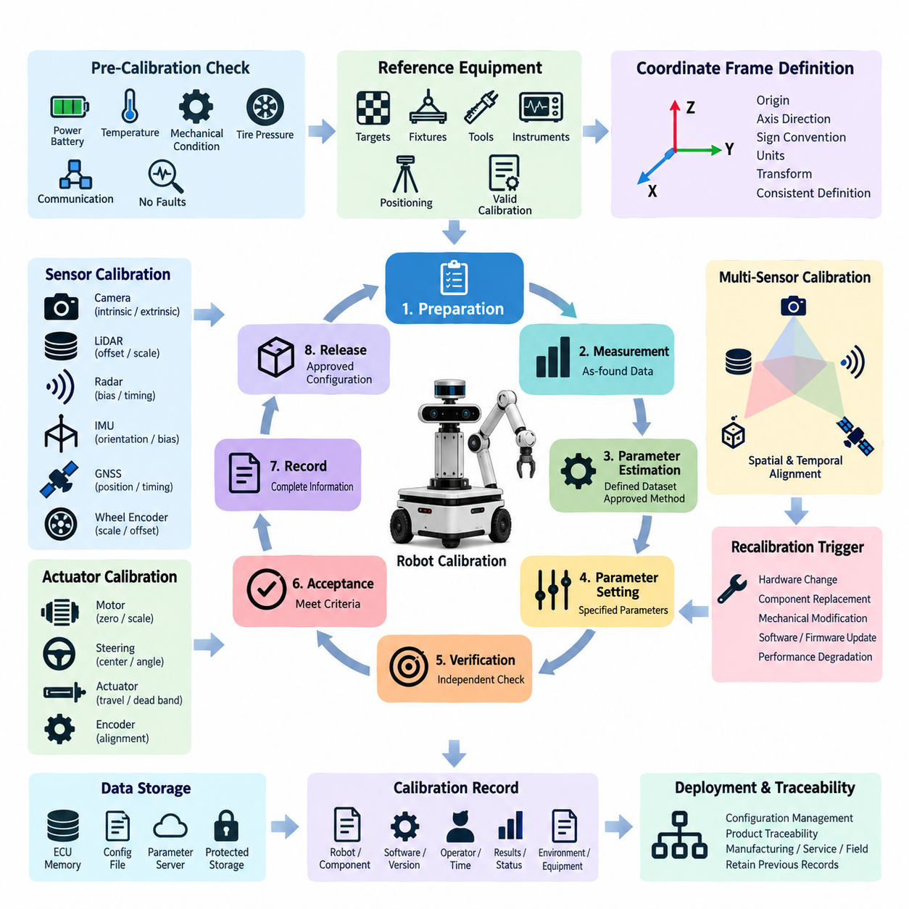
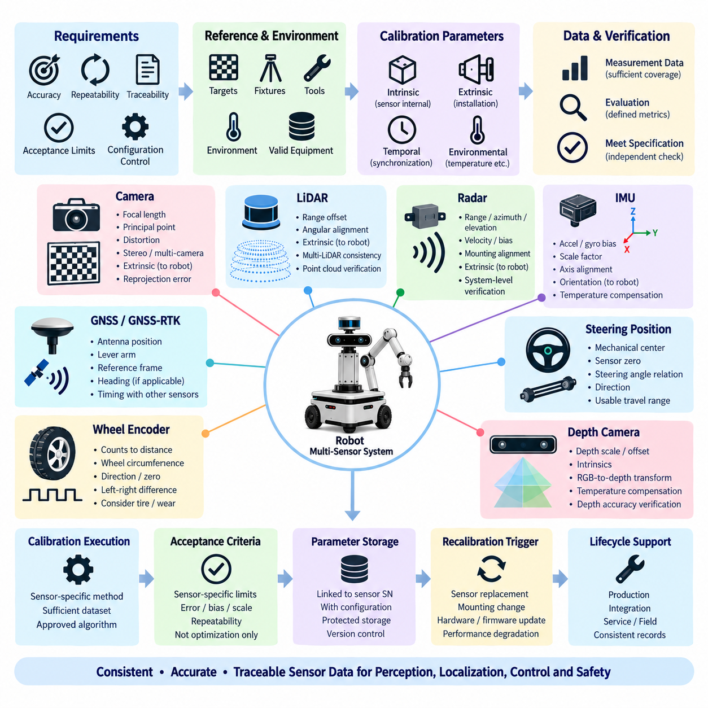
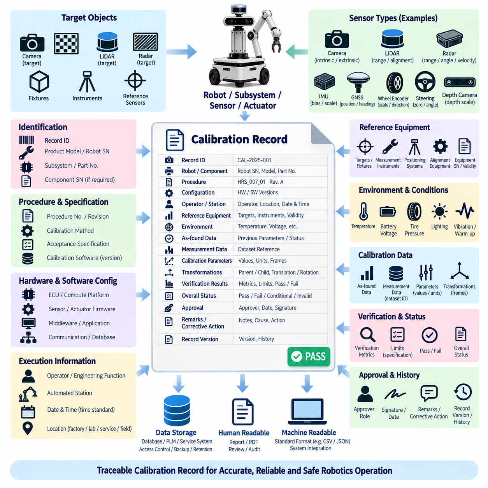
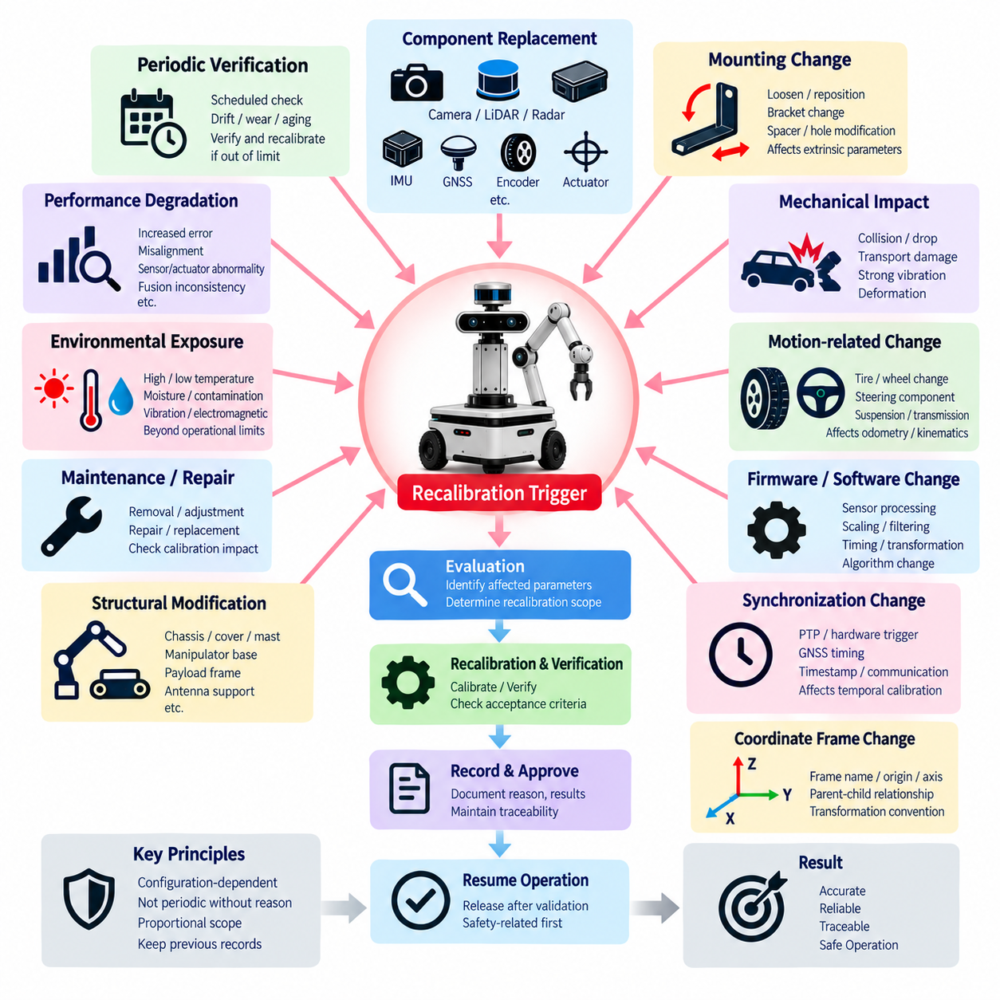
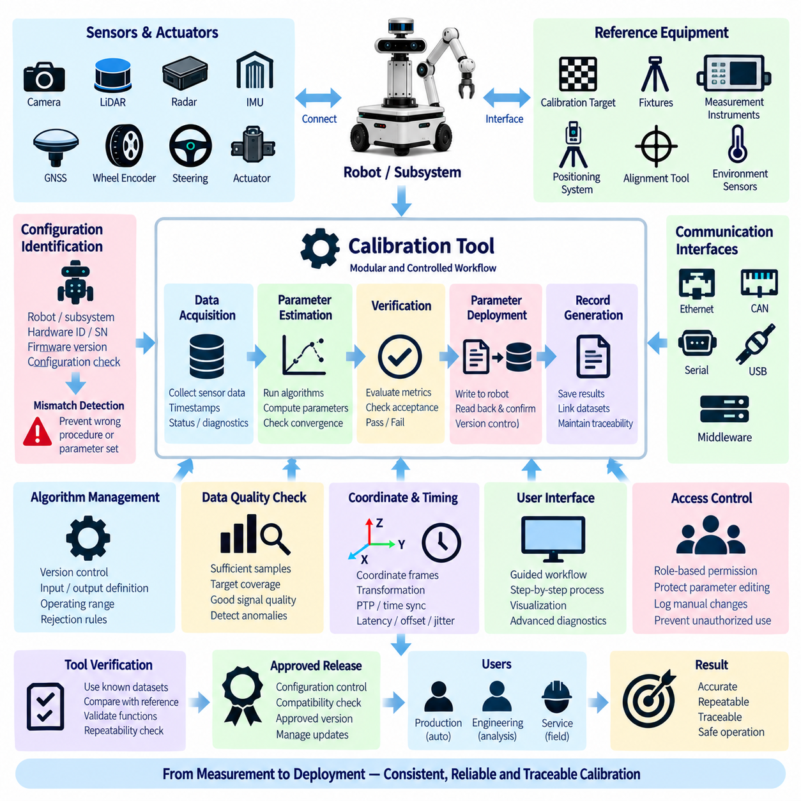

**Volume 22. Hills Robotics Engineering Standards**

# Chapter 07. HRS-007 Calibration

## 07.01. Calibration Procedure Standard

{width="7.268055555555556in" height="7.268055555555556in"}

교정(Calibration)은 센서 출력, 액추에이터(Actuator) 응답, 물리적 기준량(Physical Reference Quantities), 그리고 로봇에서 사용하는 좌표계(Coordinate Frames) 사이에 추적 가능한 관계를 설정하는 통제된 절차를 통해 수행되어야 한다. 이 절차는 준비, 기준 설정, 측정, 파라미터 추정(Parameter Estimation), 검증, 승인 및 기록 단계를 정의하여 생산, 서비스 및 현장 운영 전반에서 교정 결과가 반복 가능하도록 해야 한다.

교정을 시작하기 전에 로봇은 교정 대상 서브시스템(Subsystem)에 적합한 알려진 안정 상태로 배치되어야 한다. 결과에 영향을 줄 수 있는 경우 전원 공급, 배터리 상태, 온도, 기계적 하중, 타이어 공기압, 장착 상태 및 통신 상태를 확인해야 한다. 센서와 액추에이터는 규정된 예열 시간(Warm-up Period)을 완료해야 하며, 측정을 무효화할 수 있는 활성 진단 고장(Active Diagnostic Fault)이 존재하는 동안에는 교정을 진행해서는 안 된다.

교정 과정에서 사용하는 모든 기준 장비(Reference Equipment)는 요구되는 로봇 성능에 적합한 정확도와 분해능(Resolution)을 갖추어야 한다. 기준 타깃, 측정 지그(Measurement Fixtures), 정렬 도구, 토크 도구, 전기 계측기, 위치 측정 시스템 및 교정 소프트웨어는 사용 전에 식별되어야 한다. 추적성(Traceability)이 요구되는 경우 기준 장비는 유효한 교정 상태를 유지해야 하며, 승인된 교정 또는 검증 주기를 초과하여 사용해서는 안 된다.

교정 절차는 해당 서브시스템에 적용되는 좌표계(Coordinate Frames), 기준 원점(Reference Origins), 축 방향, 부호 규약(Sign Conventions), 단위 및 변환 관계(Transformation Relationships)를 명확하게 식별해야 한다. 기계 도면과 소프트웨어 구성은 일관된 정의를 사용하여 생산, 소프트웨어, 검증 또는 서비스 조직이 교정 파라미터를 서로 다르게 해석하지 않도록 해야 한다. 좌표계 식별자(Frame Identifiers)는 제품 수명주기(Product Lifecycle) 전체에 걸쳐 통제된 구성 항목(Configuration Items)으로 유지되어야 한다.

가능한 경우 새로운 교정 파라미터를 적용하기 전에 초기 측정값(Initial Measurements)을 수집해야 한다. 이러한 측정값은 발견 당시 상태(As-found Condition)를 확립하고 드리프트(Drift), 조립 오차, 부품 교체 영향 또는 기계적 손상의 증거를 제공한다. 엔지니어링 분석에 필요한 경우 원시 측정 데이터(Raw Measurement Data)를 보존해야 한다. 절차에서는 원시 관측값, 계산된 파라미터, 필터링된 값, 보상값(Compensation Terms), 그리고 로봇에 최종 기록되는 파라미터를 명확하게 구분해야 한다.

교정 알고리즘(Calibration Algorithms)은 정의된 데이터셋(Dataset)과 결정 대상 파라미터에 적합한 승인된 추정 방법(Estimation Method)을 사용해야 한다. 샘플 수, 동작 범위, 타깃 위치, 로봇 자세, 가진 조건(Excitation Conditions) 및 데이터 제외 기준은 대표성이 없는 단일 동작점에 기반한 결과가 생성되지 않도록 충분해야 한다. 자동화된 교정 절차는 불완전한 데이터셋, 수치적 불안정성(Numerical Instability), 과도한 잔차 오차(Residual Error) 및 물리적으로 비정상적인 파라미터 값을 감지해야 한다.

센서 교정(Sensor Calibration)은 센서 유형에 따라 오프셋(Offset), 스케일(Scale), 바이어스(Bias), 방향(Orientation), 내부 파라미터(Intrinsic Parameters), 외부 파라미터(Extrinsic Parameters), 시간 및 환경 보상 파라미터를 포함할 수 있다. 액추에이터 교정(Actuator Calibration)은 영점 위치, 기계적 중심, 조향각, 전류 또는 토크 관계, 이동 한계, 데드밴드(Dead Band), 엔코더 정렬(Encoder Alignment), 명령값 대비 실제 응답을 포함할 수 있다. 승인된 교정 작업에서는 해당 서브시스템 사양에 명시적으로 정의된 파라미터만 변경해야 한다.

다중 센서 시스템(Multi-sensor Systems)의 경우 교정은 카메라, 라이다(LiDAR), 레이더(Radar), 관성측정장치(IMU), 위성항법시스템(GNSS) 수신기, 휠 엔코더(Wheel Encoders) 및 기타 인지 또는 위치추정 장치 사이에서 공통 공간 및 시간 기준을 유지해야 한다. 외부 변환(Extrinsic Transformations)은 실제 장착된 기계적 구성과 일치해야 하며, 시간 파라미터는 구현된 동기화 아키텍처(Synchronization Architecture)와 일치해야 한다. 기하학적으로 정확하더라도 타임스탬프(Timestamp) 또는 동기화 오류로 인해 융합된 관측값이 일관되지 않는 경우 해당 결과를 승인해서는 안 된다.

교정 파라미터(Calibration Parameters)는 의도하지 않은 변경으로부터 보호되는 통제된 위치에 저장되어야 한다. 구현 방식은 전자제어장치(ECU)의 비휘발성 메모리(Nonvolatile Memory), 센서 메모리, 구성 파일(Configuration Files), 파라미터 서버(Parameter Servers) 또는 기타 승인된 저장소를 사용할 수 있으며, 각 파라미터 세트는 해당 하드웨어 및 소프트웨어 구성과 연계되어야 한다. 파라미터 이름, 단위, 데이터 형식, 범위, 기본값 및 버전 식별자는 릴리스된 인터페이스 정의(Interface Definition)와 일관성을 유지해야 한다.

가능한 경우 검증(Verification)은 파라미터 추정 단계와 독립적으로 수행되어야 한다. 교정된 시스템은 교정 해를 도출하는 데만 사용되지 않은 기준 위치, 궤적, 타깃 또는 동작 조건을 이용하여 평가해야 한다. 검증에서는 위치 오차, 각도 오차, 재투영 오차(Reprojection Error), 포인트 클라우드 정렬(Point-cloud Alignment), 조향 정확도, 바이어스 안정성(Bias Stability) 또는 액추에이터 추종 성능과 같이 로봇 기능과 직접 관련된 성능 항목을 평가해야 한다.

허용 기준(Acceptance Criteria)은 실행 전에 정의되어야 하며 측정 가능한 한계값으로 표현되어야 한다. 교정 결과는 요구되는 잔차, 반복성(Repeatability), 일관성 및 서브시스템 성능이 승인된 사양 범위 내에 있을 때만 승인되어야 한다. 소프트웨어가 최적화 성공을 보고했다는 사실만으로는 승인 근거가 될 수 없다. 물리적 시스템이 릴리스, 운용 또는 후속 검증에 적합한지는 엔지니어링 한계(Engineering Limits)를 기준으로 판단해야 한다.

교정에 실패한 경우 작업자는 허용 가능한 수치 결과가 나타날 때까지 파라미터를 반복적으로 덮어써서는 안 된다. 잘못된 설정, 느슨한 장착, 손상된 하드웨어, 부적절한 타깃, 환경 간섭, 통신 고장, 동기화 오류, 잘못된 소프트웨어 구성 또는 성능이 저하된 기준 장비 등의 원인을 조사해야 한다. 식별된 원인이 수정되거나 승인된 조치(Authorized Disposition)가 발행된 이후에만 재교정(Recalibration)을 시작해야 한다.

센서 위치, 액추에이터 기하구조, 장착 브래킷, 휠, 조향 부품, 서스펜션, 컴퓨팅 하드웨어, 동기화, 펌웨어, 교정 알고리즘 또는 좌표계 정의에 영향을 미치는 변경은 교정 영향(Calibration Impact)을 평가해야 한다. 교정된 부품을 교체한 경우 상호교환성(Interchangeability)이 입증되지 않는 한 이전 파라미터 세트를 자동으로 승계해서는 안 된다. 적용 가능한 재교정 트리거 규칙(Recalibration Trigger Rule)에 따라 필요한 교정 범위를 결정해야 한다.

생산 교정(Production Calibration)은 반복성, 통제된 사이클 타임(Cycle Time), 작업자 안내 및 잘못된 설정의 자동 감지를 고려하여 설계되어야 한다. 서비스 교정(Service Calibration)은 현장 도구 및 부품 교체 절차를 고려하면서도 동등한 기술적 유효성을 제공해야 한다. 엔지니어링 교정(Engineering Calibration)은 추가 진단 및 실험적 파라미터를 허용할 수 있지만, 해당 방법, 한계값, 소프트웨어 및 구성이 필요한 승인 절차를 완료하기 전에는 실험 결과를 양산 로봇에 적용해서는 안 된다.

완료된 모든 교정은 무엇을, 어떻게 교정했으며 합격 여부가 어떠했는지를 재구성할 수 있을 만큼 충분한 정보를 생성해야 한다. 기록에는 로봇 또는 서브시스템, 관련 부품 식별자, 소프트웨어 및 교정 버전, 절차 개정판(Procedure Revision), 기준 장비, 작업자 또는 자동화 스테이션, 실행 시간, 필요한 경우 환경 조건, 측정 결과, 승인 상태 및 승인된 파라미터 세트를 포함해야 한다.

교정 데이터(Calibration Data)는 제조, 통합, 검증, 배치, 유지보수 및 사고 조사 전반에서 구성 관리(Configuration Management)와 제품 추적성(Product Traceability)을 지원해야 한다. 릴리스된 파라미터 세트는 로봇에 실제 설치된 물리적 구성과 일치해야 한다. 파라미터 세트가 교체되는 경우 이전에 승인된 값과 관련 기록은 해당 보존 및 변경 관리(Change Control) 요구사항에 따라 복구 가능한 상태로 유지되어야 한다.

교정 프로세스(Calibration Process)는 단순한 파라미터 생성이 아니라 통제된 릴리스(Controlled Release)를 통해 종료되어야 한다. 로봇을 교정 완료 상태로 선언하기 전에 성공적인 검증, 기록 완료, 파라미터 저장, 구성 일관성 및 필요한 승인을 확인해야 한다. 이러한 접근 방식은 교정을 기계 조립, 전기 하드웨어, 센싱, 제어 소프트웨어, 인지(Perception), 위치추정(Localization) 및 시스템 수준의 로봇 성능을 연결하는 엔지니어링 품질 프로세스(Engineering Quality Process)로 기능하게 한다.

## 07.02. Sensor Calibration Spec

{width="7.268055555555556in" height="7.268055555555556in"}

센서 교정 사양(Sensor Calibration Specification)은 로봇 제품 전반에서 정확하고 반복 가능하며 추적 가능한 센서 출력을 확립하기 위한 기술적 요구사항을 정의해야 한다. 이 사양은 인지(Perception), 위치추정(Localization), 내비게이션(Navigation), 모션 제어(Motion Control), 안전(Safety) 및 모니터링(Monitoring) 기능을 지원하는 센서에 적용되며, 각 센서 종류에 필요한 파라미터, 기준 조건, 허용 한계, 검증 방법 및 구성 관리(Configuration Control)를 정의해야 한다.

각 센서는 측정 원리, 장착 형상, 인터페이스 특성 및 로봇 내 기능적 역할에 따라 교정되어야 한다. 교정 요구사항에서는 센서 자체에 내재된 파라미터와 플랫폼 장착으로 인해 생성되는 파라미터를 구분해야 한다. 따라서 내부 특성(Intrinsic Characteristics), 장착 관계, 타이밍 특성, 환경 보상(Environmental Compensation) 및 시스템 수준 변환(System-level Transformations)은 서로 연관되지만 독립적으로 관리되는 교정 요소로 통제되어야 한다.

카메라 교정(Camera Calibration)은 초점거리(Focal Length), 주점(Principal Point), 픽셀 기하구조(Pixel Geometry) 및 적용 가능한 렌즈 왜곡 계수(Lens Distortion Coefficients)를 포함하는 내부 파라미터(Intrinsic Parameters)를 정의해야 한다. 스테레오 또는 다중 카메라 구성에서는 상대 회전, 이동, 베이스라인(Baseline) 및 동기화 요구사항을 추가로 정의해야 한다. 교정에는 시야각, 거리 범위 및 방향 범위를 충분히 포함하는 승인된 타깃과 이미지 데이터셋을 사용하여 불충분하게 제약된 교정 결과가 발생하지 않도록 해야 한다.

카메라 외부 교정(Camera Extrinsic Calibration)은 카메라 좌표계와 지정된 로봇, 차체, 센서 또는 기준 좌표계 사이의 변환 관계를 설정해야 한다. 교정 과정에서는 명목상의 캐드(CAD) 형상만을 사용하는 것이 아니라 실제 장착 위치와 방향을 반영해야 한다. 결과 변환값을 인지 또는 센서 융합(Sensor Fusion) 기능에 적용하기 전에 재투영 오차(Reprojection Error)와 독립적인 기하학적 관측 결과를 규정된 허용 한계와 비교하여 평가해야 한다.

라이다 교정(LiDAR Calibration)은 장치에 적용 가능한 거리 오프셋(Range Offset), 각도 정렬, 좌표계 방향 및 설치에 따른 외부 파라미터를 다루어야 한다. 다중 라이다(Multi-LiDAR) 구성에서는 개별 센서와 공통 로봇 기준 좌표계 사이에 일관된 변환 관계를 설정해야 한다. 검증에서는 대표적인 거리와 관측 방향에 대해 알려진 표면, 타깃, 구조물 또는 중첩되는 포인트 클라우드(Point Clouds)를 이용하여 기하학적 정렬 상태를 평가해야 한다.

레이더 교정(Radar Calibration)은 레이더 기술과 사용 목적에 따라 적용 가능한 거리, 방위각(Azimuth), 고도각(Elevation), 속도, 바이어스(Bias) 및 장착 정렬 파라미터를 정의해야 한다. 교정 타깃과 시험 형상은 요구되는 파라미터를 충분히 관측할 수 있도록 구성되어야 한다. 레이더 정보를 카메라, 라이다 또는 차량 운동 데이터와 융합하는 경우 레이더 자체의 정확도만 독립적으로 평가하지 않고 공간 변환 및 타임스탬프(Timestamp) 관계를 시스템 수준에서 검증해야 한다.

관성측정장치 교정(IMU Calibration)은 선택된 장치에 필요한 가속도계 및 자이로스코프(Gyroscope)의 바이어스, 스케일 계수(Scale Factor), 축 정렬, 방향 및 기타 보상 파라미터를 다루어야 한다. 정지 상태 측정과 제어된 운동을 이용하여 영점 회전율(Zero-rate)과 중력 기준을 특성화할 수 있다. 온도가 센서 성능에 실질적인 영향을 미치는 경우 승인된 교정 데이터셋 또는 제조사 보상 모델은 로봇 사양에서 요구하는 운용 조건을 포함해야 한다.

장착된 관성측정장치(IMU)의 좌표계는 로봇 차체 좌표계 또는 기타 지정된 내비게이션 좌표계와 명확하게 연계되어야 한다. 잘못된 좌표계 해석은 수치적으로 정상으로 보이는 데이터를 생성하면서 위치추정 및 제어를 손상시킬 수 있으므로 축 방향과 부호 규약(Sign Conventions)을 물리적 방법과 소프트웨어 측정을 통해 검증해야 한다. 따라서 방향 교정(Orientation Calibration)은 파라미터 추정 이후 알려진 로봇 자세 또는 제어된 운동을 이용하여 검증해야 한다.

위성항법시스템 및 실시간 이동측위 교정(GNSS and GNSS-RTK Calibration)은 안테나 위치, 레버암(Lever-arm) 관계, 기준 좌표계 규약, 적용 가능한 경우 헤딩(Heading) 구성 및 다른 내비게이션 센서와의 시간 관계를 정의해야 한다. 안테나 좌표는 실제 장착 구성을 나타내야 하며 안테나 브래킷 또는 플랫폼 형상이 변경되면 갱신되어야 한다. 검증에서는 요구되는 위치추정 성능에 적합한 조건에서 위치 및 헤딩 동작을 적절한 기준값과 비교해야 한다.

휠 엔코더 교정(Wheel Encoder Calibration)은 엔코더 카운트와 실제 휠 움직임 사이의 관계를 설정해야 한다. 파라미터에는 유효 휠 둘레, 펄스 또는 카운트 스케일, 방향 규약, 영점 기준 및 필요한 경우 좌우 휠 차이가 포함될 수 있다. 치수 편차, 공기압, 마모, 기계적 전달비 및 조립 공차가 유효 오도메트리 스케일(Odometry Scale)에 영향을 미칠 수 있으므로 교정에서는 실제 장착된 타이어 또는 휠 상태를 고려해야 한다.

조향 관련 위치 센서(Steering-related Position Sensors)는 기계적 중심, 센서 영점, 조향각 관계, 방향 및 사용 가능한 이동 범위를 설정하도록 교정되어야 한다. 교정된 값은 단순한 전기적 중간점이 아니라 실제 조향 기하구조와 일치해야 한다. 검증에서는 여러 위치에서 명령값, 측정값 및 물리적 조향 상태를 비교하여 오프셋, 비선형 동작, 잘못된 방향 또는 기계적 비대칭을 감지할 수 있어야 한다.

깊이 카메라(Depth Camera) 및 기타 능동 거리 측정 센서(Active Ranging Sensors)는 해당 영상 및 거리 측정 원리에 따라 교정되어야 한다. 요구사항에는 카메라 내부 파라미터, 깊이 스케일(Depth Scale), 깊이 오프셋, RGB와 깊이 정보 사이의 변환 및 적용 가능한 온도 또는 거리 보상이 포함될 수 있다. 검증에서는 대표적인 거리와 시야 위치에 배치된 기준 물체 또는 표면을 사용하여 기하학적 정렬과 측정 깊이가 모두 요구되는 인지 정확도를 만족하는지 확인해야 한다.

다중 센서 외부 교정(Multi-sensor Extrinsic Calibration)은 인지 또는 위치추정에 참여하는 카메라, 라이다, 레이더, 관성측정장치, 위성항법시스템 안테나, 엔코더 및 기타 센서 사이에 일관된 공간 관계를 설정해야 한다. 변환 관계에는 승인된 부모 및 자식 좌표계(Parent and Child Frame) 정의를 사용하고 명확한 단위와 규약으로 저장해야 한다. 교정은 모호하거나 퇴화된 관측(Degenerate Observations)에 의존하지 않고 이동 및 회전을 추정할 수 있도록 충분한 기하학적 제약조건을 제공해야 한다.

시간 교정(Temporal Calibration)은 센서 융합 성능이 측정 타이밍에 실질적으로 의존하는 경우 요구되어야 한다. 사양에서는 센서 획득 시간(Sensor Acquisition Time), 하드웨어 타임스탬프(Hardware Timestamp), 통신 지연(Communication Latency), 소프트웨어 수신 시간 및 해당되는 경우 동기화된 시스템 시간을 구분해야 한다. 정밀 시간 프로토콜(PTP), 하드웨어 트리거(Hardware Triggering), 위성항법시스템 시간 또는 기타 동기화 메커니즘을 사용하는 센서는 대표적인 운용 조건에서 구현된 타이밍 아키텍처(Timing Architecture)를 기준으로 검증해야 한다.

교정 허용 기준(Calibration Acceptance Criteria)은 센서별로 정의되고 측정 가능해야 한다. 적절한 평가 지표에는 재투영 오차, 거리 오차, 각도 오차, 바이어스 크기, 스케일 오차, 포인트 클라우드 정합 오차(Point-cloud Registration Error), 위치 오차, 헤딩 오차, 시간 오프셋(Timing Offset), 반복성 또는 기능 성능과 직접적으로 관련된 기타 측정값이 포함될 수 있다. 최적화 루틴(Optimization Routine)의 성공만으로 센서 및 로봇 응용 분야에 정의된 엔지니어링 한계 검증을 대체해서는 안 된다.

교정 파라미터(Calibration Parameters)는 특정 센서, 장착 구성, 로봇 구성, 소프트웨어 릴리스 및 해당 절차 개정판과 연계되어야 한다. 파라미터는 승인된 구성 위치(Configuration Location)에 저장되고 통제되지 않은 변경으로부터 보호되어야 한다. 개별 특성이 상호교환 가능하지 않은 부품 사이에서 교정 데이터가 의도하지 않게 이전되는 것을 방지해야 하는 경우 센서 일련번호(Serial Number) 또는 이에 상응하는 식별 정보를 유지해야 한다.

센서 교체, 브래킷 이동, 기계적 충격, 구조물 수리, 측정 동작에 영향을 주는 펌웨어 변경, 동기화 변경 또는 감지된 성능 저하는 잠재적인 재교정 트리거(Recalibration Triggers)로 평가되어야 한다. 기술적 독립성이 입증된 경우 재교정 범위를 영향을 받은 센서 관계로 제한할 수 있지만, 그렇지 않은 경우 종속된 다중 센서 변환 관계와 시스템 수준의 위치추정 또는 인지 성능도 함께 검증해야 한다.

센서 교정 사양(Sensor Calibration Specification)은 일관된 방법과 기록을 통해 생산, 통합, 서비스 및 현장 유지보수를 지원해야 한다. 센서는 필요한 파라미터가 추정되고, 해당 한계값에 대해 독립적으로 검증되며, 구성 관리(Configuration Control) 하에 저장되고, 관련 교정 기록(Calibration Record)과 연결된 경우에만 교정 완료 상태로 간주해야 한다. 이를 통해 인지, 위치추정, 제어 및 안전 기능으로 입력되는 센서 데이터가 기하학적, 시간적 및 물리적으로 일관된 상태를 유지하도록 해야 한다.

## 07.03. Calibration Record Format

{width="7.268055555555556in" height="7.268055555555556in"}

교정 기록(Calibration Record)은 로봇, 서브시스템(Subsystem), 센서 또는 액추에이터(Actuator)에 수행된 모든 교정 활동을 통제되고 추적 가능한 형태로 나타내야 한다. 그 목적은 어떤 장비가 교정되었는지, 어떤 절차와 구성이 사용되었는지, 어떤 파라미터가 생성되었는지, 성능이 어떻게 검증되었는지, 그리고 교정된 시스템이 해당 엔지니어링 허용 기준(Engineering Acceptance Criteria)을 충족했는지를 판단할 수 있는 충분한 기술적 증거를 보존하는 것이다.

각 기록에는 해당 로봇, 서브시스템 또는 구성품과 연결되는 고유한 교정 기록 식별자(Calibration Record Identifier)가 포함되어야 한다. 식별 정보에는 제품 모델, 로봇 일련번호, 서브시스템 명칭, 구성품 부품번호 및 개별 추적성이 필요한 경우 구성품 일련번호가 포함되어야 한다. 다중 센서 교정(Multi-sensor Calibration)의 경우 결과 교정 파라미터에 공간적, 시간적 또는 기능적 관계가 반영되는 모든 참여 센서를 기록에서 식별해야 한다.

기록에는 실행 중 사용된 교정 절차(Calibration Procedure)와 사양(Specification)을 식별해야 한다. 이후 교정을 재현하거나 조사할 수 있도록 절차 문서 번호, 개정판, 교정 방법, 적용 가능한 허용 사양 및 관련 엔지니어링 구성을 기록해야 한다. 자동 교정 소프트웨어(Automated Calibration Software)를 사용하는 경우 소프트웨어 이름, 버전, 알고리즘 개정판, 구성 파일(Configuration File) 및 적용 가능한 파라미터 패키지도 기록해야 한다.

하드웨어 및 소프트웨어 구성 정보(Configuration Information)는 교정 당시의 실제 시스템 상태를 나타내야 한다. 결과에 영향을 줄 수 있는 경우 관련 전자제어장치(ECU), 컴퓨팅 플랫폼, 센서 펌웨어, 액추에이터 펌웨어, 미들웨어(Middleware), 응용 소프트웨어, 통신 구성 및 교정 데이터베이스 버전을 기록해야 한다. 구성 정보는 유효한 교정 데이터와 다른 제품 구성에서 생성된 파라미터를 구별할 수 있을 만큼 충분히 상세해야 한다.

교정 기록에는 절차를 실행한 작업자, 자동화 스테이션(Automated Station) 또는 담당 엔지니어링 조직을 식별해야 한다. 실행 날짜와 시간은 승인된 시간 규약(Time Convention)을 사용하여 기록해야 하며, 필요한 경우 제조, 실험실, 서비스 또는 현장 위치도 함께 기록해야 한다. 자동화 스테이션의 경우 스테이션 식별 정보와 소프트웨어 개정판을 통해 작업자 중심의 교정 프로세스와 동등한 추적성을 제공해야 한다.

교정 과정에서 사용된 기준 장비(Reference Equipment)의 정확도가 결과의 유효성에 영향을 미치는 경우 이를 문서화해야 한다. 기록에는 관련 타깃, 지그(Fixture), 측정 장비, 위치 측정 시스템, 정렬 장비, 기준 센서 및 동기화 장치를 식별해야 한다. 승인되고 추적 가능한 기준을 사용하여 측정했음을 입증할 필요가 있는 경우 장비 식별번호 또는 일련번호와 교정 유효 상태(Calibration Validity Status)를 보존해야 한다.

환경 및 운용 조건(Environmental and Operating Conditions)이 교정 결과에 실질적인 영향을 미칠 수 있는 경우 이를 기록해야 한다. 서브시스템에 따라 주변 온도, 센서 온도, 배터리 전압, 타이어 공기압, 기계적 하중, 노면 상태, 조명, 위성항법시스템(GNSS) 수신 상태, 진동 상태 또는 예열 시간 등이 포함될 수 있다. 기록 형식은 불필요한 데이터를 배제하면서도 결과를 해석하거나 재현하는 데 필요한 조건은 유지하도록 구성해야 한다.

절차에서 드리프트(Drift) 또는 이전 교정 대비 변화를 평가하도록 요구하는 경우 발견 당시 상태(As-found Condition)를 보존해야 한다. 새로운 파라미터를 적용하기 전에 기존 오프셋, 바이어스(Bias), 변환 관계, 정렬 오차, 진단 상태 또는 기타 관련 측정값을 기록해야 한다. 이를 통해 엔지니어링 조직은 정상적인 교정 조정과 구성품 성능 저하, 장착 위치 변화, 기계적 손상 또는 구성 오류를 구분할 수 있다.

기술적 검증 또는 향후 조사를 위해 필요한 경우 원시 또는 중간 측정 데이터(Raw or Intermediate Measurement Data)를 참조할 수 있어야 한다. 대용량 이미지, 포인트 클라우드(Point Cloud), 파형 또는 로그 데이터셋이 승인된 저장소에 유지되는 경우 기록 자체에 이를 중복 저장할 필요는 없지만, 명확한 데이터셋 식별자 또는 저장 위치 참조를 제공해야 한다. 데이터 관계를 통해 교정 결과를 파라미터 추정 및 검증에 사용된 측정 데이터까지 추적할 수 있어야 한다.

결과 교정 파라미터(Calibration Parameters)는 명확한 파라미터 이름, 값, 단위, 좌표계 규약(Coordinate-frame Conventions) 및 적용 가능한 정밀도와 함께 기록해야 한다. 파라미터에는 센서 바이어스, 스케일 계수, 오프셋, 방향, 내부 계수(Intrinsic Coefficients), 외부 변환(Extrinsic Transformations), 시간 오프셋, 엔코더 스케일, 조향 중심, 액추에이터 영점 또는 기타 승인된 값이 포함될 수 있다. 기록에서는 추정된 값과 기본값, 상속값, 수동 입력값 또는 이후 수정된 파라미터를 구분해야 한다.

좌표 변환 기록(Coordinate Transformation Records)은 해당 부모 좌표계(Parent Frame)와 자식 좌표계(Child Frame)를 이동 및 회전 표현과 함께 식별해야 한다. 단위, 축 규약, 회전 규약 및 변환 방향은 모호하지 않아야 한다. 다중 센서 시스템에서는 기록된 변환 관계가 릴리스된 로봇 좌표계 계층구조(Frame Hierarchy)와 일치하여 이후 분석에서 카메라, 라이다(LiDAR), 레이더(Radar), 관성측정장치(IMU), 위성항법시스템 및 기타 센서 데이터를 일관되게 재구성할 수 있어야 한다.

검증 결과(Verification Results)는 생성된 교정 파라미터와 별도로 문서화해야 한다. 기록에는 적용 가능한 검증 지표, 측정 결과, 허용 한계 및 합격 또는 불합격 상태를 포함해야 한다. 센서 또는 액추에이터에 따라 평가 지표에는 재투영 오차(Reprojection Error), 거리 오차, 각도 오차, 바이어스, 스케일 오차, 포인트 클라우드 정렬(Point-cloud Alignment), 위치 오차, 헤딩 오차, 시간 오프셋, 조향 정확도, 반복성 또는 액추에이터 추종 성능이 포함될 수 있다.

전체 교정 상태(Overall Calibration Status)는 해당 품질 프로세스에 따라 합격(Pass), 불합격(Fail), 조건부 승인(Conditional Approval) 또는 무효(Invalid)와 같은 통제된 결과값을 사용해야 한다. 모든 필수 허용 기준을 만족한 경우에만 합격을 부여해야 한다. 실패하거나 완료되지 않은 교정은 이후 시도에 의해 덮어쓰지 않고 기록에 유지하여 반복 교정, 문제 해결, 시정 조치(Corrective Action) 및 최종 처리 결과의 이력을 재구성할 수 있도록 해야 한다.

교정에 실패한 경우 가능한 범위에서 기록에는 확인된 원인과 시정 조치에 대한 참조를 제공해야 한다. 관련 정보에는 잘못된 지그 설정, 손상된 구성품, 느슨한 장착, 동기화 고장, 부적절한 환경 조건, 통신 오류 또는 소프트웨어 구성 문제가 포함될 수 있다. 이후 생성되는 재교정 기록(Recalibration Record)은 가능한 경우 이전 실패 기록을 참조하여 문제 감지, 수정 및 검증 사이의 연속성을 보존해야 한다.

공식 승인이 필요한 경우 승인 정보(Approval Information)에는 교정 결과의 릴리스를 담당하는 개인, 역할, 자동화된 승인 주체 또는 품질 조직을 식별해야 한다. 전자 승인(Electronic Approval)은 통제된 수동 서명과 동등한 추적성을 제공해야 한다. 승인 상태는 정확한 교정 파라미터 세트와 검증 결과에 연결되어야 하며, 이후 파라미터가 변경되었음에도 이전 구성에 대한 승인이 의도하지 않게 유지되는 상황을 방지해야 한다.

교정 기록은 제품 수명주기(Product Lifecycle)에 적합한 접근 통제, 백업, 보존 및 변경 보호 기능을 갖춘 승인된 저장소에 저장되어야 한다. 기록은 제조 데이터베이스, 구성 관리 시스템(Configuration-management Systems), 서비스 시스템 또는 플릿 플랫폼(Fleet Platforms)과 연계될 수 있지만 권위 있는 원본(Authoritative Source)을 식별할 수 있어야 한다. 승인 이후의 수정은 통제되어야 하며 엔지니어링, 품질, 안전 또는 규제 프로세스에서 요구하는 경우 이전 승인 버전을 복구할 수 있어야 한다.

기록 형식(Record Format)은 사람이 검토하는 과정과 자동화된 처리 모두를 지원해야 한다. 필드 이름, 단위, 타임스탬프(Timestamps), 식별자, 상태값 및 파라미터 정의는 표준화된 표현을 사용하여 생산 도구, 교정 소프트웨어, 엔지니어링 분석, 서비스 애플리케이션 및 플릿 시스템이 수동 재해석 없이 정보를 교환할 수 있도록 해야 한다. 엔지니어링 검토 또는 감사 가능성(Auditability)이 필요한 경우 기계 판독 가능 기록(Machine-readable Records)은 사람이 읽을 수 있는 요약 정보와 연결되어야 한다.

교정 이력(Calibration History)은 제조, 통합, 검증, 배치, 유지보수, 구성품 교체 및 현장 운용 전체에 걸쳐 실제 제품과 연계된 상태로 유지되어야 한다. 식별, 구성, 절차, 측정값, 파라미터, 검증, 허용 판정, 승인 및 재교정 이력을 통제된 기록 구조 안에서 연결함으로써 교정 기록은 로봇의 센싱 및 액추에이션 성능이 릴리스된 시스템 구성과 일치한다는 것을 입증하는 데 필요한 추적성(Traceability)을 제공한다.

## 07.04. Recalibration Trigger Rule

{width="7.268055555555556in" height="7.268055555555556in"}

재교정(Recalibration)은 센서 또는 액추에이터(Actuator)의 출력과 물리적 기준(Physical Reference) 사이의 관계를 무효화할 수 있는 변경, 사건 또는 감지된 상태가 발생할 때마다 시작되어야 한다. 재교정 트리거 규칙(Recalibration Trigger Rule)은 제조, 통합, 검증, 배치, 서비스 및 현장 운용의 전체 과정에 적용되어야 한다. 따라서 재교정은 기술적 근거 없이 주기적으로 수행하는 조정이 아니라 구성 의존적인 엔지니어링 조치(Configuration-dependent Engineering Action)로 관리되어야 한다.

교체된 장치가 개별적인 교정 특성을 가지거나 기존에 설정된 공간적, 전기적 또는 기계적 관계에 영향을 미치는 경우 구성품 교체(Component Replacement)는 주요 재교정 트리거로 간주해야 한다. 카메라, 라이다(LiDAR), 레이더(Radar), 관성측정장치(IMU), 위성항법시스템(GNSS) 안테나, 엔코더, 조향 센서, 액추에이터 또는 유사 장치를 교체한 경우 이전 파라미터를 재사용하기 전에 평가해야 한다. 파라미터 승계(Parameter Inheritance)는 상호교환성(Interchangeability)이 입증되고 공식적으로 승인된 경우에만 허용해야 한다.

센서 장착 브래킷(Mounting Bracket)의 이동 또는 제거는 영향을 받은 장착 형상에 의존하는 모든 교정 파라미터에 대한 평가를 유발해야 한다. 체결부 풀림, 센서 위치 조정, 브래킷 교체, 장착 홀 변경, 스페이서 추가 또는 기계적 인터페이스 변경은 로봇 기준 좌표계에 대한 이동 또는 회전 관계를 변화시킬 수 있다. 그 결과 발생하는 각도 또는 위치 오차가 해당 인지 또는 위치추정 허용오차를 초과할 수 있는 경우 작은 변화라도 중요하게 취급해야 한다.

기계적 충격(Mechanical Impact)이 센서 정렬, 액추에이터 형상, 섀시 기준 치수 또는 구조적 관계를 변화시킬 가능성이 있는 경우 재교정 트리거로 처리해야 한다. 충돌, 낙하, 운송 중 손상, 휠 충격, 과도한 진동 또는 장착 구조의 변형이 발생하면 검사 및 교정 평가(Calibration Assessment)를 수행해야 한다. 검사를 통해 기존의 교정 관계가 승인된 허용오차 내에서 유지되고 있음을 입증할 수 없는 경우 재교정을 수행해야 한다.

휠, 타이어, 조향 구성품, 서스펜션, 변속장치 또는 기타 운동 관련 하드웨어(Motion-related Hardware)의 변경이 오도메트리(Odometry) 또는 차량 운동학(Vehicle Kinematics)에 영향을 미치는 경우 재교정을 수행해야 한다. 교체 또는 변경으로 타이어 직경, 공기압 사양, 기어비, 엔코더 관계, 조향 중심, 조향각 매핑 또는 기계적 이동 범위가 달라질 수 있다. 따라서 운용 릴리스 전에 영향을 받는 휠, 엔코더, 조향 및 모션 제어 파라미터를 식별하고 검증해야 한다.

펌웨어 또는 소프트웨어 변경이 센서 처리, 스케일링, 필터링, 타이밍, 좌표 변환, 액추에이터 해석 또는 교정 알고리즘에 영향을 미치는 경우 재교정 평가를 수행해야 한다. 단순한 버전 변경 자체가 반드시 물리적 재교정을 요구하는 것은 아니지만, 엔지니어링 릴리스 프로세스(Engineering Release Process)를 통해 측정 동작의 변경 여부를 판단해야 한다. 기존 교정 파라미터와의 호환성을 입증할 수 없는 경우 재교정 및 후속 검증을 수행해야 한다.

센서 융합(Sensor Fusion)이 시간 정렬(Temporal Alignment)에 의존하는 경우 동기화 아키텍처(Synchronization Architecture)의 변경은 재교정을 유발해야 한다. 정밀 시간 프로토콜(PTP) 구성, 하드웨어 트리거링(Hardware Triggering), 위성항법시스템 타이밍, 타임스탬프 생성, 통신 경로, 클록 소스, 미들웨어 또는 데이터 획득 파이프라인의 변경은 기계적 장착 상태가 변하지 않더라도 시간 오프셋을 발생시킬 수 있다. 이러한 변경 이후 기존 시간 관계의 유효성을 입증할 수 없는 경우 시간 교정(Temporal Calibration)을 다시 수행해야 한다.

좌표계 변경(Coordinate-frame Changes)은 교정에 영향을 미치는 구성 변경(Configuration Changes)으로 처리해야 한다. 좌표계 이름, 원점, 축 방향, 부모-자식 관계(Parent-child Relationships), 변환 규약 또는 로봇 기준 정의가 변경되면 이에 종속되는 모든 교정 파라미터를 검토해야 한다. 연관된 좌표계 정의가 변경된 경우 동일한 수치가 서로 다른 물리적 관계를 의미할 수 있으므로 기존 수치 변환값을 자동으로 재사용해서는 안 된다.

로봇의 구조적 변경(Structural Modification)이 센서 또는 액추에이터의 기준 형상에 영향을 미칠 가능성이 있는 경우 재교정 평가를 수행해야 한다. 섀시 구조, 센서를 장착한 커버, 마스트(Mast), 매니퓰레이터 베이스(Manipulator Base), 페이로드 프레임(Payload Frame), 안테나 지지대, 서스펜션 장착 지점 또는 기타 구조적 인터페이스의 변경은 여러 변환 관계에 영향을 전파할 수 있다. 기하학적으로 변경되지 않았음을 입증할 수 없는 모든 종속 관계를 재교정 범위에 포함해야 한다.

하드웨어 변경이 보고되지 않았더라도 운용 중 감지된 성능 저하(Performance Degradation)는 재교정 트리거로 간주해야 한다. 지표에는 증가하는 위치추정 오차, 일관되지 않은 포인트 클라우드 정렬(Point-cloud Alignment), 카메라 재투영 편차(Reprojection Deviation), 관성측정장치 바이어스 드리프트(Bias Drift), 위성항법시스템 헤딩 불일치, 오도메트리 스케일 오차, 조향 오프셋, 액추에이터 추종 오차 또는 반복적인 센서 융합 불일치 등이 포함될 수 있다. 진단 임계값(Diagnostic Thresholds)을 통해 정상적인 운용 편차와 엔지니어링 평가가 필요한 상태를 구분해야 한다.

장기적인 드리프트, 마모, 열 사이클링(Thermal Cycling), 진동 또는 환경적 노화(Environmental Aging)의 영향을 받기 쉬운 센서나 시스템에는 주기적 검증(Periodic Verification)을 지정할 수 있다. 검증 주기가 설정되어 있다고 해서 자동으로 파라미터를 교체해야 하는 것은 아니며, 먼저 기존 교정 상태를 해당 허용 기준에 따라 확인해야 한다. 검증 결과 현재 파라미터 세트가 요구되는 정확도, 반복성 또는 시스템 수준 성능을 더 이상 제공하지 못하는 경우 재교정을 수행해야 한다.

환경 노출(Environmental Exposure)이 센서 특성 또는 기계적 정렬을 영구적으로 변화시킬 가능성이 있는 경우 교정 평가를 수행해야 한다. 과도한 온도, 열충격(Thermal Shock), 수분 침투, 오염, 심한 진동, 전자기적 사건(Electromagnetic Events) 또는 규정된 환경 한계를 초과한 운용은 교정된 동작에 영향을 미칠 수 있다. 중대한 환경 노출 이후에는 시스템을 검사하고 검증해야 하며 승인된 한계의 지속적인 충족을 입증할 수 없는 경우 재교정을 수행해야 한다.

유지보수 및 수리 활동(Maintenance and Repair Activities)에서는 로봇을 서비스 상태로 복귀시키기 전에 명시적인 교정 영향 평가(Calibration-impact Assessment)를 수행해야 한다. 교정된 구성품을 분리, 제거, 조정, 수리 또는 교체하는 유지보수 작업에서는 영향을 받는 교정 관계를 식별해야 한다. 서비스 절차에서는 검증만으로 충분한지 또는 전체 재교정이 필요한지를 규정하여 구성이 변경된 작업 이후 기술자가 이전 파라미터에 그대로 의존하는 것을 방지해야 한다.

재교정 범위(Recalibration Scope)는 변경 사항의 기술적 종속성에 비례해야 한다. 다른 파라미터와의 독립성이 입증된 경우 국부적인 구성품 변경에 대해서는 영향을 받은 센서 또는 액추에이터만 교정할 수 있다. 공통 기준 좌표계, 다중 센서 형상, 동기화, 로봇 운동학 또는 공유 장착 구조와 관련된 변경은 여러 서브시스템의 재교정을 요구할 수 있으며, 이후 인지, 위치추정, 내비게이션 또는 제어 성능에 대한 시스템 수준 검증(System-level Verification)을 수행해야 한다.

재교정은 이전 교정 상태에 대한 증거를 삭제해서는 안 된다. 기존 파라미터 세트, 관련 교정 기록(Calibration Record), 트리거 사건, 영향을 받은 구성 및 발견 당시 검증 결과(As-found Verification Results)는 해당 기록 관리 요구사항에 따라 보존해야 한다. 새로운 교정 기록에는 재교정 사유를 식별하고 이전 구성, 트리거 사건, 시정 조치(Corrective Action), 새로운 파라미터 및 검증 결과 사이의 추적성(Traceability)을 확립해야 한다.

트리거 사건이 발생한 경우 아직 유효성이 입증되지 않은 교정 상태에 운용이 의존한다면 해당 로봇 또는 영향을 받는 기능의 릴리스를 제한해야 한다. 엔지니어링 또는 서비스 담당자는 정상 상태를 복구하기 전에 필요한 검사, 검증 또는 재교정을 수행해야 한다. 교정 불확실성이 장애물 감지, 운동 제한, 비상 동작 또는 기타 보호 기능에 영향을 줄 수 있는 경우 안전 관련 센서와 액추에이터(Safety-related Sensors and Actuators)를 우선적으로 처리해야 한다.

재교정 결정(Recalibration Decision)은 영향을 받은 교정 관계가 릴리스된 하드웨어 및 소프트웨어 구성에서 유효하다는 문서화된 증거를 통해 종료되어야 한다. 모든 요구 한계가 계속 충족되는 경우 파라미터를 변경하지 않는 검증만으로 트리거를 종료할 수 있다. 재교정을 수행한 경우 새로운 파라미터 세트는 해당 허용 기준을 통과하고 구성 관리(Configuration Control) 하에 저장되며, 승인된 교정 기록과 연결된 이후에만 로봇을 정상 운용 상태로 복귀시켜야 한다.

## 07.05. Calibration Tool Standard

{width="7.268055555555556in" height="7.268055555555556in"}

교정 도구(Calibration Tools)는 로봇 교정 활동을 실행, 검증, 기록 및 유지관리하기 위한 통제된 기술 환경을 제공해야 한다. 도구 세트(Toolset)는 통제되지 않은 파라미터 변경을 유발하지 않으면서 해당 센서, 액추에이터(Actuator), 좌표계(Coordinate Frames), 시간 관계(Timing Relationships) 및 시스템 구성을 지원해야 한다. 도구 설계는 측정 무결성(Measurement Integrity), 반복성, 추적성, 구성 일관성 및 잘못된 조작에 대한 보호를 우선해야 한다.

교정 도구 아키텍처(Calibration Tool Architecture)는 데이터 획득(Data Acquisition), 파라미터 추정(Parameter Estimation), 파라미터 배포(Parameter Deployment), 검증 및 기록 생성을 식별 가능한 기능으로 분리해야 한다. 이러한 기능은 하나의 애플리케이션에 통합될 수 있지만 논리적 경계는 명확하게 유지되어야 한다. 계산된 교정 결과는 필요한 검증 및 릴리스 조건이 성공적으로 완료되지 않는 한 자동으로 승인된 로봇 파라미터가 되어서는 안 된다.

교정 소프트웨어(Calibration Software)는 교정 데이터를 변경하기 전에 연결된 로봇, 서브시스템(Subsystem), 센서 또는 액추에이터를 식별해야 한다. 가능한 경우 하드웨어 식별자, 일련번호, 인터페이스 주소, 펌웨어 버전 및 로봇 구성 정보를 자동으로 읽어야 한다. 도구는 특정 하드웨어 구성을 위한 교정 절차 또는 파라미터 세트가 다른 구성에 잘못 적용될 수 있는 구성 불일치(Configuration Mismatch)를 감지해야 한다.

도구는 카메라, 라이다(LiDAR), 레이더(Radar), 관성측정장치(IMU), 위성항법시스템(GNSS) 수신기, 휠 엔코더, 조향 센서, 액추에이터 및 기타 지원 장치에 대한 통제된 인터페이스를 제공해야 한다. 통신 인터페이스에는 이더넷(Ethernet), CAN, 직렬 통신(Serial Communication), USB 또는 승인된 미들웨어 인터페이스가 포함될 수 있다. 데이터 획득 기능은 수집된 데이터가 교정에 적합한지를 판단하는 데 필요한 측정값, 타임스탬프(Timestamps), 상태 정보 및 진단 지표를 보존해야 한다.

공간 교정(Spatial Calibration)을 지원하는 교정 도구는 명확하게 정의된 좌표계, 단위, 축 방향, 변환 규약 및 부모-자식 관계(Parent-child Relationships)를 사용해야 한다. 검증을 지원하기 위해 센서 관측값, 기준 타깃, 포인트 클라우드(Point Clouds), 이미지 투영 또는 좌표계 관계를 시각화할 수 있다. 소프트웨어는 모호한 변환 정의를 방지하고 이동(Translation), 회전(Rotation), 내부 파라미터(Intrinsic Parameters) 및 외부 파라미터(Extrinsic Parameters)를 명확하게 구분해야 한다.

시간 교정(Temporal Calibration)에 사용되는 도구는 구현된 동기화 아키텍처(Synchronization Architecture)를 지원하고 데이터 획득 시간과 통신 또는 소프트웨어 수신 시간을 구분해야 한다. 해당되는 경우 도구는 정밀 시간 프로토콜(PTP), 하드웨어 트리거(Hardware Triggers), 위성항법시스템 시간, 장치 타임스탬프 또는 동기화된 시스템 클록을 지원해야 한다. 시간 분석은 센서 융합 교정을 무효화할 수 있는 오프셋, 지연, 지터(Jitter), 측정 누락 또는 동기화 불안정성을 식별할 수 있는 충분한 정보를 제공해야 한다.

기준 타깃, 지그(Fixtures), 측정 계측기, 위치 측정 시스템, 정렬 장치 및 기타 물리적 교정 장비는 해당 절차와 정의된 인터페이스를 가져야 한다. 도구 구성에서는 사용 중인 기준 장비(Reference Equipment)의 유형과 관련 특성을 식별해야 한다. 측정 추적성이 요구되는 경우 승인된 교정 결과를 릴리스하기 전에 장비 식별 정보 및 교정 유효성(Calibration Validity)을 기록하거나 참조할 수 있어야 한다.

교정 알고리즘(Calibration Algorithms)은 통제되고 버전 관리되는 기능으로 구현되어야 한다. 도구는 알고리즘 버전, 필요한 입력 데이터, 파라미터 정의, 동작 범위, 초기화 조건, 수렴 기준(Convergence Criteria) 및 적용 가능한 데이터 제외 규칙을 식별해야 한다. 수치적 수렴만으로 교정 성공을 판단해서는 안 된다. 파라미터를 승인하기 전에 잔차 오차(Residual Errors), 물리적 타당성, 데이터셋 품질 및 독립적인 검증 지표를 평가해야 한다.

자동화된 데이터 품질 검사(Automated Data-quality Checks)는 신뢰할 수 없는 교정 결과를 생성할 수 있는 상태를 식별해야 한다. 예를 들어 불충분한 샘플, 부족한 타깃 범위, 제한적인 운동 가진(Motion Excitation), 흐릿한 이미지, 낮은 특징점 검출 성능, 부족한 포인트 클라우드 중첩, 불안정한 위성항법시스템 상태, 과도한 진동, 통신 손실, 타임스탬프 불일치 또는 센서 진단 고장 등이 포함된다. 필수 입력 품질 요구사항이 충족되지 않은 경우 도구는 파라미터 릴리스를 차단하거나 명확하게 경고해야 한다.

교정 사용자 인터페이스(Calibration User Interface)는 엔지니어링 파라미터에 대한 불필요한 해석 없이 작업자가 승인된 순서를 따를 수 있도록 안내해야 한다. 필요한 준비, 센서 예열, 타깃 배치, 로봇 자세, 이동 순서, 데이터 수집, 계산, 검증 및 완료 단계가 일관되게 제시되어야 한다. 작업자 안내 기능은 단계 누락 가능성을 줄이면서도 필요한 경우 권한이 부여된 엔지니어링 사용자가 고급 진단 정보에 접근할 수 있도록 해야 한다.

파라미터 편집(Parameter Editing)은 사용자 역할과 교정 상태에 따라 보호되어야 한다. 생산 및 서비스 작업자는 일반적으로 수치 파라미터를 수동으로 변경하기보다 승인된 자동화 또는 안내 기반 워크플로(Workflow)를 사용해야 한다. 엔지니어링 권한에서는 개발 또는 조사를 위한 통제된 수동 조정을 허용할 수 있지만 수동으로 변경된 값은 결과 기록에 식별되어야 한다. 적절한 접근 통제 메커니즘(Access-control Mechanisms)을 통해 승인되지 않은 파라미터 편집을 방지해야 한다.

교정 파라미터(Calibration Parameters)는 승인된 저장 위치에만 기록되어야 하며 배포 이후 검증되어야 한다. 도구는 작업을 완료하기 전에 파라미터 이름, 단위, 데이터 형식, 범위, 대상 하드웨어, 구성 버전 및 기록 상태를 확인해야 한다. 기술적으로 가능한 경우 파라미터 세트를 로봇 또는 장치에서 다시 읽어 의도한 값과 비교함으로써 불완전한 기록, 데이터 손상 또는 잘못된 대상 선택을 감지해야 한다.

검증 기능(Verification Functions)은 사전에 정의된 허용 기준(Acceptance Criteria)에 따라 교정된 성능을 평가해야 한다. 서브시스템에 따라 도구는 재투영 오차(Reprojection Error), 거리 오차, 각도 오차, 포인트 클라우드 정렬, 바이어스(Bias), 스케일 오차, 위치 오차, 헤딩 오차, 시간 오프셋, 조향 정확도, 반복성 또는 액추에이터 추종 오차를 계산할 수 있다. 정상적인 실행 중 작업자가 합격 또는 불합격 임계값을 임의로 변경할 수 없도록 허용 한계는 구성 관리되어야 한다.

도구는 해당 기록 형식(Record Format)에서 요구하는 정보를 포함하는 교정 기록(Calibration Record)을 생성해야 한다. 여기에는 식별 정보, 절차 개정판, 소프트웨어 및 알고리즘 버전, 관련 구성, 작업자 또는 스테이션, 기준 장비, 실행 시간, 측정 데이터 참조, 생성된 파라미터, 검증 결과, 허용 상태 및 필요한 경우 승인 정보가 포함되어야 한다. 실패하거나 완료되지 않은 시도는 성공적으로 릴리스된 교정 결과와 명확하게 구분되어야 한다.

교정 데이터 및 로그(Calibration Data and Logs)는 통제된 명명, 식별 및 보존 방법을 사용하여 저장되어야 한다. 대용량 이미지, 포인트 클라우드, 측정 시퀀스 및 진단 로그는 명확한 연관 관계가 유지되는 경우 요약 교정 기록과 별도로 보관할 수 있다. 도구는 기록과 실행에 사용된 데이터셋, 파라미터 파일, 소프트웨어 버전 및 시스템 구성을 연결하여 교정 이벤트를 재구성할 수 있도록 지원해야 한다.

교정 도구 릴리스(Calibration Tool Releases)는 소프트웨어 구성 관리(Software Configuration Control)를 통해 관리되어야 한다. 알고리즘, 좌표계 처리, 통신 인터페이스, 파라미터 형식, 허용 기준 또는 기록 생성 기능의 변경은 배포 전에 교정 영향을 검토해야 한다. 생산 또는 서비스에서 사용하는 도구 버전은 승인된 버전이어야 하며 지원되는 로봇 하드웨어, 펌웨어 및 소프트웨어 구성과의 호환성을 정의하고 유지해야 한다.

교정 도구 자체는 운용 릴리스 이전과 교정 결과에 영향을 줄 수 있는 변경 이후에 검증되어야 한다. 검증에는 알려진 데이터셋, 기준 구성, 시뮬레이션 입력, 통제된 하드웨어 또는 상황에 따라 독립적으로 확립된 결과와의 비교를 사용할 수 있다. 목적은 데이터 획득, 계산, 파라미터 처리, 검증 및 기록 생성이 의도된 운용 환경에서 정확하고 반복적으로 동작함을 입증하는 것이다.

생산, 엔지니어링 및 서비스 교정 도구는 공통된 파라미터 정의와 허용 로직(Acceptance Logic)을 유지하면서 서로 다른 수준의 기능을 제공할 수 있다. 생산 도구는 반복성과 자동화를 중시하고, 엔지니어링 도구는 분석과 진단을 지원하며, 서비스 도구는 통제된 현장 절차를 지원해야 한다. 모든 도구 유형은 릴리스된 교정 사양, 기록 형식, 재교정 규칙 및 구성 관리 프로세스와의 호환성을 유지해야 한다.

따라서 교정 도구는 범용 파라미터 편집기(General-purpose Parameter Editors)가 아니라 통제된 엔지니어링 자산(Controlled Engineering Assets)으로 기능해야 한다. 요구사항을 충족하는 도구는 승인된 장비와 절차를 검증된 알고리즘, 보호된 파라미터 처리, 측정 가능한 검증 및 추적 가능한 기록과 연결해야 한다. 측정에서 릴리스까지 이러한 통제된 연결 체계를 유지함으로써 로봇의 센싱, 위치추정, 인지 및 액추에이션이 승인된 물리적 및 소프트웨어 구성과 일관된 상태를 유지하도록 해야 한다.
