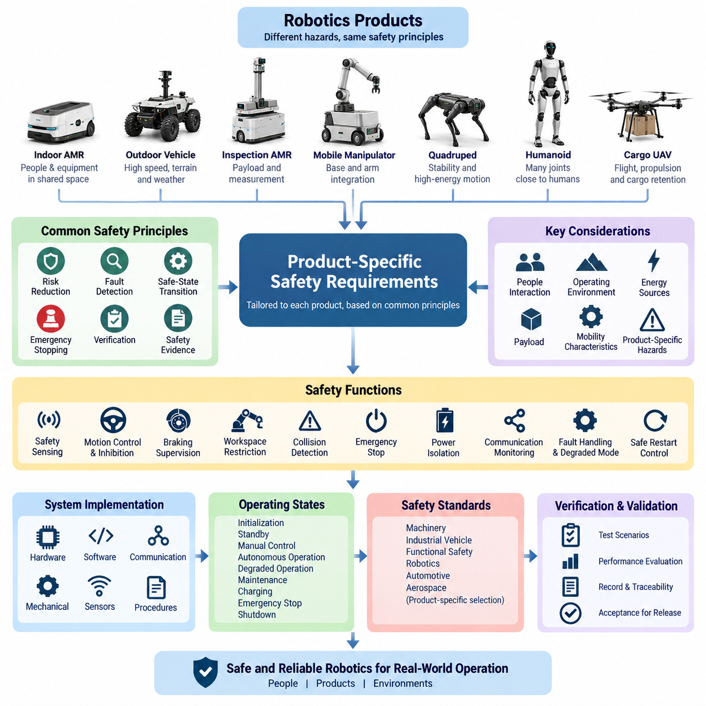
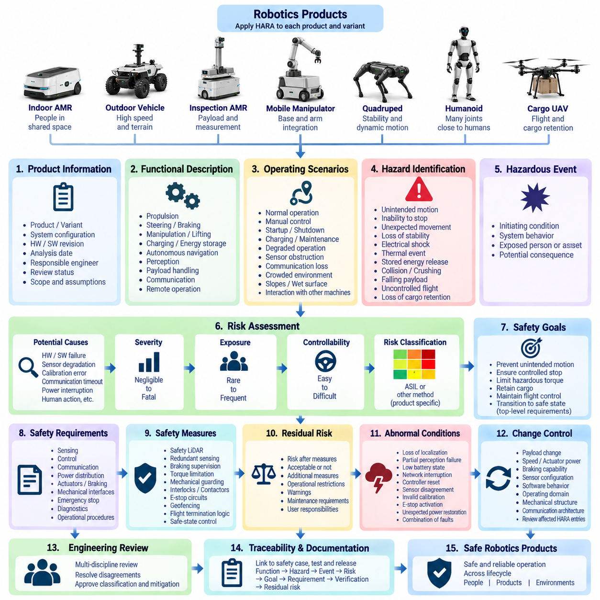
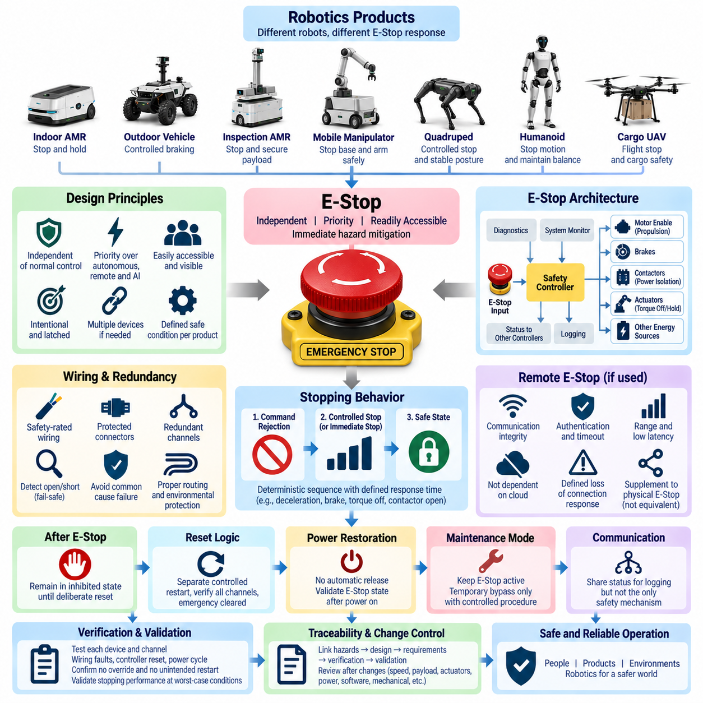
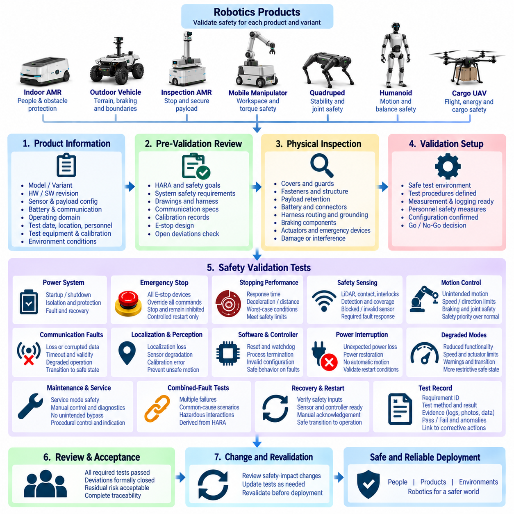
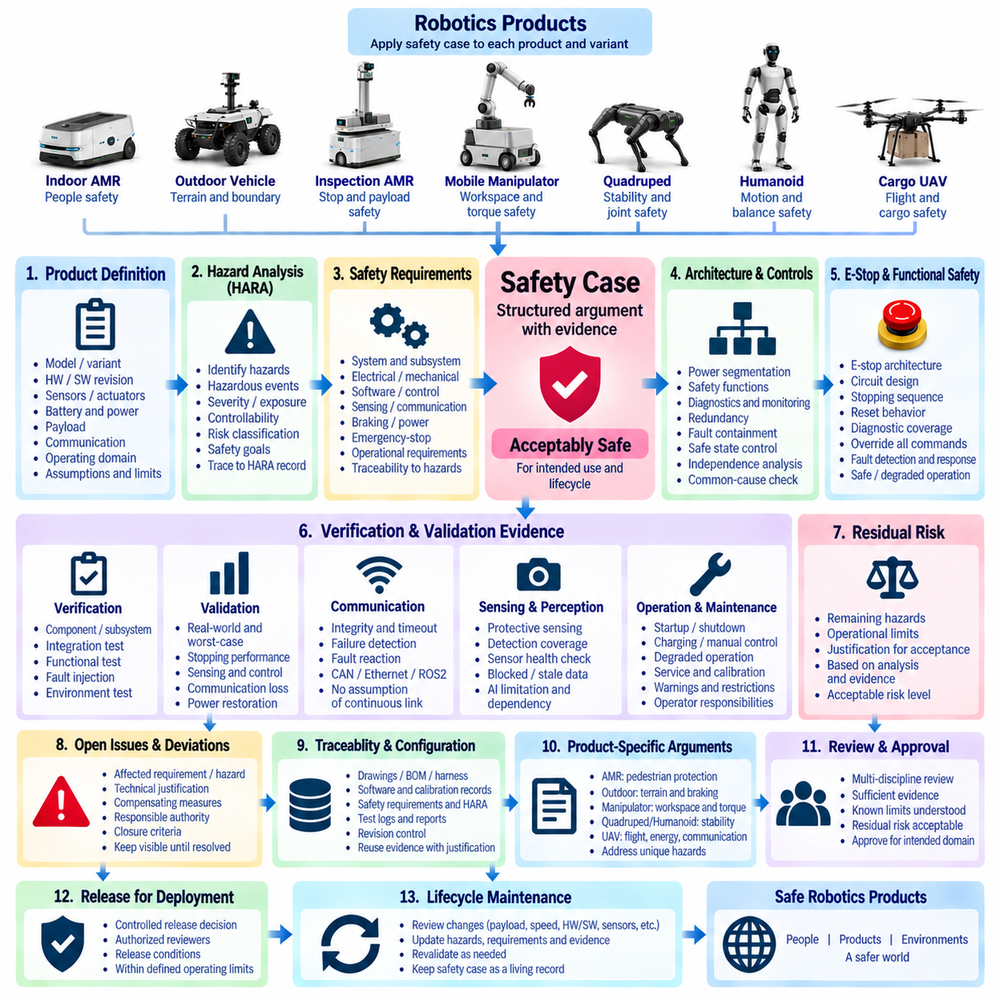

**Volume 22. Hills Robotics Engineering Standards**

# Chapter 08. HRS-008 Safety

## 08.01. Safety Requirements by Product

{width="7.268055555555556in" height="7.268055555555556in"}

안전 요구사항(Safety Requirements)은 로봇 시스템별로 주요 위험요인, 운용 환경, 이동 특성, 에너지원, 탑재물(Payload), 사람과의 상호작용이 크게 다르므로 제품 수준(Product Level)에서 정의되어야 한다. 따라서 안전 개념(Safety Concept)은 위험 저감(Risk Reduction), 고장 감지(Fault Detection), 안전 상태 전환(Safe-State Transition), 비상 정지(Emergency Stopping), 검증(Verification), 추적 가능한 안전 증거(Safety Evidence)라는 공통 원칙을 유지하면서 각 제품군(Product Class)에 맞게 적용되어야 한다.

실내 자율이동로봇(Indoor AMR)의 주요 안전 목표는 작업자, 카트, 설비, 출입문 및 다른 로봇이 동일한 공간을 공유할 수 있는 환경에서 제어된 주행(Controlled Navigation)을 보장하는 것이다. 제품은 보호 센싱(Protective Sensing), 속도 및 분리 모니터링(Speed and Separation Monitoring), 제어 정지(Controlled Stopping), 비상 정지(Emergency Stopping), 의도하지 않은 이동(Unintended Motion) 방지 기능을 제공해야 한다. 예측 가능한 센서 차단, 위치추정 성능 저하, 통신 상실 또는 제어기 고장 상황에서도 안전 기능은 유효하게 유지되어야 한다.

야외 자율주행차량(Outdoor Autonomous Vehicle)은 높은 속도, 다양한 지형, 경사면, 기상 조건, 가시성 저하, 위성항법시스템(GNSS) 불확실성 및 차량이나 보행자와의 상호작용으로 발생하는 위험을 다루어야 한다. 안전 요구사항에는 독립적인 이동 억제(Motion Inhibition), 제동 감시(Braking Supervision), 조향 고장 감지(Steering Fault Detection), 위치추정 무결성 모니터링(Localization Integrity Monitoring), 장애물 감지 범위, 운용 경계 준수(Operational Boundary Enforcement), 자율 운행을 안전하게 지속할 수 없을 때 정의된 최소 위험 상태(Minimum-Risk Condition)로 전환하는 기능이 포함되어야 한다.

검사 자율이동로봇(Inspection AMR)을 포함하여 특수 측정 장비를 탑재하는 플랫폼은 차량 자체의 위험과 탑재물 고유의 위험을 모두 고려해야 한다. 안전 개념은 탑재물 질량, 무게중심(Center of Gravity) 변화, 제한된 센서 시야, 전기 부하, 움직이는 검사 장치 및 위험 작업 구역을 고려해야 한다. 검사 기능의 상실이 이동 안전(Mobility Safety)을 저해해서는 안 되며, 탑재물 고장이 안전 필수 이동 제어(Safety-Critical Motion Control)로 전파되지 않도록 해야 한다.

이동형 매니퓰레이터(Mobile Manipulator)는 이동 베이스(Mobile Base)와 매니퓰레이터(Manipulator)가 각각 독립적으로 또는 결합 동작을 통해 위험한 움직임을 발생시킬 수 있으므로 두 하위 시스템을 통합적으로 고려한 안전 처리가 필요하다. 요구사항에는 관절 토크 및 속도 제한, 작업 공간 제한(Workspace Restriction), 충돌 감지, 안전한 도구 동작, 베이스 이동 인터록(Base-Motion Interlock), 비상 정지 및 예기치 않은 재시작 방지가 포함되어야 한다. 각 고장에 대해 팔(Arm), 베이스(Base) 또는 두 시스템 모두를 비활성화해야 하는지를 안전 상태(Safety State)로 정의해야 한다.

4족 보행로봇(Quadruped Robot)은 불안정성, 전도(Fall), 고에너지 관절 운동, 예기치 않은 자세 복구 동작 및 주변 작업자와의 접촉 위험을 고려해야 한다. 안전 모니터링(Safety Monitoring)은 액추에이터 상태, 관절 위치와 속도, 몸체 자세, 전원 무결성(Power Integrity), 통신 상태 및 제어 컴퓨터 상태를 감시해야 한다. 복구할 수 없는 불안정 상태 또는 심각한 액추에이터 고장이 감지되면 단순히 전원을 즉시 차단하는 방식에 의존하지 않고 자세와 주변 환경에 적합한 제어된 보호 대응(Controlled Protective Response)을 수행해야 한다.

휴머노이드 로봇(Humanoid Robot)은 다수의 구동 관절이 사람 가까이에서 동작하며 압착(Crushing), 끼임(Pinching), 충격(Impact), 얽힘(Entanglement), 전도(Falling) 위험을 발생시킬 수 있으므로 추가적인 보호가 필요하다. 제품 요구사항에는 관절 수준 제한, 토크 모니터링, 충돌 대응, 균형 감시(Balance Supervision), 전도 관리(Fall Management), 손 및 말단장치(End-Effector) 제한, 비상 정지 및 안전 전원 차단(Safe Power Isolation)이 정의되어야 한다. 안전 관련 기능은 인공지능 인지(AI Perception) 또는 상위 수준 행동 소프트웨어(High-Level Behavioral Software)에만 의존해서는 안 된다.

화물 무인항공기(Cargo UAV)는 지속적인 제어 비행(Controlled Flight), 추진계 무결성(Propulsion Integrity), 비행 제어 가용성, 항법 무결성(Navigation Integrity), 통신 상실, 에너지 예비량(Energy Reserve), 화물 유지(Cargo Retention), 비상 착륙을 핵심 안전 요소로 다루어야 한다. 안전 아키텍처(Safety Architecture)는 비제어 비행 또는 화물 이탈을 발생시킬 수 있는 고장을 식별하고 적절한 이중화(Redundancy), 모니터링, 고장 격리(Containment), 성능 저하 운용 모드(Degraded Operating Mode)를 제공해야 한다. 화물 잠금 상태(Cargo Lock Status)는 이륙 전과 관련 비행 단계에서 명확하게 확인되어야 한다.

제품 안전 요구사항은 안전 관련 제어(Safety-Related Control)와 일반 운용 제어(Normal Operational Control)를 구분해야 한다. 자율 경로 계획, 인공지능 추론(AI Inference), 클라우드 서비스, 플릿 최적화(Fleet Optimization), 원격 임무 관리(Remote Mission Management) 등의 기능은 해당 안전 역할을 위해 특별히 개발되고 검증되지 않은 한 위험한 움직임을 방지하는 유일한 보호 수단으로 간주해서는 안 된다. 일반 제어의 상실, 데이터 손상, 과도한 지연 또는 잘못된 출력으로 허용할 수 없는 위험이 발생할 수 있는 경우 독립적인 보호 채널(Independent Protective Channel)을 적용해야 한다.

비상 정지(Emergency Stopping)는 각 제품의 물리적 특성과 운용 환경에 따라 제공되어야 한다. 비상 정지 요청은 일반적인 이동 명령보다 우선순위를 가져야 하며 정의된 안전 상태(Safe Condition)를 향해 결정론적 전환(Deterministic Transition)을 시작해야 한다. 비상 정지를 해제하는 것만으로 위험한 움직임이 자동 재시작되어서는 안 된다. 재시작은 비상 정지를 발생시킨 조건이 해소되었으며 제품의 운용 재개가 허용된다는 사실이 확인된 후에만 가능해야 한다.

안전 센싱(Safety Sensing)은 자율주행용 인지 센서를 단순히 중복하는 방식이 아니라 위험 영역의 형상(Hazard Geometry)과 필요한 보호 범위에 따라 선정되어야 한다. 필요한 경우 안전 라이다(Safety LiDAR), 인터록(Interlock), 리미트 스위치(Limit Switch), 이중화 위치 피드백, 제동 감시, 접촉 센싱(Contact Sensing) 또는 기타 보호 장치를 적용해야 한다. 진단 범위(Diagnostic Coverage)에는 연결 단절, 비정상 값, 오래된 데이터(Stale Data), 통신 타임아웃 및 관련 장치 내부 고장이 포함되어야 한다.

전기 아키텍처(Electrical Architecture)는 적절한 전원 분리(Power Segmentation)와 에너지 격리(Energy Isolation)를 통해 안전 목표를 지원해야 한다. 안전 필수 제어기, 브레이크, 컨택터(Contactor), 센서 및 비상 정지 회로는 비안전 부하(Non-Safety Load)의 단일 고장으로 필수 보호 기능이 불필요하게 상실되지 않도록 전원을 공급하고 보호해야 한다. 격리 절차와 안전 상태를 정의할 때 저장된 전기적, 기계적, 공압적, 중력 및 운동 에너지를 고려해야 한다.

통신 의존형 안전 기능(Communication-Dependent Safety Function)은 메시지 무결성(Message Integrity), 타임아웃 동작, 갱신 주기, 순서 모니터링(Sequence Monitoring), 고장 대응 및 복구 조건을 명시해야 한다. CAN, 이더넷(Ethernet), 이더캣(EtherCAT), 무선 통신 또는 기타 필수 네트워크가 상실되면 위험 분석(Hazard Analysis)에서 도출된 제품별 대응을 수행해야 한다. 무선 또는 클라우드 연결은 항상 사용 가능한 것으로 간주해서는 안 되며, 통신이 복구되었다는 사실만으로 위험한 운용의 자동 재개가 허용되어서는 안 된다.

각 제품에는 초기화(Initialization), 대기(Standby), 수동 제어, 자율 운용, 성능 저하 운용(Degraded Operation), 유지보수, 충전, 비상 정지 및 해당되는 경우 종료(Shutdown)를 포함한 운용 상태와 각 상태에 대응하는 안전 동작이 명확하게 정의되어야 한다. 이러한 상태 간 전환은 불완전한 초기화, 캘리브레이션(Calibration) 실패, 유효하지 않은 구성, 승인되지 않은 명령 또는 예기치 않은 전원 복구가 직접적으로 위험한 움직임을 발생시키지 않도록 제어되어야 한다.

안전 요구사항은 체계적인 위험 분석(Systematic Hazard Analysis)으로부터 도출되어 하드웨어, 임베디드 소프트웨어(Embedded Software), 통신, 기계 시스템, 센싱 및 운용 절차에 할당되어야 한다. 각 요구사항에는 고유 식별자, 근거(Rationale), 적용 제품 또는 구성, 검증 방법 및 식별된 위험과의 관계가 포함되어야 한다. 탑재물, 액추에이터 출력, 속도, 배터리 용량, 센서 구성 또는 운용 영역(Operating Domain)의 변경으로 위험도가 달라질 수 있는 경우 제품 변형(Product Variant)을 다시 검토해야 한다.

적용할 안전 표준(Safety Standard)은 하나의 표준을 모든 제품에 동일하게 적용하는 방식이 아니라 제품 분류와 의도된 운용 환경에 따라 선정해야 한다. 엔지니어링 프로세스는 필요에 따라 기계류, 산업 차량, 기능 안전(Functional Safety), 로봇, 자동차 및 항공우주 분야의 안전 기준과 관행을 고려해야 한다. 표준 체계는 자율이동로봇(AMR), 야외 차량(Outdoor Vehicle), 화물 무인항공기(Cargo UAV), 4족 보행로봇(Quadruped), 휴머노이드(Humanoid)의 요구사항을 구분하여 공통 HRS 안전 프레임워크(Common HRS Safety Framework) 아래에서 제품별 규칙을 정의할 수 있도록 해야 한다.

검증(Verification)은 정상 동작의 정확성뿐만 아니라 고장 발생 시 올바른 대응도 입증해야 한다. 시험에는 비상 정지 작동, 센서 상실, 통신 타임아웃, 제어기 리셋, 전원 중단, 액추에이터 고장, 위치추정 성능 저하, 유효하지 않은 명령 및 분석에서 식별된 기타 신뢰 가능한 고장 조건이 포함되어야 한다. 시험 결과는 감지 지연(Detection Latency), 정지 동작, 격리, 성능 저하 운용 및 복구가 정의된 제품 안전 요구사항을 충족함을 입증해야 한다.

안전 검증(Safety Validation)은 전기 아키텍처, 소프트웨어, 기계 시스템, 센서, 탑재물 및 환경 조건 간 상호작용으로 인해 부품 단위 시험에서 발견되지 않는 위험이 발생할 수 있으므로 대표성을 갖는 통합 제품(Integrated Product)을 대상으로 수행되어야 한다. 검증 증거에는 제품 구성, 소프트웨어와 하드웨어 리비전(Revision), 시험 조건, 측정 결과, 이상 현상, 시정 조치(Corrective Action), 최종 승인 결과를 기록하여 입증된 안전 상태가 지속적으로 추적 가능하도록 해야 한다.

개별 안전 부품이 각각의 시험을 통과했다는 이유만으로 제품을 출시해서는 안 된다. 제품 출시는 위험이 식별되고, 안전 요구사항이 구현되며, 인터페이스가 검증되고, 잔여 위험(Residual Risk)이 평가되었으며, 정상 상태와 고장 상태 모두에서 통합 제품이 예측 가능한 방식으로 동작한다는 증거가 확보된 경우에만 허용되어야 한다. 안전 관련 예외 사항(Safety-Related Deviation)은 생산 또는 현장 배치(Field Deployment) 이전에 문서화된 엔지니어링 검토와 명시적인 처리 결정(Disposition)을 거쳐야 한다.

## 08.02. HARA Template

{width="7.268055555555556in" height="7.268055555555556in"}

HARA 템플릿(HARA Template)은 로봇 제품의 전체 수명주기(Lifecycle)에 걸쳐 관련 위험을 식별, 평가 및 문서화하기 위한 일관된 방법을 수립한다. 위험 분석 및 위험 평가(Hazard Analysis and Risk Assessment)는 제품의 의도된 기능, 운용 환경, 시스템 경계, 사용자, 합리적으로 예측 가능한 오사용(Foreseeable Misuse) 및 운용 제한사항에서 시작해야 한다. 그 결과는 위험 상황에서 안전 요구사항 및 검증 활동까지 추적성(Traceability)을 제공해야 한다.

각 HARA 기록(HARA Record)은 적용 대상 제품, 제품 변형(Product Variant), 시스템 구성, 하드웨어 및 소프트웨어 리비전(Revision), 분석 날짜, 담당 엔지니어 및 검토 상태를 식별해야 한다. 분석 범위는 실내 자율이동로봇(Indoor AMR), 야외 차량(Outdoor Vehicle), 검사 자율이동로봇(Inspection AMR), 이동형 매니퓰레이터(Mobile Manipulator), 화물 무인항공기(Cargo UAV), 4족 보행로봇(Quadruped), 휴머노이드(Humanoid) 또는 HRS 엔지니어링 프레임워크에서 정의된 기타 로봇 플랫폼 중 어디에 적용되는지를 명확하게 기술해야 한다. 구성에 관한 가정(Configuration Assumption)은 명시적으로 유지되어야 한다.

분석은 제품이 수행하도록 의도된 기능과 해당 기능이 수행되는 운용 조건을 설명하는 기능 설명(Functional Description)에서 시작해야 한다. 해당되는 경우 추진(Propulsion), 조향(Steering), 제동(Braking), 조작(Manipulation), 리프팅(Lifting), 충전, 에너지 저장, 자율주행, 인지(Perception), 탑재물 취급(Payload Handling), 통신 및 원격 운용과 관련된 기능을 고려해야 한다. 개별 위험을 평가하기 전에 기능 간 안전 관련 의존성(Safety-Relevant Dependency)도 식별해야 한다.

운용 시나리오(Operating Scenario)는 위험 사건(Hazardous Event)이 발생할 수 있는 상황을 설명해야 한다. 관련 조건에는 정상 자율 운용, 수동 제어, 시동, 종료, 충전, 유지보수, 성능 저하 운용(Degraded Operation), 통신 상실, 센서 차단, 혼잡 환경, 경사면, 젖은 노면, 제한된 공간 또는 다른 기계와의 상호작용 등이 포함될 수 있다. 시나리오 설명에는 검토자가 실제 노출 상황(Exposure Context)을 이해할 수 있을 정도로 충분한 정보가 포함되어야 한다.

위험(Hazard)은 단순히 부품 고장의 명칭을 나열하는 것이 아니라 잠재적인 위해(Harm)의 원인을 설명해야 한다. 예를 들어 의도하지 않은 차량 이동, 정지 불능, 예상하지 못한 매니퓰레이터 동작, 안정성 상실, 감전, 열적 사고(Thermal Event), 제어되지 않은 저장 에너지, 충돌, 압착, 탑재물 낙하, 무인항공기의 제어 불능 비행 또는 화물 유지 기능 상실 등이 포함될 수 있다. 따라서 동일한 위험 동작으로 이어지는 여러 기술적 고장은 하나의 위험 사건에 기여할 수 있다.

위험 사건(Hazardous Event)은 식별된 위험과 구체적인 운용 상황을 결합하여 정의해야 한다. 템플릿은 시작 조건(Initiating Condition), 그에 따른 시스템 동작, 노출되는 사람 또는 자산, 잠재적 결과를 구분해야 한다. 이러한 구분은 HARA가 단순한 고장 목록으로 변하는 것을 방지하며, 안전 엔지니어가 실제 운용 조건, 예측 가능한 상호작용 및 위험한 시스템 동작의 물리적 결과를 기준으로 위험도를 평가할 수 있도록 한다.

잠재적 원인(Potential Cause)은 이후의 안전 요구사항 할당(Safety Requirement Allocation)과 고장 분석(Fault Analysis)을 지원할 수 있도록 기록해야 한다. 원인은 하드웨어 고장, 소프트웨어 오작동, 센서 성능 저하, 캘리브레이션 오류, 통신 타임아웃, 전원 중단, 기계적 손상, 환경 간섭, 잘못된 유지보수, 유효하지 않은 구성 또는 작업자의 행동에서 발생할 수 있다. HARA에서 모든 상세 근본 원인(Root Cause)을 요구하는 것은 아니지만, 엔지니어링 후속 조치가 가능하도록 신뢰할 수 있는 시작 메커니즘을 충분히 식별해야 한다.

심각도 평가(Severity Assessment)는 위험 사건이 발생했을 때 발생 가능한 결과를 나타내야 한다. 조직은 해당 로봇 제품에 적합한 심각도 범주(Severity Category)를 정의하고 일관되게 적용해야 하며, 해당되는 경우 무시할 수 있는 영향에서 경미하거나 심각한 부상, 생명을 위협하거나 치명적인 결과까지 포함할 수 있다. 심각도는 아직 입증되지 않은 보호 조치가 계획되어 있다는 이유로 낮게 평가해서는 안 되며, 해당 사건에서 신뢰할 수 있는 잠재적 결과를 기준으로 평가해야 한다.

노출도 평가(Exposure Assessment)는 관련 운용 상황이 얼마나 자주 또는 얼마나 오랫동안 발생할 수 있는지를 나타내야 한다. 평가 시 임무 프로파일(Mission Profile), 운용 시간, 사람과의 근접성, 교통 밀도, 유지보수 빈도, 충전 작업, 환경 조건 및 제품 배치 패턴(Deployment Pattern)을 고려해야 한다. 정량적인 현장 데이터가 없는 경우 노출도는 문서화된 가정에 근거해야 하며, 이후 실제 운용 데이터가 확보되면 평가를 다시 검토할 수 있어야 한다.

통제 가능성(Controllability)은 위험 상황이 발생한 이후 노출된 사람, 작업자, 원격 감독자 또는 시스템이 위해를 회피하거나 완화할 수 있는 현실적인 능력을 평가해야 한다. 사용 가능한 반응 시간, 로봇 속도, 정지 거리, 가시성, 경고 효과, 회피 공간, 사람의 상황 인식 및 자동화 시스템의 동작을 고려해야 한다. 이론적으로 회피 가능성이 존재한다는 사실만으로 유리한 통제 가능성 등급을 부여해서는 안 된다.

선정된 심각도(Severity), 노출도(Exposure) 및 통제 가능성(Controllability) 평가 결과를 이용하여 해당 제품에 적용되는 평가 방법에 따라 문서화된 위험 등급(Risk Classification)을 결정해야 한다. 자동차 기능 안전(Automotive Functional Safety) 개념이 적절한 경우 분석에서 자동차 안전 무결성 수준(ASIL) 중심의 평가를 지원할 수 있으며, 기계류 또는 산업용 로봇 제품에서는 해당 안전 프레임워크에 부합하는 위험 추정 방법(Risk Estimation Method)을 사용할 수 있다. 서로 다른 등급 체계를 정당한 근거 없이 혼합하지 않고 선택된 평가 방법을 템플릿에 기록해야 한다.

허용할 수 없거나 안전과 관련된 각각의 위험 사건은 하나 이상의 안전 목표(Safety Goal) 또는 이에 상응하는 상위 수준 안전 요구사항(Top-Level Safety Requirement)으로 연결되어야 한다. 안전 목표는 상세 구현 방법을 성급하게 규정하지 않고 요구되는 안전 동작을 설명해야 한다. 일반적인 안전 목표에는 의도하지 않은 이동 방지, 제어 가능한 정지 능력 유지, 위험한 액추에이터 토크 방지, 화물 유지, 비행 제어 유지 또는 정의된 안전 상태나 최소 위험 상태(Minimum-Risk Condition)로의 전환 등이 포함될 수 있다.

안전 목표(Safety Goal)는 이후 센싱, 제어, 통신, 전력 분배, 액추에이터, 제동, 기계적 인터페이스, 비상 정지, 진단 및 필요한 운용 절차를 포함하는 시스템 수준 안전 요구사항(System-Level Safety Requirement)에 할당되어야 한다. HARA 템플릿은 각각의 위험 사건을 해당 안전 목표와 하위 요구사항 식별자(Requirement Identifier)에 연결하는 참조 정보를 제공하여 아키텍처 또는 제품 구성 변경이 안전에 미치는 영향을 평가할 수 있도록 해야 한다.

기존 또는 제안된 안전 조치(Safety Measure)는 최초 위험 설명과 분리하여 기록해야 한다. 안전 조치에는 안전 라이다(Safety LiDAR), 이중화 센싱(Redundant Sensing), 제동 감시, 토크 제한, 기계적 가드(Mechanical Guarding), 인터록(Interlock), 컨택터(Contactor), 비상 정지 회로, 통신 타임아웃 모니터링, 지오펜싱(Geofencing), 비행 종료 로직(Flight Termination Logic) 또는 안전 상태 제어(Safe-State Control) 등이 포함될 수 있다. 관련 구현 및 검증 증거가 검토되기 전까지 이러한 조치가 효과적인 것으로 가정해서는 안 된다.

잔여 위험(Residual Risk)은 정의된 안전 조치가 구현된 이후 평가해야 한다. 평가에서는 남아 있는 위험이 해당 제품의 기준에 따라 허용 가능한지와 추가적인 기술적 또는 운용적 조치가 필요한지를 문서화해야 한다. 설계를 통해 위험을 충분히 감소시킬 수 없는 경우 남아 있는 제한사항, 경고, 유지보수 요구사항, 운용 제한 또는 사용자 책임을 명확하게 식별하고 관리해야 한다.

HARA는 정상 운용(Nominal Operation)만 분석하는 것이 아니라 비정상 및 성능 저하 조건(Abnormal and Degraded Condition)도 포함해야 한다. 해당되는 경우 위치추정 상실, 부분적인 인지 기능 고장, 액추에이터 성능 저하, 낮은 배터리 상태, 네트워크 중단, 제어기 리셋, 센서 불일치, 유효하지 않은 캘리브레이션, 비상 정지 작동 및 예기치 않은 전원 복구를 고려해야 한다. 독립적인 여러 고장이 공통 안전 메커니즘(Common Safety Mechanism)을 무력화할 수 있는 경우 복합 고장(Combination of Faults)에 대해 추가적인 주의를 기울여야 한다.

탑재물, 최대 속도, 액추에이터 출력, 제동 능력, 배터리 용량, 센서 구성, 소프트웨어 동작, 운용 영역(Operating Domain), 기계 구조 또는 통신 아키텍처가 변경되면 영향을 받는 HARA 항목을 재검토해야 한다. 이전에 허용 가능했던 평가 결과가 제품 변경 이후에도 자동으로 유효한 것으로 간주해서는 안 된다. 변경 관리(Change Control)는 변경된 구성이 출시되기 전에 영향을 받는 위험, 가정, 안전 목표, 요구사항 및 검증 증거를 식별해야 한다.

HARA 결과는 단일 작성자의 판단으로 남겨두지 않고 관련 엔지니어링 분야에서 검토해야 한다. 평가 대상 제품과 위험에 따라 전기, 기계, 소프트웨어, 제어, 인지, 시스템, 시험 및 안전 엔지니어가 참여해야 한다. 위험 등급, 가정 또는 완화 조치(Mitigation)에 관한 의견 차이는 안전 승인이 이루어지기 전에 문서화하고 정의된 엔지니어링 검토 프로세스(Engineering Review Process)를 통해 해결해야 한다.

완성된 HARA는 안전 사례(Safety Case), 검증 체크리스트(Validation Checklist), 시험 사양(Test Specification), 변경 기록(Change Record) 및 제품 출시 증거(Product Release Evidence)와 연결되는 통제된 안전 수명주기 기록(Safety Lifecycle Record)이 되어야 한다. 각 항목은 기능과 운용 시나리오에서 시작하여 위험, 위험 사건, 위험 평가, 안전 목표, 구현된 요구사항, 검증 결과 및 잔여 위험 결정까지 추적 가능해야 한다. 이러한 추적성을 통해 로봇 제품이 발전하고 변경되더라도 안전 논증(Safety Argument)을 지속적으로 유지하고 관리할 수 있다.

## 08.03. E-Stop Design Rule

{width="7.268055555555556in" height="7.268055555555556in"}

비상 정지 설계(Emergency-Stop Design)는 비정상 상태에서 즉각적인 사람의 개입이 필요할 때 위험한 로봇 움직임을 감소시키거나 제거할 수 있는 독립적이고 쉽게 접근 가능한 수단을 제공해야 한다. 비상 정지 기능(E-Stop Function)은 일반 이동 명령, 자율 계획, 원격 제어, 플릿 명령(Fleet Instruction), 인공지능 생성 동작(AI-Generated Action)보다 우선되어야 한다. 비상 정지의 목적은 위험 완화(Hazard Mitigation)이며, 정상적인 운용 정지 또는 일상적인 전원 스위칭을 대체하는 용도로 사용해서는 안 된다.

비상 정지 개념(E-Stop Concept)은 제품 아키텍처, 위험 에너지원, 이동 특성, 정지 거리, 탑재물(Payload), 운용 환경 및 예상되는 사람과의 상호작용에 따라 정의되어야 한다. 실내 자율이동로봇(Indoor AMR), 야외 차량(Outdoor Vehicle), 이동형 매니퓰레이터(Mobile Manipulator), 4족 보행로봇(Quadruped), 휴머노이드(Humanoid), 화물 무인항공기(Cargo UAV)는 서로 다른 비상 대응이 필요할 수 있다. 따라서 모든 제품에서 즉각적인 전원 차단이 항상 안전하다고 가정하지 말고 각 제품과 운용 모드별로 최종 안전 상태(Safe Condition)를 명확하게 정의해야 한다.

물리적 비상 정지 장치(Physical E-Stop Device)는 예측 가능한 위험 상황에서 작업자 또는 주변 사람이 신속하게 식별하고 작동할 수 있는 위치에 배치해야 한다. 장치 위치를 결정할 때 접근 방향, 로봇 크기, 이동 기구, 탑재물에 의한 가림, 유지보수 접근성 및 운용 자세를 고려해야 한다. 하나의 장치만으로 합리적인 접근성을 확보할 수 없는 경우 여러 개의 장치 또는 동등한 비상 인터페이스를 제공하고 동일한 안전 기능의 구성 요소로 관리해야 한다.

주 수동 비상 정지 작동기(Manual E-Stop Actuator)는 일반 제어장치와 혼동할 가능성을 최소화할 수 있도록 명확하게 구별되는 비상 제어 형태를 사용해야 한다. 작동은 의도적으로 이루어져야 하며 손을 떼는 것만으로 비상 상태가 자동 해제되지 않도록 기계적 또는 논리적으로 래치(Latch)되어야 한다. 작동기와 관련 표시는 제품 수명주기 전체에서 예상되는 조명, 오염, 진동, 환경 노출 및 유지보수 조건에서도 식별 가능해야 한다.

비상 정지 요청(E-Stop Request)은 가능한 경우 필수적이지 않은 애플리케이션 소프트웨어(Application Software)를 우회해야 하며, 자율주행 소프트웨어, ROS2 노드(ROS2 Node), 클라우드 통신, 무선 연결, 인공지능 인지(AI Perception) 또는 플릿 관리 서비스(Fleet Management Service)에만 의존해서는 안 된다. 안전 관련 처리는 요구되는 위험 감소 수준에 적합한 아키텍처를 사용해야 한다. 비안전 컴퓨팅 하위 시스템의 고장이나 과도한 지연으로 인해 정상적으로 동작 가능한 비상 정지 채널의 보호 대응이 방해받아서는 안 된다.

전기 설계(Electrical Design)는 비상 정지 신호가 추진 장치, 액추에이터, 브레이크, 컨택터(Contactor), 모터 활성화 회로(Motor Enable Circuit) 및 기타 위험 에너지원을 어떻게 제어하는지 정의해야 한다. 제품에 따라 제어 감속 후 토크 제거, 즉각적인 토크 억제, 브레이크 작동, 컨택터 개방 또는 선택된 전원 영역(Power Domain)의 격리가 포함될 수 있다. 안전 상태를 달성하거나 유지하는 데 필요한 경우 필수 제어, 진단, 조명, 통신 또는 제동용 전원은 계속 공급될 수 있다.

모든 로봇에서 액추에이터 전원을 즉시 제거하는 것이 가장 안전한 대응이라고 가정해서는 안 된다. 무거운 하중을 운반하는 차량은 제어된 제동(Controlled Braking)이 필요할 수 있고, 매니퓰레이터는 매달린 하중의 낙하를 방지하기 위해 유지 토크(Holding Torque)가 필요할 수 있으며, 보행 로봇은 안정적인 자세로 관리된 전환(Managed Transition)이 필요할 수 있다. 설계에서는 비상 정지로 인해 발생할 수 있는 2차 위험(Secondary Hazard)을 분석하고 전체 위험을 최소화하는 정지 동작을 선정해야 한다.

이중화 비상 정지 채널(Redundant E-Stop Channel)이 필요한 경우 하나의 배선, 커넥터, 제어기 또는 인터페이스 고장으로 전체 비상 정지 기능이 무력화되지 않도록 채널 간 충분한 독립성을 확보해야 한다. 기술적으로 적절한 경우 채널 불일치(Channel Discrepancy)를 감지할 수 있어야 한다. 이중화된 안전 경로의 실제 독립성을 판단할 때 공통 전원, 접지, 통신, 소프트웨어, 커넥터 또는 물리적 배선 경로로 인한 공통 원인 취약성(Common-Cause Vulnerability)을 평가해야 한다.

비상 정지 배선(E-Stop Wiring)은 안전 관련 회로(Safety-Related Circuit)로 설계하고 예측 가능한 단선, 단락, 커넥터 분리, 마모, 환경 손상 및 잘못된 정비 연결로부터 보호해야 한다. 적절한 경우 정상 닫힘(Normally Closed) 방식 또는 고장을 드러낼 수 있는 회로 원리를 사용하여 연결 상실이 정상 상태로 잘못 해석되지 않고 감지될 수 있도록 해야 한다. 와이어 하니스 라우팅(Harness Routing)과 커넥터 선정은 안전 아키텍처에서 설정한 진단 가정을 지원해야 한다.

원격 비상 정지(Remote Emergency Stopping)는 제품의 운용 개념에 따라 필요한 경우 물리적 비상 정지 장치를 보완할 수 있지만, 무선 통신을 유선 비상 회로(Hardwired Emergency Circuit)와 자동적으로 동등한 것으로 간주해서는 안 된다. 설계에서는 통신 무결성, 타임아웃 동작, 인증(Authentication), 통신 거리, 지연시간(Latency), 연결 상실 대응 및 우선순위를 정의해야 한다. 원격 비상 정지 인터페이스가 클라우드 가용성 또는 일반 네트워크 서비스에 대한 위험한 의존성을 만들어서는 안 된다.

정지 시퀀스(Stopping Sequence)는 비상 정지 작동에서 정의된 안전 상태에 도달할 때까지 결정론적(Deterministic)이고 문서화되어야 한다. 필요한 단계에는 명령 거부, 추진 억제, 제어 감속, 브레이크 체결, 액추에이터 토크 관리, 컨택터 제어 및 정지 상태 확인이 포함될 수 있다. 최대 응답 시간과 정지 성능은 제품 위험 분석(Product Hazard Analysis)에서 도출하고 대표적인 속도, 하중, 노면, 배터리 및 환경 조건에서 검증해야 한다.

비상 정지가 활성화되면 의도적인 리셋 동작(Reset Action)이 완료될 때까지 로봇은 비상 또는 동작 억제 상태(Inhibited State)를 유지해야 한다. 물리적 작동기를 리셋하거나 비상 정지 신호를 해제하는 것만으로 이동 명령이 발생하거나 위험한 저장 에너지가 해제되거나 자율 임무가 재개되어서는 안 된다. 재시작(Restart)은 비상 상황이 해소되었으며 관련 안전 기능이 운용 준비 상태임을 확인하는 별도의 제어된 전환(Controlled Transition)을 통해서만 이루어져야 한다.

리셋 로직(Reset Logic)은 여러 비상 정지 장치와 분산 안전 인터페이스(Distributed Safety Interface)를 고려해야 한다. 어떤 비상 채널이라도 활성화, 고장, 연결 해제 또는 진단상 유효하지 않은 상태로 남아 있다면 전체 비상 정지 기능이 복구되었다고 표시해서는 안 된다. 작업자 인터페이스(Operator Interface)는 안전장치의 우회를 유도하지 않으면서 동작 억제 상태를 식별할 수 있는 충분한 상태 정보를 제공해야 한다. 진단 메시지는 비상 정지 작동과 감지된 회로 또는 통신 고장을 구분해야 한다.

예기치 않은 전원 복구(Unexpected Power Restoration)로 인해 비상 정지 상태가 자동으로 해제되거나 위험한 움직임이 발생해서는 안 된다. 배터리 재연결, 충전 상태 전환, 제어기 재부팅, 소프트웨어 재시작 또는 보조 전원 복구 이후 안전 제어기(Safety Controller)는 위험한 액추에이터를 활성화하기 전에 비상 정지 회로의 유효 상태를 확인해야 한다. 모호하거나 유효하지 않은 상태는 안전 아키텍처에서 정의된 제품별 동작 억제 상태 또는 안전 상태를 기본값으로 적용해야 한다.

유지보수 및 서비스 모드(Maintenance and Service Mode)에서도 위험한 움직임이 발생할 수 있다면 적절한 비상 정지 기능을 유지해야 한다. 비상 정지 채널의 임시 우회(Temporary Bypass)를 일반적인 서비스 작업으로 취급해서는 안 되며, 통제된 시험을 위해 기술적으로 불가피한 경우에는 명시적으로 관리되는 엔지니어링 절차가 필요하다. 이러한 절차에는 승인, 대체 보호 조치, 우회 상태 표시, 제한된 운용 조건 및 복구 확인(Restoration Verification)을 정의해야 한다.

비상 정지 상태는 통신에 의한 상태 보고가 안전 동작 자체의 유일한 구현 수단이 되지 않도록 하면서 관련 제어기에 전달되어야 한다. 이동 제어기, 상위 컴퓨터, 플릿 시스템, 진단 도구 및 작업자 인터페이스는 협조 제어와 기록을 위해 비상 정지 상태 정보를 수신할 수 있다. 그러나 이러한 보고 경로의 고장으로 인해 주 안전 메커니즘(Primary Safety Mechanism)이 요구된 정지를 수행하거나 동작 억제 상태를 유지하지 못해서는 안 된다.

검증(Verification)은 물리적 작동기 동작, 각 안전 채널, 배선 단절, 커넥터 분리, 제어기 리셋, 전원 사이클링(Power Cycling), 통신 상실, 액추에이터 고장 및 리셋 동작을 포함해야 한다. 시험에서는 일반 소프트웨어 명령이 비상 정지를 무효화할 수 없으며 작동기가 해제되었다는 이유만으로 위험한 움직임이 재시작되지 않음을 확인해야 한다. 여러 비상 정지 장치가 설치된 경우 각각의 장치와 관련 장치 조합을 검증해야 한다.

정지 성능(Stopping Performance)은 허용된 최대 속도, 정격 탑재물, 높은 또는 낮은 배터리 상태, 관련 경사도, 바닥 또는 지형 조건, 액추에이터 부하 및 예상되는 환경 영향을 포함하는 대표적인 최악 조건(Worst-Case Condition)에서 검증해야 한다. 측정된 응답 시간, 감속도, 정지 거리, 브레이크 동작, 잔여 움직임(Residual Motion) 및 최종 안전 상태를 위험 분석과 제품 안전 요구사항에서 설정된 한계값과 비교해야 한다.

비상 정지 설계 기록(E-Stop Design Record)은 식별된 위험, 안전 목표, 회로 아키텍처, 하드웨어 인터페이스, 소프트웨어 로직, 진단 범위(Diagnostic Coverage), 도면, 하니스 정의, 검증 절차 및 검증 결과 사이의 추적성(Traceability)을 유지해야 한다. 액추에이터, 브레이크, 탑재물, 최대 속도, 전력 분배, 안전 제어기, 통신 또는 기계적 구성에 영향을 주는 변경이 발생하면 제품 출시 전에 비상 정지 설계와 관련 안전 증거(Safety Evidence)를 재검토해야 한다.

## 08.04. Safety Validation Checklist

{width="7.268055555555556in" height="7.268055555555556in"}

안전 유효성 확인(Safety Validation)은 통합된 로봇 제품이 대표적인 운용 조건과 고장 조건에서 정의된 안전 목표(Safety Objective)를 달성하는지 확인해야 한다. 안전 유효성 확인 체크리스트(Safety Validation Checklist)는 안전 요구사항이 구현되고 하위 시스템 수준에서 충분히 검증(Verification)된 이후 적용해야 한다. 유효성 확인은 전기, 기계, 소프트웨어, 센싱, 통신, 전원 및 운용 요소 간 상호작용을 포함한 완성된 제품의 동작에 중점을 둔다.

유효성 확인 기록(Validation Record)은 제품, 제품 변형(Product Variant), 하드웨어 리비전(Hardware Revision), 소프트웨어 릴리스, 안전 제어기 버전, 센서 구성, 탑재물 구성, 배터리 유형, 통신 아키텍처 및 적용 운용 영역(Operating Domain)을 식별해야 한다. 또한 시험 날짜, 장소, 담당자, 시험 장비, 캘리브레이션 상태 및 환경 조건을 기록하여 모든 안전 시험 결과를 재현 가능한 제품 구성과 연계할 수 있도록 해야 한다.

동적 유효성 확인(Dynamic Validation)을 시작하기 전에 해당 위험 분석 및 위험 평가(HARA), 안전 목표, 시스템 안전 요구사항, 전기 도면, 하니스 정의, 통신 사양, 캘리브레이션 기록 및 비상 정지 설계(E-Stop Design)가 시험용으로 공식 승인되었거나 릴리스되었는지 확인해야 한다. 미해결된 안전 관련 예외 사항(Deviation)을 식별하고 평가해야 한다. 시험의 유효성을 저해하거나 작업자를 통제되지 않은 위험에 노출시킬 수 있는 미해결 조건이 있는 경우 유효성 확인을 진행해서는 안 된다.

물리적 설치 상태는 올바른 조립과 안전 필수 인터페이스(Safety-Critical Interface)를 중심으로 검사해야 한다. 체크리스트에서는 보호 커버, 가드, 기계적 체결부, 탑재물 고정, 배터리 장착, 커넥터, 하니스 라우팅(Harness Routing), 접지, 보호 장치, 제동 부품, 액추에이터 및 비상 제어장치의 상태를 확인해야 한다. 손상, 느슨한 연결, 간섭, 불충분한 간극 또는 구성 불일치가 발견되면 전원이 인가된 시험을 시작하기 전에 수정해야 한다.

전원 시스템 유효성 확인(Power-System Validation)은 정상적인 시동과 종료, 전원 격리, 보호 동작 및 비정상적인 전기 상태 이후의 복구를 확인해야 한다. 해당되는 경우 배터리, 전력분배장치(PDU), 퓨즈, 회로 차단기, 컨택터(Contactor), 직류-직류 변환기(DC/DC Converter), 모터 전원, 보조 전원 레일 및 안전 제어기 전원을 평가해야 한다. 비안전 부하의 고장으로 인해 정의된 안전 상태에 도달하거나 이를 유지하는 데 필요한 안전 기능이 불필요하게 비활성화되지 않는지 확인해야 한다.

비상 정지 유효성 확인(Emergency-Stop Validation)은 설치된 모든 비상 정지 장치와 관련 원격 비상 인터페이스를 검증해야 한다. 비상 정지가 활성화되면 일반, 자율, 원격, 플릿(Fleet) 및 인공지능 생성 이동 명령보다 우선하여 정의된 정지 시퀀스(Stopping Sequence)를 시작해야 한다. 작동 후 로봇은 동작 억제 상태(Inhibited State)를 유지해야 하며 작동기를 해제하거나 리셋하는 것만으로 위험한 움직임이 자동 재시작되어서는 안 된다. 재시작은 별도로 정의된 제어 복구 절차(Controlled Recovery Procedure)를 거쳐야 한다.

정지 성능(Stopping Performance)은 대표적인 최악 조건(Worst-Case Condition)에서 측정해야 한다. 시험에서는 허용된 최대 속도, 정격 탑재물, 관련 경사도, 바닥 또는 지형 특성, 배터리 상태, 액추에이터 부하 및 환경 영향을 고려해야 한다. 비상 정지 응답 시간, 감속도, 정지 거리, 브레이크 체결, 잔여 움직임(Residual Movement) 및 최종 안전 상태는 위험 분석과 제품 안전 요구사항에서 설정한 한계 이내에 있어야 한다.

안전 센싱(Safety Sensing)은 요구되는 전체 보호 영역에서 유효성을 확인해야 한다. 해당되는 경우 안전 라이다(Safety LiDAR), 접촉 센서, 리미트 스위치(Limit Switch), 이중화 위치 피드백, 장애물 감지 장치, 인터록(Interlock) 또는 동등한 보호 센서를 시험해야 한다. 유효성 확인에는 관련 위치와 접근 방향에서의 감지뿐만 아니라 센서 차단, 연결 해제, 유효하지 않은 데이터, 오래된 데이터(Stale Data) 또는 비현실적인 센서 값 조건을 포함하여 요구되는 고장 대응을 확인해야 한다.

동작 제어 유효성 확인(Motion-Control Validation)은 의도하지 않은 움직임, 과도한 속도, 잘못된 이동 방향, 액추에이터 명령 오류 및 정지 실패를 다루어야 한다. 제품 구성에 따라 추진, 조향, 제동, 관절 운동, 리프팅 시스템, 매니퓰레이터 및 기타 위험 액추에이터를 평가해야 한다. 일반 제어 명령이 안전 명령과 충돌하는 경우에도 안전 제한(Safety Limit)은 유효하게 유지되어야 하며 안전 관련 동작 억제 명령이 요구되는 우선순위를 가져야 한다.

통신 고장 유효성 확인(Communication Fault Validation)은 안전 관련 통신이 상실되거나 손상되었을 때 제품의 동작을 확인해야 한다. CAN, 이더넷(Ethernet), 이더캣(EtherCAT), ROS2 인터페이스, 무선 링크, 원격 제어 채널 또는 기타 적용 네트워크를 아키텍처에 따라 중단하거나 성능을 저하시켜 시험해야 한다. 클라우드 또는 무선 연결이 지속적으로 제공된다고 가정하지 않고 타임아웃 감지, 메시지 유효성, 고장 보고, 성능 저하 운용(Degraded Operation) 및 요구되는 안전 상태로의 전환을 확인해야 한다.

위치추정 및 인지 유효성 확인(Localization and Perception Validation)은 자율 운행에 사용되는 정보의 신뢰성이 저하되었을 때의 안전 동작을 평가해야 한다. 관련 시험에는 위치추정 상실, 위성항법시스템(GNSS) 또는 실시간 이동측위(RTK) 성능 저하, 라이다 차단, 카메라 상실, 센서 불일치, 캘리브레이션 오류, 오래된 인지 데이터 및 환경 간섭 등이 포함될 수 있다. 목적은 인지 정확도만 평가하는 것이 아니라 필요한 정보를 신뢰할 수 없는 상황에서 위험한 자율 움직임이 방지되는지를 확인하는 것이다.

소프트웨어 및 제어기 고장 유효성 확인(Software and Controller Fault Validation)은 해당되는 경우 제어기 리셋, 프로세스 종료, 감시 타이머(Watchdog) 작동, 소프트웨어 재시작, 손상되거나 유효하지 않은 구성, 지연된 메시지 및 예상하지 못한 컴퓨팅 자원 상실을 포함해야 한다. 제품은 예측 가능한 고장 처리(Fault Handling)를 입증해야 하며 초기화 또는 복구 과정에서 위험한 액추에이터 명령을 발생시켜서는 안 된다. 안전 기능은 비안전 애플리케이션 소프트웨어가 정상적으로 실행되는 것에만 의존해서는 안 된다.

전원 중단 및 복구 시험(Power Interruption and Restoration Test)은 예기치 않은 전원 상실과 복구가 위험한 자동 움직임을 발생시키지 않는지 확인해야 한다. 해당되는 경우 배터리 분리, 보조 전원 중단, 제어기 재부팅, 충전 상태 전환 및 전원 복구를 시험해야 한다. 안전 상태가 검증되고 정의된 재시작 조건이 의도적으로 충족될 때까지 위험한 액추에이터는 동작 억제 상태를 유지해야 한다.

성능 저하 운용 모드(Degraded Operating Mode)는 기능이 감소했다는 이유만으로 안전하다고 가정하지 않고 독립적으로 유효성을 확인해야 한다. 체크리스트에서는 각 성능 저하 상태에 대해 허용 속도, 사용 가능한 센싱, 액추에이터 제한, 경고 동작, 통신 요구사항, 작업자 책임 및 상태 전환 기준을 확인해야 한다. 성능 저하 운용에 필요한 조건이 더 이상 충족되지 않는 경우 제품은 더욱 제한적인 안전 상태로 전환되어야 한다.

유지보수 및 서비스 유효성 확인(Maintenance and Service Validation)은 서비스 모드가 의도하지 않게 안전 보호 기능을 우회하지 않는지 확인해야 한다. 해당되는 경우 수동 액추에이터 제어, 진단 명령, 캘리브레이션 절차, 유지보수 접근, 바퀴를 들어 올린 상태의 운전, 보호 커버 제거 및 임시 엔지니어링 기능을 검토해야 한다. 승인된 안전 우회(Safety Bypass)는 명확하게 표시되고 절차적으로 통제되며 적용 범위가 제한되어야 하고 정상 운용을 재개하기 전에 우회 기능이 제거되었는지 확인해야 한다.

제품별 유효성 확인(Product-Specific Validation)은 해당 로봇 제품군에 고유한 위험을 다루어야 한다. 자율이동로봇(AMR)은 보행자 및 장애물 보호 기능을 입증해야 하며, 야외 차량은 지형, 제동, 위치추정 및 운용 경계를 다루어야 한다. 매니퓰레이터는 작업 공간과 토크 제어를 검증하고, 4족 보행로봇과 휴머노이드는 안정성과 관절 위험을 다루며, 화물 무인항공기(Cargo UAV)는 비행 제어, 추진, 에너지, 통신 및 화물 유지 안전 동작을 검증해야 한다.

복합 고장 시험(Combined-Fault Testing)은 여러 고장이 공통 안전 메커니즘을 무력화하거나 단일 고장 시험에서 나타나지 않는 위험한 상호작용을 발생시킬 가능성이 있는 경우 고려해야 한다. 예를 들어 센서 성능 저하 중 통신 상실, 이동 중 제어기 리셋, 경사면에서의 제동 성능 저하 또는 자율 운행 중 인지 기능 고장이 포함될 수 있다. 시험할 고장 조합은 위험 분석 및 위험 평가(HARA), 아키텍처 분석 및 알려진 공통 원인 의존성(Common-Cause Dependency)으로부터 도출해야 한다.

복구 및 재시작 유효성 확인(Recovery and Restart Validation)은 고장을 해제하는 것만으로 위험한 운용이 허용되지 않음을 입증해야 한다. 제품은 움직임을 활성화하기 전에 유효한 안전 입력, 필요한 센서 가용성, 제어기 준비 상태, 통신 상태, 캘리브레이션 유효성, 액추에이터 상태 및 기타 적용되는 전제조건을 확인해야 한다. 제품 안전 개념에서 요구하는 경우 수동 확인(Manual Acknowledgement) 또는 재시작 승인이 필요해야 한다.

각 체크리스트 항목에는 요구사항 식별자(Requirement Identifier), 시험 방법, 예상 결과, 실제 결과, 합격 또는 불합격 상태, 증거 참조(Evidence Reference), 담당 시험자 및 관찰된 이상 현상을 기록해야 한다. 결과를 입증하기 위해 필요한 경우 측정 데이터, 로그, 사진, 진단 기록 및 시험 보고서를 보존해야 한다. 불합격 또는 미완료 항목은 시정 조치(Corrective Action)와 연결해야 하며 비공식적인 엔지니어링 판단만으로 묵인해서는 안 된다.

최종 안전 유효성 확인(Final Safety Validation)은 요구된 시험이 통과되고, 예외 사항이 공식적으로 처리되며, 잔여 위험(Residual Risk)이 허용 가능한 수준으로 유지되고, 구성 추적성(Configuration Traceability)이 완성된 경우에만 승인해야 한다. 유효성 확인 패키지는 HARA 항목, 안전 목표, 요구사항, 구현 증거, 시험 결과, 이상 현상, 시정 조치 및 출시 승인을 연결해야 한다. 이후 안전 관련 구성에 영향을 주는 변경이 발생하면 실제 배치(Deployment) 전에 검토와 적절한 재유효성 확인(Revalidation)을 수행해야 한다.

## 08.05. Safety Case Template

{width="7.268055555555556in" height="7.268055555555556in"}

안전 사례(Safety Case)는 로봇 제품이 의도된 적용 분야, 구성, 운용 환경 및 수명주기 단계에서 허용 가능한 수준으로 안전하다는 것을 입증하는 구조화되고 증거 기반의 논증(Evidence-Based Argument)을 제공해야 한다. 안전 사례는 단순한 안전 문서의 집합이 아니라 식별된 위험, 안전 목표, 엔지니어링 요구사항, 구현된 제어 수단, 검증 결과, 유효성 확인 증거 및 잔여 위험 결정을 하나의 일관된 정당화(Coherent Justification) 체계로 연결해야 한다.

안전 사례는 그 결론이 적용되는 제품과 구성을 식별해야 한다. 제품 모델, 제품 변형(Product Variant), 하드웨어 리비전, 소프트웨어 릴리스, 안전 제어기 버전, 센서 구성, 액추에이터 구성, 배터리 및 전원 아키텍처, 탑재물(Payload), 통신 아키텍처 및 운용 영역(Operating Domain)을 기록해야 한다. 안전 논증의 유효 범위를 결정하는 모든 가정, 제외 사항, 운용 제한 또는 의존성을 명확하게 기술해야 한다.

최상위 안전 주장(Top-Level Safety Claim)은 정의된 제품 구성이 승인된 절차와 제한사항에 따라 운용될 경우 지정된 운용 조건에서 충분히 안전하다는 것을 명시해야 한다. 이 최상위 주장은 위험 통제, 아키텍처 무결성, 안전 기능 성능, 고장 대응, 검증 완전성, 운용 통제 및 허용 가능한 잔여 위험에 관한 하위 주장으로 분해되어야 한다. 각각의 주장은 식별 가능한 증거(Evidence)에 의해 뒷받침되어야 한다.

안전 사례는 적용되는 위험 분석 및 위험 평가(Hazard Analysis and Risk Assessment, HARA)를 참조하고 신뢰할 수 있는 위험이 체계적으로 식별되었음을 입증해야 한다. 관련 위험 사건(Hazardous Event), 심각도(Severity), 노출도(Exposure), 통제 가능성(Controllability) 또는 기타 적용 가능한 위험 매개변수, 위험 등급 및 안전 목표는 HARA 기록까지 추적 가능해야 한다. 논증에서는 단순히 위험 분석이 완료되었다고 기술하는 것이 아니라 허용할 수 없는 위험이 어떻게 감소되었는지를 설명해야 한다.

안전 목표(Safety Goal)는 위험 분석과 실제 구현 사이를 연결하는 역할을 해야 한다. 각각의 안전 목표는 전기, 기계, 소프트웨어, 제어, 센싱, 통신, 제동, 전원, 비상 정지 또는 필요한 운용 요소에 할당된 시스템 수준 및 하위 시스템 수준 안전 요구사항과 연결되어야 한다. 요구사항 식별자(Requirement Identifier)를 통해 검토자가 각 안전 의무를 최초 위험에서 구현과 검증까지 추적할 수 있어야 한다.

아키텍처 논증(Architecture Argument)은 제품 설계가 요구되는 안전 기능을 지원한다는 것을 입증해야 한다. 증거에는 전원 분리(Power Segmentation), 액추에이터 동작 억제, 제동, 비상 정지, 보호 센싱, 통신 감시, 진단, 고장 격리(Fault Containment), 이중화(Redundancy), 안전 상태 제어 및 기타 적용 가능한 메커니즘이 포함되어야 한다. 독립성이 요구되는 경우 공유 전원, 커넥터, 소프트웨어, 통신, 접지, 배선 경로 또는 기타 공통 원인 의존성(Common-Cause Dependency)을 평가해야 한다.

비상 정지 논증(Emergency-Stop Argument)은 비상 정지 장치와 관련 안전 채널이 요구되는 위험 감소 효과를 제공한다는 것을 입증해야 한다. 안전 사례는 승인된 비상 정지 아키텍처, 회로 설계, 정지 시퀀스, 리셋 동작, 진단 범위(Diagnostic Coverage) 및 유효성 확인 결과를 참조해야 한다. 비상 정지가 일반 명령보다 우선하며 비상 정지 해제가 위험한 움직임을 자동으로 허용하지 않는다는 증거를 제공해야 한다.

기능 안전 논증(Functional Safety Argument)은 관련 고장이 어떻게 감지되고 제품이 이에 어떻게 대응하는지를 설명해야 한다. 센서 고장, 액추에이터 오작동, 통신 타임아웃, 제어기 리셋, 전원 중단, 유효하지 않은 캘리브레이션, 소프트웨어 고장, 위치추정 성능 저하 및 분석에서 식별된 기타 신뢰 가능한 고장을 다루어야 한다. 대응 방법에는 안전 운용 지속, 성능 저하 운용(Degraded Operation), 제어 정지, 액추에이터 억제, 격리 또는 정의된 안전 상태로의 전환이 포함될 수 있다.

안전 관련 통신(Safety-Related Communication)은 안전 아키텍처에서 수행하는 역할에 적합한 증거로 뒷받침되어야 한다. 안전 사례에서는 관련 네트워크와 인터페이스를 식별하고 무결성 검사, 타임아웃 모니터링, 갱신 요구사항, 고장 감지 및 고장 대응을 설명해야 한다. CAN, 이더넷(Ethernet), 이더캣(EtherCAT), 무선 통신, ROS2 인터페이스 또는 기타 통신 기술이 정상 조건에서 올바르게 동작한다는 이유만으로 신뢰할 수 있다고 가정해서는 안 된다.

안전 센싱 및 인지 주장(Safety Sensing and Perception Claim)은 전용 보호 기능과 일반적인 자율 인지 기능을 구분해야 한다. 증거는 요구되는 감지 범위, 센서 상태 모니터링, 타당성 검사(Plausibility Check), 센서 차단 처리, 캘리브레이션 유효성 및 누락되거나 오래된 정보에 대한 대응을 입증해야 한다. 인공지능 기반 인지(AI-Based Perception)가 안전 결정에 기여하는 경우 정상적인 감지 성능만으로 안전성이 입증되었다고 가정하지 말고 해당 기능의 한계와 의존성을 명확하게 고려해야 한다.

검증 증거(Verification Evidence)는 안전 요구사항이 올바르게 구현되었음을 입증해야 한다. 안전 사례는 해당되는 경우 부품, 하위 시스템, 통합, 전기, 통신, 기능, 고장 주입(Fault-Injection) 및 환경 시험을 참조해야 한다. 각각의 관련 요구사항에는 정의된 검증 방법과 결과가 있어야 한다. 실패한 시험, 불완전한 증거, 이상 현상 및 예외 사항은 공식적으로 해결될 때까지 안전 논증에서 제외하지 않고 명확하게 유지해야 한다.

유효성 확인 증거(Validation Evidence)는 통합된 제품이 대표적인 실제 운용 조건과 최악 조건(Worst-Case Condition)에서 안전하게 동작함을 입증해야 한다. 해당되는 경우 비상 정지, 정지 거리, 보호 센싱, 동작 제어, 통신 상실, 위치추정 성능 저하, 제어기 고장, 전원 복구, 성능 저하 모드, 유지보수 조건, 복합 고장 및 복구 동작을 다루어야 한다. 제품별 유효성 확인은 해당 로봇 제품군에서 식별된 위험과 대응되어야 한다.

안전 사례에는 합리적으로 예측 가능한 운용 및 유지보수 조건이 고려되었다는 증거가 포함되어야 한다. 해당되는 경우 시동, 종료, 충전, 수동 제어, 자율 운용, 성능 저하 운용, 정비, 캘리브레이션, 운송, 보관 및 복구 절차를 다루어야 한다. 작업자의 책임, 검사 요구사항, 경고, 접근 제한, 유지보수 주기 및 금지된 운용이 위험 통제에 기여하는 경우 이를 문서화해야 한다.

잔여 위험(Residual Risk)은 정의된 안전 조치의 구현과 유효성 확인 이후 명확하게 평가해야 한다. 안전 사례는 남아 있는 위험, 관련 운용 제한 및 잔여 위험을 허용하는 근거를 식별해야 한다. 시험 과정에서 사고가 관찰되지 않았다는 사실만으로 위험을 허용해서는 안 된다. 허용 결정은 문서화된 위험 분석, 구현된 통제 수단, 증거의 품질 및 적용되는 제품 안전 기준을 기반으로 해야 한다.

미해결 사항(Open Issue)과 예외 사항(Deviation)은 투명하게 제시해야 한다. 각각의 안전 관련 예외 사항에는 영향을 받는 요구사항 또는 위험, 기술적 정당성, 임시 또는 영구 처리 결정(Disposition), 보상 조치(Compensating Measure), 책임 권한자 및 종료 기준(Closure Criteria)을 명시해야 한다. 제품 출시가 임박했다는 이유로 예외 사항을 안전 사례에서 제외해서는 안 된다. 안전 주장의 유효성을 훼손하는 미해결 사항이 존재한다면 해당 주장을 승인해서는 안 된다.

안전 사례에는 검토자가 정확히 어떤 제품 상태가 평가되었는지를 확인할 수 있도록 구성 및 증거 추적성(Configuration and Evidence Traceability)이 포함되어야 한다. 도면, 자재명세서(BOM), 하니스 정의, 소프트웨어 버전, 캘리브레이션 기록, 안전 요구사항, HARA 항목, 시험 사양, 로그, 보고서 및 승인 기록은 리비전 관리(Revision Control)되어야 한다. 다른 구성에서 생성된 증거는 현재 구성에 대한 적용 가능성이 기술적으로 정당화된 경우에만 재사용해야 한다.

제품별 논증(Product-Specific Argument)은 공통 안전 사례 구조를 보완해야 한다. 자율이동로봇(AMR)은 보행자 보호와 정지 동작을 중점적으로 다루고, 야외 차량은 지형, 위치추정, 제동 및 운용 경계를 다루어야 한다. 매니퓰레이터는 작업 공간과 토크 위험을, 4족 보행로봇과 휴머노이드는 안정성, 전도 및 관절 움직임을, 화물 무인항공기(Cargo UAV)는 비행 제어, 추진, 에너지, 통신, 비상 대응 및 화물 유지 기능을 다루어야 한다.

최종 안전 논증(Final Safety Argument)은 제품을 담당하는 관련 엔지니어링 분야에서 검토해야 한다. 시스템, 전기, 기계, 소프트웨어, 제어, 인지, 시험 및 안전 담당자는 관련 주장과 증거를 검토해야 한다. 승인은 증거가 충분하고, 알려진 제한사항이 이해되었으며, 잔여 위험이 허용 가능하고, 출시되는 제품 구성이 의도된 운용 영역에서 정의된 안전 요구사항을 충족함을 확인해야 한다.

안전 사례 승인(Safety-Case Approval)은 단순히 시험이 완료되었다는 비공식적인 선언이 아니라 통제된 출시 결정(Controlled Release Decision)이어야 한다. 승인 기록에는 권한을 가진 검토자, 승인 날짜, 적용 구성, 미해결 제한사항, 출시 조건 및 참조된 증거 기준선(Evidence Baseline)을 식별해야 한다. 실제 배치(Deployment)는 승인된 안전 논증에서 다루는 운용 조건과 제한 범위 내에서만 진행해야 한다.

안전 사례는 최초 출시 이후에도 지속적으로 관리되는 수명주기 기록(Living Lifecycle Record)으로 유지되어야 한다. 탑재물, 속도, 액추에이터, 제동, 전원 아키텍처, 센서, 통신, 소프트웨어, 인공지능 기능, 운용 영역, 기계 구조 또는 안전 메커니즘이 변경되면 영향 검토(Impact Review)를 수행해야 한다. 영향을 받는 위험, 요구사항, 주장, 증거 및 잔여 위험 결정을 갱신하고 변경된 제품을 출시하거나 배치하기 전에 적절한 재유효성 확인(Revalidation)을 완료해야 한다.
