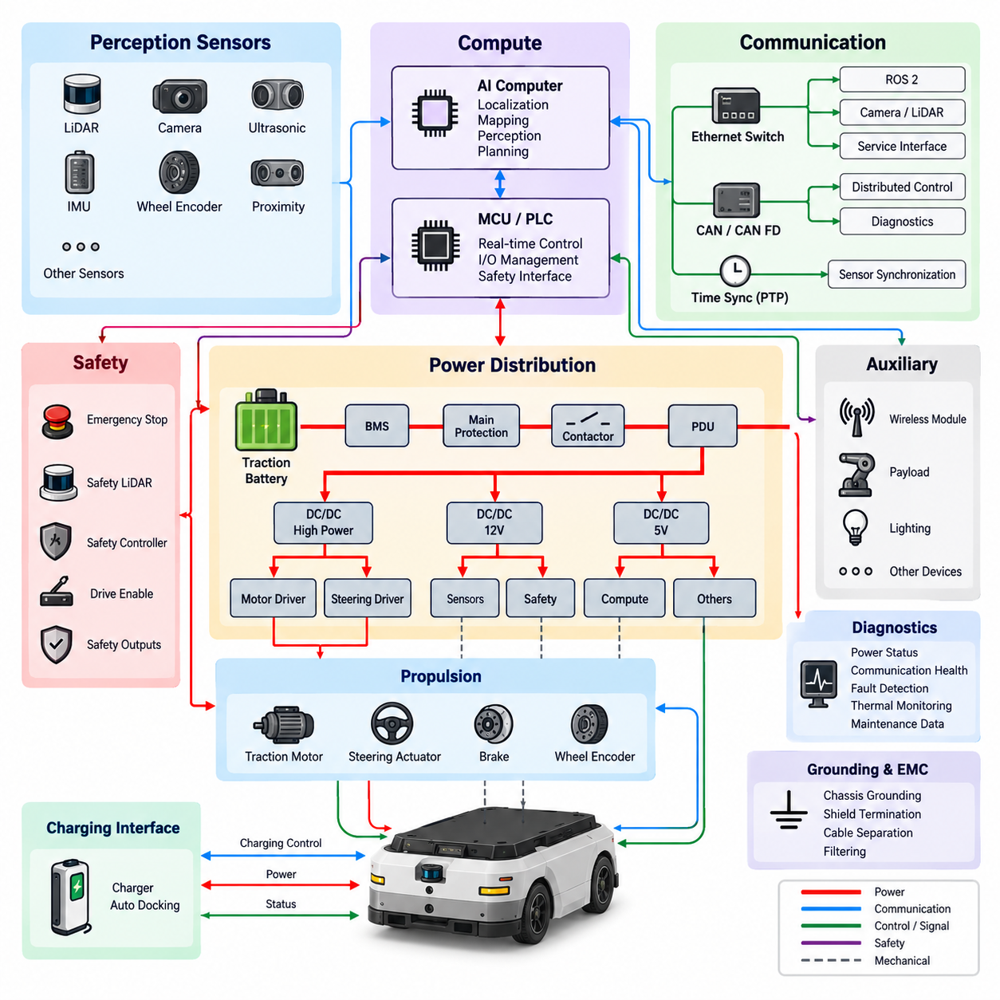
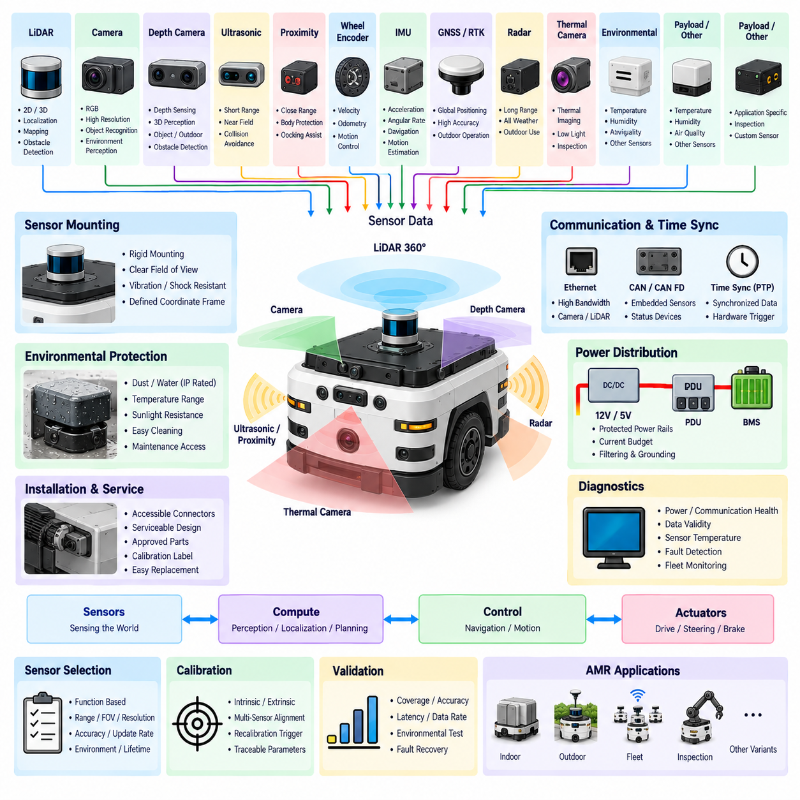
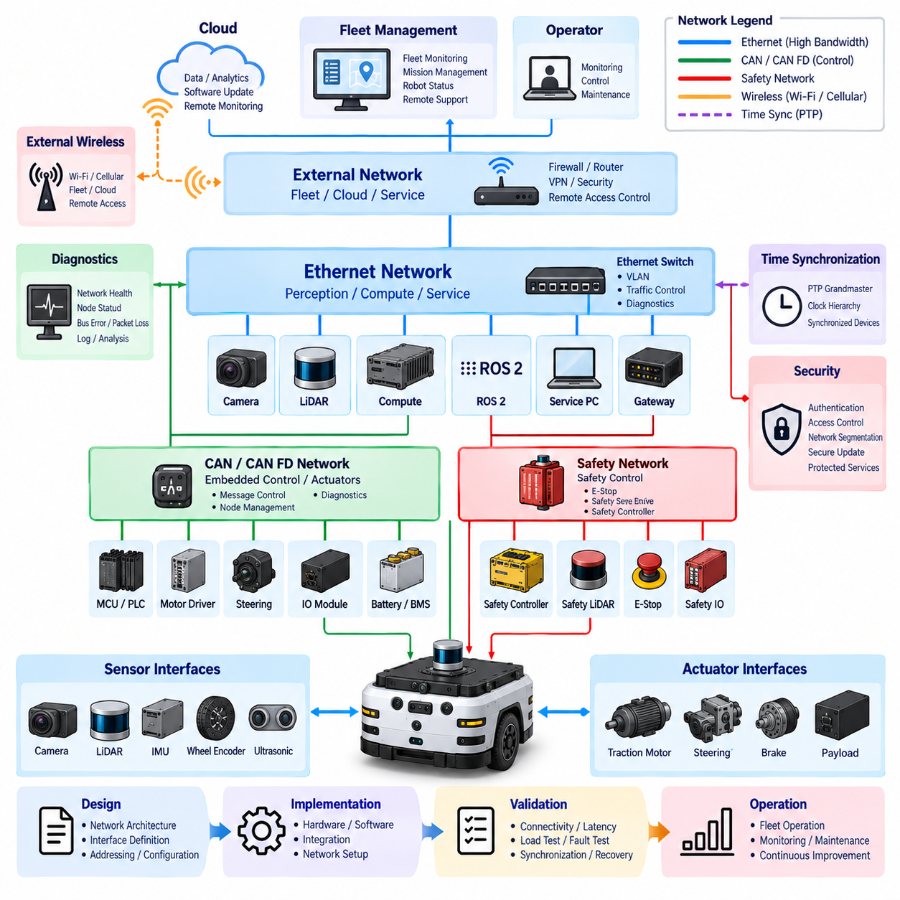
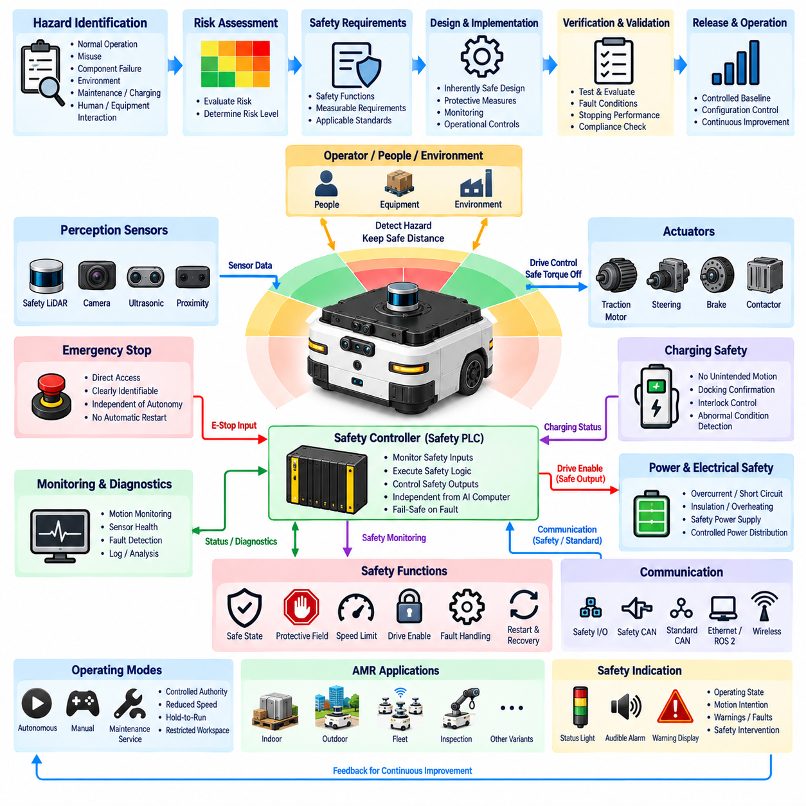
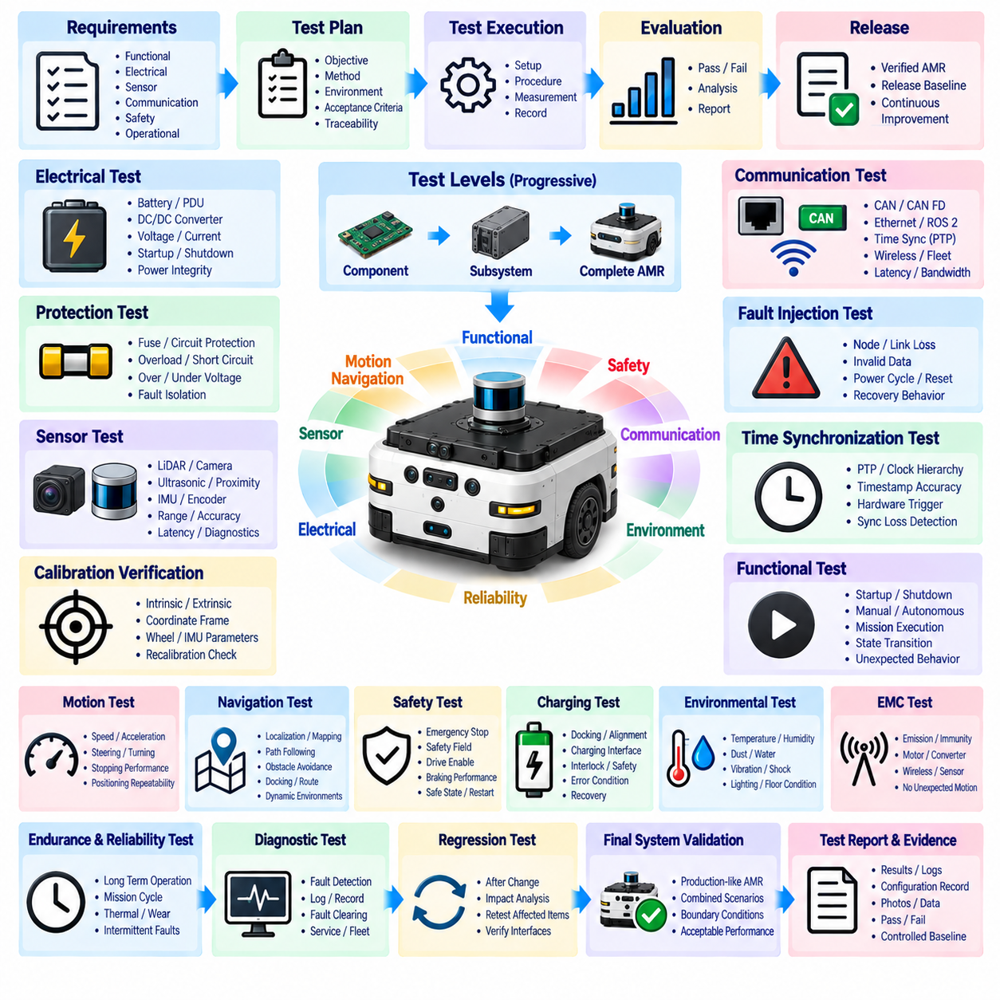

**Volume 22. Hills Robotics Engineering Standards**

# Chapter 09. HRS-009 AMR

## 09.01. AMR EE Architecture Standard

{width="7.268055555555556in" height="7.268055555555556in"}

The AMR electrical and electronic architecture shall define a modular system structure that separates propulsion, energy storage, safety, perception, computing, communication, and auxiliary functions while maintaining controlled interfaces between them. The architecture shall support indoor AMRs as the baseline configuration and allow product-specific extension without requiring fundamental redesign of the common electrical platform.

The primary power architecture shall originate at the traction battery and provide controlled distribution through the battery management system, main protection device, contactor or equivalent switching element, and power distribution unit. High-current propulsion loads shall be separated from sensitive computing and sensor loads, while DC/DC converters shall generate regulated low-voltage rails required by controllers, communication equipment, sensors, and auxiliary devices.

Every electrical load shall be assigned to a documented power domain with defined nominal voltage, maximum operating current, transient current, protection rating, grounding method, connector interface, and shutdown behavior. Power-domain boundaries shall prevent a failure in nonessential equipment from unnecessarily disabling propulsion control, braking, safety sensing, or the emergency-stop chain. Design margins shall consider startup surge, motor regeneration, and battery voltage variation.

The propulsion domain shall include traction motor drivers, steering actuators where applicable, braking interfaces, wheel encoders, and associated control electronics. Motor power wiring shall be physically and electrically managed to reduce conducted and radiated interference into perception and communication systems. Propulsion controllers shall expose deterministic status information including enable state, speed, current, temperature, fault condition, and communication health to the supervisory controller.

The safety architecture shall remain functionally distinguishable from the normal autonomous-control path. Emergency-stop devices, safety LiDAR or equivalent protective sensors, safety controllers, drive-enable circuits, and safety-rated outputs shall be arranged so that loss or malfunction of the main AI computer does not prevent transition to the defined safe state. Safety functions shall not depend exclusively on ROS 2, general-purpose Ethernet, or application software execution.

The compute architecture shall separate real-time machine control from high-level autonomy whenever practical. An MCU, PLC, or dedicated controller may manage deterministic I/O and actuator supervision, while an edge computer or GPU platform executes localization, mapping, perception, planning, and AI workloads. Compute interfaces shall define boot sequence, watchdog behavior, heartbeat monitoring, fault recovery, shutdown control, and the authority relationship between autonomous and low-level controllers.

The perception domain may incorporate 2D or 3D LiDAR, depth or RGB cameras, ultrasonic sensors, IMUs, wheel odometry, proximity devices, and application-specific sensors. Sensor interfaces shall provide sufficient bandwidth, synchronization capability, environmental robustness, and diagnostic visibility for the intended AMR. Sensor power shall be independently protected where practical so that a single peripheral short circuit does not collapse the complete perception system.

Communication architecture shall use protocols according to control criticality, bandwidth, timing, diagnostic, and service requirements. CAN or CAN FD is suitable for distributed embedded control and diagnostics, while Ethernet supports cameras, LiDAR, high-bandwidth sensors, compute nodes, and service interfaces. ROS 2 communication may operate over the Ethernet infrastructure, but physical network design, addressing, switching, and fault containment shall remain explicitly engineered.

Time-sensitive AMR data shall use a defined synchronization architecture. Sensors participating in localization, perception, mapping, or sensor fusion shall reference a controlled time base appropriate to their accuracy requirements. Ethernet devices should support PTP where required, while hardware trigger or equivalent deterministic synchronization shall be considered for tightly coupled cameras and other sensors. Time-source loss shall be detectable and reported as a diagnostic condition.

Grounding and EMC design shall establish controlled return-current paths between the battery, PDU, motor drives, converters, compute equipment, sensors, chassis, and communication shields. High-current switching paths shall be kept away from low-level sensor signals wherever packaging permits. Shield termination, chassis bonding, cable separation, filtering, and connector selection shall follow the applicable HRS grounding, harness, connector, and EMC requirements rather than being resolved independently at subsystem level.

The AMR harness architecture shall use identifiable branches for battery power, propulsion, safety, sensors, communication, and auxiliary equipment. Harness routing shall account for bend radius, mechanical motion, abrasion, service access, thermal exposure, electromagnetic coupling, and connector strain. Connectors shall be selected according to current rating, mating cycle, environmental exposure, vibration, ingress protection, and maintenance requirements, with unused interfaces protected against contamination.

Diagnostics shall be designed into the architecture rather than added after prototype integration. Each major controller shall provide identifiable power, communication, and fault status, and the supervisory system shall distinguish communication loss, undervoltage, overcurrent, thermal faults, sensor failure, actuator failure, emergency-stop activation, and safety-controller intervention. Diagnostic information shall support manufacturing inspection, commissioning, field troubleshooting, fleet maintenance, and failure analysis.

The architecture shall define controlled operating states including power-off, charging, initialization, standby, autonomous operation, manual or service operation, degraded operation, emergency stop, fault shutdown, and maintenance. Transitions between states shall specify which power domains and actuator enables are permitted. Unexpected restart, uncontrolled propulsion enable, or automatic recovery from a safety-critical fault shall be prevented unless explicitly justified by the product safety concept.

Charging interfaces shall coordinate the charger, battery management system, contactors, supervisory controller, and external charging equipment. The AMR shall prevent unintended traction during charging and shall monitor relevant voltage, current, temperature, connection, and charging-state information. Automatic charging systems shall additionally define electrical interlocks, docking confirmation, communication failure behavior, contact protection, and recovery procedures following interrupted charging.

The standard architecture shall support configuration scaling across AMR products by preserving stable interfaces for power, communication, safety, compute, and sensors. Optional equipment such as additional LiDAR, cameras, inspection payloads, wireless modules, or application controllers shall be incorporated through defined expansion interfaces. Product variants shall not bypass established protection, grounding, safety, diagnostic, or configuration-control rules merely to accelerate prototype integration.

Architecture documentation shall maintain traceability between the system block diagram, power distribution diagram, network topology, harness drawings, connector definitions, fuse and protection assignments, I/O tables, software interfaces, safety functions, and bill of materials. Any change affecting voltage rails, current capacity, safety paths, communication topology, grounding, sensor synchronization, or controller authority shall undergo engineering review and configuration control before release.

Compliance shall be demonstrated through design review and verification at component, subsystem, and complete-AMR levels. Verification shall confirm power integrity, voltage drop, protection coordination, grounding, communication robustness, sensor operation, safety response, startup and shutdown behavior, fault handling, charging operation, thermal performance, and diagnostic coverage. The released architecture becomes the controlled electrical baseline from which individual AMR products and subsequent revisions shall be derived.

## 09.02. AMR Sensor Standard

{width="7.268055555555556in" height="7.268055555555556in"}

The AMR sensor standard shall define a common engineering framework for selecting, integrating, powering, communicating with, calibrating, synchronizing, diagnosing, and maintaining sensors used across autonomous mobile robot platforms. The standard shall support the sensor architecture defined for indoor, outdoor, fleet, inspection, and other AMR variants while preserving reusable electrical and software interfaces between product generations.

Sensor selection shall be based on the functional role of each device rather than only its nominal performance specification. Required characteristics shall include sensing range, field of view, resolution, accuracy, update rate, latency, interface bandwidth, environmental rating, operating temperature, power consumption, diagnostic capability, and expected service life. The selected device shall provide sufficient margin for the intended operational design domain and safety concept.

The baseline perception configuration may include 2D LiDAR, 3D LiDAR, RGB cameras, depth cameras, ultrasonic sensors, proximity sensors, wheel encoders, and an inertial measurement unit. Outdoor or specialized AMRs may additionally use GNSS/RTK, radar, thermal cameras, environmental sensors, inspection instruments, or payload-specific sensing devices. Optional sensors shall use defined expansion interfaces wherever practical rather than introducing uncontrolled product-specific wiring.

LiDAR used for localization, mapping, obstacle detection, or safety functions shall be installed with an unobstructed field of view and mechanically rigid mounting. The mounting structure shall maintain sensor orientation under vibration, shock, and normal service loads. Power, Ethernet, CAN, or other communication interfaces shall be protected according to the sensor characteristics, and contamination or physical obstruction of the optical window shall be considered in installation and maintenance requirements.

Cameras shall be selected according to resolution, frame rate, dynamic range, shutter type, lens characteristics, exposure control, interface bandwidth, and environmental requirements. Camera placement shall minimize structural occlusion while maintaining the required coverage around the AMR. Cameras used for metric perception or sensor fusion shall have controlled intrinsic and extrinsic calibration, and any replacement affecting the optical geometry shall trigger calibration verification or recalibration.

Depth cameras shall be evaluated for their operating principle and environmental limitations, including sensitivity to sunlight, reflective surfaces, transparent objects, low-texture regions, and interference from similar devices. Their effective sensing envelope shall be validated in representative operating conditions rather than derived only from nominal manufacturer specifications. Depth data used for navigation shall include monitoring for invalid, saturated, missing, or geometrically inconsistent measurements.

Ultrasonic and short-range proximity sensors shall provide coverage of regions that may not be adequately observed by primary LiDAR or cameras, particularly near the robot body. Sensor spacing, orientation, minimum detection distance, beam characteristics, and susceptibility to cross-interference shall be considered during integration. These devices shall supplement, rather than silently replace, sensing functions that require higher spatial accuracy or safety-rated performance.

Wheel encoders shall provide sufficient resolution and update frequency for velocity estimation, odometry, motion control, and localization support. Encoder signals shall be protected against electrical noise generated by motors and power electronics, and direction, scaling, wheel diameter, and gear ratio parameters shall be controlled configuration data. Detection of implausible wheel-speed relationships or loss of encoder feedback shall be incorporated into AMR diagnostics.

The IMU shall provide acceleration and angular-rate information appropriate to the required navigation and motion-estimation performance. Installation shall use a rigid mounting location with a documented coordinate frame and known relationship to the AMR reference frame. Bias, scale factor, axis alignment, temperature behavior, vibration sensitivity, and initialization shall be considered, while calibration parameters shall remain traceable to the specific sensor and robot configuration.

AMRs requiring outdoor positioning may integrate GNSS and real-time kinematic positioning. Antenna placement shall consider sky visibility, multipath, electromagnetic interference, cable loss, and mechanical protection. Position quality shall not be represented by coordinates alone; fix type, correction status, satellite information, estimated uncertainty, and communication health shall be available to the navigation system so degraded positioning can be detected and managed.

Sensor power distribution shall use documented voltage rails, current budgets, protection devices, connector assignments, and grounding methods consistent with the AMR electrical architecture. High-bandwidth and precision sensors should be isolated from electrically noisy propulsion loads through appropriate power-domain design, filtering, routing, and grounding. A short circuit or internal failure of one noncritical sensor should not cause uncontrolled loss of unrelated sensing or computing functions.

Sensor communication interfaces shall be selected according to bandwidth, determinism, cable length, diagnostic requirements, and device capability. Ethernet is preferred for high-data-rate cameras and LiDAR, while CAN or CAN FD may support distributed embedded sensors and status devices. Other interfaces may be used when technically justified, but interface conversion shall not obscure fault detection, timing behavior, configuration ownership, or service diagnostics.

Sensors contributing to a common perception or localization solution shall use a controlled time synchronization strategy. Ethernet sensors should support PTP when synchronization accuracy requires it, while hardware triggering may be applied to cameras or tightly coupled sensing groups. Timestamp origin, clock domain, synchronization accuracy, and behavior following loss of synchronization shall be defined so software can distinguish valid synchronized data from degraded measurements.

Every sensor shall have a defined coordinate frame and mounting reference. The relationship between sensor frames and the AMR base reference frame shall be maintained through controlled calibration parameters. Multi-sensor systems shall preserve extrinsic transformations for LiDAR-to-camera, camera-to-camera, IMU-to-base, and other required relationships. Mechanical removal, impact, mounting adjustment, sensor replacement, or structural modification shall be evaluated as potential recalibration triggers.

Sensor diagnostics shall identify at minimum power loss, communication loss, initialization failure, invalid data, abnormal temperature, synchronization failure, and device-reported faults where supported. The supervisory system shall monitor sensor heartbeat or data freshness and distinguish complete sensor loss from degraded measurement quality. Diagnostic information shall be available for commissioning, maintenance, fleet monitoring, troubleshooting, and field failure analysis.

Environmental integration shall account for dust, water, condensation, vibration, shock, temperature, sunlight, electromagnetic interference, cleaning agents, and mechanical impact according to the AMR application. Externally exposed sensors shall use suitable ingress protection and mounting protection without degrading the required field of view. Optical surfaces shall remain accessible for inspection and cleaning, and maintenance procedures shall define conditions requiring cleaning, replacement, or functional verification.

Sensor installation shall maintain serviceability throughout the product lifecycle. Connectors, mounting fasteners, adjustment points, identification labels, and calibration references shall remain accessible without unnecessary disassembly of unrelated systems. Replacement sensors shall conform to approved part numbers or formally qualified alternatives, and firmware, hardware revision, calibration data, network configuration, and installation orientation shall be controlled to prevent unnoticed configuration mismatch.

Sensor validation shall be performed at component, subsystem, and complete-AMR levels under representative operating conditions. Verification shall confirm coverage, range, accuracy, latency, data rate, synchronization, calibration stability, communication robustness, environmental performance, fault detection, and recovery behavior. The released sensor configuration shall become a controlled baseline linked to the AMR architecture, calibration records, software configuration, test evidence, and applicable HRS engineering standards.

## 09.03. AMR Communication Standard

{width="7.268055555555556in" height="7.268055555555556in"}

The AMR communication standard shall define a common network architecture for reliable exchange of control, perception, safety, diagnostic, fleet, and service information across autonomous mobile robot platforms. Communication design shall maintain clear separation between embedded control networks, high-bandwidth perception networks, safety-related interfaces, and external connectivity while providing controlled gateways between domains. The architecture shall remain scalable across indoor, outdoor, inspection, and fleet AMR configurations.

Communication technologies shall be selected according to functional criticality, bandwidth, latency, determinism, topology, cable length, environmental conditions, diagnostic requirements, and interoperability. CAN or CAN FD shall normally support distributed embedded controllers and actuator interfaces, while Ethernet shall support high-bandwidth sensors, compute nodes, gateways, and service equipment. Wireless technologies shall primarily support fleet, cloud, supervisory, and operational connectivity rather than uncontrolled substitution for deterministic internal links.

CAN networks shall use controlled bit rates, message identifiers, node addressing, termination, bus loading, and physical-layer implementation. Message allocation shall prevent identifier conflicts between product variants and optional equipment. Critical control messages shall use appropriate transmission periods, timeout supervision, alive counters, validity information, and error handling. Network utilization shall maintain sufficient engineering margin so that transient traffic or diagnostic activity does not compromise required control communication.

CAN FD may be used when conventional CAN payload capacity or bandwidth is insufficient while deterministic embedded communication remains required. Arbitration and data-phase rates shall be documented for each network, and all connected nodes shall be verified for compatible timing parameters. Migration from CAN to CAN FD shall be controlled at system level because mixed node capability, gateway behavior, diagnostic tools, and physical-layer limitations can otherwise introduce difficult-to-detect integration failures.

CAN communication definitions shall be maintained through controlled network databases such as DBC files where applicable. Signal name, message identifier, bit position, length, byte order, scaling, offset, unit, valid range, transmission rate, timeout behavior, and sender or receiver ownership shall be explicitly defined. Network database revisions shall remain synchronized with controller software and diagnostic documentation so that communication changes cannot be introduced independently by individual subsystem teams.

Ethernet shall provide the primary high-bandwidth backbone for AMR perception and computing systems where required. Cameras, LiDAR, edge computers, gateways, and service interfaces may share switched Ethernet infrastructure when bandwidth and fault-containment requirements permit. Link speed, switch capacity, port allocation, addressing, VLAN configuration where used, multicast behavior, and expected traffic loading shall be defined and verified for the released AMR configuration.

The Ethernet topology shall avoid uncontrolled expansion through unmanaged switches or undocumented adapters. Every production network device shall have an assigned function, physical connection, power source, configuration ownership, and diagnostic method. Network loops shall be prevented unless a formally engineered redundancy mechanism is implemented. Connector and cable selection shall consider data rate, electromagnetic compatibility, vibration, routing, serviceability, and environmental exposure according to applicable HRS engineering requirements.

ROS 2 communication may operate over the AMR Ethernet infrastructure for perception, localization, mapping, planning, diagnostics, and supervisory functions. ROS 2 topics, services, and actions shall use controlled interface definitions and naming conventions. Quality of Service parameters shall be selected according to data characteristics rather than applied uniformly, considering reliability, durability, history depth, deadline, liveliness, and sensor-data behavior for each functional interface.

DDS discovery and multicast traffic shall be considered during network design because communication behavior can change substantially as the number of ROS 2 nodes, sensors, and compute devices increases. Production systems shall avoid unnecessary topic duplication, excessive discovery traffic, or unrestricted high-rate publishing. Communication performance shall be evaluated under representative system loading, including simultaneous perception processing, logging, diagnostics, remote access, and fleet communication.

Time synchronization shall provide a common temporal reference for devices whose data is combined by localization, perception, mapping, or sensor-fusion functions. Precision Time Protocol may be used for Ethernet devices requiring accurate synchronization, with a defined grandmaster, clock hierarchy, and synchronization-loss behavior. Hardware triggering may supplement network synchronization for tightly coupled sensors. Timestamp source and clock domain shall remain identifiable throughout the data path.

Safety-related communication shall be architecturally distinguished from ordinary application communication. Emergency-stop, protective sensing, drive-enable, and other safety functions shall not rely solely on non-safety-rated ROS 2 or general-purpose network messages when a dedicated safety mechanism is required. Where safety communication uses a network, the protocol, controller, timing supervision, failure detection, and transition to the safe state shall conform to the applicable AMR safety architecture and validation requirements.

Communication gateways shall provide controlled information exchange between CAN, CAN FD, Ethernet, ROS 2, safety systems, wireless networks, and external interfaces where required. A gateway shall not merely forward all available traffic between domains. Message mapping, direction, rate, timeout, filtering, diagnostic behavior, and fault containment shall be explicitly defined so that failures, malformed traffic, or excessive network loading in one domain do not propagate unnecessarily into another.

External wireless communication may include Wi-Fi, cellular communication, or other approved technologies for fleet management, remote monitoring, software distribution, operational reporting, and cloud connectivity. Loss of external communication shall not directly cause uncontrolled AMR motion or eliminate essential onboard safety functions. The AMR shall define autonomous behavior for communication loss, reconnection, degraded connectivity, and delayed data while maintaining local control authority.

Fleet communication shall provide standardized interfaces for robot identity, operational state, position, mission status, battery state, charging status, alarms, diagnostic information, and command exchange. Fleet-level commands shall pass through defined authorization and state validation before affecting robot behavior. Temporary loss of the fleet connection shall be distinguished from internal control-network failure, allowing the AMR to execute its specified fallback or mission-handling strategy without compromising safety.

Diagnostic communication shall support commissioning, production testing, field service, maintenance, and failure analysis. Network health information should include link state, node availability, bus errors, communication timeouts, packet loss where measurable, synchronization state, and gateway status. Diagnostic access shall be designed so that service activity cannot unintentionally overload control networks or modify safety-critical configuration without the required engineering or authorization process.

Communication security shall be considered for interfaces capable of receiving external commands, software, configuration data, or remote diagnostic requests. Authentication, access control, network segmentation, secure software update mechanisms, and protection of exposed service ports shall be applied according to product risk. Default credentials, undocumented remote-access paths, and permanently enabled development services shall not be accepted in released production configurations.

Network configuration shall be treated as controlled product data. IP addresses, CAN identifiers, DBC revisions, switch configuration, ROS 2 interface definitions, QoS parameters, gateway mappings, time-synchronization settings, wireless configuration, and diagnostic interfaces shall remain traceable to the released product configuration. Changes affecting communication behavior shall undergo engineering review, compatibility assessment, software coordination, and configuration control before implementation.

Communication validation shall be performed at component, subsystem, and complete-AMR levels under representative operational loading. Verification shall confirm connectivity, bandwidth, latency, message timing, bus utilization, packet or frame integrity, timeout handling, synchronization, gateway operation, fault isolation, communication recovery, and diagnostic visibility. Tests shall include node loss, cable disconnection, power cycling, traffic loading, synchronization loss, and external-network interruption where applicable.

The released communication architecture shall form a controlled baseline linked to the AMR electrical architecture, sensor configuration, safety concept, software interfaces, network databases, harness drawings, test evidence, and diagnostic documentation. Product variants may extend the baseline through approved interfaces, but shall not introduce undocumented protocols, unmanaged network paths, incompatible message definitions, or uncontrolled wireless connections that undermine system reliability, serviceability, or safety.

## 09.04. AMR Safety Requirement

{width="7.268055555555556in" height="7.268055555555556in"}

The AMR safety requirement shall define the mandatory principles, functions, interfaces, and verification criteria required to prevent unacceptable risk during autonomous mobile robot operation. Safety shall be treated as a system-level property spanning electrical architecture, sensors, communication, software, propulsion, braking, charging, and mechanical integration. The requirement shall support indoor AMRs while permitting controlled extension to inspection, fleet, and other AMR variants.

Safety engineering shall begin with identification of hazards associated with normal operation, foreseeable misuse, component failure, environmental conditions, maintenance, charging, manual handling, and interactions with people or equipment. Each hazard shall be evaluated through the applicable risk-assessment process, and resulting safety functions shall be assigned measurable requirements. Risk reduction shall prioritize inherently safe design, protective measures, monitoring, and operational controls.

The AMR shall provide a defined safe state for conditions in which continued autonomous operation cannot be maintained with acceptable risk. The safe state will normally require controlled removal of propulsion torque and prevention of unintended motion while preserving functions needed to maintain safety. The transition shall consider vehicle speed, payload, gradient, braking characteristics, stopping distance, steering condition, and environmental circumstances rather than relying on immediate power removal alone.

Emergency-stop functions shall provide a direct and identifiable means of initiating the required safety response. Emergency-stop devices shall be positioned for practical access according to the AMR configuration and shall remain distinguishable from normal operational controls. Activation shall command the defined safe response independently of the high-level autonomous application, and restoration of the emergency-stop device shall not by itself cause automatic restart or renewed propulsion.

The safety control architecture shall remain sufficiently independent from the main AI computer and ordinary autonomy software. A dedicated safety controller, safety PLC, safety relay, or equivalent validated architecture shall supervise safety inputs and safety-related outputs where required. Failure, reboot, overload, or communication loss of the main compute platform shall not prevent the safety system from removing drive enable or otherwise commanding the defined safe state.

Protective sensing shall provide coverage appropriate to the AMR geometry, direction of travel, speed, braking performance, and operating environment. Safety LiDAR or other approved protective devices shall be positioned to detect relevant hazards before the minimum required stopping boundary is violated. Protective fields may vary with operating state or speed when supported by the safety concept, but field switching shall be deterministic, validated, and protected against unsafe configuration.

Stopping performance shall be evaluated using the complete chain from hazard detection through sensor processing, safety logic, communication, actuator response, and mechanical deceleration. Safety distance shall account for detection latency, controller response time, network delay where applicable, drive-disable time, brake engagement, maximum expected speed, surface condition, vehicle mass, payload, and engineering margin. Nominal braking distance alone shall not be accepted as the safety stopping distance.

Drive-enable architecture shall ensure that propulsion can be energized only when required safety conditions are satisfied. Safety-related outputs shall control the appropriate motor-driver enable, contactor, brake, or equivalent mechanism according to the product architecture. Loss of safety-controller power, broken safety wiring, invalid safety communication, or detected internal safety fault shall result in the defined fail-safe response unless another behavior is explicitly justified by the safety analysis.

Safety-related communication shall be separated from ordinary application communication according to its required integrity. ROS 2 messages, standard Ethernet traffic, wireless commands, or non-safety CAN communication shall not be the sole mechanism for a safety function requiring higher integrity. When networked safety communication is used, timeout supervision, sequence checking, data integrity, source identification, fault detection, and safe-state transition behavior shall be defined and validated.

The AMR shall monitor critical motion information needed to detect unsafe behavior. Depending on the product architecture, this may include commanded velocity, measured wheel speed, steering state, braking status, motor-driver state, safety-field status, and motion while drive enable is removed. Implausible relationships between commanded and measured motion shall generate an appropriate fault response so that unintended acceleration, continued motion, or actuator-control failure can be detected.

Safety functions shall consider sensor faults including communication loss, contamination, obstruction, misalignment, invalid measurements, synchronization loss, and internal device diagnostics. A safety-related sensor shall not silently transition from valid protection to unavailable protection without detection. Where degraded operation is permitted, the allowable speed, direction, functionality, protective field, warning state, and recovery conditions shall be explicitly defined rather than left to application-level interpretation.

The electrical safety design shall protect against overcurrent, short circuit, abnormal voltage, overheating, insulation failure where applicable, and unintended energization. Battery, PDU, DC/DC converters, motor drivers, charging circuits, and safety controllers shall use coordinated protection appropriate to their energy level and failure consequences. Safety-related power supplies shall be monitored or designed so that loss or degradation produces a predictable system response.

Charging safety shall prevent unintended AMR motion and hazardous electrical conditions while connected to manual or automatic charging equipment. Charging state, docking confirmation, battery status, contactor state, and relevant interlocks shall be coordinated before charging energy is enabled. Automatic charging interfaces shall consider contact alignment, foreign objects, abnormal temperature, communication loss, interrupted charging, and recovery without permitting unexpected propulsion activation.

Manual, maintenance, and service modes shall have explicitly controlled authority and motion behavior. Service tools or diagnostic interfaces shall not bypass safety functions merely for convenience. Where maintenance requires actuator movement, reduced speed, hold-to-run control, restricted workspace, additional supervision, or other protective measures shall be applied according to the identified risk. Mode selection and active safety restrictions shall be clearly observable by service personnel.

The AMR shall provide visual, audible, or other appropriate indications for operating state, motion intention, warnings, faults, emergency-stop activation, and safety intervention where required by the product risk assessment. Indicators shall communicate meaningful state information without becoming the primary protective measure. Warning devices shall remain distinguishable in the intended operating environment and shall not be used as a substitute for required protective sensing or automatic stopping functions.

Restart and recovery behavior shall be explicitly defined following emergency stop, protective-field intrusion, power interruption, communication failure, controller reset, charging interruption, and safety-system fault. Automatic recovery may be permitted only when the safety concept demonstrates that it cannot initiate hazardous motion. Conditions requiring manual acknowledgement, fault clearing, reinitialization, localization confirmation, or physical inspection shall be documented and consistently implemented.

Safety configuration shall be treated as controlled product data. Safety-controller programs, protective-field definitions, speed limits, stopping parameters, safety I/O assignments, network configuration, firmware revisions, diagnostic thresholds, and approved bypass conditions shall remain traceable to the released AMR configuration. Changes affecting these parameters shall require documented review, risk assessment, verification, and configuration control before deployment.

Safety validation shall demonstrate the required behavior under normal operation and credible fault conditions at subsystem and complete-AMR levels. Testing shall include emergency-stop activation, protective-field intrusion, sensor loss, communication interruption, controller failure, power cycling, drive-enable faults, braking response, maximum permitted speed, charging faults, and defined degraded modes. Measured response and stopping performance shall be compared with the established safety requirements.

The released safety configuration shall form a controlled baseline linked to the AMR electrical architecture, sensor standard, communication standard, hazard analysis, safety functions, wiring documentation, software configuration, calibration data, and validation evidence. Product variants may extend this baseline only through reviewed safety engineering, ensuring that changes in mass, speed, payload, sensors, compute, propulsion, operating environment, or mission do not invalidate the established safety assumptions.

## 09.05. AMR Test Requirement

{width="7.268055555555556in" height="7.268055555555556in"}

The AMR test requirement shall define a structured verification and validation framework for demonstrating that an autonomous mobile robot satisfies its released electrical, sensor, communication, safety, control, and operational requirements. Testing shall be performed progressively from component and subsystem levels to the complete AMR so that failures can be isolated efficiently and system-level interactions can be evaluated under representative operating conditions.

Each test shall be traceable to one or more approved engineering requirements and shall define its objective, test configuration, equipment, environmental conditions, input conditions, procedure, expected behavior, acceptance criteria, measured results, and final disposition. Test evidence shall identify the AMR hardware and software configuration used during execution so that results remain reproducible and applicable to the released product baseline.

Electrical testing shall verify battery interfaces, power distribution, DC/DC converters, protection devices, contactors, grounding, voltage rails, current consumption, startup behavior, shutdown behavior, and abnormal electrical conditions. Measurements shall confirm acceptable voltage drop and power integrity under representative idle, acceleration, steering, braking, sensor-processing, charging, and maximum-load conditions, including transient events that may expose marginal electrical design.

Protection testing shall verify fuse, circuit protection, PDU, battery, and power-domain behavior under credible overload, short-circuit, undervoltage, overvoltage, and component-fault conditions where safe testing methods permit. The test shall demonstrate that faults are isolated according to the electrical architecture and that failure of a noncritical branch does not unnecessarily disable unrelated safety, control, perception, or computing functions.

Sensor testing shall verify the installed performance of LiDAR, cameras, depth sensors, ultrasonic sensors, proximity sensors, wheel encoders, IMUs, and other configured devices. Tests shall evaluate coverage, sensing range, field of view, accuracy, update rate, latency, data validity, mounting stability, and diagnostic behavior. Sensor performance shall be evaluated on the installed AMR rather than relying solely on component manufacturer specifications.

Calibration verification shall confirm that sensor coordinate frames, intrinsic parameters, extrinsic transformations, wheel parameters, IMU alignment, and other calibration data correspond to the physical AMR configuration. Tests shall detect unacceptable errors caused by sensor replacement, mechanical adjustment, structural tolerance, impact, or configuration mismatch. Recalibration triggers and acceptance limits shall follow the applicable HRS calibration requirements.

Communication testing shall verify CAN, CAN FD, Ethernet, ROS 2, gateway, time-synchronization, wireless, fleet, and diagnostic interfaces used by the released AMR configuration. Verification shall include connectivity, addressing, message definitions, timing, latency, bandwidth, bus utilization, packet or frame integrity, timeout behavior, and recovery. Representative peak traffic shall be applied to confirm that communication remains stable under realistic system loading.

Fault-injection testing shall evaluate communication behavior when nodes are disconnected, powered off, restarted, delayed, or generate invalid or missing data. Cable disconnection, Ethernet link loss, CAN errors, synchronization loss, gateway interruption, wireless loss, and fleet disconnection shall be evaluated where applicable. The AMR shall detect failures and transition to the specified normal, degraded, fallback, or safe behavior without uncontrolled motion.

Time-synchronization testing shall verify the temporal alignment required between sensors and compute nodes used for localization, perception, mapping, and sensor fusion. PTP performance, hardware triggering, timestamps, clock hierarchy, synchronization accuracy, and loss-of-synchronization detection shall be evaluated according to the implemented architecture. Recorded data shall demonstrate that synchronization error remains within the limits defined for the relevant functions.

Functional testing shall verify startup, initialization, standby, manual operation, autonomous operation, mission execution, stopping, shutdown, charging, recovery, and maintenance modes. State transitions shall be exercised under valid and invalid conditions to confirm that propulsion, braking, sensors, compute systems, and auxiliary equipment are enabled only when permitted. Unexpected restart or unintended actuator activation shall be treated as a test failure.

Motion testing shall evaluate acceleration, deceleration, commanded speed, measured speed, steering response where applicable, odometry, straight-line travel, turning behavior, positioning repeatability, and stopping performance. Tests shall consider representative vehicle mass, payload, floor conditions, direction of travel, and operating speed. Differences between commanded and measured motion shall remain within defined limits and shall not invalidate localization or safety assumptions.

Navigation testing shall verify localization, mapping, path following, obstacle detection, obstacle avoidance, docking, route completion, and recovery from representative disturbances. Test environments shall include expected aisles, intersections, walls, equipment, people, static obstacles, and dynamic obstacles according to the operational design domain. Performance shall be evaluated repeatedly to distinguish reliable behavior from isolated successful demonstrations.

Safety testing shall verify emergency-stop functions, protective sensing, safety-field behavior, drive enable, braking, safety-controller operation, warning indications, restart restrictions, and transition to the defined safe state. Tests shall include credible faults such as sensor loss, controller interruption, communication failure, and power cycling. Measured safety response and stopping distance shall satisfy the limits established by the AMR safety requirements.

Charging tests shall verify manual or automatic charging interfaces, docking confirmation, battery and charger communication, contactor sequencing, electrical interlocks, charging-state reporting, and prevention of unintended motion. Tests shall also evaluate interrupted charging, abnormal docking, communication loss, power interruption, and recovery. Charging faults shall not create hazardous electrical conditions or automatically enable propulsion without the required authorization.

Environmental testing shall evaluate AMR operation under conditions representative of the intended application, including temperature, humidity, dust, water exposure where applicable, vibration, shock, illumination variation, electromagnetic disturbance, and floor or surface conditions. Environmental severity shall be selected according to product requirements, and testing shall verify both immediate functionality and any degradation affecting sensors, connectors, electronics, or mechanical alignment.

EMC testing shall evaluate susceptibility and emissions associated with motor drivers, DC/DC converters, switching devices, Ethernet, cameras, LiDAR, wireless equipment, and other electronic systems. The AMR shall maintain required control, sensing, communication, and safety behavior during applicable immunity testing. Temporary disturbances shall be classified according to their functional effect, and any unintended propulsion or loss of required safety protection shall be unacceptable.

Endurance and reliability testing shall exercise representative mission cycles over sufficient operating time to expose intermittent faults, thermal accumulation, connector issues, communication instability, sensor drift, actuator degradation, and software resource problems. Test cycles should include driving, turning, stopping, charging, restarting, payload operation, and repeated state transitions. Accumulated faults and maintenance interventions shall be recorded for reliability analysis.

Diagnostic testing shall verify that failures are detected, classified, recorded, and communicated with sufficient information for production, service, fleet monitoring, and failure analysis. Diagnostic records shall distinguish power, sensor, communication, actuator, thermal, synchronization, safety, and software-related faults where applicable. Fault clearing and recovery behavior shall also be verified to prevent persistent faults from being hidden by uncontrolled automatic reset.

Regression testing shall be required when changes affect hardware, software, firmware, sensors, communication definitions, calibration, safety parameters, power architecture, or mechanical integration. The regression scope shall be based on documented impact analysis rather than testing only the modified function. Previously verified interfaces and safety assumptions affected by the change shall be retested before the revised AMR configuration is approved for release.

Final system validation shall use a production-representative AMR with the intended hardware, software, firmware, calibration, network configuration, safety settings, and payload configuration. Validation shall combine normal operation, boundary conditions, representative faults, and mission-level scenarios to demonstrate that subsystem compliance results in acceptable complete-system behavior within the defined operational design domain.

Test reports, raw measurements, logs, configuration records, calibration data, photographs where required, fault records, and pass/fail decisions shall be retained as controlled verification evidence. Any deviation shall identify its technical cause, affected requirements, corrective action, and retest status. The approved test evidence shall form part of the controlled AMR release baseline linked to the applicable HRS architecture, sensor, communication, safety, and configuration documentation.
