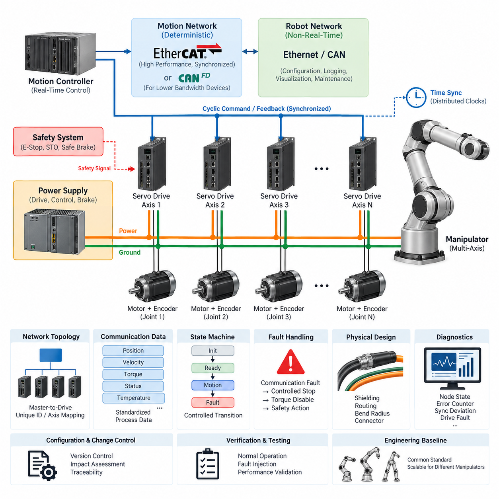
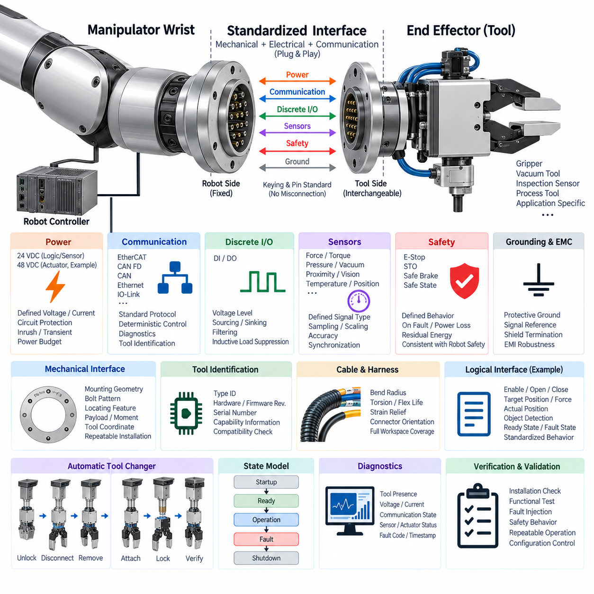
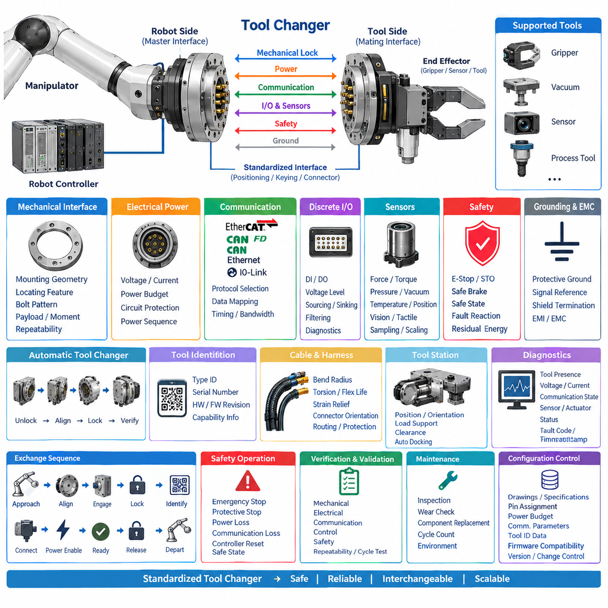
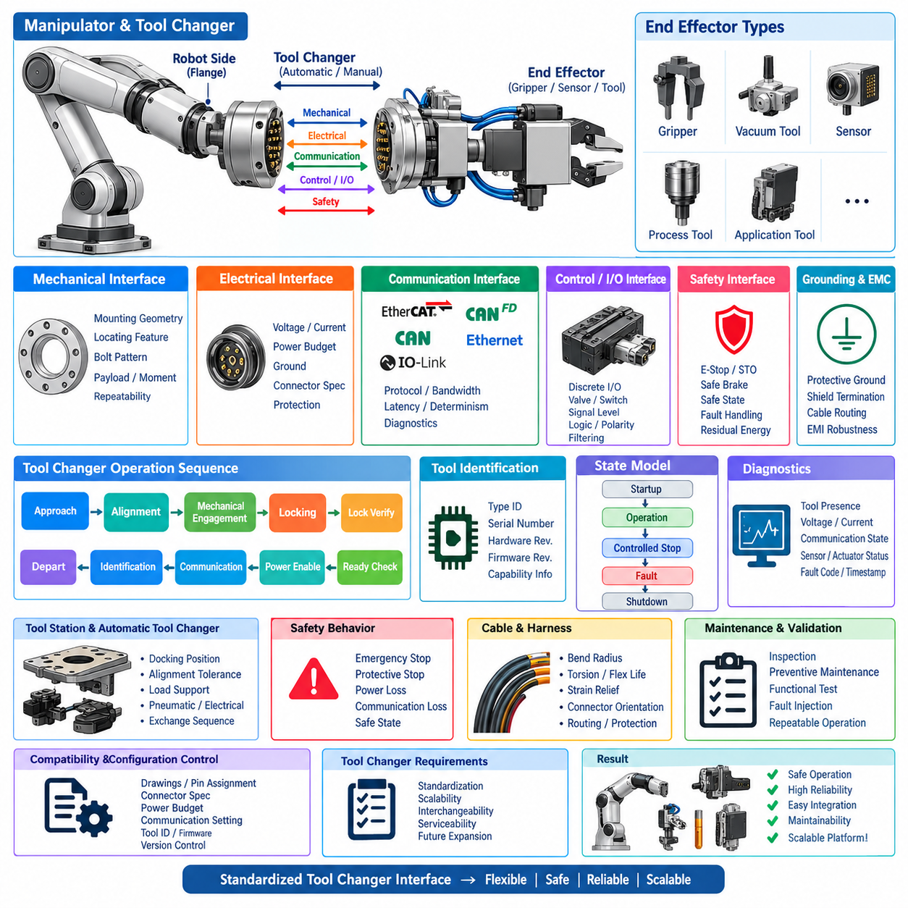
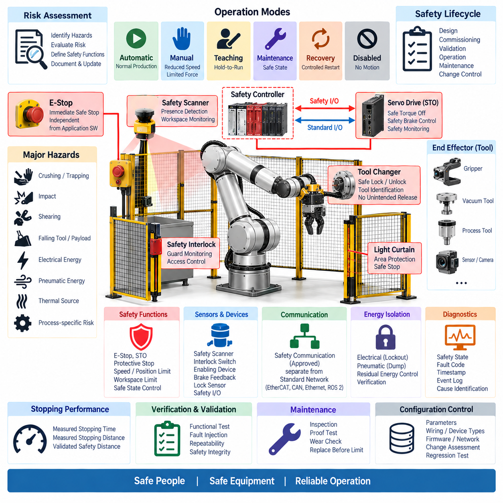
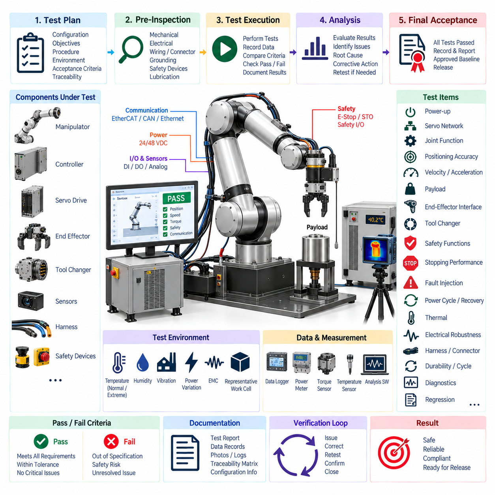

**Volume 22. Hills Robotics Engineering Standards**


# Chapter 10. HRS-010 Manipulator

##  

## 10.01. Servo Network Standard

{width="7.268055555555556in" height="7.268055555555556in"}

The servo network shall provide a deterministic and maintainable communication architecture for all manipulator joint actuators, servo drives, motor controllers, and associated feedback devices. The network shall support coordinated multi-axis motion while preserving predictable command latency, synchronized feedback acquisition, fault containment, and diagnostic visibility throughout the manipulator lifecycle.

EtherCAT shall be the preferred servo communication technology for manipulators requiring tightly synchronized multi-axis motion, high update rates, or distributed servo control. CAN FD may be applied to lower-bandwidth actuators, auxiliary axes, grippers, or mechanisms where deterministic cyclic performance remains adequate. Conventional CAN shall be restricted primarily to legacy devices or interfaces whose bandwidth and timing requirements justify its use.

The servo network architecture shall separate real-time motion traffic from general-purpose robot communication whenever practical. Joint position, velocity, torque, current, status, and synchronized control commands shall remain within the deterministic motion domain, while configuration, logging, visualization, maintenance, and non-critical application data should be handled through separate Ethernet, CAN, or higher-level robot communication paths.

A manipulator shall use a clearly defined master-to-drive topology. The motion controller or real-time control computer shall act as the authoritative source for cyclic servo commands, while each drive shall have a unique and traceable network identity. Device addresses, axis numbers, joint names, physical connector locations, and software identifiers shall be mapped consistently so that electrical drawings, software configuration, diagnostics, and service documentation identify the same axis.

Servo communication cycle time shall be established from the manipulator control bandwidth, number of axes, drive capability, payload dynamics, and required trajectory accuracy. The selected cycle shall include sufficient timing margin for command transmission, feedback collection, synchronization, controller computation, and network jitter. Cycle-time assumptions shall be documented and verified under maximum configured network load rather than only under nominal laboratory conditions.

All axes participating in coordinated motion shall operate from a common time reference or equivalent synchronization mechanism. EtherCAT Distributed Clocks or an approved functionally equivalent mechanism should be used where sub-millisecond coordination is required. Synchronization performance shall be validated at the end devices because acceptable master timing alone does not demonstrate that actual actuator command execution and feedback sampling are sufficiently aligned.

The network shall define standardized process data for each servo axis. At minimum, the interface should provide control state, commanded position or velocity or torque, measured position, measured velocity, measured torque or current, drive state, fault state, temperature information when available, and communication health. Scaling, units, signed representation, byte order, valid ranges, and update behavior shall be explicitly specified.

Servo operating states shall follow a controlled transition model covering initialization, communication establishment, servo-disabled state, servo-ready state, motion-enabled state, controlled stop, fault reaction, and recovery. Motion shall not begin solely because network communication becomes available. The controller shall verify required drive states, encoder validity, safety conditions, configuration compatibility, and axis readiness before enabling torque or accepting coordinated trajectory commands.

Communication faults shall cause deterministic and documented reactions. Loss of cyclic commands, excessive packet errors, synchronization failure, stale feedback, invalid process data, or disappearance of a servo node shall be detected within specified time limits. Each axis shall implement an appropriate watchdog, while the supervisory controller shall determine whether the resulting system reaction requires controlled deceleration, torque disable, holding behavior, or immediate safety intervention.

Network fault handling shall distinguish communication integrity from functional safety. A standard EtherCAT or CAN communication channel shall not be treated as a safety mechanism unless an approved safety protocol and certified components are explicitly implemented. Emergency stop, protective stop, safe torque off, safe brake control, and other safety functions shall follow the manipulator safety architecture independently of ordinary servo command availability.

Physical network design shall account for the electrical environment created by motors, inverters, brakes, and rapidly switched power electronics. Servo communication cables shall use approved impedance, shielding, connector, and termination practices appropriate to the selected protocol. Communication harnesses shall be routed with adequate separation from motor phase conductors and other high-noise circuits, while shield termination and grounding shall follow the applicable grounding and EMC standards.

Cable routing through moving joints shall consider continuous flexing, torsion, minimum bend radius, abrasion, strain relief, and expected manipulator motion cycles. Connectors located near joints shall be mechanically retained against vibration and repeated motion. Cable length, connector count, intermediate couplers, slip rings, and flexible cable sections shall remain within the electrical and signal-integrity limits specified for the selected servo network technology.

The servo power domain and servo communication domain shall be documented together even when physically separated. Designers shall identify drive supply voltage, control supply, encoder or feedback supply, communication interfaces, grounding references, brake circuits, and safety interfaces for every axis. Power sequencing shall prevent undefined drive behavior during startup, shutdown, brownout, controller reset, or partial restoration of manipulator electrical power.

Network utilization shall include engineering margin for future configuration changes and diagnostic traffic. The design shall not depend on theoretical maximum bandwidth as its normal operating point. Additional axes, higher feedback rates, drive diagnostics, tool-mounted actuators, and end-effector interfaces shall be considered when establishing capacity. Any topology change affecting deterministic timing shall require communication performance verification before release.

Servo network diagnostics shall expose sufficient information to identify intermittent and persistent failures without unnecessary component replacement. Required diagnostic data should include node state, communication error counters, synchronization deviation, watchdog events, drive faults, bus voltage where available, motor current, temperature, encoder status, and reset history. Diagnostic timestamps shall be correlated with the robot controller time base whenever technically practical.

Commissioning shall verify node identity, axis mapping, communication state transitions, command direction, encoder polarity, position scaling, velocity scaling, torque scaling, synchronization, watchdog behavior, and fault recovery before unrestricted motion is permitted. Initial movement shall use controlled speed and torque limits. Each joint shall be confirmed individually before coordinated multi-axis operation, and incorrect mapping shall be treated as a release-blocking defect.

Configuration data shall be version controlled as part of the manipulator electrical and software baseline. This includes servo drive parameters, network topology, device descriptions, process-data mapping, axis identifiers, communication cycle settings, synchronization parameters, watchdog values, and firmware compatibility information. Replacement of a drive or actuator shall not require undocumented manual reconstruction of production parameters.

Changes to servo firmware, network cycle time, topology, process-data mapping, actuator type, encoder configuration, or control mode shall trigger an impact assessment. Changes capable of affecting timing, stability, motion accuracy, fault response, or safety interaction shall require regression testing at axis and manipulator level. Production release shall maintain traceability between hardware revision, drive firmware, controller software, and network configuration.

Verification shall include nominal operation and intentionally introduced fault conditions. Testing shall demonstrate startup, shutdown, repeated enable and disable cycles, maximum axis activity, maximum expected network loading, communication interruption, node loss, controller restart, power cycling, synchronization disturbance, and recovery behavior. Acceptance criteria shall be measurable and reproducible rather than based solely on observation of apparently normal robot motion.

The approved servo network implementation shall ultimately provide a common engineering baseline across manipulator products while allowing controlled variation for axis count, actuator performance, and application requirements. Compliance shall be demonstrated through architecture documentation, configuration records, electrical drawings, network measurements, diagnostic evidence, and test results, enabling reliable integration with the broader robotics electrical architecture defined by the engineering standards structure.

서보 네트워크(Servo Network)는 모든 매니퓰레이터 관절 액추에이터(Joint Actuator), 서보 드라이브(Servo Drive), 모터 컨트롤러(Motor Controller) 및 관련 피드백 장치(Feedback Device)를 위한 결정론적(Deterministic)이고 유지보수 가능한 통신 아키텍처(Communication Architecture)를 제공해야 한다. 네트워크는 다축 협조 운동(Coordinated Multi-Axis Motion)을 지원하면서 예측 가능한 명령 지연시간(Command Latency), 동기화된 피드백 획득(Synchronized Feedback Acquisition), 고장 격리(Fault Containment) 및 매니퓰레이터 전체 수명주기에 걸친 진단 가시성(Diagnostic Visibility)을 보장해야 한다.

EtherCAT은 정밀하게 동기화된 다축 운동(Multi-Axis Motion), 높은 갱신 주기(Update Rate) 또는 분산 서보 제어(Distributed Servo Control)가 필요한 매니퓰레이터에서 우선적으로 적용하는 서보 통신 기술(Servo Communication Technology)이어야 한다. CAN FD는 결정론적 주기 성능(Deterministic Cyclic Performance)이 충분한 저대역폭 액추에이터(Lower-Bandwidth Actuator), 보조 축(Auxiliary Axis), 그리퍼(Gripper) 또는 기타 메커니즘에 적용할 수 있다. 기존 CAN은 대역폭과 타이밍 요구사항을 고려하여 적용이 타당한 레거시 장치(Legacy Device) 또는 인터페이스를 중심으로 제한적으로 사용해야 한다.

서보 네트워크 아키텍처(Servo Network Architecture)는 가능한 경우 실시간 운동 트래픽(Real-Time Motion Traffic)을 범용 로봇 통신(General-Purpose Robot Communication)과 분리해야 한다. 관절 위치(Joint Position), 속도(Velocity), 토크(Torque), 전류(Current), 상태(Status), 동기화된 제어 명령(Synchronized Control Command)은 결정론적 운동 도메인(Deterministic Motion Domain) 내에서 처리하고, 설정(Configuration), 로깅(Logging), 시각화(Visualization), 유지보수(Maintenance) 및 비핵심 애플리케이션 데이터(Non-Critical Application Data)는 별도의 Ethernet, CAN 또는 상위 수준 로봇 통신 경로를 통해 처리하는 것이 바람직하다.

매니퓰레이터는 명확하게 정의된 마스터-드라이브 토폴로지(Master-to-Drive Topology)를 사용해야 한다. 모션 컨트롤러(Motion Controller) 또는 실시간 제어 컴퓨터(Real-Time Control Computer)는 주기적 서보 명령(Cyclic Servo Command)의 권한 있는 소스로 동작하고, 각 드라이브에는 고유하고 추적 가능한 네트워크 식별자(Network Identity)를 부여해야 한다. 장치 주소(Device Address), 축 번호(Axis Number), 관절 이름(Joint Name), 물리적 커넥터 위치(Physical Connector Location) 및 소프트웨어 식별자(Software Identifier)를 일관되게 매핑하여 전기 도면, 소프트웨어 설정, 진단 및 서비스 문서에서 동일한 축을 식별할 수 있어야 한다.

서보 통신 주기시간(Servo Communication Cycle Time)은 매니퓰레이터의 제어 대역폭(Control Bandwidth), 축 개수(Number of Axes), 드라이브 성능(Drive Capability), 페이로드 동역학(Payload Dynamics) 및 요구 궤적 정확도(Trajectory Accuracy)를 기반으로 설정해야 한다. 선택된 주기에는 명령 전송, 피드백 수집, 동기화, 컨트롤러 연산 및 네트워크 지터(Network Jitter)를 위한 충분한 타이밍 여유(Timing Margin)가 포함되어야 한다. 주기시간에 대한 가정은 명목상 실험실 조건뿐만 아니라 최대 구성 네트워크 부하(Maximum Configured Network Load)에서도 문서화하고 검증해야 한다.

협조 운동(Coordinated Motion)에 참여하는 모든 축은 공통 시간 기준(Common Time Reference) 또는 이에 상응하는 동기화 메커니즘(Synchronization Mechanism)을 사용해야 한다. 서브 밀리초(Sub-Millisecond) 수준의 협조 제어가 요구되는 경우 EtherCAT 분산 클록(Distributed Clocks) 또는 승인된 기능적으로 동등한 메커니즘을 사용하는 것이 바람직하다. 마스터의 타이밍 성능만으로 실제 액추에이터의 명령 실행과 피드백 샘플링이 충분히 정렬되었다고 판단할 수 없으므로, 동기화 성능은 최종 장치(End Device) 수준에서 검증해야 한다.

네트워크는 각 서보 축에 대한 표준화된 프로세스 데이터(Process Data)를 정의해야 한다. 최소한 인터페이스에는 제어 상태(Control State), 명령 위치(Commanded Position) 또는 속도(Velocity) 또는 토크(Torque), 측정 위치(Measured Position), 측정 속도(Measured Velocity), 측정 토크 또는 전류(Measured Torque or Current), 드라이브 상태(Drive State), 고장 상태(Fault State), 가능한 경우 온도 정보(Temperature Information) 및 통신 건전성(Communication Health)이 포함되어야 한다. 스케일링(Scaling), 단위(Unit), 부호 표현(Signed Representation), 바이트 순서(Byte Order), 유효 범위(Valid Range) 및 갱신 동작(Update Behavior)을 명확하게 규정해야 한다.

서보 동작 상태(Servo Operating State)는 초기화(Initialization), 통신 연결 설정(Communication Establishment), 서보 비활성 상태(Servo-Disabled State), 서보 준비 상태(Servo-Ready State), 운동 활성 상태(Motion-Enabled State), 제어 정지(Controlled Stop), 고장 반응(Fault Reaction) 및 복구(Recovery)를 포함하는 통제된 상태 전이 모델(State Transition Model)을 따라야 한다. 단순히 네트워크 통신이 가능해졌다는 이유만으로 운동을 시작해서는 안 된다. 컨트롤러는 토크를 활성화하거나 협조 궤적 명령(Coordinated Trajectory Command)을 허용하기 전에 필요한 드라이브 상태, 엔코더 유효성(Encoder Validity), 안전 조건(Safety Condition), 설정 호환성(Configuration Compatibility) 및 축 준비 상태(Axis Readiness)를 확인해야 한다.

통신 고장(Communication Fault)은 결정론적이고 문서화된 반응을 발생시켜야 한다. 주기 명령(Cyclic Command) 손실, 과도한 패킷 오류(Packet Error), 동기화 실패(Synchronization Failure), 오래된 피드백(Stale Feedback), 유효하지 않은 프로세스 데이터(Invalid Process Data) 또는 서보 노드(Servo Node)의 소실은 지정된 시간 한계 내에서 검출되어야 한다. 각 축은 적절한 감시 타이머(Watchdog)를 구현해야 하며, 상위 감독 컨트롤러(Supervisory Controller)는 결과적인 시스템 반응이 제어 감속(Controlled Deceleration), 토크 차단(Torque Disable), 유지 동작(Holding Behavior) 또는 즉각적인 안전 개입(Safety Intervention) 중 무엇을 요구하는지 결정해야 한다.

네트워크 고장 처리(Network Fault Handling)는 통신 무결성(Communication Integrity)과 기능 안전(Functional Safety)을 명확하게 구분해야 한다. 승인된 안전 프로토콜(Safety Protocol)과 인증된 구성품(Certified Component)이 명시적으로 구현되지 않는 한 일반 EtherCAT 또는 CAN 통신 채널을 안전 메커니즘(Safety Mechanism)으로 취급해서는 안 된다. 비상 정지(Emergency Stop), 보호 정지(Protective Stop), 안전 토크 차단(Safe Torque Off), 안전 브레이크 제어(Safe Brake Control) 및 기타 안전 기능은 일반적인 서보 명령의 가용성과 독립적으로 매니퓰레이터 안전 아키텍처(Manipulator Safety Architecture)를 따라야 한다.

물리적 네트워크 설계(Physical Network Design)는 모터, 인버터(Inverter), 브레이크 및 고속 스위칭 전력전자 장치(Power Electronics)에 의해 형성되는 전기적 환경을 고려해야 한다. 서보 통신 케이블은 선택된 프로토콜에 적합한 승인된 임피던스(Impedance), 차폐(Shielding), 커넥터 및 종단(Termination) 방식을 사용해야 한다. 통신 하니스(Communication Harness)는 모터 상 도체(Motor Phase Conductor) 및 기타 고잡음 회로(High-Noise Circuit)와 충분한 간격을 두어 배선해야 하며, 차폐 종단(Shield Termination)과 접지(Grounding)는 관련 접지 및 전자파 적합성(EMC) 표준을 따라야 한다.

움직이는 관절을 통과하는 케이블 배선(Cable Routing)은 연속 굽힘(Continuous Flexing), 비틀림(Torsion), 최소 굽힘 반경(Minimum Bend Radius), 마모(Abrasion), 변형 방지(Strain Relief) 및 예상 매니퓰레이터 운동 사이클(Motion Cycle)을 고려해야 한다. 관절 근처에 위치한 커넥터는 진동과 반복 운동에 견딜 수 있도록 기계적으로 고정해야 한다. 케이블 길이, 커넥터 수, 중간 커플러(Intermediate Coupler), 슬립링(Slip Ring) 및 유연 케이블 구간(Flexible Cable Section)은 선택된 서보 네트워크 기술에서 규정한 전기적 및 신호 무결성(Signal Integrity) 한계 내에 있어야 한다.

서보 전력 도메인(Servo Power Domain)과 서보 통신 도메인(Servo Communication Domain)은 물리적으로 분리되어 있더라도 함께 문서화해야 한다. 설계자는 모든 축에 대해 드라이브 공급 전압(Drive Supply Voltage), 제어 전원(Control Supply), 엔코더 또는 피드백 전원, 통신 인터페이스, 접지 기준(Grounding Reference), 브레이크 회로(Brake Circuit) 및 안전 인터페이스(Safety Interface)를 식별해야 한다. 전원 시퀀싱(Power Sequencing)은 기동, 종료, 저전압 상태(Brownout), 컨트롤러 리셋 또는 매니퓰레이터 전원의 부분 복구 과정에서 정의되지 않은 드라이브 동작이 발생하지 않도록 해야 한다.

네트워크 이용률(Network Utilization)은 향후 설정 변경과 진단 트래픽(Diagnostic Traffic)을 위한 공학적 여유(Engineering Margin)를 포함해야 한다. 설계는 이론적 최대 대역폭(Maximum Bandwidth)을 정상 운전점으로 사용해서는 안 된다. 용량을 설정할 때 추가 축, 더 높은 피드백 주기, 드라이브 진단, 공구 장착 액추에이터(Tool-Mounted Actuator) 및 엔드 이펙터 인터페이스(End-Effector Interface)를 고려해야 한다. 결정론적 타이밍에 영향을 미치는 모든 토폴로지 변경(Topology Change)은 제품 릴리스 전에 통신 성능 검증을 수행해야 한다.

서보 네트워크 진단(Servo Network Diagnostics)은 불필요한 부품 교체 없이 간헐적 및 지속적 고장(Intermittent and Persistent Failure)을 식별할 수 있는 충분한 정보를 제공해야 한다. 필요한 진단 데이터에는 노드 상태(Node State), 통신 오류 카운터(Communication Error Counter), 동기화 편차(Synchronization Deviation), 감시 타이머 이벤트(Watchdog Event), 드라이브 고장, 가능한 경우 버스 전압(Bus Voltage), 모터 전류(Motor Current), 온도, 엔코더 상태 및 리셋 이력(Reset History)이 포함되어야 한다. 기술적으로 가능한 경우 진단 타임스탬프(Diagnostic Timestamp)는 로봇 컨트롤러 시간 기준과 연계되어야 한다.

시운전(Commissioning)에서는 제한 없는 운동을 허용하기 전에 노드 식별자(Node Identity), 축 매핑(Axis Mapping), 통신 상태 전이, 명령 방향(Command Direction), 엔코더 극성(Encoder Polarity), 위치 스케일링(Position Scaling), 속도 스케일링(Velocity Scaling), 토크 스케일링(Torque Scaling), 동기화, 감시 타이머 동작 및 고장 복구를 검증해야 한다. 초기 운동은 제한된 속도와 토크 조건에서 수행해야 한다. 각 관절은 다축 협조 운전 전에 개별적으로 확인해야 하며, 잘못된 매핑은 제품 릴리스를 차단하는 결함(Release-Blocking Defect)으로 취급해야 한다.

설정 데이터(Configuration Data)는 매니퓰레이터 전기 및 소프트웨어 기준선(Baseline)의 일부로 버전 관리(Version Control)되어야 한다. 여기에는 서보 드라이브 파라미터(Servo Drive Parameter), 네트워크 토폴로지, 장치 설명(Device Description), 프로세스 데이터 매핑(Process-Data Mapping), 축 식별자, 통신 주기 설정, 동기화 파라미터, 감시 타이머 값 및 펌웨어 호환성(Firmware Compatibility) 정보가 포함된다. 드라이브 또는 액추에이터 교체 시 문서화되지 않은 수작업을 통해 생산 파라미터를 다시 구성해야 하는 상황이 발생해서는 안 된다.

서보 펌웨어(Servo Firmware), 네트워크 주기시간, 토폴로지, 프로세스 데이터 매핑, 액추에이터 유형, 엔코더 설정 또는 제어 모드(Control Mode)를 변경할 경우 영향 평가(Impact Assessment)를 수행해야 한다. 타이밍, 안정성(Stability), 운동 정확도(Motion Accuracy), 고장 반응 또는 안전 상호작용(Safety Interaction)에 영향을 줄 수 있는 변경은 축 수준과 매니퓰레이터 수준에서 회귀 시험(Regression Testing)을 수행해야 한다. 생산 릴리스에서는 하드웨어 리비전(Hardware Revision), 드라이브 펌웨어, 컨트롤러 소프트웨어 및 네트워크 설정 간의 추적성(Traceability)을 유지해야 한다.

검증(Verification)은 정상 운전뿐만 아니라 의도적으로 유발한 고장 조건(Intentional Fault Condition)을 포함해야 한다. 시험에서는 기동, 종료, 반복적인 활성화 및 비활성화, 최대 축 동작(Maximum Axis Activity), 예상 최대 네트워크 부하, 통신 중단, 노드 소실, 컨트롤러 재시작, 전원 사이클링(Power Cycling), 동기화 교란(Synchronization Disturbance) 및 복구 동작을 검증해야 한다. 합격 기준(Acceptance Criteria)은 단순히 로봇 운동이 정상적으로 보이는지를 관찰하는 방식이 아니라 측정 가능하고 재현 가능한 형태로 정의해야 한다.

승인된 서보 네트워크 구현(Servo Network Implementation)은 축 개수, 액추에이터 성능 및 애플리케이션 요구사항에 따른 통제된 변형을 허용하면서도 매니퓰레이터 제품군 전체에 공통된 엔지니어링 기준선(Engineering Baseline)을 제공해야 한다. 표준 준수(Compliance)는 아키텍처 문서, 설정 기록, 전기 도면, 네트워크 측정 결과, 진단 증거 및 시험 결과를 통해 입증되어야 하며, 이를 통해 엔지니어링 표준 체계에서 정의된 보다 광범위한 로보틱스 전기 아키텍처(Robotics Electrical Architecture)와 신뢰성 있게 통합할 수 있어야 한다.

##  

## 10.02. End Effector Interface Standard

{width="7.268055555555556in" height="7.268055555555556in"}

The end-effector interface shall provide a standardized mechanical, electrical, communication, and control boundary between the manipulator wrist and interchangeable tools. The interface shall support grippers, vacuum devices, inspection sensors, process tools, and application-specific mechanisms while maintaining predictable integration behavior. Its definition shall minimize redesign when tools are replaced and preserve compatibility across approved manipulator configurations.

The interface specification shall clearly separate mechanical attachment, electrical power, communication, discrete control, sensing, grounding, and safety functions. Each function shall have defined connection points and ownership boundaries between the manipulator and end effector. Interface documentation shall identify which requirements are mandatory for every tool and which are optional according to tool class, power demand, communication method, or operational risk.

Mechanical attachment shall establish a repeatable tool coordinate relationship and withstand the maximum expected payload, static load, dynamic acceleration, external process force, and emergency-stop loading. Mounting geometry, bolt pattern, locating features, allowable moment, center-of-gravity envelope, and fastening requirements shall be specified. Tool installation shall not rely on uncontrolled mechanical compliance or undocumented alignment procedures.

The end-effector electrical interface shall provide approved voltage rails appropriate to the manipulator architecture. Typical tool power may include regulated low-voltage supplies for sensors and logic and a separate actuator supply for motors, valves, solenoids, or pumps. Available voltage, continuous current, peak current, allowable inrush current, power quality, and total tool power budget shall be explicitly defined for each interface configuration.

Every tool power output shall incorporate suitable circuit protection and shall remain within the rated capacity of the wrist harness, connector contacts, upstream protection device, and manipulator power distribution system. High-current loads shall not be connected to signal or auxiliary power contacts. Tool designers shall document normal consumption, transient demand, startup behavior, regenerative behavior where applicable, and the electrical state expected during shutdown or emergency conditions.

The connector system shall use approved industrial or robotics-grade components selected for current rating, voltage rating, mating-cycle life, vibration, environmental exposure, and service requirements. Power and signal pin assignments shall be standardized to prevent product-specific wiring variations. Unused contacts shall remain reserved or explicitly designated rather than being reassigned without controlled interface revision and compatibility assessment.

Connector keying and pin allocation shall prevent reasonably foreseeable incorrect connections. Power, ground, communication, safety, and discrete I/O contacts shall be clearly identified in drawings and service documentation. Where practical, connector sequencing shall ensure protective ground or reference connections are established appropriately relative to energized circuits. Hot-plug operation shall be prohibited unless both the electrical architecture and connected devices are specifically designed and validated for it.

Communication between the manipulator controller and an intelligent end effector shall use an approved interface such as EtherCAT, CAN FD, CAN, Ethernet, IO-Link, or another explicitly qualified protocol. Protocol selection shall reflect required control bandwidth, latency, determinism, diagnostic capability, cable complexity, and tool interoperability. Real-time actuator control shall not be assigned to a non-deterministic interface without documented performance justification.

The logical interface shall define standardized commands, states, feedback signals, and diagnostic information independently of the physical communication technology where practical. A gripper, for example, should expose consistent concepts such as enable, open, close, target position, force request, actual position, object detection, ready state, and fault state. Application software should not require unnecessary hardware-specific behavior for equivalent classes of end effectors.

Tool identification shall be supported when interchangeable or automatically exchanged tools are used. An intelligent tool should provide a unique type identifier, hardware revision, firmware revision, serial number, and relevant capability information. The manipulator controller shall verify compatibility before enabling tool motion or process power. Unknown, incompatible, or incorrectly configured tools shall enter a defined restricted or fault state rather than operating with assumed parameters.

Discrete input and output channels may be provided for simple devices such as pneumatic valves, proximity switches, vacuum switches, trigger signals, or status indicators. Voltage levels, sourcing or sinking behavior, current limits, logic polarity, default states, filtering, and diagnostic behavior shall be standardized. Outputs connected to inductive loads shall include suitable suppression so that switching transients do not disturb communication or manipulator control electronics.

End-effector sensing may include force, torque, pressure, vacuum, proximity, temperature, position, vision, tactile, or process-specific measurements. Sensor interfaces shall define supply voltage, signal type, sampling requirement, scaling, units, accuracy expectations, and synchronization needs. Sensors used directly for closed-loop motion or force control shall receive timing treatment appropriate to their control function rather than being handled only as asynchronous application data.

Grounding and shielding shall follow the manipulator grounding architecture and shall avoid creating uncontrolled return-current paths through the tool flange, communication shield, or sensor reference. Protective grounding, power return, signal reference, and cable shield functions shall be distinguished where required. Shield termination and cable routing shall be designed to tolerate electromagnetic interference generated by motors, solenoids, pumps, welding equipment, and other process loads.

The wrist harness and tool cable shall accommodate the full manipulator workspace without excessive bending, twisting, stretching, abrasion, or interference with adjacent structures. Minimum bend radius, torsional capability, strain relief, connector orientation, cable retention, and expected flex life shall be considered during design. Cable routing shall also prevent the tool harness from entering pinch points or becoming a collision hazard during normal robot motion.

Safety-related tool functions shall remain consistent with the manipulator safety architecture. Removal of ordinary communication shall not be assumed to provide a safe state unless explicitly validated. Tools presenting crushing, cutting, heating, stored-energy, vacuum, or other hazards shall define their behavior during emergency stop, protective stop, safe torque off, power loss, communication loss, and controller restart. Residual energy shall be considered in the safe-state definition.

Automatic tool changers shall control the sequence of mechanical locking, electrical connection, tool identification, communication establishment, power application, and operational enable. The controller shall verify successful mechanical retention before allowing hazardous tool operation. Unlocking shall be inhibited while conditions could cause unintended release, and the system shall provide positive status information distinguishing locked, unlocked, transitional, and fault conditions.

The end-effector state model shall provide predictable behavior during startup, normal operation, controlled stop, fault reaction, reset, and shutdown. Power restoration or communication recovery shall not automatically initiate hazardous motion. Command values and output states after reset shall be defined, and stale commands shall not be reused without validation. The manipulator controller shall confirm tool readiness before resuming coordinated robot operation.

Diagnostic information shall support rapid isolation of failures at the tool, connector, harness, communication, and power levels. Where supported, diagnostics should include tool presence, supply voltage, current consumption, communication state, sensor validity, actuator status, temperature, fault code, and cycle count. Fault records should use timestamps correlated with the robot controller so that manipulator and end-effector events can be analyzed together.

Commissioning shall verify mechanical installation, connector engagement, pin assignment, grounding, power polarity, voltage level, current consumption, communication configuration, tool identification, command direction, sensor scaling, state transitions, and safety behavior. Initial operation shall use restricted speed, force, and power where applicable. Tool functionality shall be confirmed before unrestricted coordinated operation of the manipulator is authorized.

Interface verification shall include nominal operation and representative fault conditions such as connector interruption, communication loss, sensor failure, actuator overload, power interruption, tool removal, incorrect identification, and controller restart. Automatic tool changers shall additionally be tested for incomplete engagement and failed locking sequences. Acceptance criteria shall demonstrate repeatable mechanical, electrical, communication, control, and safety behavior.

Interface drawings, pin assignments, connector specifications, power budgets, communication parameters, tool identification data, firmware compatibility, and validation results shall be maintained under configuration and version control. Any change affecting mounting geometry, connector assignment, voltage, current capacity, protocol, data mapping, or safety behavior shall undergo an impact assessment before release to prevent incompatible combinations of manipulators and tools.

The standardized end-effector interface shall ultimately enable approved tools to be integrated, replaced, serviced, and upgraded without uncontrolled modification of the manipulator electrical architecture. Compliance shall be demonstrated through interface-control documentation, electrical drawings, mechanical definitions, configuration records, diagnostic evidence, and validation results, establishing a scalable engineering baseline for grippers, sensors, process tools, and future robotic end effectors.

엔드 이펙터 인터페이스(End-Effector Interface)는 매니퓰레이터 손목(Manipulator Wrist)과 교체 가능한 공구(Interchangeable Tool) 사이에 표준화된 기계적, 전기적, 통신 및 제어 경계(Control Boundary)를 제공해야 한다. 인터페이스는 그리퍼(Gripper), 진공 장치(Vacuum Device), 검사 센서(Inspection Sensor), 공정 공구(Process Tool) 및 애플리케이션 전용 메커니즘(Application-Specific Mechanism)을 지원하면서 예측 가능한 통합 동작을 유지해야 한다. 인터페이스 정의는 공구 교체 시 재설계를 최소화하고 승인된 매니퓰레이터 구성 간의 호환성(Compatibility)을 유지해야 한다.

인터페이스 사양(Interface Specification)은 기계적 체결(Mechanical Attachment), 전력(Electrical Power), 통신(Communication), 이산 제어(Discrete Control), 센싱(Sensing), 접지(Grounding) 및 안전(Safety) 기능을 명확하게 분리해야 한다. 각 기능에는 정의된 연결 지점(Connection Point)과 매니퓰레이터 및 엔드 이펙터 간의 책임 경계(Ownership Boundary)가 있어야 한다. 인터페이스 문서에는 모든 공구에 필수적인 요구사항과 공구 등급(Tool Class), 전력 요구량, 통신 방식 또는 운용 위험에 따라 선택적으로 적용되는 요구사항을 구분해야 한다.

기계적 체결(Mechanical Attachment)은 반복 가능한 공구 좌표 관계(Tool Coordinate Relationship)를 확보하고 최대 예상 페이로드(Payload), 정적 하중(Static Load), 동적 가속도(Dynamic Acceleration), 외부 공정력(External Process Force) 및 비상 정지 하중(Emergency-Stop Loading)을 견딜 수 있어야 한다. 장착 형상(Mounting Geometry), 볼트 패턴(Bolt Pattern), 위치 결정 형상(Locating Feature), 허용 모멘트(Allowable Moment), 무게중심 범위(Center-of-Gravity Envelope) 및 체결 요구사항을 규정해야 한다. 공구 설치는 제어되지 않은 기계적 컴플라이언스(Mechanical Compliance)나 문서화되지 않은 정렬 절차에 의존해서는 안 된다.

엔드 이펙터 전기 인터페이스(Electrical Interface)는 매니퓰레이터 아키텍처에 적합한 승인된 전압 레일(Voltage Rail)을 제공해야 한다. 일반적인 공구 전원은 센서와 로직(Logic)을 위한 안정화 저전압 전원(Regulated Low-Voltage Supply)과 모터, 밸브, 솔레노이드(Solenoid) 또는 펌프를 위한 별도의 액추에이터 전원(Actuator Supply)을 포함할 수 있다. 사용 가능한 전압, 연속 전류(Continuous Current), 피크 전류(Peak Current), 허용 돌입 전류(Allowable Inrush Current), 전원 품질(Power Quality) 및 전체 공구 전력 예산(Tool Power Budget)을 각 인터페이스 구성별로 명확하게 정의해야 한다.

모든 공구 전원 출력(Tool Power Output)은 적절한 회로 보호(Circuit Protection)를 포함해야 하며 손목 하니스(Wrist Harness), 커넥터 접점(Connector Contact), 상위 보호 장치(Upstream Protection Device) 및 매니퓰레이터 전력 분배 시스템(Power Distribution System)의 정격 용량 이내에서 사용되어야 한다. 고전류 부하(High-Current Load)를 신호 또는 보조 전원 접점에 연결해서는 안 된다. 공구 설계자는 정상 소비전력, 과도 요구전력(Transient Demand), 기동 특성, 해당되는 경우 회생 동작(Regenerative Behavior), 그리고 종료 또는 비상 상태에서 예상되는 전기적 상태를 문서화해야 한다.

커넥터 시스템(Connector System)은 전류 정격(Current Rating), 전압 정격(Voltage Rating), 결합 수명(Mating-Cycle Life), 진동, 환경 노출(Environmental Exposure) 및 정비 요구사항에 적합한 승인된 산업용 또는 로보틱스 등급(Robotics-Grade) 부품을 사용해야 한다. 제품별 배선 변형을 방지하기 위해 전원 및 신호 핀 할당(Pin Assignment)을 표준화해야 한다. 미사용 접점(Unused Contact)은 예약 상태로 유지하거나 명시적으로 용도를 지정해야 하며, 통제된 인터페이스 개정(Interface Revision)과 호환성 평가 없이 임의로 재할당해서는 안 된다.

커넥터 키잉(Connector Keying)과 핀 배치(Pin Allocation)는 합리적으로 예상 가능한 오접속을 방지해야 한다. 전원, 접지, 통신, 안전 및 이산 입출력(Discrete I/O) 접점은 도면과 서비스 문서에서 명확하게 식별되어야 한다. 가능한 경우 커넥터 접속 순서(Connector Sequencing)는 전원이 인가된 회로보다 보호 접지(Protective Ground) 또는 기준 연결이 적절하게 먼저 형성되도록 해야 한다. 핫 플러그(Hot-Plug) 동작은 전기 아키텍처와 연결 장치 모두가 이를 위해 특별히 설계되고 검증된 경우가 아니라면 금지해야 한다.

매니퓰레이터 컨트롤러와 지능형 엔드 이펙터(Intelligent End Effector) 간의 통신은 EtherCAT, CAN FD, CAN, Ethernet, IO-Link 또는 명시적으로 검증된 기타 승인 인터페이스를 사용해야 한다. 프로토콜 선택(Protocol Selection)은 요구 제어 대역폭(Control Bandwidth), 지연시간(Latency), 결정성(Determinism), 진단 기능(Diagnostic Capability), 케이블 복잡도 및 공구 상호운용성(Tool Interoperability)을 고려해야 한다. 문서화된 성능 타당성이 없는 경우 실시간 액추에이터 제어(Real-Time Actuator Control)를 비결정론적 인터페이스(Non-Deterministic Interface)에 할당해서는 안 된다.

논리 인터페이스(Logical Interface)는 가능한 경우 물리적 통신 기술과 독립적으로 표준화된 명령(Command), 상태(State), 피드백 신호(Feedback Signal) 및 진단 정보(Diagnostic Information)를 정의해야 한다. 예를 들어 그리퍼는 활성화(Enable), 열기(Open), 닫기(Close), 목표 위치(Target Position), 요구 힘(Force Request), 실제 위치(Actual Position), 물체 감지(Object Detection), 준비 상태(Ready State) 및 고장 상태(Fault State)와 같은 일관된 개념을 제공하는 것이 바람직하다. 동일한 종류의 엔드 이펙터에 대해 애플리케이션 소프트웨어가 불필요하게 하드웨어별 동작에 의존해서는 안 된다.

교체 가능하거나 자동 교환되는 공구를 사용하는 경우 공구 식별(Tool Identification)을 지원해야 한다. 지능형 공구(Intelligent Tool)는 고유 형식 식별자(Type Identifier), 하드웨어 리비전(Hardware Revision), 펌웨어 리비전(Firmware Revision), 일련번호(Serial Number) 및 관련 기능 정보(Capability Information)를 제공하는 것이 바람직하다. 매니퓰레이터 컨트롤러는 공구 운동 또는 공정 전원을 활성화하기 전에 호환성을 검증해야 한다. 알 수 없거나 호환되지 않거나 잘못 설정된 공구는 추정된 파라미터로 작동시키지 않고 정의된 제한 상태(Restricted State) 또는 고장 상태(Fault State)로 전환해야 한다.

공압 밸브(Pneumatic Valve), 근접 스위치(Proximity Switch), 진공 스위치(Vacuum Switch), 트리거 신호(Trigger Signal) 또는 상태 표시기(Status Indicator)와 같은 단순 장치에는 이산 입력 및 출력 채널(Discrete Input and Output Channel)을 제공할 수 있다. 전압 레벨, 소싱 또는 싱킹 동작(Sourcing or Sinking Behavior), 전류 제한, 논리 극성(Logic Polarity), 기본 상태(Default State), 필터링 및 진단 동작을 표준화해야 한다. 유도성 부하(Inductive Load)에 연결된 출력에는 스위칭 과도현상(Switching Transient)이 통신이나 매니퓰레이터 제어 전자장치에 영향을 주지 않도록 적절한 억제 회로(Suppression)를 적용해야 한다.

엔드 이펙터 센싱(End-Effector Sensing)에는 힘(Force), 토크(Torque), 압력(Pressure), 진공(Vacuum), 근접(Proximity), 온도(Temperature), 위치(Position), 비전(Vision), 촉각(Tactile) 또는 공정 전용 측정(Process-Specific Measurement)이 포함될 수 있다. 센서 인터페이스는 공급 전압, 신호 유형, 샘플링 요구사항, 스케일링(Scaling), 단위, 정확도 요구사항 및 동기화 요구사항을 정의해야 한다. 폐루프 운동(Closed-Loop Motion) 또는 힘 제어(Force Control)에 직접 사용되는 센서는 단순 비동기 애플리케이션 데이터가 아니라 해당 제어 기능에 적합한 타이밍 조건으로 처리해야 한다.

접지(Grounding)와 차폐(Shielding)는 매니퓰레이터 접지 아키텍처를 따라야 하며 공구 플랜지(Tool Flange), 통신 실드(Communication Shield) 또는 센서 기준(Sensor Reference)을 통해 제어되지 않은 귀환 전류 경로(Return-Current Path)가 형성되지 않도록 해야 한다. 필요한 경우 보호 접지(Protective Grounding), 전원 리턴(Power Return), 신호 기준(Signal Reference) 및 케이블 실드(Cable Shield) 기능을 구분해야 한다. 실드 종단(Shield Termination)과 케이블 배선은 모터, 솔레노이드, 펌프, 용접 장비 및 기타 공정 부하에서 발생하는 전자기 간섭(Electromagnetic Interference)을 견딜 수 있도록 설계해야 한다.

손목 하니스(Wrist Harness)와 공구 케이블(Tool Cable)은 과도한 굽힘, 비틀림, 인장, 마모 또는 주변 구조물과의 간섭 없이 매니퓰레이터의 전체 작업 영역(Workspace)을 수용해야 한다. 설계 과정에서 최소 굽힘 반경(Minimum Bend Radius), 비틀림 허용 능력(Torsional Capability), 변형 방지(Strain Relief), 커넥터 방향(Connector Orientation), 케이블 고정(Cable Retention) 및 예상 굴곡 수명(Flex Life)을 고려해야 한다. 또한 공구 하니스가 정상 로봇 운동 중 끼임 지점(Pinch Point)에 진입하거나 충돌 위험(Collision Hazard)을 발생시키지 않도록 배선해야 한다.

안전 관련 공구 기능(Safety-Related Tool Function)은 매니퓰레이터 안전 아키텍처와 일관성을 유지해야 한다. 명시적으로 검증되지 않는 한 일반 통신의 제거만으로 안전 상태(Safe State)가 확보된다고 가정해서는 안 된다. 압착(Crushing), 절단(Cutting), 가열(Heating), 저장 에너지(Stored Energy), 진공 또는 기타 위험을 발생시키는 공구는 비상 정지(Emergency Stop), 보호 정지(Protective Stop), 안전 토크 차단(Safe Torque Off), 전원 손실, 통신 손실 및 컨트롤러 재시작 시의 동작을 정의해야 한다. 안전 상태를 정의할 때 잔류 에너지(Residual Energy)도 고려해야 한다.

자동 공구 교환장치(Automatic Tool Changer)는 기계적 잠금(Mechanical Locking), 전기적 연결(Electrical Connection), 공구 식별, 통신 연결 설정(Communication Establishment), 전원 인가(Power Application) 및 운전 활성화(Operational Enable)의 순서를 제어해야 한다. 컨트롤러는 위험한 공구 동작을 허용하기 전에 기계적 체결 상태가 정상임을 확인해야 한다. 의도하지 않은 공구 분리를 유발할 수 있는 조건에서는 잠금 해제(Unlocking)를 금지해야 하며, 시스템은 잠금(Locked), 잠금 해제(Unlocked), 전이(Transitional) 및 고장(Fault) 상태를 구분하는 명확한 상태 정보를 제공해야 한다.

엔드 이펙터 상태 모델(End-Effector State Model)은 기동(Startup), 정상 운전(Normal Operation), 제어 정지(Controlled Stop), 고장 반응(Fault Reaction), 리셋(Reset) 및 종료(Shutdown) 과정에서 예측 가능한 동작을 제공해야 한다. 전원 복구 또는 통신 복구만으로 위험한 운동이 자동으로 시작되어서는 안 된다. 리셋 이후의 명령 값(Command Value)과 출력 상태(Output State)를 정의해야 하며, 오래된 명령(Stale Command)은 검증 없이 다시 사용해서는 안 된다. 매니퓰레이터 컨트롤러는 협조 로봇 운전(Coordinated Robot Operation)을 재개하기 전에 공구 준비 상태(Tool Readiness)를 확인해야 한다.

진단 정보(Diagnostic Information)는 공구, 커넥터, 하니스, 통신 및 전원 수준에서 고장을 신속하게 격리할 수 있도록 지원해야 한다. 지원되는 경우 진단 항목에는 공구 존재 여부(Tool Presence), 공급 전압, 소비 전류(Current Consumption), 통신 상태, 센서 유효성(Sensor Validity), 액추에이터 상태, 온도, 고장 코드(Fault Code) 및 사이클 횟수(Cycle Count)가 포함되는 것이 바람직하다. 매니퓰레이터와 엔드 이펙터 이벤트를 함께 분석할 수 있도록 고장 기록에는 로봇 컨트롤러와 연계된 타임스탬프(Timestamp)를 사용하는 것이 바람직하다.

시운전(Commissioning)에서는 기계적 설치, 커넥터 결합(Connector Engagement), 핀 할당, 접지, 전원 극성(Power Polarity), 전압 레벨, 소비 전류, 통신 설정, 공구 식별, 명령 방향, 센서 스케일링, 상태 전이(State Transition) 및 안전 동작을 검증해야 한다. 초기 운전은 필요한 경우 제한된 속도, 힘 및 전력 조건에서 수행해야 한다. 매니퓰레이터의 제한 없는 협조 운전을 승인하기 전에 공구 기능을 확인해야 한다.

인터페이스 검증(Interface Verification)은 정상 운전뿐만 아니라 커넥터 단선(Connector Interruption), 통신 손실, 센서 고장, 액추에이터 과부하(Actuator Overload), 전원 중단, 공구 제거, 잘못된 식별 및 컨트롤러 재시작과 같은 대표적인 고장 조건을 포함해야 한다. 자동 공구 교환장치는 불완전한 결합(Incomplete Engagement)과 잠금 실패 시퀀스(Failed Locking Sequence)를 추가로 시험해야 한다. 합격 기준(Acceptance Criteria)은 반복 가능한 기계적, 전기적, 통신, 제어 및 안전 동작을 입증할 수 있어야 한다.

인터페이스 도면(Interface Drawing), 핀 할당, 커넥터 사양, 전력 예산, 통신 파라미터, 공구 식별 데이터, 펌웨어 호환성(Firmware Compatibility) 및 검증 결과는 설정 관리(Configuration Control) 및 버전 관리(Version Control) 대상으로 유지해야 한다. 장착 형상, 커넥터 할당, 전압, 전류 용량, 프로토콜, 데이터 매핑(Data Mapping) 또는 안전 동작에 영향을 미치는 모든 변경은 호환되지 않는 매니퓰레이터와 공구 조합을 방지하기 위해 릴리스 전에 영향 평가(Impact Assessment)를 수행해야 한다.

표준화된 엔드 이펙터 인터페이스(Standardized End-Effector Interface)는 승인된 공구를 매니퓰레이터 전기 아키텍처의 통제되지 않은 변경 없이 통합, 교체, 정비 및 업그레이드할 수 있도록 해야 한다. 표준 준수(Compliance)는 인터페이스 제어 문서(Interface-Control Documentation), 전기 도면, 기계적 정의(Mechanical Definition), 설정 기록, 진단 증거 및 검증 결과를 통해 입증되어야 하며, 이를 통해 그리퍼, 센서, 공정 공구 및 향후 로봇 엔드 이펙터를 위한 확장 가능한 엔지니어링 기준선(Engineering Baseline)을 구축해야 한다.

##  

## 10.03. Tool Changer Standard

{width="7.268055555555556in" height="7.268055555555556in"}

{width="7.268055555555556in" height="7.268055555555556in"}

The tool changer shall provide a standardized, repeatable, and fail-safe mechanism for automatically or manually coupling interchangeable end effectors to a manipulator. It shall integrate mechanical locking, electrical connection, communication, identification, and safety functions into a controlled interface. The design shall permit approved tools to be exchanged without uncontrolled modification of the manipulator or tool-side architecture.

The tool changer architecture shall consist of a robot-side master interface and a tool-side mating interface with defined mechanical and electrical boundaries. Both sides shall use standardized mounting geometry, locating features, connector positions, and interface orientation. The arrangement shall prevent incorrect assembly and shall maintain compatibility among approved grippers, sensors, process tools, inspection devices, and application-specific end effectors.

Mechanical coupling shall provide sufficient retention force and stiffness for the maximum rated payload, center-of-gravity offset, acceleration, process force, vibration, and emergency-stop loading. The locking mechanism shall prevent unintended separation under all specified operating conditions. Structural ratings shall include appropriate engineering margin, and the permissible payload and moment envelope shall be documented for each approved tool changer configuration.

The coupling interface shall provide repeatable positioning between the manipulator flange and the installed tool. Locating pins, tapered surfaces, kinematic features, or equivalent alignment mechanisms shall control translational and rotational positioning before final locking. Repeatability requirements shall reflect the needs of robotic calibration, vision-guided manipulation, process accuracy, and tool-center-point consistency after repeated exchange cycles.

The locking mechanism may use pneumatic, electric, mechanical, or another approved actuation method, but its state shall be positively detectable. The system shall distinguish unlocked, engaging, locked, releasing, and fault conditions where applicable. A command to lock shall not itself be considered evidence of successful retention; the controller shall verify independent locking feedback before permitting unrestricted manipulator or tool operation.

Tool release shall be inhibited whenever release could create a hazardous condition. Unlocking shall normally require the manipulator to be within an approved exchange position, the tool to be supported by a tool station or equivalent structure, hazardous tool motion to be disabled, and the applicable process energy to be removed. Loss of ordinary control power or communication shall not cause unintended mechanical release.

The electrical interface shall connect only after sufficient mechanical alignment has been established. Connector design shall tolerate the specified mating cycles while preventing bent contacts, partial engagement, contamination, and excessive insertion force. Power, ground, communication, safety, and discrete I/O contacts shall use standardized assignments, and the interface shall comply with the applicable end-effector electrical interface requirements.

Electrical power shall be applied according to a controlled sequence. Tool power outputs shall remain disabled during uncontrolled mating or separation unless the connector system is specifically rated and validated for energized connection. After mechanical locking is confirmed, the controller may establish communication, verify tool identity and compatibility, and then enable the required power domains according to the defined startup sequence.

The tool changer shall support approved communication interfaces required by connected tools, such as EtherCAT, CAN FD, CAN, Ethernet, IO-Link, or discrete I/O. Communication continuity through the coupling interface shall satisfy the bandwidth, latency, signal-integrity, and diagnostic requirements of the selected protocol. Contact resistance, shielding, grounding, and repeated mating shall not degrade communication beyond established acceptance limits.

Automatic tool identification shall be implemented where multiple interchangeable tools are used. The tool-side interface should provide a unique tool type, serial number, hardware revision, firmware revision, and capability information where applicable. The manipulator controller shall compare the detected identity against the requested tool and approved configuration before enabling operation, preventing an incorrectly docked or incompatible tool from being used.

The automatic exchange sequence shall follow a controlled state model. A typical sequence includes approach to the tool station, alignment, mechanical engagement, locking, lock verification, electrical connection confirmation, tool identification, communication establishment, power enable, functional readiness verification, and departure. Tool removal shall execute the corresponding safe sequence in reverse while ensuring that stored energy and unsupported loads are properly controlled.

The manipulator shall not leave the tool station until successful attachment has been verified. Verification shall include the required mechanical lock signals and, where applicable, tool presence, electrical connection, communication state, identification, power status, and tool readiness. Failure of any mandatory condition shall prevent normal departure and generate a diagnostic state requiring controlled recovery rather than repeated uncontrolled attachment attempts.

Tool stations shall maintain predictable tool position and orientation for automated docking. Their mechanical design shall support the tool mass without damaging alignment features, connectors, hoses, cables, or functional surfaces. Station tolerances shall be compatible with manipulator positioning capability and tool changer capture range. The docking area shall also provide adequate clearance to avoid collisions during approach, engagement, release, and withdrawal.

Pneumatic tool changers shall define operating pressure, allowable pressure range, air quality, flow requirements, loss-of-pressure behavior, and any stored pneumatic energy. Where pneumatic pressure maintains or actuates locking, the mechanical design shall prevent unsafe release following pressure loss. Pressure switches or equivalent monitoring should be provided when pneumatic availability is necessary for reliable locking, unlocking, or tool operation.

Electrical or motor-driven locking mechanisms shall define supply voltage, peak current, actuation time, stall protection, position sensing, and behavior following power loss. The design shall prevent continuous actuator energization from becoming the sole means of retaining the tool unless explicitly justified and validated. Where stored mechanical energy is used for retention, its release behavior during service and emergency conditions shall be documented.

Safety functions shall be coordinated with the manipulator safety architecture. Emergency stop, protective stop, safe torque off, power loss, communication loss, or controller reset shall place the tool changer and attached tool into defined safe states. Tool release shall not be initiated solely by a safety stop unless release itself is the validated safe action. Residual pneumatic, electrical, gravitational, or spring energy shall be considered.

Sensors used to confirm attachment shall be positioned and designed so that false-positive lock indication is minimized. Where the consequence of unintended tool separation is significant, independent or diverse confirmation methods should be considered. Sensor plausibility shall be evaluated by the controller, and contradictory states such as simultaneous locked and unlocked indications shall be treated as faults rather than interpreted as valid operating states.

Cable, hose, and connector routing around the tool changer shall accommodate the manipulator workspace without excessive bending, torsion, abrasion, pinching, or interference. Service loops shall not enter the coupling surfaces or collision envelope. Routing shall preserve required bend radius and strain relief, while pneumatic lines and electrical conductors shall be protected from damage during repeated docking and undocking operations.

Diagnostics shall provide sufficient information to distinguish mechanical, electrical, pneumatic, communication, identification, and tool-side faults. Relevant information should include lock state, unlock state, tool presence, supply status, pneumatic pressure where applicable, communication status, detected tool identity, cycle count, fault code, and timestamp. Diagnostic events shall be correlated with manipulator controller records to support maintenance and root-cause analysis.

The tool changer shall have defined inspection and preventive maintenance requirements based on exchange-cycle count, operating environment, payload, and manufacturer limitations. Inspection shall address locking surfaces, locating features, fasteners, connector contacts, seals, pneumatic components, sensors, cables, contamination, wear, and mechanical damage. Components reaching specified wear limits shall be replaced before coupling performance becomes unreliable.

Commissioning shall verify mounting, alignment, lock and unlock operation, electrical continuity, communication, tool identification, sensor plausibility, power sequencing, and safety interlocks. Initial exchange testing shall be conducted at restricted manipulator speed and with controlled payload conditions. Multiple consecutive exchange cycles shall demonstrate repeatable attachment, identification, operation, release, and recovery before automatic production operation is authorized.

Validation shall include nominal exchanges and representative fault injection. Tests shall address incomplete engagement, failed locking, incorrect tool identity, communication interruption, power loss, pneumatic pressure loss, sensor disagreement, blocked release, controller restart, and interrupted exchange sequences. The system shall demonstrate that each fault produces a predictable state and that recovery can be performed without uncontrolled tool motion or release.

Tool changer geometry, load ratings, connector assignments, pneumatic parameters, communication configuration, identification data, firmware compatibility, inspection intervals, and validation results shall be maintained under configuration control. Changes affecting mechanical retention, interface alignment, connector design, locking logic, tool identification, or safety behavior shall undergo impact assessment and regression testing before release.

The standardized tool changer shall provide a common engineering baseline for scalable manipulator applications while supporting controlled variation in payload, tool type, communication technology, and process requirements. Compliance shall be demonstrated through mechanical drawings, interface specifications, electrical documentation, configuration records, safety analysis, diagnostic evidence, cycle testing, and validation results throughout the manipulator lifecycle.

툴 체인저(Tool Changer)는 교체 가능한 엔드 이펙터(End Effector)를 매니퓰레이터(Manipulator)에 자동 또는 수동으로 결합하기 위한 표준화되고 반복 가능하며 고장 안전(Fail-Safe) 특성을 갖춘 메커니즘을 제공해야 한다. 기계적 잠금(Mechanical Locking), 전기적 연결(Electrical Connection), 통신(Communication), 식별(Identification) 및 안전(Safety) 기능을 하나의 통제된 인터페이스로 통합해야 한다. 설계는 매니퓰레이터 또는 공구 측 아키텍처를 통제되지 않은 방식으로 변경하지 않고 승인된 공구를 교환할 수 있도록 해야 한다.

툴 체인저 아키텍처(Tool Changer Architecture)는 정의된 기계적 및 전기적 경계를 갖는 로봇 측 마스터 인터페이스(Robot-Side Master Interface)와 공구 측 결합 인터페이스(Tool-Side Mating Interface)로 구성해야 한다. 양측은 표준화된 장착 형상(Mounting Geometry), 위치 결정 형상(Locating Feature), 커넥터 위치 및 인터페이스 방향(Interface Orientation)을 사용해야 한다. 이러한 구성은 잘못된 조립을 방지하고 승인된 그리퍼(Gripper), 센서, 공정 공구(Process Tool), 검사 장치(Inspection Device) 및 애플리케이션 전용 엔드 이펙터 간의 호환성을 유지해야 한다.

기계적 결합(Mechanical Coupling)은 최대 정격 페이로드(Rated Payload), 무게중심 오프셋(Center-of-Gravity Offset), 가속도, 공정력(Process Force), 진동 및 비상 정지 하중(Emergency-Stop Loading)에 대해 충분한 유지력(Retention Force)과 강성(Stiffness)을 제공해야 한다. 잠금 메커니즘(Locking Mechanism)은 규정된 모든 운전 조건에서 의도하지 않은 분리를 방지해야 한다. 구조 정격(Structural Rating)에는 적절한 공학적 여유(Engineering Margin)를 포함해야 하며, 각 승인된 툴 체인저 구성에 대해 허용 페이로드와 모멘트 범위(Moment Envelope)를 문서화해야 한다.

결합 인터페이스(Coupling Interface)는 매니퓰레이터 플랜지(Manipulator Flange)와 장착된 공구 사이에서 반복 가능한 위치 정밀도를 제공해야 한다. 위치 결정 핀(Locating Pin), 테이퍼 표면(Tapered Surface), 키네마틱 형상(Kinematic Feature) 또는 이에 상응하는 정렬 메커니즘(Alignment Mechanism)은 최종 잠금 전에 병진 및 회전 위치를 제어해야 한다. 반복 정밀도(Repeatability) 요구사항은 반복적인 교환 사이클 이후에도 로봇 캘리브레이션(Robotic Calibration), 비전 유도 조작(Vision-Guided Manipulation), 공정 정확도(Process Accuracy) 및 공구 중심점(Tool Center Point) 일관성 요구를 충족해야 한다.

잠금 메커니즘은 공압식(Pneumatic), 전기식(Electric), 기계식(Mechanical) 또는 기타 승인된 구동 방식을 사용할 수 있지만 그 상태를 확실하게 검출할 수 있어야 한다. 시스템은 해당되는 경우 잠금 해제(Unlocked), 체결 중(Engaging), 잠금(Locked), 해제 중(Releasing) 및 고장(Fault) 상태를 구분해야 한다. 잠금 명령 자체를 정상적인 유지 상태의 증거로 간주해서는 안 되며, 컨트롤러는 제한 없는 매니퓰레이터 또는 공구 운전을 허용하기 전에 독립적인 잠금 피드백(Locking Feedback)을 확인해야 한다.

공구 해제(Tool Release)가 위험한 상태를 발생시킬 수 있는 경우 해제 동작을 금지해야 한다. 잠금 해제(Unlocking)는 일반적으로 매니퓰레이터가 승인된 교환 위치(Exchange Position)에 있고, 공구가 공구 스테이션(Tool Station) 또는 이에 상응하는 구조물에 의해 지지되며, 위험한 공구 운동이 비활성화되고, 관련 공정 에너지(Process Energy)가 제거된 상태에서만 허용해야 한다. 일반 제어 전원 또는 통신의 손실로 인해 의도하지 않은 기계적 해제가 발생해서는 안 된다.

전기 인터페이스(Electrical Interface)는 충분한 기계적 정렬(Mechanical Alignment)이 이루어진 이후에만 연결되어야 한다. 커넥터 설계는 규정된 결합 사이클(Mating Cycle)을 견디면서 접점 휨(Bent Contact), 불완전 결합(Partial Engagement), 오염(Contamination) 및 과도한 삽입력(Excessive Insertion Force)을 방지해야 한다. 전원, 접지, 통신, 안전 및 이산 입출력(Discrete I/O) 접점은 표준화된 할당 방식을 사용해야 하며, 인터페이스는 관련 엔드 이펙터 전기 인터페이스 요구사항을 준수해야 한다.

전력(Electrical Power)은 통제된 순서(Controlled Sequence)에 따라 인가해야 한다. 커넥터 시스템이 전원이 인가된 상태에서의 연결을 위해 특별히 정격화되고 검증된 경우를 제외하면, 통제되지 않은 결합 또는 분리 과정에서는 공구 전원 출력을 비활성화 상태로 유지해야 한다. 기계적 잠금이 확인된 이후 컨트롤러는 통신을 설정하고 공구 식별 및 호환성을 확인한 다음 정의된 기동 순서(Startup Sequence)에 따라 필요한 전원 도메인(Power Domain)을 활성화할 수 있다.

툴 체인저는 연결된 공구에서 요구되는 EtherCAT, CAN FD, CAN, Ethernet, IO-Link 또는 이산 입출력과 같은 승인된 통신 인터페이스를 지원해야 한다. 결합 인터페이스를 통과하는 통신 연속성(Communication Continuity)은 선택된 프로토콜의 대역폭(Bandwidth), 지연시간(Latency), 신호 무결성(Signal Integrity) 및 진단 요구사항을 충족해야 한다. 접촉 저항(Contact Resistance), 차폐(Shielding), 접지 및 반복적인 결합으로 인해 통신 성능이 설정된 합격 한계(Acceptance Limit) 이하로 저하되어서는 안 된다.

여러 개의 교체 가능한 공구를 사용하는 경우 자동 공구 식별(Automatic Tool Identification)을 구현해야 한다. 공구 측 인터페이스는 가능한 경우 고유 공구 형식(Tool Type), 일련번호(Serial Number), 하드웨어 리비전(Hardware Revision), 펌웨어 리비전(Firmware Revision) 및 기능 정보(Capability Information)를 제공하는 것이 바람직하다. 매니퓰레이터 컨트롤러는 운전을 활성화하기 전에 감지된 식별 정보를 요청된 공구 및 승인된 구성과 비교하여 잘못 도킹되었거나 호환되지 않는 공구의 사용을 방지해야 한다.

자동 교환 시퀀스(Automatic Exchange Sequence)는 통제된 상태 모델(State Model)을 따라야 한다. 일반적인 시퀀스에는 공구 스테이션 접근(Approach), 정렬(Alignment), 기계적 체결(Mechanical Engagement), 잠금(Locking), 잠금 확인(Lock Verification), 전기 연결 확인, 공구 식별, 통신 연결 설정, 전원 활성화(Power Enable), 기능 준비 상태 확인(Functional Readiness Verification) 및 이탈(Departure)이 포함된다. 공구 제거는 저장 에너지(Stored Energy)와 지지되지 않은 하중을 적절히 제어하면서 이에 대응하는 안전한 역순 절차를 수행해야 한다.

매니퓰레이터는 정상적인 공구 장착이 확인될 때까지 공구 스테이션을 이탈해서는 안 된다. 검증에는 필요한 기계적 잠금 신호와 해당되는 경우 공구 존재 여부(Tool Presence), 전기 연결, 통신 상태, 식별 정보, 전원 상태 및 공구 준비 상태(Tool Readiness)가 포함되어야 한다. 필수 조건 중 하나라도 실패하면 정상적인 이탈을 방지하고, 통제되지 않은 반복 장착 시도 대신 제어된 복구(Controlled Recovery)가 필요한 진단 상태를 발생시켜야 한다.

공구 스테이션(Tool Station)은 자동 도킹(Automated Docking)을 위해 예측 가능한 공구 위치와 방향을 유지해야 한다. 기계적 설계는 정렬 형상, 커넥터, 호스, 케이블 또는 기능 표면을 손상시키지 않으면서 공구 질량을 지지할 수 있어야 한다. 스테이션 공차(Station Tolerance)는 매니퓰레이터 위치 결정 능력과 툴 체인저 포착 범위(Capture Range)에 적합해야 한다. 도킹 영역은 접근, 체결, 해제 및 철수 과정에서 충돌을 방지할 수 있는 충분한 공간을 제공해야 한다.

공압식 툴 체인저(Pneumatic Tool Changer)는 운전 압력(Operating Pressure), 허용 압력 범위, 공기 품질(Air Quality), 유량 요구사항(Flow Requirement), 압력 손실 시 동작 및 저장된 공압 에너지(Stored Pneumatic Energy)를 정의해야 한다. 공압이 잠금 상태를 유지하거나 잠금 동작을 수행하는 경우 기계적 설계는 압력 손실 이후 위험한 공구 분리를 방지해야 한다. 안정적인 잠금, 잠금 해제 또는 공구 운전에 공압 공급이 필요한 경우 압력 스위치(Pressure Switch) 또는 이에 상응하는 감시 기능을 제공하는 것이 바람직하다.

전기식 또는 모터 구동식 잠금 메커니즘(Motor-Driven Locking Mechanism)은 공급 전압, 피크 전류(Peak Current), 작동 시간(Actuation Time), 스톨 보호(Stall Protection), 위치 감지(Position Sensing) 및 전원 손실 이후의 동작을 정의해야 한다. 명시적으로 타당성이 입증되고 검증된 경우를 제외하면 액추에이터에 지속적으로 전원을 공급하는 방식이 공구를 유지하는 유일한 수단이 되어서는 안 된다. 저장된 기계적 에너지(Stored Mechanical Energy)를 유지력에 사용하는 경우 정비 및 비상 조건에서의 에너지 해제 동작을 문서화해야 한다.

안전 기능(Safety Function)은 매니퓰레이터 안전 아키텍처(Manipulator Safety Architecture)와 연계되어야 한다. 비상 정지(Emergency Stop), 보호 정지(Protective Stop), 안전 토크 차단(Safe Torque Off), 전원 손실, 통신 손실 또는 컨트롤러 리셋 시 툴 체인저와 장착된 공구는 정의된 안전 상태(Safe State)로 전환되어야 한다. 공구 해제 자체가 검증된 안전 동작인 경우가 아니라면 안전 정지만으로 공구 해제를 시작해서는 안 된다. 잔류 공압, 전기, 중력 또는 스프링 에너지(Residual Pneumatic, Electrical, Gravitational, or Spring Energy)를 고려해야 한다.

공구 장착을 확인하는 센서(Sensor)는 잘못된 잠금 확인(False-Positive Lock Indication)을 최소화하도록 배치하고 설계해야 한다. 의도하지 않은 공구 분리의 결과가 중대한 경우 독립적이거나 서로 다른 방식의 확인 수단(Independent or Diverse Confirmation Method)을 고려하는 것이 바람직하다. 컨트롤러는 센서 타당성(Sensor Plausibility)을 평가해야 하며, 잠금 및 잠금 해제 신호가 동시에 활성화되는 것과 같은 상충 상태(Contradictory State)는 정상 상태로 해석하지 않고 고장으로 처리해야 한다.

툴 체인저 주변의 케이블, 호스 및 커넥터 배선은 과도한 굽힘, 비틀림, 마모, 끼임 또는 간섭 없이 매니퓰레이터의 전체 작업 영역(Workspace)을 수용해야 한다. 서비스 루프(Service Loop)는 결합 표면이나 충돌 영역(Collision Envelope)에 진입해서는 안 된다. 배선은 필요한 굽힘 반경(Bend Radius)과 변형 방지(Strain Relief)를 유지해야 하며, 공압 라인과 전기 도체는 반복적인 도킹 및 언도킹(Docking and Undocking) 과정에서 손상되지 않도록 보호해야 한다.

진단(Diagnostics)은 기계적, 전기적, 공압, 통신, 식별 및 공구 측 고장을 구분할 수 있는 충분한 정보를 제공해야 한다. 관련 정보에는 잠금 상태, 잠금 해제 상태, 공구 존재 여부, 전원 상태, 해당되는 경우 공압 압력, 통신 상태, 감지된 공구 식별 정보, 사이클 횟수(Cycle Count), 고장 코드(Fault Code) 및 타임스탬프(Timestamp)가 포함되는 것이 바람직하다. 유지보수 및 근본 원인 분석(Root-Cause Analysis)을 지원할 수 있도록 진단 이벤트를 매니퓰레이터 컨트롤러 기록과 연계해야 한다.

툴 체인저에는 교환 사이클 횟수, 운전 환경, 페이로드 및 제조업체 제한사항을 기반으로 정의된 검사(Inspection) 및 예방 정비(Preventive Maintenance) 요구사항이 있어야 한다. 검사에는 잠금 표면, 위치 결정 형상, 체결부품(Fastener), 커넥터 접점, 씰(Seal), 공압 구성품, 센서, 케이블, 오염, 마모 및 기계적 손상이 포함되어야 한다. 규정된 마모 한계(Wear Limit)에 도달한 구성품은 결합 성능이 불안정해지기 전에 교체해야 한다.

시운전(Commissioning)에서는 장착, 정렬, 잠금 및 잠금 해제 동작, 전기적 연속성(Electrical Continuity), 통신, 공구 식별, 센서 타당성, 전원 시퀀싱(Power Sequencing) 및 안전 인터록(Safety Interlock)을 검증해야 한다. 초기 교환 시험은 제한된 매니퓰레이터 속도와 통제된 페이로드 조건에서 수행해야 한다. 자동 생산 운전을 승인하기 전에 여러 차례의 연속적인 교환 사이클을 통해 반복 가능한 장착, 식별, 운전, 해제 및 복구 성능을 입증해야 한다.

검증(Validation)은 정상적인 공구 교환과 대표적인 고장 주입(Fault Injection)을 포함해야 한다. 시험에는 불완전 체결(Incomplete Engagement), 잠금 실패(Failed Locking), 잘못된 공구 식별, 통신 중단, 전원 손실, 공압 손실, 센서 불일치(Sensor Disagreement), 해제 차단(Blocked Release), 컨트롤러 재시작 및 중단된 교환 시퀀스(Interrupted Exchange Sequence)가 포함되어야 한다. 시스템은 각 고장이 예측 가능한 상태를 발생시키며 통제되지 않은 공구 운동이나 분리 없이 복구할 수 있음을 입증해야 한다.

툴 체인저 형상(Tool Changer Geometry), 하중 정격(Load Rating), 커넥터 할당, 공압 파라미터, 통신 설정, 식별 데이터, 펌웨어 호환성(Firmware Compatibility), 검사 주기 및 검증 결과는 설정 관리(Configuration Control) 대상으로 유지해야 한다. 기계적 유지, 인터페이스 정렬, 커넥터 설계, 잠금 로직(Locking Logic), 공구 식별 또는 안전 동작에 영향을 미치는 변경은 릴리스 전에 영향 평가(Impact Assessment)와 회귀 시험(Regression Testing)을 수행해야 한다.

표준화된 툴 체인저(Standardized Tool Changer)는 페이로드, 공구 유형, 통신 기술 및 공정 요구사항에 따른 통제된 변형을 지원하면서 확장 가능한 매니퓰레이터 애플리케이션을 위한 공통 엔지니어링 기준선(Engineering Baseline)을 제공해야 한다. 표준 준수(Compliance)는 기계 도면, 인터페이스 사양, 전기 문서, 설정 기록, 안전 분석(Safety Analysis), 진단 증거, 사이클 시험(Cycle Testing) 및 검증 결과를 통해 매니퓰레이터 전체 수명주기(Lifecycle)에 걸쳐 입증되어야 한다.

##  

## 10.04. Manipulator Safety Rule

{width="7.268055555555556in" height="7.268055555555556in"}

The manipulator safety architecture shall protect personnel, equipment, payloads, and surrounding systems throughout installation, commissioning, automatic operation, manual operation, maintenance, recovery, and shutdown. Safety shall be treated as an independent engineering function rather than an application-software feature. Hazard reduction shall combine inherently safe design, protective measures, safety-rated control functions, and documented operating procedures.

Safety requirements shall be derived from a documented risk assessment covering foreseeable manipulator motions, payloads, end effectors, operating environments, human interaction, stored energy, and failure conditions. Hazards shall include crushing, trapping, impact, shearing, unexpected motion, dropped tools or payloads, electrical energy, pneumatic energy, thermal sources, and process-specific risks introduced by the attached end effector.

The safety design shall establish clearly defined operational modes such as automatic operation, manual operation, teaching, maintenance, recovery, and disabled states. Each mode shall define permitted motion, speed, torque or force limits, command sources, protective devices, and operator authority. Transition between modes shall be controlled so that changing mode cannot unexpectedly initiate motion or bypass an active safety function.

Emergency stop functions shall provide rapid initiation of the defined safe response when an emergency condition is recognized. Emergency-stop devices shall be readily accessible and shall remain effective independently of ordinary application software. Resetting an emergency stop shall not automatically restart manipulator motion. A separate deliberate command shall be required after the system verifies that applicable safety and operational conditions have been restored.

Safe Torque Off shall be used where removal of motor-generated torque is required to prevent hazardous actuator motion. STO shall act through an appropriate safety-rated path and shall not depend solely on standard network commands or non-safety software. The design shall consider whether gravity, springs, pneumatic pressure, external loads, or stored mechanical energy can continue to produce hazardous movement after actuator torque is removed.

Vertical or gravity-loaded axes shall receive special consideration because disabling motor torque may permit uncontrolled descent. Where necessary, safety-rated brakes, counterbalance mechanisms, mechanical restraints, or equivalent protective measures shall prevent hazardous movement. Brake control shall define engagement and release sequencing, feedback monitoring, stopping capability, wear considerations, and behavior during power or communication loss.

Protective stop functions shall stop hazardous manipulator movement when a protective device or monitored safety condition is activated while allowing controlled recovery where appropriate. The required stopping behavior shall be selected according to the hazard and machine architecture. Protective stop logic shall coordinate with guards, safety scanners, interlocks, enabling devices, and other safety inputs without relying on ordinary application-state assumptions.

Safety-related speed, position, direction, and workspace limits may be applied where the risk assessment requires controlled motion rather than complete torque removal. Such functions shall use appropriately validated sensing and safety logic. Software-only motion limits in the normal robot controller shall not be considered equivalent to safety-rated limits unless the complete implementation satisfies the required safety integrity and validation criteria.

The manipulator workspace shall be evaluated for crushing and trapping zones between moving links, the robot base, tooling, fixtures, walls, equipment, and other stationary structures. Mechanical layout and motion planning should eliminate or reduce such zones where practical. Remaining hazards shall be controlled through guarding, monitored access, safe separation, restricted motion, warnings, or other measures justified by the risk assessment.

End effectors shall be included in the manipulator safety boundary because the attached tool can fundamentally change system hazards. Grippers, vacuum devices, cutters, heated tools, process equipment, and heavy payload interfaces shall define their safe behavior during emergency stop, protective stop, power loss, communication loss, and controller reset. Tool hazards shall be reassessed whenever the approved end-effector configuration changes.

Tool changers shall prevent unintended tool release during normal operation and safety events. Mechanical retention shall remain secure when ordinary control power or communication is lost unless release is explicitly established as the safe action. Tool unlock commands shall be interlocked with manipulator position, tool support, motion state, process-energy state, and lock feedback so that a suspended tool or payload cannot be unintentionally released.

Safety-related communication shall be separated conceptually from ordinary manipulator control communication. Standard EtherCAT, CAN, Ethernet, ROS 2, or equivalent communication shall not by itself be treated as a safety channel. Where safety functions are transmitted through a network, an approved safety communication mechanism and suitable safety-rated devices shall be used according to the required safety architecture.

Safety inputs and outputs shall fail toward a defined safe condition where technically appropriate. Broken wiring, loss of power, invalid state combinations, communication interruption, and sensor disagreement shall be detectable when required by the safety concept. Safety logic shall identify implausible combinations rather than silently accepting them, and diagnostic coverage shall be sufficient to support the safety integrity required for the function.

Restart and recovery behavior shall be explicitly controlled. Restoration of electrical power, communication, servo readiness, pneumatic pressure, or safety inputs shall not automatically cause hazardous motion. Following a safety event, the controller shall verify the relevant stop condition, tool state, axis state, workspace condition, and safety devices before accepting a deliberate restart command from an authorized control source.

Manual and teaching operations shall apply reduced-risk conditions appropriate to close human interaction. Where required, reduced speed, limited force, hold-to-run controls, enabling devices, restricted workspace, or equivalent measures shall be applied. Manual commands shall remain predictable and clearly associated with the selected axis or coordinate system so that maintenance or teaching personnel are not exposed to unexpected motion.

Safety-related sensors and devices shall be positioned to provide the coverage assumed by the risk assessment. Safety scanners, interlocks, emergency-stop devices, enabling switches, brake feedback, lock sensors, and other protective components shall not be located where normal equipment configuration can easily defeat their function. Installation tolerances, response time, diagnostic capability, environmental limitations, and field of detection shall be documented.

Stopping performance shall be verified using representative manipulator configurations, payloads, speeds, trajectories, and end effectors. Safety distance calculations shall use measured or validated stopping time and stopping distance rather than unsupported assumptions. Changes to payload capability, servo tuning, braking, actuator hardware, tool mass, control cycle, or safety logic shall trigger evaluation of whether existing stopping-performance data remain valid.

Electrical and pneumatic energy isolation shall support safe maintenance and service. The architecture shall identify energy sources that can produce movement or other hazards after normal shutdown, including battery supplies, DC bus energy, compressed air, vacuum, springs, suspended axes, and stored mechanical loads. Service procedures shall define isolation, discharge, restraint, verification, and restoration of these energy sources.

Safety diagnostics shall provide sufficient information to identify the cause of a safety-related stop without encouraging bypass of protective functions. Diagnostic records should include the triggering device, safety state, relevant axis condition, brake or STO status, tool state, communication condition, fault code, and timestamp. Safety events should be correlated with manipulator controller logs to support investigation and corrective action.

Commissioning shall verify every safety function before unrestricted manipulator operation is authorized. Testing shall include emergency stops, protective stops, STO, brake behavior, safety interlocks, mode selection, enabling devices, restart prevention, tool retention, communication faults, and applicable workspace monitoring. Tests shall be performed under controlled conditions and shall confirm both the intended response and diagnostic indication.

Validation shall include representative single faults and foreseeable combinations identified by the safety analysis. Tests should address sensor faults, broken connections, power interruption, controller restart, communication loss, brake faults, incorrect tool states, and interrupted recovery sequences. The system shall demonstrate predictable transition to or maintenance of the required safe state without uncontrolled manipulator or tool motion.

Safety functions, parameters, wiring, device types, firmware, network configuration, stopping data, risk assessments, and validation results shall be maintained under configuration control. Any modification affecting actuators, brakes, tools, payload limits, safety devices, software, communication, workspace, or operating modes shall undergo documented impact assessment before release. Safety-relevant changes shall receive regression testing appropriate to their potential effect.

Periodic inspection and proof testing shall confirm that protective functions remain effective throughout the manipulator lifecycle. Inspection intervals shall consider operating hours, motion cycles, environmental exposure, component manufacturer requirements, and observed wear. Emergency-stop devices, brakes, interlocks, cables, connectors, sensors, tool retention, and safety communication shall be maintained before degradation compromises the validated safety concept.

The manipulator safety rule shall ultimately establish a common engineering baseline across manipulator products while permitting controlled adaptation to payload, reach, tool type, operating environment, and human interaction. Compliance shall be demonstrated through risk assessment, architecture documentation, safety schematics, configuration records, measured stopping performance, commissioning evidence, fault testing, and validation throughout the system lifecycle.

매니퓰레이터 안전 아키텍처(Manipulator Safety Architecture)는 설치, 시운전(Commissioning), 자동 운전(Automatic Operation), 수동 운전(Manual Operation), 유지보수(Maintenance), 복구(Recovery) 및 종료(Shutdown)의 전체 과정에서 작업자, 장비, 페이로드(Payload) 및 주변 시스템을 보호해야 한다. 안전은 애플리케이션 소프트웨어(Application Software)의 기능이 아니라 독립적인 엔지니어링 기능(Engineering Function)으로 취급해야 한다. 위험 저감(Hazard Reduction)은 본질적으로 안전한 설계(Inherently Safe Design), 보호 조치(Protective Measures), 안전 등급 제어 기능(Safety-Rated Control Functions) 및 문서화된 운전 절차를 결합하여 구현해야 한다.

안전 요구사항(Safety Requirements)은 예측 가능한 매니퓰레이터 운동, 페이로드, 엔드 이펙터(End Effector), 운전 환경, 작업자 상호작용(Human Interaction), 저장 에너지(Stored Energy) 및 고장 조건을 포함하는 문서화된 위험 평가(Risk Assessment)를 기반으로 도출해야 한다. 위험에는 압착(Crushing), 끼임(Trapping), 충격(Impact), 전단(Shearing), 예상하지 못한 운동(Unexpected Motion), 공구 또는 페이로드 낙하, 전기 에너지, 공압 에너지(Pneumatic Energy), 열원(Thermal Source) 및 장착된 엔드 이펙터에 의해 발생하는 공정별 위험(Process-Specific Risk)이 포함되어야 한다.

안전 설계(Safety Design)는 자동 운전, 수동 운전, 티칭(Teaching), 유지보수, 복구 및 비활성 상태(Disabled State)와 같이 명확하게 정의된 운전 모드(Operational Mode)를 설정해야 한다. 각 모드는 허용되는 운동, 속도, 토크 또는 힘 제한, 명령 소스(Command Source), 보호 장치(Protective Device) 및 작업자 권한을 정의해야 한다. 모드 변경으로 인해 예상하지 못한 운동이 시작되거나 활성화된 안전 기능이 우회되지 않도록 모드 간 전환을 통제해야 한다.

비상 정지 기능(Emergency Stop Function)은 비상 상태가 인식되었을 때 정의된 안전 반응(Safe Response)을 신속하게 시작할 수 있어야 한다. 비상 정지 장치(Emergency-Stop Device)는 쉽게 접근할 수 있어야 하며 일반 애플리케이션 소프트웨어와 독립적으로 기능을 유지해야 한다. 비상 정지를 리셋하더라도 매니퓰레이터 운동이 자동으로 재시작되어서는 안 된다. 시스템이 관련 안전 및 운전 조건이 복구되었음을 확인한 이후 별도의 의도적인 명령(Deliberate Command)을 통해서만 재시작할 수 있어야 한다.

모터에서 발생하는 토크를 제거하여 위험한 액추에이터 운동을 방지해야 하는 경우 안전 토크 차단(Safe Torque Off, STO)을 사용해야 한다. STO는 적절한 안전 등급 경로(Safety-Rated Path)를 통해 동작해야 하며 표준 네트워크 명령이나 비안전 소프트웨어(Non-Safety Software)에만 의존해서는 안 된다. 설계에서는 액추에이터 토크가 제거된 이후에도 중력, 스프링, 공압, 외부 하중 또는 저장된 기계적 에너지(Stored Mechanical Energy)가 위험한 운동을 계속 발생시킬 수 있는지를 고려해야 한다.

수직 축(Vertical Axis) 또는 중력 하중 축(Gravity-Loaded Axis)은 모터 토크를 비활성화할 경우 제어되지 않은 하강(Uncontrolled Descent)이 발생할 수 있으므로 특별히 고려해야 한다. 필요한 경우 안전 등급 브레이크(Safety-Rated Brake), 카운터밸런스 메커니즘(Counterbalance Mechanism), 기계적 구속 장치(Mechanical Restraint) 또는 이에 상응하는 보호 조치를 적용하여 위험한 운동을 방지해야 한다. 브레이크 제어(Brake Control)는 체결 및 해제 순서, 피드백 감시, 정지 성능, 마모 및 전원이나 통신 손실 시의 동작을 정의해야 한다.

보호 정지 기능(Protective Stop Function)은 보호 장치 또는 감시되는 안전 조건이 활성화되었을 때 위험한 매니퓰레이터 운동을 정지시키면서 필요한 경우 제어된 복구(Controlled Recovery)를 허용해야 한다. 요구되는 정지 동작은 위험과 기계 아키텍처에 따라 선정해야 한다. 보호 정지 로직(Protective Stop Logic)은 일반 애플리케이션 상태에 의존하지 않고 가드(Guard), 안전 스캐너(Safety Scanner), 인터록(Interlock), 활성화 장치(Enabling Device) 및 기타 안전 입력과 연계되어야 한다.

위험 평가에서 완전한 토크 제거 대신 제한된 운동이 필요한 경우 안전 관련 속도(Safety-Related Speed), 위치(Position), 방향(Direction) 및 작업 영역 제한(Workspace Limit)을 적용할 수 있다. 이러한 기능은 적절하게 검증된 센싱(Sensing)과 안전 로직(Safety Logic)을 사용해야 한다. 일반 로봇 컨트롤러의 소프트웨어 기반 운동 제한은 전체 구현이 요구되는 안전 무결성(Safety Integrity) 및 검증 기준을 충족하지 않는 한 안전 등급 제한과 동등한 것으로 간주해서는 안 된다.

매니퓰레이터 작업 영역(Manipulator Workspace)은 움직이는 링크(Moving Link), 로봇 베이스, 공구, 지그(Fixture), 벽, 장비 및 기타 고정 구조물 사이에서 발생할 수 있는 압착 및 끼임 영역을 평가해야 한다. 가능한 경우 기계적 배치(Mechanical Layout)와 운동 계획(Motion Planning)을 통해 이러한 영역을 제거하거나 감소시키는 것이 바람직하다. 남아 있는 위험은 위험 평가에서 정당성이 입증된 가드, 감시 접근(Monitored Access), 안전 분리(Safe Separation), 제한 운동(Restricted Motion), 경고 또는 기타 보호 조치를 통해 통제해야 한다.

장착된 공구가 시스템 위험을 근본적으로 변경할 수 있으므로 엔드 이펙터를 매니퓰레이터 안전 경계(Safety Boundary)에 포함해야 한다. 그리퍼(Gripper), 진공 장치(Vacuum Device), 절단 공구(Cutter), 가열 공구(Heated Tool), 공정 장비(Process Equipment) 및 중량 페이로드 인터페이스는 비상 정지, 보호 정지, 전원 손실, 통신 손실 및 컨트롤러 리셋 시의 안전 동작을 정의해야 한다. 승인된 엔드 이펙터 구성이 변경될 때마다 공구 위험을 재평가해야 한다.

툴 체인저(Tool Changer)는 정상 운전 및 안전 이벤트(Safety Event) 중 의도하지 않은 공구 해제를 방지해야 한다. 공구 해제가 명시적으로 안전 동작으로 정의되지 않는 한 일반 제어 전원 또는 통신이 손실되더라도 기계적 유지(Mechanical Retention)가 유지되어야 한다. 공구 잠금 해제 명령(Tool Unlock Command)은 매니퓰레이터 위치, 공구 지지 상태, 운동 상태, 공정 에너지 상태 및 잠금 피드백과 인터록되어 매달려 있는 공구 또는 페이로드가 의도하지 않게 해제되지 않도록 해야 한다.

안전 관련 통신(Safety-Related Communication)은 일반 매니퓰레이터 제어 통신과 개념적으로 분리해야 한다. 표준 EtherCAT, CAN, Ethernet, ROS 2 또는 이에 상응하는 통신 자체를 안전 채널(Safety Channel)로 간주해서는 안 된다. 안전 기능이 네트워크를 통해 전달되는 경우 요구되는 안전 아키텍처에 따라 승인된 안전 통신 메커니즘(Safety Communication Mechanism)과 적절한 안전 등급 장치(Safety-Rated Device)를 사용해야 한다.

안전 입력 및 출력(Safety Input and Output)은 기술적으로 적절한 경우 정의된 안전 상태를 지향하도록 고장 동작을 설계해야 한다. 배선 단선(Broken Wiring), 전원 손실, 유효하지 않은 상태 조합, 통신 중단 및 센서 불일치(Sensor Disagreement)는 안전 개념에서 요구되는 경우 검출할 수 있어야 한다. 안전 로직은 타당하지 않은 조합(Implausible Combination)을 그대로 허용하지 않고 식별해야 하며, 진단 범위(Diagnostic Coverage)는 해당 기능에서 요구하는 안전 무결성을 지원하기에 충분해야 한다.

재시작 및 복구 동작(Restart and Recovery Behavior)은 명확하게 통제해야 한다. 전원, 통신, 서보 준비 상태(Servo Readiness), 공압 또는 안전 입력이 복구되더라도 위험한 운동이 자동으로 시작되어서는 안 된다. 안전 이벤트 이후 컨트롤러는 권한이 부여된 제어 소스(Authorized Control Source)의 의도적인 재시작 명령을 허용하기 전에 관련 정지 조건, 공구 상태, 축 상태, 작업 영역 상태 및 안전 장치를 확인해야 한다.

수동 및 티칭 운전(Manual and Teaching Operation)은 작업자와 가까운 거리에서 상호작용하는 상황에 적합한 위험 저감 조건을 적용해야 한다. 필요한 경우 감속(Reduced Speed), 제한된 힘(Limited Force), 누르고 있는 동안만 동작하는 제어(Hold-to-Run Control), 활성화 장치, 제한된 작업 영역 또는 이에 상응하는 보호 조치를 적용해야 한다. 수동 명령은 예측 가능해야 하며 선택된 축 또는 좌표계(Coordinate System)와 명확하게 연계되어 유지보수 또는 티칭 작업자가 예상하지 못한 운동에 노출되지 않도록 해야 한다.

안전 관련 센서 및 장치(Safety-Related Sensor and Device)는 위험 평가에서 가정한 보호 범위(Coverage)를 제공할 수 있도록 배치해야 한다. 안전 스캐너, 인터록, 비상 정지 장치, 활성화 스위치(Enabling Switch), 브레이크 피드백, 잠금 센서 및 기타 보호 구성품은 일반적인 장비 구성 변경으로 쉽게 기능이 무력화될 수 있는 위치에 설치해서는 안 된다. 설치 공차, 응답시간(Response Time), 진단 기능, 환경 제한 및 감지 영역(Field of Detection)을 문서화해야 한다.

정지 성능(Stopping Performance)은 대표적인 매니퓰레이터 구성, 페이로드, 속도, 궤적(Trajectory) 및 엔드 이펙터를 사용하여 검증해야 한다. 안전 거리 계산(Safety Distance Calculation)에는 근거 없는 가정이 아니라 측정되거나 검증된 정지시간(Stopping Time)과 정지거리(Stopping Distance)를 사용해야 한다. 페이로드 능력, 서보 튜닝(Servo Tuning), 브레이크, 액추에이터 하드웨어, 공구 질량, 제어 주기 또는 안전 로직의 변경은 기존 정지 성능 데이터의 유효성을 재평가하는 계기가 되어야 한다.

전기 및 공압 에너지 격리(Energy Isolation)는 안전한 유지보수 및 정비를 지원해야 한다. 아키텍처에서는 배터리 전원, 직류 버스 에너지(DC Bus Energy), 압축공기(Compressed Air), 진공, 스프링, 매달린 축(Suspended Axis) 및 저장된 기계적 하중을 포함하여 정상 종료 이후에도 운동 또는 기타 위험을 발생시킬 수 있는 에너지원을 식별해야 한다. 정비 절차에서는 이러한 에너지원의 격리, 방전(Discharge), 구속(Restraint), 확인 및 복구 절차를 정의해야 한다.

안전 진단(Safety Diagnostics)은 보호 기능의 우회를 유도하지 않으면서 안전 관련 정지의 원인을 식별할 수 있는 충분한 정보를 제공해야 한다. 진단 기록에는 트리거 장치(Triggering Device), 안전 상태, 관련 축 상태, 브레이크 또는 STO 상태, 공구 상태, 통신 상태, 고장 코드(Fault Code) 및 타임스탬프(Timestamp)를 포함하는 것이 바람직하다. 조사 및 시정 조치(Corrective Action)를 지원하기 위해 안전 이벤트를 매니퓰레이터 컨트롤러 로그와 연계하는 것이 바람직하다.

시운전(Commissioning)에서는 제한 없는 매니퓰레이터 운전을 승인하기 전에 모든 안전 기능을 검증해야 한다. 시험에는 비상 정지, 보호 정지, STO, 브레이크 동작, 안전 인터록(Safety Interlock), 모드 선택, 활성화 장치, 재시작 방지(Restart Prevention), 공구 유지(Tool Retention), 통신 고장 및 해당되는 작업 영역 감시(Workspace Monitoring)가 포함되어야 한다. 시험은 통제된 조건에서 수행하고 의도한 반응과 진단 표시를 모두 확인해야 한다.

검증(Validation)은 안전 분석에서 식별된 대표적인 단일 고장(Single Fault)과 예측 가능한 고장 조합을 포함해야 한다. 시험에는 센서 고장, 연결 단선, 전원 중단, 컨트롤러 재시작, 통신 손실, 브레이크 고장, 잘못된 공구 상태 및 중단된 복구 시퀀스(Interrupted Recovery Sequence)를 포함하는 것이 바람직하다. 시스템은 통제되지 않은 매니퓰레이터 또는 공구 운동 없이 요구되는 안전 상태로 예측 가능하게 전환하거나 해당 안전 상태를 유지할 수 있음을 입증해야 한다.

안전 기능, 파라미터(Parameter), 배선, 장치 유형, 펌웨어(Firmware), 네트워크 설정, 정지 데이터, 위험 평가 및 검증 결과는 설정 관리(Configuration Control) 대상으로 유지해야 한다. 액추에이터, 브레이크, 공구, 페이로드 제한, 안전 장치, 소프트웨어, 통신, 작업 영역 또는 운전 모드에 영향을 미치는 모든 변경은 릴리스 전에 문서화된 영향 평가(Impact Assessment)를 수행해야 한다. 안전 관련 변경에는 잠재적인 영향에 적합한 회귀 시험(Regression Testing)을 수행해야 한다.

정기 검사(Periodic Inspection)와 검증 시험(Proof Testing)을 통해 매니퓰레이터 전체 수명주기 동안 보호 기능이 지속적으로 유효한지 확인해야 한다. 검사 주기는 운전 시간, 운동 사이클(Motion Cycle), 환경 노출, 구성품 제조업체 요구사항 및 관찰된 마모를 고려하여 결정해야 한다. 비상 정지 장치, 브레이크, 인터록, 케이블, 커넥터, 센서, 공구 유지 장치 및 안전 통신은 성능 저하가 검증된 안전 개념(Validated Safety Concept)을 훼손하기 전에 유지보수해야 한다.

매니퓰레이터 안전 규칙(Manipulator Safety Rule)은 페이로드, 도달거리(Reach), 공구 유형, 운전 환경 및 작업자 상호작용에 따른 통제된 적용을 허용하면서 매니퓰레이터 제품군 전체에 공통된 엔지니어링 기준선(Engineering Baseline)을 구축해야 한다. 표준 준수(Compliance)는 위험 평가, 아키텍처 문서, 안전 회로도(Safety Schematic), 설정 기록, 측정된 정지 성능, 시운전 증거, 고장 시험(Fault Testing) 및 시스템 전체 수명주기에 걸친 검증 결과를 통해 입증되어야 한다.

##  

## 10.05. Manipulator Test Requirement

{width="7.268055555555556in" height="7.268055555555556in"}

The manipulator test program shall verify that the complete manipulator satisfies its mechanical, electrical, communication, control, safety, and performance requirements before release. Testing shall cover the integrated system rather than individual components alone and shall include representative actuators, servo drives, sensors, end effectors, tool changers, harnesses, controllers, and safety devices under controlled and traceable conditions.

A documented test plan shall define the configuration under test, test objectives, equipment, procedures, environmental conditions, acceptance criteria, data to be recorded, and responsibilities for execution and approval. Each requirement shall be traceable to one or more verification activities. Test results shall identify hardware revision, software version, firmware, calibration data, network configuration, payload, tooling, and any deviations from the approved baseline.

Pre-test inspection shall confirm that the manipulator is correctly assembled and safe to energize. Mechanical fasteners, joint modules, cable routing, connectors, grounding, protective devices, lubrication, tool attachment, and physical damage shall be checked before powered testing begins. Electrical inspection shall verify supply polarity, insulation, protective grounding, fuse ratings, wiring continuity, and absence of unintended short circuits.

Power-up testing shall verify the complete startup sequence from initial energy application through controller initialization, communication establishment, servo readiness, safety-system initialization, and operational enable. Supply voltages, inrush current, steady-state current, DC bus behavior, and abnormal startup conditions shall be monitored. Unexpected actuator movement during startup, reset, communication recovery, or power restoration shall constitute a critical failure.

Servo network testing shall verify node discovery, axis identification, process-data mapping, communication cycle time, synchronization, command transmission, feedback acquisition, watchdog behavior, and diagnostic reporting. Testing shall be performed under representative and maximum configured communication loads. Packet errors, synchronization deviations, stale feedback, interrupted communication, and individual node loss shall produce the defined controller response.

Each joint shall be tested individually before coordinated multi-axis motion is authorized. Joint testing shall confirm direction, encoder polarity, position scaling, velocity scaling, torque or current scaling, travel limits, brake operation where applicable, and correspondence between physical joint identity and software axis assignment. Initial movements shall use restricted speed, acceleration, and torque to reduce risk from configuration or assembly errors.

Positioning performance shall be evaluated throughout the specified workspace using representative poses and trajectories. Tests shall measure positioning accuracy, repeatability, trajectory tracking, settling behavior, and joint-level error where applicable. Results shall be compared with documented product requirements rather than subjective observation. Tool-center-point accuracy shall be evaluated when the manipulator application depends on calibrated end-effector positioning.

Velocity and acceleration testing shall confirm that commanded motion can be achieved without instability, excessive tracking error, abnormal vibration, unexpected current limitation, or violation of mechanical constraints. Tests shall include representative combinations of joint motion because multi-axis dynamics can differ significantly from single-axis operation. Maximum operating conditions shall only be tested after lower-risk operating ranges have been successfully verified.

Payload testing shall verify operation across the approved load range and center-of-gravity envelope. Representative payloads shall be evaluated at demanding manipulator poses and trajectories where joint torque, structural deflection, braking, and thermal loading are significant. Testing shall confirm stable motion, acceptable tracking, secure payload retention, and controlled stopping without exceeding actuator, drive, structural, or tool-interface limits.

End-effector interface testing shall verify mechanical attachment, electrical power, communication, discrete I/O, sensing, grounding, identification, and safety behavior for representative approved tools. Power consumption and transient current shall remain within the defined interface budget. Communication and sensor signals shall remain reliable throughout manipulator motion, and cable routing shall not produce excessive bending, abrasion, pinching, or interference.

Tool changer testing shall verify alignment, mechanical engagement, locking, lock confirmation, electrical connection, tool identification, communication establishment, power sequencing, release, and recovery. Multiple consecutive exchange cycles shall demonstrate repeatability. Fault tests shall include incomplete engagement, failed locking, incorrect tool identity, interrupted communication, power loss, sensor disagreement, and blocked release without unintended tool separation.

Safety testing shall verify emergency stop, protective stop, Safe Torque Off, brake control, safety interlocks, mode selection, enabling devices, restart prevention, workspace monitoring, and tool retention as applicable. Safety functions shall be tested independently from normal application logic. Reset of a safety condition shall not automatically restart hazardous movement, and all safety responses shall correspond to the approved safety architecture.

Stopping performance shall be measured under representative worst-case combinations of speed, payload, tool mass, pose, and motion direction. Stopping time and stopping distance shall be recorded for safety-related stop functions and compared with established acceptance criteria. Where safety distance depends on stopping performance, measured or validated values shall be used to confirm that protective devices provide sufficient separation.

Fault-injection testing shall intentionally introduce representative electrical, communication, sensor, actuator, and control failures. Conditions should include power interruption, communication loss, servo-node loss, encoder or sensor invalidity, controller restart, brake fault indications, tool communication failure, and inconsistent safety inputs. The manipulator shall transition predictably to the defined controlled or safe state without uncontrolled motion.

Power-cycle and recovery testing shall verify behavior during normal shutdown, abrupt power interruption, low-voltage conditions, controller reset, network restart, and restoration of external utilities such as pneumatic pressure. Recovery of power or communication shall not automatically enable hazardous motion. Stored commands shall be invalidated where required, and deliberate operator action shall be necessary before normal operation resumes.

Thermal testing shall evaluate actuator, servo-drive, controller, power-distribution, connector, and cable temperatures during representative continuous and cyclic operation. Testing shall include payload and motion profiles capable of producing significant sustained loading. Temperatures shall remain within approved component and system limits, and thermal protection or derating functions shall operate predictably when their thresholds are approached.

Electrical robustness testing shall evaluate voltage variation, transient loading, grounding behavior, and power-distribution stability during simultaneous actuator operation. Where required by the product specification, conducted and radiated electromagnetic compatibility testing shall verify that servo drives, motors, communication networks, sensors, and end-effectors operate without unacceptable mutual interference. Communication errors shall be monitored during these tests.

Harness and connector testing shall confirm that manipulator motion does not create excessive cable tension, torsion, bend-radius violation, abrasion, connector movement, or intermittent electrical contact. Testing shall exercise representative full-workspace trajectories and repeated motion cycles. Particular attention shall be given to wrist wiring, moving joints, tool interfaces, and other locations subject to continuous flexing or repeated mechanical stress.

Durability and cycle testing shall demonstrate that the manipulator maintains required functionality over a defined number of representative motion cycles. Test profiles should include repeated joint reversals, payload handling, tool operation, and tool exchange where applicable. Wear, backlash, positioning performance, cable condition, connector integrity, brake behavior, temperatures, diagnostic trends, and emerging faults shall be monitored throughout the test.

Diagnostic testing shall verify that system faults are detected, classified, recorded, and presented with sufficient information for troubleshooting. Logs should identify affected axis or device, fault code, operating state, relevant electrical or communication condition, and timestamp. Diagnostic records from servo drives, safety controllers, end effectors, tool changers, and the main robot controller should be time-correlated where technically practical.

Regression testing shall be required when changes affect actuators, servo tuning, mechanical structure, harnesses, connectors, controller hardware, communication timing, firmware, software, safety logic, end-effector interfaces, or tool changer behavior. The regression scope shall be determined by documented impact assessment. Previously approved results shall not automatically remain valid when a modification can influence the tested characteristic.

All test equipment shall have suitable measurement range, resolution, accuracy, and calibration status for the parameter being verified. Test automation may be used to improve repeatability and data collection, but automated procedures shall preserve traceability to requirements and acceptance criteria. Raw measurements, processed results, software scripts where applicable, photographs, logs, and anomaly records shall be retained as verification evidence.

Test failures and anomalies shall be documented and classified before product release. Corrective actions shall identify the affected requirement, root cause, implemented modification, and required retest scope. A failed test shall not be closed solely because subsequent operation appears normal. Closure shall require objective evidence that the failure mechanism has been corrected or formally accepted through the engineering change process.

Final acceptance shall require completion of mandatory functional, performance, interface, safety, fault, and durability verification applicable to the product configuration. Test reports shall clearly identify passed requirements, unresolved deviations, approved limitations, and configuration-specific conditions. Release authorization shall be based on documented evidence demonstrating that the tested manipulator configuration satisfies its defined engineering baseline.

The manipulator test requirement shall establish a reusable verification framework across manipulator products while permitting controlled adaptation to axis count, payload, reach, actuator technology, end-effector type, and application environment. Compliance shall be demonstrated through approved test plans, traceable procedures, calibrated measurements, recorded results, fault-injection evidence, regression testing, and formally released verification reports.

매니퓰레이터 시험 프로그램(Manipulator Test Program)은 제품 릴리스 전에 완성된 매니퓰레이터가 기계적, 전기적, 통신, 제어, 안전 및 성능 요구사항을 충족하는지 검증해야 한다. 시험은 개별 구성품만이 아니라 통합 시스템(Integrated System)을 대상으로 수행해야 하며, 대표적인 액추에이터(Actuator), 서보 드라이브(Servo Drive), 센서, 엔드 이펙터(End Effector), 툴 체인저(Tool Changer), 하니스(Harness), 컨트롤러 및 안전 장치를 통제되고 추적 가능한 조건에서 포함해야 한다.

문서화된 시험 계획(Test Plan)은 시험 대상 구성(Configuration Under Test), 시험 목적, 장비, 절차, 환경 조건, 합격 기준(Acceptance Criteria), 기록할 데이터 및 시험 수행과 승인에 대한 책임을 정의해야 한다. 각 요구사항은 하나 이상의 검증 활동(Verification Activity)과 추적 가능해야 한다. 시험 결과에는 하드웨어 리비전(Hardware Revision), 소프트웨어 버전, 펌웨어(Firmware), 캘리브레이션 데이터(Calibration Data), 네트워크 설정, 페이로드(Payload), 공구 및 승인된 기준선(Baseline)과의 모든 차이를 식별해야 한다.

시험 전 검사(Pre-Test Inspection)는 매니퓰레이터가 올바르게 조립되었으며 안전하게 전원을 인가할 수 있는 상태인지 확인해야 한다. 전원 시험을 시작하기 전에 기계적 체결부품(Mechanical Fastener), 관절 모듈(Joint Module), 케이블 배선, 커넥터, 접지, 보호 장치, 윤활 상태, 공구 장착 및 물리적 손상을 점검해야 한다. 전기 검사는 전원 극성(Supply Polarity), 절연(Insulation), 보호 접지(Protective Grounding), 퓨즈 정격(Fuse Rating), 배선 연속성(Wiring Continuity) 및 의도하지 않은 단락이 없음을 확인해야 한다.

전원 인가 시험(Power-Up Testing)은 최초 에너지 인가부터 컨트롤러 초기화(Controller Initialization), 통신 연결 설정(Communication Establishment), 서보 준비 상태(Servo Readiness), 안전 시스템 초기화 및 운전 활성화(Operational Enable)에 이르는 전체 기동 시퀀스(Startup Sequence)를 검증해야 한다. 공급 전압, 돌입 전류(Inrush Current), 정상 상태 전류(Steady-State Current), 직류 버스(DC Bus) 동작 및 비정상 기동 조건을 감시해야 한다. 기동, 리셋, 통신 복구 또는 전원 복구 과정에서 예상하지 못한 액추에이터 운동이 발생하면 중대한 고장(Critical Failure)으로 판정해야 한다.

서보 네트워크 시험(Servo Network Testing)은 노드 탐색(Node Discovery), 축 식별(Axis Identification), 프로세스 데이터 매핑(Process-Data Mapping), 통신 주기시간, 동기화, 명령 전송, 피드백 획득, 감시 타이머(Watchdog) 동작 및 진단 보고를 검증해야 한다. 시험은 대표적인 통신 부하와 최대 설정 통신 부하 조건에서 수행해야 한다. 패킷 오류(Packet Error), 동기화 편차(Synchronization Deviation), 오래된 피드백(Stale Feedback), 통신 중단 및 개별 노드 손실은 정의된 컨트롤러 반응을 발생시켜야 한다.

협조 다축 운동(Coordinated Multi-Axis Motion)을 허용하기 전에 각 관절을 개별적으로 시험해야 한다. 관절 시험은 운동 방향, 엔코더 극성(Encoder Polarity), 위치 스케일링(Position Scaling), 속도 스케일링(Velocity Scaling), 토크 또는 전류 스케일링, 이동 한계(Travel Limit), 해당되는 경우 브레이크 동작 및 물리적 관절 식별자와 소프트웨어 축 할당(Software Axis Assignment) 간의 일치성을 확인해야 한다. 초기 운동은 설정 또는 조립 오류로 인한 위험을 줄이기 위해 제한된 속도, 가속도 및 토크 조건에서 수행해야 한다.

위치 결정 성능(Positioning Performance)은 대표적인 자세(Pose)와 궤적(Trajectory)을 사용하여 규정된 전체 작업 영역(Workspace)에서 평가해야 한다. 시험에서는 위치 정확도(Positioning Accuracy), 반복 정밀도(Repeatability), 궤적 추종(Trajectory Tracking), 정착 특성(Settling Behavior) 및 해당되는 경우 관절 수준 오차(Joint-Level Error)를 측정해야 한다. 결과는 주관적인 관찰이 아니라 문서화된 제품 요구사항과 비교해야 한다. 매니퓰레이터 애플리케이션이 캘리브레이션된 엔드 이펙터 위치에 의존하는 경우 공구 중심점 정확도(Tool-Center-Point Accuracy)를 평가해야 한다.

속도 및 가속도 시험(Velocity and Acceleration Testing)은 불안정성, 과도한 추종 오차(Tracking Error), 비정상 진동, 예상하지 못한 전류 제한 또는 기계적 제약 위반 없이 명령된 운동을 구현할 수 있는지 확인해야 한다. 다축 동역학(Multi-Axis Dynamics)은 단일 축 운전과 크게 다를 수 있으므로 대표적인 관절 운동 조합을 시험에 포함해야 한다. 최대 운전 조건은 낮은 위험 수준의 운전 범위가 성공적으로 검증된 이후에만 시험해야 한다.

페이로드 시험(Payload Testing)은 승인된 하중 범위와 무게중심 범위(Center-of-Gravity Envelope) 전체에서 운전 성능을 검증해야 한다. 대표적인 페이로드는 관절 토크, 구조 변형(Structural Deflection), 제동 및 열 부하(Thermal Loading)가 크게 발생하는 매니퓰레이터 자세와 궤적에서 평가해야 한다. 시험에서는 액추에이터, 드라이브, 구조물 또는 공구 인터페이스의 한계를 초과하지 않으면서 안정적인 운동, 허용 가능한 추종 성능, 안전한 페이로드 유지 및 제어된 정지를 확인해야 한다.

엔드 이펙터 인터페이스 시험(End-Effector Interface Testing)은 대표적인 승인 공구에 대해 기계적 장착, 전원, 통신, 이산 입출력(Discrete I/O), 센싱(Sensing), 접지, 식별 및 안전 동작을 검증해야 한다. 소비전력과 과도 전류(Transient Current)는 정의된 인터페이스 전력 예산(Power Budget) 이내에 있어야 한다. 매니퓰레이터 운동 전체에서 통신과 센서 신호가 안정적으로 유지되어야 하며, 케이블 배선에서 과도한 굽힘, 마모, 끼임 또는 간섭이 발생해서는 안 된다.

툴 체인저 시험(Tool Changer Testing)은 정렬(Alignment), 기계적 체결(Mechanical Engagement), 잠금(Locking), 잠금 확인(Lock Confirmation), 전기 연결, 공구 식별, 통신 연결 설정, 전원 시퀀싱(Power Sequencing), 해제 및 복구를 검증해야 한다. 여러 차례의 연속적인 교환 사이클을 통해 반복성을 입증해야 한다. 고장 시험에는 불완전 체결(Incomplete Engagement), 잠금 실패, 잘못된 공구 식별, 통신 중단, 전원 손실, 센서 불일치(Sensor Disagreement) 및 해제 차단(Blocked Release)을 포함해야 하며 의도하지 않은 공구 분리가 발생해서는 안 된다.

안전 시험(Safety Testing)은 해당되는 비상 정지(Emergency Stop), 보호 정지(Protective Stop), 안전 토크 차단(Safe Torque Off, STO), 브레이크 제어, 안전 인터록(Safety Interlock), 모드 선택, 활성화 장치(Enabling Device), 재시작 방지(Restart Prevention), 작업 영역 감시(Workspace Monitoring) 및 공구 유지(Tool Retention)를 검증해야 한다. 안전 기능은 일반 애플리케이션 로직과 독립적으로 시험해야 한다. 안전 조건의 리셋으로 인해 위험한 운동이 자동 재시작되어서는 안 되며 모든 안전 반응은 승인된 안전 아키텍처와 일치해야 한다.

정지 성능(Stopping Performance)은 속도, 페이로드, 공구 질량, 자세 및 운동 방향에 대한 대표적인 최악 조건(Worst-Case Condition)의 조합에서 측정해야 한다. 안전 관련 정지 기능에 대한 정지시간(Stopping Time)과 정지거리(Stopping Distance)를 기록하고 설정된 합격 기준과 비교해야 한다. 안전 거리가 정지 성능에 의존하는 경우 보호 장치가 충분한 이격거리(Separation Distance)를 제공하는지 확인하기 위해 측정되거나 검증된 값을 사용해야 한다.

고장 주입 시험(Fault-Injection Testing)은 대표적인 전기, 통신, 센서, 액추에이터 및 제어 고장을 의도적으로 발생시켜야 한다. 시험 조건에는 전원 중단, 통신 손실, 서보 노드 손실, 엔코더 또는 센서 유효성 상실, 컨트롤러 재시작, 브레이크 고장 표시, 공구 통신 고장 및 일관되지 않은 안전 입력을 포함하는 것이 바람직하다. 매니퓰레이터는 통제되지 않은 운동 없이 정의된 제어 상태 또는 안전 상태로 예측 가능하게 전환되어야 한다.

전원 사이클 및 복구 시험(Power-Cycle and Recovery Testing)은 정상 종료, 갑작스러운 전원 중단, 저전압 조건(Low-Voltage Condition), 컨트롤러 리셋, 네트워크 재시작 및 공압과 같은 외부 유틸리티의 복구 과정에서 시스템 동작을 검증해야 한다. 전원 또는 통신 복구로 인해 위험한 운동이 자동으로 활성화되어서는 안 된다. 필요한 경우 저장된 명령(Stored Command)을 무효화해야 하며 정상 운전을 재개하기 전에 작업자의 의도적인 조작이 요구되어야 한다.

열 시험(Thermal Testing)은 대표적인 연속 및 주기 운전 조건에서 액추에이터, 서보 드라이브, 컨트롤러, 전력 분배 장치, 커넥터 및 케이블 온도를 평가해야 한다. 시험에는 상당한 지속 부하를 발생시킬 수 있는 페이로드 및 운동 프로파일(Motion Profile)을 포함해야 한다. 온도는 승인된 구성품 및 시스템 한계 이내에 유지되어야 하며, 임계값에 접근하는 경우 열 보호(Thermal Protection) 또는 디레이팅(Derating) 기능이 예측 가능하게 동작해야 한다.

전기적 강건성 시험(Electrical Robustness Testing)은 동시 액추에이터 운전 중 전압 변동, 과도 부하, 접지 동작 및 전력 분배 안정성을 평가해야 한다. 제품 사양에서 요구하는 경우 전도 및 방사 전자파 적합성(Conducted and Radiated Electromagnetic Compatibility) 시험을 통해 서보 드라이브, 모터, 통신 네트워크, 센서 및 엔드 이펙터가 허용할 수 없는 상호 간섭 없이 동작하는지 검증해야 한다. 이러한 시험 중 통신 오류를 지속적으로 감시해야 한다.

하니스 및 커넥터 시험(Harness and Connector Testing)은 매니퓰레이터 운동으로 인해 과도한 케이블 장력, 비틀림, 굽힘 반경 위반(Bend-Radius Violation), 마모, 커넥터 움직임 또는 간헐적인 전기 접촉 불량이 발생하지 않는지 확인해야 한다. 시험에서는 대표적인 전체 작업 영역 궤적과 반복 운동 사이클을 수행해야 한다. 손목 배선(Wrist Wiring), 가동 관절, 공구 인터페이스 및 지속적인 굽힘이나 반복적인 기계적 응력을 받는 위치에 특히 주의를 기울여야 한다.

내구성 및 사이클 시험(Durability and Cycle Testing)은 정의된 횟수의 대표적인 운동 사이클 동안 매니퓰레이터가 요구 기능을 유지하는지 입증해야 한다. 시험 프로파일에는 반복적인 관절 방향 전환, 페이로드 취급, 공구 운전 및 해당되는 경우 공구 교환을 포함하는 것이 바람직하다. 시험 전체 과정에서 마모, 백래시(Backlash), 위치 성능, 케이블 상태, 커넥터 무결성, 브레이크 동작, 온도, 진단 추세(Diagnostic Trend) 및 새롭게 발생하는 고장을 감시해야 한다.

진단 시험(Diagnostic Testing)은 시스템 고장이 검출, 분류, 기록되고 문제 해결에 충분한 정보와 함께 표시되는지 검증해야 한다. 로그(Log)에는 영향을 받은 축 또는 장치, 고장 코드(Fault Code), 운전 상태, 관련 전기 또는 통신 조건 및 타임스탬프(Timestamp)를 식별하는 것이 바람직하다. 기술적으로 가능한 경우 서보 드라이브, 안전 컨트롤러(Safety Controller), 엔드 이펙터, 툴 체인저 및 메인 로봇 컨트롤러의 진단 기록을 시간적으로 연계해야 한다.

액추에이터, 서보 튜닝(Servo Tuning), 기계 구조, 하니스, 커넥터, 컨트롤러 하드웨어, 통신 타이밍, 펌웨어, 소프트웨어, 안전 로직, 엔드 이펙터 인터페이스 또는 툴 체인저 동작에 영향을 미치는 변경이 발생하면 회귀 시험(Regression Testing)을 수행해야 한다. 회귀 시험 범위는 문서화된 영향 평가(Impact Assessment)를 통해 결정해야 한다. 변경이 시험 대상 특성에 영향을 미칠 수 있는 경우 기존에 승인된 시험 결과가 자동으로 유효한 것으로 간주되어서는 안 된다.

모든 시험 장비(Test Equipment)는 검증 대상 파라미터에 적합한 측정 범위, 분해능(Resolution), 정확도 및 교정 상태(Calibration Status)를 갖추어야 한다. 시험 자동화(Test Automation)는 반복성과 데이터 수집을 향상시키기 위해 사용할 수 있지만, 자동화된 절차에서도 요구사항 및 합격 기준과의 추적성을 유지해야 한다. 원시 측정값(Raw Measurement), 처리된 결과, 해당되는 경우 소프트웨어 스크립트, 사진, 로그 및 이상 기록(Anomaly Record)을 검증 증거로 보존해야 한다.

시험 실패 및 이상(Test Failure and Anomaly)은 제품 릴리스 전에 문서화하고 분류해야 한다. 시정 조치(Corrective Action)는 영향을 받은 요구사항, 근본 원인(Root Cause), 적용된 수정사항 및 필요한 재시험 범위(Retest Scope)를 식별해야 한다. 이후 운전에서 정상적으로 보인다는 이유만으로 실패한 시험을 종료 처리해서는 안 된다. 실패 메커니즘이 수정되었음을 객관적인 증거로 입증하거나 엔지니어링 변경 절차를 통해 공식적으로 승인해야 종료할 수 있다.

최종 승인(Final Acceptance)을 위해서는 해당 제품 구성에 적용되는 필수 기능, 성능, 인터페이스, 안전, 고장 및 내구성 검증을 완료해야 한다. 시험 보고서(Test Report)는 합격한 요구사항, 해결되지 않은 편차(Unresolved Deviation), 승인된 제한사항 및 구성별 조건을 명확하게 식별해야 한다. 릴리스 승인은 시험된 매니퓰레이터 구성이 정의된 엔지니어링 기준선(Engineering Baseline)을 충족함을 입증하는 문서화된 증거를 기반으로 이루어져야 한다.

매니퓰레이터 시험 요구사항(Manipulator Test Requirement)은 축 개수, 페이로드, 도달거리(Reach), 액추에이터 기술, 엔드 이펙터 유형 및 적용 환경에 따른 통제된 조정을 허용하면서 매니퓰레이터 제품군 전체에 재사용 가능한 검증 프레임워크(Verification Framework)를 구축해야 한다. 표준 준수(Compliance)는 승인된 시험 계획, 추적 가능한 절차, 교정된 측정값, 기록된 시험 결과, 고장 주입 증거, 회귀 시험 및 공식적으로 릴리스된 검증 보고서(Verification Report)를 통해 입증되어야 한다.
