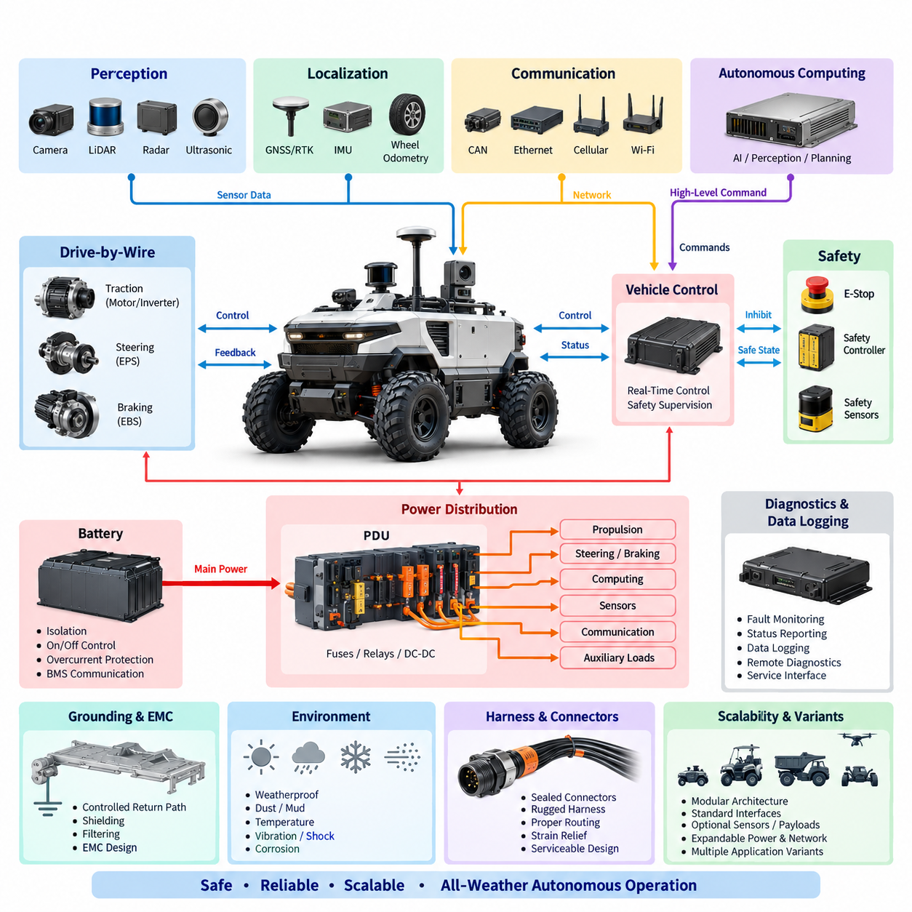
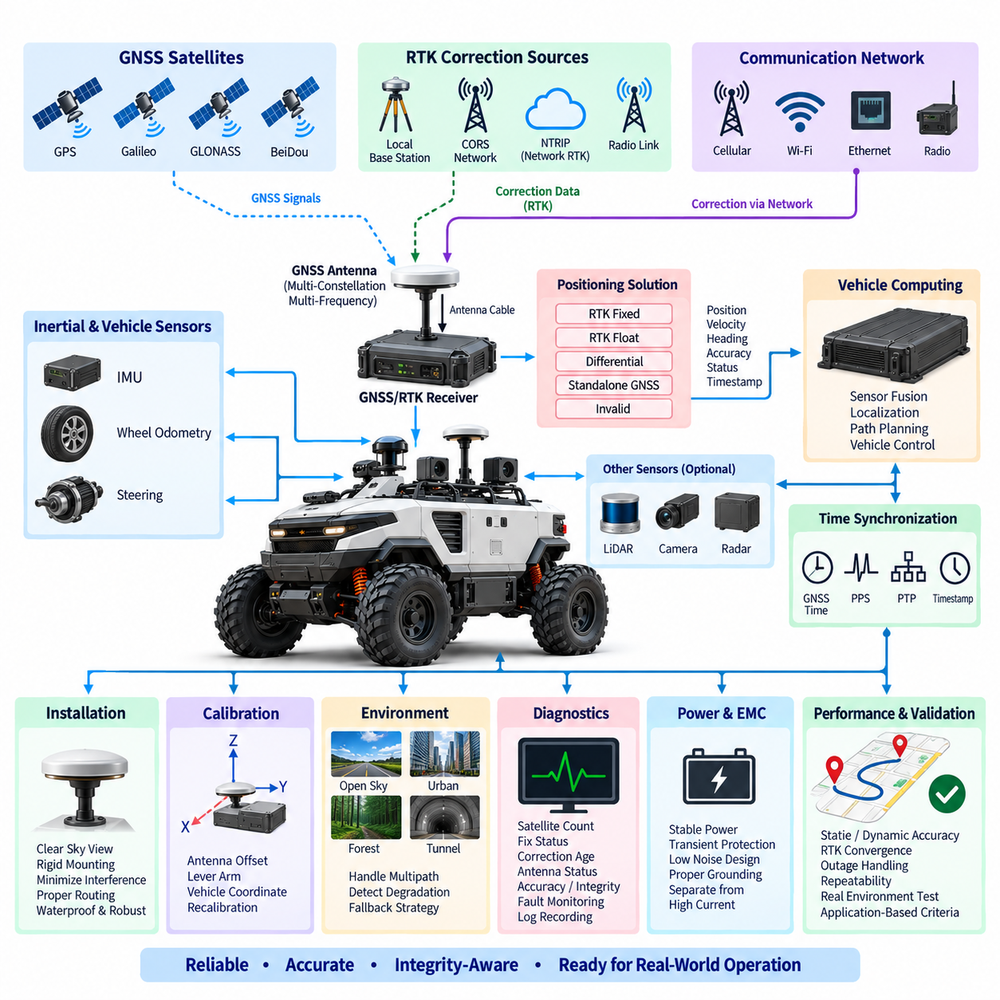
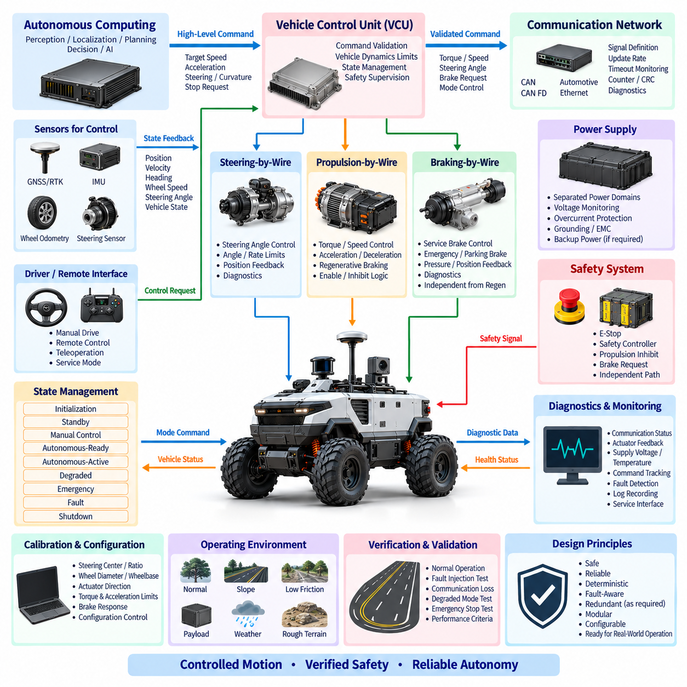
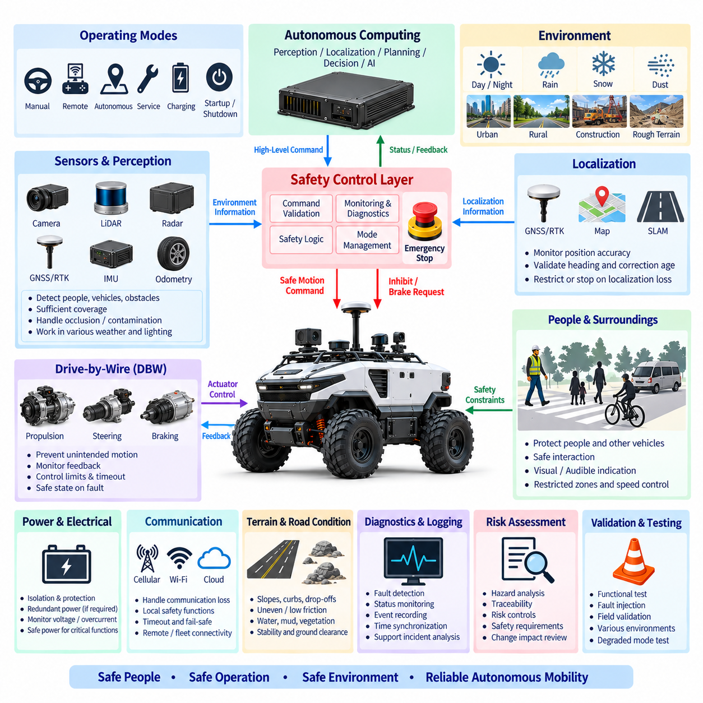
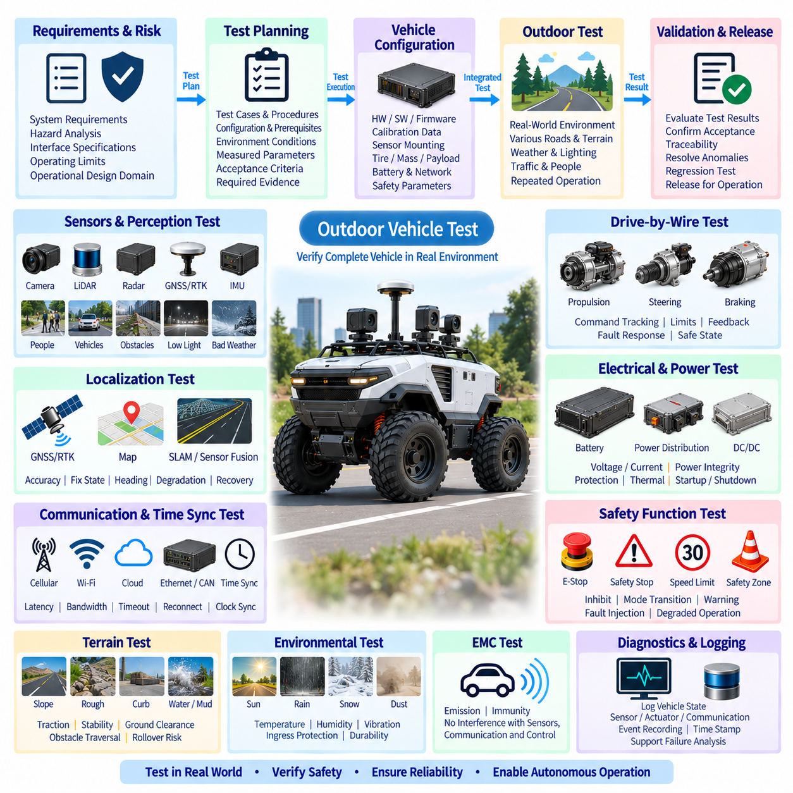

**Volume 22. Hills Robotics Engineering Standards**

# Chapter 11. HRS-011 Outdoor Vehicle

## 11.01. Outdoor EE Architecture

{width="7.268055555555556in" height="7.268055555555556in"}

The outdoor vehicle electrical and electronic architecture shall define a modular, fault-aware platform capable of supporting autonomous operation under weather, vibration, temperature, contamination, and communication conditions that are substantially more demanding than those of indoor AMRs. The architecture shall integrate propulsion, steering, braking, sensing, computation, communication, power distribution, diagnostics, and safety functions while maintaining clear electrical and functional boundaries between subsystems.

The architecture shall be organized into functional domains that include the traction and drive-by-wire domain, autonomous computing domain, perception domain, localization domain, safety domain, communication domain, and electrical power domain. Interfaces between these domains shall be explicitly defined so that changes to sensors, computing platforms, batteries, or actuators can be implemented without unnecessary redesign of the complete vehicle electrical system.

A controlled DC power architecture shall distribute battery energy to propulsion equipment, steering and braking actuators, computing units, sensors, communication devices, and auxiliary loads. High-current propulsion branches shall be electrically separated from noise-sensitive electronics wherever practical. Protected low-voltage rails shall be provided through appropriately rated DC/DC converters, fuses, circuit breakers, contactors, or electronic protection devices according to load criticality and expected fault current.

The main battery interface shall include isolation, overcurrent protection, controlled connection and disconnection, emergency shutdown capability, and battery-management communication. Power distribution shall prevent a failure in a noncritical auxiliary load from disabling steering, braking, safety sensing, or the supervisory controller. Voltage drop, transient behavior, inrush current, regenerative energy, grounding paths, thermal loading, and connector current capability shall be evaluated for both nominal and worst-case operating conditions.

Drive-by-wire functions shall provide controlled electrical interfaces to propulsion, steering, and braking systems. Commands originating from autonomous software shall pass through defined control interfaces rather than directly manipulating power-stage hardware. Each critical actuator interface shall support command validation, state feedback, diagnostic information, timeout supervision, and transition to a predefined safe behavior when communication, power, sensor feedback, or controller integrity is lost.

Autonomous computing shall be separated logically from deterministic vehicle control. High-performance computers or AI accelerators may execute perception, localization, planning, mapping, and intelligent decision functions, while dedicated controllers shall maintain time-critical vehicle control and safety supervision. A failure, reboot, overload, or software update of the autonomous computer shall therefore not create uncontrolled propulsion, steering, or braking behavior.

The perception architecture shall accommodate outdoor sensors such as cameras, depth cameras, 2D or 3D LiDAR, radar, ultrasonic sensors, and application-specific inspection devices. Sensor power branches shall be individually protected or grouped according to functional dependency. Interfaces shall consider bandwidth, synchronization, environmental sealing, cable length, electromagnetic compatibility, mounting location, serviceability, and the ability to isolate a defective sensor without unnecessarily disabling other perception functions.

Outdoor localization shall support GNSS and, where required, RTK correction together with IMU, wheel odometry, steering feedback, and perception-based localization. GNSS antennas and receivers shall be installed with appropriate power integrity, grounding, shielding, and electromagnetic separation from switching converters, motors, high-current cables, radios, and other interference sources. Localization data shall include validity and quality information so that degraded positioning can be detected before it affects autonomous motion.

Communication networks shall be selected according to determinism, bandwidth, diagnostic needs, environmental robustness, and safety relevance. CAN or CAN FD may support distributed controllers and vehicle-level signals, while Ethernet may support high-bandwidth sensors, computing systems, diagnostics, and data logging. ROS 2 or equivalent software middleware may operate above the physical network, but software communication shall not replace the electrical safeguards required for critical vehicle control.

Time synchronization shall be treated as an architectural function when multiple cameras, LiDARs, IMUs, GNSS receivers, radar sensors, and computing nodes contribute to perception or localization. GNSS-derived timing, PTP, hardware triggering, or equivalent mechanisms shall be selected according to required accuracy. Timestamp origin, clock ownership, synchronization loss detection, and degraded operation shall be defined so recorded and real-time sensor information remains temporally consistent.

The safety architecture shall remain independent enough to supervise autonomous functions even when the primary computing path becomes unavailable. Emergency-stop circuits, safety controllers, safety sensors, brake interfaces, propulsion inhibit functions, and relevant contactors shall form a defined safety chain. Activation of an emergency condition shall place the vehicle into a controlled safe state without relying solely on the operating system, ROS 2 software, AI model, or central autonomous computer.

Environmental design shall address rain, water spray, dust, mud, condensation, solar heating, low temperature, vibration, shock, corrosion, and repeated mechanical loading. Electrical enclosures, connectors, harness transitions, antennas, sensor interfaces, and service points shall use protection levels appropriate to their mounting zones. Drainage, sealing, cable glands, strain relief, connector orientation, and prevention of water accumulation shall be considered as part of the electrical architecture rather than as packaging details alone.

Grounding and EMC design shall establish controlled return paths for propulsion electronics, computing equipment, sensors, communication interfaces, and chassis bonding. High-current motor and inverter paths shall be routed to minimize coupling into GNSS, IMU, camera, LiDAR, Ethernet, and other sensitive circuits. Shield termination, chassis bonding, filtering, cable separation, common-mode control, and grounding topology shall be defined consistently across the vehicle and verified during integration.

The architecture shall support diagnostics at component, network, power-domain, and vehicle levels. Controllers shall report relevant faults, communication status, supply voltage, temperature, actuator state, and sensor validity where available. Diagnostic information shall be timestamped and correlated with vehicle operating states so intermittent outdoor failures can be reconstructed from logs. Service interfaces shall allow technicians to identify faults without unnecessary disassembly or uncontrolled bypassing of protection functions.

Availability requirements shall distinguish between faults that require immediate stopping and faults that permit degraded operation. Loss of a nonessential camera, communication link, auxiliary sensor, or inspection payload may allow restricted operation when supported by the safety concept, whereas loss of braking authority, critical steering feedback, safety supervision, or required localization integrity shall initiate an appropriate safe-state response. Degradation rules shall be explicitly assigned rather than inferred by application software.

The electrical architecture shall support product scalability from basic outdoor AMRs to inspection, patrol, agriculture, mining, port, or other autonomous vehicle variants. Optional sensors, communication modules, payload interfaces, computing tiers, and auxiliary power outputs should therefore use standardized interfaces whenever practical. Expansion capacity shall be considered for PDU channels, network ports, compute power, communication bandwidth, connector positions, and thermal capability without compromising existing safety margins.

Harnesses and connectors shall be selected for outdoor mechanical and environmental exposure and shall support manufacturing, inspection, replacement, and field maintenance. High-current, communication, sensor, antenna, and safety circuits shall be identified through controlled drawings and interface definitions. Connector keying, locking, polarization, environmental rating, current derating, shielding, bend radius, abrasion protection, and routing near moving mechanisms shall be addressed during architecture release.

The released outdoor E/E architecture shall be controlled through system diagrams, power budgets, network definitions, interface-control information, protection assignments, grounding requirements, safety dependencies, and approved component configurations. Any change affecting voltage rails, safety paths, network topology, actuator interfaces, sensor timing, grounding, protection devices, or power capacity shall undergo engineering review so that local modifications do not introduce unintended vehicle-level hazards.

Verification shall demonstrate correct operation during startup, normal driving, autonomous operation, charging, shutdown, emergency stopping, communication loss, sensor degradation, controller reset, undervoltage, and representative electrical faults. Testing shall also confirm power integrity, network behavior, diagnostic coverage, environmental robustness, EMC performance, and safe-state transitions. Results shall remain traceable to architecture requirements and the approved hardware and software configuration.

The final architecture shall provide a common engineering foundation connecting the outdoor vehicle requirements with the broader Hills Robotics standards for electrical architecture, harness design, connector selection, fuse protection, grounding, communication, calibration, and safety. The objective is not merely to interconnect vehicle components, but to establish a repeatable E/E platform in which autonomy, power, sensing, communication, diagnostics, and safety remain controlled throughout development, production, field operation, and future product evolution.

## 11.02. GNSS/RTK Standard

{width="7.268055555555556in" height="7.268055555555556in"}

The GNSS RTK system shall provide the primary absolute positioning reference for outdoor autonomous vehicles requiring lane-level or centimeter-class localization. It shall be engineered as part of the vehicle localization architecture rather than treated as an independent navigation accessory. The system shall integrate GNSS receivers, antennas, RTK correction sources, inertial sensing, vehicle odometry, communication interfaces, time synchronization, diagnostics, and autonomous computing.

The GNSS receiver shall support multiple satellite constellations whenever practical, including GPS, Galileo, GLONASS, BeiDou, or regionally applicable navigation systems. Multi-constellation and multi-frequency reception should be used to improve satellite availability, convergence, ambiguity resolution, and resistance to multipath effects. Receiver selection shall consider positioning accuracy, update rate, correction protocol support, environmental rating, initialization behavior, timing capability, and diagnostic accessibility.

RTK operation shall use carrier-phase measurements together with correction information from an approved reference source to achieve high-precision positioning. The architecture may use a local base station, network RTK service, continuously operating reference station network, or another validated correction infrastructure. The selected method shall define correction availability, communication latency, geographic coverage, service dependency, expected convergence time, and behavior when correction data becomes unavailable.

The positioning solution shall explicitly report its operating state rather than providing coordinates without quality information. At minimum, the autonomous system shall distinguish between RTK fixed, RTK float, differential or corrected positioning, standalone GNSS, and invalid or unavailable positioning states when supported by the receiver. Position quality shall be evaluated using receiver status, estimated accuracy, satellite geometry, correction age, satellite availability, and other integrity indicators.

RTK fixed status alone shall not automatically be interpreted as permission for autonomous motion. The vehicle localization function shall verify that horizontal and vertical accuracy, correction age, solution stability, timestamp validity, and other project-defined quality criteria remain within acceptable limits. Sudden coordinate jumps, unrealistic velocity changes, inconsistent heading, or disagreement with independent localization sources shall be detected before the GNSS solution is used for safety-relevant vehicle control.

GNSS antennas shall be installed at locations providing the widest practical view of the sky while minimizing obstruction from vehicle structures, payloads, sensor towers, equipment enclosures, and moving mechanisms. The antenna shall be mechanically rigid so its position relative to the vehicle coordinate frame remains stable. Antenna installation shall also consider water accumulation, vibration, impact exposure, cable strain, service accessibility, and replacement repeatability.

The antenna installation shall minimize electromagnetic interference from motors, inverters, DC/DC converters, switching power supplies, high-current harnesses, computing equipment, radios, and other noise sources. Antenna cables shall use suitable impedance, shielding, connectors, routing, and bend radius. Cable length and insertion loss shall remain within receiver and antenna specifications, and unnecessary adapters or unqualified extensions shall be avoided because they can degrade received signal quality.

The GNSS antenna reference point shall be calibrated relative to the defined vehicle coordinate system. Lever-arm offsets between the antenna, IMU, vehicle reference point, wheelbase reference, and other localization sensors shall be measured and recorded in controlled configuration data. Mechanical modifications that change antenna or sensor positions shall trigger verification or recalibration according to the applicable calibration standard.

Vehicles requiring reliable heading at low speed or while stationary should use a validated heading source such as dual-antenna GNSS, inertial heading, steering and odometry fusion, or another appropriate method. When dual GNSS antennas are used, antenna separation, baseline orientation, structural rigidity, cable characteristics, and installation tolerances shall be controlled. Heading validity and accuracy shall be monitored independently from position validity whenever supported.

GNSS data shall be fused with an inertial measurement unit, wheel odometry, steering information, LiDAR localization, visual localization, or other available sources when required by the vehicle operating environment. Sensor fusion shall provide continuity through short GNSS interruptions and improve dynamic state estimation, but it shall not conceal persistent GNSS degradation. Each source shall retain validity information so the localization system can identify which measurements remain trustworthy.

The GNSS/RTK interface to the vehicle shall use an approved communication method appropriate to the receiver and system architecture, such as Ethernet, CAN, serial communication, or another controlled interface. Message definitions shall specify coordinate format, position, velocity, heading, accuracy estimates, fix state, correction status, timestamps, and diagnostic information. Units, axis conventions, sign conventions, coordinate frames, and update rates shall be documented consistently across software and hardware interfaces.

RTK correction communication may use cellular networks, Wi-Fi, radio links, Ethernet, or other validated communication channels according to the deployment environment. Network-based corrections shall define authentication, endpoint configuration, reconnect behavior, data usage, communication timeout, and correction-age limits. Loss of the external communication link shall be distinguishable from GNSS receiver failure so diagnostics and degraded-operation logic can identify the actual cause.

Time synchronization shall be incorporated whenever GNSS information is fused with cameras, LiDAR, radar, IMU, wheel encoders, or other time-sensitive measurements. GNSS time, PPS, PTP, hardware timestamps, or equivalent mechanisms may be used according to required accuracy. The architecture shall define the master time reference, timestamp generation point, transport delay assumptions, clock synchronization status, and response to synchronization loss.

The system shall define degraded operating modes for environments where satellite visibility or correction reception cannot be guaranteed. Examples include operation near tall buildings, trees, retaining walls, tunnels, bridges, industrial structures, containers, or covered facilities. The localization architecture shall detect degraded GNSS performance and transition to an approved fallback strategy, restricted operating mode, controlled stop, or other project-defined safe response.

Multipath and non-line-of-sight reception shall be considered during route design and validation because centimeter-class receiver specifications do not guarantee centimeter-class vehicle localization in every outdoor environment. Field testing shall evaluate representative open-sky and obstructed conditions along the intended operating area. Repeated localization errors at specific locations shall be documented and addressed through sensor fusion, route constraints, infrastructure changes, or operational rules.

The electrical supply to GNSS receivers, antennas, correction modems, and related localization equipment shall meet defined voltage, transient, grounding, and noise requirements. Sensitive GNSS circuits should be separated from high-current switching paths wherever practical. Power interruptions, brownouts, receiver resets, antenna faults, communication failures, and restoration behavior shall be considered so temporary electrical disturbances do not create an undetected invalid localization state.

Diagnostics shall monitor receiver communication, antenna status where available, satellite count, fix state, correction reception, correction age, estimated accuracy, heading validity, synchronization status, and relevant hardware faults. Diagnostic records shall include timestamps and vehicle operating context to support field troubleshooting. Persistent or recurring GNSS degradation shall be identifiable from logs without requiring direct access to the receiver during the original event.

Configuration parameters affecting positioning performance shall be controlled as engineering data. These include receiver firmware, constellation and frequency settings, correction source configuration, communication parameters, antenna type, antenna offsets, coordinate reference system, datum, geoid settings where applicable, update rate, filtering parameters, and localization thresholds. Unauthorized or undocumented changes to these parameters shall not be permitted on released production configurations.

Verification shall include static accuracy, dynamic accuracy, repeatability, initialization time, RTK convergence, correction interruption, communication recovery, GNSS outage, multipath exposure, antenna disconnection, power cycling, timestamp integrity, and transition between positioning states. Testing shall be performed under representative vehicle motion and environmental conditions, and results shall demonstrate that reported quality indicators correctly represent the usable positioning performance.

Acceptance criteria shall be defined according to the vehicle application rather than relying only on receiver data-sheet accuracy. Required positioning accuracy, heading accuracy, update frequency, maximum correction age, convergence time, outage tolerance, and recovery behavior shall be traceable to autonomous driving and safety requirements. Validation shall confirm not only nominal centimeter-class performance but also reliable detection of conditions in which that performance cannot be maintained.

The released GNSS RTK configuration shall provide a repeatable localization reference across manufacturing, commissioning, maintenance, and field replacement. Receiver, antenna, mounting geometry, calibration data, firmware, correction service, communication configuration, and validation records shall remain configuration-controlled. The objective is to ensure that outdoor autonomous vehicles receive accurate, time-consistent, diagnosable, and integrity-aware positioning information throughout the operational lifecycle.

## 11.03. DBW Design Rule

{width="7.268055555555556in" height="7.268055555555556in"}

The drive-by-wire system shall provide the controlled electrical and electronic interface between autonomous driving functions and the vehicle propulsion, steering, and braking mechanisms. DBW architecture shall separate high-level autonomy commands from direct actuator power control so that perception, localization, planning, or AI software cannot directly energize propulsion or manipulate safety-critical actuators without validation by the vehicle control layer.

The DBW architecture shall include propulsion-by-wire, steering-by-wire, and braking-by-wire functions appropriate to the vehicle configuration. Each function shall define command inputs, actuator outputs, position or state feedback, communication interfaces, power supplies, diagnostic signals, and safe-state behavior. Functional boundaries shall remain sufficiently modular to permit replacement or upgrade of individual actuators without redesigning the entire autonomous control architecture.

A dedicated vehicle control unit shall mediate commands between the autonomous computing system and DBW actuators. High-level commands such as target velocity, acceleration, steering angle, curvature, or stopping request shall be checked against vehicle limits before conversion into actuator commands. The controller shall reject malformed, stale, conflicting, physically impossible, or out-of-range commands rather than transmitting them directly to the propulsion, steering, or braking hardware.

Propulsion control shall provide deterministic management of motor torque, rotational speed, vehicle velocity, direction, acceleration, deceleration, and regenerative behavior where applicable. Command limits shall consider motor and inverter ratings, battery capability, vehicle mass, payload, slope, traction conditions, and thermal limits. Unexpected propulsion shall be prevented through enable logic, command plausibility checking, communication supervision, and independent propulsion-inhibit mechanisms.

Steering control shall translate commanded vehicle motion into a controlled steering actuator request while continuously monitoring actual steering position. The system shall define steering-angle limits, steering-rate limits, center position, mechanical boundaries, actuator current or torque limits, and feedback plausibility. Steering commands exceeding allowed dynamic or mechanical limits shall be constrained or rejected before they can produce unstable or mechanically damaging motion.

Braking control shall provide predictable deceleration and stopping under autonomous, manual, degraded, and emergency conditions. Service braking and emergency or parking brake functions shall be coordinated according to the vehicle design while maintaining appropriate independence. The braking system shall not depend exclusively on regenerative braking because regenerative capability may decrease or disappear due to battery state, inverter faults, low speed, traction conditions, or electrical power loss.

Command and feedback paths shall be treated separately. A commanded steering angle, wheel torque, brake request, or velocity shall not be assumed to have been executed merely because the command was transmitted successfully. Actual actuator position, velocity, torque, pressure, current, brake state, or other available feedback shall be monitored to confirm response. Persistent disagreement between command and feedback shall generate a diagnostic fault and initiate the defined degraded or safe-state response.

DBW communication shall use a controlled network interface such as CAN, CAN FD, Automotive Ethernet, or another validated deterministic transport suitable for the application. Messages shall define signal scaling, units, ranges, update periods, timeout limits, counters, status fields, and diagnostic information. Safety-relevant commands should include mechanisms such as alive counters, sequence monitoring, checksums, CRC protection, or equivalent integrity measures where supported by the system design.

Communication timeout behavior shall be explicitly defined for every motion-critical interface. Loss of a valid command stream shall not cause the actuator to indefinitely maintain the last propulsion or steering request. The receiving controller shall detect stale information within the specified timeout and transition toward an approved degraded or safe state. Timeout thresholds shall consider control frequency, network latency, vehicle dynamics, stopping distance, and actuator response time.

DBW state management shall distinguish initialization, standby, manual control, autonomous-ready, autonomous-active, degraded, emergency, fault, and shutdown conditions as required by the vehicle. Transitions between states shall occur only when defined prerequisites are satisfied. Autonomous motion shall require valid safety status, acceptable localization, healthy DBW communication, available braking, valid actuator feedback, and all other project-specific motion-enabling conditions.

The system shall use explicit enable and inhibit logic to prevent unintended motion during booting, software restart, maintenance, charging, calibration, communication recovery, or controller replacement. Propulsion enable shall require deliberate fulfillment of defined conditions rather than merely the absence of a fault. Safety circuits shall retain the authority to inhibit propulsion or request braking regardless of the state of the autonomous computing software.

Emergency-stop operation shall override normal autonomous motion commands through a defined safety path. Activation of an E-Stop shall remove or inhibit propulsion and command the appropriate stopping mechanism according to the vehicle safety architecture. Recovery from an emergency stop shall require controlled reset conditions and shall not automatically resume the previous motion command when the E-Stop device is released.

Power architecture for DBW components shall maintain sufficient independence between propulsion, steering, braking, vehicle control, and safety supervision according to their criticality. A failure of an auxiliary sensor, payload, high-performance computer, or noncritical power branch shall not unnecessarily disable the electrical functions required to stop the vehicle safely. Voltage monitoring, undervoltage detection, overcurrent protection, grounding, and transient protection shall be provided where required.

Steering and braking availability following partial electrical failure shall be considered during architecture design. Where the vehicle risk assessment requires continued control after a single fault, redundant power feeds, backup energy, redundant sensing, independent control paths, mechanical fallback, or other appropriate measures shall be evaluated. Redundancy shall be introduced according to safety requirements rather than duplicated without analysis, because common-cause failures can defeat nominally redundant channels.

Manual and autonomous control interfaces shall have explicitly defined authority. If a vehicle supports manual driving, remote control, service control, or teleoperation, the priority and transition rules between these modes and autonomous control shall be documented. Simultaneous controllers shall not issue uncontrolled competing actuator commands. Transfer of control shall include command neutralization, state confirmation, and appropriate operator or system acknowledgement where required.

Vehicle dynamics constraints shall be incorporated into DBW command validation. Maximum velocity, acceleration, deceleration, steering angle, steering rate, lateral acceleration, curvature, and other applicable limits shall be configured according to vehicle geometry and operating conditions. Different limits may be applied for payload, terrain, slope, weather, localization quality, restricted areas, or degraded states, provided that the active limit set is controlled and diagnosable.

DBW diagnostics shall continuously monitor controller communication, actuator feedback, supply voltage, temperature, motor or actuator current, sensor plausibility, command tracking, internal controller faults, and safety-related status where available. Diagnostic events shall contain sufficient timestamps and operating context to reconstruct abnormal vehicle behavior. Fault codes and status definitions shall be controlled so that engineering, production, and service tools interpret DBW failures consistently.

Calibration parameters affecting vehicle motion shall be configuration-controlled. These may include steering center and ratio, actuator direction, wheel diameter, wheelbase, velocity conversion factors, brake response characteristics, torque limits, acceleration limits, dead bands, command offsets, and control gains. Changes to these values shall require defined authorization and verification because incorrect calibration can produce hazardous motion even when all hardware components are functioning normally.

The DBW system shall support deterministic startup and shutdown sequences. At power-up, actuator outputs shall remain inhibited until communication, feedback, configuration, safety status, and controller initialization have been verified. During shutdown, propulsion shall be reduced or disabled in a controlled manner, vehicle motion shall cease, required braking or parking functions shall be established, and stored faults or operational data shall be preserved as required.

Verification shall include normal command tracking, acceleration and deceleration, steering response, braking performance, communication interruption, stale commands, corrupted messages, actuator feedback loss, sensor disagreement, controller reset, power interruption, undervoltage, emergency stop, mode transition, and recovery from faults. Tests shall confirm both correct execution of valid commands and correct rejection or containment of invalid commands under representative vehicle operating conditions.

Fault-injection testing shall demonstrate that individual failures do not produce uncontrolled vehicle motion. Representative faults should include communication loss, frozen commands, implausible feedback, actuator saturation, power loss, controller reboot, disconnected sensors, steering faults, propulsion faults, and braking faults according to the architecture. The resulting vehicle response shall be compared with the defined degraded-state and safe-state requirements and recorded for traceability.

The released DBW configuration shall maintain controlled definitions for controllers, actuators, network messages, electrical interfaces, software versions, calibration parameters, safety limits, diagnostics, and validation results. Changes affecting steering, propulsion, braking, command authority, communication timing, or safe-state behavior shall undergo engineering review and regression testing. The objective is a predictable and fault-aware vehicle control interface that enables autonomous operation without surrendering motion authority directly to high-level software.

## 11.04. Outdoor Safety Requirement

{width="7.268055555555556in" height="7.268055555555556in"}

Outdoor vehicle safety requirements shall define the measures necessary to prevent unacceptable risk during autonomous, manual, remote, maintenance, charging, startup, shutdown, and degraded operation. The safety architecture shall address hazards arising from vehicle motion, propulsion, steering, braking, electrical power, perception, localization, communication, environmental exposure, payloads, and interaction with people, vehicles, infrastructure, and terrain.

Safety requirements shall be derived from a documented risk assessment covering the intended operating environment and foreseeable misuse. Hazard analysis shall consider collision, crushing, trapping, rollover, runaway motion, unintended acceleration, steering failure, insufficient braking, localization loss, perception degradation, communication failure, electrical faults, thermal events, and loss of control on slopes or low-friction surfaces. Risk controls shall be traceable to identified hazards.

The safety concept shall use layered protection rather than relying on a single sensor, software process, communication channel, or AI function. Preventive controls, monitoring functions, operational limits, independent safety mechanisms, emergency stopping, and fault containment shall work together so that failure of the primary autonomous function does not automatically result in hazardous vehicle motion. Independence shall be proportional to the assessed risk and required safety integrity.

A dedicated safety control path shall supervise motion-critical conditions independently from high-level autonomous computing where required. Safety controllers, emergency-stop circuits, propulsion inhibit interfaces, braking requests, safety sensors, and associated power circuits shall retain sufficient authority to place the vehicle into a defined safe state. Safety action shall not depend solely on ROS 2, an AI model, a general-purpose operating system, or the primary autonomous computer.

The vehicle shall provide emergency-stop devices appropriate to its size, operating environment, and accessibility requirements. Activation of an E-Stop shall override normal motion commands, inhibit or remove propulsion, and initiate the defined stopping response. Emergency-stop circuits shall be monitored for faults where required, and release of an activated device shall not automatically restart autonomous operation or restore the previous motion command.

Safe stopping behavior shall be defined for normal protective stops, emergency stops, communication loss, localization failure, critical sensor failure, controller faults, and power abnormalities. Stopping performance shall consider vehicle mass, payload, velocity, slope, surface friction, actuator delay, brake capability, and environmental conditions. The selected stopping strategy shall avoid both uncontrolled continuation of motion and unnecessarily hazardous instantaneous actions.

Propulsion safety shall prevent unintended torque and uncontrolled acceleration. Propulsion enable shall require defined motion-permission conditions, and loss of those conditions shall cause an appropriate inhibit or controlled deceleration response. Command plausibility, velocity limits, acceleration limits, direction checks, actuator feedback, communication timeout, and propulsion status shall be monitored. A single stale or corrupted command shall not produce indefinite vehicle motion.

Steering safety shall monitor commanded and actual steering states and detect excessive deviation, implausible position, actuator saturation, communication loss, or other conditions that could compromise directional control. Steering angle and steering rate shall remain within defined limits appropriate to vehicle speed and geometry. When reliable steering control cannot be maintained, the system shall restrict motion or transition to a safe state according to the hazard analysis.

Braking shall remain available to achieve the required safe stopping performance under defined fault conditions. The safety concept shall consider service braking, regenerative braking, parking braking, and emergency braking as applicable to the vehicle architecture. Regenerative braking shall not be treated as the sole safety stopping mechanism where battery, inverter, motor, low-speed, traction, or electrical faults can reduce its effectiveness.

Perception safety shall address the detection of people, vehicles, obstacles, structures, terrain boundaries, and other hazards relevant to the operational design domain. Safety-related sensors shall provide adequate coverage for the vehicle geometry, direction of travel, speed, and stopping distance. Blind zones, sensor occlusion, contamination, adverse weather, lighting conditions, sensor failure, and mounting changes shall be considered when defining safety coverage.

Localization safety shall monitor GNSS/RTK, IMU, odometry, map-based localization, or other positioning sources used to authorize autonomous motion. RTK fixed status alone shall not constitute sufficient evidence of localization integrity. Position accuracy, heading validity, correction age, timestamp integrity, solution consistency, and disagreement between independent sources shall be evaluated, with degraded localization resulting in defined restrictions or safe-state transitions.

Vehicle speed shall be controlled according to operating conditions rather than by a single unrestricted maximum value. Safety limits may depend on pedestrian proximity, obstacle density, route geometry, curvature, slope, surface condition, visibility, localization quality, sensor coverage, payload, weather, or restricted zones. The active speed limit shall be communicated consistently to motion control and shall not be bypassed by normal autonomous planning commands.

The vehicle shall maintain safety margins between detection range, system reaction time, braking response, and stopping distance. Safety sensor coverage shall extend sufficiently beyond the required stopping envelope under applicable operating conditions. Validation shall include worst-case combinations of speed, payload, slope, surface friction, communication delay, sensor update time, processing latency, actuator response, and braking performance rather than evaluating each factor independently.

Outdoor terrain hazards shall include slopes, curbs, holes, drop-offs, uneven ground, loose surfaces, water, mud, vegetation, and obstacles capable of affecting stability or traction. The vehicle safety concept shall define allowable slope, ground clearance, obstacle capability, lateral stability, and terrain restrictions. Conditions that could cause rollover, grounding, wheel slip, loss of braking effectiveness, or loss of steering authority shall be detected or prevented through operational constraints.

Environmental conditions shall be incorporated into safety requirements because rain, fog, snow, dust, mud, direct sunlight, darkness, temperature, vibration, and contamination can degrade sensors and electrical systems. The vehicle shall detect relevant sensor degradation where practical and shall not assume nominal perception performance under all weather conditions. Environmental operating limits and corresponding degraded behaviors shall be documented for the intended deployment.

Communication loss shall not result in uncontrolled motion. Loss of fleet communication, remote-control links, correction services, cloud connectivity, or other external networks shall be classified according to their safety relevance. Functions required for immediate vehicle safety should remain locally executable whenever practical. Where continued operation depends on a lost communication service, the vehicle shall transition to a predefined restricted mode or controlled stop.

Manual, remote, teleoperation, autonomous, and service-control modes shall have clearly defined authority and transition rules. Conflicting control sources shall not simultaneously command motion without arbitration. Transfer of control shall verify vehicle state, communication availability, operator or system authorization, and command neutrality where applicable. Maintenance or service modes shall prevent unintended autonomous activation while personnel may be working near hazardous mechanisms.

Electrical safety shall address battery isolation, overcurrent protection, short circuits, ground faults where applicable, connector faults, damaged harnesses, water ingress, thermal overload, and unexpected power restoration. Safety-critical controllers and stopping functions shall receive appropriately protected power. A failure in a payload, auxiliary computer, sensor, lighting circuit, or other noncritical branch shall not unnecessarily remove the electrical capability required to place the vehicle into a safe state.

Safety-related faults shall be classified according to severity and permitted vehicle response. Some faults may allow continued operation with reduced speed or restricted functionality, while others shall require an immediate protective stop, controlled stop, or emergency action. Degraded operation shall be explicitly defined and shall not become an indefinite state in which multiple accumulated faults gradually remove the safety assumptions of the original design.

The vehicle shall provide visible, audible, or other appropriate status indications to communicate operational states where interaction with people is expected. Indications may distinguish standby, autonomous operation, remote operation, warning, fault, emergency stop, or other relevant conditions. Human-machine indications shall support situational awareness but shall not replace physical safety measures, obstacle detection, controlled speed, or emergency stopping functions.

Diagnostics and event recording shall support reconstruction of safety-relevant incidents. The system shall record applicable motion commands, vehicle velocity, steering state, brake state, safety sensor status, localization quality, operating mode, communication state, emergency-stop events, controller faults, and relevant timestamps. Logs shall be sufficiently synchronized and protected so engineering teams can determine the sequence of events surrounding abnormal behavior.

Changes to vehicle mass, payload, tires, brakes, steering hardware, sensors, computing equipment, software, calibration, route conditions, or maximum speed shall be evaluated for their effect on the safety concept. A previously validated stopping distance or stability limit shall not automatically remain valid after physical or software modifications. Safety-relevant configuration changes shall undergo controlled review, impact assessment, and appropriate regression testing.

Safety validation shall include normal operation, obstacle detection, pedestrian interaction, emergency stopping, maximum permitted speed, representative payloads, slopes, reduced-friction surfaces, sensor obstruction, localization degradation, communication interruption, controller reset, electrical faults, and degraded modes. Fault-injection testing shall verify that representative single failures are detected and produce the intended containment, restriction, stopping, or safe-state response.

Field validation shall be performed in environments representative of the intended operational design domain, including relevant road or pathway geometry, terrain, weather exposure, lighting, obstacles, communication conditions, and human interaction. Testing shall verify not only that the vehicle performs correctly when all systems are healthy, but also that safety mechanisms remain effective when sensing, localization, communication, actuation, or computing performance is degraded.

The released outdoor safety configuration shall maintain traceability among hazards, safety requirements, hardware and software mechanisms, calibration limits, verification procedures, test evidence, and approved operating conditions. The objective is to ensure that autonomous outdoor operation remains controlled when faults, environmental disturbances, human interaction, and uncertain terrain occur, and that the vehicle can reliably detect loss of required safety conditions and transition to an appropriate safe state.

## 11.05. Outdoor Test Requirement

{width="7.268055555555556in" height="7.268055555555556in"}

Outdoor vehicle testing shall verify that the complete vehicle satisfies its electrical, control, localization, perception, communication, safety, environmental, and autonomous-operation requirements under conditions representative of the intended deployment. Testing shall evaluate the integrated vehicle rather than only individual components because interactions among propulsion, steering, braking, sensors, computing, power, networks, terrain, and software can create system-level failures not visible during bench testing.

The test program shall be derived from approved system requirements, hazard analysis, interface specifications, operating limits, and the intended operational design domain. Each requirement shall be linked to an appropriate verification method such as inspection, analysis, bench testing, vehicle testing, fault injection, or field validation. Test cases shall define configuration, prerequisites, environmental conditions, procedure, measured parameters, acceptance criteria, and required evidence.

The test vehicle configuration shall be controlled before formal verification begins. Hardware versions, software releases, firmware, calibration data, sensor mounting positions, tire specifications, vehicle mass, payload, battery configuration, network definitions, and safety parameters shall be recorded. Any configuration change during testing shall be documented so results obtained from different vehicle configurations are not incorrectly treated as equivalent evidence.

Electrical testing shall verify battery interfaces, power distribution, DC/DC conversion, protection devices, grounding, voltage rails, current consumption, startup behavior, shutdown behavior, and auxiliary power outputs. Measurements shall include nominal and worst-case voltage drop, steady-state current, peak current, inrush current, transient response, and relevant thermal conditions. Protection behavior shall be confirmed without creating uncontrolled motion or secondary electrical hazards.

Power integrity shall be evaluated during simultaneous high-load operation, including propulsion, steering, braking, computing, sensing, communication, lighting, and representative payload operation where applicable. Tests shall determine whether rapid acceleration, steering activity, actuator transients, or auxiliary loads cause unacceptable voltage disturbance, controller reset, sensor dropout, communication errors, or localization degradation. Brownout recovery shall also be verified.

Propulsion testing shall verify commanded velocity, acceleration, deceleration, direction, torque response, velocity limiting, and propulsion inhibit behavior. Testing shall cover unloaded and representative payload conditions together with applicable slopes and surface conditions. The vehicle shall demonstrate predictable response to valid commands and shall reject or safely contain invalid, stale, conflicting, or out-of-range propulsion commands according to the approved DBW design rules.

Steering testing shall verify steering-angle command tracking, center calibration, steering-rate limits, mechanical limits, feedback accuracy, repeatability, and response under representative vehicle loads. Dynamic tests shall confirm that steering behavior remains stable throughout the approved speed range. Communication interruption, actuator saturation, invalid feedback, controller reset, or other representative steering faults shall produce the specified degraded or safe-state response.

Braking tests shall establish stopping performance under representative combinations of vehicle mass, payload, speed, slope, and surface friction. Service braking, emergency braking, parking braking, and regenerative braking shall be evaluated where applicable. Testing shall verify that sufficient stopping capability remains when regenerative braking is unavailable or reduced and that braking faults are detected and handled according to the defined safety architecture.

Stopping-distance validation shall include the complete sensing-to-stop chain rather than brake hardware alone. Detection range, sensor update period, processing latency, network delay, decision time, DBW response, actuator delay, tire-road friction, and mechanical braking distance shall be considered. Worst-case combinations relevant to the operational design domain shall be evaluated to demonstrate that safety sensor coverage provides adequate stopping margin.

GNSS/RTK testing shall verify static and dynamic positioning accuracy, RTK convergence, fix-state transitions, heading performance, correction age, communication recovery, repeatability, and operation under representative satellite visibility. Tests shall include open-sky conditions and applicable obstructed environments such as trees, buildings, bridges, retaining structures, or other deployment-specific features capable of producing multipath or degraded reception.

Localization testing shall evaluate the integrated use of GNSS/RTK, IMU, wheel odometry, steering feedback, LiDAR localization, visual localization, or other configured sources. Controlled GNSS degradation and outage tests shall confirm that the system detects loss of localization integrity rather than continuing autonomous operation on unreliable coordinates. Recovery behavior and transition between normal, degraded, and restricted localization states shall be verified.

Perception testing shall verify detection of relevant people, vehicles, obstacles, structures, terrain boundaries, and other hazards throughout the required sensor coverage. Representative target sizes, positions, approach directions, vehicle speeds, and distances shall be included. Tests shall also evaluate blind zones, partial occlusion, sensor contamination, mounting tolerances, and degraded sensing conditions relevant to the intended outdoor environment.

Environmental perception tests shall address variations in daylight, darkness, shadows, direct sunlight, rain, fog, dust, mud, or other applicable conditions. The purpose shall not be to assume identical sensor performance under every environment, but to identify operating limits and verify appropriate degradation detection. When perception quality becomes insufficient for the current speed or route, the vehicle shall restrict operation or execute the specified safe response.

Communication testing shall verify CAN, CAN FD, Ethernet, wireless, remote-control, fleet, RTK correction, and other configured interfaces as applicable. Message timing, bandwidth, latency, timeout detection, integrity checking, reconnect behavior, and network loading shall be measured. Tests shall confirm that communication loss does not cause indefinite continuation of the last motion command and that locally required safety functions remain available.

Time-synchronization testing shall verify timestamps and clock relationships among GNSS, IMU, cameras, LiDAR, radar, wheel sensors, computing nodes, and recorded diagnostic data where applicable. GNSS time, PPS, PTP, hardware triggering, or other implemented mechanisms shall be tested according to required accuracy. Loss of synchronization shall be detectable, and resulting sensor-fusion behavior shall comply with the defined degraded-operation strategy.

Autonomous driving tests shall evaluate route following, waypoint navigation, path tracking, obstacle avoidance, stopping, restarting, turning, reversing, and other functions required by the intended application. Tests shall include representative speeds, payloads, route geometry, slopes, surface conditions, and traffic interactions. Autonomous performance shall be evaluated together with safety constraints rather than only measuring successful completion of the planned route.

Terrain testing shall cover representative slopes, uneven surfaces, curbs, obstacles, depressions, loose ground, low-friction surfaces, mud, water, vegetation, or other conditions relevant to the approved operational domain. Tests shall verify ground clearance, traction, stability, steering authority, braking capability, and obstacle traversal limits. Conditions approaching rollover, grounding, excessive wheel slip, or loss of control shall be evaluated without exceeding controlled test safety limits.

Safety-function testing shall verify emergency stops, protective stops, propulsion inhibition, safety sensing, speed restrictions, mode transitions, warning indications, and safe-state behavior. Emergency-stop testing shall confirm stopping response and verify that releasing the E-Stop does not automatically resume motion. Safety mechanisms shall remain effective during representative failures of autonomous computing, communication, localization, sensing, or noncritical electrical functions.

Fault-injection testing shall intentionally introduce controlled failures to verify diagnostic coverage and system response. Representative faults may include sensor disconnection, communication timeout, corrupted or frozen commands, invalid actuator feedback, GNSS loss, RTK correction loss, controller reboot, undervoltage, network interruption, steering fault, braking fault, or propulsion fault. Each injected condition shall produce the documented containment, degradation, stopping, or recovery behavior.

Environmental and durability testing shall evaluate the electrical and electronic system against applicable temperature, humidity, water, dust, vibration, shock, corrosion, and mechanical exposure requirements. Vehicle-level tests shall pay particular attention to connectors, harness routing, sensor mounts, antennas, enclosures, cooling systems, and moving cable interfaces. Post-test inspection shall identify loosening, abrasion, leakage, deformation, corrosion, or electrical degradation.

Electromagnetic compatibility testing shall evaluate whether propulsion electronics, motors, inverters, DC/DC converters, radios, computing equipment, and high-current switching interfere with GNSS, IMU, cameras, LiDAR, communication networks, or control electronics. Testing shall also assess susceptibility to representative external disturbances. EMC issues detected only during vehicle operation shall be documented and corrected before release.

Diagnostics and logging shall be verified throughout the test program. Recorded information should permit reconstruction of vehicle speed, command state, steering, braking, localization quality, perception status, communication state, safety events, controller faults, and relevant electrical conditions. Timestamp consistency and log retention shall be sufficient to correlate failures across distributed controllers and computing systems during engineering analysis.

Field validation shall use routes and environments representative of actual deployment and shall include repeated operation rather than a single successful demonstration. Testing shall evaluate variation in weather, lighting, GNSS reception, communication quality, terrain, payload, traffic, and human interaction as applicable. Repeated failures, intermittent anomalies, or location-specific problems shall be recorded and resolved or incorporated into approved operational restrictions.

Regression testing shall be performed when changes affect safety-relevant hardware, software, firmware, calibration, sensors, actuators, vehicle mass, tires, braking, steering, network configuration, power architecture, or operating limits. The regression scope shall be determined through change-impact analysis. Previously completed tests may be reused only when their configuration and assumptions remain valid for the modified vehicle.

Test completion shall require objective evidence demonstrating compliance with defined acceptance criteria. Evidence may include measurement files, diagnostic logs, photographs where required by the test procedure, configuration records, calibration records, test reports, and identified anomalies with disposition. Failed or conditionally accepted tests shall remain traceable to corrective actions and subsequent verification rather than being removed from the validation history.

The released outdoor vehicle shall maintain traceability from requirements and hazards through test cases, configurations, measured results, failures, corrective actions, and final acceptance evidence. The objective of the outdoor test requirement is to demonstrate not only that the vehicle operates successfully under nominal conditions, but that it remains predictable, diagnosable, controllable, and capable of reaching an appropriate safe state when real-world disturbances and failures occur.
