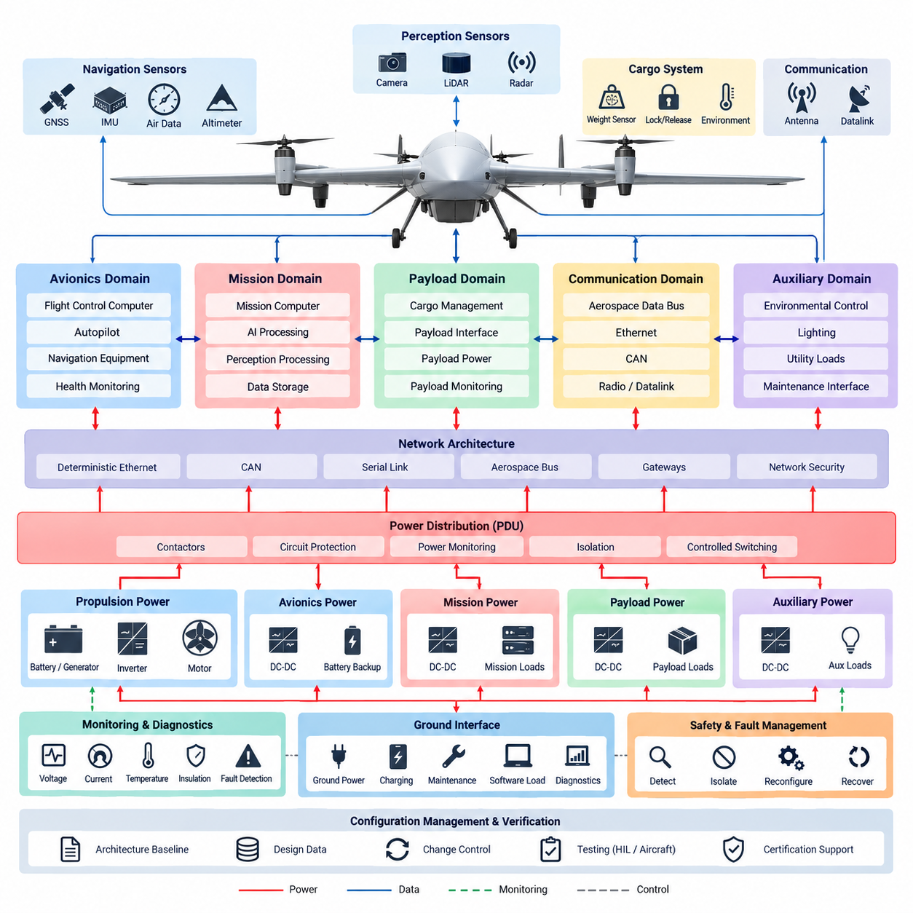
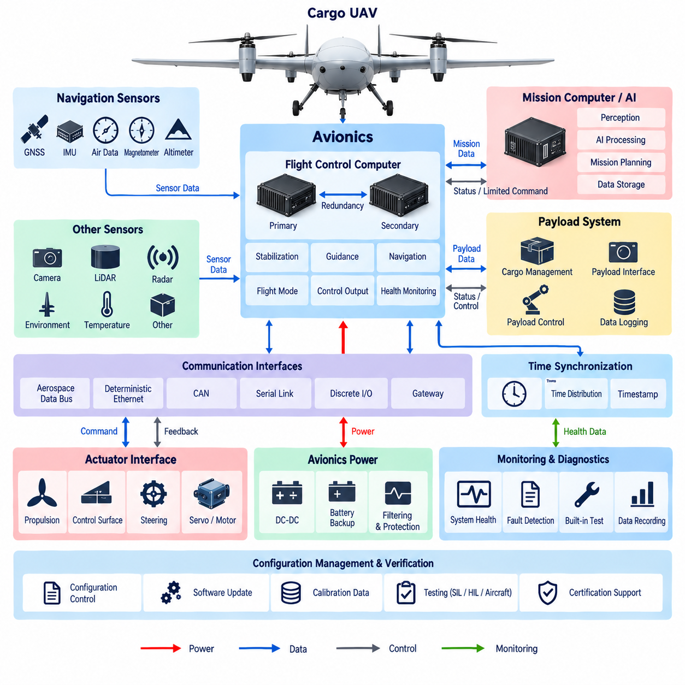
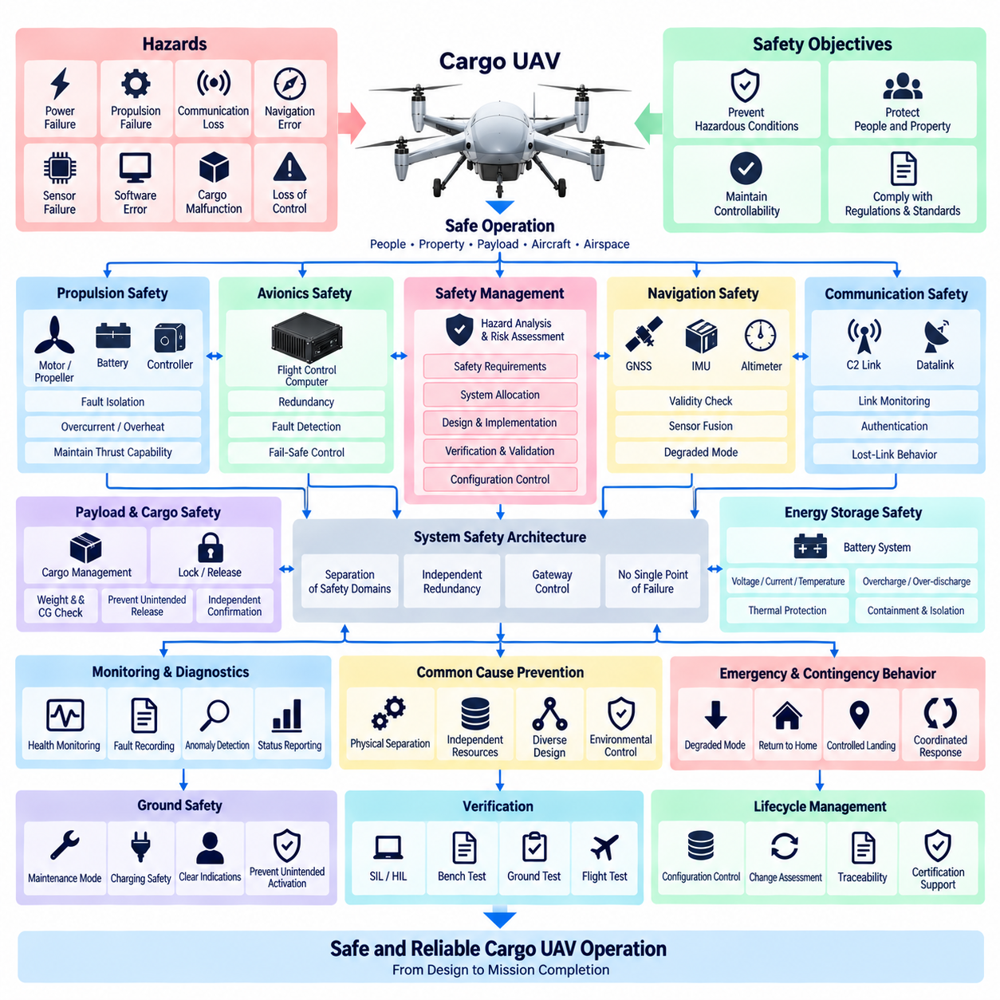
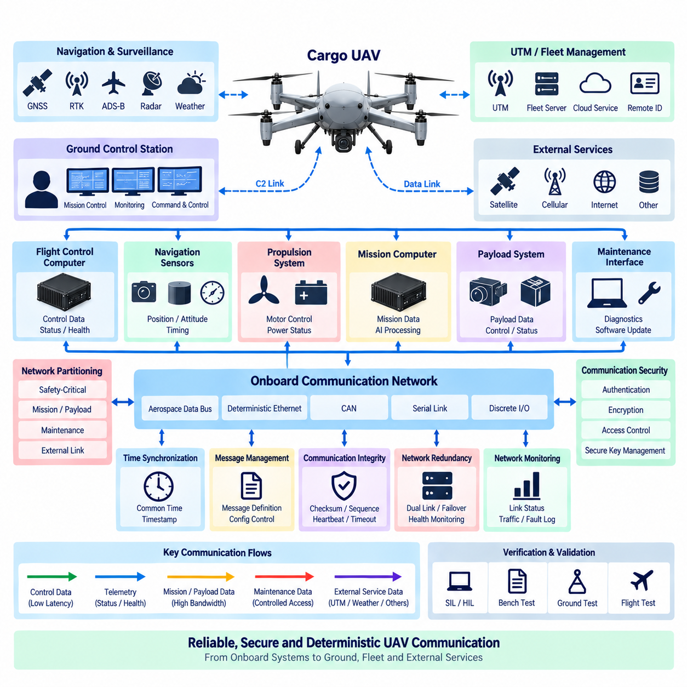
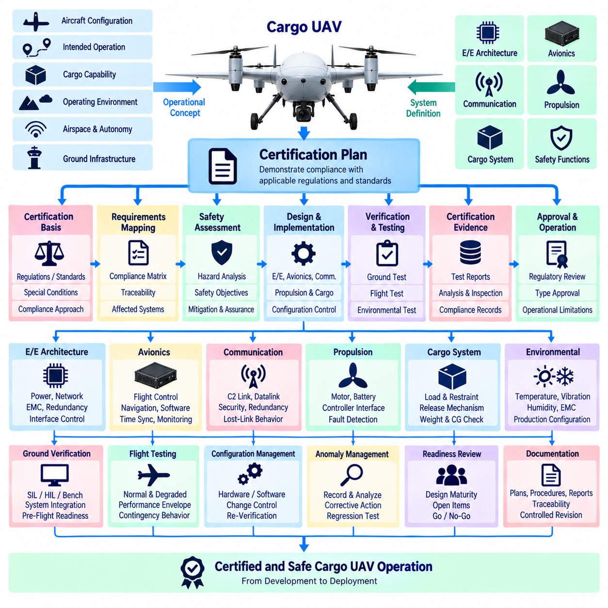

**Volume 22. Hills Robotics Engineering Standards**

# Chapter 12. HRS-012 Cargo UAV

## 12.01. UAV EE Architecture

{width="7.268055555555556in" height="7.268055555555556in"}

The UAV electrical and electronic architecture shall establish a layered, fault-contained foundation for cargo aircraft in which propulsion, flight control, avionics, payload, communication, and utility functions are separated according to criticality. The architecture shall define electrical boundaries, power domains, data interfaces, redundancy paths, and failure containment so that a fault in a noncritical subsystem cannot propagate into flight-critical functions.

The architecture shall support the Cargo UAV product family defined within the robotics engineering standards and shall provide a common engineering baseline that can scale from experimental platforms to large cargo UAV configurations. Platform-specific implementations may vary in voltage, propulsion power, payload capacity, and redundancy level, but the fundamental partitioning philosophy, interface control, protection strategy, and verification approach shall remain consistent.

Electrical power shall be organized into clearly identified propulsion, avionics, mission, payload, and auxiliary domains. High-power propulsion circuits shall be physically and electrically separated from low-voltage avionics wherever practical. Power distribution shall include appropriately coordinated contactors, circuit protection, isolation devices, current measurement, and controlled switching so that abnormal loads can be disconnected without unnecessarily removing power from flight-critical equipment.

Flight-critical electrical loads shall receive power through architectures designed to avoid credible single-point failures. Flight control computers, essential navigation sensors, critical communication equipment, actuator control electronics, and required monitoring functions shall use independent or redundant supply paths where the aircraft safety assessment requires continued operation. Backup energy shall provide sufficient transition capability when the primary generation or distribution path becomes unavailable.

The propulsion electrical domain shall integrate energy sources, power conversion equipment, motor controllers or inverters, propulsion motors, and associated protection and monitoring devices. For hybrid-electric or turbine-electric cargo UAVs, generation and propulsion distribution shall be coordinated with battery-supported avionics power. Propulsion faults shall be detected and isolated at the smallest practical electrical boundary while preserving controllability through remaining propulsion channels.

The avionics domain shall provide deterministic and traceable interfaces among the flight control computer, autopilot functions, IMU/AHRS, GNSS, air-data sensors, actuator controllers, navigation equipment, and health-monitoring systems. Its architecture shall remain logically independent from high-bandwidth mission computing so that perception, logistics, payload processing, or AI workloads cannot compromise the timing or availability of essential flight-control functions.

Communication networks shall be partitioned according to function, bandwidth, determinism, and safety criticality. Suitable interfaces may include aerospace data buses, deterministic Ethernet, CAN-based networks, serial links, and dedicated discrete I/O where appropriate. Gateways between network domains shall control data flow and prevent uncontrolled coupling between flight-critical avionics, mission computers, payload systems, maintenance interfaces, and external communication equipment.

Cargo management shall form a controlled electrical domain connected to the aircraft through defined power and data interfaces. Cargo weight sensing, center-of-gravity monitoring, lock and release mechanisms, payload identification, and environmental monitoring shall report their status to the relevant aircraft systems without creating dependencies that can destabilize flight control. Safety-critical cargo release or locking functions shall include independent state confirmation where required.

Sensor architecture shall distinguish sensors required for basic aircraft stabilization and navigation from sensors supporting autonomy, perception, obstacle detection, landing assistance, or mission intelligence. IMU, AHRS, GNSS, altitude, air-data, and other essential navigation sources shall be assigned appropriate redundancy and independent electrical paths. Additional cameras, LiDAR, radar, or AI perception sensors shall normally reside in mission-oriented domains with controlled interfaces to avionics.

Grounding, bonding, shielding, and electromagnetic compatibility shall be treated as system-level architectural properties rather than component-level corrections. High-current switching loops, motor phases, inverter cables, antennas, GNSS receivers, sensor wiring, and digital communication links shall be routed and segregated according to their electromagnetic characteristics. Structural bonding and reference-ground strategies shall minimize common-mode interference while supporting lightning and transient protection requirements.

The architecture shall incorporate continuous electrical health monitoring for major power sources, distribution channels, converters, propulsion controllers, avionics supplies, and critical loads. Voltage, current, temperature, insulation status, breaker or contactor state, and relevant diagnostic information shall be collected with sufficient integrity to support fault detection, maintenance, and flight decisions. Diagnostic coverage shall distinguish transient anomalies from persistent or safety-significant failures.

Fault management shall follow a detect, isolate, reconfigure, and recover philosophy appropriate to the aircraft safety objectives. The electrical architecture shall provide sufficient observability for the flight control system to determine which resources remain available after a failure. Reconfiguration may transfer loads to redundant buses, isolate damaged propulsion branches, activate backup supplies, degrade mission functions, or initiate a controlled landing when continued normal operation cannot be assured.

Physical implementation shall maintain separation between redundant channels where a common physical event could defeat electrical redundancy. Harness routing, connectors, power distribution units, computers, sensors, and communication paths shall consider fire zones, vibration, thermal exposure, moisture, mechanical damage, and maintenance access. Redundant wiring routed through the same vulnerable location shall not automatically be considered independent simply because separate electrical circuits are used.

The architecture shall provide defined interfaces for ground power, charging, maintenance, software loading, diagnostics, and preflight inspection. Maintenance interfaces shall permit engineers to verify power integrity, communication status, sensor health, stored faults, configuration identity, and redundancy availability without uncontrolled access to flight-critical networks. Ground operations shall prevent unintended propulsion activation and shall provide clear electrical states for servicing and cargo handling.

Configuration management shall preserve traceability between the electrical architecture, wiring diagrams, interface control documents, network definitions, software configuration, component part numbers, protection settings, and verification evidence. Any change affecting power demand, fault containment, network loading, redundancy, electromagnetic compatibility, or safety assumptions shall trigger an engineering impact assessment before release. Architecture baselines shall therefore remain synchronized with aircraft configuration throughout development.

Verification shall demonstrate correct operation not only under nominal conditions but also during representative electrical failures. Testing shall include power-up and shutdown sequencing, bus transfer, source loss, converter failure, communication interruption, sensor loss, propulsion-channel isolation, degraded voltage, abnormal load behavior, and restoration where applicable. Hardware-in-the-loop and aircraft-level tests should confirm that implemented fault responses match the intended architecture.

The resulting UAV E/E architecture shall serve as the common technical framework linking avionics, safety, communication, propulsion, cargo management, testing, and certification activities within the Cargo UAV engineering standards. Detailed requirements for avionics, UAV safety, communication, and certification are addressed by the subsequent HRS_012 standards, while this architecture establishes the electrical partitioning, interfaces, redundancy principles, and design constraints upon which those standards depend.

## 12.02. Avionics Standard

{width="7.268055555555556in" height="7.268055555555556in"}

The avionics system shall provide the flight-critical computing, sensing, communication, and control infrastructure required for safe operation of the Cargo UAV product family. Its design shall maintain clear separation between flight-critical avionics and mission-oriented computing while providing controlled interfaces between them. The avionics architecture shall support deterministic operation, fault containment, redundancy, diagnostics, and configuration traceability throughout the aircraft lifecycle.

The Flight Control Computer shall form the primary computational element of the flight-critical avionics domain. It shall execute stabilization, guidance, navigation, flight-mode management, actuator command generation, and safety-related monitoring functions within defined timing constraints. Processing capacity, memory, I/O resources, and communication bandwidth shall include sufficient engineering margin so that worst-case operating conditions do not compromise deterministic flight-control execution.

Where required by the aircraft safety assessment, flight-control computing shall use redundant processing channels with independent power, communication, and monitoring paths. Redundant computers shall exchange sufficient status information to detect disagreement, loss of execution, corrupted data, or timing violations. The architecture shall define how control authority is retained or transferred following a channel failure and shall prevent an erroneous processor from uncontrolled propagation of invalid commands.

The avionics sensor set shall provide reliable information describing aircraft attitude, angular rate, acceleration, position, velocity, altitude, heading, and other states required by the flight-control functions. IMU, AHRS, GNSS, air-data, magnetometer, and altitude sensors shall be selected and integrated according to their required accuracy, update rate, latency, environmental capability, and safety criticality. Critical measurements shall employ redundancy where loss or corruption could create an unacceptable flight condition.

Sensor interfaces shall preserve measurement integrity from the sensing element to the flight-control application. Sampling rate, timestamp accuracy, communication latency, signal conditioning, filtering, coordinate conventions, scaling, units, and validity information shall be explicitly defined. Sensor data shall include sufficient status information for the avionics software to distinguish valid measurements from degraded, unavailable, stale, or implausible data before such information is used for control or navigation.

Navigation architecture shall support appropriate combinations of GNSS, inertial navigation, altitude sensing, heading references, and other aiding sources required by the intended operating environment. Sensor fusion shall continue to provide bounded navigation performance when individual aiding sources become temporarily unavailable. GNSS degradation, multipath, interference, or loss shall be detected where practical, and the aircraft shall transition to an appropriate degraded navigation mode rather than silently relying on invalid position information.

Avionics communication shall use interfaces appropriate to data criticality, determinism, bandwidth, and required fault tolerance. Aerospace data buses, deterministic Ethernet, CAN-based communication, serial interfaces, and discrete I/O may be applied according to system requirements. Flight-control traffic shall be protected from excessive mission or payload traffic, and gateways shall enforce controlled exchange between avionics, mission computing, payload, propulsion, and external communication domains.

Time synchronization shall provide a common temporal reference for flight computers, navigation sensors, data acquisition devices, and other avionics equipment requiring correlated information. Timestamp generation and distribution shall be designed so that sensor fusion, control execution, event reconstruction, and flight-data analysis remain consistent. Loss or degradation of synchronization shall be detectable, and critical functions shall define acceptable timing uncertainty and behavior when the common time reference becomes unavailable.

The avionics power architecture shall provide stable and protected electrical supplies under normal, transient, and defined failure conditions. Flight-critical computers and essential sensors shall use independent or redundant supply paths when required to avoid single-point loss of control. Voltage monitoring, undervoltage and overvoltage protection, current limitation, filtering, and controlled power sequencing shall prevent disturbances originating in propulsion or payload equipment from destabilizing essential avionics.

Flight-control actuator interfaces shall provide deterministic command delivery and reliable feedback for propulsion, aerodynamic control surfaces, steering mechanisms, or other flight-control devices applicable to the aircraft configuration. Command interfaces shall include validity and timeout mechanisms so that stale or corrupted commands cannot remain active indefinitely. Position, speed, current, temperature, or other available feedback shall support closed-loop control, diagnostics, and detection of actuator degradation.

The avionics system shall incorporate built-in monitoring capable of detecting processor faults, communication loss, sensor disagreement, power abnormalities, timing violations, memory errors, and other relevant failures. Watchdogs and health-monitoring functions shall operate with sufficient independence to detect loss of normal software execution. Diagnostic information shall identify the affected channel or subsystem and provide fault status to flight-control, maintenance, and flight-data recording functions as appropriate.

Fault handling shall follow defined detection, isolation, reconfiguration, and recovery behavior. The avionics system shall determine whether a detected failure permits continued normal flight, requires degraded operation, demands transfer to redundant equipment, or necessitates a controlled landing or other predefined safe response. Fault reactions shall be deterministic and shall avoid unnecessary simultaneous shutdown of healthy resources when isolation of the affected component is sufficient.

Mission computers and AI processing platforms may exchange navigation, perception, trajectory, or mission information with avionics, but they shall not obtain unrestricted authority over flight-critical control paths. Interfaces shall define data ownership, validity, rate limits, command permissions, timeout behavior, and failure responses. Safety-related control shall remain protected from mission software crashes, excessive network traffic, corrupted AI outputs, or unauthorized commands originating outside the trusted avionics domain.

Avionics hardware shall be selected and installed for the environmental conditions associated with Cargo UAV operation. Temperature, altitude, vibration, shock, humidity, electromagnetic interference, power transients, and mechanical installation shall be considered according to the aircraft configuration and certification objectives. Connectors, harnesses, mounting structures, cooling provisions, and equipment locations shall maintain electrical integrity and serviceability throughout the defined operational environment.

Software and hardware configuration shall be uniquely identifiable and traceable to the aircraft configuration. Flight-control software, bootloaders, programmable devices, calibration data, communication databases, sensor parameters, and hardware revisions shall be managed under configuration control. Software loading and update mechanisms shall include integrity verification and shall prevent incompatible or unapproved configurations from being inadvertently introduced into flight-critical equipment.

Verification shall demonstrate avionics behavior under nominal, boundary, degraded, and fault conditions. Testing shall address computer startup, sensor initialization, communication timing, redundant-channel operation, sensor failures, network interruption, power disturbances, actuator interface faults, watchdog operation, navigation degradation, and recovery behavior. Software-in-the-loop, hardware-in-the-loop, bench, integration, and aircraft-level testing shall provide traceable evidence that implemented functions satisfy allocated requirements.

The HRS_012_02 Avionics Standard shall operate as the detailed avionics baseline beneath the UAV E/E architecture defined by HRS_012_01 and shall interface with the subsequent UAV safety, communication, and certification standards. Together these requirements establish a disciplined avionics framework in which computing, navigation, sensing, communication, control, redundancy, diagnostics, configuration management, and verification remain coordinated throughout Cargo UAV development and operation.

## 12.03. UAV Safety Requirement

{width="7.268055555555556in" height="7.268055555555556in"}

The Cargo UAV safety architecture shall protect people, property, payload, aircraft, and surrounding airspace from hazards arising from electrical, electronic, software, propulsion, communication, navigation, and mechanical failures. Safety requirements shall be derived systematically from the intended operational concept, aircraft configuration, operating environment, payload characteristics, and identified hazards, and shall remain traceable through design, verification, and operational approval.

A structured safety assessment shall identify hazardous conditions associated with loss of thrust, loss of control, incorrect flight commands, navigation errors, power failures, communication loss, cargo malfunction, unintended release, sensor faults, and common-cause failures. Each hazard shall be evaluated according to its potential consequence and operational context. Resulting safety objectives shall be allocated to systems, hardware, software, operational procedures, and independent protection mechanisms.

The aircraft shall be designed so that no credible single electrical or electronic failure causes an uncontrolled hazardous flight condition where the safety assessment requires fault tolerance. Flight-critical functions shall use appropriate redundancy, independence, monitoring, or fail-safe behavior. Redundant channels shall be sufficiently separated in power, communication, computation, sensing, and physical installation to prevent one fault from simultaneously disabling nominally independent safety resources.

Flight-control safety shall maintain aircraft controllability following defined failures of computers, sensors, communication channels, or actuators. The system shall detect loss of execution, invalid commands, timing violations, disagreement between redundant channels, and unavailable control resources. When normal control capability cannot be maintained, the aircraft shall transition deterministically to an appropriate degraded mode, contingency procedure, controlled landing, or other predefined safe response.

Propulsion safety shall address failures of batteries, generators, converters, inverters, motor controllers, motors, propellers or rotors, and associated distribution circuits. Electrical protection shall isolate short circuits, overcurrent, abnormal voltage, overheating, insulation faults, and other hazardous conditions without unnecessarily removing healthy propulsion channels. Remaining propulsion capability shall be continuously evaluated so that flight-control functions can respond appropriately to degraded thrust availability.

Energy-storage systems shall incorporate monitoring and protection appropriate to their chemistry, voltage, capacity, and installation. Battery voltage, current, temperature, state information, and relevant fault indicators shall be available to safety-related monitoring functions. Protection against overcharge, over-discharge, excessive current, thermal propagation, insulation degradation, and unintended energization shall be considered, together with physical containment and isolation appropriate to the aircraft configuration.

Navigation safety shall prevent undetected dependence on invalid position, velocity, attitude, altitude, or heading information. Critical sensors shall provide validity information and shall be monitored for plausibility, disagreement, timeout, excessive drift, and loss of communication. GNSS interference, degradation, multipath, or loss shall trigger defined responses where relevant, and alternative navigation sources shall support continued safe operation when required by the operational safety objectives.

Communication loss shall not by itself result in uncontrolled aircraft behavior. Command-and-control and datalink functions shall include link-status monitoring, timeout criteria, authentication where applicable, and predefined lost-link behavior. The aircraft shall determine an appropriate response according to mission phase and available navigation capability, such as continuing a validated route, entering a holding condition, returning to a designated location, or executing a controlled landing.

Cargo safety shall ensure that payload carriage does not compromise aircraft stability, structural limits, propulsion capability, electrical integrity, or flight-control performance. Cargo weight, center-of-gravity condition, locking status, and other safety-relevant payload states shall be verified before flight where applicable. A cargo release mechanism shall be protected against unintended activation, and safety-critical lock or release states shall use independent confirmation when required by the hazard assessment.

The safety architecture shall distinguish flight-critical avionics from mission computing, AI processing, perception systems, payload equipment, and nonessential utilities. Failure, restart, overload, excessive traffic, corrupted output, or unauthorized behavior in a noncritical domain shall not directly compromise essential flight-control functions. Gateways and interface controls shall constrain data flow and command authority between safety domains according to explicitly defined permissions and failure behavior.

Safety monitoring shall continuously supervise critical power, computing, sensing, communication, propulsion, actuator, and cargo functions. Health information shall be evaluated using defined limits, validity checks, watchdogs, heartbeat mechanisms, cross-channel comparison, and fault-detection logic as appropriate. Detected faults shall be recorded with sufficient timestamp and configuration information to support flight decisions, post-flight investigation, maintenance, and safety verification.

Common-cause and common-mode failures shall be considered explicitly when evaluating redundancy. Two components shall not be regarded as truly independent merely because they are duplicated. Shared power sources, network switches, software, cooling systems, harness routes, connectors, environmental exposure, installation zones, or configuration errors may defeat multiple channels simultaneously. Physical and functional separation shall therefore be demonstrated for safety-significant redundant resources.

Emergency and contingency behavior shall be defined for credible combinations of degraded conditions. The aircraft shall establish deterministic responses for conditions such as propulsion degradation, critical sensor loss, flight-computer failure, low energy state, communication loss, navigation degradation, cargo anomaly, or electrical distribution failure. Automatic responses shall be coordinated so that independently triggered protection functions do not generate conflicting commands or unnecessarily escalate a recoverable condition.

Ground safety shall prevent hazardous activation during charging, maintenance, software loading, cargo handling, and preflight operations. Propulsion enable conditions shall require explicitly defined prerequisites, and maintenance states shall inhibit unintended actuator or propulsion commands. Ground personnel shall be provided with clear indications of energized systems, stored energy, detected faults, and aircraft readiness so that servicing activities can be performed under controlled electrical and operational conditions.

Safety-related software, hardware, calibration data, network definitions, and configuration parameters shall be controlled throughout the product lifecycle. Changes affecting flight control, propulsion, navigation, redundancy, fault detection, cargo handling, or emergency behavior shall undergo documented safety impact assessment. Verification evidence shall remain linked to the applicable configuration so that previously demonstrated safety claims are not assumed to remain valid after uncontrolled modification.

Safety verification shall include nominal operation, single faults, relevant multiple faults, boundary conditions, degraded modes, and transitions between normal and contingency states. Analysis and testing shall verify fault detection latency, isolation, redundancy switching, lost-link behavior, navigation degradation, propulsion failures, power faults, sensor disagreement, cargo safety functions, and controlled landing behavior. SIL, HIL, bench, ground, and flight testing shall be applied according to verification needs.

The HRS_012_03 UAV Safety Requirement shall operate with the UAV E/E architecture defined by HRS_012_01 and the avionics requirements defined by HRS_012_02, while providing the safety foundation for communication and certification activities addressed by subsequent HRS_012 standards. The resulting framework shall maintain traceability from identified hazards through safety requirements, architectural controls, implementation, verification evidence, operational limitations, and final aircraft configuration.

## 12.04. UAV Communication Standard

{width="7.268055555555556in" height="7.268055555555556in"}

The Cargo UAV communication architecture shall provide reliable, deterministic, secure, and traceable exchange of information among flight-control avionics, propulsion systems, navigation sensors, mission computers, payload equipment, ground control stations, and external services. Communication interfaces shall be selected according to safety criticality, latency, bandwidth, distance, redundancy, and environmental requirements while preserving separation between flight-critical and noncritical traffic.

Communication networks shall be partitioned into functional domains so that failures or excessive traffic in mission, payload, maintenance, or external networks cannot compromise flight-critical communication. Flight-control, propulsion, navigation, payload, mission, and ground-link traffic shall use defined interfaces and controlled gateways. Network boundaries shall establish permitted message flows, priorities, bandwidth allocation, failure behavior, and command authority for each connected subsystem.

Flight-critical communication shall provide deterministic timing appropriate to control-loop and safety requirements. Maximum latency, jitter, update period, timeout, and message age shall be defined for signals used by flight control, navigation, propulsion, and actuator functions. Communication resources shall include sufficient margin under worst-case network loading, and lower-priority traffic shall not delay safety-critical messages beyond their allocated timing constraints.

Internal aircraft networks may use aerospace data buses, deterministic Ethernet, CAN-based protocols, serial communication, or discrete interfaces according to system requirements. Protocol selection shall consider bandwidth, topology, fault containment, equipment compatibility, determinism, electromagnetic environment, and certification objectives. Bridges and gateways shall not create uncontrolled dependencies between communication technologies or safety domains.

Command-and-control communication between the aircraft and Ground Control Station shall maintain reliable exchange of aircraft status, operator commands, mission information, alerts, and contingency data. The link shall provide defined update rates, timeout thresholds, connection-state monitoring, and degraded-link behavior. Loss of the command-and-control link shall be detected within a specified interval and shall invoke the predefined lost-link response defined by the aircraft safety architecture.

Datalink architecture shall distinguish safety-relevant command-and-control traffic from high-bandwidth mission or payload data whenever practical. Video, imagery, LiDAR information, maintenance files, and other large data streams shall not consume communication resources required for aircraft control. Quality-of-service mechanisms, traffic prioritization, separate logical channels, or physically independent links shall be applied where necessary to maintain essential communication performance.

Communication with navigation and surveillance infrastructure shall use interfaces appropriate to the aircraft operational concept and regulatory environment. GNSS correction information, Remote ID, transponder-related data, UTM information, weather data, or other external services may be integrated when required by the mission. Loss or corruption of an external service shall be detectable, and flight-critical behavior shall not depend on an external data source beyond the assumptions established by the safety assessment.

Communication with UTM or fleet-management infrastructure shall support controlled exchange of aircraft identity, position, trajectory, mission status, operational constraints, and relevant alerts where required. Interfaces shall define message ownership, update rate, timestamp, validity, and failure handling. Cloud or fleet services shall remain separated from direct low-level flight-control authority unless an explicitly approved safety architecture provides the necessary protection and verification.

Time synchronization shall establish a consistent temporal reference across flight computers, sensors, communication gateways, mission systems, and data recorders. Messages requiring temporal correlation shall include timestamps referenced to an identified time source. Synchronization accuracy shall be appropriate to sensor fusion, navigation, control, event reconstruction, and diagnostics, and degradation or loss of the common time reference shall be detectable by affected systems.

Message definitions shall be controlled through approved interface specifications and communication databases. Each signal or message shall define its identifier, source, destination, data type, unit, scaling, valid range, update rate, timeout, default behavior, and validity information where applicable. Changes to message definitions shall be configuration controlled so that incompatible software or network databases cannot be introduced into an operational aircraft configuration.

Communication integrity mechanisms shall detect corrupted, duplicated, missing, delayed, stale, or out-of-sequence information where such failures could affect system behavior. Depending on interface criticality, mechanisms may include checksums, sequence counters, timestamps, message authentication, heartbeat supervision, timeout monitoring, and end-to-end protection. Receiving functions shall validate critical information before allowing it to influence flight-control or safety-related decisions.

Network redundancy shall be provided where communication loss could prevent continued safe operation. Redundant paths shall avoid unnecessary common points of failure such as shared switches, gateways, power supplies, connectors, harness routes, antennas, or communication processors. Switching or failover behavior shall be deterministic, and the system shall detect whether redundant channels are healthy, degraded, unavailable, or providing inconsistent information.

Wireless communication shall consider coverage, propagation, interference, antenna placement, polarization, frequency allocation, environmental effects, and expected operating range. Antenna systems shall be installed to minimize shadowing by the airframe, propulsion structures, payload, or other antennas. Where multiple wireless links provide redundancy, their independence shall be evaluated against common interference, shared equipment, power loss, and geographic coverage limitations.

Communication security shall protect command, control, configuration, maintenance, and mission interfaces against unauthorized access or manipulation according to the identified cybersecurity risks. Authentication, integrity protection, access control, secure key management, and encryption shall be applied where appropriate. Security mechanisms shall not introduce uncontrolled latency or failure modes into flight-critical communication, and loss of a security service shall result in explicitly defined system behavior.

Maintenance and software-loading interfaces shall be separated from operational flight-control communication and enabled only under controlled conditions. Diagnostic access shall permit authorized personnel to retrieve network status, fault records, configuration information, and communication statistics without unintentionally commanding flight-critical equipment. Software or configuration transfer shall include integrity checks and controls preventing unauthorized or incompatible data from being installed.

Communication monitoring shall provide sufficient observability to identify link loss, excessive latency, packet or frame errors, bus overload, gateway faults, synchronization degradation, authentication failures, and abnormal traffic. Relevant events shall be recorded with timestamps and configuration information to support troubleshooting, flight-data analysis, safety investigation, and maintenance. Diagnostic coverage shall distinguish local equipment faults from broader network or external-link failures.

Verification shall demonstrate communication performance under nominal, maximum-load, degraded, and failure conditions. Testing shall address latency, jitter, throughput, message timeout, network congestion, gateway behavior, redundant-link switching, corrupted data, lost communication, electromagnetic disturbances, synchronization loss, and security-related behavior. SIL, HIL, bench, integration, ground, and flight testing shall provide traceable evidence that communication requirements are satisfied.

The HRS_012_04 UAV Communication Standard shall operate within the UAV E/E architecture established by HRS_012_01, the avionics framework of HRS_012_02, and the safety requirements of HRS_012_03, while providing communication evidence required by HRS_012_05 certification activities. The resulting architecture shall maintain controlled, deterministic, secure, and verifiable information exchange from onboard sensors and actuators through aircraft networks to ground, fleet, and external operational systems.

## 12.05. UAV Certification Plan

{width="7.268055555555556in" height="7.268055555555556in"}

The Cargo UAV certification plan shall establish a structured process for demonstrating that the aircraft, its electrical and electronic architecture, avionics, communication systems, propulsion interfaces, cargo functions, and safety mechanisms satisfy applicable certification requirements. The plan shall connect regulatory objectives with engineering requirements, design evidence, analysis, verification, testing, configuration control, and operational limitations throughout the development lifecycle.

Certification planning shall begin with definition of the aircraft configuration, intended operation, cargo capability, operating environment, airspace concept, autonomy level, propulsion architecture, and ground infrastructure. These characteristics shall establish the certification basis and determine which systems and functions require safety assessment, compliance evidence, environmental qualification, software or hardware assurance, ground testing, flight testing, and operational demonstration.

The certification basis shall identify applicable regulations, standards, special conditions, acceptable means of compliance, and authority-specific requirements relevant to the aircraft category and intended operation. Requirements shall be mapped to responsible engineering disciplines and verification activities. Where existing requirements do not adequately address novel UAV, autonomous, electric, hybrid-electric, or cargo functions, additional certification assumptions and compliance strategies shall be documented and agreed through the applicable approval process.

A compliance matrix shall provide traceability from each certification requirement to the corresponding aircraft requirement, design element, compliance method, verification procedure, test result, analysis, inspection, or supporting document. Compliance status shall be maintained throughout development so that open items, deviations, assumptions, and incomplete evidence remain visible. Changes to the certification basis or aircraft configuration shall trigger review of affected compliance records.

Safety assessment shall provide a major input to certification planning. Identified hazards and failure conditions shall be linked to safety objectives, system requirements, architectural mitigations, verification methods, and resulting evidence. Flight control, propulsion, electrical power, navigation, communication, cargo management, and emergency functions shall receive assurance appropriate to their safety significance. Common-cause failures and dependencies between redundant systems shall be included in the certification evidence.

The UAV E/E architecture shall be verified against the approved aircraft configuration and safety assumptions. Evidence shall demonstrate power-domain separation, protection coordination, redundant supply paths, fault containment, grounding, electromagnetic compatibility, network partitioning, and controlled interfaces between flight-critical and noncritical equipment. Electrical loads and power margins shall be evaluated for nominal, peak, transient, degraded, and defined failure conditions.

Avionics certification evidence shall demonstrate that flight-control computing, navigation sensing, actuator interfaces, time synchronization, monitoring, and redundancy satisfy allocated requirements. Software and programmable hardware shall be developed and verified using processes appropriate to their assigned assurance objectives. Configuration identification shall include software versions, hardware revisions, calibration data, communication databases, bootloaders, and other programmable items that can affect certified aircraft behavior.

Communication compliance shall address onboard networks, command-and-control links, datalinks, external services, and interfaces with ground or traffic-management infrastructure. Verification shall demonstrate required latency, determinism, integrity, availability, redundancy, lost-link behavior, and communication security where applicable. High-bandwidth mission or payload communication shall be shown not to interfere with resources required for flight-critical control and safety-related information exchange.

Environmental qualification shall demonstrate that electrical and electronic equipment remains suitable for the conditions expected during storage, ground operation, takeoff, flight, landing, and maintenance. Relevant testing may address temperature, altitude, vibration, shock, humidity, electromagnetic susceptibility and emissions, power input disturbances, and other environmental stresses identified by the certification basis. Qualification configurations shall be representative of production-intent hardware.

Ground verification shall progressively demonstrate aircraft integration before flight testing. Bench, software-in-the-loop, hardware-in-the-loop, subsystem, and aircraft-level tests shall verify power sequencing, network operation, sensor integration, actuator control, propulsion interfaces, redundancy, fault detection, cargo functions, emergency behavior, and maintenance interfaces. Ground-test results shall establish that identified hazards are sufficiently controlled before corresponding flight-test conditions are authorized.

Flight testing shall demonstrate aircraft behavior across the approved test envelope and shall verify requirements that cannot be adequately demonstrated by analysis or ground testing. Test points shall address normal operation, performance boundaries, navigation, communication, flight-control modes, propulsion response, cargo configurations, degraded conditions, contingency behavior, and controlled landing where applicable. Safety prerequisites and termination criteria shall be defined for each flight-test activity.

Cargo-related certification evidence shall demonstrate that payload installation, loading, restraint, locking, release, weight measurement, center-of-gravity determination, electrical interfaces, and environmental monitoring operate within defined aircraft limitations. Representative cargo configurations shall be considered during ground and flight testing. Unintended cargo release and incorrect cargo-state information shall be addressed through design assurance, independent confirmation, analysis, and verification where required by safety objectives.

Configuration management shall ensure that every certification test and analysis can be associated with an identifiable hardware, software, calibration, network, and aircraft configuration. Certification credit shall not be transferred automatically to configurations containing uncontrolled changes. Modifications affecting safety assumptions, electrical loads, interfaces, software behavior, communication timing, propulsion capability, payload limits, or environmental qualification shall undergo documented impact assessment and appropriate re-verification.

Certification documentation shall provide sufficient objective evidence for independent review and regulatory evaluation. The evidence set shall include applicable requirements, architecture descriptions, interface definitions, safety analyses, compliance matrices, design records, test plans, test procedures, test reports, qualification results, configuration records, anomaly dispositions, and operational limitations. Documents shall use controlled revisions so that the approved evidence set remains consistent with the aircraft configuration.

Anomalies discovered during verification or certification testing shall be recorded, analyzed, classified, and dispositioned through a controlled engineering process. Corrective actions shall identify affected requirements, safety analyses, software or hardware configurations, and previous verification results. Regression testing shall be performed where necessary to demonstrate that corrections resolve the original problem without introducing unacceptable effects into previously verified functions.

Certification readiness reviews shall evaluate whether requirements, design maturity, safety evidence, configuration status, verification results, open anomalies, and operational limitations are sufficiently complete to proceed to the next certification stage. Reviews shall be performed before major qualification campaigns, aircraft-level ground testing, critical flight testing, and final compliance submission. Unresolved items shall have documented ownership, disposition plans, and acceptance criteria.

Final certification evidence shall demonstrate an unbroken traceability chain from the certification basis through aircraft and system requirements, safety objectives, implementation, verification procedures, test results, configuration records, and approved operational limitations. The production or operational aircraft shall conform to the configuration represented by the compliance evidence. Continued configuration control shall preserve the validity of certification assumptions after initial approval.

The HRS_012_05 UAV Certification Plan shall integrate the UAV E/E architecture of HRS_012_01, avionics requirements of HRS_012_02, safety requirements of HRS_012_03, and communication requirements of HRS_012_04 into a unified compliance framework. It shall provide the final engineering pathway from requirements and safety analysis through qualification, ground and flight verification, evidence review, configuration conformity, and certification support for the Cargo UAV product family.
