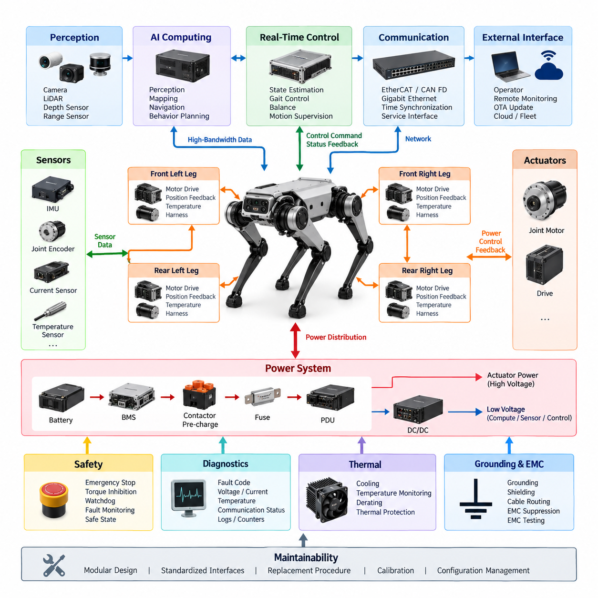
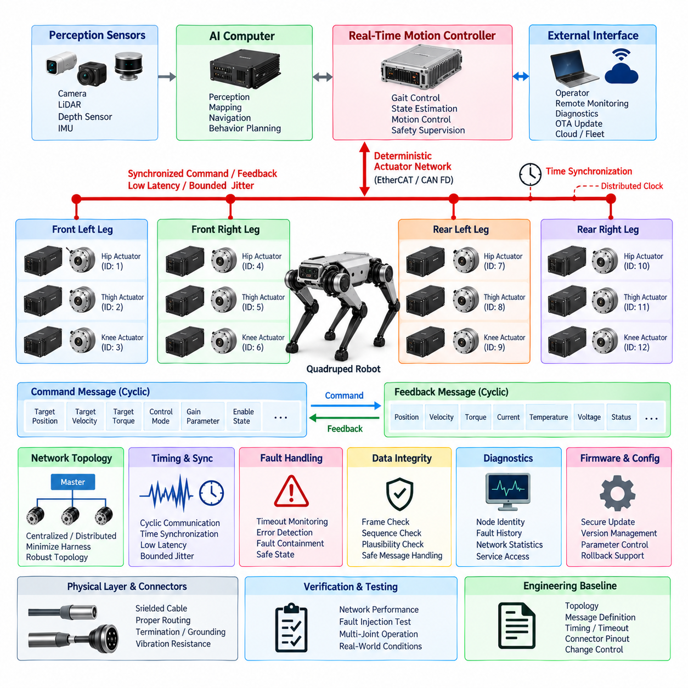
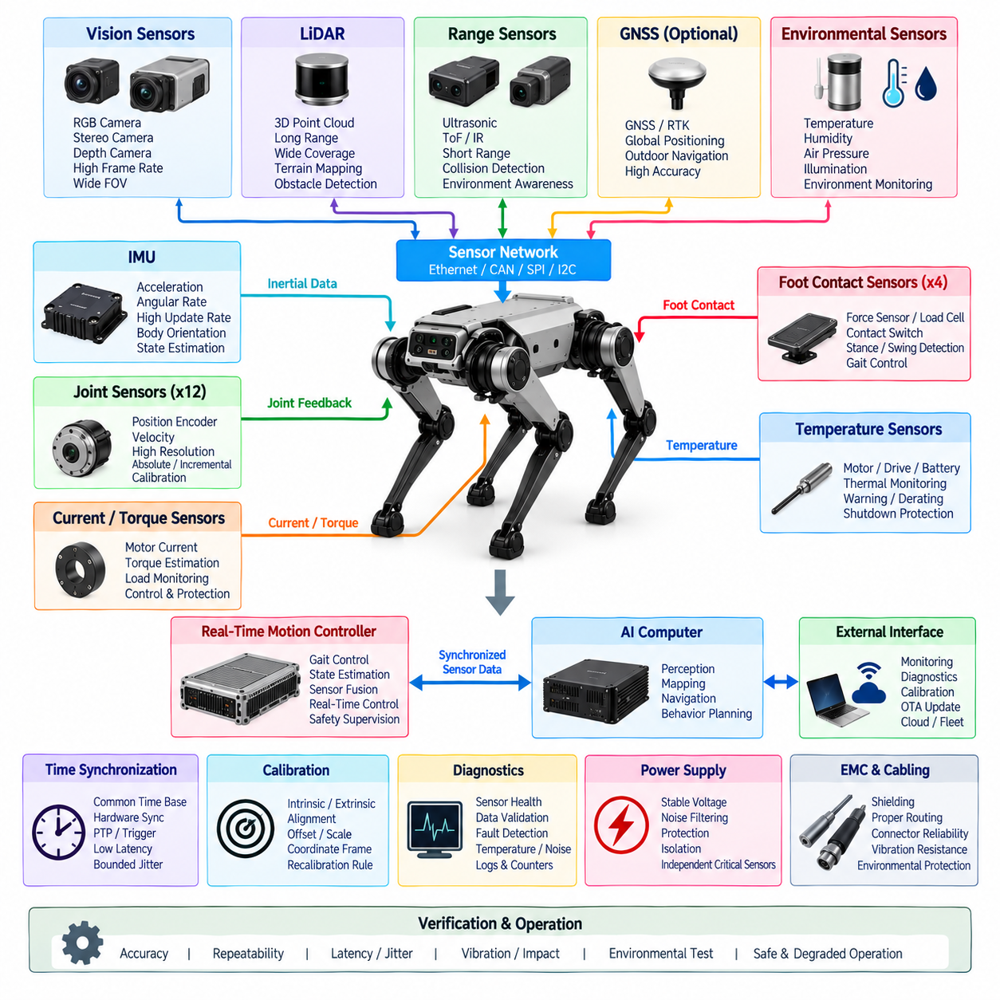
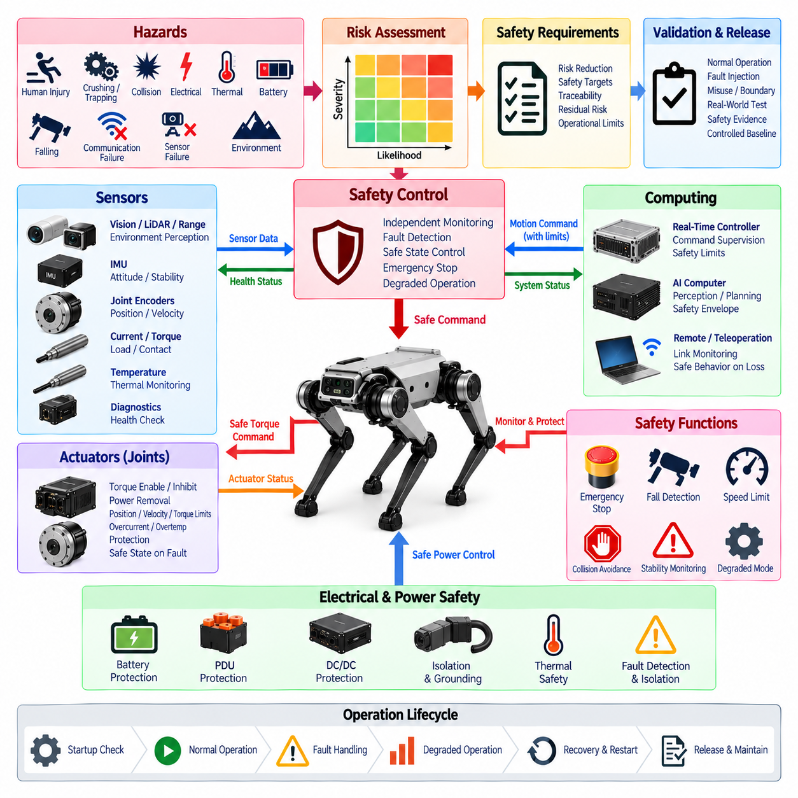
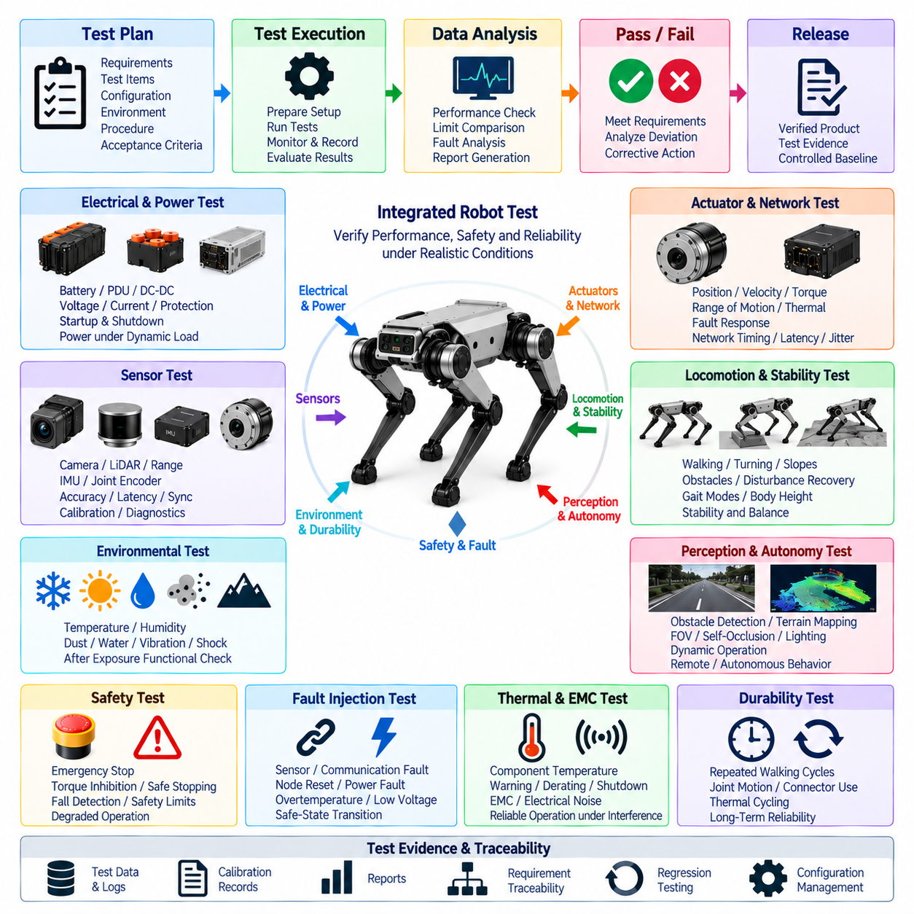

**Volume 22. Hills Robotics Engineering Standards**


# Chapter 13. HRS-013 Quadruped

##  

## 13.01. Quadruped EE Architecture Standard

{width="7.268055555555556in" height="7.268055555555556in"}

A quadruped electrical and electronic architecture shall be designed as a distributed, real-time system that integrates power conversion, joint actuation, sensing, computing, communication, diagnostics, and safety functions into one coordinated platform. The architecture shall support stable locomotion under continuously changing mechanical loads while maintaining deterministic control behavior, electrical robustness, and fault containment across all four legs.

The system architecture shall separate energy distribution, real-time motion control, perception computing, safety supervision, and external communication into clearly defined functional domains. Interfaces between domains shall be standardized so that changes to actuators, batteries, sensors, or computing modules do not require uncontrolled redesign of the complete robot. Electrical boundaries shall also provide appropriate isolation and protection against faults propagating between subsystems.

The primary energy source shall supply a protected main power bus through battery management, contactor, pre-charge, fuse, and power distribution functions. High-current actuator power shall be separated from regulated low-voltage rails used by computers, sensors, communication devices, and safety controllers. DC/DC converters shall provide stable auxiliary voltages despite rapid current variations caused by acceleration, landing, stair climbing, recovery motions, or simultaneous joint operation.

Power distribution shall account for the highly dynamic nature of quadruped locomotion. Joint motors can generate large transient currents during stance, jumping, disturbance rejection, and recovery from loss of balance. Conductor sizing, connector ratings, fuse coordination, bus impedance, converter capacity, and battery discharge capability shall therefore be evaluated using both continuous and peak operating conditions rather than nominal power consumption alone.

Each leg shall form a modular electrical subsystem containing joint actuators, motor drives, position feedback, temperature monitoring, and associated harness interfaces. Hip, thigh, and knee joint modules shall use repeatable electrical interfaces wherever practical so that legs can be manufactured, tested, replaced, and serviced as standardized assemblies. Module identification and configuration information shall allow the central controller to verify installed hardware before enabling motion.

The actuator architecture shall provide deterministic command and feedback paths between the motion controller and every joint drive. Joint position, velocity, torque or current, drive status, temperature, voltage, and fault information shall be available at rates appropriate for dynamic locomotion control. Communication latency, jitter, synchronization, and packet loss shall be controlled because inconsistent actuator timing can directly degrade balance and whole-body stability.

The computing architecture shall distinguish hard real-time control from computationally intensive perception and Physical AI functions. A real-time controller shall execute joint control, state estimation interfaces, gait execution, balance functions, and safety-related motion supervision, while an AI computing platform may execute vision, terrain interpretation, semantic perception, navigation, mapping, behavior planning, and learned policies. Failure of higher-level AI functions shall not directly compromise basic actuator safety.

Sensor architecture shall combine proprioceptive and exteroceptive sensing. Joint encoders, motor current sensing, actuator temperature sensing, and inertial measurement provide information about internal robot state, while cameras, depth sensors, LiDAR, range sensors, or other environmental sensors support terrain understanding and navigation. Sensor placement, power supply, grounding, synchronization, calibration, and communication interfaces shall be defined as architectural requirements rather than treated as independent component details.

An IMU shall provide a high-rate reference for body orientation, angular velocity, and acceleration and shall be integrated closely with the real-time state-estimation path. Joint feedback and IMU measurements shall use a common or traceable time base whenever sensor fusion depends on precise temporal alignment. Additional body or foot sensing may be incorporated when required for contact estimation, load recognition, slip detection, or terrain interaction.

Communication networks shall be partitioned according to timing and bandwidth requirements. Deterministic industrial Ethernet, EtherCAT, CAN FD, or equivalent real-time networks may support actuator and low-level control traffic, while Gigabit Ethernet or higher-bandwidth links may serve cameras, LiDAR, AI computers, logging systems, and service interfaces. Network topology shall prevent high-bandwidth perception traffic from interfering with time-critical joint-control communication.

The grounding and EMC architecture shall recognize that high-frequency motor switching, rapidly changing actuator currents, long distributed harnesses, high-speed Ethernet, and sensitive inertial or perception sensors coexist within a compact moving structure. Power return paths, chassis bonding, shield termination, cable separation, common-mode suppression, and connector grounding shall therefore be coordinated at system level. EMC performance shall be verified under representative multi-joint dynamic operation.

Harness design shall accommodate repeated articulation, vibration, shock, torsion, bending, and mechanical impact throughout the expected service life. Leg harnesses shall provide controlled bend radii, strain relief, abrasion protection, secure retention, and sufficient service loops without creating interference with joint motion. Connectors located in exposed areas shall provide environmental protection appropriate to dust, moisture, contamination, and field operation while remaining maintainable.

Safety architecture shall provide an independent mechanism for detecting conditions that require torque inhibition, controlled stop, or complete power removal. Emergency stop, actuator enable, watchdog supervision, communication timeout, overcurrent, overtemperature, battery faults, and critical controller failures shall transition the robot toward a defined safe state. Safety actions shall not depend solely on application software running on the main AI computer.

Fault containment shall be applied so that a single joint, leg, sensor, communication segment, or auxiliary device failure does not unnecessarily disable unrelated electrical functions or create uncontrolled motion. The architecture shall support selective isolation where technically feasible and shall report sufficient diagnostic information to identify the failed subsystem. Critical faults shall be latched or recorded with timestamps and operating context to support root-cause analysis.

Startup and shutdown sequencing shall prevent uncontrolled actuator energization. After power application, the system shall verify battery condition, power rails, controller health, communication links, actuator identity, sensor availability, safety circuits, and essential calibration status before enabling torque. Shutdown shall place joints into an appropriate controlled condition before removing actuator power and shall preserve diagnostic and operational records needed for subsequent service.

The quadruped shall provide a unified diagnostic architecture covering the battery, PDU, DC/DC converters, joint drives, sensors, computing modules, communication networks, and safety devices. Diagnostic information shall include fault codes, warnings, operating counters, voltage and current measurements, thermal conditions, communication statistics, and software or firmware versions. Service interfaces shall support efficient troubleshooting without requiring unnecessary disassembly of the robot.

Software and firmware configuration shall remain traceable to the installed electrical hardware. Each controller, actuator drive, sensor module, and configurable electrical device should expose identification and version information so that compatibility can be checked automatically. Firmware update and OTA mechanisms shall include integrity verification, controlled activation, rollback capability where required, and protection against incomplete updates that could leave the robot in an unsafe configuration.

Thermal design shall consider simultaneous operation of motors, drives, converters, processors, and AI accelerators within a compact enclosure. Temperature sensing shall be provided at critical components, and thermal limits shall be coordinated with software derating and shutdown strategies. Cooling performance shall be evaluated during demanding locomotion scenarios because electrical losses and processor loads can differ substantially from stationary laboratory conditions.

The architecture shall support maintainability through modular replacement of batteries, legs, actuator modules, computing units, sensors, and communication components. Electrical interfaces shall minimize opportunities for incorrect assembly through connector keying, labeling, pin assignment control, and documented mating rules. Replacement procedures shall define any required calibration, configuration verification, functional checks, and safety validation before the robot is returned to operation.

Verification of the architecture shall include static electrical tests and dynamic robot-level tests. Power integrity, voltage drop, protection coordination, grounding, insulation, communication timing, synchronization, EMC behavior, thermal performance, fault injection, emergency stopping, startup sequencing, and diagnostic coverage shall be evaluated under representative locomotion loads. Testing shall include walking, turning, slopes, disturbances, high-torque maneuvers, and other conditions that expose realistic electrical transients.

The approved quadruped EE architecture shall be maintained as a controlled engineering baseline covering block diagrams, power trees, network topology, harness interfaces, connector definitions, grounding strategy, protection devices, controller assignments, safety paths, and diagnostic interfaces. Any architectural change affecting these elements shall undergo documented impact analysis and verification before release, preserving consistency with the broader Hills Robotics electrical, communication, calibration, and safety standards.

4족 보행 로봇(Quadruped)의 전기·전자 아키텍처(Electrical and Electronic Architecture)는 전력 변환(Power Conversion), 관절 구동(Joint Actuation), 센싱(Sensing), 컴퓨팅(Computing), 통신(Communication), 진단(Diagnostics), 안전(Safety) 기능을 하나의 통합 플랫폼으로 구성하는 분산형 실시간 시스템(Distributed Real-Time System)으로 설계해야 한다. 아키텍처는 지속적으로 변화하는 기계적 하중에서도 안정적인 보행을 지원하면서 네 개의 다리 전체에 걸쳐 결정론적 제어 동작(Deterministic Control Behavior), 전기적 견고성(Electrical Robustness), 고장 격리(Fault Containment)를 유지해야 한다.

시스템 아키텍처(System Architecture)는 에너지 분배(Energy Distribution), 실시간 모션 제어(Real-Time Motion Control), 인지 컴퓨팅(Perception Computing), 안전 감독(Safety Supervision), 외부 통신(External Communication)을 명확하게 정의된 기능 영역(Functional Domain)으로 분리해야 한다. 영역 간 인터페이스(Interface)는 표준화하여 액추에이터(Actuator), 배터리(Battery), 센서(Sensor), 컴퓨팅 모듈(Computing Module)이 변경되더라도 전체 로봇을 통제되지 않은 방식으로 재설계할 필요가 없도록 해야 한다. 또한 전기적 경계(Electrical Boundary)는 서브시스템 간 고장 전파를 방지할 수 있도록 적절한 절연(Isolation)과 보호(Protection)를 제공해야 한다.

주 에너지원(Primary Energy Source)은 배터리 관리(Battery Management), 컨택터(Contactor), 프리차지(Pre-Charge), 퓨즈(Fuse), 전력 분배(Power Distribution) 기능을 통해 보호된 주 전력 버스(Main Power Bus)에 전력을 공급해야 한다. 고전류 액추에이터 전원(Actuator Power)은 컴퓨터, 센서, 통신 장치, 안전 제어기에 사용되는 안정화 저전압 전원 레일(Regulated Low-Voltage Rail)과 분리해야 한다. DC/DC 컨버터(DC/DC Converter)는 가속, 착지, 계단 등반, 자세 복구 동작 또는 다수 관절의 동시 구동으로 발생하는 급격한 전류 변화에도 안정적인 보조 전압(Auxiliary Voltage)을 제공해야 한다.

전력 분배(Power Distribution)는 4족 보행 로봇의 매우 동적인 이동 특성을 고려해야 한다. 관절 모터(Joint Motor)는 지지 구간(Stance), 점프(Jumping), 외란 억제(Disturbance Rejection), 균형 상실 후 복구 과정에서 큰 과도 전류(Transient Current)를 발생시킬 수 있다. 따라서 도체 크기(Conductor Sizing), 커넥터 정격(Connector Rating), 퓨즈 보호 협조(Fuse Coordination), 버스 임피던스(Bus Impedance), 컨버터 용량(Converter Capacity), 배터리 방전 성능(Battery Discharge Capability)은 공칭 소비전력뿐 아니라 연속 운전 조건과 최대 부하 조건을 모두 기준으로 평가해야 한다.

각 다리(Leg)는 관절 액추에이터(Joint Actuator), 모터 드라이브(Motor Drive), 위치 피드백(Position Feedback), 온도 모니터링(Temperature Monitoring), 관련 하네스 인터페이스(Harness Interface)를 포함하는 모듈형 전기 서브시스템(Modular Electrical Subsystem)으로 구성해야 한다. 엉덩이 관절(Hip), 허벅지 관절(Thigh), 무릎 관절(Knee) 모듈에는 가능한 범위에서 반복 사용 가능한 전기 인터페이스를 적용하여 다리를 표준화된 어셈블리(Standardized Assembly)로 생산, 시험, 교체 및 정비할 수 있도록 해야 한다. 모듈 식별(Module Identification) 및 구성 정보(Configuration Information)를 통해 중앙 제어기(Central Controller)가 동작 활성화 전에 설치된 하드웨어를 검증할 수 있어야 한다.

액추에이터 아키텍처(Actuator Architecture)는 모션 제어기(Motion Controller)와 모든 관절 드라이브(Joint Drive) 사이에 결정론적인 명령 및 피드백 경로(Deterministic Command and Feedback Path)를 제공해야 한다. 관절 위치, 속도, 토크 또는 전류, 드라이브 상태, 온도, 전압, 고장 정보는 동적 보행 제어(Dynamic Locomotion Control)에 적합한 주기로 제공되어야 한다. 불규칙한 액추에이터 타이밍은 균형과 전신 안정성(Whole-Body Stability)을 직접 저하시킬 수 있으므로 통신 지연(Communication Latency), 지터(Jitter), 동기화(Synchronization), 패킷 손실(Packet Loss)을 관리해야 한다.

컴퓨팅 아키텍처(Computing Architecture)는 하드 실시간 제어(Hard Real-Time Control)와 높은 연산량이 필요한 인지(Perception) 및 피지컬 AI(Physical AI) 기능을 구분해야 한다. 실시간 제어기(Real-Time Controller)는 관절 제어, 상태 추정 인터페이스(State Estimation Interface), 보행 패턴 실행(Gait Execution), 균형 제어(Balance Control), 안전 관련 모션 감독을 수행하며, AI 컴퓨팅 플랫폼(AI Computing Platform)은 비전(Vision), 지형 해석(Terrain Interpretation), 의미론적 인지(Semantic Perception), 내비게이션(Navigation), 매핑(Mapping), 행동 계획(Behavior Planning), 학습 정책(Learned Policy)을 수행할 수 있다. 상위 AI 기능의 고장이 기본적인 액추에이터 안전성을 직접 손상시켜서는 안 된다.

센서 아키텍처(Sensor Architecture)는 고유수용성 센싱(Proprioceptive Sensing)과 외부수용성 센싱(Exteroceptive Sensing)을 결합해야 한다. 관절 엔코더(Joint Encoder), 모터 전류 센싱(Motor Current Sensing), 액추에이터 온도 센싱(Actuator Temperature Sensing), 관성 측정(Inertial Measurement)은 로봇 내부 상태에 대한 정보를 제공하며, 카메라(Camera), 깊이 센서(Depth Sensor), 라이다(LiDAR), 거리 센서(Range Sensor) 등의 환경 센서는 지형 이해와 내비게이션을 지원한다. 센서 배치, 전원 공급, 접지(Grounding), 동기화, 캘리브레이션(Calibration), 통신 인터페이스는 독립적인 부품 세부사항이 아니라 아키텍처 요구사항(Architectural Requirement)으로 정의해야 한다.

관성측정장치(IMU)는 몸체 방향(Body Orientation), 각속도(Angular Velocity), 가속도(Acceleration)에 대한 고속 기준 정보를 제공하고 실시간 상태 추정 경로(Real-Time State Estimation Path)와 긴밀하게 통합되어야 한다. 센서 융합(Sensor Fusion)이 정확한 시간 정렬(Temporal Alignment)에 의존하는 경우 관절 피드백과 IMU 측정값은 공통 또는 추적 가능한 시간 기준(Time Base)을 사용해야 한다. 접촉 추정(Contact Estimation), 하중 인식(Load Recognition), 미끄러짐 감지(Slip Detection), 지형 상호작용(Terrain Interaction)이 필요한 경우 추가적인 몸체 또는 발 센싱을 적용할 수 있다.

통신 네트워크(Communication Network)는 시간 결정성과 대역폭 요구사항에 따라 분할해야 한다. 결정론적 산업용 이더넷(Deterministic Industrial Ethernet), EtherCAT, CAN FD 또는 동등한 실시간 네트워크(Real-Time Network)를 액추에이터 및 저수준 제어 트래픽에 사용할 수 있으며, 기가비트 이더넷(Gigabit Ethernet) 이상의 고대역폭 연결은 카메라, LiDAR, AI 컴퓨터, 로깅 시스템(Logging System), 서비스 인터페이스(Service Interface)에 사용할 수 있다. 네트워크 토폴로지(Network Topology)는 고대역폭 인지 데이터가 시간 임계적인 관절 제어 통신을 방해하지 않도록 구성해야 한다.

접지 및 전자파 적합성 아키텍처(Grounding and EMC Architecture)는 고주파 모터 스위칭(High-Frequency Motor Switching), 급격하게 변화하는 액추에이터 전류, 분산된 긴 하네스, 고속 이더넷, 민감한 관성 및 인지 센서가 제한된 이동 구조 내부에 공존한다는 점을 고려해야 한다. 따라서 전력 리턴 경로(Power Return Path), 섀시 본딩(Chassis Bonding), 실드 종단(Shield Termination), 케이블 분리(Cable Separation), 공통 모드 억제(Common-Mode Suppression), 커넥터 접지를 시스템 수준에서 조정해야 한다. 전자파 적합성(EMC) 성능은 대표적인 다관절 동적 운전 조건에서 검증해야 한다.

하네스 설계(Harness Design)는 예상 서비스 수명 동안 반복적인 관절 운동, 진동, 충격, 비틀림, 굽힘, 기계적 충격을 견딜 수 있어야 한다. 다리 하네스(Leg Harness)는 관절 움직임을 방해하지 않으면서 관리된 굽힘 반경(Controlled Bend Radius), 스트레인 릴리프(Strain Relief), 마모 보호(Abrasion Protection), 견고한 고정, 충분한 서비스 루프(Service Loop)를 제공해야 한다. 외부에 노출되는 커넥터는 현장 정비성을 유지하면서 먼지, 수분, 오염 및 운용 환경에 적합한 환경 보호(Environmental Protection)를 제공해야 한다.

안전 아키텍처(Safety Architecture)는 토크 차단(Torque Inhibition), 제어 정지(Controlled Stop) 또는 완전한 전원 차단(Complete Power Removal)이 필요한 상태를 감지하기 위한 독립적인 메커니즘을 제공해야 한다. 비상 정지(Emergency Stop), 액추에이터 활성화(Actuator Enable), 워치독 감독(Watchdog Supervision), 통신 타임아웃(Communication Timeout), 과전류(Overcurrent), 과열(Overtemperature), 배터리 고장, 중요 제어기 고장은 로봇을 정의된 안전 상태(Safe State)로 전환해야 한다. 안전 동작이 주 AI 컴퓨터(Main AI Computer)에서 실행되는 응용 소프트웨어에만 의존해서는 안 된다.

고장 격리(Fault Containment)는 단일 관절, 다리, 센서, 통신 구간 또는 보조 장치의 고장이 관련 없는 전기 기능을 불필요하게 비활성화하거나 제어되지 않은 움직임을 발생시키지 않도록 적용해야 한다. 기술적으로 가능한 경우 아키텍처는 선택적 격리(Selective Isolation)를 지원하고 고장난 서브시스템을 식별할 수 있는 충분한 진단 정보를 제공해야 한다. 중요 고장(Critical Fault)은 근본 원인 분석(Root-Cause Analysis)을 지원할 수 있도록 타임스탬프(Timestamp)와 운전 상황 정보와 함께 래치(Latch)하거나 기록해야 한다.

시동 및 종료 시퀀스(Startup and Shutdown Sequencing)는 제어되지 않은 액추에이터 활성화를 방지해야 한다. 전원 인가 후 시스템은 토크를 활성화하기 전에 배터리 상태, 전원 레일, 제어기 상태, 통신 링크, 액추에이터 식별 정보, 센서 가용성, 안전 회로, 필수 캘리브레이션 상태를 검증해야 한다. 종료 과정에서는 액추에이터 전원을 제거하기 전에 관절을 적절하게 제어된 상태로 전환하고 이후 정비에 필요한 진단 및 운전 기록을 보존해야 한다.

4족 보행 로봇은 배터리, 전력분배장치(PDU), DC/DC 컨버터, 관절 드라이브, 센서, 컴퓨팅 모듈, 통신 네트워크, 안전 장치를 포괄하는 통합 진단 아키텍처(Unified Diagnostic Architecture)를 제공해야 한다. 진단 정보에는 고장 코드(Fault Code), 경고, 운전 카운터(Operating Counter), 전압 및 전류 측정값, 열 상태(Thermal Condition), 통신 통계, 소프트웨어 및 펌웨어 버전이 포함되어야 한다. 서비스 인터페이스는 로봇을 불필요하게 분해하지 않고도 효율적인 고장 진단(Troubleshooting)을 수행할 수 있도록 지원해야 한다.

소프트웨어 및 펌웨어 구성(Software and Firmware Configuration)은 설치된 전기 하드웨어와 추적 가능해야 한다. 각 제어기, 액추에이터 드라이브, 센서 모듈 및 구성 가능한 전기 장치는 식별 정보와 버전 정보를 제공하여 호환성(Compatibility)을 자동으로 확인할 수 있도록 해야 한다. 펌웨어 업데이트 및 무선 업데이트(OTA) 메커니즘은 무결성 검증(Integrity Verification), 제어된 활성화(Controlled Activation), 필요한 경우 롤백(Rollback) 기능을 포함하고, 불완전한 업데이트로 인해 로봇이 안전하지 않은 구성 상태에 남는 것을 방지해야 한다.

열 설계(Thermal Design)는 제한된 인클로저(Enclosure) 내부에서 모터, 드라이브, 컨버터, 프로세서 및 AI 가속기(AI Accelerator)가 동시에 동작하는 상황을 고려해야 한다. 주요 부품에는 온도 센싱을 적용하고 열 한계(Thermal Limit)를 소프트웨어 디레이팅(Software Derating) 및 셧다운(Shutdown) 전략과 연계해야 한다. 전기적 손실과 프로세서 부하는 정지 상태의 실험실 조건과 크게 다를 수 있으므로 냉각 성능은 고부하 보행 시나리오에서 평가해야 한다.

아키텍처는 배터리, 다리, 액추에이터 모듈, 컴퓨팅 장치, 센서 및 통신 부품을 모듈 방식으로 교체할 수 있도록 정비성(Maintainability)을 지원해야 한다. 전기 인터페이스는 커넥터 키잉(Connector Keying), 라벨링(Labeling), 핀 할당 관리(Pin Assignment Control), 문서화된 체결 규칙(Mating Rule)을 통해 잘못된 조립 가능성을 최소화해야 한다. 교체 절차에서는 로봇을 다시 운용하기 전에 필요한 캘리브레이션, 구성 검증(Configuration Verification), 기능 점검(Functional Check), 안전 검증(Safety Validation)을 정의해야 한다.

아키텍처 검증(Architecture Verification)은 정적 전기 시험(Static Electrical Test)과 동적 로봇 수준 시험(Dynamic Robot-Level Test)을 모두 포함해야 한다. 전력 무결성(Power Integrity), 전압 강하(Voltage Drop), 보호 협조(Protection Coordination), 접지, 절연(Isolation), 통신 타이밍, 동기화, EMC 동작, 열 성능, 고장 주입(Fault Injection), 비상 정지, 시동 시퀀스 및 진단 범위(Diagnostic Coverage)를 대표적인 보행 부하 조건에서 평가해야 한다. 시험에는 보행, 회전, 경사로, 외란, 고토크 동작 및 실제 전기적 과도 상태를 발생시키는 기타 조건이 포함되어야 한다.

승인된 4족 보행 로봇 전기·전자 아키텍처(Quadruped EE Architecture)는 블록 다이어그램(Block Diagram), 전력 트리(Power Tree), 네트워크 토폴로지, 하네스 인터페이스, 커넥터 정의, 접지 전략(Grounding Strategy), 보호 장치, 제어기 할당(Controller Assignment), 안전 경로(Safety Path), 진단 인터페이스를 포함하는 통제된 엔지니어링 기준선(Controlled Engineering Baseline)으로 유지해야 한다. 이러한 요소에 영향을 미치는 모든 아키텍처 변경은 릴리스 전에 문서화된 영향 분석(Impact Analysis)과 검증을 수행하여 Hills Robotics의 전기, 통신, 캘리브레이션 및 안전 표준과의 일관성을 유지해야 한다.

##  

## 13.02. Actuator Network Standard

{width="7.268055555555556in" height="7.268055555555556in"}

The quadruped actuator network shall provide a deterministic, synchronized, and fault-tolerant communication infrastructure between the real-time motion controller and all joint actuator modules. The network shall support high-frequency command and feedback exchange required for dynamic locomotion while maintaining predictable latency and bounded jitter. Network design shall be treated as part of the motion-control architecture rather than as a general-purpose communication interface.

Each actuator node shall represent a clearly identifiable joint module with a unique logical address, hardware identity, firmware version, and configuration record. Hip, thigh, and knee actuator modules should use standardized communication interfaces wherever practical. Node identification shall prevent duplicate addressing and incorrect joint assignment, and the controller shall verify the expected actuator topology before torque or motion commands are enabled.

The preferred actuator network shall use a deterministic real-time communication technology such as EtherCAT, CAN FD, or an equivalent protocol selected according to control frequency, actuator count, payload size, synchronization accuracy, wiring complexity, and safety requirements. General-purpose Ethernet traffic shall not share an uncontrolled communication path with time-critical actuator commands when such sharing could introduce variable latency or congestion.

The network topology shall support the physical arrangement of the quadruped while minimizing harness length, connector count, and communication failure points. A centralized topology may connect all joint drives directly to the primary controller, while a distributed topology may organize communication by leg or actuator group. The selected topology shall provide sufficient bandwidth and deterministic timing under simultaneous operation of every joint at the maximum specified control rate.

Joint command messages shall contain the information required by the selected control mode, which may include target position, velocity, torque, current, gain parameters, operating mode, and enable state. Feedback messages shall provide measured position, velocity, estimated or measured torque, motor current, drive temperature, supply voltage, operating state, and diagnostic status. Signal definitions, units, scaling, limits, and update rates shall be controlled configuration data.

The actuator network shall support cyclic communication suitable for closed-loop locomotion control. Command transmission and feedback acquisition shall occur according to a defined control cycle so that the motion controller receives a coherent representation of the robot state. Communication scheduling shall prevent individual nodes or asynchronous service messages from delaying critical cyclic traffic beyond the timing limits established for balance and gait control.

Time synchronization shall maintain a consistent temporal relationship among actuator commands, joint feedback, IMU measurements, and state-estimation data. Where distributed clocks or equivalent synchronization mechanisms are available, they should be used to establish a common time reference across actuator nodes. Synchronization accuracy shall be specified and verified according to the requirements of whole-body control, contact estimation, and sensor fusion.

Communication latency shall be bounded from command generation at the real-time controller to command acceptance at each actuator drive and from joint measurement acquisition to availability at the controller. Maximum allowable latency and jitter shall be defined for the selected control architecture. Performance shall be evaluated during simultaneous multi-joint motion because network behavior under light laboratory traffic may not represent demanding locomotion conditions.

The actuator network shall define explicit operating states such as initialization, pre-operational, ready, enabled, active control, degraded operation, fault, and shutdown where supported by the selected drive architecture. State transitions shall follow controlled sequences and shall prevent unexpected torque generation. An actuator shall not enter an enabled state until communication, configuration, safety status, and essential feedback signals have been validated.

Communication timeout monitoring shall be implemented at both controller and actuator levels where technically supported. Loss of cyclic commands, invalid message sequences, synchronization failure, or communication interruption beyond the specified timeout shall cause the affected actuator or actuator group to transition toward a defined safe behavior. The response shall be coordinated with the quadruped safety architecture to avoid uncontrolled collapse or unexpected motion.

Network fault handling shall distinguish transient communication errors from persistent failures. Error counters, frame errors, dropped packets, synchronization deviations, node resets, bus-off conditions, link interruptions, and topology changes shall be monitored when supported by the protocol. Repeated or safety-relevant communication faults shall generate diagnostic events with timestamps and sufficient context to support field troubleshooting and root-cause analysis.

Fault containment shall prevent a malfunctioning actuator node from continuously disrupting communication with healthy joints. Network architecture, protocol mechanisms, controller supervision, and electrical protection shall be coordinated to isolate or disable a failed node where feasible. A single communication failure shall not result in uncontrolled commands being accepted by other actuators, and stale commands shall never be interpreted as valid continuing motion requests.

The actuator communication interface shall incorporate data-integrity mechanisms appropriate to the selected protocol. Frame checking, sequence monitoring, timeout detection, plausibility checks, command-range validation, and state-dependent message acceptance shall be applied as required. Safety-related actuator commands shall receive additional protection where necessary so that corrupted, duplicated, delayed, or unintended messages cannot directly produce hazardous joint behavior.

Physical-layer design shall consider the severe electrical environment produced by high-current motors, inverter switching, DC/DC converters, and rapidly changing joint loads. Communication cables shall be routed and shielded to minimize coupling from actuator power conductors. Cable impedance, termination, grounding, connector shielding, bend radius, and branch length shall comply with the selected network technology and remain valid throughout repeated leg articulation.

Actuator connectors shall provide reliable communication under vibration, shock, repeated movement, contamination, and maintenance operations. Power and communication contacts may share a connector only when electrical separation, EMC performance, current capacity, creepage, clearance, and serviceability requirements are satisfied. Connector keying and pin assignment shall prevent incorrect mating, polarity reversal, and unintended connection between actuator modules.

The actuator network shall provide sufficient diagnostic access without compromising deterministic control performance. Service tools shall be capable of reading node identity, firmware version, communication state, fault history, voltage, current, temperature, encoder status, operating counters, and relevant network statistics. Diagnostic traffic shall be scheduled or rate-limited so that maintenance operations cannot consume bandwidth reserved for real-time joint control.

Configuration parameters shall be managed as controlled engineering data. Network address, joint assignment, direction convention, gear ratio, encoder offset, torque constant, current limit, thermal limit, communication period, timeout, and control parameters shall be traceable to the corresponding actuator hardware and software version. Unauthorized or incompatible configuration changes shall be detected before the actuator is permitted to enter active operation.

Firmware update mechanisms shall preserve actuator-network integrity throughout maintenance and OTA operations. Updates shall verify actuator identity, firmware compatibility, image integrity, and successful programming before activation. Where practical, recovery or rollback mechanisms shall be provided for interrupted updates. Firmware transfer shall not occur during normal dynamic operation when it could interfere with deterministic communication or actuator safety.

Startup verification shall discover or confirm all required actuator nodes and compare the detected topology with the approved robot configuration. Missing, duplicated, unexpected, or incompatible nodes shall generate a diagnostic condition and prevent normal motion when the discrepancy affects safe control. Joint feedback plausibility and communication health shall be checked before torque enable so that wiring or configuration errors are detected before locomotion begins.

Network performance verification shall include bandwidth utilization, cyclic timing, end-to-end latency, jitter, synchronization accuracy, packet or frame errors, timeout behavior, node recovery, cable disturbance, and simultaneous maximum-rate communication. Testing shall be performed with all joints active under representative walking, turning, slope, disturbance-rejection, and high-torque conditions to reproduce electrical noise and processor loads encountered during actual robot operation.

Fault-injection testing shall verify network behavior during cable disconnection, connector intermittency, actuator reset, corrupted or missing communication, delayed feedback, synchronization loss, controller restart, and individual node failure. The resulting actuator response, safety transition, diagnostic record, and system recovery shall conform to defined requirements. Recovery shall never automatically restore hazardous torque without the required state and safety checks.

The released actuator network shall be maintained as a controlled engineering baseline containing topology, protocol selection, node assignments, message definitions, control periods, synchronization requirements, timeout values, connector pinouts, cable specifications, termination rules, diagnostic definitions, and firmware compatibility information. Any change affecting real-time communication behavior shall undergo documented impact analysis and regression verification before release.

4족 보행 로봇(Quadruped)의 액추에이터 네트워크(Actuator Network)는 실시간 모션 제어기(Real-Time Motion Controller)와 모든 관절 액추에이터 모듈(Joint Actuator Module) 사이에 결정론적(Deterministic)이고 동기화(Synchronized)되며 고장 허용(Fault-Tolerant)이 가능한 통신 인프라를 제공해야 한다. 네트워크는 동적 보행(Dynamic Locomotion)에 필요한 고주파 명령 및 피드백 교환을 지원하면서 예측 가능한 지연시간(Latency)과 제한된 지터(Bounded Jitter)를 유지해야 한다. 네트워크 설계는 범용 통신 인터페이스가 아니라 모션 제어 아키텍처(Motion-Control Architecture)의 일부로 취급해야 한다.

각 액추에이터 노드(Actuator Node)는 고유한 논리 주소(Logical Address), 하드웨어 식별 정보(Hardware Identity), 펌웨어 버전(Firmware Version), 구성 기록(Configuration Record)을 갖는 명확하게 식별 가능한 관절 모듈(Joint Module)을 나타내야 한다. 엉덩이(Hip), 허벅지(Thigh), 무릎(Knee) 액추에이터 모듈은 가능한 범위에서 표준화된 통신 인터페이스를 사용해야 한다. 노드 식별(Node Identification)은 주소 중복 및 잘못된 관절 할당을 방지해야 하며, 제어기는 토크 또는 모션 명령을 활성화하기 전에 예상 액추에이터 토폴로지(Actuator Topology)를 검증해야 한다.

권장 액추에이터 네트워크는 EtherCAT, CAN FD 또는 제어 주파수(Control Frequency), 액추에이터 수, 페이로드 크기(Payload Size), 동기화 정확도(Synchronization Accuracy), 배선 복잡도(Wiring Complexity), 안전 요구사항에 따라 선정된 동등한 결정론적 실시간 통신 기술(Deterministic Real-Time Communication Technology)을 사용해야 한다. 범용 이더넷(General-Purpose Ethernet) 트래픽은 가변 지연 또는 혼잡을 발생시킬 가능성이 있는 경우 시간 임계적인 액추에이터 명령과 통제되지 않은 통신 경로를 공유해서는 안 된다.

네트워크 토폴로지(Network Topology)는 하네스 길이, 커넥터 수 및 통신 고장 지점을 최소화하면서 4족 보행 로봇의 물리적 배치를 지원해야 한다. 중앙집중형 토폴로지(Centralized Topology)는 모든 관절 드라이브를 주 제어기(Primary Controller)에 직접 연결할 수 있으며, 분산형 토폴로지(Distributed Topology)는 다리 또는 액추에이터 그룹별로 통신을 구성할 수 있다. 선정된 토폴로지는 모든 관절이 최대 지정 제어 주기로 동시에 동작하는 조건에서도 충분한 대역폭과 결정론적 타이밍을 제공해야 한다.

관절 명령 메시지(Joint Command Message)는 선택된 제어 모드(Control Mode)에 필요한 정보를 포함해야 하며, 여기에는 목표 위치(Target Position), 속도(Velocity), 토크(Torque), 전류(Current), 게인 파라미터(Gain Parameter), 동작 모드(Operating Mode), 활성화 상태(Enable State)가 포함될 수 있다. 피드백 메시지(Feedback Message)는 측정 위치, 속도, 추정 또는 측정 토크, 모터 전류, 드라이브 온도, 공급 전압, 동작 상태 및 진단 상태를 제공해야 한다. 신호 정의, 단위, 스케일링(Scaling), 제한값 및 업데이트 주기는 통제된 구성 데이터(Controlled Configuration Data)로 관리해야 한다.

액추에이터 네트워크는 폐루프 보행 제어(Closed-Loop Locomotion Control)에 적합한 주기 통신(Cyclic Communication)을 지원해야 한다. 명령 전송과 피드백 획득은 정의된 제어 주기(Control Cycle)에 따라 수행되어 모션 제어기가 일관된 로봇 상태 정보를 수신할 수 있도록 해야 한다. 통신 스케줄링(Communication Scheduling)은 개별 노드 또는 비동기 서비스 메시지가 균형 제어 및 보행 제어에 설정된 타이밍 한계를 초과하여 중요한 주기 트래픽을 지연시키지 않도록 해야 한다.

시간 동기화(Time Synchronization)는 액추에이터 명령, 관절 피드백, 관성측정장치(IMU) 측정값 및 상태 추정 데이터(State-Estimation Data) 사이에 일관된 시간 관계를 유지해야 한다. 분산 클록(Distributed Clock) 또는 동등한 동기화 메커니즘을 사용할 수 있는 경우 액추에이터 노드 전체에 공통 시간 기준(Common Time Reference)을 설정하기 위해 이를 사용하는 것이 권장된다. 동기화 정확도는 전신 제어(Whole-Body Control), 접촉 추정(Contact Estimation), 센서 융합(Sensor Fusion)의 요구사항에 따라 규정하고 검증해야 한다.

통신 지연시간(Communication Latency)은 실시간 제어기에서 명령이 생성된 시점부터 각 액추에이터 드라이브에서 명령을 수락하는 시점까지, 그리고 관절 측정값 획득부터 제어기에서 해당 정보를 사용할 수 있는 시점까지 제한되어야 한다. 선택된 제어 아키텍처에 대해 최대 허용 지연시간과 지터를 정의해야 한다. 경부하 실험실 통신 환경에서의 네트워크 동작은 고부하 보행 조건을 대표하지 못할 수 있으므로 성능은 다수 관절의 동시 동작 조건에서 평가해야 한다.

액추에이터 네트워크는 선택된 드라이브 아키텍처가 지원하는 범위에서 초기화(Initialization), 사전 운전(Pre-Operational), 준비(Ready), 활성화(Enabled), 능동 제어(Active Control), 성능 저하 운전(Degraded Operation), 고장(Fault), 종료(Shutdown)와 같은 명확한 동작 상태를 정의해야 한다. 상태 전이(State Transition)는 통제된 시퀀스를 따라야 하며 예상하지 못한 토크 발생을 방지해야 한다. 통신, 구성, 안전 상태 및 필수 피드백 신호가 검증되기 전에는 액추에이터가 활성화 상태로 진입해서는 안 된다.

기술적으로 지원되는 경우 제어기와 액추에이터 양쪽에서 통신 타임아웃 감시(Communication Timeout Monitoring)를 구현해야 한다. 주기 명령 손실, 유효하지 않은 메시지 시퀀스, 동기화 실패 또는 지정된 타임아웃을 초과하는 통신 중단이 발생하면 해당 액추에이터 또는 액추에이터 그룹을 정의된 안전 동작(Safe Behavior)으로 전환해야 한다. 이러한 대응은 제어되지 않은 붕괴 또는 예상하지 못한 움직임을 방지할 수 있도록 4족 보행 로봇 안전 아키텍처(Safety Architecture)와 연계되어야 한다.

네트워크 고장 처리(Network Fault Handling)는 일시적인 통신 오류와 지속적인 고장을 구분해야 한다. 프로토콜이 지원하는 경우 오류 카운터(Error Counter), 프레임 오류(Frame Error), 패킷 손실(Dropped Packet), 동기화 편차(Synchronization Deviation), 노드 리셋(Node Reset), 버스 오프(Bus-Off), 링크 중단(Link Interruption), 토폴로지 변경을 모니터링해야 한다. 반복적이거나 안전과 관련된 통신 고장은 타임스탬프와 현장 고장 진단 및 근본 원인 분석(Root-Cause Analysis)에 필요한 충분한 상황 정보를 포함하는 진단 이벤트(Diagnostic Event)를 생성해야 한다.

고장 격리(Fault Containment)는 오작동하는 액추에이터 노드가 정상적인 관절과의 통신을 지속적으로 방해하지 않도록 해야 한다. 가능한 경우 네트워크 아키텍처, 프로토콜 메커니즘, 제어기 감시 및 전기적 보호 기능을 연계하여 고장난 노드를 격리하거나 비활성화해야 한다. 단일 통신 고장으로 인해 다른 액추에이터가 제어되지 않은 명령을 수락해서는 안 되며, 오래된 명령(Stale Command)을 유효한 연속 동작 요청으로 해석해서는 안 된다.

액추에이터 통신 인터페이스(Actuator Communication Interface)는 선택된 프로토콜에 적합한 데이터 무결성 메커니즘(Data-Integrity Mechanism)을 포함해야 한다. 필요에 따라 프레임 검사(Frame Checking), 시퀀스 감시(Sequence Monitoring), 타임아웃 검출(Timeout Detection), 타당성 검사(Plausibility Check), 명령 범위 검증(Command-Range Validation), 상태 종속 메시지 수락(State-Dependent Message Acceptance)을 적용해야 한다. 안전 관련 액추에이터 명령에는 필요한 경우 추가적인 보호 기능을 적용하여 손상, 중복, 지연 또는 의도하지 않은 메시지가 위험한 관절 동작을 직접 발생시키지 않도록 해야 한다.

물리 계층 설계(Physical-Layer Design)는 고전류 모터, 인버터 스위칭(Inverter Switching), DC/DC 컨버터 및 급격하게 변화하는 관절 부하로 인해 발생하는 가혹한 전기적 환경을 고려해야 한다. 통신 케이블은 액추에이터 전력 도체(Actuator Power Conductor)로부터의 결합을 최소화하도록 배선하고 차폐해야 한다. 케이블 임피던스(Cable Impedance), 종단(Termination), 접지, 커넥터 차폐, 굽힘 반경(Bend Radius), 분기 길이(Branch Length)는 선택된 네트워크 기술의 요구사항을 준수하고 반복적인 다리 관절 운동 중에도 유효한 상태를 유지해야 한다.

액추에이터 커넥터(Actuator Connector)는 진동, 충격, 반복 운동, 오염 및 정비 작업에서도 신뢰성 있는 통신을 제공해야 한다. 전력과 통신 접점은 전기적 분리, EMC 성능, 전류 용량, 연면거리(Creepage), 공간거리(Clearance), 정비성(Serviceability) 요구사항을 만족하는 경우에만 하나의 커넥터에서 공유할 수 있다. 커넥터 키잉(Connector Keying)과 핀 할당(Pin Assignment)은 잘못된 체결, 극성 반전(Polarity Reversal), 액추에이터 모듈 간 의도하지 않은 연결을 방지해야 한다.

액추에이터 네트워크는 결정론적 제어 성능을 저하시키지 않으면서 충분한 진단 접근(Diagnostic Access)을 제공해야 한다. 서비스 도구(Service Tool)는 노드 식별 정보, 펌웨어 버전, 통신 상태, 고장 이력, 전압, 전류, 온도, 엔코더 상태, 운전 카운터 및 관련 네트워크 통계를 읽을 수 있어야 한다. 진단 트래픽(Diagnostic Traffic)은 정비 작업으로 인해 실시간 관절 제어에 예약된 대역폭이 소모되지 않도록 스케줄링하거나 전송률을 제한해야 한다.

구성 파라미터(Configuration Parameter)는 통제된 엔지니어링 데이터(Controlled Engineering Data)로 관리해야 한다. 네트워크 주소, 관절 할당, 방향 규약(Direction Convention), 기어비(Gear Ratio), 엔코더 오프셋(Encoder Offset), 토크 상수(Torque Constant), 전류 제한(Current Limit), 열 제한(Thermal Limit), 통신 주기, 타임아웃 및 제어 파라미터는 해당 액추에이터 하드웨어 및 소프트웨어 버전과 추적 가능해야 한다. 승인되지 않았거나 호환되지 않는 구성 변경은 액추에이터가 능동 운전 상태에 진입하기 전에 검출해야 한다.

펌웨어 업데이트 메커니즘(Firmware Update Mechanism)은 정비 및 무선 업데이트(OTA) 작업 전체에서 액추에이터 네트워크의 무결성을 유지해야 한다. 업데이트는 활성화 전에 액추에이터 식별 정보, 펌웨어 호환성(Firmware Compatibility), 이미지 무결성(Image Integrity), 정상적인 프로그래밍 완료 여부를 검증해야 한다. 가능한 경우 중단된 업데이트를 위한 복구(Recovery) 또는 롤백(Rollback) 메커니즘을 제공해야 한다. 결정론적 통신 또는 액추에이터 안전을 방해할 수 있는 경우 정상적인 동적 운전 중에는 펌웨어를 전송해서는 안 된다.

시동 검증(Startup Verification)은 필요한 모든 액추에이터 노드를 검색하거나 확인하고 감지된 토폴로지를 승인된 로봇 구성과 비교해야 한다. 누락, 중복, 예상하지 못한 노드 또는 호환되지 않는 노드는 진단 상태를 발생시켜야 하며, 이러한 불일치가 안전한 제어에 영향을 미치는 경우 정상적인 동작을 방지해야 한다. 보행을 시작하기 전에 배선 또는 구성 오류를 검출할 수 있도록 토크 활성화 전에 관절 피드백의 타당성과 통신 상태를 점검해야 한다.

네트워크 성능 검증(Network Performance Verification)은 대역폭 사용률(Bandwidth Utilization), 주기 타이밍(Cyclic Timing), 종단 간 지연시간(End-to-End Latency), 지터, 동기화 정확도, 패킷 또는 프레임 오류, 타임아웃 동작, 노드 복구(Node Recovery), 케이블 외란(Cable Disturbance), 최대 전송률의 동시 통신을 포함해야 한다. 실제 로봇 운용에서 발생하는 전기적 노이즈와 프로세서 부하를 재현하기 위해 모든 관절이 활성화된 상태에서 보행, 회전, 경사로, 외란 억제 및 고토크 조건을 포함하여 시험해야 한다.

고장 주입 시험(Fault-Injection Testing)은 케이블 분리, 커넥터 간헐 접촉(Connector Intermittency), 액추에이터 리셋, 손상되거나 누락된 통신, 지연된 피드백, 동기화 손실, 제어기 재시작 및 개별 노드 고장 조건에서 네트워크 동작을 검증해야 한다. 이에 따른 액추에이터 응답, 안전 상태 전이(Safety Transition), 진단 기록 및 시스템 복구는 정의된 요구사항을 준수해야 한다. 필요한 상태 및 안전 점검 없이 복구 과정에서 위험한 토크가 자동으로 다시 활성화되어서는 안 된다.

릴리스된 액추에이터 네트워크(Actuator Network)는 토폴로지, 프로토콜 선정, 노드 할당, 메시지 정의, 제어 주기, 동기화 요구사항, 타임아웃 값, 커넥터 핀아웃(Connector Pinout), 케이블 사양, 종단 규칙, 진단 정의 및 펌웨어 호환성 정보를 포함하는 통제된 엔지니어링 기준선(Controlled Engineering Baseline)으로 유지해야 한다. 실시간 통신 동작에 영향을 미치는 모든 변경 사항은 릴리스 전에 문서화된 영향 분석(Impact Analysis)과 회귀 검증(Regression Verification)을 수행해야 한다.

##  

## 13.03. Quadruped Sensor Standard

{width="7.268055555555556in" height="7.268055555555556in"}

The quadruped sensor architecture shall provide reliable, synchronized, and sufficiently redundant information for locomotion control, state estimation, terrain perception, navigation, diagnostics, and safety supervision. Sensor selection and integration shall consider the highly dynamic motion of a legged platform, including vibration, impact, rapid attitude changes, repeated foot contact, and changing environmental conditions. Sensor interfaces shall be standardized as part of the overall quadruped EE architecture.

The sensor system shall distinguish between proprioceptive sensors that measure the internal state of the robot and exteroceptive sensors that observe the surrounding environment. Proprioceptive sensing shall include joint position, actuator current or torque, temperature, and inertial measurements. Exteroceptive sensing may include RGB cameras, stereo or depth cameras, LiDAR, range sensors, and other perception devices required by the intended operating environment.

Every joint shall provide position feedback with resolution, accuracy, update rate, and latency appropriate to the specified motion-control performance. Absolute position sensing is preferred where initialization without uncontrolled joint movement is required. Where incremental encoders are used, the architecture shall provide a reliable reference procedure. Encoder direction, zero position, scaling, joint assignment, and calibration values shall be maintained as controlled configuration data.

Actuator current or torque-related sensing shall support joint control, load estimation, contact interpretation, diagnostics, and protection functions. Measurement range shall accommodate both continuous locomotion loads and short-duration peak loads associated with acceleration, impact, disturbance rejection, and recovery behavior. Current and torque signals used for control shall have defined accuracy, bandwidth, filtering, saturation behavior, and diagnostic limits.

Temperature sensing shall monitor components whose thermal condition can affect actuator performance, reliability, or safety. Sensors should be located at representative motor, drive, power-electronics, battery, and computing locations as required by the product architecture. Temperature information shall support warning, derating, shutdown, diagnostics, and lifetime assessment, with thresholds coordinated with the corresponding component specifications.

At least one primary inertial measurement unit shall provide body acceleration and angular-rate information at a rate suitable for state estimation and balance control. The IMU installation location and orientation shall be mechanically defined and traceable to the robot coordinate system. Mounting shall minimize unwanted structural vibration while preserving the dynamic response needed for locomotion, and the transformation between sensor and body coordinates shall be maintained as calibrated configuration data.

Where higher integrity or availability is required, an additional IMU or independent attitude-related sensing path may be incorporated. Redundant measurements shall not simply be averaged without fault evaluation. The control architecture should perform plausibility comparison, bias monitoring, signal-quality assessment, and failure detection so that disagreement between sensors can be identified before corrupted inertial information significantly affects balance or locomotion control.

Foot contact sensing may use force sensors, load cells, joint torque estimation, motor current, dedicated contact switches, or combinations of these methods according to mechanical design and performance requirements. The sensing method shall provide sufficient information to distinguish expected stance and swing conditions. Contact information used by gait control shall have defined detection thresholds, hysteresis, filtering, timing characteristics, and failure behavior.

Perception sensors shall provide environmental information required for terrain understanding, obstacle detection, localization, mapping, and autonomous navigation. Camera, depth, and LiDAR configurations shall be selected according to required field of view, operating distance, minimum detectable obstacle, terrain geometry, lighting conditions, and environmental exposure. Sensor placement shall minimize occlusion by the robot body and legs throughout representative gait configurations.

Camera systems shall define resolution, frame rate, exposure behavior, interface bandwidth, field of view, mounting orientation, and calibration requirements. Stereo and depth systems shall additionally specify useful depth range and accuracy appropriate to navigation and terrain assessment. Where multiple cameras are used, their relative mounting geometry shall be mechanically controlled so that calibration remains stable under vibration, transportation, service, and repeated locomotion.

LiDAR or equivalent ranging sensors shall be selected according to detection range, angular coverage, resolution, update rate, environmental rating, and interface requirements. Mounting shall provide the intended obstacle and terrain coverage without unacceptable self-occlusion. The architecture shall consider motion distortion during dynamic locomotion and shall provide sufficiently accurate timestamps and body-motion information when compensation is required by perception or mapping algorithms.

All sensor measurements used together for state estimation, control, or sensor fusion shall use a common or traceable time reference. Hardware synchronization, trigger signals, distributed clocks, Precision Time Protocol, or equivalent mechanisms should be used when software timestamps cannot provide the required accuracy. Timestamp definition shall identify the measurement event represented by the timestamp rather than merely the time at which data arrives at the receiving computer.

Sensor latency and jitter shall be characterized from the physical measurement event to data availability at the consuming controller or computing process. Maximum latency shall be specified for sensors participating in balance, state estimation, contact detection, and other time-critical functions. Variable processing delays from cameras, network switches, middleware, or AI pipelines shall not be allowed to silently degrade synchronization assumptions used by control algorithms.

Sensor communication shall be partitioned according to bandwidth and timing requirements. Joint sensors and other real-time feedback may be transported through the actuator network, while cameras and LiDAR may use Ethernet or dedicated high-bandwidth interfaces. Network capacity shall include peak sensor traffic, protocol overhead, diagnostics, and synchronization messages. Perception traffic shall not interfere with deterministic actuator communication required for stable locomotion.

Sensor power supplies shall be selected according to voltage tolerance, startup current, transient behavior, noise sensitivity, and fault characteristics. Sensitive sensors shall not share poorly controlled power paths with high-current actuators when motor switching or voltage transients could degrade measurement quality. Power distribution shall provide appropriate filtering, protection, grounding, and local decoupling, and a failed sensor shall not cause loss of unrelated critical sensor functions.

Grounding, shielding, and cable routing shall protect low-level sensor signals and high-speed digital interfaces from motor-drive and power-conversion interference. Sensor cables shall be separated from high-current conductors where practical, and shield termination shall follow the defined quadruped grounding architecture. EMC performance shall be evaluated while multiple joints operate dynamically because stationary sensor testing may not reproduce representative electromagnetic disturbances.

Sensor connectors and harnesses shall tolerate vibration, impact, repeated leg movement, flexing, abrasion, contamination, and service operations expected during the robot lifetime. Connectors shall provide suitable environmental protection and mechanical retention. Harness routing shall avoid joint pinch points, excessive bending, tensile loading, and collision with moving structures while maintaining sufficient service loops for assembly and module replacement.

Each sensor shall provide identification and configuration information sufficient to verify compatibility with the installed robot configuration. Relevant information may include sensor type, serial number, hardware revision, firmware version, logical assignment, coordinate frame, calibration version, and communication parameters. Unexpected, duplicated, incompatible, or incorrectly assigned sensors shall be detected during startup when they could affect control, perception, or safety.

Calibration shall establish the relationships required to convert raw measurements into physically meaningful robot data. Calibration records shall include applicable offsets, scale factors, alignment parameters, intrinsic parameters, extrinsic transformations, and relevant environmental compensation. Calibration values shall be version-controlled and traceable to the sensor and robot configuration, consistent with the broader calibration engineering requirements of the robotics platform.

Recalibration shall be required when defined events could invalidate existing sensor relationships. Such events may include sensor replacement, mechanical impact, mounting adjustment, structural repair, repeated calibration failure, abnormal diagnostic trends, or modification of the sensor mounting structure. The system should provide automated or guided calibration procedures where practical to reduce service variability and improve configuration consistency.

Sensor diagnostics shall detect conditions such as missing data, frozen values, excessive noise, out-of-range measurements, implausible changes, communication errors, synchronization loss, temperature excursions, calibration mismatch, and internal sensor faults. Diagnostic logic shall distinguish temporary disturbances from persistent failures where possible. Safety- or control-relevant faults shall be communicated to the appropriate supervisor with timestamps and operating context.

Degraded operation shall be explicitly defined for sensor failures that do not require immediate shutdown. Loss of a noncritical perception sensor may permit restricted locomotion, reduced speed, teleoperation, or controlled return, while loss of a sensor essential to balance or safe motion may require stopping or torque-state transition. The permitted response shall depend on sensor criticality and available independent information rather than on sensor type alone.

Sensor verification shall include accuracy, repeatability, resolution, bandwidth, latency, jitter, synchronization, temperature behavior, vibration resistance, communication robustness, power disturbances, EMC susceptibility, and fault detection. Robot-level testing shall evaluate sensor performance during walking, turning, slopes, impacts, rapid body motion, high actuator loads, and representative environmental conditions rather than relying exclusively on static component-level tests.

The released quadruped sensor configuration shall be maintained as a controlled engineering baseline containing sensor types, approved part numbers, mounting locations, coordinate frames, power interfaces, communication interfaces, update rates, synchronization requirements, calibration data, diagnostic thresholds, connector definitions, and software compatibility. Any change affecting measurement quality, timing, geometry, or safety shall undergo documented impact analysis and appropriate regression verification before release.

4족 보행 로봇(Quadruped)의 센서 아키텍처(Sensor Architecture)는 보행 제어(Locomotion Control), 상태 추정(State Estimation), 지형 인지(Terrain Perception), 내비게이션(Navigation), 진단(Diagnostics), 안전 감독(Safety Supervision)을 위해 신뢰성 있고 동기화되며 충분한 중복성을 갖춘 정보를 제공해야 한다. 센서 선정과 통합은 진동, 충격, 급격한 자세 변화, 반복적인 발 접촉 및 변화하는 환경 조건을 포함하는 다족 보행 플랫폼(Legged Platform)의 매우 동적인 움직임을 고려해야 한다. 센서 인터페이스(Sensor Interface)는 전체 4족 보행 로봇 전기·전자 아키텍처(Quadruped EE Architecture)의 일부로 표준화해야 한다.

센서 시스템(Sensor System)은 로봇의 내부 상태를 측정하는 고유수용성 센서(Proprioceptive Sensor)와 주변 환경을 관측하는 외부수용성 센서(Exteroceptive Sensor)를 구분해야 한다. 고유수용성 센싱(Proprioceptive Sensing)은 관절 위치, 액추에이터 전류 또는 토크, 온도 및 관성 측정(Inertial Measurement)을 포함해야 한다. 외부수용성 센싱(Exteroceptive Sensing)은 의도된 운용 환경에 필요한 RGB 카메라(RGB Camera), 스테레오 또는 깊이 카메라(Stereo or Depth Camera), 라이다(LiDAR), 거리 센서(Range Sensor) 및 기타 인지 장치를 포함할 수 있다.

모든 관절은 지정된 모션 제어(Motion Control) 성능에 적합한 분해능(Resolution), 정확도(Accuracy), 업데이트 주기(Update Rate), 지연시간(Latency)을 갖는 위치 피드백(Position Feedback)을 제공해야 한다. 제어되지 않은 관절 움직임 없이 초기화가 필요한 경우 절대 위치 센싱(Absolute Position Sensing)을 권장한다. 증분형 엔코더(Incremental Encoder)를 사용하는 경우 아키텍처는 신뢰할 수 있는 기준 설정 절차를 제공해야 한다. 엔코더 방향, 영점 위치(Zero Position), 스케일링(Scaling), 관절 할당 및 캘리브레이션 값은 통제된 구성 데이터(Controlled Configuration Data)로 유지해야 한다.

액추에이터 전류 또는 토크 관련 센싱(Actuator Current or Torque-Related Sensing)은 관절 제어, 하중 추정(Load Estimation), 접촉 해석(Contact Interpretation), 진단 및 보호 기능을 지원해야 한다. 측정 범위는 연속적인 보행 하중뿐 아니라 가속, 충격, 외란 억제(Disturbance Rejection), 자세 복구 동작과 관련된 단시간 최대 부하를 수용할 수 있어야 한다. 제어에 사용되는 전류 및 토크 신호는 정의된 정확도, 대역폭(Bandwidth), 필터링(Filtering), 포화 특성(Saturation Behavior), 진단 한계(Diagnostic Limit)를 가져야 한다.

온도 센싱(Temperature Sensing)은 열 상태가 액추에이터 성능, 신뢰성 또는 안전에 영향을 줄 수 있는 부품을 모니터링해야 한다. 제품 아키텍처에서 요구하는 경우 대표적인 모터, 드라이브, 전력전자(Power Electronics), 배터리 및 컴퓨팅 위치에 센서를 배치해야 한다. 온도 정보는 경고(Warning), 디레이팅(Derating), 셧다운(Shutdown), 진단 및 수명 평가(Lifetime Assessment)를 지원해야 하며, 임계값은 해당 부품의 사양과 연계되어야 한다.

최소 하나의 주 관성측정장치(Primary IMU)는 상태 추정과 균형 제어(Balance Control)에 적합한 주기로 몸체 가속도(Body Acceleration)와 각속도(Angular Rate) 정보를 제공해야 한다. IMU 설치 위치와 방향은 기계적으로 정의되고 로봇 좌표계(Robot Coordinate System)와 추적 가능해야 한다. 장착 구조는 보행에 필요한 동적 응답을 유지하면서 불필요한 구조 진동을 최소화해야 하며, 센서 좌표계와 몸체 좌표계 사이의 변환 관계는 캘리브레이션된 구성 데이터(Calibrated Configuration Data)로 유지해야 한다.

더 높은 무결성(Integrity) 또는 가용성(Availability)이 필요한 경우 추가 IMU 또는 독립적인 자세 관련 센싱 경로(Attitude-Related Sensing Path)를 적용할 수 있다. 중복 측정값(Redundant Measurement)은 고장 평가 없이 단순히 평균해서는 안 된다. 제어 아키텍처는 타당성 비교(Plausibility Comparison), 바이어스 모니터링(Bias Monitoring), 신호 품질 평가(Signal-Quality Assessment), 고장 검출(Failure Detection)을 수행하여 손상된 관성 정보가 균형 또는 보행 제어에 심각한 영향을 주기 전에 센서 간 불일치를 식별할 수 있도록 해야 한다.

발 접촉 센싱(Foot Contact Sensing)은 기계 설계 및 성능 요구사항에 따라 힘 센서(Force Sensor), 로드셀(Load Cell), 관절 토크 추정(Joint Torque Estimation), 모터 전류, 전용 접촉 스위치(Contact Switch) 또는 이러한 방법의 조합을 사용할 수 있다. 센싱 방법은 예상되는 지지 상태(Stance)와 스윙 상태(Swing)를 구분할 수 있는 충분한 정보를 제공해야 한다. 보행 제어에 사용되는 접촉 정보는 정의된 검출 임계값(Detection Threshold), 히스테리시스(Hysteresis), 필터링, 타이밍 특성 및 고장 동작(Failure Behavior)을 가져야 한다.

인지 센서(Perception Sensor)는 지형 이해(Terrain Understanding), 장애물 검출(Obstacle Detection), 위치 추정(Localization), 매핑(Mapping), 자율 내비게이션(Autonomous Navigation)에 필요한 환경 정보를 제공해야 한다. 카메라, 깊이 센서 및 LiDAR 구성은 요구 시야각(Field of View), 운용 거리, 최소 검출 장애물, 지형 형상(Terrain Geometry), 조명 조건 및 환경 노출 조건에 따라 선정해야 한다. 센서 배치는 대표적인 보행 자세 전반에서 로봇 몸체와 다리에 의한 가림(Self-Occlusion)을 최소화해야 한다.

카메라 시스템(Camera System)은 해상도(Resolution), 프레임률(Frame Rate), 노출 특성(Exposure Behavior), 인터페이스 대역폭, 시야각, 장착 방향 및 캘리브레이션 요구사항을 정의해야 한다. 스테레오 및 깊이 시스템은 내비게이션과 지형 평가에 적합한 유효 깊이 범위(Useful Depth Range)와 정확도를 추가로 규정해야 한다. 여러 대의 카메라를 사용하는 경우 진동, 운송, 정비 및 반복적인 보행 이후에도 캘리브레이션이 안정적으로 유지될 수 있도록 상대적인 장착 기하 구조(Relative Mounting Geometry)를 기계적으로 관리해야 한다.

라이다 또는 동등한 거리 측정 센서(Ranging Sensor)는 검출 거리, 각도 범위(Angular Coverage), 분해능, 업데이트 주기, 환경 등급(Environmental Rating), 인터페이스 요구사항에 따라 선정해야 한다. 장착 구조는 허용할 수 없는 자체 가림 없이 의도된 장애물 및 지형 탐지 범위를 제공해야 한다. 아키텍처는 동적 보행 과정에서 발생하는 모션 왜곡(Motion Distortion)을 고려해야 하며, 인지 또는 매핑 알고리즘에서 보상이 필요한 경우 충분히 정확한 타임스탬프(Timestamp)와 몸체 움직임 정보를 제공해야 한다.

상태 추정, 제어 또는 센서 융합(Sensor Fusion)에 함께 사용되는 모든 센서 측정값은 공통 또는 추적 가능한 시간 기준(Time Reference)을 사용해야 한다. 소프트웨어 타임스탬프가 필요한 정확도를 제공하지 못하는 경우 하드웨어 동기화(Hardware Synchronization), 트리거 신호(Trigger Signal), 분산 클록(Distributed Clock), 정밀 시간 프로토콜(Precision Time Protocol) 또는 동등한 메커니즘을 사용해야 한다. 타임스탬프 정의는 데이터가 수신 컴퓨터에 도착한 시간이 아니라 해당 타임스탬프가 나타내는 실제 측정 이벤트(Measurement Event)를 식별해야 한다.

센서 지연시간(Sensor Latency)과 지터(Jitter)는 물리적인 측정 이벤트가 발생한 시점부터 데이터를 사용하는 제어기 또는 컴퓨팅 프로세스에서 해당 데이터를 사용할 수 있는 시점까지 특성화해야 한다. 균형, 상태 추정, 접촉 검출 및 기타 시간 임계 기능에 참여하는 센서에는 최대 지연시간을 규정해야 한다. 카메라, 네트워크 스위치, 미들웨어(Middleware) 또는 AI 파이프라인(AI Pipeline)의 가변 처리 지연이 제어 알고리즘에서 사용하는 동기화 가정을 인지하지 못한 상태로 저하시켜서는 안 된다.

센서 통신(Sensor Communication)은 대역폭과 타이밍 요구사항에 따라 분할해야 한다. 관절 센서 및 기타 실시간 피드백은 액추에이터 네트워크(Actuator Network)를 통해 전송할 수 있으며, 카메라와 LiDAR는 이더넷(Ethernet) 또는 전용 고대역폭 인터페이스를 사용할 수 있다. 네트워크 용량은 최대 센서 트래픽, 프로토콜 오버헤드(Protocol Overhead), 진단 및 동기화 메시지를 포함해야 한다. 인지 트래픽이 안정적인 보행에 필요한 결정론적 액추에이터 통신(Deterministic Actuator Communication)을 방해해서는 안 된다.

센서 전원 공급(Sensor Power Supply)은 허용 전압, 시동 전류(Startup Current), 과도 특성(Transient Behavior), 노이즈 민감도(Noise Sensitivity), 고장 특성에 따라 선정해야 한다. 모터 스위칭 또는 전압 과도 현상이 측정 품질을 저하시킬 수 있는 경우 민감한 센서는 고전류 액추에이터와 제대로 제어되지 않는 전원 경로를 공유해서는 안 된다. 전력 분배는 적절한 필터링, 보호, 접지 및 로컬 디커플링(Local Decoupling)을 제공해야 하며, 하나의 센서 고장이 관련 없는 중요 센서 기능의 손실을 발생시켜서는 안 된다.

접지(Grounding), 차폐(Shielding), 케이블 라우팅(Cable Routing)은 저레벨 센서 신호와 고속 디지털 인터페이스를 모터 드라이브 및 전력 변환 장치에서 발생하는 간섭으로부터 보호해야 한다. 가능한 경우 센서 케이블은 고전류 도체와 분리하고 실드 종단(Shield Termination)은 정의된 4족 보행 로봇 접지 아키텍처를 따라야 한다. 정지 상태의 센서 시험만으로는 대표적인 전자기 외란을 재현하지 못할 수 있으므로 여러 관절이 동적으로 동작하는 동안 전자파 적합성(EMC) 성능을 평가해야 한다.

센서 커넥터 및 하네스(Sensor Connector and Harness)는 로봇의 예상 수명 동안 발생하는 진동, 충격, 반복적인 다리 움직임, 굽힘, 마모, 오염 및 정비 작업을 견딜 수 있어야 한다. 커넥터는 적절한 환경 보호(Environmental Protection)와 기계적 유지력(Mechanical Retention)을 제공해야 한다. 하네스 라우팅은 조립 및 모듈 교체에 충분한 서비스 루프(Service Loop)를 유지하면서 관절 끼임 지점, 과도한 굽힘, 인장 하중(Tensile Loading), 이동 구조물과의 충돌을 방지해야 한다.

각 센서는 설치된 로봇 구성과의 호환성을 검증할 수 있는 충분한 식별 및 구성 정보를 제공해야 한다. 관련 정보에는 센서 종류, 일련번호(Serial Number), 하드웨어 리비전(Hardware Revision), 펌웨어 버전, 논리적 할당(Logical Assignment), 좌표 프레임(Coordinate Frame), 캘리브레이션 버전 및 통신 파라미터가 포함될 수 있다. 제어, 인지 또는 안전에 영향을 미칠 수 있는 예상하지 못한 센서, 중복 센서, 비호환 센서 또는 잘못 할당된 센서는 시동 과정에서 검출해야 한다.

캘리브레이션(Calibration)은 원시 측정값(Raw Measurement)을 물리적으로 의미 있는 로봇 데이터로 변환하는 데 필요한 관계를 설정해야 한다. 캘리브레이션 기록에는 해당되는 오프셋(Offset), 스케일 계수(Scale Factor), 정렬 파라미터(Alignment Parameter), 내부 파라미터(Intrinsic Parameter), 외부 변환 관계(Extrinsic Transformation), 관련 환경 보상(Environmental Compensation)이 포함되어야 한다. 캘리브레이션 값은 버전 관리되고 센서 및 로봇 구성과 추적 가능해야 하며 로봇 플랫폼의 상위 캘리브레이션 엔지니어링 요구사항과 일관성을 유지해야 한다.

기존 센서 관계를 무효화할 가능성이 있는 정의된 이벤트가 발생하면 재캘리브레이션(Recalibration)을 수행해야 한다. 이러한 이벤트에는 센서 교체, 기계적 충격, 장착 조정, 구조 수리, 반복적인 캘리브레이션 실패, 비정상적인 진단 추세 또는 센서 장착 구조 변경이 포함될 수 있다. 가능한 경우 시스템은 정비 편차(Service Variability)를 줄이고 구성 일관성을 향상시키기 위해 자동화 또는 안내형 캘리브레이션 절차(Automated or Guided Calibration Procedure)를 제공해야 한다.

센서 진단(Sensor Diagnostics)은 데이터 누락, 값 고정(Frozen Value), 과도한 노이즈, 범위 초과 측정값, 비정상적인 변화, 통신 오류, 동기화 손실, 온도 이상, 캘리브레이션 불일치 및 센서 내부 고장과 같은 상태를 검출해야 한다. 가능한 경우 진단 로직은 일시적인 외란과 지속적인 고장을 구분해야 한다. 안전 또는 제어와 관련된 고장은 타임스탬프와 운전 상황 정보를 포함하여 해당 감독 제어기(Supervisor)에 전달해야 한다.

즉각적인 셧다운이 필요하지 않은 센서 고장에 대해서는 성능 저하 운전(Degraded Operation)을 명확하게 정의해야 한다. 중요하지 않은 인지 센서의 손실은 제한된 보행, 감속 운전, 원격 조작(Teleoperation) 또는 제어된 복귀(Controlled Return)를 허용할 수 있지만, 균형이나 안전한 움직임에 필수적인 센서의 손실은 정지 또는 토크 상태 전이(Torque-State Transition)를 요구할 수 있다. 허용되는 대응은 센서 종류만이 아니라 센서 중요도(Sensor Criticality)와 이용 가능한 독립 정보에 따라 결정해야 한다.

센서 검증(Sensor Verification)은 정확도, 반복성(Repeatability), 분해능, 대역폭, 지연시간, 지터, 동기화, 온도 특성, 내진동성(Vibration Resistance), 통신 견고성(Communication Robustness), 전원 외란(Power Disturbance), EMC 내성(EMC Susceptibility), 고장 검출을 포함해야 한다. 로봇 수준 시험(Robot-Level Testing)은 정적인 부품 수준 시험에만 의존하지 않고 보행, 회전, 경사로, 충격, 급격한 몸체 움직임, 높은 액추에이터 부하 및 대표적인 환경 조건에서 센서 성능을 평가해야 한다.

릴리스된 4족 보행 로봇 센서 구성(Quadruped Sensor Configuration)은 센서 종류, 승인된 부품 번호(Approved Part Number), 장착 위치, 좌표 프레임, 전원 인터페이스, 통신 인터페이스, 업데이트 주기, 동기화 요구사항, 캘리브레이션 데이터, 진단 임계값(Diagnostic Threshold), 커넥터 정의 및 소프트웨어 호환성 정보를 포함하는 통제된 엔지니어링 기준선(Controlled Engineering Baseline)으로 유지해야 한다. 측정 품질, 타이밍, 기하 관계 또는 안전에 영향을 미치는 모든 변경은 릴리스 전에 문서화된 영향 분석(Impact Analysis)과 적절한 회귀 검증(Regression Verification)을 수행해야 한다.

##  

## 13.04. Quadruped Safety Requirement

{width="7.268055555555556in" height="7.268055555555556in"}

The quadruped safety architecture shall protect people, equipment, the environment, and the robot from hazards arising from high-torque joints, dynamic locomotion, electrical energy, autonomous behavior, communication failures, sensor faults, and unexpected environmental interactions. Safety requirements shall be integrated with the electrical, actuator, sensor, communication, and computing architectures rather than implemented as an independent software feature.

Safety engineering shall begin with systematic identification of hazards associated with normal operation, foreseeable misuse, maintenance, transportation, charging, startup, shutdown, and fault conditions. Hazard analysis shall consider crushing, trapping, collision, falling, uncontrolled joint motion, unexpected startup, electrical faults, thermal events, battery hazards, loss of stability, and autonomous navigation into unsafe areas.

Each identified hazard shall be evaluated according to its potential severity, exposure or operational likelihood, and controllability using the safety assessment method adopted for the product. Safety requirements and risk-reduction measures shall be traceable to the corresponding hazards. Residual risks that cannot reasonably be eliminated through design shall be documented and addressed through operational restrictions, warnings, procedures, or protective measures.

The safety architecture shall apply a layered approach in which hazard prevention, fault detection, controlled degradation, safe stopping, and energy isolation provide complementary protection. No single software process running on the primary AI computer should constitute the only protection against a hazardous actuator condition. Safety-critical functions shall use sufficiently independent monitoring and shutdown paths appropriate to the assessed risk.

An emergency stop function shall provide a direct and clearly defined means of stopping hazardous robot behavior. Emergency stop activation shall override normal locomotion and autonomous commands and shall initiate the specified safe response without depending on cloud communication or high-level AI decision making. Resetting an emergency stop shall not automatically restart locomotion or re-enable hazardous torque.

The actuator safety architecture shall provide controlled mechanisms for torque enable, torque inhibition, and power removal. Joint drives shall remain disabled during initialization until required controller, communication, sensor, and safety conditions have been verified. Loss of actuator commands, invalid state transitions, critical drive faults, or safety-controller requests shall cause affected joints to enter a predefined safe torque or power state.

Safe stopping behavior shall account for the fact that immediate torque removal may cause a quadruped robot to collapse. Depending on the detected hazard and available system integrity, the preferred response may include controlled deceleration, transition to a stable stance, controlled lowering of the body, torque limitation, or final actuator power removal. The selected response shall minimize overall risk rather than assume that instantaneous de-energization is always safest.

The system shall monitor robot stability using information from the IMU, joint feedback, contact estimation, actuator status, and other available state information. Excessive body attitude, unexpected angular motion, loss of required ground contacts, severe slip, abnormal joint deviation, or state-estimation failure shall trigger an appropriate safety response. Thresholds shall avoid unnecessary intervention while remaining effective under representative dynamic operation.

Fall detection shall identify conditions in which the robot has fallen or is undergoing an unrecoverable loss of balance. Following a detected fall, actuator behavior shall prevent uncontrolled thrashing, repeated high-torque recovery attempts, or hazardous automatic motion near people. Recovery procedures shall require defined state checks and may require operator authorization depending on the operating environment and risk assessment.

Joint-level safety limits shall constrain position, velocity, torque, current, temperature, and other parameters that can produce mechanical or electrical hazards. Limits shall account for mechanical stops, transmission capability, motor ratings, thermal capacity, expected impact loads, and operating mode. Software command limits should be complemented by drive-level or independent protection where required by the safety analysis.

Collision risk shall be reduced through appropriate perception, motion planning, speed control, and protective stopping behavior. The robot shall maintain operating limits consistent with sensor coverage, braking or stopping capability, terrain, payload, and proximity to people. Loss or degradation of perception that reduces reliable obstacle detection shall result in an appropriate reduction of operating capability rather than unrestricted autonomous movement.

Sensor safety monitoring shall detect missing, frozen, implausible, delayed, unsynchronized, or out-of-range measurements when those measurements affect safe motion. Redundant sensors, analytical redundancy, cross-checking, or independent physical information should be used where required by risk. A sensor shall not be considered healthy solely because communication remains active; measurement plausibility and timing shall also be evaluated.

Communication safety shall address interruption, excessive latency, packet loss, corrupted information, stale commands, synchronization failure, and unexpected node behavior. Time-critical actuator commands shall have defined timeout mechanisms, and expired commands shall not remain active indefinitely. Safety-relevant messages shall include appropriate integrity checks, sequence monitoring, state validation, or equivalent protection supported by the communication architecture.

The real-time motion controller shall supervise high-level commands before they are applied to the actuator network. Commands generated by navigation, behavior planning, teleoperation, or AI policies shall be constrained by applicable velocity, acceleration, joint, stability, workspace, and safety limits. Invalid or physically unreasonable requests shall be rejected or modified before they can produce hazardous actuator behavior.

AI and Physical AI functions shall operate within a defined safety envelope. Learned policies, perception models, or adaptive algorithms shall not independently override hardware protection, emergency stop, actuator limits, or safety-controller decisions. Where AI confidence or environmental understanding is insufficient for the requested autonomous behavior, the system shall transition to an appropriate degraded, stopped, or operator-supervised operating mode.

Remote and teleoperation functions shall include communication-health supervision and clearly defined behavior following loss of the remote link. A communication interruption shall not cause the robot to continue indefinitely using stale operator commands. Depending on the operating scenario, link loss may initiate controlled stopping, stable stance, restricted autonomous return, or another validated safe behavior defined by the product safety concept.

Electrical safety shall protect against overcurrent, short circuits, abnormal voltage, insulation failures, connector faults, unintended energization, and hazardous thermal conditions. Battery, PDU, DC/DC converters, actuator branches, and auxiliary loads shall use coordinated protection appropriate to their energy levels. Critical power faults shall be detected and isolated without allowing uncontrolled energy release or unsafe actuator operation.

Battery safety monitoring shall supervise voltage, current, temperature, state information, communication health, and critical BMS faults. Conditions associated with overcharge, excessive discharge, overcurrent, overheating, or internal battery protection activation shall produce defined system responses. Charging shall be interlocked with robot operating states where necessary to prevent unintended locomotion or unsafe maintenance conditions.

Thermal safety shall monitor motors, actuator drives, power electronics, batteries, processors, and other components capable of reaching hazardous or damaging temperatures. Warning and derating thresholds should permit controlled reduction of performance before shutdown becomes necessary. Critical thermal limits shall cause a defined safe transition, and repeated overheating events shall be recorded for diagnostic and reliability analysis.

Startup safety checks shall verify the required safety devices, actuator states, communication links, critical sensors, controller health, configuration compatibility, and emergency stop status before locomotion is enabled. The robot shall not generate unexpected torque during booting, firmware initialization, network discovery, or calibration. Any critical discrepancy shall inhibit normal motion until the required condition has been corrected and verified.

Restart and recovery behavior shall prevent automatic resumption of hazardous motion after emergency stop, power interruption, controller reset, communication recovery, fall detection, or critical fault clearance. Re-enabling motion shall require confirmation that the robot is in an appropriate physical state and that required safety conditions are satisfied. Stored commands from before the interruption shall not be automatically executed after recovery.

Safety diagnostics shall record safety-relevant faults, emergency stop events, protective stops, actuator shutdowns, sensor failures, communication timeouts, thermal events, battery faults, and abnormal recovery attempts. Records shall include timestamps, operating state, relevant measurements, and configuration information where available. Diagnostic data shall support root-cause analysis without allowing service functions to bypass required safety mechanisms.

Degraded operation shall be explicitly defined for failures where continued limited operation produces less risk than immediate shutdown. Examples may include reduced speed, restricted gait, limited workspace, teleoperation-only mode, controlled return, or prohibition of autonomous navigation. Entry and exit conditions for degraded modes shall be deterministic, diagnosable, and validated against the hazards they are intended to control.

Safety validation shall include normal operation, foreseeable misuse, boundary conditions, and representative fault injection. Testing shall evaluate emergency stop, communication loss, sensor faults, actuator faults, excessive commands, overheating, low battery conditions, controller resets, loss of localization, unstable terrain, slipping, falling, and recovery behavior. Tests shall be conducted under realistic dynamic loads rather than exclusively in stationary conditions.

The released quadruped safety configuration shall be maintained as a controlled engineering baseline containing identified hazards, safety requirements, safe states, actuator limits, emergency-stop behavior, fault responses, degraded modes, diagnostic thresholds, safety interfaces, validation evidence, and approved hardware and software configurations. Any change that can affect hazard exposure or safety behavior shall undergo documented impact analysis and appropriate safety regression verification before release.

4족 보행 로봇(Quadruped)의 안전 아키텍처(Safety Architecture)는 고토크 관절(High-Torque Joint), 동적 보행(Dynamic Locomotion), 전기 에너지(Electrical Energy), 자율 동작(Autonomous Behavior), 통신 고장, 센서 고장 및 예상하지 못한 환경과의 상호작용으로 발생하는 위험으로부터 사람, 장비, 환경 및 로봇을 보호해야 한다. 안전 요구사항(Safety Requirement)은 독립적인 소프트웨어 기능으로 구현하는 것이 아니라 전기, 액추에이터, 센서, 통신 및 컴퓨팅 아키텍처와 통합해야 한다.

안전 엔지니어링(Safety Engineering)은 정상 운전, 예측 가능한 오사용(Foreseeable Misuse), 정비, 운송, 충전, 시동, 종료 및 고장 조건과 관련된 위험요소(Hazard)를 체계적으로 식별하는 것에서 시작해야 한다. 위험 분석(Hazard Analysis)은 압착(Crushing), 끼임(Trapping), 충돌(Collision), 전도 또는 낙상(Falling), 제어되지 않은 관절 움직임, 예상하지 못한 시동, 전기적 고장, 열적 사고(Thermal Event), 배터리 위험, 안정성 상실 및 안전하지 않은 영역으로의 자율 이동을 고려해야 한다.

식별된 각 위험요소는 제품에 적용되는 안전성 평가 방법(Safety Assessment Method)에 따라 잠재적 심각도(Severity), 노출 또는 운용 발생 가능성(Exposure or Operational Likelihood), 제어 가능성(Controllability)을 기준으로 평가해야 한다. 안전 요구사항과 위험 저감 조치(Risk-Reduction Measure)는 해당 위험요소와 추적 가능해야 한다. 설계를 통해 합리적으로 제거할 수 없는 잔여 위험(Residual Risk)은 문서화하고 운용 제한, 경고, 절차 또는 보호 조치를 통해 관리해야 한다.

안전 아키텍처는 위험 방지(Hazard Prevention), 고장 검출(Fault Detection), 제어된 성능 저하(Controlled Degradation), 안전 정지(Safe Stopping), 에너지 격리(Energy Isolation)가 상호 보완적인 보호 기능을 제공하는 계층적 접근 방식(Layered Approach)을 적용해야 한다. 주 AI 컴퓨터(Primary AI Computer)에서 실행되는 단일 소프트웨어 프로세스가 위험한 액추에이터 상태에 대한 유일한 보호 수단이 되어서는 안 된다. 안전 중요 기능(Safety-Critical Function)은 평가된 위험에 적합한 수준의 독립적인 감시 및 셧다운 경로를 사용해야 한다.

비상 정지 기능(Emergency Stop Function)은 위험한 로봇 동작을 정지시키기 위한 직접적이고 명확하게 정의된 수단을 제공해야 한다. 비상 정지가 활성화되면 정상적인 보행 및 자율 명령보다 우선하여 동작해야 하며 클라우드 통신이나 상위 AI 의사결정에 의존하지 않고 지정된 안전 대응(Safe Response)을 시작해야 한다. 비상 정지를 리셋하더라도 보행이 자동으로 재시작되거나 위험한 토크가 자동으로 다시 활성화되어서는 안 된다.

액추에이터 안전 아키텍처(Actuator Safety Architecture)는 토크 활성화(Torque Enable), 토크 억제(Torque Inhibition), 전원 차단(Power Removal)을 위한 통제된 메커니즘을 제공해야 한다. 관절 드라이브는 필요한 제어기, 통신, 센서 및 안전 조건이 검증될 때까지 초기화 과정에서 비활성 상태를 유지해야 한다. 액추에이터 명령 손실, 유효하지 않은 상태 전이, 중요 드라이브 고장 또는 안전 제어기의 요청이 발생하면 해당 관절을 사전에 정의된 안전 토크 또는 전원 상태(Safe Torque or Power State)로 전환해야 한다.

안전 정지 동작(Safe Stopping Behavior)은 즉각적인 토크 제거가 4족 보행 로봇의 붕괴를 발생시킬 수 있다는 점을 고려해야 한다. 검출된 위험과 사용 가능한 시스템 무결성(System Integrity)에 따라 제어 감속(Controlled Deceleration), 안정 자세(Stable Stance)로의 전환, 몸체의 제어된 하강(Controlled Lowering), 토크 제한(Torque Limitation) 또는 최종적인 액추에이터 전원 차단이 적절한 대응이 될 수 있다. 선정된 대응은 즉각적인 무전원화가 항상 가장 안전하다고 가정하지 않고 전체적인 위험을 최소화해야 한다.

시스템은 관성측정장치(IMU), 관절 피드백(Joint Feedback), 접촉 추정(Contact Estimation), 액추에이터 상태 및 기타 사용 가능한 상태 정보를 이용하여 로봇 안정성(Robot Stability)을 모니터링해야 한다. 과도한 몸체 자세, 예상하지 못한 각운동(Angular Motion), 필요한 지면 접촉의 상실, 심각한 미끄러짐(Slip), 비정상적인 관절 편차 또는 상태 추정 실패가 발생하면 적절한 안전 대응을 시작해야 한다. 임계값은 대표적인 동적 운전 조건에서 효과를 유지하면서 불필요한 개입을 방지하도록 설정해야 한다.

낙상 감지(Fall Detection)는 로봇이 넘어졌거나 복구할 수 없는 균형 상실 상태에 진입하고 있는 조건을 식별해야 한다. 낙상이 검출된 이후 액추에이터 동작은 제어되지 않은 몸부림(Uncontrolled Thrashing), 반복적인 고토크 복구 시도 또는 사람 근처에서의 위험한 자동 동작을 방지해야 한다. 복구 절차(Recovery Procedure)는 정의된 상태 점검을 요구해야 하며 운용 환경과 위험성 평가에 따라 운전자 승인(Operator Authorization)을 요구할 수 있다.

관절 수준 안전 한계(Joint-Level Safety Limit)는 기계적 또는 전기적 위험을 발생시킬 수 있는 위치, 속도, 토크, 전류, 온도 및 기타 파라미터를 제한해야 한다. 한계값은 기계적 스토퍼(Mechanical Stop), 변속기 성능(Transmission Capability), 모터 정격, 열 용량(Thermal Capacity), 예상 충격 하중 및 운전 모드를 고려해야 한다. 소프트웨어 명령 한계(Software Command Limit)는 안전 분석에서 요구하는 경우 드라이브 수준 또는 독립적인 보호 기능으로 보완해야 한다.

충돌 위험(Collision Risk)은 적절한 인지(Perception), 모션 계획(Motion Planning), 속도 제어(Speed Control), 보호 정지 동작(Protective Stopping Behavior)을 통해 감소시켜야 한다. 로봇은 센서 탐지 범위, 제동 또는 정지 성능, 지형, 페이로드(Payload), 사람과의 근접성에 적합한 운전 한계를 유지해야 한다. 신뢰성 있는 장애물 검출 능력을 감소시키는 인지 기능의 손실 또는 성능 저하는 제한 없는 자율 이동이 아니라 적절한 운전 능력 감소로 이어져야 한다.

센서 안전 감시(Sensor Safety Monitoring)는 안전한 움직임에 영향을 미치는 측정값의 누락, 고정(Frozen), 비현실적인 값, 지연, 비동기화(Unsynchronized) 또는 범위 초과 상태를 검출해야 한다. 위험 수준에 따라 중복 센서(Redundant Sensor), 해석적 중복성(Analytical Redundancy), 교차 검증(Cross-Checking) 또는 독립적인 물리 정보를 사용해야 한다. 통신이 유지되고 있다는 이유만으로 센서를 정상으로 판단해서는 안 되며 측정값의 타당성과 타이밍도 함께 평가해야 한다.

통신 안전(Communication Safety)은 통신 중단, 과도한 지연시간(Latency), 패킷 손실(Packet Loss), 손상된 정보, 오래된 명령(Stale Command), 동기화 실패 및 예상하지 못한 노드 동작을 다루어야 한다. 시간 임계적인 액추에이터 명령에는 정의된 타임아웃 메커니즘(Timeout Mechanism)을 적용해야 하며 만료된 명령이 무기한 활성 상태로 유지되어서는 안 된다. 안전 관련 메시지는 통신 아키텍처가 지원하는 적절한 무결성 검사(Integrity Check), 시퀀스 감시(Sequence Monitoring), 상태 검증(State Validation) 또는 동등한 보호 기능을 포함해야 한다.

실시간 모션 제어기(Real-Time Motion Controller)는 상위 수준 명령이 액추에이터 네트워크에 적용되기 전에 이를 감독해야 한다. 내비게이션, 행동 계획(Behavior Planning), 원격 조작(Teleoperation) 또는 AI 정책(AI Policy)에서 생성되는 명령은 적용 가능한 속도, 가속도, 관절, 안정성, 작업 공간(Workspace), 안전 한계에 의해 제한되어야 한다. 유효하지 않거나 물리적으로 비현실적인 요청은 위험한 액추에이터 동작을 발생시키기 전에 거부하거나 수정해야 한다.

AI 및 피지컬 AI(Physical AI) 기능은 정의된 안전 영역(Safety Envelope) 내에서 동작해야 한다. 학습 정책(Learned Policy), 인지 모델(Perception Model), 적응형 알고리즘(Adaptive Algorithm)은 하드웨어 보호, 비상 정지, 액추에이터 한계 또는 안전 제어기의 결정을 독립적으로 무시해서는 안 된다. AI 신뢰도 또는 환경 이해 수준이 요청된 자율 동작을 수행하기에 충분하지 않은 경우 시스템은 적절한 성능 저하, 정지 또는 운전자 감독 운전 모드(Operator-Supervised Operating Mode)로 전환해야 한다.

원격 및 원격조작 기능(Remote and Teleoperation Function)은 통신 상태 감시(Communication-Health Supervision)와 원격 링크 손실 이후의 명확하게 정의된 동작을 포함해야 한다. 통신 중단으로 인해 로봇이 오래된 운전자 명령을 사용하여 무기한 동작해서는 안 된다. 운용 시나리오에 따라 링크 손실은 제어 정지, 안정 자세, 제한적인 자율 복귀(Restricted Autonomous Return) 또는 제품 안전 개념에서 정의되고 검증된 다른 안전 동작을 시작할 수 있다.

전기 안전(Electrical Safety)은 과전류(Overcurrent), 단락(Short Circuit), 비정상 전압, 절연 고장(Insulation Failure), 커넥터 고장, 의도하지 않은 전원 인가 및 위험한 열 상태로부터 시스템을 보호해야 한다. 배터리, 전력분배장치(PDU), DC/DC 컨버터, 액추에이터 분기 및 보조 부하는 해당 에너지 수준에 적합하게 보호 협조(Coordinated Protection)를 적용해야 한다. 중요 전원 고장은 제어되지 않은 에너지 방출 또는 안전하지 않은 액추에이터 동작을 허용하지 않으면서 검출하고 격리해야 한다.

배터리 안전 감시(Battery Safety Monitoring)는 전압, 전류, 온도, 상태 정보, 통신 상태 및 중요 배터리관리시스템(BMS) 고장을 감독해야 한다. 과충전(Overcharge), 과도한 방전(Excessive Discharge), 과전류, 과열 또는 내부 배터리 보호 기능 활성화와 관련된 상태는 정의된 시스템 대응을 발생시켜야 한다. 의도하지 않은 보행 또는 안전하지 않은 정비 조건을 방지하기 위해 필요한 경우 충전 상태를 로봇 운전 상태와 인터록(Interlock)해야 한다.

열 안전(Thermal Safety)은 모터, 액추에이터 드라이브, 전력전자(Power Electronics), 배터리, 프로세서 및 위험하거나 손상을 일으킬 수 있는 온도에 도달할 수 있는 기타 부품을 모니터링해야 한다. 경고 및 디레이팅(Derating) 임계값은 셧다운이 필요하기 전에 제어된 성능 감소가 가능하도록 설정하는 것이 바람직하다. 중요 열 한계(Critical Thermal Limit)에 도달하면 정의된 안전 상태 전이를 수행해야 하며 반복적인 과열 이벤트는 진단 및 신뢰성 분석을 위해 기록해야 한다.

시동 안전 점검(Startup Safety Check)은 보행을 활성화하기 전에 필요한 안전 장치, 액추에이터 상태, 통신 링크, 중요 센서, 제어기 상태, 구성 호환성(Configuration Compatibility), 비상 정지 상태를 검증해야 한다. 로봇은 부팅(Booting), 펌웨어 초기화, 네트워크 검색(Network Discovery), 캘리브레이션 과정에서 예상하지 못한 토크를 발생시켜서는 안 된다. 중요 불일치가 존재하는 경우 해당 조건이 수정되고 검증될 때까지 정상적인 움직임을 억제해야 한다.

재시작 및 복구 동작(Restart and Recovery Behavior)은 비상 정지, 전원 중단, 제어기 리셋, 통신 복구, 낙상 감지 또는 중요 고장 해제 이후 위험한 움직임이 자동으로 다시 시작되는 것을 방지해야 한다. 움직임을 다시 활성화하려면 로봇이 적절한 물리적 상태에 있고 필요한 안전 조건을 만족하는지 확인해야 한다. 중단 이전에 저장된 명령은 복구 이후 자동으로 실행되어서는 안 된다.

안전 진단(Safety Diagnostics)은 안전 관련 고장, 비상 정지 이벤트, 보호 정지(Protective Stop), 액추에이터 셧다운, 센서 고장, 통신 타임아웃, 열 이벤트, 배터리 고장 및 비정상적인 복구 시도를 기록해야 한다. 기록에는 가능한 경우 타임스탬프(Timestamp), 운전 상태, 관련 측정값 및 구성 정보가 포함되어야 한다. 진단 데이터는 서비스 기능이 필수 안전 메커니즘을 우회하도록 허용하지 않으면서 근본 원인 분석(Root-Cause Analysis)을 지원해야 한다.

즉각적인 셧다운보다 제한적인 운전을 계속하는 것이 위험을 더 낮출 수 있는 고장에 대해서는 성능 저하 운전(Degraded Operation)을 명확하게 정의해야 한다. 여기에는 감속 운전, 제한된 보행 패턴(Restricted Gait), 제한된 작업 공간, 원격조작 전용 모드(Teleoperation-Only Mode), 제어된 복귀(Controlled Return), 자율 내비게이션 금지 등이 포함될 수 있다. 성능 저하 모드의 진입 및 해제 조건은 결정론적이고 진단 가능해야 하며 제어하려는 위험요소에 대해 검증되어야 한다.

안전 검증(Safety Validation)은 정상 운전, 예측 가능한 오사용, 경계 조건(Boundary Condition), 대표적인 고장 주입(Fault Injection)을 포함해야 한다. 시험에서는 비상 정지, 통신 손실, 센서 고장, 액추에이터 고장, 과도한 명령, 과열, 배터리 저전압 상태, 제어기 리셋, 위치 추정 상실, 불안정한 지형, 미끄러짐, 낙상 및 복구 동작을 평가해야 한다. 시험은 정지 상태의 조건에만 한정하지 않고 실제적인 동적 하중(Realistic Dynamic Load) 조건에서 수행해야 한다.

릴리스된 4족 보행 로봇 안전 구성(Quadruped Safety Configuration)은 식별된 위험요소, 안전 요구사항, 안전 상태(Safe State), 액추에이터 한계, 비상 정지 동작, 고장 대응, 성능 저하 모드, 진단 임계값(Diagnostic Threshold), 안전 인터페이스(Safety Interface), 검증 증거(Validation Evidence), 승인된 하드웨어 및 소프트웨어 구성을 포함하는 통제된 엔지니어링 기준선(Controlled Engineering Baseline)으로 유지해야 한다. 위험 노출 또는 안전 동작에 영향을 미칠 수 있는 모든 변경은 릴리스 전에 문서화된 영향 분석(Impact Analysis)과 적절한 안전 회귀 검증(Safety Regression Verification)을 수행해야 한다.

##  

## 13.05. Quadruped Test Requirement

{width="7.268055555555556in" height="7.268055555555556in"}

Quadruped testing shall verify that the complete robot satisfies its electrical, actuator, sensor, communication, computing, safety, and functional requirements under representative operating conditions. Verification shall progress from component and subsystem tests to integrated robot-level validation. Testing shall address both nominal performance and fault behavior because dynamic interaction among multiple joints, sensors, power systems, and controllers can expose failures that are not observable during isolated bench testing.

A controlled test plan shall define the requirement being verified, test configuration, equipment, environmental conditions, operating sequence, measurement channels, acceptance criteria, and required records. Every safety- or performance-related requirement shall be traceable to one or more verification activities. Test results shall identify hardware, software, firmware, calibration, and configuration versions so that evidence remains reproducible after design changes.

Electrical testing shall verify battery interfaces, power distribution, DC/DC conversion, voltage rails, current capacity, protection devices, grounding, insulation, startup behavior, and shutdown sequencing. Measurements shall include steady-state and transient voltage behavior under representative actuator loads. Tests shall confirm that high-current joint operation does not cause unacceptable voltage drop, controller reset, sensor malfunction, communication disturbance, or unintended protection activation.

Power testing shall reproduce dynamic load conditions associated with walking, turning, acceleration, slope operation, disturbance rejection, body-height changes, and recovery maneuvers. Peak and continuous battery current, actuator current, bus voltage, converter loading, and power-distribution temperature shall be monitored. Regenerative energy and rapid load transitions shall be evaluated where applicable to confirm that the electrical architecture remains within defined operating limits.

Actuator testing shall verify joint position, velocity, torque or current control, direction, range of motion, command tracking, feedback accuracy, thermal behavior, and fault response. Each actuator module shall be tested before robot integration where practical, followed by coordinated multi-joint testing. Mechanical limits, software limits, current limits, torque limits, and temperature protection shall be verified without creating uncontrolled joint movement.

The actuator network shall be tested for cyclic timing, communication latency, jitter, synchronization accuracy, bandwidth utilization, packet or frame errors, timeout behavior, and node recovery. Verification shall include simultaneous operation of all joint nodes at the maximum specified control rate. Network performance during high-current motor operation shall be evaluated to identify communication degradation caused by electromagnetic interference, grounding problems, or power transients.

Sensor testing shall verify accuracy, resolution, repeatability, update rate, latency, synchronization, noise, calibration stability, and diagnostic behavior. Joint encoders, IMUs, current or torque sensors, temperature sensors, foot-contact sensing, cameras, depth sensors, LiDAR, and other installed devices shall be tested according to their intended functions. Measurements used together by state estimation or sensor fusion shall be evaluated for temporal alignment under dynamic motion.

IMU and state-estimation testing shall include stationary bias evaluation, orientation changes, controlled body motion, vibration, impact, walking, turning, and slope operation. Estimated body attitude and motion shall be compared with appropriate references where practical. Testing shall verify that structural vibration or foot impact does not produce unacceptable estimation errors and that synchronization between inertial and joint measurements remains within the specified tolerance.

Foot-contact and load-related sensing shall be evaluated during stance, swing, touchdown, liftoff, slipping, uneven terrain, and varying body loads. Detection thresholds, hysteresis, filtering, latency, and false transitions shall be characterized. Where contact is inferred from joint torque or motor current rather than directly measured, verification shall demonstrate adequate robustness across representative gait speeds, surfaces, payloads, and actuator temperatures.

Perception testing shall evaluate obstacle detection, terrain observation, field of view, self-occlusion, depth or range performance, motion distortion, and operation under representative lighting and environmental conditions. Dynamic tests shall account for body oscillation and rapid attitude changes unique to legged locomotion. Camera and LiDAR calibration stability shall be checked after vibration, impact, transportation, maintenance, and extended robot operation.

Locomotion testing shall verify stable operation across the gait modes and speeds defined for the product. Tests should include starting, stopping, forward and reverse motion, turning, lateral motion where supported, body-height adjustment, slopes, uneven surfaces, transitions between surfaces, and representative obstacles. Joint trajectories, body attitude, contact state, actuator load, electrical power, and control status shall be recorded for performance assessment.

Stability testing shall evaluate the robot response to disturbances representative of intended use. Controlled pushes, unexpected terrain changes, partial loss of foot traction, step transitions, and temporary contact disturbances may be applied within safe test limits. The robot shall demonstrate the required ability to maintain balance, recover, enter a stable stance, or execute another defined safe response without uncontrolled motion or excessive actuator loading.

Thermal testing shall evaluate motors, drives, batteries, power-distribution devices, DC/DC converters, processors, AI computing modules, and other thermally significant components during sustained operation. Testing shall include representative high-load locomotion rather than relying only on stationary thermal measurements. Warning, derating, and shutdown thresholds shall be verified, including the ability of the robot to transition safely when thermal limits are approached or exceeded.

EMC and electrical-noise testing shall verify reliable operation while multiple actuator drives switch high currents and high-speed communication interfaces operate simultaneously. Sensor noise, communication errors, controller resets, grounding behavior, and unintended fault activation shall be monitored. Tests shall consider cable routing, shield termination, connector condition, and representative robot configurations because EMC performance can change substantially after system integration.

Safety testing shall verify emergency stop, torque inhibition, controlled stopping, actuator power removal, speed and joint limits, stability supervision, fall detection, communication timeout, sensor-fault response, thermal protection, battery protection, and degraded operation. Emergency stop and protective functions shall be evaluated during representative robot motion, not only while stationary, because the safest response may depend on body state and available support contacts.

Fault-injection testing shall intentionally introduce controlled failures to confirm fault detection, containment, diagnostic reporting, and safe-state transitions. Representative cases shall include sensor disconnection, frozen or delayed data, actuator communication loss, node reset, controller restart, synchronization loss, low or abnormal supply voltage, overtemperature indications, network interruption, and selected actuator faults. Fault injection shall be performed using procedures that prevent uncontrolled hazardous energy.

Fall and recovery testing shall verify behavior during recoverable and unrecoverable stability loss. Tests shall examine fall detection timing, actuator response, torque limitation, protection of hardware, and prevention of uncontrolled repeated recovery attempts. If automatic recovery is supported, the procedure shall verify environmental clearance, robot orientation, actuator health, sensor validity, and safety conditions before high-torque recovery motion is permitted.

Remote operation and autonomous-function testing shall verify command supervision, operating limits, communication-health monitoring, and behavior following remote-link loss. Autonomous navigation shall be tested with representative obstacles, terrain, perception limitations, and localization disturbances. AI-generated or planner-generated commands shall remain within the safety envelope enforced by the real-time controller, and invalid requests shall not directly propagate to hazardous actuator behavior.

Environmental testing shall address the temperature, humidity, dust, moisture, vibration, shock, and other conditions specified for the intended product class. Testing may be performed at component, subsystem, and complete-robot levels according to the relevant requirement. Environmental exposure shall be followed by functional inspection where necessary to identify degradation of connectors, harnesses, sensors, seals, electronics, calibration, and mechanical interfaces.

Durability and endurance testing shall accumulate representative operating cycles to identify degradation that short laboratory tests cannot reveal. Repeated walking, turning, joint articulation, startup and shutdown, charging, connector use, and thermal cycling shall be included according to product objectives. Harness flexing, connector retention, encoder stability, actuator temperature trends, bearing or transmission effects, and diagnostic history shall be monitored throughout endurance operation.

Diagnostic verification shall confirm that detected failures generate the correct fault code, severity, timestamp, operating context, and recovery information. Service tools shall correctly identify actuator, sensor, communication, power, thermal, and controller faults without interfering with real-time operation. Stored diagnostic information shall remain associated with the correct hardware and software configuration so that field failures can be reproduced and investigated.

Regression testing shall be required when hardware, software, firmware, calibration, network configuration, safety parameters, or electrical interfaces are changed. The scope of regression testing shall be determined through documented impact analysis, but changes affecting shared architecture or safety behavior shall not be verified solely at component level. Previously validated functions that depend on the modified element shall be retested under representative integrated conditions.

Acceptance criteria shall be quantitative wherever practical and shall distinguish required limits from informational measurements. Pass or fail decisions shall be based on approved requirements rather than subjective observations. Deviations, anomalies, intermittent faults, and unexpected protective actions shall be documented even when the test ultimately passes, because such behavior may indicate insufficient design margin or conditions requiring further engineering investigation.

The released quadruped test evidence shall form a controlled verification baseline containing test plans, procedures, configurations, measurement data, logs, calibration records, anomalies, corrective actions, test reports, and requirement traceability. Final release shall require confirmation that mandatory verification activities have been completed and unresolved deviations have been formally dispositioned. Subsequent design changes shall trigger appropriate impact analysis and regression testing before release.

4족 보행 로봇 시험(Quadruped Testing)은 완성된 로봇이 대표적인 운용 조건에서 전기, 액추에이터, 센서, 통신, 컴퓨팅, 안전 및 기능 요구사항을 충족하는지 검증해야 한다. 검증(Verification)은 부품 및 서브시스템 시험에서 시작하여 통합된 로봇 수준 검증(Robot-Level Validation)으로 단계적으로 진행해야 한다. 여러 관절, 센서, 전력 시스템 및 제어기의 동적 상호작용으로 인해 개별 벤치 시험에서는 발견되지 않는 고장이 나타날 수 있으므로 시험은 정상 성능과 고장 동작을 모두 다루어야 한다.

통제된 시험 계획(Controlled Test Plan)은 검증 대상 요구사항, 시험 구성(Test Configuration), 장비, 환경 조건, 운전 시퀀스, 측정 채널, 합격 기준(Acceptance Criteria), 필수 기록을 정의해야 한다. 모든 안전 또는 성능 관련 요구사항은 하나 이상의 검증 활동과 추적 가능해야 한다. 설계 변경 이후에도 시험 증거를 재현할 수 있도록 시험 결과에는 하드웨어, 소프트웨어, 펌웨어, 캘리브레이션 및 구성 버전을 명시해야 한다.

전기 시험(Electrical Testing)은 배터리 인터페이스, 전력 분배, DC/DC 변환, 전압 레일(Voltage Rail), 전류 용량, 보호 장치, 접지, 절연, 시동 동작 및 종료 시퀀스를 검증해야 한다. 측정에는 대표적인 액추에이터 부하에서의 정상 상태 및 과도 전압 특성(Steady-State and Transient Voltage Behavior)이 포함되어야 한다. 고전류 관절 동작으로 인해 허용할 수 없는 전압 강하, 제어기 리셋, 센서 오작동, 통신 장애 또는 의도하지 않은 보호 기능 활성화가 발생하지 않는지 확인해야 한다.

전력 시험(Power Testing)은 보행, 회전, 가속, 경사면 운전, 외란 억제(Disturbance Rejection), 몸체 높이 변화 및 복구 동작과 관련된 동적 부하 조건을 재현해야 한다. 최대 및 연속 배터리 전류, 액추에이터 전류, 버스 전압, 컨버터 부하, 전력 분배 장치 온도를 모니터링해야 한다. 해당되는 경우 회생 에너지(Regenerative Energy)와 급격한 부하 전환을 평가하여 전기 아키텍처가 정의된 운전 한계 내에서 유지되는지 확인해야 한다.

액추에이터 시험(Actuator Testing)은 관절 위치, 속도, 토크 또는 전류 제어, 방향, 운동 범위(Range of Motion), 명령 추종(Command Tracking), 피드백 정확도, 열적 동작 및 고장 대응을 검증해야 한다. 가능한 경우 각 액추에이터 모듈은 로봇에 통합하기 전에 시험하고 이후 다관절 협조 시험(Coordinated Multi-Joint Testing)을 수행해야 한다. 제어되지 않은 관절 움직임을 발생시키지 않으면서 기계적 한계, 소프트웨어 한계, 전류 한계, 토크 한계 및 온도 보호 기능을 검증해야 한다.

액추에이터 네트워크(Actuator Network)는 주기 타이밍(Cyclic Timing), 통신 지연시간(Communication Latency), 지터(Jitter), 동기화 정확도, 대역폭 사용률(Bandwidth Utilization), 패킷 또는 프레임 오류, 타임아웃 동작 및 노드 복구(Node Recovery)에 대해 시험해야 한다. 모든 관절 노드가 최대 지정 제어 주기로 동시에 동작하는 조건을 포함해야 한다. 고전류 모터 동작 중 네트워크 성능을 평가하여 전자기 간섭(EMI), 접지 문제 또는 전원 과도 현상으로 발생하는 통신 성능 저하를 식별해야 한다.

센서 시험(Sensor Testing)은 정확도, 분해능, 반복성(Repeatability), 업데이트 주기, 지연시간, 동기화, 노이즈, 캘리브레이션 안정성 및 진단 동작을 검증해야 한다. 관절 엔코더, 관성측정장치(IMU), 전류 또는 토크 센서, 온도 센서, 발 접촉 센싱(Foot-Contact Sensing), 카메라, 깊이 센서, LiDAR 및 기타 설치된 장치를 의도된 기능에 따라 시험해야 한다. 상태 추정 또는 센서 융합(Sensor Fusion)에 함께 사용되는 측정값은 동적 움직임에서 시간 정렬(Temporal Alignment)을 평가해야 한다.

IMU 및 상태 추정 시험(State-Estimation Testing)은 정지 상태 바이어스 평가(Stationary Bias Evaluation), 자세 변화, 제어된 몸체 움직임, 진동, 충격, 보행, 회전 및 경사면 운전을 포함해야 한다. 가능한 경우 추정된 몸체 자세 및 움직임을 적절한 기준값과 비교해야 한다. 구조 진동이나 발 충격이 허용할 수 없는 추정 오류를 발생시키지 않으며 관성 측정값과 관절 측정값 사이의 동기화가 지정된 허용오차 내에서 유지되는지 검증해야 한다.

발 접촉 및 하중 관련 센싱(Foot-Contact and Load-Related Sensing)은 지지(Stance), 스윙(Swing), 착지(Touchdown), 이지(Liftoff), 미끄러짐, 불규칙 지형 및 다양한 몸체 하중 조건에서 평가해야 한다. 검출 임계값, 히스테리시스(Hysteresis), 필터링, 지연시간 및 오검출 전이(False Transition)를 특성화해야 한다. 접촉을 직접 측정하지 않고 관절 토크 또는 모터 전류를 이용하여 추정하는 경우 대표적인 보행 속도, 노면, 페이로드 및 액추에이터 온도 범위에서 충분한 견고성(Robustness)을 입증해야 한다.

인지 시험(Perception Testing)은 장애물 검출, 지형 관측, 시야각(Field of View), 자체 가림(Self-Occlusion), 깊이 또는 거리 성능, 모션 왜곡(Motion Distortion), 대표적인 조명 및 환경 조건에서의 동작을 평가해야 한다. 동적 시험은 다족 보행 특유의 몸체 진동과 급격한 자세 변화를 고려해야 한다. 카메라 및 LiDAR의 캘리브레이션 안정성은 진동, 충격, 운송, 정비 및 장시간 로봇 운전 이후 확인해야 한다.

보행 시험(Locomotion Testing)은 제품에 정의된 보행 모드(Gait Mode)와 속도 범위에서 안정적인 운전을 검증해야 한다. 시험에는 출발, 정지, 전진 및 후진, 회전, 지원되는 경우 횡방향 이동, 몸체 높이 조절, 경사면, 불규칙 노면, 서로 다른 노면 사이의 전환 및 대표적인 장애물을 포함해야 한다. 성능 평가를 위해 관절 궤적(Joint Trajectory), 몸체 자세, 접촉 상태, 액추에이터 부하, 전력 및 제어 상태를 기록해야 한다.

안정성 시험(Stability Testing)은 의도된 운용 환경을 대표하는 외란에 대한 로봇의 대응을 평가해야 한다. 안전한 시험 한계 내에서 제어된 밀기(Controlled Push), 예상하지 못한 지형 변화, 부분적인 발 접지력 상실, 단차 전환 및 일시적인 접촉 외란을 적용할 수 있다. 로봇은 제어되지 않은 움직임이나 과도한 액추에이터 부하 없이 균형 유지, 자세 복구, 안정 자세 전환 또는 정의된 다른 안전 대응을 수행할 수 있어야 한다.

열 시험(Thermal Testing)은 지속 운전 중 모터, 드라이브, 배터리, 전력 분배 장치, DC/DC 컨버터, 프로세서, AI 컴퓨팅 모듈 및 기타 열적으로 중요한 부품을 평가해야 한다. 정지 상태의 열 측정에만 의존하지 않고 대표적인 고부하 보행 조건을 포함해야 한다. 경고(Warning), 디레이팅(Derating), 셧다운(Shutdown) 임계값과 함께 열 한계에 접근하거나 초과할 때 로봇이 안전하게 상태를 전환할 수 있는지 검증해야 한다.

전자파 적합성 및 전기 노이즈 시험(EMC and Electrical-Noise Testing)은 여러 액추에이터 드라이브가 고전류를 스위칭하고 고속 통신 인터페이스가 동시에 동작하는 동안 시스템이 신뢰성 있게 동작하는지 검증해야 한다. 센서 노이즈, 통신 오류, 제어기 리셋, 접지 동작 및 의도하지 않은 고장 활성화를 모니터링해야 한다. 시스템 통합 이후 EMC 성능이 크게 달라질 수 있으므로 케이블 라우팅, 실드 종단, 커넥터 상태 및 대표적인 로봇 구성을 고려해야 한다.

안전 시험(Safety Testing)은 비상 정지(Emergency Stop), 토크 억제(Torque Inhibition), 제어 정지(Controlled Stopping), 액추에이터 전원 차단, 속도 및 관절 한계, 안정성 감시, 낙상 감지(Fall Detection), 통신 타임아웃, 센서 고장 대응, 열 보호, 배터리 보호 및 성능 저하 운전(Degraded Operation)을 검증해야 한다. 가장 안전한 대응은 몸체 상태와 사용 가능한 지지 접촉에 따라 달라질 수 있으므로 비상 정지 및 보호 기능은 정지 상태뿐 아니라 대표적인 로봇 움직임 중에도 평가해야 한다.

고장 주입 시험(Fault-Injection Testing)은 고장 검출, 격리(Fault Containment), 진단 보고 및 안전 상태 전이(Safe-State Transition)를 확인하기 위해 통제된 고장을 의도적으로 발생시켜야 한다. 대표적인 시험에는 센서 분리, 고정되거나 지연된 데이터, 액추에이터 통신 손실, 노드 리셋, 제어기 재시작, 동기화 손실, 낮거나 비정상적인 공급 전압, 과열 표시, 네트워크 중단 및 선택된 액추에이터 고장이 포함되어야 한다. 고장 주입은 제어되지 않은 위험 에너지 발생을 방지하는 절차를 사용하여 수행해야 한다.

낙상 및 복구 시험(Fall and Recovery Testing)은 복구 가능한 안정성 상실과 복구 불가능한 안정성 상실 상황에서의 동작을 검증해야 한다. 시험에서는 낙상 검출 타이밍, 액추에이터 대응, 토크 제한, 하드웨어 보호 및 제어되지 않은 반복 복구 시도의 방지를 확인해야 한다. 자동 복구(Automatic Recovery)를 지원하는 경우 고토크 복구 동작을 허용하기 전에 주변 공간, 로봇 자세, 액추에이터 상태, 센서 유효성 및 안전 조건을 확인하는 절차를 검증해야 한다.

원격 운전 및 자율 기능 시험(Remote Operation and Autonomous-Function Testing)은 명령 감독(Command Supervision), 운전 한계, 통신 상태 감시 및 원격 링크 손실 이후의 동작을 검증해야 한다. 자율 내비게이션은 대표적인 장애물, 지형, 인지 한계 및 위치 추정 교란(Localization Disturbance)을 포함하여 시험해야 한다. AI 또는 플래너(Planner)가 생성한 명령은 실시간 제어기가 강제하는 안전 영역(Safety Envelope) 내에 유지되어야 하며 유효하지 않은 요청이 위험한 액추에이터 동작으로 직접 전달되어서는 안 된다.

환경 시험(Environmental Testing)은 대상 제품 등급에 지정된 온도, 습도, 먼지, 수분, 진동, 충격 및 기타 조건을 다루어야 한다. 관련 요구사항에 따라 부품, 서브시스템 및 완성 로봇 수준에서 시험을 수행할 수 있다. 환경 노출 이후 필요한 경우 기능 검사를 수행하여 커넥터, 하네스, 센서, 실링(Seal), 전자 장치, 캘리브레이션 및 기계적 인터페이스의 성능 저하를 식별해야 한다.

내구 및 수명 시험(Durability and Endurance Testing)은 단시간의 실험실 시험으로 발견할 수 없는 성능 저하를 식별하기 위해 대표적인 운전 사이클을 누적해야 한다. 제품 목표에 따라 반복적인 보행, 회전, 관절 운동, 시동 및 종료, 충전, 커넥터 사용 및 열 사이클(Thermal Cycling)을 포함해야 한다. 내구 운전 전반에서 하네스 굽힘, 커넥터 유지력, 엔코더 안정성, 액추에이터 온도 추세, 베어링 또는 변속기 영향 및 진단 이력을 모니터링해야 한다.

진단 검증(Diagnostic Verification)은 검출된 고장이 올바른 고장 코드(Fault Code), 심각도(Severity), 타임스탬프(Timestamp), 운전 상황 및 복구 정보를 생성하는지 확인해야 한다. 서비스 도구(Service Tool)는 실시간 운전을 방해하지 않으면서 액추에이터, 센서, 통신, 전원, 열 및 제어기 고장을 정확하게 식별해야 한다. 현장 고장을 재현하고 조사할 수 있도록 저장된 진단 정보는 올바른 하드웨어 및 소프트웨어 구성과 연결된 상태를 유지해야 한다.

회귀 시험(Regression Testing)은 하드웨어, 소프트웨어, 펌웨어, 캘리브레이션, 네트워크 구성, 안전 파라미터 또는 전기 인터페이스가 변경될 때 수행해야 한다. 회귀 시험의 범위는 문서화된 영향 분석(Impact Analysis)을 통해 결정해야 하지만 공통 아키텍처 또는 안전 동작에 영향을 미치는 변경을 부품 수준에서만 검증해서는 안 된다. 변경된 요소에 의존하는 기존 검증 기능은 대표적인 통합 조건에서 다시 시험해야 한다.

합격 기준(Acceptance Criteria)은 가능한 경우 정량적으로 정의하고 필수 한계(Required Limit)와 참고용 측정값(Informational Measurement)을 구분해야 한다. 합격 또는 불합격 판정은 주관적인 관찰이 아니라 승인된 요구사항을 기준으로 해야 한다. 시험이 최종적으로 합격하더라도 편차(Deviation), 이상 현상(Anomaly), 간헐적 고장(Intermittent Fault), 예상하지 못한 보호 기능 동작을 문서화해야 하며, 이러한 현상은 설계 여유 부족 또는 추가적인 엔지니어링 조사가 필요한 조건을 나타낼 수 있다.

릴리스된 4족 보행 로봇 시험 증거(Quadruped Test Evidence)는 시험 계획, 시험 절차, 구성, 측정 데이터, 로그, 캘리브레이션 기록, 이상 현상, 시정 조치(Corrective Action), 시험 보고서 및 요구사항 추적성(Requirement Traceability)을 포함하는 통제된 검증 기준선(Controlled Verification Baseline)을 구성해야 한다. 최종 릴리스(Final Release)를 위해서는 필수 검증 활동이 완료되고 해결되지 않은 편차가 공식적으로 처리되었음을 확인해야 한다. 이후 설계 변경이 발생하면 릴리스 전에 적절한 영향 분석과 회귀 시험을 수행해야 한다.
