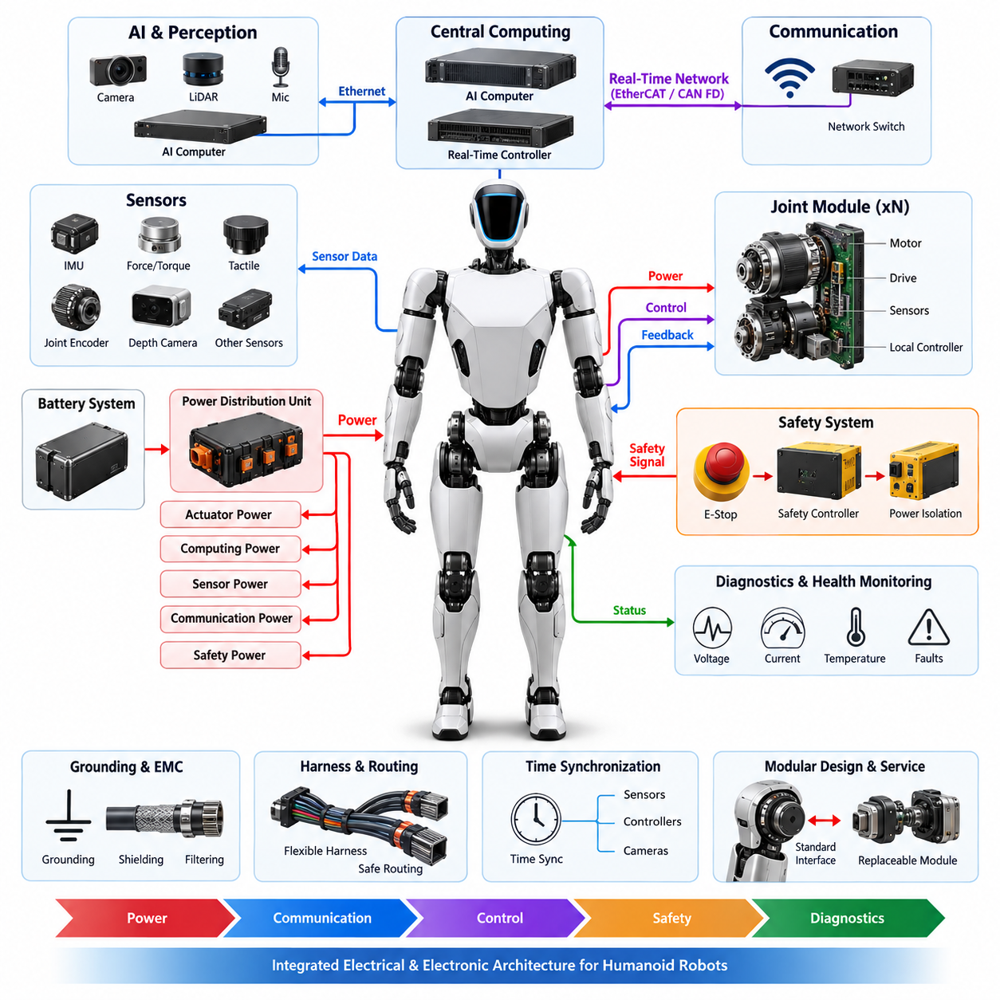
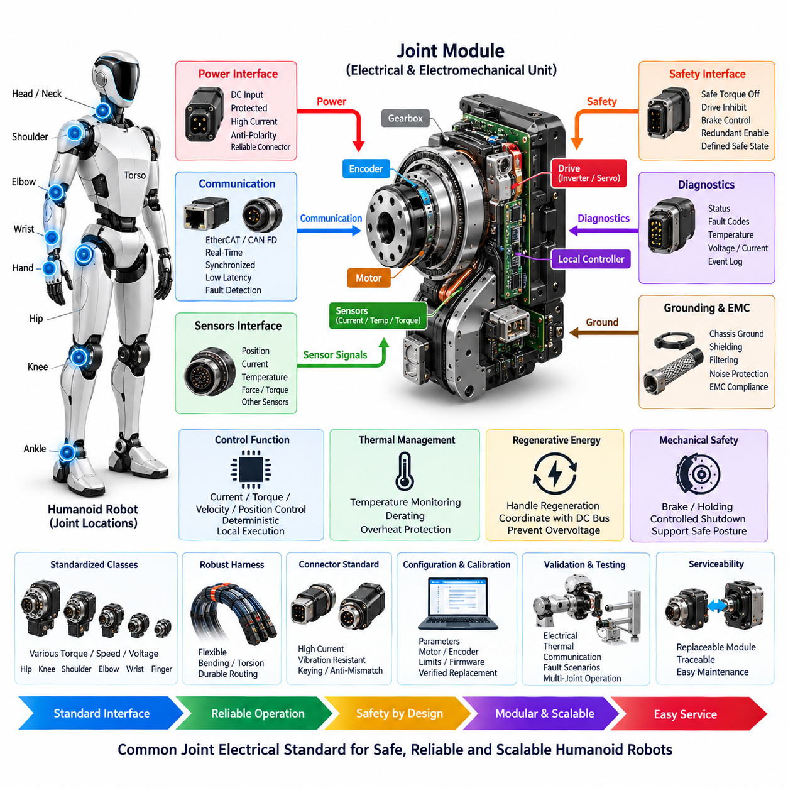
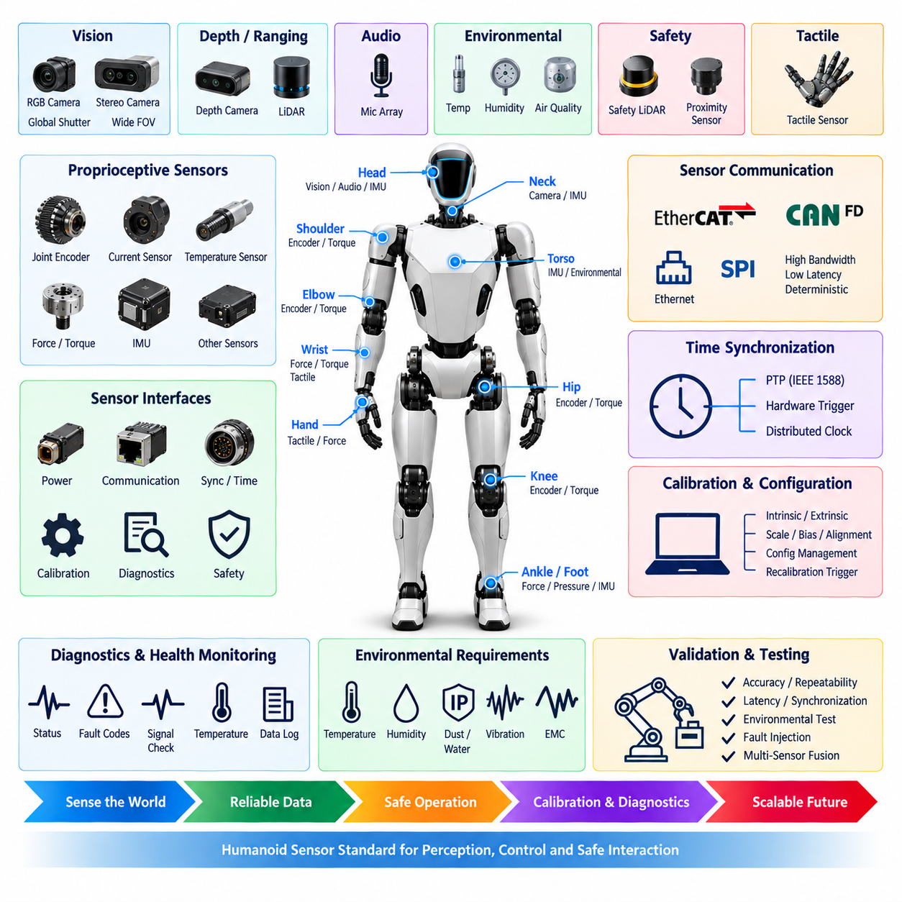
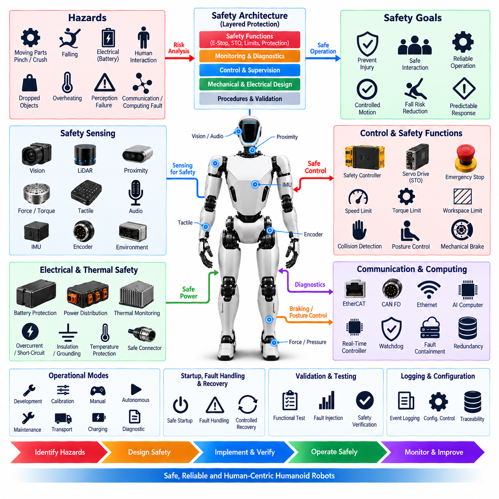
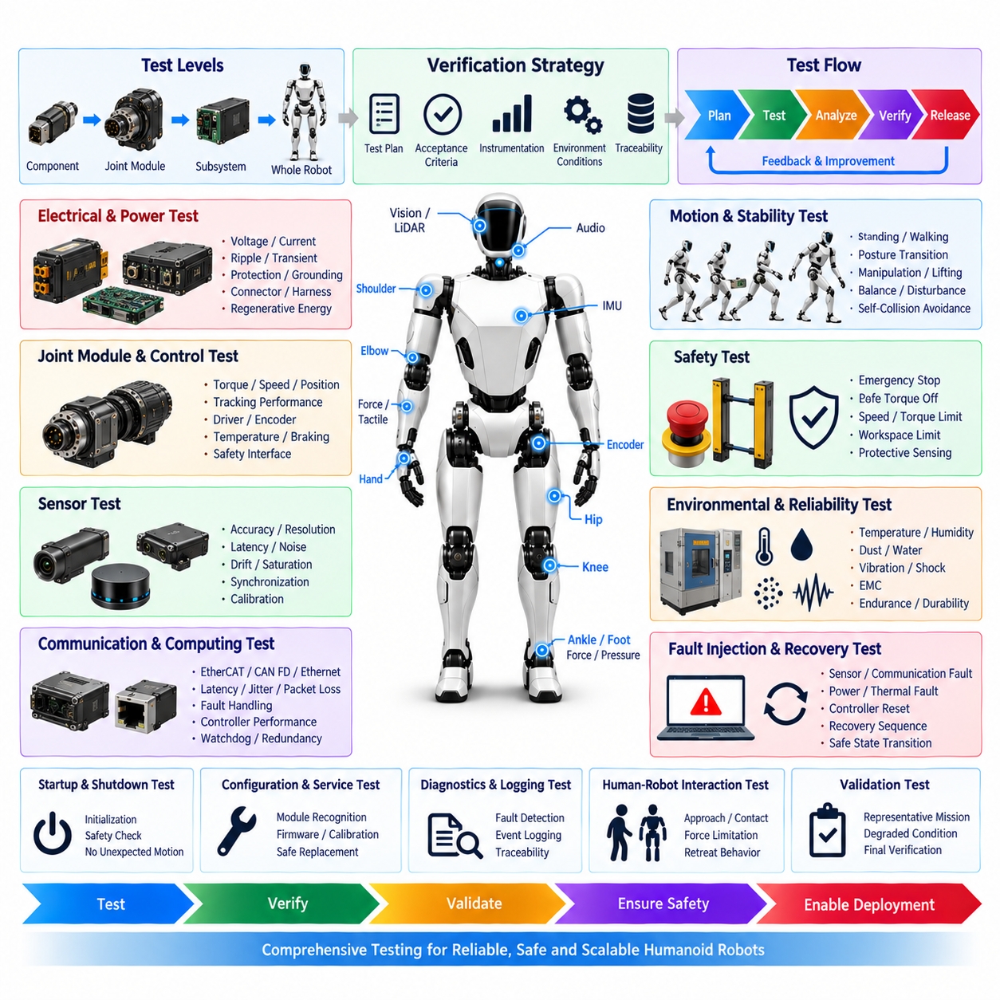

**Volume 22. Hills Robotics Engineering Standards**

# Chapter 14. HRS-014 Humanoid

## 14.01. Humanoid EE Architecture Standard

{width="7.268055555555556in" height="7.268055555555556in"}

휴머노이드 전기·전자 아키텍처(Humanoid Electrical and Electronic Architecture)는 로봇 전체에 걸쳐 전력(Power), 컴퓨팅(Computation), 통신(Communication), 센싱(Sensing), 구동(Actuation), 안전(Safety) 기능을 분배하기 위한 통합 시스템 프레임워크(Unified System Framework)를 정의해야 한다. 아키텍처는 몸통(Torso), 머리(Head), 팔(Arms), 손(Hands), 다리(Legs), 분산형 관절 모듈(Distributed Joint Modules)로 구성되는 고관절 구조(Highly Articulated Structure)를 지원하면서 각 서브시스템(Subsystem) 사이의 명확한 전기적 경계(Electrical Boundary)를 유지해야 한다.

아키텍처는 시스템 수준 전력 분배(System-Level Power Distribution), 중앙 컴퓨팅(Central Computing), 실시간 제어 네트워크(Real-Time Control Networks), 분산형 관절 전자장치(Distributed Joint Electronics), 인지 장치(Perception Devices), 독립 안전 기능(Independent Safety Functions)으로 구성된 계층적 구조(Hierarchical Organization)를 사용해야 한다. 이러한 영역 간 인터페이스(Interface)를 명확히 정의하여 주 전원(Main Power Source)에서 모든 액추에이터(Actuator), 센서(Sensor), 제어기(Controller), 주변장치(Peripheral Device)까지 전기적·통신적·기능적 의존 관계를 추적할 수 있어야 한다.

주 전력(Primary Electrical Power)은 휴머노이드 배터리 시스템(Humanoid Battery System)에서 공급되어 보호 기능을 갖춘 전력 분배 장치(Power Distribution Unit)를 통해 분배되어야 한다. 필요에 따라 고출력 액추에이터(High-Power Actuators), 컴퓨팅 장비(Computing Equipment), 센서(Sensors), 통신 장치(Communication Devices), 안전 전자장치(Safety Electronics)를 위한 별도의 전압 영역(Voltage Domains)을 구성해야 한다. 각 분기 회로(Branch)는 전기 부하(Electrical Load)와 중요도(Criticality)에 따라 협조된 과전류 보호(Overcurrent Protection), 절연(Isolation), 모니터링(Monitoring), 제어 종료(Controlled Shutdown) 기능을 포함해야 한다.

전력 아키텍처(Power Architecture)는 엉덩이(Hip), 무릎(Knee), 발목(Ankle), 어깨(Shoulder), 팔꿈치(Elbow), 손목(Wrist), 손(Hand), 몸통(Torso) 액추에이터가 동시에 작동하면서 발생하는 매우 동적인 부하 특성(Dynamic Load Profile)을 고려해야 한다. 아키텍처 설계 시 피크 전류(Peak Current), 회생 에너지(Regenerative Energy), 전압 강하(Voltage Sag), 과도 응답(Transient Response), 열 부하(Thermal Loading), 배터리 상태(Battery State)를 고려해야 한다. 회생 관절(Regenerative Joints)에서 반환되는 에너지는 공유 전력 레일(Shared Power Rails)을 불안정하게 만들지 않도록 안전하게 흡수, 저장, 제한 또는 재분배되어야 한다.

관절 모듈(Joint Modules)은 가능한 경우 표준화된 분산형 전기기계 노드(Standardized Distributed Electromechanical Nodes)로 취급해야 한다. 각 모듈은 모터(Motor), 인버터 또는 서보 드라이브(Inverter or Servo Drive), 위치 센싱(Position Sensing), 온도 센싱(Temperature Sensing), 전류 측정(Current Measurement), 로컬 제어 전자장치(Local Control Electronics), 통신 인터페이스(Communication Interface)를 통합하거나 이들과 인터페이스해야 한다. 표준화된 전기적 경계(Standardized Electrical Boundaries)를 적용하여 팔, 다리, 몸통, 목 및 기타 관절 구현 간 차이를 줄이면서 교체성과 확장성을 확보해야 한다.

휴머노이드 통신(Humanoid Communication)은 결정론적 모션 제어 트래픽(Deterministic Motion-Control Traffic)과 고대역폭 인지 및 감독 트래픽(High-Bandwidth Perception and Supervisory Traffic)을 분리해야 한다. 실시간 액추에이터 네트워크(Real-Time Actuator Networks)는 이더캣(EtherCAT), CAN FD 또는 검증된 다른 결정론적 인터페이스(Deterministic Interface)를 사용할 수 있으며, 카메라(Camera), 라이다(LiDAR), 깊이 센서(Depth Sensor), AI 컴퓨터(AI Computer), 데이터 기록장치(Data Recorder)는 이더넷 기반 네트워크(Ethernet-Based Networks)를 사용할 수 있다. 서브시스템 통합 전에 네트워크 토폴로지(Network Topology), 대역폭(Bandwidth), 지연시간(Latency), 지터(Jitter), 동기화(Synchronization), 고장 격리(Fault Containment) 요구사항을 정의해야 한다.

컴퓨팅 아키텍처(Computing Architecture)는 고수준 AI 연산(High-Level AI Computation)과 결정론적 모션 및 안전 제어(Deterministic Motion and Safety Control)를 구분해야 한다. 중앙 AI 컴퓨터(Central AI Computers)는 인지(Perception), 위치추정(Localization), 계획(Planning), 체화 지능(Embodied Intelligence), 멀티모달 추론(Multimodal Inference)을 수행할 수 있으며, 전용 실시간 프로세서(Dedicated Real-Time Processors)는 관절 제어(Joint Control), 균형 제어(Balance Control), 상태 추정(State Estimation), 하드웨어 감독(Hardware Supervision)을 수행해야 한다. 안전 필수 반응(Safety-Critical Reactions)은 비결정론적 AI 처리(Nondeterministic AI Processing) 또는 범용 운영체제(General-Purpose Operating System)의 동작에만 의존해서는 안 된다.

센서 아키텍처(Sensor Architecture)는 휴머노이드 전신에 분산된 고유수용성 센싱(Proprioceptive Sensing)과 외부수용성 센싱(Exteroceptive Sensing)을 지원해야 한다. 관절 엔코더(Joint Encoders), 모터 전류 센서(Motor Current Sensors), 힘·토크 센서(Force/Torque Sensors), 관성측정장치(IMUs), 촉각 센서(Tactile Sensors), 카메라(Cameras), 깊이 카메라(Depth Cameras), 라이다(LiDAR), 마이크(Microphones) 및 기타 인지 장치(Perception Devices)에 대해 전력, 통신, 동기화, 캘리브레이션(Calibration), 진단(Diagnostic) 인터페이스를 정의해야 한다. 균형 유지 또는 보호 기능에 필요한 센서는 적절한 무결성(Integrity)과 가용성(Availability)을 확보해야 한다.

머리(Head)와 상부 몸통(Upper Torso)은 일반적으로 카메라, 깊이 센싱(Depth Sensing), 마이크, 관성 장치(Inertial Devices), 네트워크 하드웨어(Networking Hardware), 중앙 컴퓨팅 자원(Central Compute Resources)을 포함하므로 인지 및 AI 장비를 위한 구조화된 인터페이스(Structured Interfaces)를 제공해야 한다. 필요한 경우 고대역폭 센서 링크(High-Bandwidth Sensor Links)는 노이즈가 큰 액추에이터 전력 경로(Actuator Power Paths)와 물리적·전기적으로 분리해야 한다. 케이블 라우팅(Cable Routing)은 전자파 적합성(Electromagnetic Compatibility), 발열(Heat Generation), 기계적 움직임(Mechanical Motion), 정비 접근성(Service Access)을 고려해야 한다.

와이어 하네스 아키텍처(Harness Architecture)는 지속적인 관절 운동(Continuous Articulation)과 반복적인 기계적 움직임(Repeated Mechanical Motion)을 고려해야 한다. 목, 어깨, 팔꿈치, 손목, 허리, 엉덩이, 무릎, 발목을 통과하는 하네스(Harness)는 예상 굽힘 반경(Bending Radius), 비틀림(Torsion), 굽힘 반복 수명(Flex Cycles), 변형 방지(Strain Relief), 마모 노출(Abrasion Exposure), 커넥터 유지력(Connector Retention)을 고려하여 설계해야 한다. 배선은 관절 운동을 방해해서는 안 되며 충분한 서비스 루프(Service Loops)를 제공하면서 케이블이 끼임(Pinch), 전단(Shear), 고온 영역(High-Temperature Zones)에 진입하지 않도록 해야 한다.

접지(Grounding), 본딩(Bonding), 차폐(Shielding), 전자파 적합성(Electromagnetic Compatibility)은 개별 모듈에서 독립적으로 해결하는 것이 아니라 시스템 수준 특성(System-Level Properties)으로 설계해야 한다. 대전류 모터 스위칭(High-Current Motor Switching), DC/DC 컨버터(DC/DC Converters), 컴퓨팅 플랫폼(Computing Platforms), 고속 이더넷(High-Speed Ethernet), 카메라, 민감한 관성 센서(Sensitive Inertial Sensors)는 상호작용하는 노이즈 경로(Noise Paths)를 생성할 수 있다. 따라서 전력 리턴(Power Return), 섀시 본딩(Chassis Bonding), 실드 종단(Shield Termination), 케이블 분리(Cable Separation), 필터링(Filtering), 접지 토폴로지(Grounding Topology)는 통제된 아키텍처 규칙(Controlled Architecture Rules)을 따라야 한다.

기능 안전(Functional Safety)은 독립 비상정지 경로(Independent Emergency-Stop Paths), 액추에이터 비활성화 메커니즘(Actuator Disable Mechanisms), 전력 절연(Power Isolation), 고장 감지(Fault Detection), 안전 상태(Safe States)로의 제어된 전환을 통해 전기 아키텍처에 통합되어야 한다. 제어되지 않는 관절 토크(Uncontrolled Joint Torque), 통신 손실(Communication Loss), 프로세서 고장(Processor Failure), 센서 불일치(Sensor Disagreement), 과열(Overtemperature), 과전류(Overcurrent), 비정상 배터리 상태(Abnormal Battery Conditions) 등의 주요 고장 발생 시 로봇의 운용 상태와 안정성 요구사항에 적합한 사전 정의된 대응(Predefined Reactions)이 수행되어야 한다.

액추에이터 전력(Actuator Power)을 갑작스럽게 차단하면 서 있는 휴머노이드가 넘어질 수 있으므로 안전 상태 설계(Safe-State Design)는 전기적 종료가 초래하는 물리적 결과(Physical Consequences)를 고려해야 한다. 아키텍처는 협조된 토크 감소(Coordinated Torque Reduction), 제어된 자세 전환(Controlled Posture Transition), 필요한 경우 기계적 유지 메커니즘(Mechanical Holding Mechanisms), 고장 서브시스템의 선택적 격리(Selective Isolation)를 지원해야 한다. 비상 동작(Emergency Behavior)은 전기적 격리 요구사항과 낙상 또는 제어되지 않는 움직임으로 발생할 수 있는 2차 위험(Secondary Hazards)의 방지를 함께 고려해야 한다.

진단 기능(Diagnostics)은 아키텍처 전체에 분산되어야 하며 시스템 수준 상태 관리 기능(System-Level Health-Management Function)으로 통합되어야 한다. 배터리 상태(Battery Status), 전압 레일(Rail Voltage), 전류(Current), 온도(Temperature), 통신 오류(Communication Errors), 액추에이터 고장(Actuator Faults), 센서 유효성(Sensor Validity), 절연 또는 접지 이상(Isolation or Grounding Abnormalities), 컴퓨팅 상태(Computing Health)를 지속적으로 관찰할 수 있어야 한다. 진단 정보는 교체 가능한 모듈(Replaceable Modules) 수준까지 고장을 국소화하고 유지보수, 검증 및 현장 분석을 위한 타임스탬프 기록(Timestamped Records)을 제공해야 한다.

시간 동기화(Time Synchronization)는 인지(Perception), 상태 추정(State Estimation), 모션 제어(Motion Control), 진단(Diagnostics), 데이터 기록(Data Recording)을 위한 공통 시간 기준(Common Temporal Reference)을 제공해야 한다. 카메라, 관성측정장치(IMUs), 힘 센서(Force Sensors), 관절 피드백(Joint Feedback), 분산 제어기(Distributed Controllers)는 각 기능에 적합한 동기화 정확도(Synchronization Accuracy)를 유지해야 한다. 이더넷 기반 동기화(Ethernet-Based Synchronization)를 사용하는 경우 아키텍처는 클록 계층(Clock Hierarchy), 동기화 소스(Synchronization Sources), 폴백 동작(Fallback Behavior), 동기화 품질 모니터링(Synchronization Quality Monitoring)을 정의해야 한다.

아키텍처는 제어된 인터페이스(Controlled Interfaces), 커넥터 식별(Connector Identification), 주소 지정 규칙(Addressing Rules), 펌웨어 호환성(Firmware Compatibility), 캘리브레이션 기록(Calibration Records), 구성 데이터(Configuration Data)를 갖춘 교체 가능한 전기 장치(Replaceable Electrical Units)를 정의하여 모듈형 제조(Modular Manufacturing)와 정비(Service)를 지원해야 한다. 관절, 팔다리 모듈(Limb Module), 센서 어셈블리(Sensor Assembly), 배터리, 제어기 또는 컴퓨팅 장치를 교체할 때 관련 없는 다른 서브시스템을 임의로 변경할 필요가 없어야 한다. 구성 관리(Configuration Management)는 하드웨어, 펌웨어 및 전기 설계 리비전(Electrical Revisions) 간 호환성을 유지해야 한다.

마지막으로 휴머노이드 전기 아키텍처(Humanoid Electrical Architecture)는 개별적으로 규격을 만족하는 부품들의 집합이 아니라 통합 사이버-물리 시스템(Integrated Cyber-Physical System)으로 검증되어야 한다. 검증(Verification)은 정상 운전(Nominal Operation), 최대 동적 부하(Peak Dynamic Loads), 열화된 전력 조건(Degraded Power Conditions), 통신 고장(Communication Faults), 센서 고장(Sensor Failures), 액추에이터 고장(Actuator Faults), 비상 종료(Emergency Shutdown), 열 스트레스(Thermal Stress), 전자기 교란(Electromagnetic Disturbance), 반복 관절 운동(Repeated Joint Motion), 복구 동작(Recovery Behavior)을 포함해야 한다. 최종 아키텍처는 안전하고 유지보수가 용이하며 신뢰성 높은 체화 AI 휴머노이드 플랫폼(Embodied AI Humanoid Platforms)을 위한 확장 가능한 기반(Scalable Foundation)을 제공해야 한다.

## 14.02. Joint Module Electrical Standard

{width="7.268055555555556in" height="7.268055555555556in"}

휴머노이드 관절 모듈 전기 표준(Humanoid Joint Module Electrical Standard)은 목(Neck), 몸통(Torso), 어깨(Shoulders), 팔(Arms), 손목(Wrists), 손(Hands), 엉덩이(Hips), 다리(Legs), 무릎(Knees), 발목(Ankles) 전체에 사용되는 회전형 및 직선형 관절(Rotary and Linear Joints)에 대한 공통 전기 아키텍처(Common Electrical Architecture)를 정의해야 한다. 각 관절 모듈(Joint Module)은 전력, 모터 구동, 센싱, 통신, 진단 및 안전을 위한 제어된 인터페이스(Controlled Interfaces)를 제공하여 주변 로봇 전기 아키텍처를 재설계하지 않고도 모듈을 통합할 수 있어야 한다.

관절 모듈(Joint Module)은 액추에이터 모터(Actuator Motor), 서보 드라이브 또는 인버터(Servo Drive or Inverter), 위치 센싱(Position Sensing), 전류 센싱(Current Sensing), 온도 모니터링(Temperature Monitoring), 필요한 경우 제동 또는 유지 메커니즘(Braking or Holding Mechanisms), 로컬 제어 전자장치(Local Control Electronics)를 포함하거나 이들과 인터페이스하는 독립적인 전기기계 서브시스템(Self-Contained Electromechanical Subsystem)으로 취급해야 한다. 관절 모듈과 휴머노이드 시스템 사이의 전기적 경계(Electrical Boundaries)를 명확하게 정의하여 서로 다른 관절 등급에서도 전력, 통신, 안전, 접지 및 정비 연결이 일관되게 유지되도록 해야 한다.

관절 모듈은 동작 전압(Operating Voltage), 연속 및 피크 전류(Continuous and Peak Current), 토크 용량(Torque Capability), 회전 속도(Rotational Speed), 듀티 사이클(Duty Cycle), 열 특성(Thermal Characteristics), 기계적 동작 범위(Mechanical Range), 기능적 중요도(Functional Criticality)에 따라 분류해야 한다. 엉덩이, 무릎, 어깨와 같은 고토크 관절(High-Torque Joints)은 손목, 손가락, 목 또는 보조 관절보다 높은 전력 용량이 필요할 수 있다. 따라서 전기 인터페이스는 표준화된 등급(Standardized Classes)을 지원하면서 액추에이터 전력 정격의 통제된 차이를 허용해야 한다.

각 모듈은 예상되는 최대 전기 부하와 과도 조건(Transient Conditions)에 대응하도록 설계된 보호 전력 인터페이스(Protected Power Interface)를 통해 액추에이터 전력(Actuator Power)을 공급받아야 한다. 전선 굵기(Cable Gauge), 커넥터 전류 정격(Connector Current Rating), 접촉 저항(Contact Resistance), 전압 강하(Voltage Drop), 퓨즈 또는 전자식 보호(Electronic Protection), 열 디레이팅(Thermal Derating)은 연속 및 피크 모터 전류와 협조되어야 한다. 전력 커넥터는 우발적인 역극성 연결(Polarity Reversal)을 방지하고 반복적인 휴머노이드 동작과 진동에 충분한 기계적 유지력(Mechanical Retention)을 제공해야 한다.

서보 드라이브 또는 인버터(Servo Drive or Inverter)는 제어된 모터 여자(Controlled Motor Excitation)를 제공해야 하며 액추에이터 기술에 적합한 전류 측정(Current Measurement), 전압 모니터링(Voltage Monitoring), 온도 감시(Temperature Supervision), 고장 감지(Fault Detection) 기능을 포함해야 한다. 스위칭 소자(Switching Devices)와 게이트 드라이브 회로(Gate-Drive Circuits)는 예상되는 회생 및 과도 조건을 견딜 수 있어야 한다. 회생 에너지(Regenerative Energy)가 공통 DC 버스(Common DC Bus)로 반환되는 경우 모듈은 시스템 수준 에너지 관리(System-Level Energy Management)와 협조하여 과도한 버스 전압이나 동시에 작동하는 관절 사이의 불안정한 상호작용을 방지해야 한다.

관절 위치 센싱(Joint Position Sensing)은 해당 모션 제어 기능(Motion-Control Function)에 필요한 분해능(Resolution), 정확도(Accuracy), 업데이트 속도(Update Rate), 신뢰성(Reliability)을 제공해야 한다. 기동 시 홈 위치 이동(Homing Movement)을 수행하지 않고 위치를 알아야 하는 경우 절대형 엔코더(Absolute Encoders)를 우선적으로 적용하며, 잘못된 위치 정보가 심각한 불안정 또는 위험을 발생시킬 수 있는 관절에는 이중화 또는 보조 센싱(Redundant or Secondary Sensing)이 필요할 수 있다. 엔코더 전력 및 신호 인터페이스는 로컬 제어기(Local Controller)와 시스템 진단 아키텍처(System Diagnostic Architecture)에 전기적으로 호환되어야 한다.

모터 전류(Motor Current), 권선 온도(Winding Temperature), 드라이브 온도(Drive Temperature) 및 기타 사용 가능한 액추에이터 상태 파라미터(Actuator Health Parameters)는 관절 모듈 내부에서 모니터링되어야 한다. 균형 제어(Balance Control), 접촉 감지(Contact Detection), 조작(Manipulation) 또는 안전 기능에 필요한 경우 추가적인 토크, 힘, 변형률 또는 하중 센싱(Torque, Force, Strain, or Load Sensing)을 적용할 수 있다. 센서 신호는 모터 스위칭으로 발생하는 전기적 노이즈로부터 보호되어야 하며 급격한 토크 변화와 대전류 동작 중에도 충분한 신호 무결성(Signal Integrity)을 유지해야 한다.

로컬 관절 제어기(Local Joint Controller)는 시스템 제어 아키텍처(System Control Architecture)에 따라 전류, 토크, 속도 또는 위치 제어와 같은 결정론적 저수준 기능(Deterministic Low-Level Functions)을 수행해야 한다. 통신 지연과 중앙 컴퓨팅 부하를 줄이기 위해 고주기 제어 루프(High-Rate Control Loops)는 액추에이터 가까이에 배치하는 것이 바람직하다. 상위 수준 모션 제어기(Higher-Level Motion Controllers)에서 감독 명령(Supervisory Commands)을 전달할 수 있지만, 통신이 손실될 경우 마지막 수신 명령을 제어 없이 계속 수행하는 대신 사전에 정의된 로컬 동작(Defined Local Behavior)을 실행해야 한다.

관절 통신 인터페이스(Joint Communication Interface)는 휴머노이드 플랫폼에 선정된 이더캣(EtherCAT), CAN FD 또는 기타 검증된 실시간 프로토콜(Validated Real-Time Protocol)과 같은 승인된 결정론적 네트워크(Approved Deterministic Network)를 사용해야 한다. 각 모듈은 고유한 논리적 식별자(Unique Logical Identity)와 통제된 주소 지정 방식(Controlled Addressing Method)을 가져야 한다. 네트워크 설계에서는 협조된 다관절 운동(Coordinated Multi-Joint Motion)에 필요한 명령 및 피드백 주기(Command and Feedback Cycle Time), 지연시간(Latency), 지터(Jitter), 동기화 정확도(Synchronization Accuracy), 오류 감지(Error Detection), 타임아웃 동작(Timeout Behavior), 복구 메커니즘(Recovery Mechanisms)을 정의해야 한다.

시간 동기화(Time Synchronization)는 관절 명령 실행과 피드백 획득을 휴머노이드 전신에서 상호 연계할 수 있도록 해야 한다. 균형 및 전신 제어(Whole-Body Control)에 필요한 경우 위치, 속도, 토크, 전류 및 진단 정보는 일관된 시간 기준(Consistent Timing Reference)을 사용해야 한다. 분산 클록(Distributed Clocks) 또는 동등한 동기화 메커니즘을 모니터링하여 타이밍 오류가 협조 운동에 중대한 영향을 미치기 전에 동기화 손실을 감지할 수 있어야 한다.

안전 기능(Safety Functions)은 시스템 안전 아키텍처(System Safety Architecture)에서 요구하는 경우 정상 모션 명령과 독립적으로 액추에이터 토크를 비활성화하거나 제한할 수 있는 정의된 방법을 제공해야 한다. 관절 중요도에 따라 안전 토크 차단(Safe Torque Off), 드라이브 비활성화(Drive Inhibit), 접촉기 제어(Contactor Control), 브레이크 제어(Brake Control), 전류 제한(Current Limitation) 또는 이중화된 활성화 경로(Redundant Enable Paths)를 포함할 수 있다. 안전 관련 인터페이스는 개방 회로(Open Circuits), 통신 손실 또는 전력 고장이 의도하지 않은 위험 동작을 명령하지 않도록 정의된 전기적 상태(Defined Electrical States)를 가져야 한다.

휴머노이드 관절은 즉각적인 전기적 종료(Immediate Electrical Shutdown)가 항상 가장 안전한 기계적 상태를 만든다고 가정해서는 안 된다. 엉덩이, 무릎, 발목, 몸통 및 기타 하중 지지 관절(Load-Bearing Joints)은 붕괴를 방지하기 위해 제어된 토크 감소(Controlled Torque Reduction), 제동(Braking) 또는 협조된 자세 전환(Coordinated Posture Transition)이 필요할 수 있다. 따라서 전기 설계는 시스템 수준 안전 상태 전략(System-Level Safe-State Strategy)을 지원하면서, 지속적인 전원 공급이 더 큰 위험을 발생시키는 심각한 전기적 고장의 경우에는 고장 액추에이터를 격리할 수 있어야 한다.

접지(Grounding)와 전자파 적합성(Electromagnetic Compatibility)은 모든 관절 모듈에서 고려되어야 한다. 고주파 인버터 스위칭(High-Frequency Inverter Switching)과 빠르게 변화하는 모터 전류는 엔코더, 통신 링크, 힘 센서 및 인접한 인지 전자장치(Perception Electronics)에 영향을 줄 수 있기 때문이다. 전력 리턴 경로(Power Return Paths), 섀시 본딩(Chassis Bonding), 케이블 차폐(Cable Shielding), 커넥터 실드 종단(Connector Shield Termination), 필터링(Filtering), 전력선과 신호선 사이의 물리적 분리(Physical Separation)는 휴머노이드 접지 및 EMC 아키텍처를 따라야 한다.

관절 하네스(Joint Harnesses)는 규정된 사용 수명 동안 반복적인 굽힘(Bending), 비틀림(Torsion), 진동(Vibration), 움직임을 견딜 수 있어야 한다. 회전 또는 관절 구조를 통과하는 연결부는 최소 굽힘 반경(Minimum Bending Radius)을 유지하고 끼임(Pinch), 마모(Abrasion), 전단(Shear), 과도한 인장 하중(Excessive Tensile Loading)을 방지해야 한다. 연속 회전(Continuous Rotation)이 필요한 경우 일반 하네스를 제어 없이 비트는 방식 대신 적절하게 검증된 회전형 전기 인터페이스(Rotary Electrical Interface) 또는 슬립링(Slip-Ring) 솔루션을 사용해야 한다.

커넥터(Connectors)는 전류 용량(Current Capacity), 전압 정격(Voltage Rating), 접점 수(Contact Count), 환경 노출(Environmental Exposure), 내진동성(Vibration Resistance), 결합 횟수 요구사항(Mating-Cycle Requirement), 패키징 제약(Packaging Constraints), 정비 접근성(Service Accessibility)에 따라 선정해야 한다. 조립 오류를 줄이기 위해 전력 및 통신 인터페이스는 기계적 또는 시각적으로 구별하는 것이 바람직하다. 커넥터 키잉(Connector Keying)과 핀 할당(Pin Assignment)은 전기적 차이로 인해 하드웨어 손상 또는 위험 동작이 발생할 수 있는 비호환 관절 변형(Incompatible Joint Variants)의 연결을 방지해야 한다.

각 관절 모듈은 해당되는 경우 공급 전압(Supply Voltage), 모터 전류(Motor Current), 위치(Position), 속도(Velocity), 온도(Temperature), 통신 상태(Communication State), 제어기 상태(Controller State), 경고 상태(Warning Status), 고장 코드(Fault Codes)를 포함하는 표준화된 진단 정보(Standardized Diagnostic Information)를 제공해야 한다. 진단 기록은 전기, 센싱, 통신, 열 및 기계 관련 고장을 구분할 수 있어야 한다. 중요 이벤트(Critical Events)는 타임스탬프(Timestamp)를 기록하여 검증, 유지보수 및 현장 고장 분석 과정에서 관절 동작을 시스템 로그(System Logs)와 연계할 수 있어야 한다.

모듈은 관절 식별자(Joint Identity), 모터 특성(Motor Characteristics), 엔코더 캘리브레이션(Encoder Calibration), 전류 제한(Current Limits), 토크 제한(Torque Limits), 동작 제한(Motion Limits), 통신 설정(Communication Settings), 펌웨어 리비전(Firmware Revision), 안전 관련 구성(Safety-Related Configuration) 등의 파라미터를 통제된 방식으로 구성할 수 있어야 한다. 생산 파라미터(Production Parameters)는 의도하지 않은 변경으로부터 보호되어야 한다. 교체 모듈은 액추에이터를 완전히 활성화하기 전에 로봇 구성과의 일치 여부를 검증하여 잘못된 하드웨어 또는 캘리브레이션 데이터가 의도하지 않은 움직임을 발생시키지 않도록 해야 한다.

열 설계(Thermal Design)는 실제 휴머노이드 듀티 사이클(Humanoid Duty Cycles)에서 모터 권선, 베어링(Bearings), 기어링(Gearing), 인버터 스위칭 소자(Inverter Switching Devices), 커넥터 및 로컬 전자장치에서 발생하는 손실을 고려해야 한다. 온도 센서는 부품 손상이 발생하기 전에 주요 열 상태(Critical Thermal Conditions)를 감지할 수 있는 위치에 배치해야 한다. 경고(Warning), 디레이팅(Derating), 종료(Shutdown) 임계값은 단계적 보호(Progressive Protection)를 제공하여 일시적인 열 스트레스를 하중 지지 관절의 불필요한 급격한 정지 없이 관리할 수 있도록 해야 한다.

관절 모듈은 가능한 경우 교체 가능하고 추적 가능한 정비 단위(Replaceable and Traceable Service Units)로 설계해야 한다. 모듈 식별 정보(Module Identification)는 하드웨어 리비전(Hardware Revision), 일련번호 정보(Serial Information), 펌웨어 호환성(Firmware Compatibility), 캘리브레이션 데이터(Calibration Data), 적용 가능한 전기 정격(Electrical Ratings)을 설치된 관절 위치와 연계해야 한다. 정비 절차(Service Procedures)는 관절을 정상 운전 상태로 복귀시키기 전에 안전한 전력 격리, 커넥터 취급, 교체 검증, 캘리브레이션 복원 및 정비 후 기능 점검(Post-Service Functional Checks)을 정의해야 한다.

전기 검증(Electrical Validation)은 정상 동작(Nominal Operation), 기동 및 종료(Startup and Shutdown), 연속 및 피크 부하(Continuous and Peak Loading), 전압 변동(Voltage Variation), 회생 동작(Regenerative Operation), 통신 중단(Communication Interruption), 센서 고장(Sensor Faults), 과전류(Overcurrent), 과열(Overtemperature), 액추에이터 비활성화(Actuator Disable), 접지 무결성(Grounding Integrity), 전자기 교란(Electromagnetic Disturbance), 반복 관절 운동(Repeated Articulation)을 포함해야 한다. 공유 전력 및 통신 자원(Shared Power and Communication Resources)은 개별 시험에서 관찰되지 않는 고장을 발생시킬 수 있으므로 개별 모듈 성능뿐만 아니라 여러 관절이 동시에 작동할 때의 상호작용도 검증해야 한다.

표준화된 관절 모듈 인터페이스(Standardized Joint Module Interface)는 궁극적으로 휴머노이드 플랫폼이 제한된 수의 대형 액추에이터에서 다수의 분산형 고자유도 관절(Distributed High-Degree-of-Freedom Joints)까지 확장되더라도 예측 가능한 전기적 동작(Predictable Electrical Behavior)을 유지할 수 있도록 해야 한다. 일관된 전력, 통신, 센싱, 진단, 안전, 구성 및 정비 인터페이스는 모듈형 개발과 교체를 가능하게 하는 동시에 협조된 전신 제어(Coordinated Whole-Body Control)와 체화 AI(Embodied AI) 운용에 필요한 결정론적 성능(Deterministic Performance)을 제공해야 한다.

## 14.03. Humanoid Sensor Standard

{width="7.268055555555556in" height="7.268055555555556in"}

휴머노이드 센서 표준(Humanoid Sensor Standard)은 로봇 상태(Robot State), 인간과의 상호작용(Human Interaction), 접촉 상태(Contact Conditions), 주변 환경(Surrounding Environment)을 인지하는 데 사용되는 센싱 장치(Sensing Devices)에 대한 공통 요구사항을 정의해야 한다. 센서 아키텍처(Sensor Architecture)는 머리(Head), 몸통(Torso), 팔(Arms), 손(Hands), 다리(Legs), 발(Feet), 관절 모듈(Joint Modules) 전반에 분산된 고유수용성 및 외부수용성 센싱(Proprioceptive and Exteroceptive Sensing)을 지원하면서 전력, 통신, 동기화, 캘리브레이션(Calibration), 진단 및 안전을 위한 일관된 인터페이스를 제공해야 한다.

휴머노이드 센서는 관절 상태 센싱(Joint State Sensing), 관성 센싱(Inertial Sensing), 힘 및 토크 측정(Force and Torque Measurement), 촉각 센싱(Tactile Sensing), 비전(Vision), 깊이 인지(Depth Perception), 거리 측정(Ranging), 오디오 센싱(Audio Sensing), 환경 모니터링(Environmental Monitoring), 안전 관련 감지(Safety-Related Detection)를 포함하는 주요 기능에 따라 분류해야 한다. 모든 센싱 장치에 동일한 정확도, 대역폭, 지연시간, 이중화 또는 환경 요구사항을 적용하는 대신 각 센서 등급(Sensor Class)의 역할에 적합한 성능 요구사항을 정의해야 한다.

고유수용성 센서(Proprioceptive Sensors)는 자세 추정(Posture Estimation), 균형(Balance), 모션 제어(Motion Control), 조작(Manipulation), 액추에이터 보호(Actuator Protection)에 필요한 내부 상태 정보를 제공해야 한다. 관절 엔코더(Joint Encoders), 모터 전류 센서(Motor Current Sensors), 온도 센서(Temperature Sensors), 힘 또는 토크 센서(Force or Torque Sensors), 관성측정장치(Inertial Measurement Units)는 관련 제어 루프에 결정론적이며 충분한 주기의 피드백을 제공해야 한다. 동적 안정성(Dynamic Stability)에 직접 영향을 미치는 센서는 가용성, 지연시간, 무결성 및 고장 감지에 대해 더 높은 요구사항을 적용해야 한다.

관절 위치 센서(Joint Position Sensors)는 각 관절의 기계적 특성과 제어 요구사항에 적합한 충분한 분해능(Resolution), 반복성(Repeatability), 절대 정확도(Absolute Accuracy), 업데이트 속도(Update Rate)를 제공해야 한다. 잠재적으로 위험한 원점 복귀 동작(Homing Motion)을 수행하지 않고 기동 직후 관절 위치를 알아야 하는 경우 절대형 엔코더(Absolute Encoders)를 사용하는 것이 바람직하다. 하중 지지 또는 안전 관련 관절에는 잘못되거나 고정되거나 불연속적이거나 드리프트하는 위치 측정을 감지하기 위해 이중화 센싱(Redundant Sensing) 또는 독립적인 타당성 정보(Independent Plausibility Information)를 사용할 수 있다.

관성측정장치(Inertial Measurement Units)는 신체 방향(Body Orientation), 동적 상태 추정(Dynamic State Estimation), 균형 제어(Balance Control), 동작 분석(Motion Analysis)을 위해 각속도(Angular Velocity)와 선형 가속도(Linear Acceleration)를 측정해야 한다. 주 관성측정장치(Primary IMU)는 몸통과 같이 구조적으로 적절한 위치에 설치하는 것이 바람직하며, 필요한 경우 골반(Pelvis), 머리, 팔다리 또는 발에 추가 IMU를 분산 배치할 수 있다. 장착 방향, 구조 진동, 온도 영향, 샘플링 주파수, 동기화는 상태 추정 성능에 직접 영향을 미치므로 통제되어야 한다.

힘 및 토크 센서(Force and Torque Sensors)는 물리적 상호작용(Physical Interaction), 하중 추정(Load Estimation), 접촉 감지(Contact Detection), 조작 또는 전신 제어(Whole-Body Control)에 직접적인 기계적 피드백이 필요한 경우 사용해야 한다. 손목 힘·토크 센서(Wrist Force/Torque Sensors)는 조작 과정의 상호작용력을 측정할 수 있으며, 발목 또는 발 센싱은 지면 접촉과 하중 분포에 대한 정보를 제공할 수 있다. 센서의 과부하 용량(Overload Capacity)은 정상 운전 힘 범위를 초과하는 과도 충격과 비정상 접촉 상태를 고려해야 한다.

촉각 센싱(Tactile Sensing)은 인간 또는 물체와 접촉할 것으로 예상되는 손, 손가락 끝(Fingertips), 손바닥(Palms), 발, 전완(Forearms) 또는 기타 표면에 통합할 수 있다. 촉각 센서는 접촉 감지, 파지 제어(Grasp Control), 미끄럼 감지(Slip Detection), 압력 분포(Pressure Distribution), 충돌 인지(Collision Awareness)에 적합한 공간 및 시간 분해능(Spatial and Temporal Resolution)을 제공해야 한다. 전기 아키텍처는 잠재적으로 많은 수의 센싱 소자를 수용하면서 배선 복잡성, 통신 트래픽 또는 전력 소비가 비현실적인 수준으로 증가하지 않도록 해야 한다.

비전 센서(Vision Sensors)는 객체 인식(Object Recognition), 인간 인지(Human Perception), 내비게이션(Navigation), 조작, 위치추정(Localization), 체화 AI(Embodied AI) 기능에 필요한 영상 정보를 제공해야 한다. 애플리케이션 요구사항에 따라 모노(Mono), 스테레오(Stereo), RGB, 글로벌 셔터(Global-Shutter) 또는 기타 카메라 기술을 선택할 수 있다. 카메라 배치는 시야각(Field of View), 로봇 구조물에 의한 가림(Occlusion), 모션 블러(Motion Blur), 진동, 조도 범위(Illumination Range), 렌즈 보호, 센서 좌표계와 휴머노이드 기계 기준 좌표계(Mechanical Reference Frame)의 관계를 고려해야 한다.

깊이 인지(Depth Perception)는 스테레오 비전(Stereo Vision), 구조광 카메라(Structured-Light Cameras), 비행시간 방식 장치(Time-of-Flight Devices), 라이다(LiDAR) 또는 기타 검증된 거리 측정 기술을 통해 제공할 수 있다. 깊이 센서는 요구 거리, 최소 감지 거리, 시야각, 정확도, 분해능, 업데이트 속도, 표면 특성 및 환경 조건에 따라 선정해야 한다. 하나의 센서 원리만으로 휴머노이드의 전체 운용 환경에서 신뢰성 있는 인지를 제공할 수 없는 경우 여러 기술을 결합할 수 있다.

라이다(LiDAR) 또는 기타 거리 측정 센서(Ranging Sensors)는 장애물 감지(Obstacle Detection), 위치추정, 매핑(Mapping), 주변 공간 인식(Surrounding-Space Awareness)을 지원하기 위해 머리, 몸통 또는 기타 위치에 통합할 수 있다. 설치 시 움직이는 팔다리에 의해 발생하는 자체 가림(Self-Occlusion)과 간섭을 최소화하면서 센싱 개구부(Sensing Aperture)를 기계적 손상으로부터 보호해야 한다. 팔, 손 및 신체 움직임이 외부 인지를 일시적으로 차단하거나 왜곡할 수 있으므로 센서 배치는 휴머노이드의 변화하는 형상도 고려해야 한다.

오디오 센싱(Audio Sensing)은 제품 기능에서 요구되는 경우 음성 상호작용(Speech Interaction), 음향 이벤트 감지(Acoustic Event Detection), 음원 위치추정(Localization), 멀티모달 인지(Multimodal Perception)를 지원해야 한다. 마이크 어레이(Microphone Arrays)는 필요한 공간적 범위를 확보하면서 냉각 팬, 기어박스, 모터, 구조 진동 및 스피커에서 발생하는 오염 신호를 줄일 수 있도록 배치하는 것이 바람직하다. 위치추정에 사용되는 오디오 채널은 위상 및 도달 시간 정보가 의미를 유지하도록 통제된 시간 관계를 유지해야 한다.

발 및 접촉 센싱(Foot and Contact Sensing)은 지면 접촉(Ground Contact), 하중 전달(Load Transfer), 압력 중심 거동(Center-of-Pressure Behavior), 안정성 상태(Stability Conditions)를 판단하는 데 필요한 정보를 제공해야 한다. 기계 설계에 따라 힘 센서, 압력 배열(Pressure Arrays), 변형률 소자(Strain Elements) 또는 동등한 기술을 사용할 수 있다. 발과 하부 다리에 설치되는 센서는 반복적인 충격, 진동, 오염 및 높은 기계적 하중을 견디면서 균형과 보행 추정(Gait Estimation)에 충분한 감도를 유지해야 한다.

센서 전력 인터페이스(Sensor Power Interfaces)는 적절한 보호, 필터링, 접지 및 전류 용량을 갖춘 통제된 전압 레일(Controlled Voltage Rails)을 사용해야 한다. 민감한 인지 및 측정 장치는 가능한 경우 노이즈가 큰 액추에이터 전력 경로와 분리하는 것이 바람직하다. 전원 투입 순서(Power-Up Sequencing)는 정의되지 않은 출력이 유효한 측정값으로 해석되는 것을 방지해야 하며, 브라운아웃(Brownout) 또는 저전압 상태(Undervoltage Conditions)를 감지하여 손상된 센서 데이터가 제어 또는 AI 기능으로 인지되지 않은 채 전달되지 않도록 해야 한다.

센서 통신(Sensor Communication)은 대역폭, 지연시간, 결정론성(Determinism), 거리, 토폴로지 및 신뢰성 요구사항에 따라 선정해야 한다. 고속 카메라와 라이다는 이더넷(Ethernet) 또는 전용 고속 링크를 사용할 수 있으며, 관절 센서와 분산형 측정 장치는 이더캣(EtherCAT), CAN FD, SPI 또는 기타 승인된 인터페이스를 사용할 수 있다. 통신 아키텍처는 고대역폭 인지 트래픽이 균형 및 액추에이터 제어에 필요한 결정론적 피드백을 저하시키지 않도록 해야 한다.

시간 동기화(Time Synchronization)는 카메라, IMU, 관절 엔코더, 힘 센서, 라이다, 촉각 배열(Tactile Arrays), 분산 제어기(Distributed Controllers) 전체에 공통 시간 기준(Common Temporal Reference)을 설정해야 한다. 요구되는 정확도에 따라 하드웨어 트리거링(Hardware Triggering), 정밀 시간 프로토콜(Precision Time Protocol), 분산 클록(Distributed Clocks) 또는 동등한 방법을 적용할 수 있다. 센서 융합(Sensor Fusion)에 사용되는 데이터에는 유효한 타임스탬프(Timestamps)를 포함하여 서로 다른 물리적 시점에 획득된 측정값이 동시에 관측된 것으로 잘못 해석되지 않도록 해야 한다.

캘리브레이션(Calibration)은 각 센서 유형에 필요한 내부 파라미터(Intrinsic Parameters), 외부 파라미터(Extrinsic Parameters), 스케일(Scale), 바이어스(Bias), 정렬(Alignment), 오프셋(Offset)을 정의해야 한다. 카메라 내부 캘리브레이션(Camera Intrinsic Calibration), 카메라-로봇 변환(Camera-to-Robot Transforms), IMU 정렬(IMU Alignment), 관절 엔코더 오프셋(Joint Encoder Offsets), 힘 센서 영점(Force Sensor Zero Points), 라이다 좌표 관계(LiDAR Coordinate Relationships)는 통제된 구성 데이터(Controlled Configuration Data)로 관리해야 한다. 캘리브레이션 결과는 특정 센서 및 로봇 구성과 추적 가능해야 하며 정비 또는 하드웨어 변경 이후 검증 없이 교체되어서는 안 된다.

재캘리브레이션(Recalibration)은 센서 교체, 기계적 분해, 충돌, 장착 조정, 구조 변형, 펌웨어 변경, 비정상적인 진단 동작 또는 검증 결과로 인해 기존 캘리브레이션의 유효성이 더 이상 보장되지 않을 가능성이 있을 때 수행해야 한다. 캘리브레이션 상태는 시스템에서 확인할 수 있어야 하며, 정확한 인지 또는 제어가 필요한 자율 운전을 활성화하기 전에 미캘리브레이션 또는 유효기간이 지난 센서 구성을 식별할 수 있어야 한다.

센서 진단(Sensor Diagnostics)은 통신 손실, 유효 범위를 벗어난 값, 포화(Saturation), 고정된 값(Frozen Values), 과도한 노이즈, 비현실적인 변화율(Implausible Rates of Change), 온도 이상, 동기화 오류 및 장치가 지원하는 내부 고장을 감지해야 한다. 독립적인 측정값이 서로 관련된 물리 상태를 나타내는 경우 교차 센서 타당성 검사(Cross-Sensor Plausibility Checking)를 사용하는 것이 바람직하다. 가능한 경우 진단 로직은 센서 고장과 실제 로봇의 급격한 움직임 또는 비정상적인 환경 조건을 구분해야 한다.

안전 관련 센싱(Safety-Related Sensing)은 휴머노이드 안전 아키텍처에서 요구되는 경우 비안전 인지(Non-Safety Perception)와 충분히 독립적이어야 한다. 전체 센싱 및 처리 체인이 해당 목적으로 개발되고 검증되지 않은 경우 AI 인지만으로 안전 등급 보호 기능(Safety-Rated Protective Function)을 제공한다고 가정해서는 안 된다. 비상정지 장치(Emergency-Stop Devices), 보호 센서(Protective Sensors), 액추에이터 상태 피드백(Actuator State Feedback) 및 기타 안전 채널은 범용 컴퓨팅 또는 인지 시스템의 고장 중에도 정의된 동작을 유지해야 한다.

센서 장착 및 하네스 설계(Sensor Mounting and Harness Design)는 반복적인 휴머노이드 관절 운동, 충격, 진동, 케이블 굽힘, 커넥터 유지력, 전자기 간섭(Electromagnetic Interference), 열 및 정비 접근성을 고려해야 한다. 센서 브래킷(Sensor Brackets)은 규정된 운용 수명 동안 기계적 정렬(Mechanical Alignment)을 유지해야 한다. 하네스 라우팅은 전력 케이블, 모터 스위칭 노드 및 움직이는 구조물이 민감한 신호를 저하시키거나 전신 동작 범위에서 센서 커넥터에 기계적 스트레스를 가하지 않도록 해야 한다.

환경 요구사항(Environmental Requirements)은 휴머노이드의 의도된 운용 영역을 반영해야 하며 온도, 습도, 먼지, 수분 노출, 조명 변화, 진동, 충격, 전자기 교란 및 오염을 포함할 수 있다. 머리, 손, 발 또는 외부 신체 표면에 노출되는 센서는 해당 위치에 적합한 보호 기능을 갖추어야 한다. 환경 보호 구조(Environmental Protection)는 광학, 음향, 촉각, 열 또는 거리 측정 성능을 크게 저하시켜서는 안 된다.

센서 데이터 인터페이스(Sensor Data Interfaces)는 해당되는 경우 센서 식별자(Sensor Identity), 측정 단위(Measurement Units), 좌표계(Coordinate Frame), 타임스탬프, 캘리브레이션 리비전(Calibration Revision), 유효성 상태(Validity State), 진단 상태(Diagnostic Condition)를 설명하는 일관된 메타데이터(Metadata)를 제공해야 한다. 이를 통해 인지, 제어, 로깅(Logging), 시뮬레이션(Simulation), 정비 도구가 측정값을 일관되게 해석할 수 있어야 한다. 센서 모델 또는 펌웨어 변경이 스케일, 타이밍, 캘리브레이션 또는 측정 동작에 영향을 줄 수 있는 경우 구성 관리(Configuration Control)를 적용해야 한다.

검증(Validation)은 센서를 개별적으로 평가하는 것뿐만 아니라 통합된 휴머노이드 인지 및 제어 시스템(Integrated Humanoid Perception and Control System)으로 평가해야 한다. 시험에는 정상 정확도, 반복성, 지연시간, 동기화, 캘리브레이션 안정성, 통신 중단, 전기적 교란, 온도 변화, 진동, 동적 움직임, 가림, 포화 및 대표적인 고장 조건을 포함해야 한다. 개별 센싱 기술의 성능이 일시적으로 저하되는 조건에서도 다중 센서 융합(Multi-Sensor Fusion)을 검증해야 한다.

표준화된 센서 아키텍처(Standardized Sensor Architecture)는 궁극적으로 전신 제어, 균형, 조작, 내비게이션, 인간 상호작용, 진단 및 체화 AI(Embodied AI)에 신뢰성 있고 시간적으로 일관된 정보(Reliable and Temporally Consistent Information)를 제공해야 한다. 일관된 전기 인터페이스, 동기화, 캘리브레이션, 상태 모니터링(Health Monitoring), 환경 적합성 검증(Environmental Qualification), 구성 관리를 통해 시스템 수준 안전성, 유지보수성 및 결정론적 제어(Deterministic Control)를 저해하지 않으면서 휴머노이드 세대 변화에 따라 센서 시스템을 발전시킬 수 있어야 한다.

## 14.04. Humanoid Safety Requirement

{width="7.268055555555556in" height="7.268055555555556in"}

휴머노이드 안전 요구사항(Humanoid Safety Requirements)은 전기 에너지(Electrical Energy), 액추에이터 동작(Actuator Motion), 균형 상실(Loss of Balance), 물리적 접촉(Physical Contact), 인지 고장(Perception Failures), 통신 고장(Communication Faults), 컴퓨팅 고장(Computing Faults), 저장된 기계 에너지(Stored Mechanical Energy)로 인해 발생하는 허용 불가능한 위험(Unacceptable Risk)을 방지하기 위한 시스템 수준 원칙(System-Level Principles)을 정의해야 한다. 안전(Safety)은 개별 액추에이터, 센서 또는 제어기에만 구현되는 독립 기능이 아니라 전체 휴머노이드 플랫폼의 통합된 특성(Integrated Property)으로 취급해야 한다.

안전 아키텍처(Safety Architecture)는 고토크 관절(High-Torque Joints), 관절형 팔다리(Articulated Limbs), 파지 메커니즘(Grasping Mechanisms), 끼임 및 압착 영역(Pinch and Crushing Zones), 예상하지 못한 움직임(Unexpected Movement), 낙상(Falling), 물체 낙하(Dropped Objects), 배터리 고장(Battery Faults), 인간과의 상호작용(Interaction with Humans)을 포함하여 휴머노이드 신체 구조와 관련된 위험요소를 고려해야 한다. 위험 분석(Hazard Analysis)은 정상 운전, 합리적으로 예측 가능한 오사용(Foreseeable Misuse), 유지보수, 운송, 충전, 기동, 종료, 성능 저하 운전(Degraded Operation), 비정상 시스템 상태에서의 복구를 고려해야 한다.

안전 기능(Safety Functions)은 잠재적 위험의 심각도와 정상 제어 기능으로부터 요구되는 독립성에 따라 할당해야 한다. 보호 조치(Protective Measures)에는 비상정지(Emergency Stopping), 안전 토크 차단(Safe Torque Off), 제어된 토크 제한(Controlled Torque Limitation), 속도 제한(Speed Limitation), 작업 공간 제한(Workspace Restriction), 충돌 감지(Collision Detection), 보호 센싱(Protective Sensing), 기계식 제동(Mechanical Braking), 전력 격리(Power Isolation), 제어된 자세 전환(Controlled Posture Transition)이 포함될 수 있다. 안전 기능은 명확하게 정의된 작동 조건, 응답시간 및 최종 안전 상태(Safe States)를 가져야 한다.

비상정지 시스템(Emergency-Stop System)은 위험한 로봇 동작을 정지시킬 수 있는 직접적이고 명확하게 인식 가능한 수단을 제공해야 한다. 비상정지 명령은 AI 소프트웨어, 클라우드 연결(Cloud Connectivity), 범용 운영체제(General-Purpose Operating Systems) 또는 비안전 통신 경로(Non-Safety Communication Paths)에만 의존해서는 안 된다. 비상정지가 작동하면 사전에 정의된 안전 대응을 시작해야 하며, 비상 상태가 해제되고 의도적인 리셋 및 재기동 절차가 완료될 때까지 자동 재기동(Automatic Restart)을 방지해야 한다.

액추에이터 토크(Actuator Torque)의 즉각적인 제거가 모든 휴머노이드 상태에서 자동으로 가장 안전한 대응이라고 간주해서는 안 된다. 서 있거나 하중을 지지하는 로봇은 엉덩이, 무릎, 발목 또는 몸통의 토크가 협조 없이 사라지면 붕괴할 수 있다. 따라서 안전 아키텍처는 즉각적인 토크 제거가 필요한 상황과 제어된 감속(Controlled Deceleration), 자세 안정화(Posture Stabilization), 제동(Braking), 무릎 꿇기(Kneeling), 앉기(Sitting) 또는 기계적으로 더 안전한 상태를 향한 검증된 전환(Validated Transition)이 필요한 상황을 구분해야 한다.

관절 수준 안전(Joint-Level Safety)은 정의된 제한을 초과하는 제어되지 않은 토크, 속도, 위치 및 움직임을 방지해야 한다. 서보 드라이브(Servo Drives)와 로컬 제어기(Local Controllers)는 해당되는 경우 명령 유효성(Command Validity), 전류, 온도, 위치, 속도, 통신 상태 및 내부 고장을 모니터링해야 한다. 안전 관련 관절에는 관절 고장과 관련된 위험에 따라 독립적인 활성화 경로(Independent Enable Paths), 안전 토크 차단, 기계적 유지 메커니즘(Mechanical Holding Mechanisms), 이중화된 위치 정보(Redundant Position Information) 또는 추가적인 감시 기능이 필요할 수 있다.

전신 동작 안전(Whole-Body Motion Safety)은 개별적으로 유효한 명령들이 결합되어 위험한 동작을 생성할 수 있으므로 여러 관절 사이의 상호작용을 고려해야 한다. 시스템은 필요한 경우 신체 속도, 가속도, 관절 제한(Joint Limits), 도달 가능 작업 공간(Reachable Workspace), 자체 충돌(Self-Collision), 균형 여유도(Balance Margin), 상호작용력(Interaction Forces)을 감시해야 한다. 모션 계획 및 제어(Motion Planning and Control)는 움직임이 시작되기 전에 수행하는 충돌 검사에만 의존하지 않고 안전 제약조건(Safety Constraints)을 지속적으로 준수해야 한다.

균형 및 낙상 위험(Balance and Fall Risk)은 개별 전기 및 제어 구성요소가 정상적으로 작동하더라도 휴머노이드 자체가 위험해질 수 있으므로 명시적으로 다루어야 한다. 상태 추정(State Estimation)은 신체 방향(Body Orientation), 관절 상태(Joint State), 발 접촉(Foot Contact), 지지 조건(Support Conditions)을 포함하여 안정성과 관련된 상태를 모니터링해야 한다. 안정성이 정의된 임계값 이하로 저하되면 기술적으로 가능한 경우 제어되지 않은 낙상을 피할 수 없게 되기 전에 시스템이 적절한 보호 대응(Protective Response)을 시작해야 한다.

인간-로봇 상호작용(Human-Robot Interaction)은 사람과 예상되는 근접 거리 및 접촉 유형에 적합한 운용 제한(Operating Limits)을 사용해야 한다. 운전 모드와 환경에 따라 속도, 토크, 힘, 운동량(Momentum), 도달 가능 작업 공간을 제한할 수 있다. 접촉에 민감한 애플리케이션은 힘, 토크, 촉각, 비전, 근접 또는 기타 적절한 센싱을 사용하여 의도하지 않은 상호작용을 식별하고 검증된 감속, 정지, 후퇴(Retreat) 또는 기타 보호 동작을 명령해야 한다.

안전 관련 센싱(Safety-Related Sensing)은 일반적인 인지가 자동으로 안전 무결성(Safety Integrity)을 제공한다고 가정하지 않고 보호 기능에 따라 선정해야 한다. 보호 감지에 사용되는 센서는 정의된 감지 범위(Coverage), 거리(Range), 지연시간, 진단 동작, 환경 한계 및 고장 대응을 가져야 한다. 필요한 경우 독립적 또는 이종 센싱(Independent or Diverse Sensing)을 적용하여 단일 센서 기술, 가림(Obstruction), 캘리브레이션 오류 또는 처리 고장이 보호 기능을 무력화할 가능성을 줄여야 한다.

AI 및 체화 지능(Embodied Intelligence) 기능은 인지, 행동 생성(Behavior Generation), 계획, 상호작용 및 적응형 의사결정 지원(Adaptive Decision Support)을 제공할 수 있지만, 필요한 경우 안전 필수 제한(Safety-Critical Limits)은 이와 독립적으로 강제할 수 있어야 한다. 위험한 움직임이 가능한 경우 AI가 생성한 명령은 액추에이터에 전달되기 전에 결정론적 감시(Deterministic Supervision)를 통과해야 한다. 유효하지 않거나 범위를 벗어나거나 시간적으로 오래되었거나 서로 일관되지 않은 명령은 사전에 정의된 안전 규칙에 따라 거부하거나 제한해야 한다.

통신 안전(Communication Safety)은 메시지 손실, 지연, 손상, 중복, 잘못된 주소 지정, 동기화 고장 및 네트워크 중단을 고려해야 한다. 안전 관련 명령과 상태 정보에는 중요도에 적합한 비정상 통신 감지 메커니즘을 포함해야 한다. 정상 모션 네트워크가 손실되면 정의된 성능 저하 또는 안전 동작(Degraded or Safe Behavior)으로 전환해야 하며, 감독 제어(Supervisory Control)와의 통신이 손실된 상태에서 오래된 명령(Stale Commands)을 사용하여 로봇이 무기한 동작해서는 안 된다.

컴퓨팅 고장(Computing Faults)은 중앙 AI 컴퓨터(Central AI Computers), 실시간 제어기(Real-Time Controllers), 관절 제어기(Joint Controllers), 게이트웨이(Gateways), 안전 제어기(Safety Controllers) 전체에서 고려해야 한다. 중요도에 따라 워치독(Watchdogs), 하트비트 모니터링(Heartbeat Monitoring), 실행 감시(Execution Supervision), 메모리 보호(Memory Protection), 고장 격리(Fault Containment), 이중화 처리(Redundant Processing)를 적용할 수 있다. 고수준 AI 연산의 고장이 위험한 액추에이터 동작을 정지하거나 제한하는 데 필요한 독립 보호 기능을 무력화해서는 안 된다.

전기 안전(Electrical Safety)은 배터리 보호(Battery Protection), 과전류 보호(Overcurrent Protection), 단락 보호(Short-Circuit Protection), 절연(Insulation), 접지(Grounding), 제어된 전력 분배(Controlled Power Distribution), 커넥터 보호 및 안전한 정비 수단을 포함해야 한다. 필요한 경우 대전류 액추에이터 회로는 저전력 제어 및 센싱 회로와 격리해야 한다. 배터리, 전력 분배 장치(PDU), 컨버터(Converter), 드라이브(Drive), 하네스(Harness) 고장을 감지하고 격리하여 국부적인 전기 고장이 휴머노이드 시스템 전체로 불필요하게 전파되지 않도록 해야 한다.

열 안전(Thermal Safety)은 배터리, 모터, 서보 드라이브, 전력 변환기(Power Converters), 컴퓨팅 장치, 커넥터 및 충전 장비를 포함하여 위험한 온도에 도달할 수 있는 구성요소를 모니터링해야 한다. 경고(Warning), 디레이팅(Derating), 제어된 종료(Controlled Shutdown), 격리(Isolation) 임계값은 구성요소 특성에 따라 협조되어야 한다. 하중 지지 관절의 과도한 디레이팅 자체가 균형에 영향을 줄 수 있으므로 열 보호는 협조된 시스템 수준 동작이 필요할 수 있다는 점을 고려해야 한다.

기계 안전(Mechanical Safety)은 끼임 지점(Pinch Points), 전단 영역(Shear Zones), 압착 위험(Crushing Hazards), 날카로운 모서리, 저장된 스프링 에너지(Stored Spring Energy), 중력 하중 메커니즘(Gravity-Loaded Mechanisms), 정비 중 예상하지 못한 움직임을 고려해야 한다. 필요한 경우 커버, 가드(Guards), 기계적 스토퍼(Mechanical Stops), 컴플라이언트 구조(Compliant Structures), 브레이크 및 통제된 정비 절차를 사용해야 한다. 정비 담당자가 유지보수 중 위험한 움직임 또는 예상하지 못한 전원 공급이 발생할 수 없는 검증된 상태를 설정할 수 있어야 한다.

운용 모드(Operational Modes)는 명시적으로 정의된 안전 동작을 가져야 한다. 개발(Development), 캘리브레이션(Calibration), 수동 제어(Manual Control), 자율 운전(Autonomous Operation), 유지보수, 운송, 충전 및 진단 모드는 서로 다른 동작 제한과 권한을 요구할 수 있다. 모드 간 전환은 통제되어야 하며, 제한이 더 적은 상태로 진입하려면 의도적인 승인, 유효한 시스템 상태, 필요한 안전 기능 및 서로 양립할 수 없는 명령이 활성화되지 않았다는 확인이 필요해야 한다.

기동(Startup)은 안전 필수 하드웨어, 통신, 센서, 액추에이터, 캘리브레이션 데이터 및 구성이 운전에 적합한지 판단하기에 충분한 점검을 포함해야 한다. 필요한 안전 기능을 사용할 수 없거나 중대한 고장이 활성 상태인 경우 로봇은 제한 없는 움직임(Unrestricted Motion) 상태로 진입해서는 안 된다. 기동 동작은 예상하지 못한 관절 움직임을 방지해야 하며, 필요한 액추에이터 정렬 또는 초기화 동작은 주변 위험에 따라 제한되어야 한다.

고장 처리(Fault Handling)는 감지된 상태를 지속 운전에 미치는 영향에 따라 분류해야 한다. 일부 고장은 감소된 속도, 토크, 작업 공간 또는 기능으로 성능 저하 운전(Degraded Operation)을 허용할 수 있지만, 다른 고장은 제어된 정지 또는 즉각적인 격리를 요구해야 한다. 가능한 경우 고장 대응은 불필요한 상태 악화를 방지해야 하지만, 남아 있는 시스템이 정의된 안전 제약조건을 유지할 수 없는 경우 지속적인 운전을 허용해서는 안 된다.

안전 진단(Safety Diagnostics)은 기술적으로 적절한 경우 보호 기능의 가용성과 무결성을 지속적으로 모니터링해야 한다. 비상정지 회로, 액추에이터 활성화 경로, 안전 센서, 통신 채널, 제동 장치, 전력 격리 소자 및 관련 제어기 기능에서 감지 가능한 고장을 점검해야 한다. 진단 범위(Diagnostic Coverage)와 시험 주기는 잠재 고장(Latent Failures)이 허용할 수 없는 누적 위험을 발생시킬 만큼 오랫동안 감지되지 않은 상태로 남지 않도록 선정해야 한다.

안전 이벤트 이후 리셋 및 복구(Reset and Recovery)는 의도적으로 통제되어야 한다. 고장을 해제하거나 비상정지 장치를 해제하는 것만으로 로봇의 움직임이 시작되어서는 안 된다. 시스템은 동작을 다시 활성화하기 전에 관련 안전 조건, 액추에이터 상태, 통신 상태, 센서 유효성, 자세(Posture), 운용 모드를 검증해야 한다. 복구 절차는 휴머노이드가 자세를 변경했거나, 넘어졌거나, 물체와 접촉했거나, 기계적으로 구속된 상태일 가능성을 고려해야 한다.

안전 관련 구성(Safety-Related Configuration)은 승인되지 않았거나 우발적인 변경으로부터 보호되어야 한다. 토크 제한, 속도 제한, 작업 공간 경계(Workspace Boundaries), 정지 임계값(Stopping Thresholds), 안전 센서 설정 및 액추에이터 활성화 구성 등의 파라미터는 버전 관리(Version Control)되어야 하며 해당 하드웨어 및 소프트웨어 구성과 연계되어야 한다. 안전 동작에 영향을 주는 변경은 정의된 검토, 검증(Verification), 유효성 확인(Validation), 릴리스(Release) 절차를 거쳐야 한다.

안전 이벤트 로깅(Safety Event Logging)은 중요한 사고와 보호 개입(Protective Interventions)을 재구성하는 데 필요한 정보를 기록해야 한다. 관련 기록에는 타임스탬프, 로봇 모드, 관절 상태, 액추에이터 명령, 센서 상태, 고장 코드, 비상정지 상태, 전력 상태, 통신 상태 및 안전 제어기의 판단이 포함될 수 있다. 로그는 엔지니어링 분석을 지원해야 하지만 보호 기능의 즉각적인 실행에 필요한 제어 의존성(Control Dependency)의 일부가 되어서는 안 된다.

검증(Validation)은 정상, 경계, 성능 저하 및 대표적인 고장 조건에서 안전 동작을 입증해야 한다. 시험에는 비상정지, 통신 손실, 센서 고장, 액추에이터 고장, 과도한 토크, 과열, 전력 교란, 균형 저하, 인간 접촉 시나리오, 모드 전환, 기동, 종료 및 복구를 포함해야 한다. 시험에서는 개별 보호 기능뿐만 아니라 실제적인 전신 동작(Whole-Body Operation) 중 보호 기능 간 상호작용도 검증해야 한다.

휴머노이드 안전 아키텍처(Humanoid Safety Architecture)는 궁극적으로 본질적으로 더 안전한 기계 및 전기 설계(Inherently Safer Mechanical and Electrical Design), 결정론적 제어 제한(Deterministic Control Limits), 보호 센싱(Protective Sensing), 독립 안전 기능(Independent Safety Functions), 진단, 고장 격리 및 검증된 복구 동작(Validated Recovery Behavior)을 결합한 다계층 보호(Layered Protection)를 구축해야 한다. 이러한 보호 계층은 고급 인지와 체화 AI 기능이 강제 가능한 시스템 경계(Enforceable System Boundaries) 내에서 작동하도록 하면서 고장, 인간 상호작용 및 변화하는 물리적 조건에 대해 예측 가능한 대응을 유지할 수 있도록 해야 한다.

## 14.05. Humanoid Test Requirement

{width="7.268055555555556in" height="7.268055555555556in"}

휴머노이드 시험(Humanoid Testing)은 통합된 전기, 전자, 센싱, 구동, 통신, 컴퓨팅 및 안전 아키텍처가 의도된 운용 범위(Intended Operating Envelope) 전체에서 정의된 요구사항을 충족하는지 검증해야 한다. 시험은 개별 구성요소, 관절 모듈(Joint Modules), 분산형 서브시스템(Distributed Subsystems), 전체 휴머노이드 플랫폼을 대상으로 해야 한다. 전력, 통신, 제어, 인지 및 기계적 움직임이 전신 동작(Whole-Body Operation) 중 상호작용할 때에만 나타나는 고장이 존재할 수 있기 때문이다.

검증 전략(Verification Strategy)은 시험 수준(Test Levels), 합격 기준(Acceptance Criteria), 필요한 계측 장비(Instrumentation), 환경 조건(Environmental Conditions), 구성 관리(Configuration Control), 요구사항과 시험 결과 사이의 추적성(Traceability)을 정의해야 한다. 구성요소 및 서브시스템 시험은 시스템 통합 전에 고장을 식별해야 하며, 로봇 수준 시험은 대표적인 운용 조건에서 관절, 센서, 컴퓨터, 전력 시스템, 통신 네트워크, 안전 기능 및 소프트웨어 간의 올바른 상호작용을 입증해야 한다.

전기 시험(Electrical Testing)은 배터리 인터페이스, 전력 분배 장치(Power Distribution Units), 전압 레일(Voltage Rails), DC/DC 컨버터(DC/DC Converters), 보호 장치(Protection Devices), 접지(Grounding), 커넥터, 하네스, 서보 드라이브(Servo Drives), 분산 전자장치(Distributed Electronics)를 검증해야 한다. 측정에는 실제적인 휴머노이드 동작과 컴퓨팅 부하의 조합에서 정상 및 최악 조건 전압, 연속 및 피크 전류, 전압 강하, 리플(Ripple), 과도 응답(Transient Behavior), 돌입 전류(Inrush Current), 회생 에너지(Regenerative Energy), 소비전력 및 보호 응답을 포함해야 한다.

전력 분배 시험(Power Distribution Testing)은 여러 관절의 동시 가속 및 감속으로 발생하는 동적 부하 변화(Dynamic Load Changes)를 재현해야 한다. 엉덩이, 무릎, 발목, 몸통, 어깨, 팔꿈치, 손목 및 손 액추에이터는 전류 수요 또는 회생 에너지에 급격한 변화를 발생시킬 수 있다. 시험을 통해 공유 DC 버스(Shared DC Buses)가 정의된 전압 범위 내에서 유지되고 하나의 액추에이터 또는 전력 분기가 관련 없는 제어, 센싱 또는 컴퓨팅 장비를 불안정하게 만들지 않는지 확인해야 한다.

관절 모듈 시험(Joint Module Testing)은 모터 드라이브 성능, 엔코더 피드백(Encoder Feedback), 전류 측정, 온도 센싱, 통신, 로컬 제어(Local Control), 진단, 제동 및 안전 인터페이스를 검증해야 한다. 각 관절 등급(Joint Class)은 규정된 토크, 속도, 위치, 가속도 및 듀티 사이클(Duty-Cycle) 범위 전체에서 시험해야 한다. 예상하지 못한 토크 손실, 과도한 토크, 제동 고장 또는 위치 오류가 전신 안정성에 직접 영향을 줄 수 있으므로 하중 지지 관절(Load-Bearing Joints)은 추가적인 평가를 수행해야 한다.

관절 제어 시험(Joint Control Tests)은 정적 및 동적 하중에서 전류, 토크, 속도 및 위치 제어 성능을 평가해야 한다. 시험에서는 추종 오차(Tracking Error), 오버슈트(Overshoot), 정착 거동(Settling Behavior), 제어 루프 안정성(Control-Loop Stability), 지연시간 및 급격하게 변화하는 명령에 대한 응답을 측정하는 것이 바람직하다. 기계적 제한, 소프트웨어 제한, 토크 제한 및 속도 제한을 검증하여 명령된 움직임이 승인된 전기적·기계적 운용 범위 내에 유지되는지 확인해야 한다.

센서 시험(Sensor Testing)은 관절 엔코더, 관성측정장치(IMUs), 힘·토크 센서(Force/Torque Sensors), 촉각 센서(Tactile Sensors), 카메라, 깊이 센서(Depth Sensors), 라이다(LiDAR), 마이크, 압력 센서, 온도 센서 및 기타 설치된 센싱 장치를 검증해야 한다. 평가는 제어, 인지, 상호작용 또는 안전 시스템 내 각 센서의 의도된 기능에 따라 정확도, 반복성, 분해능, 업데이트 속도, 지연시간, 노이즈, 포화(Saturation), 드리프트(Drift), 통신 무결성 및 진단 동작을 포함해야 한다.

센서 동기화 시험(Sensor Synchronization Testing)은 상태 추정(State Estimation), 센서 융합(Sensor Fusion), 균형, 조작 및 인지에 사용되는 측정값이 적절한 공통 시간 기준(Temporal Reference)을 공유하는지 확인해야 한다. 하드웨어 트리거(Hardware Triggers), 정밀 시간 프로토콜(Precision Time Protocol), 분산 클록(Distributed Clocks) 또는 기타 동기화 메커니즘에 대해 오프셋, 지터, 드리프트, 기동 시 수렴(Startup Convergence), 중단 후 복구를 평가해야 한다. 높은 네트워크 및 컴퓨팅 부하에서도 타임스탬프 무결성(Timestamp Integrity)을 검증해야 한다.

캘리브레이션 시험(Calibration Testing)은 관절 오프셋(Joint Offsets), IMU 정렬(IMU Alignment), 카메라 내부 파라미터(Camera Intrinsic Parameters), 센서 외부 변환(Sensor Extrinsic Transforms), 힘 센서 영점(Force-Sensor Zero Points) 및 기타 캘리브레이션 데이터가 조립 및 구성 이후에도 유효한지 확인해야 한다. 센서 교체, 관절 교체, 기계적 조정, 충돌, 펌웨어 변경 또는 기타 정의된 재캘리브레이션 트리거(Recalibration Triggers) 이후에는 저장된 파라미터가 실제 설치된 하드웨어와 일치하는지 캘리브레이션을 점검해야 한다.

통신 시험(Communication Testing)은 이더캣(EtherCAT), CAN FD, 이더넷(Ethernet) 및 기타 승인된 인터페이스를 정상 및 스트레스 조건에서 평가해야 한다. 시험에서는 주기 시간(Cycle Time), 대역폭, 지연시간, 지터, 패킷 또는 프레임 손실, 오류 감지, 동기화, 버스 부하(Bus Loading), 복구 동작을 측정해야 한다. 필요한 경우 통신 중단, 지연 메시지, 손상된 데이터, 중복 메시지, 잘못된 주소 지정 및 오래된 명령(Stale Commands)을 의도적으로 발생시켜 고장 처리 동작을 검증해야 한다.

컴퓨팅 시험(Computing Tests)은 중앙 AI 컴퓨터(Central AI Computers), 실시간 제어기(Real-Time Controllers), 관절 제어기(Joint Controllers), 게이트웨이(Gateways), 안전 제어기(Safety Controllers)를 개별적으로 그리고 통합 처리 아키텍처(Integrated Processing Architecture)로 검증해야 한다. 프로세서 부하, 메모리 사용량, 통신 부하, 열 거동, 기동 순서, 워치독(Watchdog) 동작, 하트비트 모니터링(Heartbeat Monitoring), 고장 격리(Fault Containment)를 평가해야 한다. 높은 AI 작업 부하가 결정론적 제어(Deterministic Control) 또는 독립 안전 기능의 타이밍 요구사항 충족을 방해해서는 안 된다.

전신 동작 시험(Whole-Body Motion Testing)은 개별 관절 성능만이 아니라 휴머노이드의 협조된 동작(Coordinated Operation)을 평가해야 한다. 대표적인 동작에는 서기, 자세 전환(Posture Transition), 해당되는 경우 보행, 뻗기(Reaching), 조작, 들어 올리기, 회전 및 팔-다리 협조 동작을 포함하는 것이 바람직하다. 이러한 동작 중 관절 협조, 상태 추정, 균형 여유도(Balance Margin), 자체 충돌 방지(Self-Collision Avoidance), 동작 제한, 액추에이터 부하, 전력 안정성 및 통신 성능을 검증해야 한다.

균형 및 안정성 시험(Balance and Stability Testing)은 변화하는 지지 조건, 무게중심 이동(Center-of-Mass Movement), 외부 교란(External Disturbance), 페이로드 변화(Payload Variation), 센서 불확실성 및 액추에이터 성능 한계에서 로봇을 평가해야 한다. 발 접촉, 힘 분포, 신체 방향, 관절 상태 및 복구 응답을 모니터링해야 한다. 안정성이 검증된 운용 경계에 접근하거나 이를 초과할 경우 시스템은 정의된 보호 동작(Protective Behavior)을 입증해야 한다.

인간-로봇 상호작용 시험(Human-Robot Interaction Testing)은 제품 설계에서 의도한 경우 사람 근처에서의 운전과 물리적 상호작용을 평가해야 한다. 시험에는 접근 동작, 속도 및 토크 제한, 접촉 감지, 힘 제한, 촉각 반응, 충돌 감지, 후퇴 동작(Retreat Behavior), 비상 개입(Emergency Intervention)이 포함될 수 있다. 대표적인 인간 상호작용 시나리오는 사전에 정의된 합격 한계와 보호 조치를 적용한 통제된 조건에서 수행해야 한다.

안전 시험(Safety Testing)은 비상정지 기능, 안전 토크 차단(Safe Torque Off), 액추에이터 비활성화(Actuator Inhibit), 제동, 보호 센싱(Protective Sensing), 작업 공간 제한, 속도 제한, 토크 제한, 전력 격리, 제어된 정지 및 안전 상태 전환(Safe-State Transitions)을 검증해야 한다. 안전 아키텍처에서 독립성이 요구되는 경우 정상 AI, 인지, 통신 또는 감독 제어(Supervisory Control)를 사용할 수 없는 상태에서도 보호 기능이 유효하게 유지되는지 확인해야 한다.

비상정지 시험(Emergency-Stop Testing)은 정지 상태에서만 수행하는 것이 아니라 대표적인 운용 상태에서 로봇의 동작을 평가해야 한다. 해당되는 경우 서 있는 상태, 이동 상태, 조작 상태 및 하중 지지 상태를 포함해야 한다. 정지 시간(Stopping Time), 정지 거리(Stopping Distance), 토크 거동, 브레이크 응답, 전력 격리, 자세 안정성, 재기동 방지(Restart Prevention), 리셋 동작 및 복구 절차를 측정하여 사전에 정의된 합격 기준과 비교해야 한다.

고장 주입 시험(Fault-Injection Testing)은 대표적인 전기, 센싱, 통신, 컴퓨팅 및 액추에이터 고장을 의도적으로 발생시켜 감지, 격리 및 시스템 대응을 검증해야 한다. 예를 들어 엔코더 손실, IMU 고장, 통신 중단, 프로세서 리셋, 과열, 과전류, 저전압, 드라이브 고장, 센서 불일치, 동기화 손실 및 액추에이터 비활성화를 포함할 수 있다. 고장 주입은 시험 인원이나 시험 장비에 제어되지 않은 위험을 발생시키지 않아야 한다.

열 시험(Thermal Testing)은 대표적인 연속 및 피크 작업 부하에서 배터리, 모터, 서보 드라이브, 전력 전자장치(Power Electronics), 컴퓨팅 장비, 커넥터 및 하네스를 평가해야 한다. 온도 상승, 냉각 성능, 경고 임계값, 디레이팅(Derating) 동작 및 종료 임계값을 측정해야 한다. 여러 하중 지지 관절이 동시에 열 한계에 접근하는 경우 열 보호 동작이 휴머노이드를 예상하지 못하게 불안정하게 만들지 않는지 검증해야 한다.

전자파 적합성 시험(Electromagnetic Compatibility Testing)은 모터 스위칭, 대전류 도체, DC/DC 컨버터, 이더넷, 컴퓨팅 장치, 카메라, 센서 및 통신 네트워크와 관련된 내성(Susceptibility)과 방출(Emissions)을 평가해야 한다. 정의된 운용 환경에서 전자기 교란(Electromagnetic Disturbance)이 허용할 수 없는 센서 오류, 통신 고장, 제어기 리셋, 의도하지 않은 액추에이터 동작 또는 안전 기능 손실을 발생시키지 않는지 확인해야 한다.

하네스 및 커넥터 시험(Harness and Connector Testing)은 연속성(Continuity), 절연, 전압 강하, 접촉 저항, 유지력(Retention), 변형 방지(Strain Relief), 굽힘, 비틀림, 마모, 진동 및 반복 관절 운동을 평가해야 한다. 목, 어깨, 팔꿈치, 손목, 허리, 엉덩이, 무릎 및 발목을 통과하는 하네스는 대표적인 동작 사이클(Motion Cycles) 동안 반복 구동해야 한다. 반복적인 기계적 움직임 이후에만 나타날 수 있는 간헐적 전기 고장(Intermittent Electrical Faults)을 식별해야 한다.

환경 시험(Environmental Testing)은 의도된 운용 영역과 관련된 온도, 습도, 먼지, 수분 노출, 진동, 충격, 오염, 조명 변화 및 기타 조건을 재현해야 한다. 노출된 센서, 커넥터, 관절, 냉각 인터페이스 및 전기 인클로저(Electrical Enclosures)는 설치 위치에 따라 평가해야 한다. 환경 보호 기능은 인지, 제어, 통신 또는 안전 성능을 허용할 수 없는 수준으로 저하시키지 않으면서 유지되어야 한다.

내구성 및 신뢰성 시험(Endurance and Reliability Testing)은 마모와 관련된 전기 및 전기기계적 성능 저하를 식별하기에 충분한 반복 운전 사이클에 대표 로봇 또는 모듈을 노출해야 한다. 관절 반복 구동(Joint Cycling), 하네스 굽힘, 커넥터 사용, 열 사이클링(Thermal Cycling), 반복적인 기동 및 종료, 배터리 사이클링, 대표적인 전신 동작을 고려해야 한다. 기능 고장으로 발전하기 전에 점진적인 변화를 식별할 수 있도록 진단 추세(Diagnostic Trends)를 모니터링하는 것이 바람직하다.

진단 시험(Diagnostic Testing)은 전압, 전류, 온도, 센서, 통신, 액추에이터, 컴퓨팅, 동기화 및 안전 관련 고장의 감지와 보고를 검증해야 한다. 고장 코드(Fault Codes)는 유지보수 및 엔지니어링 분석에 충분한 세부 수준으로 영향을 받은 서브시스템을 식별할 수 있어야 한다. 타임스탬프가 기록된 로그는 외부 계측 장비와 비교하여 비정상 운전 이후 이벤트 순서를 정확하게 재구성할 수 있는지 확인해야 한다.

기동, 종료 및 복구 시험(Startup, Shutdown, and Recovery Testing)은 휴머노이드가 예상하지 못한 움직임이나 안전하지 않은 전원 인가 없이 운전 상태에 진입하고 운전 상태에서 벗어나는지 검증해야 한다. 기동 점검, 액추에이터 초기화, 안전 제어기 상태, 센서 유효성, 캘리브레이션 상태, 통신 준비 상태 및 운용 모드 선택을 평가해야 한다. 비상정지, 전원 중단, 제어기 리셋, 낙상 또는 성능 저하 운전 이후의 복구는 제한 없는 움직임을 재개하기 전에 정의된 검증 절차를 거쳐야 한다.

구성 및 정비 시험(Configuration and Service Testing)은 교체된 관절, 센서, 제어기, 배터리 및 기타 모듈형 구성요소(Modular Components)가 올바르게 인식되는지 검증해야 한다. 운전 전에 하드웨어 식별 정보, 펌웨어 호환성, 캘리브레이션 데이터, 전기 정격, 통신 주소 및 안전 구성을 확인해야 한다. 잘못되었거나 호환되지 않거나 캘리브레이션되지 않은 모듈은 감지되어야 하며 아무런 경고 없이 제한 없는 운전 상태에 진입해서는 안 된다.

시험 계측 및 데이터 수집(Test Instrumentation and Data Acquisition)은 전기적, 기계적, 통신, 열, 센싱 및 소프트웨어 동작을 상호 연계하기에 충분한 정확도와 샘플링 속도를 제공해야 한다. 가능한 경우 주요 측정값은 공통 시간 기준(Common Time Reference)을 사용하는 것이 바람직하다. 시험 기록에는 로봇 구성, 하드웨어 및 펌웨어 리비전, 캘리브레이션 상태, 시험 조건, 계측 장비, 합격 기준, 이상 현상(Anomalies), 시정 조치(Corrective Actions), 최종 결과를 식별해야 한다.

최종 시스템 유효성 확인(Final System Validation)은 대표적인 임무(Missions), 환경 조건, 동적 부하, 인간 상호작용, 성능 저하 상태 및 선정된 고장 시나리오를 결합하여 통합된 동작을 입증해야 한다. 합격을 위해서는 정상 운전의 성공뿐만 아니라 비정상 상황이 발생했을 때 예측 가능한 감지, 격리, 전환 및 복구가 이루어져야 한다. 시험 결과는 전체 휴머노이드가 정의된 전기적, 기능적, 성능 및 안전 요구사항을 충족한다는 객관적인 증거(Objective Evidence)를 제공해야 한다.

휴머노이드 시험 프로그램(Humanoid Test Program)은 궁극적으로 표준화된 관절 모듈, 분산 센서, 전력 시스템, 통신 네트워크, 컴퓨팅 플랫폼, 안전 기능, 하네스 및 제어 시스템이 하나의 통합 사이버-물리 시스템(Integrated Cyber-Physical System)으로 신뢰성 있게 작동한다는 추적 가능한 증거(Traceable Evidence)를 확립해야 한다. 검증 및 유효성 확인(Verification and Validation)은 설계 릴리스(Design Release), 제조, 정비, 향후 구성 변경 및 안전하고 확장 가능한 체화 AI 휴머노이드 플랫폼(Embodied AI Humanoid Platforms)의 지속적인 개발을 지원해야 한다.
